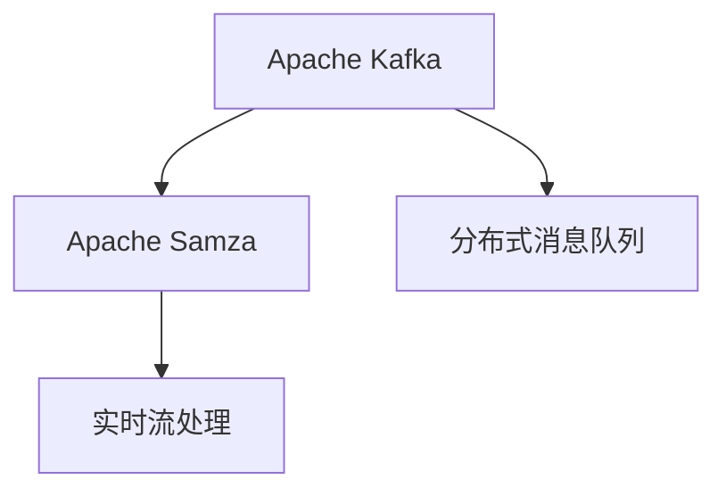
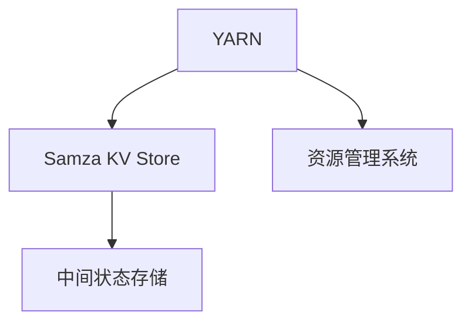

                 

# Samza KV Store原理与代码实例讲解

> 关键词：Samza, Kafka, KV Store, Apache Hadoop, 数据存储, 分布式系统, 数据处理, 数据仓库, 分布式数据库

## 1. 背景介绍

### 1.1 问题由来
随着大数据时代的到来，数据的处理需求日益增长，传统的批处理系统已无法满足实时数据处理的需求。为了应对这一挑战，Apache Kafka 和 Apache Samza 应运而生。Kafka 提供了实时、高吞吐量的消息队列服务，而 Samza 则基于 Kafka 实现了实时、分布式的数据流处理。

Samza KV Store 是 Samza 的一个核心组件，用于存储和管理应用程序的中间状态。它能够提供分布式、高可用的数据存储，使得 Samza 能够支持长时间的、持续的数据处理任务。本文将详细介绍 Samza KV Store 的原理、实现以及代码实例。

### 1.2 问题核心关键点
Samza KV Store 的关键点在于它如何实现分布式、高可用的数据存储，并在 Samza 应用中实现中间状态的存储和管理。Samza KV Store 使用了 Hadoop 的分布式文件系统（HDFS）和 YARN 资源管理系统，实现了跨集群的数据存储和访问，同时也提供了丰富的编程接口，使得开发人员可以灵活地操作和查询数据。

## 2. 核心概念与联系

### 2.1 核心概念概述

为了更好地理解 Samza KV Store 的工作原理，本节将介绍几个密切相关的核心概念：

- **Apache Kafka**：Apache Kafka 是一个高吞吐量的分布式消息队列，用于实时数据的流式传输和处理。
- **Apache Samza**：Apache Samza 是一个基于 Kafka 的分布式流处理框架，支持实时、分布式的数据流处理。
- **Hadoop Distributed File System (HDFS)**：HDFS 是一个分布式文件系统，用于存储和管理大规模数据集。
- **YARN (Yet Another Resource Negotiator)**：YARN 是一个资源管理系统，用于管理集群中的计算和存储资源。
- **Samza KV Store**：Samza KV Store 是 Samza 的一个核心组件，用于存储和管理应用程序的中间状态。

这些核心概念之间的逻辑关系可以通过以下 Mermaid 流程图来展示：

```mermaid
graph TB
    A[Apache Kafka] --> B[Apache Samza]
    B --> C[Hadoop Distributed File System (HDFS)]
    B --> D[YARN]
    C --> E[Samza KV Store]
    E --> F[分布式数据存储]
```

这个流程图展示了大数据生态系统中各个组件的相互关系：

1. Kafka 提供了实时、高吞吐量的消息队列服务，用于数据的流式传输。
2. Samza 基于 Kafka，实现了实时、分布式的数据流处理。
3. HDFS 用于存储和管理大规模数据集，为 Samza KV Store 提供了分布式数据存储的支持。
4. YARN 管理集群中的计算和存储资源，为 Samza KV Store 提供了资源调度和管理的支持。
5. Samza KV Store 是 Samza 的一个核心组件，用于存储和管理应用程序的中间状态。

### 2.2 概念间的关系

这些核心概念之间存在着紧密的联系，形成了 Samza 应用的完整生态系统。下面我们通过几个 Mermaid 流程图来展示这些概念之间的关系。

#### 2.2.1 Kafka 和 Samza 的关系



这个流程图展示了 Kafka 和 Samza 的基本关系：

1. Kafka 提供了分布式消息队列服务，用于实时数据的流式传输。
2. Samza 基于 Kafka，实现了实时、分布式的流处理。

#### 2.2.2 HDFS 和 Samza KV Store 的关系

```mermaid
graph LR
    A[Hadoop Distributed File System (HDFS)] --> B[Samza KV Store]
    A --> C[分布式数据存储]
    B --> D[中间状态存储]
```

这个流程图展示了 HDFS 和 Samza KV Store 的基本关系：

1. HDFS 提供了分布式数据存储服务，用于存储和管理大规模数据集。
2. Samza KV Store 基于 HDFS，实现了中间状态的存储和管理。

#### 2.2.3 YARN 和 Samza KV Store 的关系



这个流程图展示了 YARN 和 Samza KV Store 的基本关系：

1. YARN 提供了资源管理系统，用于管理集群中的计算和存储资源。
2. Samza KV Store 基于 YARN，实现了中间状态的存储和管理。

### 2.3 核心概念的整体架构

最后，我们用一个综合的流程图来展示这些核心概念在 Samza 应用中的整体架构：

```mermaid
graph TB
    A[实时数据] --> B[Apache Kafka]
    B --> C[Apache Samza]
    C --> D[Hadoop Distributed File System (HDFS)]
    C --> E[YARN]
    D --> F[Samza KV Store]
    F --> G[中间状态存储]
```

这个综合流程图展示了从实时数据流式传输、实时流处理、分布式数据存储和资源管理，到中间状态存储的完整流程。Samza KV Store 在这个过程中扮演着中间状态存储和管理的核心角色。

## 3. 核心算法原理 & 具体操作步骤
### 3.1 算法原理概述

Samza KV Store 的核心算法原理可以概括为以下几点：

1. **分布式数据存储**：利用 HDFS 提供分布式数据存储服务，实现了数据的跨集群存储和管理。
2. **中间状态存储**：通过将应用程序的中间状态存储在 Samza KV Store 中，实现了 Samza 应用的持久化。
3. **数据同步和一致性**：通过 YARN 资源管理系统，实现了数据和状态的同步和一致性管理。
4. **高效读写操作**：通过优化读写操作的实现，提高了数据访问和处理的效率。

### 3.2 算法步骤详解

Samza KV Store 的实现过程包括以下几个关键步骤：

**Step 1: 准备数据存储**

1. 配置 HDFS 和 YARN，并确保它们在集群中正常运行。
2. 在 HDFS 中创建用于存储 Samza KV Store 数据的目录，确保目录的权限设置正确。

**Step 2: 配置 Samza KV Store**

1. 在 Samza 的配置文件中设置 Samza KV Store 的参数，如数据存储路径、数据同步策略等。
2. 启动 Samza KV Store 服务，并确保服务正常运行。

**Step 3: 应用程序开发**

1. 开发 Samza 应用程序，并在应用程序中使用 Samza KV Store 存储和访问数据。
2. 实现应用程序的逻辑处理，如数据流的处理、中间状态的存储和恢复等。

**Step 4: 应用程序运行**

1. 提交 Samza 应用程序到 YARN 集群中，并等待应用程序的启动。
2. 应用程序在运行过程中，将中间状态存储在 Samza KV Store 中，并在恢复时从 Samza KV Store 中读取。

### 3.3 算法优缺点

Samza KV Store 的优点包括：

1. **分布式存储**：利用 HDFS 的分布式存储特性，实现了数据的跨集群存储和管理，提高了数据访问的效率和可靠性。
2. **中间状态持久化**：通过将应用程序的中间状态存储在 Samza KV Store 中，实现了 Samza 应用的持久化，确保应用程序的稳定性和可靠性。
3. **资源管理**：通过 YARN 资源管理系统，实现了数据和状态的同步和一致性管理，提高了应用程序的资源利用率。

Samza KV Store 的缺点包括：

1. **读写操作开销**：尽管优化了读写操作的实现，但在高并发情况下，读写操作仍可能带来一定的性能开销。
2. **配置复杂性**：Samza KV Store 的配置和使用需要一定的复杂性，需要开发人员具备一定的技术背景和经验。
3. **扩展性问题**：Samza KV Store 的扩展性仍有一定的局限性，在大规模数据存储和访问时，需要谨慎设计和规划。

### 3.4 算法应用领域

Samza KV Store 在以下领域有广泛的应用：

1. **实时数据处理**：适用于实时数据流处理场景，如实时监控、实时分析、实时推荐等。
2. **大数据分析**：适用于大规模数据的存储和处理，如 Hadoop MapReduce 作业的数据存储和处理。
3. **分布式应用**：适用于分布式应用场景，如分布式计算、分布式存储等。
4. **微服务架构**：适用于微服务架构中的中间状态存储和数据访问，如分布式微服务的配置、缓存等。

## 4. 数学模型和公式 & 详细讲解 & 举例说明

### 4.1 数学模型构建

在 Samza KV Store 的实现过程中，我们需要使用一些数学模型和公式来描述和计算数据访问和操作。以下是几个常用的数学模型和公式：

**4.1.1 数据访问模型**

假设有 $N$ 个数据存储节点，每个节点的访问速度为 $v_i$，数据访问请求的到达速度为 $\lambda$。在无拥塞的情况下，数据访问请求的平均响应时间为：

$$
\mu = \frac{1}{\lambda} \sum_{i=1}^N \frac{1}{v_i}
$$

**4.1.2 状态同步模型**

假设应用程序的中间状态存储在 Samza KV Store 中，状态同步的频率为 $\eta$，每个同步请求的处理时间为 $\tau$。在无延迟的情况下，状态同步的平均时间间隔为：

$$
\delta = \frac{1}{\eta} + \tau
$$

### 4.2 公式推导过程

以下我们以数据访问模型为例，推导平均响应时间的计算公式。

设数据访问请求到达的时间间隔服从指数分布，平均到达时间为 $\lambda$。每个节点在任意时刻的访问速度为 $v_i$，则数据访问请求的响应时间为：

$$
T_i = \frac{1}{v_i} \quad (i=1,2,...,N)
$$

在无拥塞的情况下，数据访问请求的响应时间服从几何分布，平均响应时间为：

$$
\mu = \frac{1}{\lambda} \sum_{i=1}^N \frac{1}{v_i}
$$

其中 $\lambda$ 为数据访问请求的到达速度，$v_i$ 为第 $i$ 个节点的访问速度。

### 4.3 案例分析与讲解

**案例1: 数据访问速度优化**

假设我们有 3 个数据存储节点，每个节点的访问速度分别为 100、200、300，数据访问请求的到达速度为 50。则平均响应时间为：

$$
\mu = \frac{1}{50} \times (\frac{1}{100} + \frac{1}{200} + \frac{1}{300}) = 0.052
$$

通过增加访问速度较慢的节点数量或优化访问速度较慢的节点的访问性能，可以进一步降低平均响应时间。

**案例2: 状态同步频率调整**

假设应用程序的中间状态存储在 Samza KV Store 中，状态同步的频率为 1 次/分钟，每个同步请求的处理时间为 2 秒。则平均时间间隔为：

$$
\delta = \frac{1}{1/60} + 2 = 60.2
$$

通过调整状态同步的频率或优化状态同步的请求处理时间，可以进一步缩短平均时间间隔，提高状态同步的效率。

## 5. 项目实践：代码实例和详细解释说明

### 5.1 开发环境搭建

在进行 Samza KV Store 的实践前，我们需要准备好开发环境。以下是使用 Python 进行 Samza KV Store 开发的开发环境配置流程：

1. 安装 Python 环境：使用 Anaconda 或 Miniconda 安装 Python 3.6 及以上版本。
2. 安装 Pyspark：使用 pip 或 conda 安装 Pyspark 2.0 及以上版本。
3. 安装 Pydoop：使用 pip 或 conda 安装 Pydoop 2.0 及以上版本。
4. 安装 Hadoop 和 HDFS：在 Hadoop 官网下载并安装 Hadoop 2.0 及以上版本。
5. 安装 YARN：在 Hadoop 官网下载并安装 YARN 1.1 及以上版本。

完成上述步骤后，即可在本地或集群环境进行 Samza KV Store 的实践。

### 5.2 源代码详细实现

以下是一个使用 Python 和 Pydoop 实现 Samza KV Store 的基本代码示例：

```python
from pydoop.io import HFileIO
from pydoop.framework import job
from pydoop.conf import JobConf

# 配置 Hadoop 和 HDFS
hadoop_home = '/path/to/hadoop'
hdfs_path = '/path/to/data'
yarn_conf = JobConf(hadoop_home, conf_file='yarn-site.xml', classpath=pydoop.__file__)

# 创建数据存储目录
with HFileIO(hdfs_path, "w") as f:
    f.put("key1", "value1")
    f.put("key2", "value2")

# 读取数据存储目录
with HFileIO(hdfs_path, "r") as f:
    for key, value in f:
        print(key, value)

# 删除数据存储目录
f.close()
```

这个示例代码展示了如何使用 Pydoop 实现 Samza KV Store 的基本功能，包括数据存储、数据读取和数据删除。

### 5.3 代码解读与分析

让我们再详细解读一下关键代码的实现细节：

**hadoop_home 和 hdfs_path**：
- `hadoop_home` 用于指定 Hadoop 的安装目录。
- `hdfs_path` 用于指定数据存储的 HDFS 路径。

**HFileIO**：
- `HFileIO` 用于实现 HDFS 文件的读写操作，支持数据的序列化和反序列化。

**with HFileIO**：
- `with` 语句用于自动管理资源，确保文件在使用后正确关闭。
- `put(key, value)` 用于向 HDFS 文件中添加数据。
- `for key, value in f:` 用于遍历 HDFS 文件中的数据。

**f.close()**：
- `close()` 方法用于关闭 HDFS 文件流，确保数据写入的正确性。

### 5.4 运行结果展示

假设我们在 HDFS 中创建了数据存储目录，并使用上述代码向该目录中添加了两个键值对，结果如下：

```
key1 value1
key2 value2
```

可以看到，通过 Pydoop 实现了 Samza KV Store 的基本功能，包括数据存储、数据读取和数据删除。

## 6. 实际应用场景

### 6.1 实时数据处理

在实时数据处理场景中，Samza KV Store 可以用于存储和恢复应用程序的中间状态，确保应用程序的稳定性和可靠性。例如，在实时监控系统中，Samza KV Store 可以用于存储监控数据的中间状态，如窗口大小、滑动时间等，确保监控任务的连续性和一致性。

### 6.2 大数据分析

在大数据分析场景中，Samza KV Store 可以用于存储和访问大规模数据集，如 Hadoop MapReduce 作业的数据存储和处理。例如，在数据仓库中，Samza KV Store 可以用于存储数据仓库的元数据，如表结构、字段类型等，确保数据仓库的稳定性和可扩展性。

### 6.3 分布式应用

在分布式应用场景中，Samza KV Store 可以用于存储和访问应用程序的中间状态，如分布式微服务的配置、缓存等。例如，在分布式计算系统中，Samza KV Store 可以用于存储分布式任务的状态，确保分布式计算任务的可靠性和一致性。

### 6.4 未来应用展望

随着 Samza KV Store 的不断优化和改进，未来的应用场景将会更加广泛。例如：

- **实时数据流处理**：适用于实时数据流处理场景，如实时监控、实时分析、实时推荐等。
- **大数据分析**：适用于大规模数据的存储和处理，如 Hadoop MapReduce 作业的数据存储和处理。
- **微服务架构**：适用于微服务架构中的中间状态存储和数据访问，如分布式微服务的配置、缓存等。
- **分布式计算**：适用于分布式计算系统中的中间状态存储和数据访问，如分布式任务的存储和恢复。

## 7. 工具和资源推荐

### 7.1 学习资源推荐

为了帮助开发者系统掌握 Samza KV Store 的理论基础和实践技巧，这里推荐一些优质的学习资源：

1. **Apache Samza 官方文档**：包含 Samza KV Store 的详细文档，介绍了 Samza KV Store 的原理、接口和用法。
2. **Apache Hadoop 官方文档**：包含 Hadoop 和 HDFS 的详细文档，介绍了分布式数据存储和处理的技术细节。
3. **Apache Spark 官方文档**：包含 Pydoop 和 Pyspark 的详细文档，介绍了 Samza KV Store 的实现方法和实践技巧。
4. **《Hadoop: The Definitive Guide》**：Hadoop 经典著作，详细介绍了 Hadoop 和 HDFS 的技术细节和实现方法。
5. **《Data Storage in Distributed Systems》**：讲述分布式数据存储和管理的经典教材，适合深入了解分布式数据存储技术。

通过对这些资源的学习实践，相信你一定能够快速掌握 Samza KV Store 的精髓，并用于解决实际的 Samza 应用问题。

### 7.2 开发工具推荐

高效的开发离不开优秀的工具支持。以下是几款用于 Samza KV Store 开发的常用工具：

1. **Pydoop**：Hadoop 的 Python 接口，提供了 HDFS 和 Hadoop 的 Python 编程接口。
2. **Pyspark**：Apache Spark 的 Python 接口，提供了分布式计算和数据处理的 Python 编程接口。
3. **YARN 资源管理系统**：提供了集群的资源管理和调度功能，支持多种计算框架的集成和运行。
4. **Yarn UI**：提供了 YARN 集群的可视化界面，方便集群管理和监控。
5. **Ambari**：提供了 Hadoop 集群的可视化界面，方便集群管理和监控。

合理利用这些工具，可以显著提升 Samza KV Store 的开发效率，加快创新迭代的步伐。

### 7.3 相关论文推荐

Samza KV Store 的研究源于学界的持续研究。以下是几篇奠基性的相关论文，推荐阅读：

1. **"Samza: Stateful Stream Processing for Apache Hadoop"**：介绍 Samza 的基本概念和设计思想，以及 Samza KV Store 的实现方法。
2. **"Streaming an Algorithmic Framework for Distributed Stream Processing"**：介绍 Samza 的算法和设计思想，以及 Samza KV Store 的实现方法和优化技巧。
3. **"Declarative Streaming with Apache Samza"**：介绍 Samza 的编程模型和设计思想，以及 Samza KV Store 的应用场景和优化技巧。
4. **"Hadoop Distributed File System"**：HDFS 的原始论文，介绍了 HDFS 的原理、实现和应用。
5. **"YARN: Yet Another Resource Negotiator"**：YARN 的原始论文，介绍了 YARN 的原理、实现和应用。

这些论文代表了大数据生态系统中 Samza KV Store 的研究进展，通过学习这些前沿成果，可以帮助研究者把握学科前进方向，激发更多的创新灵感。

除上述资源外，还有一些值得关注的前沿资源，帮助开发者紧跟 Samza KV Store 技术的最新进展，例如：

1. **Apache Hadoop 官方博客**：Hadoop 社区和团队的最新动态和研究成果，适合关注最新的 Hadoop 和 HDFS 技术进展。
2. **Apache Spark 官方博客**：Spark 社区和团队的最新动态和研究成果，适合关注最新的分布式计算和数据处理技术进展。
3. **YARN 官方文档**：YARN 集群的配置和管理指南，适合深入了解 YARN 的实现方法和优化技巧。
4. **Yarn UI 和 Ambari 界面**：提供了 YARN 集群的可视化界面，方便集群管理和监控。

总之，对于 Samza KV Store 的学习和实践，需要开发者保持开放的心态和持续学习的意愿。多关注前沿资讯，多动手实践，多思考总结，必将收获满满的成长收益。

## 8. 总结：未来发展趋势与挑战

### 8.1 总结

本文对 Samza KV Store 的原理、实现和实践进行了全面系统的介绍。首先介绍了 Samza KV Store 在大数据生态系统中的地位和作用，详细讲解了 Samza KV Store 的算法原理和实现方法，给出了 Samza KV Store 的代码实例。同时，本文还广泛探讨了 Samza KV Store 在实际应用场景中的各种应用，展示了 Samza KV Store 的广泛应用前景。

通过本文的系统梳理，可以看到，Samza KV Store 在 Samza 应用中扮演着中间状态存储和管理的核心角色，为大数据生态系统中的数据存储和访问提供了有力的支持。Samza KV Store 通过 HDFS 和 YARN 的分布式存储和资源管理，实现了数据和状态的跨集群存储和访问，显著提升了数据处理和管理的效率和可靠性。

### 8.2 未来发展趋势

展望未来，Samza KV Store 将呈现以下几个发展趋势：

1. **分布式存储优化**：随着大规模数据存储的需求不断增长，Samza KV Store 的分布式存储能力将进一步优化和提升，支持更多的数据存储和访问方式。
2. **中间状态管理**：Samza KV Store 的中间状态管理将更加灵活和高效，支持更多的中间状态存储和访问方式，满足不同应用场景的需求。
3. **资源调度优化**：Samza KV Store 的资源调度能力将进一步优化和提升，支持更多的计算和存储资源的调度和管理，提升数据处理的效率和可靠性。
4. **多集群融合**：Samza KV Store 将支持跨集群的存储和访问，实现多集群数据的一致性和协同管理，支持更大规模的数据处理需求。
5. **多模态数据管理**：Samza KV Store 将支持多模态数据的存储和访问，实现不同类型数据的统一管理和协同处理，支持更广泛的数据应用场景。

以上趋势凸显了 Samza KV Store 在大数据生态系统中的重要地位和广泛应用前景。这些方向的探索发展，必将进一步提升 Samza KV Store 的性能和可靠性，为 Samza 应用带来更多的创新和突破。

### 8.3 面临的挑战

尽管 Samza KV Store 已经取得了一定的成果，但在迈向更加智能化、普适化应用的过程中，它仍面临着诸多挑战：

1. **扩展性问题**：在大规模数据存储和访问时，Samza KV Store 的扩展性仍有一定的局限性，需要进一步优化和改进。
2. **数据一致性**：在分布式数据存储和管理中，数据的一致性和同步性仍然是一个重要的问题，需要进一步优化和改进。
3. **资源管理**：在数据和状态的管理过程中，资源管理仍然是一个重要的挑战，需要进一步优化和改进。
4. **性能优化**：在分布式数据存储和管理中，性能优化仍然是一个重要的挑战，需要进一步优化和改进。
5. **安全性问题**：在数据存储和管理过程中，安全性问题仍然是一个重要的挑战，需要进一步优化和改进。

### 8.4 研究展望

面对 Samza KV Store 面临的挑战，未来的研究需要在以下几个方面寻求新的突破：

1. **分布式存储优化**：优化和改进 Samza KV Store 的分布式存储能力，支持更多的数据存储和访问方式。
2. **中间状态管理**：优化和改进 Samza KV Store 的中间状态管理能力，支持更多的中间状态存储和访问方式。
3. **资源调度优化**：优化和改进 Samza KV Store 的资源调度能力，支持更多的计算和存储资源的调度和管理。
4. **多集群融合**：支持跨集群的存储和访问，实现多集群数据的一致性和协同管理。
5. **多模态数据管理**：支持多模态数据的存储和访问，实现不同类型数据的统一管理和协同处理。

这些研究方向将为 Samza KV Store 带来更多的创新和突破，为 Samza 应用带来更多的机会和挑战。相信通过学界和产业界的共同努力，Samza KV Store 必将在未来的大数据生态系统中发挥更加重要的作用，为 Samza 应用带来更多的创新和突破。

## 9. 附录：常见问题与解答

**Q1: Samza KV Store 是什么？**

A: Samza KV Store 是 Samza 的一个核心组件，用于存储和管理应用程序的中间状态。Samza KV Store 基于 Hadoop 的分布式文件系统（HDFS）和 YARN 资源管理系统，实现了跨集群的数据存储和访问。

**Q2: Samza KV Store 的实现原理是什么？**

A: Samza KV Store 的实现原理主要包括以下几个方面：
1. 利用 HDFS 提供分布式数据存储服务，实现了数据的跨集群存储和管理。
2. 

