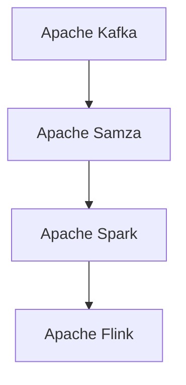
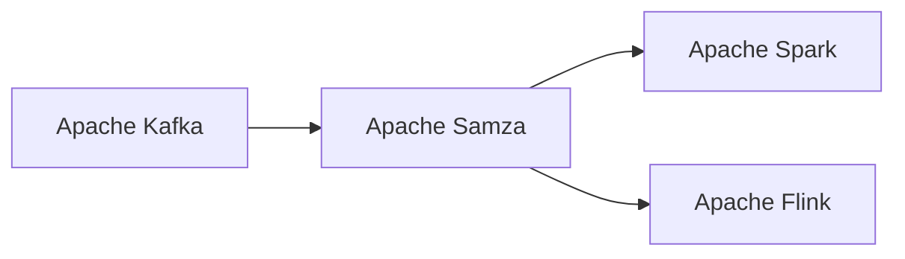
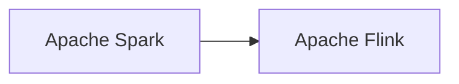
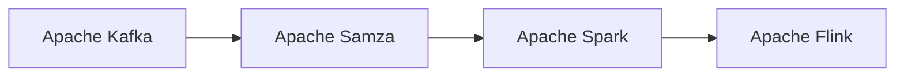

                 

# Samza KV Store原理与代码实例讲解

> 关键词：Samza, KV Store, Apache Kafka, Stream Processing, Key-Value Storage, Apache Spark, Flink

## 1. 背景介绍

### 1.1 问题由来
在当今大数据时代，企业需要处理的数据量呈现爆炸性增长。如何在高速数据流中提取有价值的信息，并将这些信息长期存储，是企业面临的一大挑战。传统的ETL（Extract, Transform, Load）流程耗时长、复杂度高，难以满足实时性要求。而基于流式计算的KV Store（Key-Value Store）技术，以其高吞吐量、低延迟的特性，成为了处理大数据流的有效手段。

### 1.2 问题核心关键点
KV Store是一种以键值对形式存储数据的数据库。它具有低延迟、高吞吐量、容错性好、分布式部署等特点，能够满足企业对于海量数据存储和处理的需要。常见的KV Store有Apache Kafka、Apache Samza、Redis等。

KV Store的核心思想是将数据分为键和值两部分，使用键作为数据的唯一标识，通过键值对存储数据。基于KV Store的系统通常包含数据流处理和存储两个环节，数据流处理系统负责将数据流分为键值对，并将键值对写入KV Store。

KV Store的主要应用场景包括实时数据处理、事件驱动架构、缓存系统等。通过KV Store，企业可以构建高速、可靠的实时数据处理系统，高效地存储和管理数据。

### 1.3 问题研究意义
KV Store技术的研究，对于拓展企业数据处理能力、提升业务处理效率、优化数据存储方案具有重要意义：

1. 高效处理海量数据：KV Store可以处理高速、大规模的数据流，满足企业对于实时数据处理的需要。
2. 降低数据处理成本：基于KV Store的系统可以自动化数据处理和存储，减少人工干预和操作成本。
3. 提升业务处理速度：KV Store的低延迟特性，可以大幅提升业务处理速度，满足企业对于高实时性的要求。
4. 灵活扩展系统规模：KV Store支持分布式部署，可以根据业务需求灵活扩展系统规模。
5. 强化数据安全和可靠性：KV Store具有高可用性、故障恢复能力，可以保障数据的安全性和可靠性。

## 2. 核心概念与联系

### 2.1 核心概念概述

为更好地理解KV Store的工作原理和设计思想，本节将介绍几个密切相关的核心概念：

- KV Store（Key-Value Store）：一种以键值对形式存储数据的数据库。常见的KV Store有Apache Kafka、Apache Samza、Redis等。
- Apache Kafka：一种高吞吐量、低延迟的消息队列系统，支持分布式部署，常用于数据流处理。
- Apache Samza：一个基于Apache Kafka的流式处理框架，支持多数据流处理引擎的统一接口。
- Apache Spark：一个通用的计算框架，支持批处理、流处理、机器学习等多种计算模型。
- Apache Flink：一个开源的流处理框架，支持分布式处理、状态管理、容错机制等。

这些核心概念之间的逻辑关系可以通过以下Mermaid流程图来展示：



这个流程图展示了大数据流处理生态系统中几个关键组件之间的关系：Apache Kafka作为数据流传输和存储系统，Apache Samza作为基于Kafka的流式处理框架，Apache Spark和Apache Flink作为通用计算框架，支持多种计算模型和处理方式。

### 2.2 概念间的关系

这些核心概念之间存在着紧密的联系，形成了大数据流处理系统的完整生态系统。下面通过几个Mermaid流程图来展示这些概念之间的关系。

#### 2.2.1 Apache Kafka与Apache Samza的关系



这个流程图展示了Apache Kafka与Apache Samza之间的关系。Apache Kafka是Apache Samza的基础数据源，Apache Samza利用Kafka的消息队列特性，实现了流式数据处理。

#### 2.2.2 Apache Spark与Apache Flink的关系



这个流程图展示了Apache Spark与Apache Flink之间的关系。两者都是通用的计算框架，支持多种计算模型，可以相互协作，共同构建更加灵活、高效的数据流处理系统。

#### 2.2.3 数据流处理流程



这个流程图展示了基于Apache Kafka的流式处理流程。数据通过Apache Kafka进行传输和存储，Apache Samza基于Kafka的消息队列特性，实现流式数据处理，并将处理结果发送到Apache Spark或Apache Flink进行进一步分析计算。

### 2.3 核心概念的整体架构

最后，我们用一个综合的流程图来展示这些核心概念在大数据流处理系统中的整体架构：


这个综合流程图展示了Apache Kafka、Apache Samza、Apache Spark和Apache Flink在大数据流处理系统中的整体架构。Kafka提供数据传输和存储功能，Samza基于Kafka实现流式数据处理，Spark和Flink提供通用的计算引擎，支持多种计算模型和处理方式。

## 3. 核心算法原理 & 具体操作步骤
### 3.1 算法原理概述

基于KV Store的系统，核心算法原理基于Apache Samza框架。其基本流程包括数据流处理和KV Store存储两个环节。

数据流处理过程如下：
1. 数据通过Apache Kafka流式传输。
2. Apache Samza从Kafka中读取数据，进行分布式处理，生成键值对。
3. 键值对通过Samza的适配器，写入KV Store，进行存储。

KV Store存储过程如下：
1. 键值对写入KV Store。
2. KV Store对键值对进行存储和持久化。
3. KV Store提供API接口，支持数据查询和检索。

### 3.2 算法步骤详解

#### 3.2.1 数据流处理步骤

1. **数据采集与传输**：
   - 数据通过Apache Kafka流式传输，Kafka提供高吞吐量、低延迟的数据传输和存储功能，支持分布式部署。
   - 数据采集器将数据从各种数据源（如数据库、API接口、消息队列等）接入Kafka。

2. **数据处理**：
   - Apache Samza从Kafka中读取数据，进行分布式处理。
   - Samza提供多种计算引擎（如Spark、Flink、Storm等），可以灵活选择。
   - Samza支持多种数据源和目标（如HDFS、S3、HBase等），可以灵活扩展。

3. **键值对生成**：
   - 在数据处理过程中，生成键值对。
   - 键值对可以使用自定义的键和值，满足不同业务需求。

#### 3.2.2 KV Store存储步骤

1. **键值对写入**：
   - 通过Samza的适配器，将键值对写入KV Store。
   - 适配器支持多种格式和协议，可以灵活对接不同的数据源和存储系统。

2. **数据存储与持久化**：
   - KV Store对键值对进行存储和持久化。
   - 支持多种存储引擎（如Memcached、Redis、HBase等），可以灵活扩展。

3. **数据查询与检索**：
   - 提供API接口，支持数据查询和检索。
   - 支持多种查询方式（如key-based、range-based、index-based等），可以灵活满足不同业务需求。

### 3.3 算法优缺点

Apache Samza的优点包括：
1. 高吞吐量、低延迟：通过Apache Kafka作为数据传输和存储系统，提供高吞吐量、低延迟的特性。
2. 分布式部署：支持分布式部署，可以根据业务需求灵活扩展系统规模。
3. 多种计算引擎：支持多种计算引擎（如Spark、Flink、Storm等），可以灵活选择。
4. 多种数据源和目标：支持多种数据源和目标（如HDFS、S3、HBase等），可以灵活扩展。

Apache Samza的缺点包括：
1. 学习曲线较陡：由于Samza涉及多个组件和技术栈，学习曲线较陡，需要一定的技术积累。
2. 性能调优困难：Samza的性能调优需要一定的经验和技术积累，需要根据具体业务需求进行优化。
3. 配置复杂：Samza的配置较为复杂，需要根据业务需求进行配置和优化。

### 3.4 算法应用领域

基于KV Store的系统，主要应用于以下领域：

- 实时数据处理：适用于需要高吞吐量、低延迟的实时数据处理场景，如在线广告投放、金融交易、物联网等。
- 事件驱动架构：适用于事件驱动架构，支持数据的实时采集、处理和存储。
- 缓存系统：适用于缓存系统，支持快速的数据访问和查询。
- 大数据分析：适用于大数据分析，支持海量数据的存储和处理。
- 分布式计算：适用于分布式计算，支持多种计算引擎和存储引擎的统一接口。

## 4. 数学模型和公式 & 详细讲解  
### 4.1 数学模型构建

基于Apache Samza的KV Store系统，可以通过以下数学模型来描述：

- **数据流模型**：假设数据流由多个数据源产生，每个数据源生成N个数据点，数据点的时间戳为T，数据点之间的间隔为D，数据流的总长度为L。数据流模型可以表示为：

$$
L = N \times D \times T
$$

- **KV Store模型**：假设KV Store存储的数据量为M，每个键值对的大小为S，KV Store的存储效率为E。KV Store模型可以表示为：

$$
M = S \times E
$$

### 4.2 公式推导过程

以下我们以KV Store的存储效率为例，推导公式：

- **存储效率公式**：假设KV Store的写入速度为W，读取速度为R，存储容量为C。存储效率E可以表示为：

$$
E = \frac{W + R}{C}
$$

- **写入速度公式**：假设每个键值对的大小为S，写入速度为W，写入批大小为B。写入速度公式可以表示为：

$$
W = \frac{S \times B}{T}
$$

- **读取速度公式**：假设每个键值对的大小为S，读取速度为R，读取批大小为B。读取速度公式可以表示为：

$$
R = \frac{S \times B}{T}
$$

### 4.3 案例分析与讲解

假设我们需要在一个包含1亿条数据的实时数据流中，存储每个键值对的平均大小为4KB，存储效率为80%，读取速度为写入速度的2倍。根据上述公式，可以计算出：

- 写入速度为：

$$
W = \frac{4KB \times B}{T}
$$

- 读取速度为：

$$
R = \frac{4KB \times B}{T}
$$

- 存储容量为：

$$
C = \frac{S \times E}{W + R}
$$

## 5. 项目实践：代码实例和详细解释说明
### 5.1 开发环境搭建

在进行Samza KV Store项目实践前，我们需要准备好开发环境。以下是使用Python进行Samza开发的环境配置流程：

1. 安装Apache Kafka：从官网下载并安装Apache Kafka，用于数据流传输和存储。

2. 安装Apache Samza：从官网下载并安装Apache Samza，用于基于Kafka的流式处理。

3. 安装Apache Spark：从官网下载并安装Apache Spark，用于分布式计算。

4. 安装Apache Flink：从官网下载并安装Apache Flink，用于分布式流处理。

5. 安装Python环境：安装Anaconda或Miniconda，用于Python环境管理。

6. 安装必要的Python包：安装numpy、pandas、pykafka、samber等必要的Python包。

完成上述步骤后，即可在开发环境中开始Samza KV Store项目实践。

### 5.2 源代码详细实现

下面我们以一个简单的KV Store示例为例，给出使用Python进行Samza开发的代码实现。

首先，定义数据流采集器：

```python
from pykafka import KafkaConsumer
from samza import SamzaContext, SimpleTask

class DataConsumer(SimpleTask):
    def __init__(self, conf, ctx):
        super(DataConsumer, self).__init__(conf, ctx)
        self.kafka = KafkaConsumer(conf.get('kafka_topic'), bootstrap_servers=conf.get('kafka_broker'))
    
    def process(self, data):
        for message in self.kafka:
            print(message)

# 配置参数
conf = SamzaContext.get_context().configure({
    'bootstrap_servers': 'localhost:9092',
    'kafka_topic': 'test-topic',
    'input_format': 'JSON',
    'output_format': 'JSON'
})
```

然后，定义KV Store适配器：

```python
from samza.python_kafka import Kafka
from samza.python_kafka import KafkaPutAdapter

class KVStoreAdapter(KafkaPutAdapter):
    def __init__(self, conf, ctx):
        super(KVStoreAdapter, self).__init__(conf, ctx)
        self.kafka = Kafka(conf.get('kafka_topic'), conf.get('kafka_broker'))
    
    def process(self, data):
        key, value = data.get('key'), data.get('value')
        self.kafka.put(key, value)

# 配置参数
conf = SamzaContext.get_context().configure({
    'bootstrap_servers': 'localhost:9092',
    'kafka_topic': 'test-topic',
    'input_format': 'JSON',
    'output_format': 'JSON'
})
```

最后，启动Samza作业：

```python
if __name__ == '__main__':
    DataConsumer(SamzaContext.get_context().configure({
        'bootstrap_servers': 'localhost:9092',
        'kafka_topic': 'test-topic',
        'input_format': 'JSON',
        'output_format': 'JSON'
    }), SamzaContext.get_context()).run()
    
    KVStoreAdapter(SamzaContext.get_context().configure({
        'bootstrap_servers': 'localhost:9092',
        'kafka_topic': 'test-topic',
        'input_format': 'JSON',
        'output_format': 'JSON'
    }), SamzaContext.get_context()).run()
```

以上就是使用Python进行Samza开发的代码实现。可以看到，通过Samza的Python接口，可以方便地实现数据流处理和KV Store存储。

### 5.3 代码解读与分析

让我们再详细解读一下关键代码的实现细节：

**DataConsumer类**：
- `__init__`方法：初始化Kafka消费者，读取指定topic的数据。
- `process`方法：处理每个数据流事件，打印消息内容。

**KVStoreAdapter类**：
- `__init__`方法：初始化Kafka适配器，将数据写入指定topic。
- `process`方法：处理每个数据流事件，将键值对写入KV Store。

**启动Samza作业**：
- 在`if __name__ == '__main__'`中，先启动DataConsumer任务，再启动KVStoreAdapter任务。

在实际应用中，需要根据具体业务需求进行更复杂的逻辑设计和优化。Samza还支持多种数据源和目标（如HDFS、S3、HBase等），可以根据业务需求进行灵活扩展。

## 6. 实际应用场景

### 6.1 智能推荐系统

基于KV Store的系统，可以用于构建智能推荐系统。通过实时采集用户行为数据，利用Samza进行流式处理和分析，将用户行为转化为推荐结果，存储到KV Store中。用户登录时，通过KV Store查询推荐结果，快速提供个性化推荐服务。

### 6.2 实时监控系统

基于KV Store的系统，可以用于构建实时监控系统。通过实时采集设备数据，利用Samza进行流式处理和分析，将设备状态信息存储到KV Store中。监控系统通过KV Store查询设备状态，及时发现异常情况，采取措施进行处理。

### 6.3 金融交易系统

基于KV Store的系统，可以用于构建金融交易系统。通过实时采集交易数据，利用Samza进行流式处理和分析，将交易数据存储到KV Store中。交易系统通过KV Store查询交易数据，进行实时的市场分析和交易决策。

### 6.4 未来应用展望

随着KV Store技术的不断演进，未来将会有更多的应用场景。KV Store的高吞吐量、低延迟特性，使其在实时数据处理、事件驱动架构、缓存系统等场景中具有广泛的应用前景。

未来，基于KV Store的系统将进一步融合机器学习、人工智能等技术，构建更加智能、高效的流式数据处理系统。例如，可以引入机器学习算法，对实时数据进行分析和预测，提升业务决策的精准度和效率。

## 7. 工具和资源推荐
### 7.1 学习资源推荐

为了帮助开发者系统掌握Samza KV Store的理论基础和实践技巧，这里推荐一些优质的学习资源：

1. Apache Samza官方文档：Samza的官方文档，提供了详细的使用指南和代码示例，是学习Samza的必备资源。

2. Apache Kafka官方文档：Kafka的官方文档，提供了详细的API接口和使用示例，是学习Kafka的必备资源。

3. Apache Spark官方文档：Spark的官方文档，提供了详细的API接口和使用示例，是学习Spark的必备资源。

4. Apache Flink官方文档：Flink的官方文档，提供了详细的API接口和使用示例，是学习Flink的必备资源。

5. 《Hands-On Samza》书籍：一本全面介绍Samza的书籍，详细介绍了Samza的架构和设计思想，适合进阶学习。

6. Udemy、Coursera等在线课程：提供Samza和Kafka的在线课程，适合系统学习和实战练习。

通过对这些资源的学习实践，相信你一定能够快速掌握Samza KV Store的精髓，并用于解决实际的业务问题。

### 7.2 开发工具推荐

高效的开发离不开优秀的工具支持。以下是几款用于Samza KV Store开发的常用工具：

1. PyKafka：一个Python Kafka客户端库，支持Kafka的消息队列特性。

2. PySamza：一个Python Samza客户端库，支持Samza的流式处理特性。

3. PySpark：一个Python Spark客户端库，支持Spark的分布式计算特性。

4. PyFlink：一个Python Flink客户端库，支持Flink的分布式流处理特性。

5. Trello：一个任务管理工具，可以方便地跟踪和管理Samza作业的开发和部署。

6. Jenkins：一个持续集成工具，可以自动构建和部署Samza作业，提高开发效率。

合理利用这些工具，可以显著提升Samza KV Store项目的开发效率，加快创新迭代的步伐。

### 7.3 相关论文推荐

Samza KV Store技术的发展源于学界的持续研究。以下是几篇奠基性的相关论文，推荐阅读：

1. Samza: Apache Kafka-based Distributed Streaming Processing System：Samza的架构和设计思想。

2. Fast and Fault-Tolerant Stream Processing at Scale：Samza的高吞吐量、低延迟特性。

3. MapReduce in Hadoop：一种分布式计算框架，支持批处理和流处理。

4. Apache Spark：一种通用计算框架，支持多种计算模型和处理方式。

5. Apache Flink：一种分布式流处理框架，支持多种计算模型和处理方式。

这些论文代表了大数据流处理技术的发展脉络。通过学习这些前沿成果，可以帮助研究者把握学科前进方向，激发更多的创新灵感。

除上述资源外，还有一些值得关注的前沿资源，帮助开发者紧跟Samza KV Store技术的最新进展，例如：

1. arXiv论文预印本：人工智能领域最新研究成果的发布平台，包括大量尚未发表的前沿工作，学习前沿技术的必读资源。

2. 业界技术博客：如Apache Kafka、Apache Samza、Apache Spark、Apache Flink等顶尖实验室的官方博客，第一时间分享他们的最新研究成果和洞见。

3. 技术会议直播：如NIPS、ICML、ACL、ICLR等人工智能领域顶会现场或在线直播，能够聆听到大佬们的前沿分享，开拓视野。

4. GitHub热门项目：在GitHub上Star、Fork数最多的Samza和Kafka相关项目，往往代表了该技术领域的发展趋势和最佳实践，值得去学习和贡献。

5. 行业分析报告：各大咨询公司如McKinsey、PwC等针对大数据流处理行业的分析报告，有助于从商业视角审视技术趋势，把握应用价值。

总之，对于Samza KV Store技术的学习和实践，需要开发者保持开放的心态和持续学习的意愿。多关注前沿资讯，多动手实践，多思考总结，必将收获满满的成长收益。

## 8. 总结：未来发展趋势与挑战

### 8.1 总结

本文对基于KV Store的Apache Samza系统进行了全面系统的介绍。首先阐述了KV Store和大数据流处理的背景和意义，明确了Samza在大数据流处理系统中的重要地位。其次，从原理到实践，详细讲解了Samza的架构和实现细节，给出了Samza KV Store项目的完整代码实例。同时，本文还广泛探讨了Samza在智能推荐、实时监控、金融交易等领域的实际应用场景，展示了Samza的广泛应用前景。此外，本文精选了Samza技术的各类学习资源，力求为读者提供全方位的技术指引。

通过本文的系统梳理，可以看到，基于KV Store的Samza系统在大数据流处理领域具有广泛的应用前景。Samza以其高吞吐量、低延迟的特性，能够处理高速、大规模的数据流，满足企业对于实时数据处理的需要。通过Samza，企业可以构建灵活、高效的流式数据处理系统，实现数据的实时采集、处理和存储。未来，伴随Samza技术的持续演进，大数据流处理系统必将在更多领域得到应用，为企业的数字化转型提供强大的技术支持。

### 8.2 未来发展趋势

展望未来，Samza技术的发展将呈现以下几个趋势：

1. 性能优化：Samza将进一步优化性能，提升系统吞吐量和响应速度，满足更复杂的业务需求。
2. 分布式扩展：Samza将支持更灵活的分布式扩展，支持更多数据源和目标，提升系统弹性。
3. 实时计算：Samza将进一步强化实时计算能力，支持更多的计算模型和处理方式，提升系统灵活性。
4. 数据治理：Samza将强化数据治理能力，支持更多的数据存储和处理方式，提升系统可靠性。
5. 跨平台协作：Samza将支持更多的平台和框架，实现跨平台协作，提升系统生态多样性。

以上趋势凸显了Samza技术的广阔前景。这些方向的探索发展，必将进一步提升大数据流处理系统的性能和应用范围，为企业的数字化转型提供更加强大的技术支撑。

### 8.3 面临的挑战

尽管Samza技术已经取得了瞩目成就，但在迈向更加智能化、普适化应用的过程中，它仍面临着诸多挑战：

1. 学习曲线陡峭：Samza涉及多个组件和技术栈，学习曲线较陡，需要一定的技术积累。
2. 性能调优困难：Samza的性能调优需要一定的经验和技术积累，需要根据具体业务需求进行优化。
3. 配置复杂：Samza的配置较为复杂，需要根据业务需求进行配置和优化。
4. 数据处理复杂：Samza需要处理多种数据源和目标，复杂的数据处理流程可能影响系统性能。
5. 数据一致性：Samza需要保证数据一致性和可靠性，复杂的数据一致性维护可能影响系统稳定性。

正视Samza面临的这些挑战，积极应对并寻求突破，将是大数据流处理系统走向成熟的必由之路。相信随着学界和产业界的共同努力，这些挑战终将一一被克服，Samza技术必将在构建高效、可靠、灵活的大数据流处理系统中发挥更大的作用。

### 8.4 研究展望

面对Samza面临的挑战，未来的研究需要在以下几个方面寻求新的突破：

1. 优化性能调优方法：开发更加高效的性能调优方法，减少系统调优的时间和成本。
2. 简化系统配置：优化系统配置流程，提供更直观、易用的配置工具，降低系统配置门槛。
3. 强化数据处理能力：优化数据处理流程，提升系统数据处理效率和稳定性。
4. 提升数据一致性：强化数据一致性维护，提升系统可靠性和稳定性。
5. 增强跨平台协作：支持更多的平台和框架，实现跨平台协作，提升系统生态多样性。

这些研究方向的探索，必将引领Samza技术迈向更高的台阶，为构建高效、可靠、灵活的大数据流处理系统提供更强大的技术支撑。面向未来，Samza技术还需要与其他大数据技术进行更深入的融合，如Hadoop、Spark、Flink等，多路径协同发力，共同推动大数据流处理技术的进步。只有勇于创新、敢于突破，才能不断拓展Samza的边界，让大数据流处理技术在更多领域发挥更大作用。

## 9.

