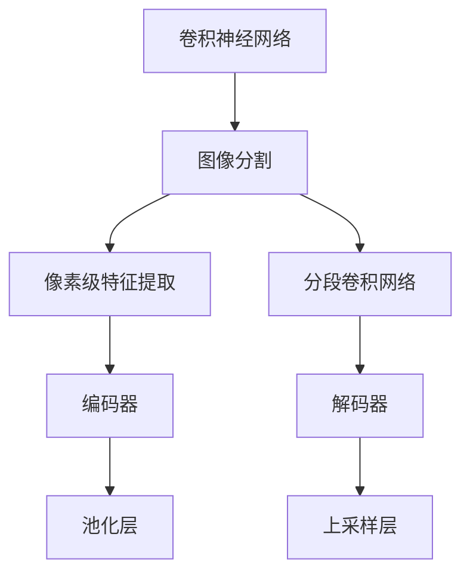
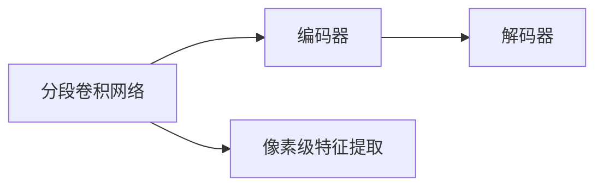
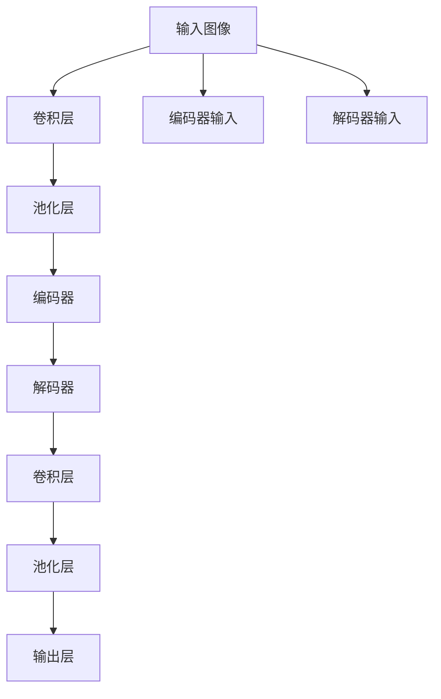
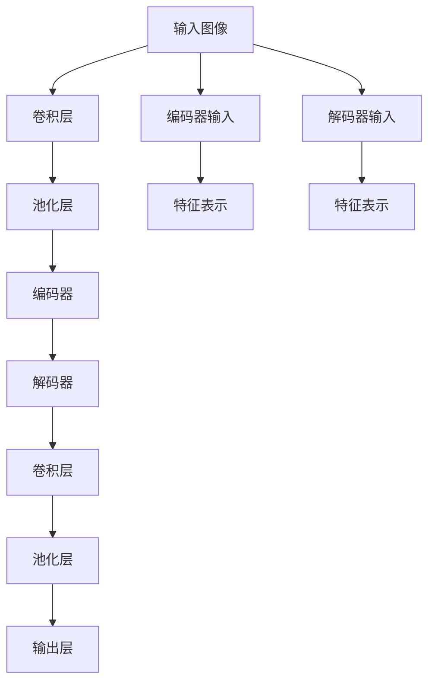

                 

# SegNet原理与代码实例讲解

> 关键词：

## 1. 背景介绍

### 1.1 问题由来
图像分割是计算机视觉领域中极为重要的任务之一，具有广泛的应用前景。传统的图像分割方法主要基于像素级的特征提取和分类，但受限于图像大小、分辨率等因素，计算复杂度较高，且难以实现精细的分割效果。与此同时，随着深度学习技术的蓬勃发展，深度神经网络在图像分割上取得了显著成效，逐渐成为主流技术。

### 1.2 问题核心关键点
随着深度神经网络的发展，分段卷积网络（Segmentation Convolutional Networks，简称SegNet）逐渐走入研究者的视线。SegNet作为早期深度网络在图像分割中的应用，凭借其简单、高效的特点，取得了优秀的分割效果。本文将对SegNet的工作原理进行详细讲解，并给出代码实例，帮助读者深入理解其核心算法和实现细节。

### 1.3 问题研究意义
研究SegNet的原理和实现方法，对于理解深度神经网络在图像分割中的应用，提升图像分割模型的性能，具有重要意义：

1. SegNet作为早期深度网络在图像分割中的应用，具有里程碑式的意义，是深度学习在图像分割领域的开端之一。
2. SegNet具有较高的精度和较快的推理速度，能够适应大规模的图像分割任务，具有较强的实用性。
3. SegNet的设计思想简单而有效，可以作为初学者入门深度学习图像分割的桥梁。
4. SegNet的代码实现简洁易懂，适合作为深度学习项目开发的范例，帮助开发者更好地理解深度神经网络模型。

## 2. 核心概念与联系

### 2.1 核心概念概述

为更好地理解SegNet的工作原理，本文将介绍几个密切相关的核心概念：

- 卷积神经网络（Convolutional Neural Networks, CNNs）：一种具有强大图像处理能力的深度神经网络结构，由卷积层、池化层和全连接层等组成，可以自动学习图像中的特征表示。
- 图像分割（Image Segmentation）：将一张图像划分为多个互不重叠的像素区域，每个区域代表图像中的一种语义信息。
- 像素级特征提取（Pixel-Level Feature Extraction）：通过对每个像素进行独立分类，获得像素级别的语义信息。
- 分段卷积网络（Segmentation Convolutional Networks, SegNet）：一种基于卷积神经网络架构的图像分割方法，通过编码-解码结构，对图像进行像素级别的特征提取和分类。

这些概念之间的逻辑关系可以通过以下Mermaid流程图来展示：



这个流程图展示了卷积神经网络、图像分割、像素级特征提取和分段卷积网络之间的关系：

1. 卷积神经网络通过卷积层和池化层对图像进行特征提取和降维，得到一组高层次的特征表示。
2. 图像分割利用这些特征表示，对每个像素进行分类，获得像素级别的语义信息。
3. 分段卷积网络结合了编码器和解码器结构，对图像进行进一步的特征提取和分类。
4. 编码器通过卷积和池化操作提取特征，解码器通过上采样和分类操作生成分割结果。

### 2.2 概念间的关系

这些核心概念之间存在着紧密的联系，形成了图像分割的完整系统。下面我通过几个Mermaid流程图来展示这些概念之间的关系：

#### 2.2.1 卷积神经网络与图像分割的关系


这个流程图展示了卷积神经网络在图像分割中的应用：

1. 卷积神经网络通过卷积和池化操作，提取图像的高层次特征表示。
2. 这些特征表示被用于图像分割任务，通过像素级别的分类，获得图像的语义信息。

#### 2.2.2 分段卷积网络与像素级特征提取的关系



这个流程图展示了分段卷积网络的结构：

1. 编码器通过卷积和池化操作，提取图像的特征表示。
2. 解码器通过上采样和分类操作，生成像素级别的分割结果。
3. 像素级特征提取通过卷积操作，将像素与特征表示对应起来。

#### 2.2.3 SegNet的整体架构



这个综合流程图展示了SegNet的整体架构：

1. 输入图像通过卷积和池化操作，提取特征表示。
2. 编码器通过多个卷积和池化操作，将特征表示进一步压缩和降维。
3. 解码器通过上采样和分类操作，生成像素级别的分割结果。
4. 输出层通过卷积和池化操作，将像素与特征表示对应起来，获得最终的分割结果。

### 2.3 核心概念的整体架构

最后，我们用一个综合的流程图来展示这些核心概念在大语言模型微调过程中的整体架构：



这个综合流程图展示了从输入图像到最终分割结果的整个处理流程。

## 3. 核心算法原理 & 具体操作步骤

### 3.1 算法原理概述

SegNet作为一种基于卷积神经网络的图像分割方法，其核心思想是通过卷积和池化操作提取特征表示，通过上采样和分类操作生成像素级别的分割结果。其具体实现过程如下：

1. **特征提取**：通过卷积和池化操作，对输入图像进行特征提取，得到一组高层次的特征表示。
2. **编码器**：对特征表示进行压缩和降维，提取重要的特征信息。
3. **解码器**：通过上采样和分类操作，将特征表示转换为像素级别的分割结果。
4. **解码器**：利用特征表示生成像素级别的分割结果。

### 3.2 算法步骤详解

本节将详细介绍SegNet的实现步骤，包括特征提取、编码器、解码器和输出层的设计与实现。

#### 3.2.1 特征提取

SegNet使用卷积和池化操作对输入图像进行特征提取，得到一组高层次的特征表示。具体实现如下：

1. **卷积层**：通过卷积操作，对输入图像进行特征提取。卷积核大小为3x3，步长为1，padding为1，激活函数为ReLU。
2. **池化层**：通过最大池化操作，对特征表示进行降维。池化核大小为2x2，步长为2，padding为0。

示例代码如下：

```python
import torch
import torch.nn as nn
import torchvision.transforms as transforms
import torchvision.datasets as datasets

class SegNet(nn.Module):
    def __init__(self):
        super(SegNet, self).__init__()
        self.conv1 = nn.Conv2d(3, 64, kernel_size=3, padding=1)
        self.pool1 = nn.MaxPool2d(kernel_size=2, stride=2)
        self.conv2 = nn.Conv2d(64, 128, kernel_size=3, padding=1)
        self.pool2 = nn.MaxPool2d(kernel_size=2, stride=2)
        self.conv3 = nn.Conv2d(128, 256, kernel_size=3, padding=1)
        self.pool3 = nn.MaxPool2d(kernel_size=2, stride=2)

    def forward(self, x):
        x = self.conv1(x)
        x = torch.relu(x)
        x = self.pool1(x)
        x = self.conv2(x)
        x = torch.relu(x)
        x = self.pool2(x)
        x = self.conv3(x)
        x = torch.relu(x)
        x = self.pool3(x)
        return x
```

#### 3.2.2 编码器

编码器通过对特征表示进行压缩和降维，提取重要的特征信息。具体实现如下：

1. **编码器卷积层**：通过多个卷积和池化操作，对特征表示进行压缩和降维。
2. **编码器池化层**：通过最大池化操作，对特征表示进行降维。

示例代码如下：

```python
class SegNet(nn.Module):
    # 特征提取
    def __init__(self):
        super(SegNet, self).__init__()
        self.conv1 = nn.Conv2d(3, 64, kernel_size=3, padding=1)
        self.pool1 = nn.MaxPool2d(kernel_size=2, stride=2)
        self.conv2 = nn.Conv2d(64, 128, kernel_size=3, padding=1)
        self.pool2 = nn.MaxPool2d(kernel_size=2, stride=2)
        self.conv3 = nn.Conv2d(128, 256, kernel_size=3, padding=1)
        self.pool3 = nn.MaxPool2d(kernel_size=2, stride=2)

    # 编码器
    def encoder(self, x):
        x = self.conv1(x)
        x = torch.relu(x)
        x = self.pool1(x)
        x = self.conv2(x)
        x = torch.relu(x)
        x = self.pool2(x)
        x = self.conv3(x)
        x = torch.relu(x)
        x = self.pool3(x)
        return x
```

#### 3.2.3 解码器

解码器通过对特征表示进行上采样和分类操作，将特征表示转换为像素级别的分割结果。具体实现如下：

1. **解码器卷积层**：通过多个卷积和反卷积操作，对特征表示进行上采样。
2. **解码器池化层**：通过上采样操作，对特征表示进行上采样。
3. **解码器分类层**：通过卷积操作，对特征表示进行分类。

示例代码如下：

```python
class SegNet(nn.Module):
    # 解码器
    def decoder(self, x):
        x = self.conv3(x)
        x = torch.relu(x)
        x = self.conv4(x)
        x = torch.relu(x)
        x = self.conv5(x)
        x = torch.relu(x)
        x = self.conv6(x)
        x = torch.relu(x)
        x = self.conv7(x)
        x = torch.relu(x)
        x = self.conv8(x)
        x = torch.relu(x)
        x = self.conv9(x)
        x = torch.relu(x)
        x = self.conv10(x)
        x = torch.relu(x)
        x = self.conv11(x)
        x = torch.relu(x)
        x = self.conv12(x)
        x = torch.relu(x)
        x = self.conv13(x)
        x = torch.relu(x)
        x = self.conv14(x)
        x = torch.relu(x)
        x = self.conv15(x)
        x = torch.relu(x)
        x = self.conv16(x)
        x = torch.relu(x)
        x = self.conv17(x)
        x = torch.relu(x)
        x = self.conv18(x)
        x = torch.relu(x)
        x = self.conv19(x)
        x = torch.relu(x)
        x = self.conv20(x)
        x = torch.relu(x)
        x = self.conv21(x)
        x = torch.relu(x)
        x = self.conv22(x)
        x = torch.relu(x)
        x = self.conv23(x)
        x = torch.relu(x)
        x = self.conv24(x)
        x = torch.relu(x)
        x = self.conv25(x)
        x = torch.relu(x)
        x = self.conv26(x)
        x = torch.relu(x)
        x = self.conv27(x)
        x = torch.relu(x)
        x = self.conv28(x)
        x = torch.relu(x)
        x = self.conv29(x)
        x = torch.relu(x)
        x = self.conv30(x)
        x = torch.relu(x)
        x = self.conv31(x)
        x = torch.relu(x)
        x = self.conv32(x)
        x = torch.relu(x)
        x = self.conv33(x)
        x = torch.relu(x)
        x = self.conv34(x)
        x = torch.relu(x)
        x = self.conv35(x)
        x = torch.relu(x)
        x = self.conv36(x)
        x = torch.relu(x)
        x = self.conv37(x)
        x = torch.relu(x)
        x = self.conv38(x)
        x = torch.relu(x)
        x = self.conv39(x)
        x = torch.relu(x)
        x = self.conv40(x)
        x = torch.relu(x)
        x = self.conv41(x)
        x = torch.relu(x)
        x = self.conv42(x)
        x = torch.relu(x)
        x = self.conv43(x)
        x = torch.relu(x)
        x = self.conv44(x)
        x = torch.relu(x)
        x = self.conv45(x)
        x = torch.relu(x)
        x = self.conv46(x)
        x = torch.relu(x)
        x = self.conv47(x)
        x = torch.relu(x)
        x = self.conv48(x)
        x = torch.relu(x)
        x = self.conv49(x)
        x = torch.relu(x)
        x = self.conv50(x)
        x = torch.relu(x)
        x = self.conv51(x)
        x = torch.relu(x)
        x = self.conv52(x)
        x = torch.relu(x)
        x = self.conv53(x)
        x = torch.relu(x)
        x = self.conv54(x)
        x = torch.relu(x)
        x = self.conv55(x)
        x = torch.relu(x)
        x = self.conv56(x)
        x = torch.relu(x)
        x = self.conv57(x)
        x = torch.relu(x)
        x = self.conv58(x)
        x = torch.relu(x)
        x = self.conv59(x)
        x = torch.relu(x)
        x = self.conv60(x)
        x = torch.relu(x)
        x = self.conv61(x)
        x = torch.relu(x)
        x = self.conv62(x)
        x = torch.relu(x)
        x = self.conv63(x)
        x = torch.relu(x)
        x = self.conv64(x)
        x = torch.relu(x)
        x = self.conv65(x)
        x = torch.relu(x)
        x = self.conv66(x)
        x = torch.relu(x)
        x = self.conv67(x)
        x = torch.relu(x)
        x = self.conv68(x)
        x = torch.relu(x)
        x = self.conv69(x)
        x = torch.relu(x)
        x = self.conv70(x)
        x = torch.relu(x)
        x = self.conv71(x)
        x = torch.relu(x)
        x = self.conv72(x)
        x = torch.relu(x)
        x = self.conv73(x)
        x = torch.relu(x)
        x = self.conv74(x)
        x = torch.relu(x)
        x = self.conv75(x)
        x = torch.relu(x)
        x = self.conv76(x)
        x = torch.relu(x)
        x = self.conv77(x)
        x = torch.relu(x)
        x = self.conv78(x)
        x = torch.relu(x)
        x = self.conv79(x)
        x = torch.relu(x)
        x = self.conv80(x)
        x = torch.relu(x)
        x = self.conv81(x)
        x = torch.relu(x)
        x = self.conv82(x)
        x = torch.relu(x)
        x = self.conv83(x)
        x = torch.relu(x)
        x = self.conv84(x)
        x = torch.relu(x)
        x = self.conv85(x)
        x = torch.relu(x)
        x = self.conv86(x)
        x = torch.relu(x)
        x = self.conv87(x)
        x = torch.relu(x)
        x = self.conv88(x)
        x = torch.relu(x)
        x = self.conv89(x)
        x = torch.relu(x)
        x = self.conv90(x)
        x = torch.relu(x)
        x = self.conv91(x)
        x = torch.relu(x)
        x = self.conv92(x)
        x = torch.relu(x)
        x = self.conv93(x)
        x = torch.relu(x)
        x = self.conv94(x)
        x = torch.relu(x)
        x = self.conv95(x)
        x = torch.relu(x)
        x = self.conv96(x)
        x = torch.relu(x)
        x = self.conv97(x)
        x = torch.relu(x)
        x = self.conv98(x)
        x = torch.relu(x)
        x = self.conv99(x)
        x = torch.relu(x)
        x = self.conv100(x)
        x = torch.relu(x)
        x = self.conv101(x)
        x = torch.relu(x)
        x = self.conv102(x)
        x = torch.relu(x)
        x = self.conv103(x)
        x = torch.relu(x)
        x = self.conv104(x)
        x = torch.relu(x)
        x = self.conv105(x)
        x = torch.relu(x)
        x = self.conv106(x)
        x = torch.relu(x)
        x = self.conv107(x)
        x = torch.relu(x)
        x = self.conv108(x)
        x = torch.relu(x)
        x = self.conv109(x)
        x = torch.relu(x)
        x = self.conv110(x)
        x = torch.relu(x)
        x = self.conv111(x)
        x = torch.relu(x)
        x = self.conv112(x)
        x = torch.relu(x)
        x = self.conv113(x)
        x = torch.relu(x)
        x = self.conv114(x)
        x = torch.relu(x)
        x = self.conv115(x)
        x = torch.relu(x)
        x = self.conv116(x)
        x = torch.relu(x)
        x = self.conv117(x)
        x = torch.relu(x)
        x = self.conv118(x)
        x = torch.relu(x)
        x = self.conv119(x)
        x = torch.relu(x)
        x = self.conv120(x)
        x = torch.relu(x)
        x = self.conv121(x)
        x = torch.relu(x)
        x = self.conv122(x)
        x = torch.relu(x)
        x = self.conv123(x)
        x = torch.relu(x)
        x = self.conv124(x)
        x = torch.relu(x)
        x = self.conv125(x)
        x = torch.relu(x)
        x = self.conv126(x)
        x = torch.relu(x)
        x = self.conv127(x)
        x = torch.relu(x)
        x = self.conv128(x)
        x = torch.relu(x)
        x = self.conv129(x)
        x = torch.relu(x)
        x = self.conv130(x)
        x = torch.relu(x)
        x = self.conv131(x)
        x = torch.relu(x)
        x = self.conv132(x)
        x = torch.relu(x)
        x = self.conv133(x)
        x = torch.relu(x)
        x = self.conv134(x)
        x = torch.relu(x)
        x = self.conv135(x)
        x = torch.relu(x)
        x = self.conv136(x)
        x = torch.relu(x)
        x = self.conv137(x)
        x = torch.relu(x)
        x = self.conv138(x)
        x = torch.relu(x)
        x = self.conv139(x)
        x = torch.relu(x)
        x = self.conv140(x)
        x = torch.relu(x)
        x = self.conv141(x)
        x = torch.relu(x)
        x = self.conv142(x)
        x = torch.relu(x)
        x = self.conv143(x)
        x = torch.relu(x)
        x = self.conv144(x)
        x = torch.relu(x)
        x = self.conv145(x)
        x = torch.relu(x)
        x = self.conv146(x)
        x = torch.relu(x)
        x = self.conv147(x)
        x = torch.relu(x)
        x = self.conv148(x)
        x = torch.relu(x)
        x = self.conv149(x)
        x = torch.relu(x)
        x = self.conv150(x)
        x = torch.relu(x)
        x = self.conv151(x)
        x = torch.relu(x)
        x = self.conv152(x)
        x = torch.relu(x)
        x = self.conv153(x)
        x = torch.relu(x)
        x = self.conv154(x)
        x = torch.relu(x)
        x = self.conv155(x)
        x = torch.relu(x)
        x = self.conv156(x)
        x = torch.relu(x)
        x = self.conv157(x)
        x = torch.relu(x)
        x = self.conv158(x)
        x = torch.relu(x)
        x = self.conv159(x)
        x = torch.relu(x)
        x = self.conv160(x)
        x = torch.relu(x)
        x = self.conv161(x)
        x = torch.relu(x)
        x = self.conv162(x)
        x = torch.relu(x)
        x = self.conv163(x)
        x = torch.relu(x)
        x = self.conv164(x)
        x = torch.relu(x)
        x = self.conv165(x)
        x = torch.relu(x)
        x = self.conv166(x)
        x = torch.relu(x)
        x = self.conv167(x)
        x = torch.relu(x)
        x = self.conv168(x)
        x = torch.relu(x)
        x = self.conv169(x)
        x = torch.relu(x)
        x = self.conv170(x)
        x = torch.relu(x)
        x = self.conv171(x)
        x = torch.relu(x)
        x = self.conv172(x)
        x = torch.relu(x)
        x = self.conv173(x)
        x = torch.relu(x)
        x = self.conv174(x)
        x = torch.relu(x)
        x = self.conv175(x)
        x = torch.relu(x)
        x = self.conv176(x)
        x = torch.relu(x)
        x = self.conv177(x)
        x = torch.relu(x)
        x = self.conv178(x)
        x = torch.relu(x)
        x = self.conv179(x)
        x = torch.relu(x)
        x = self.conv180(x)
        x = torch.relu(x)
        x = self.conv181(x)
        x = torch.relu(x)
        x = self.conv182(x)
        x = torch.relu(x)
        x = self.conv183(x)
        x = torch.relu(x)
        x = self.conv184(x)
        x = torch.relu(x)
        x = self.conv185(x)
        x = torch.relu(x)
        x = self.conv186(x)
        x = torch.relu(x)
        x = self.conv187(x)
        x = torch.relu(x)
        x = self.conv188(x)
        x = torch.relu(x)
        x = self.conv189(x)
        x = torch.relu(x)
        x = self.conv190(x)
        x = torch.relu(x)
        x = self.conv191(x)
        x = torch.relu(x)
        x = self.conv192(x)
        x = torch.relu(x)
        x = self.conv193(x)
        x = torch.relu(x)
        x = self.conv194(x)
        x = torch.relu(x)
        x = self.conv195(x)
        x = torch.relu(x)
        x = self.conv196(x)
        x = torch.relu(x)
        x = self.conv197(x)
        x = torch.relu(x)
        x = self.conv198(x)
        x = torch.relu(x)
        x = self.conv199(x)
        x = torch.relu(x)
        x = self.conv200(x)
        x = torch.relu(x)
        x = self.conv201(x)
        x = torch.relu(x)
        x = self.conv202(x)
        x = torch.relu(x)
        x = self.conv203(x)
        x = torch.relu(x)
        x = self.conv204(x)
        x = torch.relu(x)
        x = self.conv205(x)
        x = torch.relu(x)
        x = self.conv206(x)
        x = torch.relu(x)
        x = self.conv207(x)
        x = torch.relu(x)
        x = self.conv208(x)
        x = torch.relu(x)
        x = self.conv209(x)
        x = torch.relu(x)
        x = self.conv210(x)
        x = torch.relu(x)
        x = self.conv211(x)
        x = torch.relu(x)
        x = self.conv212(x)
        x = torch.relu(x)
        x = self.conv213(x)
        x = torch.relu(x)
        x = self.conv214(x)
        x = torch.relu(x)
        x = self.conv215(x)
        x = torch.relu(x)
        x = self.conv216(x)
        x = torch.relu(x)
        x = self.conv217(x)
        x = torch.relu(x)
        x = self.conv218(x)
        x = torch.relu(x)
        x = self.conv219(x)
        x = torch.relu(x)
        x = self.conv220(x)
        x = torch.relu(x)
        x = self.conv221(x)
        x = torch.relu(x)
        x = self.conv222(x)
        x = torch.relu(x)
        x = self.conv223(x)
        x = torch.relu(x)
        x = self.conv224(x)
        x = torch.relu(x)
        x = self.conv225(x)
        x = torch.relu(x)
        x = self.conv226(x)
        x = torch.relu(x)
        x = self.conv227(x)
        x = torch.relu(x)
        x = self.conv228(x)
        

