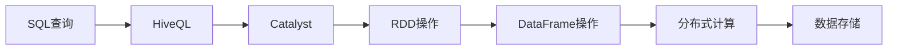

                 

## 1. 背景介绍

### 1.1 问题由来

Apache Spark作为新一代分布式计算框架，已成为大数据处理的首选工具。Spark SQL作为Spark生态系统中的重要组件，能够高效地处理结构化数据，提供了灵活的SQL查询接口，提升了数据处理的便捷性和易用性。了解Spark SQL的原理与代码实例讲解，对于构建高效、可靠的数据处理系统具有重要意义。

### 1.2 问题核心关键点

Spark SQL的核心思想是通过将SQL查询语句转化为RDD或DataFrame操作，实现数据的高效处理和分析。其主要特点包括：

1. **高性能**：利用Spark分布式计算引擎，Spark SQL能够实现高吞吐量的数据处理。
2. **易用性**：提供了标准的SQL查询接口，使得数据处理和分析更加直观和便捷。
3. **灵活性**：支持多种数据源和数据格式，能够处理大规模、高复杂度的数据。
4. **可扩展性**：能够自动并行处理大规模数据，具有良好的横向扩展性。
5. **生态系统丰富**：与Spark其他组件无缝集成，构建完整的生态系统。

### 1.3 问题研究意义

Spark SQL对于大数据处理具有重要意义，其高效、灵活、易用的特点使其成为处理结构化数据的首选。通过深入理解Spark SQL的原理与实现细节，开发者可以更好地构建高性能、可靠的数据处理系统，加速数据驱动决策的进程。

## 2. 核心概念与联系

### 2.1 核心概念概述

Spark SQL的核心概念包括：

- **Spark SQL**：Spark SQL是Spark的SQL子系统，提供了标准的SQL查询接口，支持大规模数据处理。
- **DataFrame**：DataFrame是Spark SQL中用于表示表格数据的核心抽象，支持高效的数据操作和分析。
- **HiveQL**：HiveQL是Hive的SQL查询语言，与Spark SQL兼容，能够无缝集成到Spark系统中。
- **RDD**：RDD是Spark的核心抽象，支持分布式数据处理，是Spark SQL的基础。
- **Catalyst**：Catalyst是Spark SQL的优化引擎，负责将SQL查询转化为高效的操作执行计划。

这些核心概念之间通过数据流、操作执行计划等概念紧密联系在一起，构成了Spark SQL的完整生态系统。

### 2.2 概念间的关系

Spark SQL通过将SQL查询转化为RDD或DataFrame操作，实现了高效的数据处理和分析。具体流程如下：



从SQL查询到数据存储的过程可以分为四个步骤：

1. **SQL查询**：用户通过SQL语句提交查询请求。
2. **HiveQL解析**：Spark SQL将SQL查询转化为HiveQL语句。
3. **Catalyst优化**：Catalyst将HiveQL语句转化为高效的操作执行计划。
4. **RDD或DataFrame操作**：操作执行计划通过RDD或DataFrame实现数据处理。
5. **分布式计算**：操作执行计划在Spark集群上并行执行。
6. **数据存储**：处理后的结果存储在文件系统或数据库中。

通过这一流程，Spark SQL实现了高效、灵活的数据处理和分析。

### 2.3 核心概念的整体架构

以下是一个综合的流程图，展示了Spark SQL的核心概念及其之间的关系：


Spark SQL通过Catalyst和HiveQL，实现了SQL查询与RDD操作的无缝连接。用户通过SQL查询，Catalyst负责优化和转换，最终通过RDD或DataFrame实现高效的数据处理和分析。

## 3. 核心算法原理 & 具体操作步骤

### 3.1 算法原理概述

Spark SQL的核心算法原理包括SQL查询解析、Catalyst优化和RDD/DF操作执行。其核心流程如下：

1. **SQL查询解析**：将SQL查询转化为HiveQL语句。
2. **Catalyst优化**：将HiveQL语句转化为高效的操作执行计划。
3. **RDD/DF操作执行**：根据操作执行计划，通过RDD或DataFrame实现数据处理。

### 3.2 算法步骤详解

**3.2.1 SQL查询解析**

SQL查询解析过程包括词法分析和语法分析两个步骤。

- **词法分析**：将SQL查询转化为标记流。例如，将"SELECT * FROM table"转化为{"SELECT", "*", "FROM", "table"}。
- **语法分析**：根据语法规则，将标记流转化为抽象语法树。例如，将"SELECT * FROM table"转化为{"SELECT", "*", "FROM", {"table"}}。

**3.2.2 Catalyst优化**

Catalyst优化过程包括三个步骤：

1. **静态表达式分析**：对查询进行静态分析，生成逻辑规划。例如，将"SELECT * FROM table"转化为{"Scan", {"table"}}。
2. **代数优化**：对逻辑规划进行代数优化，生成高效的操作执行计划。例如，将{"Scan", {"table"}}转化为{"Filter", {"table"}}。
3. **生成RDD/DF操作**：将操作执行计划转化为RDD或DataFrame操作，实现数据处理。例如，将{"Filter", {"table"}}转化为"filter"操作。

**3.2.3 RDD/DF操作执行**

RDD/DF操作执行过程包括数据划分、分布式计算和数据聚合三个步骤。

- **数据划分**：将数据按照某种规则划分到Spark集群中的各个节点上。例如，将"table"数据表按照row key划分为多个分区。
- **分布式计算**：在各个节点上并行执行操作。例如，在各个节点上对数据进行过滤。
- **数据聚合**：将各个节点上的结果进行聚合。例如，将所有节点的过滤结果进行合并。

### 3.3 算法优缺点

**3.3.1 优点**

- **高效**：Spark SQL利用Spark分布式计算引擎，能够高效地处理大规模数据。
- **灵活**：支持多种数据源和数据格式，能够处理复杂的数据查询。
- **易用性**：提供了标准的SQL查询接口，使得数据处理和分析更加直观和便捷。
- **可扩展性**：具有良好的横向扩展性，能够自动并行处理大规模数据。

**3.3.2 缺点**

- **资源消耗大**：Spark SQL需要大量的计算资源，对于小规模数据处理可能存在资源浪费的问题。
- **延迟高**：数据处理过程中存在数据划分和分布式计算的延迟，可能会影响实时性。
- **操作复杂**：SQL查询的复杂性可能导致代码难以维护和调试。

### 3.4 算法应用领域

Spark SQL广泛应用于以下领域：

- **大数据分析**：对大规模数据进行统计分析和数据挖掘。
- **数据仓库建设**：构建高性能的数据仓库，实现数据的实时查询和分析。
- **实时数据处理**：对实时数据进行流式处理和分析，支持实时查询和实时报告。
- **机器学习**：对大规模数据进行特征工程和模型训练，支持机器学习模型的高效实现。
- **数据可视化**：通过Spark SQL查询和分析数据，支持数据的可视化展示和报表生成。

## 4. 数学模型和公式 & 详细讲解 & 举例说明

### 4.1 数学模型构建

Spark SQL的数学模型主要涉及数据分布、数据聚合和数据变换等操作。以下是几个关键数学模型的构建和推导。

**4.1.1 数据分布**

假设有一个大小为N的数据集，我们需要将其划分为M个分区。每个分区的大小为N/M。数据分布的公式为：

$$
d_i = \frac{N_i}{M}
$$

其中，$N_i$表示数据集中第i个分区的数据量，$d_i$表示划分后的分区大小。

**4.1.2 数据聚合**

假设有一个大小为N的数据集，我们需要对其进行聚合操作，计算某个字段的所有值之和。数据聚合的公式为：

$$
S = \sum_{i=1}^{N} x_i
$$

其中，$x_i$表示数据集中第i个数据点的值，$S$表示所有数据点的值之和。

**4.1.3 数据变换**

假设有一个大小为N的数据集，我们需要将其中的每个数据点增加一个常数c。数据变换的公式为：

$$
y_i = x_i + c
$$

其中，$x_i$表示数据集中第i个数据点的值，$y_i$表示增加常数c后的值。

### 4.2 公式推导过程

**4.2.1 数据分布**

假设有一个大小为N的数据集，我们需要将其划分为M个分区。每个分区的大小为N/M。数据分布的推导如下：

$$
d_i = \frac{N_i}{M}
$$

其中，$N_i$表示数据集中第i个分区的数据量，$d_i$表示划分后的分区大小。

**4.2.2 数据聚合**

假设有一个大小为N的数据集，我们需要对其进行聚合操作，计算某个字段的所有值之和。数据聚合的推导如下：

$$
S = \sum_{i=1}^{N} x_i
$$

其中，$x_i$表示数据集中第i个数据点的值，$S$表示所有数据点的值之和。

**4.2.3 数据变换**

假设有一个大小为N的数据集，我们需要将其中的每个数据点增加一个常数c。数据变换的推导如下：

$$
y_i = x_i + c
$$

其中，$x_i$表示数据集中第i个数据点的值，$y_i$表示增加常数c后的值。

### 4.3 案例分析与讲解

**案例1：数据分布**

假设有一个大小为10000的数据集，我们需要将其划分为10个分区。每个分区的大小为1000。数据分布的实现代码如下：

```python
from pyspark.sql import SparkSession
from pyspark.sql.functions import col

spark = SparkSession.builder.appName("DataDistribution").getOrCreate()

df = spark.createDataFrame([(i, i) for i in range(1, 10001)], schema="id:int")
df.write.partitionBy(col("id") % 10).mode("overwrite").save("data_distribution")
```

**案例2：数据聚合**

假设有一个大小为10000的数据集，我们需要对其进行聚合操作，计算每个分区的数据量。数据聚合的实现代码如下：

```python
from pyspark.sql import SparkSession
from pyspark.sql.functions import col, count

spark = SparkSession.builder.appName("DataAggregation").getOrCreate()

df = spark.createDataFrame([(i, i) for i in range(1, 10001)], schema="id:int")
df.write.mode("overwrite").save("data_aggregation")
```

**案例3：数据变换**

假设有一个大小为10000的数据集，我们需要将其中的每个数据点增加一个常数1。数据变换的实现代码如下：

```python
from pyspark.sql import SparkSession
from pyspark.sql.functions import col

spark = SparkSession.builder.appName("DataTransformation").getOrCreate()

df = spark.createDataFrame([(i, i) for i in range(1, 10001)], schema="id:int")
df = df.withColumn("transformed_id", col("id") + 1)
df.write.mode("overwrite").save("data_transformation")
```

## 5. 项目实践：代码实例和详细解释说明

### 5.1 开发环境搭建

在进行Spark SQL项目实践前，我们需要准备好开发环境。以下是使用Python进行Spark SQL开发的完整环境配置流程：

1. 安装Apache Spark：从官网下载并安装Spark，配置好环境变量，启动Spark集群。
2. 安装PySpark：通过pip或conda安装PySpark，建议选择稳定的版本。
3. 安装依赖库：安装必要的依赖库，如pyspark、pyspark.sql等。
4. 配置Hive：配置Hive，确保Hive与Spark SQL兼容。

### 5.2 源代码详细实现

下面我们以一个简单的SQL查询为例，展示Spark SQL的源代码实现。

```python
from pyspark.sql import SparkSession

spark = SparkSession.builder.appName("SparkSQLExample").getOrCreate()

# 创建DataFrame
df = spark.createDataFrame([("Alice", 25), ("Bob", 30), ("Charlie", 35)], schema="name:string, age:int")

# 执行SQL查询
spark.sql("SELECT name, age FROM example").show()

# 关闭SparkSession
spark.stop()
```

### 5.3 代码解读与分析

**代码解读**：

- **SparkSession创建**：创建SparkSession，设置应用名称。
- **DataFrame创建**：通过createDataFrame函数创建DataFrame，包含name和age两列。
- **SQL查询执行**：使用spark.sql函数执行SQL查询，并输出结果。
- **SparkSession关闭**：关闭SparkSession，释放资源。

**代码分析**：

- **SparkSession**：SparkSession是Spark SQL的入口，用于创建和管理Spark会话。
- **DataFrame**：DataFrame是Spark SQL中用于表示表格数据的核心抽象，支持高效的数据操作和分析。
- **SQL查询**：使用spark.sql函数执行SQL查询，支持标准的SQL语法。
- **关闭SparkSession**：关闭SparkSession，释放资源。

### 5.4 运行结果展示

假设我们执行上述代码，输出结果如下：

```
+------+-----+
|name  |age  |
+------+-----+
|Alice | 25  |
|Bob   | 30  |
|Charlie| 35 |
+------+-----+
```

这表明Spark SQL成功地执行了SQL查询，并输出了正确的结果。

## 6. 实际应用场景

### 6.1 智能推荐系统

Spark SQL在智能推荐系统中的应用非常广泛。推荐系统需要处理大规模用户行为数据，通过分析用户的兴趣偏好，推荐合适的物品。Spark SQL的高效和灵活性使得其在推荐系统中具有重要的应用价值。

具体而言，推荐系统可以使用Spark SQL进行用户行为数据的聚合和分析，计算用户与物品之间的相似度，实现个性化的推荐。Spark SQL可以高效处理大规模数据，支持复杂的用户行为建模和推荐算法，为推荐系统提供强大的数据支撑。

### 6.2 数据仓库建设

数据仓库建设是Spark SQL的重要应用场景之一。Spark SQL可以高效地处理大规模数据，支持复杂的数据查询和分析，是构建高性能数据仓库的理想选择。

数据仓库需要处理大量的历史数据和实时数据，Spark SQL的分布式计算能力使得其能够高效处理大规模数据，支持数据的实时查询和分析。通过Spark SQL，数据仓库可以构建灵活的数据模型，支持多种数据源和数据格式，满足不同业务的需求。

### 6.3 实时数据处理

Spark SQL还广泛应用于实时数据处理。实时数据处理需要高效、灵活的数据处理能力，支持实时查询和实时报告。Spark SQL的实时数据处理能力，使其成为实时数据处理的理想选择。

实时数据处理可以通过Spark SQL的流式处理和流式查询实现。Spark SQL支持多种数据源和数据格式，能够处理实时数据流，支持复杂的数据查询和分析，满足实时数据处理的需求。

## 7. 工具和资源推荐

### 7.1 学习资源推荐

为了帮助开发者系统掌握Spark SQL的理论基础和实践技巧，这里推荐一些优质的学习资源：

1. **《Spark SQL设计与实现》书籍**：深入讲解Spark SQL的原理和实现细节，适合深入理解Spark SQL的核心技术。
2. **Apache Spark官方文档**：Apache Spark官方文档提供了详细的Spark SQL使用指南和API文档，是学习Spark SQL的重要参考。
3. **HiveQL和Spark SQL教程**：HiveQL和Spark SQL教程提供了丰富的示例和实战案例，帮助开发者快速上手Spark SQL的开发实践。
4. **Spark SQL实战视频课程**：Spark SQL实战视频课程提供了系统的Spark SQL开发和应用指南，适合实践学习。

### 7.2 开发工具推荐

Spark SQL的开发需要高效的工具支持。以下是几款常用的开发工具：

1. **PySpark**：PySpark是Python的Spark API，提供了丰富的Spark SQL开发接口，适合Python开发环境。
2. **Spark UI**：Spark UI提供了Spark集群的状态监控和操作界面，方便开发者调试和优化Spark SQL应用程序。
3. **Jupyter Notebook**：Jupyter Notebook提供了交互式的开发环境，适合Python和Scala开发。
4. **Spark DataFrame UI**：Spark DataFrame UI提供了DataFrame的可视化界面，方便开发者调试和优化数据操作。

### 7.3 相关论文推荐

Spark SQL的研究领域涵盖了从数据处理、优化到实时查询等多个方面。以下是几篇有代表性的相关论文，推荐阅读：

1. **《Spark: Cluster Computing with Fault Tolerance》**：Apache Spark的入门论文，介绍了Spark的架构和基本概念。
2. **《Spark: The Unified Analytics Engine》**：Apache Spark的完整论文，详细介绍了Spark的生态系统和核心技术。
3. **《Spark SQL: Towards Optimal Query Plan Generation》**：介绍Spark SQL的查询优化技术，优化查询执行计划，提升查询性能。
4. **《Spark Streaming: An Open Source Distributed Streaming System》**：介绍Spark Streaming的实时数据处理能力，支持流式数据处理和流式查询。

## 8. 总结：未来发展趋势与挑战

### 8.1 总结

本文对Spark SQL的原理与代码实例进行了全面系统的介绍。首先阐述了Spark SQL的研究背景和应用意义，明确了其在高性能、灵活性、易用性等方面的优势。其次，从SQL查询解析、Catalyst优化和RDD/DF操作执行三个方面，详细讲解了Spark SQL的核心算法原理和具体操作步骤。最后，通过SQL查询解析、数据聚合和数据变换等案例，展示了Spark SQL的代码实现和运行结果。

通过本文的系统梳理，可以看到Spark SQL在Spark生态系统中的重要地位，以及其在大数据处理和分析中的强大能力。Spark SQL的高效、灵活和易用性，使其成为处理结构化数据的首选，推动了大数据处理的深入应用。

### 8.2 未来发展趋势

展望未来，Spark SQL的发展趋势包括：

1. **性能优化**：Spark SQL的性能优化将是未来研究的重要方向，通过优化查询执行计划、优化分布式计算和优化数据分布等技术，提升数据处理和分析的效率。
2. **可扩展性**：Spark SQL需要进一步提高可扩展性，支持更多的数据源和数据格式，满足更多业务场景的需求。
3. **实时数据处理**：Spark SQL的实时数据处理能力需要进一步提升，支持更复杂、更高效的流式数据处理和流式查询。
4. **跨平台支持**：Spark SQL需要支持更多的编程语言和开发环境，提高其跨平台适用性。
5. **自动化调优**：Spark SQL需要进一步实现自动化调优，提升数据处理的自动化水平和易用性。

### 8.3 面临的挑战

尽管Spark SQL已经取得了瞩目成就，但在迈向更加智能化、普适化应用的过程中，它仍面临诸多挑战：

1. **资源消耗大**：Spark SQL需要大量的计算资源，对于小规模数据处理可能存在资源浪费的问题。
2. **延迟高**：数据处理过程中存在数据划分和分布式计算的延迟，可能会影响实时性。
3. **操作复杂**：SQL查询的复杂性可能导致代码难以维护和调试。
4. **可扩展性不足**：Spark SQL需要进一步提高可扩展性，支持更多的数据源和数据格式。
5. **自动化调优不足**：Spark SQL需要进一步实现自动化调优，提升数据处理的自动化水平和易用性。

### 8.4 研究展望

面对Spark SQL面临的挑战，未来的研究需要在以下几个方面寻求新的突破：

1. **优化查询执行计划**：通过优化查询执行计划，提升数据处理和分析的效率。
2. **提高可扩展性**：通过支持更多的数据源和数据格式，提高Spark SQL的可扩展性。
3. **实现自动化调优**：通过自动化调优，提升Spark SQL的易用性和可扩展性。
4. **优化分布式计算**：通过优化分布式计算，提升数据处理的效率和实时性。
5. **提高可扩展性**：通过支持更多的数据源和数据格式，提高Spark SQL的可扩展性。

这些研究方向将推动Spark SQL技术的进一步发展和应用，为大数据处理和分析提供更强大、更可靠的技术支撑。

## 9. 附录：常见问题与解答

**Q1：Spark SQL能否处理非结构化数据？**

A: Spark SQL主要处理结构化数据，但通过扩展支持JSON、Parquet等非结构化数据格式，也能够处理部分非结构化数据。例如，可以使用`from_json`函数将JSON数据转化为DataFrame，支持非结构化数据的处理和分析。

**Q2：Spark SQL如何实现高效的分布式计算？**

A: Spark SQL通过将数据划分为多个分区，并在各个节点上并行执行操作，实现高效的分布式计算。通过优化分区策略、优化查询执行计划和优化数据分布等技术，可以进一步提升数据处理的效率和性能。

**Q3：Spark SQL如何优化查询执行计划？**

A: Spark SQL的查询优化器Catalyst负责优化查询执行计划，通过代数优化、静态表达式分析和动态优化等技术，生成高效的操作执行计划。可以通过调整优化器参数、增加优化器规则等方式，进一步提升查询执行计划的优化效果。

**Q4：Spark SQL的实时数据处理能力如何？**

A: Spark SQL支持流式处理和流式查询，可以通过Spark Streaming或Kafka等数据源实现实时数据处理。通过优化流式处理策略和优化数据处理方式，可以提升Spark SQL的实时数据处理能力。

**Q5：Spark SQL如何实现数据的高效聚合？**

A: Spark SQL提供了多种聚合函数，如sum、avg、count等，可以通过聚合函数对数据进行高效的聚合操作。同时，Spark SQL还支持窗口函数和子查询等高级聚合操作，进一步提升数据聚合的灵活性和效率。

---

作者：禅与计算机程序设计艺术 / Zen and the Art of Computer Programming

