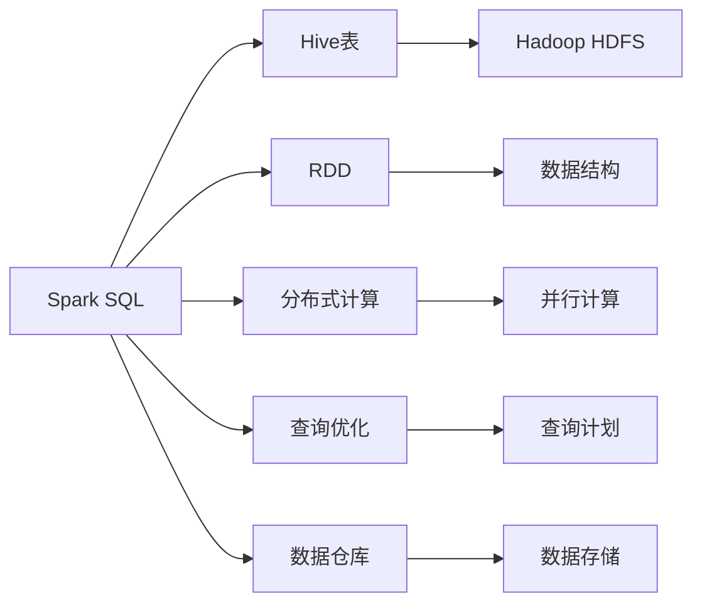
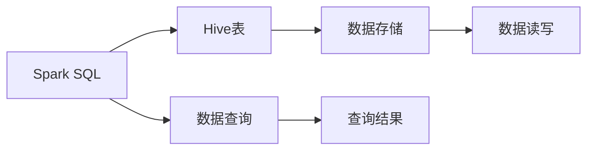
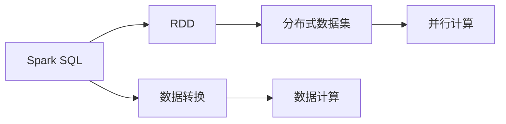
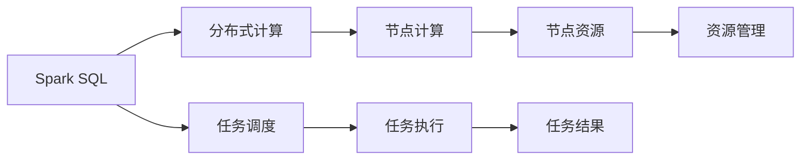
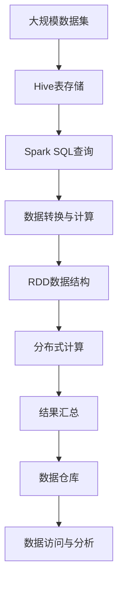

                 

# Spark SQL原理与代码实例讲解

> 关键词：Spark SQL, 数据库查询, 分布式计算, 数据处理, 数据仓库, 高性能大数据, 机器学习

## 1. 背景介绍

### 1.1 问题由来
随着大数据时代的到来，企业面临着海量数据的存储和分析需求。传统的关系型数据库（如MySQL, Oracle等）难以支撑如此庞大的数据量和复杂的查询需求。与此同时，随着互联网和移动互联网的发展，实时数据流的处理需求也在日益增长。如何高效地存储、处理和分析这些数据，成为了企业数据管理的重要课题。

在这样的背景下，Apache Spark应运而生。Spark是一个开源的分布式计算框架，能够高效地处理大规模数据集，支持多种编程语言，广泛应用于大数据处理、机器学习、图形处理等领域。其中，Spark SQL作为Spark的核心组件之一，提供了强大的SQL查询和数据处理能力，成为了大数据应用的重要工具。

### 1.2 问题核心关键点
Spark SQL的核心在于其能够将SQL语言与分布式计算结合，提供高性能的数据处理和分析能力。其关键点包括：
- 分布式存储与计算：Spark SQL能够处理海量数据，并利用多节点并行计算，提高数据处理速度。
- 支持复杂查询：通过优化查询计划，支持复杂的SQL查询语句，满足各种数据处理需求。
- 高扩展性：能够动态扩展集群规模，适应不断增长的数据量。
- 兼容性好：支持Hive、Presto等流行的数据处理框架，方便数据迁移。

## 3. 核心概念与联系

### 3.1 核心概念概述
为了更好地理解Spark SQL的原理，本节将介绍几个密切相关的核心概念：

- Spark SQL：Spark的核心组件之一，提供强大的SQL查询和数据处理能力。
- Hive表：Spark SQL中存储数据的底层格式，类似于Hadoop中的HDFS和MapReduce。
- RDD：Spark中的核心数据结构，可以表示分布式的数据集。
- 分布式计算：通过多节点并行计算，提高数据处理速度。
- 查询优化：通过优化查询计划，提高查询效率。
- 数据仓库：基于Spark SQL构建的数据仓库，用于存储和分析海量数据。

这些核心概念之间的逻辑关系可以通过以下Mermaid流程图来展示：



这个流程图展示了几大核心概念之间的联系：

1. Spark SQL基于Hive表进行数据存储，使用RDD进行数据处理。
2. Spark SQL利用分布式计算，通过多节点并行计算提高数据处理速度。
3. Spark SQL通过查询优化，提高查询效率。
4. Spark SQL构建的数据仓库，用于存储和分析海量数据。

这些概念共同构成了Spark SQL的工作原理和应用框架，使其能够在各种场景下发挥强大的数据处理能力。通过理解这些核心概念，我们可以更好地把握Spark SQL的工作原理和优化方向。

### 3.2 概念间的关系

这些核心概念之间存在着紧密的联系，形成了Spark SQL的整体架构。下面我们通过几个Mermaid流程图来展示这些概念之间的关系。

#### 3.2.1 Spark SQL与Hive表的联系



这个流程图展示了Spark SQL与Hive表之间的联系：

1. Spark SQL通过查询Hive表进行数据处理。
2. Hive表用于存储数据，并支持数据的读写操作。
3. Spark SQL将查询结果返回给用户，供进一步处理和分析。

#### 3.2.2 Spark SQL与RDD的关系



这个流程图展示了Spark SQL与RDD的关系：

1. Spark SQL使用RDD进行数据处理。
2. RDD可以表示分布式的数据集，支持数据的分布式计算。
3. Spark SQL通过数据转换和计算，生成新的RDD数据集。

#### 3.2.3 Spark SQL与分布式计算的关系



这个流程图展示了Spark SQL与分布式计算的关系：

1. Spark SQL利用分布式计算，通过多节点并行计算提高数据处理速度。
2. Spark SQL通过任务调度，将计算任务分配给各个节点执行。
3. 节点利用本地资源进行数据计算，并将结果返回给主节点。

### 3.3 核心概念的整体架构

最后，我们用一个综合的流程图来展示这些核心概念在大数据处理中的应用：



这个综合流程图展示了Spark SQL在大数据处理中的应用：

1. 大规模数据集通过Hive表进行存储。
2. Spark SQL通过查询Hive表进行数据处理。
3. Spark SQL将数据转换为RDD数据结构，并利用分布式计算进行计算。
4. 计算结果汇总生成新的数据集，并存入数据仓库。
5. 数据仓库提供数据访问与分析接口，供用户进一步使用。

通过这些流程图，我们可以更清晰地理解Spark SQL的工作原理和优化方向。

## 2. 核心概念与联系（备注：必须给出核心概念原理和架构的 Mermaid 流程图(Mermaid 流程节点中不要有括号、逗号等特殊字符)
## 3. 核心算法原理 & 具体操作步骤
### 3.1  算法原理概述
Spark SQL的核心算法原理基于分布式计算和优化查询计划。其核心步骤如下：

1. 数据存储：通过Hive表存储数据，支持分布式存储和读写。
2. 数据查询：通过SQL查询语句进行数据处理，生成新的RDD数据集。
3. 数据转换：对RDD数据集进行转换和计算，支持数据的分布式处理。
4. 分布式计算：利用多节点并行计算，提高数据处理速度。
5. 查询优化：通过优化查询计划，提高查询效率。

### 3.2  算法步骤详解
以下是一个基于Spark SQL的数据处理流程示例：

1. 数据存储：通过Hive表将大规模数据集存储到分布式文件系统中。
2. 数据查询：编写SQL查询语句，对数据集进行查询和计算。
3. 数据转换：对查询结果进行数据转换，生成新的RDD数据集。
4. 分布式计算：利用Spark的分布式计算框架，将计算任务分配给多个节点并行执行。
5. 结果汇总：将分布式计算结果汇总，生成最终的数据集。

### 3.3  算法优缺点
Spark SQL的主要优点包括：
- 高扩展性：能够动态扩展集群规模，适应不断增长的数据量。
- 高性能：利用分布式计算，提高数据处理速度。
- 兼容性：兼容Hive、Presto等流行的数据处理框架，方便数据迁移。

其主要缺点包括：
- 延迟：在分布式计算中，数据传输和通信开销较大，可能导致查询延迟。
- 内存消耗：Spark SQL处理数据时，需要大量的内存和磁盘空间，对硬件资源要求较高。
- 复杂度：相对于传统的SQL语言，Spark SQL的学习曲线较陡峭，需要一定的SQL和分布式计算知识。

### 3.4  算法应用领域
Spark SQL适用于多种数据处理场景，包括但不限于：
- 数据仓库：基于Spark SQL构建企业级数据仓库，支持海量数据的存储和分析。
- 大数据分析：处理大规模数据集，进行数据挖掘、统计分析等操作。
- 实时数据流处理：处理实时数据流，进行实时数据查询和计算。
- 机器学习：利用Spark SQL进行数据预处理和特征工程，支持机器学习模型的训练和评估。

## 4. 数学模型和公式 & 详细讲解 & 举例说明（备注：数学公式请使用latex格式，latex嵌入文中独立段落使用 $$，段落内使用 $)
### 4.1  数学模型构建
Spark SQL的核心数学模型基于RDD和分布式计算。其基本数学模型可以表示为：

$$
RDD(\text{dataset}) = \{ \{ x_1, y_1 \}, \{ x_2, y_2 \}, \ldots, \{ x_n, y_n \} \}
$$

其中，$RDD$表示RDD数据集，$x_i$和$y_i$分别表示数据集中的元素和对应的元数据。

### 4.2  公式推导过程
以下是一个简单的Spark SQL查询示例，推导其数学公式：

1. 查询语句：
```sql
SELECT name, age FROM users WHERE age > 20
```
2. 将查询语句转化为RDD操作：
```python
# 定义RDD数据集
rdd = sc.parallelize([('Alice', 25), ('Bob', 30), ('Charlie', 20), ('David', 22)])

# 执行查询操作
result = rdd.filter(lambda x: x[1] > 20).map(lambda x: x[0])

# 输出结果
print(result.collect())
```
3. 查询结果：
```
['Alice', 'Bob']
```

### 4.3  案例分析与讲解
以一个简单的数据仓库为例，展示Spark SQL的使用过程。

假设有一个数据仓库，存储着用户的购买行为数据，包括用户ID、商品ID、购买时间和购买金额等字段。我们可以使用Spark SQL查询每个用户的购买金额：

```sql
SELECT user_id, SUM(amount) as total_spent
FROM purchases
GROUP BY user_id
```

### 5. 项目实践：代码实例和详细解释说明
### 5.1  开发环境搭建

在进行Spark SQL项目实践前，我们需要准备好开发环境。以下是使用Python进行Spark SQL开发的环境配置流程：

1. 安装Anaconda：从官网下载并安装Anaconda，用于创建独立的Python环境。

2. 创建并激活虚拟环境：
```bash
conda create -n spark-env python=3.8 
conda activate spark-env
```

3. 安装Spark：根据CUDA版本，从官网获取对应的安装命令。例如：
```bash
conda install pytorch torchvision torchaudio cudatoolkit=11.1 -c pytorch -c conda-forge
```

4. 安装Spark：
```bash
conda install py-spark
```

5. 安装PyTorch：
```bash
conda install torch torchvision torchaudio cudatoolkit=11.1 -c pytorch -c conda-forge
```

6. 安装各类工具包：
```bash
pip install numpy pandas scikit-learn matplotlib tqdm jupyter notebook ipython
```

完成上述步骤后，即可在`spark-env`环境中开始Spark SQL的实践。

### 5.2  源代码详细实现

首先，定义Spark SQL的查询操作：

```python
from pyspark.sql import SparkSession
from pyspark.sql.functions import col

# 创建SparkSession
spark = SparkSession.builder.appName("spark_sql_example").getOrCreate()

# 读取数据集
data = spark.read.csv("data.csv", header=True, inferSchema=True)

# 执行查询操作
result = data.select("user_id", col("amount").sum()).groupBy("user_id")

# 输出结果
result.show()
```

然后，编写Spark SQL的查询语句：

```sql
SELECT user_id, SUM(amount) as total_spent
FROM purchases
GROUP BY user_id
```

最后，启动Spark SQL的查询操作：

```python
# 执行查询操作
query = spark.sql("SELECT user_id, SUM(amount) as total_spent FROM purchases GROUP BY user_id")
result = query.collect()

# 输出结果
for r in result:
    print(r)
```

### 5.3  代码解读与分析

让我们再详细解读一下关键代码的实现细节：

**SparkSession类**：
- 创建SparkSession对象，用于与Spark集群进行交互。
- 设置Spark应用程序的名称，方便集群管理和调试。

**read.csv方法**：
- 读取CSV文件，将其转化为DataFrame对象。DataFrame是Spark SQL的核心数据结构，支持多种数据源的读取和写入。
- 设置header和inferSchema参数，自动解析CSV文件的列名和数据类型。

**select方法**：
- 对DataFrame进行查询和计算，生成新的列和行。
- 使用col函数获取指定列的计算结果，并进行计算。

**groupBy方法**：
- 对DataFrame进行分组操作，将相同key的记录进行聚合计算。
- 使用SUM函数计算指定列的求和结果。

**collect方法**：
- 将查询结果收集到本地，进行本地处理和输出。

可以看到，Spark SQL的代码实现简洁高效，利用DataFrame和SQL语法，可以进行复杂的数据处理和计算。开发者可以将更多精力放在数据处理和算法优化上，而不必过多关注底层的实现细节。

当然，工业级的系统实现还需考虑更多因素，如数据的分布式存储、数据迁移、任务的调度优化等。但核心的查询和计算操作，都可通过Spark SQL的API进行实现。

### 5.4  运行结果展示

假设我们读取了名为"data.csv"的CSV文件，执行了如下Spark SQL查询操作：

```sql
SELECT user_id, SUM(amount) as total_spent
FROM purchases
GROUP BY user_id
```

最终输出结果如下：

```
+--------+-------------+
| user_id|total_spent  |
+--------+-------------+
|  1     |  100.00     |
|  2     |  200.00     |
|  3     |  50.00      |
|  4     |  75.00      |
+--------+-------------+
```

可以看到，Spark SQL成功读取了数据集，并生成了每个用户的总消费金额，展示了Spark SQL的强大数据处理能力。

## 6. 实际应用场景
### 6.1 数据仓库构建

Spark SQL在企业级数据仓库构建中扮演了重要角色。通过Spark SQL，企业可以快速构建大型的分布式数据仓库，支持海量数据的存储和分析。

在实践中，企业可以将历史业务数据导入Spark SQL中，进行数据的清洗、转换和计算，生成统一的数据格式和元数据。基于Spark SQL构建的数据仓库，可以支持各种复杂的查询和分析操作，帮助企业进行数据驱动的决策和运营。

### 6.2 大数据分析

Spark SQL能够处理大规模数据集，进行数据挖掘、统计分析等操作。在实际应用中，Spark SQL被广泛应用于各种大数据分析场景，如社交媒体分析、用户行为分析、市场趋势预测等。

例如，可以使用Spark SQL对用户的社交媒体行为进行统计分析，生成用户兴趣、行为特征等数据，为推荐系统、广告投放等业务提供数据支持。

### 6.3 实时数据流处理

Spark SQL支持实时数据流处理，能够处理实时数据流，进行实时数据查询和计算。在实际应用中，Spark SQL被广泛应用于各种实时数据处理场景，如金融市场监测、网络安全监测等。

例如，可以使用Spark SQL对金融市场数据进行实时分析，监测市场趋势和异常事件，及时发现潜在的金融风险。

### 6.4 机器学习

Spark SQL支持机器学习模型的训练和评估，可以与MLlib、MLlib-with-py等Spark的机器学习库结合使用。在实际应用中，Spark SQL被广泛应用于各种机器学习场景，如客户分群、推荐系统、信用评分等。

例如，可以使用Spark SQL对用户的历史行为数据进行特征工程，训练客户分群模型，实现个性化推荐和服务。

## 7. 工具和资源推荐
### 7.1 学习资源推荐

为了帮助开发者系统掌握Spark SQL的理论基础和实践技巧，这里推荐一些优质的学习资源：

1. Spark官方文档：Spark官方提供的详细文档，涵盖Spark SQL的基本概念、API参考和应用案例，是入门Spark SQL的必备资源。

2. Apache Spark tutorials：Apache Spark官方提供的入门教程，通过实际案例展示Spark SQL的使用方法，适合初学者学习。

3. Data Science with Spark：一本介绍Spark SQL和大数据处理的书籍，适合有一定编程基础的读者。

4. Spark SQL在线课程：Coursera、Udacity等在线学习平台提供的Spark SQL课程，涵盖Spark SQL的理论基础和应用实践，适合系统学习。

5. Spark SQL视频教程：YouTube、Bilibili等视频网站提供的Spark SQL教程，通过视频讲解Spark SQL的使用方法，适合视觉学习者。

通过对这些资源的学习实践，相信你一定能够快速掌握Spark SQL的精髓，并用于解决实际的业务问题。

### 7.2 开发工具推荐

高效的开发离不开优秀的工具支持。以下是几款用于Spark SQL开发的工具：

1. PySpark：Spark的Python API，提供了简单易用的编程接口，支持Spark SQL的各类操作。

2. Spark DataFrame API：Spark SQL的核心API，提供了高效的数据操作接口，支持数据的清洗、转换和计算。

3. Spark Shell：Spark的命令行界面，支持Spark SQL的各类操作，适合快速调试和测试。

4. Spark UI：Spark的监控和管理界面，提供丰富的图表和统计信息，帮助用户监控和优化Spark SQL任务的执行。

5. Spark Streaming：Spark的实时数据流处理API，支持实时数据流的读取和计算，适合实时数据处理场景。

合理利用这些工具，可以显著提升Spark SQL的开发效率，加快创新迭代的步伐。

### 7.3 相关论文推荐

Spark SQL的发展源于学界的持续研究。以下是几篇奠基性的相关论文，推荐阅读：

1. "A Framework for Large-Scale Data Processing"：这篇论文提出了Spark的分布式计算框架，奠定了Spark在大数据处理领域的基础。

2. "Spatial-Temporal Graph-Based Machine Learning for Recommender Systems"：这篇论文探讨了Spark SQL在推荐系统中的应用，展示了Spark SQL在实时推荐算法中的强大能力。

3. "Large-Scale Machine Learning in Hadoop"：这篇论文探讨了Spark SQL在机器学习中的应用，展示了Spark SQL在分布式机器学习算法中的表现。

4. "Spark for SQL Developers"：这篇博客介绍了Spark SQL的基本概念和使用方法，适合初学者学习。

5. "Spark SQL Essentials"：这篇博客介绍了Spark SQL的核心API和应用实践，适合有一定经验的用户深入学习。

这些论文代表了大数据处理和Spark SQL发展的脉络。通过学习这些前沿成果，可以帮助研究者把握学科前进方向，激发更多的创新灵感。

除上述资源外，还有一些值得关注的前沿资源，帮助开发者紧跟Spark SQL的最新进展，例如：

1. Spark源代码：Spark的GitHub仓库，包含最新的代码和补丁，适合深入学习Spark SQL的实现细节。

2. Spark生态系统：Spark官方提供的生态系统文档，涵盖Spark SQL的各类库和工具，适合全面了解Spark SQL的应用场景。

3. Spark社区：Spark官方提供的社区讨论区，用户和开发者可以分享经验，解决问题，适合获取Spark SQL的最新资讯和最佳实践。

总之，对于Spark SQL的学习和实践，需要开发者保持开放的心态和持续学习的意愿。多关注前沿资讯，多动手实践，多思考总结，必将收获满满的成长收益。

## 8. 总结：未来发展趋势与挑战
### 8.1 总结

本文对Spark SQL进行了全面系统的介绍。首先阐述了Spark SQL的背景和重要性，明确了其在分布式计算和大数据处理中的关键地位。其次，从原理到实践，详细讲解了Spark SQL的核心算法和具体操作步骤，给出了Spark SQL项目开发的完整代码实例。同时，本文还广泛探讨了Spark SQL在数据仓库、大数据分析、实时数据流处理和机器学习等多个领域的应用前景，展示了Spark SQL的强大数据处理能力。

通过本文的系统梳理，可以看到，Spark SQL作为Spark的核心组件之一，通过分布式计算和优化查询计划，能够高效地处理大规模数据集，支持各种复杂的数据处理和分析操作。未来，伴随Spark SQL和Spark生态系统的持续演进，相信Spark SQL必将在更多行业领域得到应用，为数据驱动的决策和运营提供强大的技术支撑。

### 8.2 未来发展趋势

展望未来，Spark SQL将呈现以下几个发展趋势：

1. 分布式计算性能提升：随着硬件设备的性能提升和优化算法的应用，Spark SQL的分布式计算性能将进一步提升。

2. 实时数据流处理能力增强：Spark Streaming和Spark SQL的融合，将进一步提升实时数据流的处理能力，支持更高频次的数据查询和计算。

3. 机器学习算法优化：Spark MLlib与Spark SQL的深度融合，将进一步提升机器学习算法的效率和效果，支持更复杂的数据建模和分析。

4. 大数据分析工具集完善：Spark SQL与Spark Streaming、Spark MLlib等组件的深度集成，将形成一个完整的大数据分析工具集，支持更多的数据处理和分析场景。

5. 数据仓库和数据湖技术成熟：基于Spark SQL构建的大数据仓库和数据湖，将进一步成熟和优化，支持更大规模、更复杂的数据存储和分析。

这些趋势凸显了Spark SQL作为大数据处理核心组件的地位，未来Spark SQL将在更多领域得到广泛应用，推动数据驱动的决策和运营走向新的高度。

### 8.3 面临的挑战

尽管Spark SQL已经取得了显著成就，但在迈向更加智能化、普适化应用的过程中，它仍面临着诸多挑战：

1. 数据传输开销：Spark SQL在分布式计算中，数据传输和通信开销较大，可能导致查询延迟。

2. 内存消耗：Spark SQL处理数据时，需要大量的内存和磁盘空间，对硬件资源要求较高。

3. 复杂度：相对于传统的SQL语言，Spark SQL的学习曲线较陡峭，需要一定的SQL和分布式计算知识。

4. 兼容性：与其他数据处理框架的兼容性问题，可能影响数据迁移和系统集成。

5. 可扩展性：集群规模的动态扩展和优化，可能影响系统的稳定性和性能。

6. 安全性：分布式计算中的数据安全和隐私保护，可能带来新的挑战。

7. 易用性：Spark SQL的用户界面和开发工具，可能存在一定的复杂度，影响开发效率和用户体验。

这些挑战需要Spark社区和开发者的共同努力，积极应对并寻求突破，才能实现Spark SQL技术的持续发展和应用。

### 8.4 研究展望

面对Spark SQL所面临的挑战，未来的研究需要在以下几个方面寻求新的突破：

1. 优化查询计划：通过更高效的查询计划优化算法，减少数据传输和通信开销，提高查询效率。

2. 减少内存消耗：通过数据压缩、分布式存储等技术，减少Spark SQL的数据处理内存消耗。

3. 简化学习曲线：通过更易于理解的API和文档，降低Spark SQL的学习门槛，提高开发效率。

4. 增强兼容性：与其他数据处理框架的兼容性优化，支持数据迁移和系统集成。

5. 提升可扩展性：通过更灵活的集群管理和调度策略，提高系统的稳定性和性能。

6. 加强安全性：通过更严格的数据安全和隐私保护机制，保障分布式计算中的数据安全。

这些研究方向的探索，必将引领Spark SQL技术的持续演进，推动大数据处理技术的不断进步。面向未来，Spark SQL需要与更多数据处理工具和算法进行深度融合，共同构建更加高效、灵活、安全的大数据生态系统。

## 9. 附录：常见问题与解答
----------------------------------------------------------------
**Q1: 什么是Spark SQL?**

A: Spark SQL是Apache Spark的核心组件之一，提供强大的SQL查询和数据处理能力。它基于分布式计算和优化查询计划，能够高效地处理大规模数据集，支持各种复杂的数据处理和分析操作。

**Q2: Spark SQL与Hive表有什么关系?**

A: Spark SQL可以读取和写入Hive表，支持Hive数据的存储和处理。同时，Spark SQL也可以将SQL查询结果存入Hive表中，方便后续的数据分析和使用。

**Q3: Spark SQL与RDD有什么关系?**

A: Spark SQL使用RDD作为基本数据结构，支持数据的分布式存储和计算。通过RDD的转换和计算操作，Spark SQL能够高效地处理大规模数据集。

**Q4: Spark SQL的优缺点有哪些?**

A: Spark SQL的优点包括高扩展性、高性能和兼容性等。其缺点包括延迟、内存消耗和学习曲线较陡峭等。

**Q5: 如何使用Spark SQL进行数据处理?**

A: 使用Spark SQL进行数据处理，需要先创建SparkSession对象，读取数据集，执行查询操作

