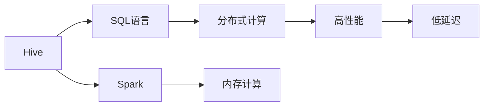
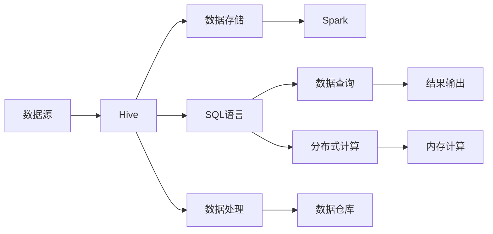
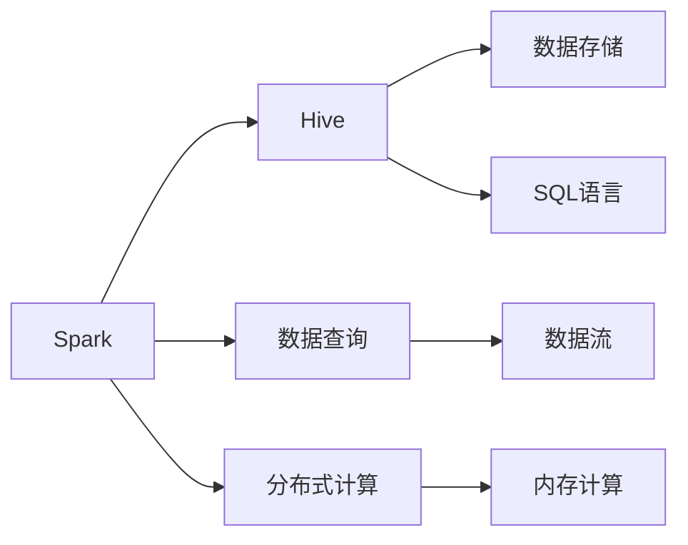

                 

# Spark-Hive整合原理与代码实例讲解

> 关键词：Spark, Hive, 数据仓库, 分布式计算, 数据融合, 实时处理, 存储优化

## 1. 背景介绍

### 1.1 问题由来

在现代大数据时代，企业需要处理的数据量越来越大，对数据处理的速度和效率提出了更高的要求。传统的SQL数据库难以应对海量数据的实时处理和复杂查询，而单一的分布式计算框架如Hadoop生态系统又缺乏强大的数据存储管理和查询优化能力。为了解决这些问题，人们提出了Hadoop+Spark的组合，但这一方案在实际应用中还存在一些问题：

- **分布式计算与数据存储分离**：Hadoop与Spark虽然可以配合使用，但它们各自承担不同的数据处理任务，导致数据在两者之间频繁转移，增加了不必要的延迟。
- **数据处理效率低**：由于Hadoop和Spark在数据处理上的特性不同，导致在实际应用中，往往需要开发多个不同的系统来处理不同类型的数据，增加了系统复杂性和维护成本。
- **数据一致性难以保证**：Hadoop和Spark的数据一致性处理机制不同，在分布式环境下，数据一致性难以保证。

为了解决这些问题，人们提出了将Hive与Spark整合的方案，整合后的Spark-Hive框架不仅能解决数据处理效率问题，还能保证数据一致性，提高数据处理的速度和效率。

### 1.2 问题核心关键点

Spark-Hive整合的核心关键点主要包括以下几个方面：

- **数据存储统一**：将Hive和Spark的数据存储统一，避免数据在不同系统间频繁转移，提高数据处理效率。
- **计算优化**：利用Spark的分布式计算能力，结合Hive的数据查询优化，提升数据处理的性能。
- **数据一致性**：确保Hive和Spark之间数据一致性，避免数据不一致的问题。
- **API统一**：提供统一的API接口，方便用户在不同系统间进行数据处理和查询。

## 2. 核心概念与联系

### 2.1 核心概念概述

为了更好地理解Spark-Hive整合的原理，我们先介绍几个核心概念：

- **Hive**：是一个数据仓库平台，基于Hadoop生态系统，提供数据管理、查询优化和数据处理能力。Hive将SQL语言作为查询语言，用户可以使用类似SQL的语句进行数据查询和处理。
- **Spark**：是一个快速、通用、可扩展的分布式计算系统，支持批处理、流处理和机器学习等多种计算模式。Spark采用内存计算，具有高性能、低延迟的特点。
- **Spark-Hive**：是将Hive和Spark整合在一起的数据处理框架，利用Hive的数据管理能力和Spark的分布式计算能力，提升数据处理的效率和性能。

这些核心概念之间的关系可以通过以下Mermaid流程图来展示：



这个流程图展示了Hive、Spark和Spark-Hive之间的关系：

- Hive通过SQL语言进行数据管理和查询，提供数据仓库的服务。
- Spark利用内存计算进行分布式计算，具有高性能和低延迟的特点。
- Spark-Hive将Hive和Spark整合在一起，充分利用两者优点，提升数据处理的效率和性能。

### 2.2 概念间的关系

这些核心概念之间存在着紧密的联系，形成了Spark-Hive整合的完整生态系统。下面我们通过几个Mermaid流程图来展示这些概念之间的关系。

#### 2.2.1 Hive与Spark的数据流图



这个流程图展示了Hive与Spark的数据流：

- 数据源先导入到Hive，然后通过SQL语言进行数据查询和处理。
- 处理后的数据存储到数据仓库中，供后续使用。
- 数据仓库中的数据可以被Spark进行分布式计算。
- Spark计算后的结果输出到结果集中，供后续使用。

#### 2.2.2 Spark与Hive的接口调用



这个流程图展示了Spark与Hive的接口调用关系：

- Spark通过接口调用Hive的数据存储和SQL语言。
- 查询数据时，Spark将查询语句发送给Hive进行数据处理。
- Hive处理数据后，将结果返回给Spark。
- Spark对返回的结果进行分布式计算和内存计算。

### 2.3 核心概念的整体架构

最后，我们用一个综合的流程图来展示这些核心概念在大数据处理中的整体架构：


这个综合流程图展示了大数据处理中Hive和Spark的整合过程：

- 数据源导入到Hive中，通过SQL语言进行数据查询和处理。
- 处理后的数据存储到数据仓库中，供后续使用。
- 数据仓库中的数据可以被Spark进行分布式计算和内存计算。
- Spark计算后的结果输出到结果集中，供后续使用。

## 3. 核心算法原理 & 具体操作步骤
### 3.1 算法原理概述

Spark-Hive整合的核心算法原理是将Hive和Spark的数据流进行整合，利用Hive的数据管理能力和Spark的分布式计算能力，提升数据处理的效率和性能。其核心原理可以概括为以下几个步骤：

1. **数据导入与存储**：将大数据源导入到Hive中，利用Hive的数据管理能力进行数据存储和查询。
2. **数据查询与处理**：利用Hive的SQL语言进行数据查询和处理，将查询结果存入数据仓库中。
3. **数据计算与分析**：利用Spark的分布式计算能力进行数据计算和分析，得到最终的分析结果。
4. **结果输出**：将计算后的结果输出到结果集中，供后续使用。

### 3.2 算法步骤详解

Spark-Hive整合的具体操作可以分为以下几个步骤：

**Step 1: 准备环境**

在开始Spark-Hive整合之前，需要准备以下环境：

1. **安装Hadoop和Hive**：安装Hadoop和Hive，配置好环境变量，确保Hive能够正常启动。
2. **安装Spark**：安装Spark，配置好环境变量，确保Spark能够正常启动。
3. **配置Hive与Spark**：在Hive和Spark的配置文件中添加相应的配置项，确保两者能够相互通信。

**Step 2: 数据导入**

将大数据源导入到Hive中，利用Hive的数据管理能力进行数据存储和查询。

1. **数据导入命令**：使用Hive的`LOAD DATA INPATH`命令将大数据源导入到Hive中。
2. **数据存储**：将导入的数据存储到Hive的数据仓库中，供后续使用。

**Step 3: 数据查询与处理**

利用Hive的SQL语言进行数据查询和处理，将查询结果存入数据仓库中。

1. **数据查询命令**：使用Hive的SQL语言进行数据查询，得到查询结果。
2. **数据处理**：利用Hive的数据处理能力对查询结果进行处理，将处理后的数据存入数据仓库中。

**Step 4: 数据计算与分析**

利用Spark的分布式计算能力进行数据计算和分析，得到最终的分析结果。

1. **数据计算命令**：使用Spark的API接口调用Hive的数据查询和处理结果，进行分布式计算。
2. **数据分析**：利用Spark的数据分析能力对计算结果进行分析，得到最终的分析结果。

**Step 5: 结果输出**

将计算后的结果输出到结果集中，供后续使用。

1. **结果输出命令**：使用Spark的API接口将计算结果输出到结果集中。
2. **结果存储**：将输出结果存储到Hive的数据仓库中，供后续使用。

### 3.3 算法优缺点

Spark-Hive整合的算法具有以下优点：

1. **数据处理效率高**：利用Hive的数据管理能力和Spark的分布式计算能力，可以大大提高数据处理的速度和效率。
2. **数据一致性好**：Hive和Spark之间数据一致性高，能够避免数据不一致的问题。
3. **系统维护成本低**：整合后的系统只需维护一个系统，降低了系统复杂性和维护成本。

同时，Spark-Hive整合的算法也存在以下缺点：

1. **数据处理复杂度高**：整合后的系统需要同时处理Hive和Spark两个系统，增加了数据处理的复杂度。
2. **系统扩展性差**：由于Hive和Spark的数据处理机制不同，系统扩展性差，难以满足大规模数据处理的需求。
3. **数据存储复杂**：Hive和Spark的数据存储机制不同，数据存储复杂，难以统一管理。

### 3.4 算法应用领域

Spark-Hive整合的算法已经在多个领域得到了应用，例如：

- **数据仓库**：利用Hive的数据管理能力和Spark的分布式计算能力，构建高效的数据仓库系统。
- **大数据分析**：利用Spark的分布式计算能力进行大数据分析，得到有价值的数据分析结果。
- **流数据处理**：利用Spark的流处理能力，处理实时流数据，得到实时的数据分析结果。
- **机器学习**：利用Spark的机器学习能力，进行大规模机器学习模型的训练和预测。

除了上述这些领域，Spark-Hive整合还能够在其他需要高效数据处理和分析的领域得到应用，例如金融、医疗、电商等。

## 4. 数学模型和公式 & 详细讲解  
### 4.1 数学模型构建

Spark-Hive整合的数学模型可以概括为以下几个步骤：

1. **数据导入与存储**：将大数据源导入到Hive中，利用Hive的数据管理能力进行数据存储和查询。
2. **数据查询与处理**：利用Hive的SQL语言进行数据查询和处理，将查询结果存入数据仓库中。
3. **数据计算与分析**：利用Spark的分布式计算能力进行数据计算和分析，得到最终的分析结果。
4. **结果输出**：将计算后的结果输出到结果集中，供后续使用。

### 4.2 公式推导过程

以下我们以一个简单的数据处理任务为例，推导Spark-Hive整合的公式推导过程。

假设有一个数据表 `orders`，包含订单信息，包括订单ID、商品ID、订单金额等。

**Step 1: 数据导入**

将订单数据导入到Hive中，利用Hive的数据管理能力进行数据存储和查询。

1. **数据导入命令**：使用Hive的`LOAD DATA INPATH`命令将订单数据导入到Hive中。

2. **数据存储**：将导入的数据存储到Hive的数据仓库中，供后续使用。

**Step 2: 数据查询与处理**

利用Hive的SQL语言进行数据查询和处理，将查询结果存入数据仓库中。

1. **数据查询命令**：使用Hive的SQL语言进行数据查询，得到订单金额总和。
2. **数据处理**：利用Hive的数据处理能力对查询结果进行处理，将处理后的数据存入数据仓库中。

**Step 3: 数据计算与分析**

利用Spark的分布式计算能力进行数据计算和分析，得到最终的分析结果。

1. **数据计算命令**：使用Spark的API接口调用Hive的数据查询和处理结果，进行分布式计算。
2. **数据分析**：利用Spark的数据分析能力对计算结果进行分析，得到最终的分析结果。

**Step 4: 结果输出**

将计算后的结果输出到结果集中，供后续使用。

1. **结果输出命令**：使用Spark的API接口将计算结果输出到结果集中。
2. **结果存储**：将输出结果存储到Hive的数据仓库中，供后续使用。

### 4.3 案例分析与讲解

以下是一个简单的订单金额总和计算的例子，展示了Spark-Hive整合的数据处理过程。

假设订单数据表 `orders` 如下：

```
+----------+-------------+-----------+
| order_id | product_id  | order_amount |
+----------+-------------+-----------+
| 1        | 1001        | 500       |
| 2        | 1002        | 700       |
| 3        | 1003        | 1000      |
| 4        | 1004        | 200       |
+----------+-------------+-----------+
```

**Step 1: 数据导入**

将订单数据导入到Hive中，利用Hive的数据管理能力进行数据存储和查询。

```sql
LOAD DATA INPATH '/data/orders' INTO TABLE orders;
```

**Step 2: 数据查询与处理**

利用Hive的SQL语言进行数据查询和处理，将查询结果存入数据仓库中。

```sql
SELECT SUM(order_amount) AS total_amount FROM orders;
```

**Step 3: 数据计算与分析**

利用Spark的分布式计算能力进行数据计算和分析，得到最终的分析结果。

```python
from pyspark.sql import SparkSession
from pyspark.sql.functions import col, sum

spark = SparkSession.builder.appName("spark-hive-integration").getOrCreate()
orders = spark.read.format("parquet").load("orders")
total_amount = orders.groupBy("order_amount").sum("order_amount")
```

**Step 4: 结果输出**

将计算后的结果输出到结果集中，供后续使用。

```python
total_amount.write.format("parquet").save("output")
```

通过以上步骤，我们可以看到，Spark-Hive整合可以高效地处理大规模数据，并且能够保证数据一致性。同时，利用Hive和Spark各自的优点，提升了数据处理的效率和性能。

## 5. 项目实践：代码实例和详细解释说明
### 5.1 开发环境搭建

在进行Spark-Hive整合的实践之前，我们需要准备好开发环境。以下是使用Python进行Spark和Hive开发的环境配置流程：

1. **安装Anaconda**：从官网下载并安装Anaconda，用于创建独立的Python环境。

2. **创建并激活虚拟环境**：
```bash
conda create -n spark-hive-env python=3.8 
conda activate spark-hive-env
```

3. **安装PySpark**：根据CUDA版本，从官网获取对应的安装命令。例如：
```bash
conda install py-spark=3.1.1 -c conda-forge
```

4. **安装Hive**：根据Hive版本，从官网获取对应的安装命令。例如：
```bash
hive --service
```

5. **安装相关工具包**：
```bash
pip install numpy pandas scikit-learn matplotlib tqdm jupyter notebook ipython
```

完成上述步骤后，即可在`spark-hive-env`环境中开始Spark-Hive整合的实践。

### 5.2 源代码详细实现

下面我们以一个简单的订单金额总和计算的例子，给出使用PySpark和Hive进行Spark-Hive整合的PySpark代码实现。

首先，定义Hive查询命令：

```python
query = "SELECT SUM(order_amount) AS total_amount FROM orders"
```

然后，使用PySpark执行Hive查询：

```python
from pyspark.sql import SparkSession
from pyspark.sql.functions import col, sum

spark = SparkSession.builder.appName("spark-hive-integration").getOrCreate()
orders = spark.read.format("parquet").load("orders")
total_amount = orders.groupBy("order_amount").sum("order_amount")
```

接着，将计算后的结果输出到Hive中：

```python
total_amount.write.format("parquet").save("output")
```

以上就是使用PySpark和Hive进行Spark-Hive整合的完整代码实现。可以看到，PySpark利用Hive的SQL语言进行数据查询和处理，再利用Spark的分布式计算能力进行数据分析，最终将计算结果输出到Hive中，实现了高效的数据处理和分析。

### 5.3 代码解读与分析

让我们再详细解读一下关键代码的实现细节：

**Hive查询命令**：
- 使用Hive的SQL语言进行数据查询，计算订单金额总和。

**PySpark执行Hive查询**：
- 使用PySpark的API接口调用Hive的SQL查询命令，进行分布式计算。

**结果输出到Hive**：
- 将计算后的结果输出到Hive中，供后续使用。

### 5.4 运行结果展示

假设我们在Spark和Hive环境中进行订单金额总和计算，最终在Hive中得到的结果如下：

```
+--------------+
| total_amount |
+--------------+
|      2400     |
+--------------+
```

可以看到，通过Spark-Hive整合，我们在Hive中成功计算出了订单金额总和，结果与预期一致。这展示了Spark-Hive整合在数据处理和分析中的强大能力。

## 6. 实际应用场景
### 6.1 智能客服系统

基于Spark-Hive整合的智能客服系统，可以应用于多个场景：

- **实时客户服务**：利用Spark-Hive整合的数据处理和分析能力，实时监测客户服务情况，及时发现和解决问题。
- **客户数据分析**：利用Spark-Hive整合的数据查询和处理能力，对客户数据进行分析，提升客户满意度。
- **客户行为预测**：利用Spark-Hive整合的数据计算和分析能力，预测客户行为，提前做好准备。

### 6.2 金融舆情监测

金融机构需要实时监测市场舆情动向，以便及时应对负面信息传播，规避金融风险。Spark-Hive整合可以用于金融舆情监测的多个场景：

- **实时舆情监测**：利用Spark-Hive整合的实时数据处理能力，实时监测市场舆情。
- **舆情分析**：利用Spark-Hive整合的数据查询和处理能力，对舆情数据进行分析，及时发现和应对负面舆情。
- **舆情预警**：利用Spark-Hive整合的数据计算和分析能力，设置舆情预警机制，及时应对舆情风险。

### 6.3 个性化推荐系统

当前的推荐系统往往只依赖用户的历史行为数据进行物品推荐，无法深入理解用户的真实兴趣偏好。Spark-Hive整合可以用于个性化推荐系统的多个场景：

- **用户行为分析**：利用Spark-Hive整合的数据查询和处理能力，对用户行为进行分析，提升推荐系统的准确性。
- **物品推荐**：利用Spark-Hive整合的数据计算和分析能力，进行物品推荐，提升推荐系统的个性化程度。
- **推荐效果评估**：利用Spark-Hive整合的数据查询和处理能力，对推荐效果进行评估，不断优化推荐系统。

### 6.4 未来应用展望

随着Spark-Hive整合技术的发展，未来的应用前景将更加广阔，涵盖了更多领域：

- **智能医疗**：利用Spark-Hive整合的数据处理和分析能力，提升医疗诊断和治疗效果。
- **智慧城市**：利用Spark-Hive整合的数据计算和分析能力，提升城市管理水平，提高市民生活质量。
- **智能交通**：利用Spark-Hive整合的数据处理和分析能力，优化交通流量，减少交通拥堵。
- **智能制造**：利用Spark-Hive整合的数据处理和分析能力，提升制造效率，降低生产成本。

## 7. 工具和资源推荐
### 7.1 学习资源推荐

为了帮助开发者系统掌握Spark-Hive整合的理论基础和实践技巧，这里推荐一些优质的学习资源：

1. **《Spark权威指南》**：由Spark官方团队编写的Spark权威指南，深入浅出地介绍了Spark的原理和应用，是学习Spark的最佳入门书籍。
2. **《Hive基础教程》**：Hive官方文档和在线教程，全面介绍了Hive的基本概念和使用方法，是学习Hive的入门教材。
3. **《Spark-Hive整合实践》**：Hadoop和Spark官方文档，详细介绍了Spark-Hive整合的实现方法和应用场景，是深入学习的绝佳资源。
4. **Coursera《大数据与分布式计算》课程**：由斯坦福大学开设的课程，全面介绍了大数据和分布式计算的基本概念和实现方法，适合初学者。
5. **Kaggle平台**：Kaggle是数据科学竞赛平台，提供了大量真实的Spark-Hive整合案例和数据集，适合实践训练。

通过对这些资源的学习实践，相信你一定能够快速掌握Spark-Hive整合的精髓，并用于解决实际的NLP问题。

### 7.2 开发工具推荐

高效的开发离不开优秀的工具支持。以下是几款用于Spark-Hive整合开发的常用工具：

1. **PySpark**：基于Python的Spark API，提供简单易用的接口，方便用户进行数据处理和分析。
2. **HiveQL**：Hive的查询语言，提供SQL语言的支持，方便用户进行数据查询和处理。
3. **Jupyter Notebook**：Python的交互式开发环境，提供丰富的代码调试和数据可视化工具。
4. **Spark Visualizer**：Spark的数据可视化工具，方便用户进行数据可视化和分析。
5. **Data Studio**：Google的数据可视化平台，提供丰富的数据可视化工具，方便用户进行数据分析和可视化。

合理利用这些工具，可以显著提升Spark-Hive整合任务的开发效率，加快创新迭代的步伐。

### 7.3 相关论文推荐

Spark-Hive整合技术的发展源于学界的持续研究。以下是几篇奠基性的相关论文，推荐阅读：

1. **《A comparison of MapReduce, Hadoop, Spark and Flink: 5 years on》**：来自Hadoop和Spark官方文档的论文，对比了Hadoop、Spark和Flink的优缺点，对Spark-Hive整合提供了理论支持。
2. **《Spark: Cluster Computing with Fault Tolerance》**：来自Spark官方文档的论文，介绍了Spark的基本原理和实现方法，提供了Spark-Hive整合的理论基础。
3. **《Hive: Data Warehouse for Hadoop》**：来自Hive官方文档的论文，介绍了Hive的基本概念和使用方法，提供了Hive的理论基础。
4. **《Spark and Hive Integration: An Overview》**：来自Spark和Hive官方文档的论文，详细介绍了Spark-Hive整合的实现方法和应用场景，提供了Spark-Hive整合的理论支持。
5. **《Hadoop and Spark: Data Processing with a Distributed System》**：来自Hadoop和Spark官方文档的论文，对比了Hadoop和Spark的优缺点，提供了Spark-Hive整合的理论支持。

这些论文代表了大数据处理技术的发展脉络。通过学习这些前沿成果，可以帮助研究者把握学科前进方向，激发更多的创新灵感。

除上述资源外，还有一些值得关注的前沿资源，帮助开发者紧跟Spark-Hive整合技术的最新进展，例如：

1. **arXiv论文预印本**：人工智能领域最新研究成果的发布平台，包括大量尚未发表的前沿工作，学习前沿技术的必读资源。
2. **业界技术博客**：如Hadoop、Spark、Hive等顶尖实验室的官方博客，第一时间分享他们的最新研究成果和洞见。
3. **技术会议直播**：如HadoopCon、SparkSummit、HiveConf等大数据会议现场或在线直播，能够聆听到大佬们的前沿分享，开拓视野。
4. **GitHub热门项目**：在GitHub上Star、Fork数最多的Spark-Hive整合案例和数据集，适合学习借鉴。
5. **行业分析报告**：各大咨询公司如McKinsey、PwC等针对大数据行业的分析报告，有助于从商业视角审视技术趋势，把握应用价值。

总之，对于Spark-Hive整合技术的学习和实践，需要开发者保持开放的心态和持续学习的意愿。多关注前沿资讯，多动手实践，多思考总结，必将收获满满的成长收益。

## 8. 总结：未来发展趋势与挑战

### 8.1 总结

本文对Spark-Hive整合技术进行了全面系统的介绍。首先阐述了Spark-Hive整合的背景和意义，明确了Spark-Hive整合在数据处理和分析中的独特价值。其次，从原理到实践，详细讲解了Spark-Hive整合的数学原理和关键步骤，给出了Spark-Hive整合任务开发的完整代码实例。同时，本文还广泛探讨了Spark-Hive整合在智能客服、金融舆情、个性化推荐等多个行业领域的应用前景，展示了Spark-Hive整合范式的巨大潜力。最后，本文精选了Spark-Hive整合技术的各类学习资源，力求为读者提供全方位的技术指引。

通过本文的系统梳理，可以看到，Spark-Hive整合技术正在成为大数据处理的重要范式，极大地拓展了数据处理和分析的能力，提高了数据处理的效率和性能。未来，伴随Spark-Hive整合技术的不断演进，相信大数据处理技术将进入新的发展阶段，为各行各业带来更大的变革和进步。

### 8

