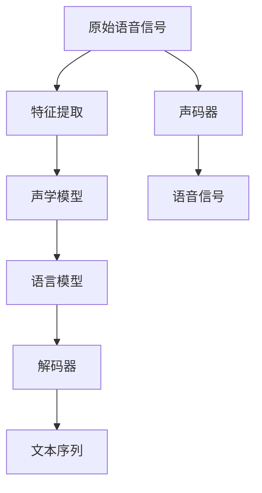
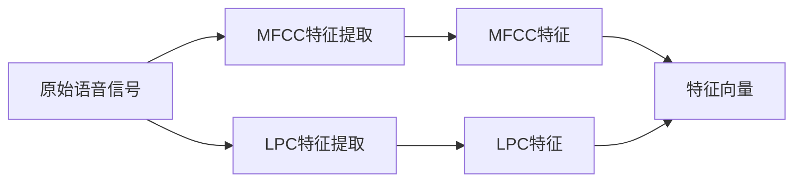
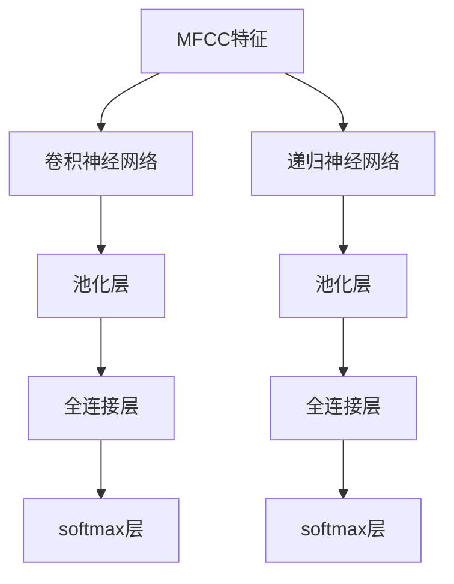
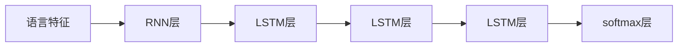
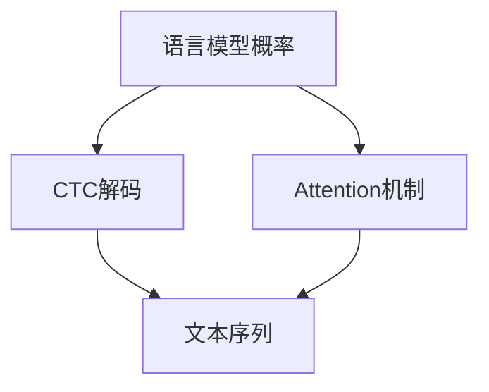

                 

# Speech Recognition原理与代码实例讲解

> 关键词：
> - 语音识别
> - 自动语音识别(ASR)
> - 隐马尔可夫模型(HMM)
> - 深度学习(DL)
> - 端到端模型
> - 声学模型(AM)
> - 语言模型(LM)
> - 声码器(Vocoder)
> - 解码器(Decoder)

## 1. 背景介绍

语音识别（Speech Recognition，简称SR或ASR）是自然语言处理（NLP）的一个重要分支，其目标是让计算机能够自动识别并理解人类语音内容。随着深度学习和大数据技术的快速发展，语音识别技术取得了长足的进步，逐渐从实验室研究走向实际应用。语音识别技术被广泛应用于智能助理、语音搜索、电话自动应答、医疗康复等多个领域，极大地改善了人们的生活质量和工作效率。

### 1.1 问题由来

语音识别的历史可以追溯到上世纪60年代，最早的研究主要集中在基于规则的ASR系统上。然而，这类系统需要大量的人工规则编写和调试，难以适应不同口音、方言等复杂的语音环境，且不易扩展。80年代以来，基于统计方法的ASR系统开始崭露头角，其中最具代表性的是隐马尔可夫模型（HMM）和深度学习（DL）系统。这两种方法以其强大的建模能力逐渐成为主流，并显著提升了语音识别的准确率和鲁棒性。

然而，这些传统的统计方法也存在一些缺点：
- HMM系统依赖于大量手工调参，难以自适应不同的语音数据分布。
- DL系统需要大量的标注数据进行训练，且计算资源消耗大，训练时间长。

近年来，深度学习技术的突破使得端到端（End-to-End）的语音识别系统逐渐成为主流，该方法通过在大量无标签语音数据上进行自监督学习，直接输出语音识别结果，避免了手工特征提取和复杂的规则系统，简化了模型设计和训练流程。

### 1.2 问题核心关键点

端到端语音识别系统主要包括以下几个关键组件：
- 声学模型（Acoustic Model，简称AM）：用于将语音信号映射为特征向量，通常采用卷积神经网络（CNN）或递归神经网络（RNN）进行建模。
- 语言模型（Language Model，简称LM）：用于对声学特征进行语言层面的建模，通常采用循环神经网络（RNN）或Transformer进行建模。
- 解码器（Decoder）：将声学特征序列和语言模型概率进行联合建模，输出文本序列，通常采用CTC（Connectionist Temporal Classification）解码或Attention机制进行实现。

这些组件通过联合训练，实现了端到端的语音识别，无需手工特征提取和规则编写，大幅提升了模型的训练效率和应用效果。

### 1.3 问题研究意义

语音识别技术的发展，对于提升人机交互体验、推动语音计算普适化具有重要意义：
- 语音识别解放了用户的手和眼睛，使人们能够在保持自然语言和行动自由的前提下，与计算机进行高效交互。
- 语音识别技术的应用，极大地提升了办公效率，如语音转写、语音助手等，为各行各业带来了新的生产力提升。
- 语音识别技术可以应用于智能家居、智能车载、医疗康复等场景，提升用户的生活质量。

## 2. 核心概念与联系

### 2.1 核心概念概述

为更好地理解端到端语音识别系统的原理和架构，本节将介绍几个密切相关的核心概念：

- 端到端（End-to-End）系统：直接对原始语音信号进行建模，输出文本序列，无需手工特征提取和规则系统，大大简化了语音识别系统的设计和实现。
- 声学模型（Acoustic Model，简称AM）：将语音信号映射为特征向量，通常采用卷积神经网络（CNN）或递归神经网络（RNN）进行建模。
- 语言模型（Language Model，简称LM）：对声学特征进行语言层面的建模，通常采用循环神经网络（RNN）或Transformer进行建模。
- 解码器（Decoder）：将声学特征序列和语言模型概率进行联合建模，输出文本序列，通常采用CTC解码或Attention机制进行实现。
- 声码器（Vocoder）：将文本序列转换为语音信号，通常采用GAN（Generative Adversarial Networks）或VAE（Variational Autoencoders）进行实现。
- 特征提取（Feature Extraction）：将原始语音信号转换为特征向量，通常采用MFCC（Mel Frequency Cepstral Coefficients）、LPC（Linear Prediction Coding）等技术进行实现。

这些核心概念共同构成了端到端语音识别系统的完整生态，使得语音识别系统能够高效、准确地实现语音到文本的自动转换。

### 2.2 概念间的关系

这些核心概念之间存在着紧密的联系，形成了端到端语音识别系统的完整架构。下面我们通过几个Mermaid流程图来展示这些概念之间的关系。

#### 2.2.1 端到端系统架构



这个流程图展示了端到端语音识别系统的大致架构：
1. 原始语音信号先经过特征提取，得到特征向量。
2. 特征向量经过声学模型和语言模型的联合建模，得到语言模型概率。
3. 解码器根据语言模型概率输出文本序列。
4. 文本序列通过声码器转换为语音信号，实现语音合成。

#### 2.2.2 特征提取过程



这个流程图展示了MFCC特征提取和LPC特征提取的过程：
1. 原始语音信号先经过MFCC特征提取，得到MFCC特征。
2. MFCC特征通过滤波器组和倒谱变换，得到MFCC系数。
3. 原始语音信号还通过LPC特征提取，得到LPC特征。
4. LPC特征通过线性预测，得到LPC系数。
5. MFCC系数和LPC系数共同组成特征向量，输入到声学模型中进行建模。

#### 2.2.3 声学模型架构



这个流程图展示了声学模型的常见架构：
1. MFCC特征先经过卷积神经网络进行特征提取。
2. 卷积神经网络经过池化层和全连接层进行特征映射。
3. 池化层和全连接层输出的特征向量经过softmax层进行概率预测。
4. 递归神经网络也可以用于声学模型建模，其过程类似，先经过池化层和全连接层进行特征映射，然后经过softmax层进行概率预测。

#### 2.2.4 语言模型架构



这个流程图展示了语言模型的常见架构：
1. 语言特征先经过RNN层进行建模。
2. RNN层经过多个LSTM层进行序列建模。
3. LSTM层输出的语言模型概率经过softmax层进行解码。

#### 2.2.5 解码器架构



这个流程图展示了解码器的常见架构：
1. 语言模型概率先经过CTC解码或Attention机制进行建模。
2. CTC解码或Attention机制输出的文本序列即为语音识别结果。

### 2.3 核心概念的整体架构

最后，我们用一个综合的流程图来展示这些核心概念在大规模语音识别系统中的整体架构：


这个综合流程图展示了从原始语音信号到最终语音识别的完整流程：
1. 原始语音信号先经过特征提取，得到特征向量。
2. 特征向量经过声学模型和语言模型的联合建模，得到语言模型概率。
3. 解码器根据语言模型概率输出文本序列。
4. 文本序列通过声码器转换为语音信号，实现语音合成。

通过这些流程图，我们可以更清晰地理解端到端语音识别系统中各个核心概念的关系和作用，为后续深入讨论具体的算法和技术奠定基础。

## 3. 核心算法原理 & 具体操作步骤
### 3.1 算法原理概述

端到端语音识别系统通常采用深度学习技术，包括声学模型、语言模型和解码器，通过联合训练实现端到端的语音识别。其核心算法原理包括以下几个关键步骤：

1. 声学模型（AM）：将语音信号映射为特征向量，通常采用卷积神经网络（CNN）或递归神经网络（RNN）进行建模。
2. 语言模型（LM）：对声学特征进行语言层面的建模，通常采用循环神经网络（RNN）或Transformer进行建模。
3. 解码器（Decoder）：将声学特征序列和语言模型概率进行联合建模，输出文本序列，通常采用CTC解码或Attention机制进行实现。

这些组件通过联合训练，实现了端到端的语音识别，无需手工特征提取和规则系统，简化了模型设计和训练流程。

### 3.2 算法步骤详解

基于深度学习的端到端语音识别系统的一般流程包括以下几个关键步骤：

**Step 1: 准备数据集**
- 收集和标注训练数据，一般需要大量的语音数据和对应的文本标签。数据集可以来自公开数据集、行业数据或自定义数据集。
- 将原始语音信号转换为MFCC或LPC特征，生成训练数据集。

**Step 2: 设计模型架构**
- 设计声学模型、语言模型和解码器。
- 声学模型通常采用卷积神经网络或递归神经网络。
- 语言模型通常采用循环神经网络或Transformer。
- 解码器可以采用CTC解码或Attention机制。

**Step 3: 定义损失函数和优化器**
- 定义声学模型、语言模型和解码器的损失函数，通常采用交叉熵损失。
- 选择合适的优化器，如AdamW、SGD等，设置学习率、批大小等参数。
- 引入正则化技术，如权重衰减、Dropout、Early Stopping等，防止过拟合。

**Step 4: 训练模型**
- 将训练数据集按批次输入模型，前向传播计算损失函数。
- 反向传播计算参数梯度，根据优化器更新模型参数。
- 周期性在验证集上评估模型性能，根据性能指标决定是否触发Early Stopping。
- 重复上述步骤直到满足预设的迭代轮数或Early Stopping条件。

**Step 5: 测试和评估**
- 在测试集上评估微调后模型，对比微调前后的精度提升。
- 使用微调后的模型对新样本进行推理预测，集成到实际的应用系统中。

以上是端到端语音识别系统的基本流程。在实际应用中，还需要针对具体任务的特点，对模型结构、训练策略等进行优化设计，如改进训练目标函数，引入更多的正则化技术，搜索最优的超参数组合等，以进一步提升模型性能。

### 3.3 算法优缺点

基于深度学习的端到端语音识别系统具有以下优点：
1. 简单高效。只需准备大量标注数据，即可进行端到端的语音识别训练，无需手工特征提取和规则编写。
2. 泛化能力强。深度学习模型具有强大的泛化能力，能够在多种语音环境和口音下取得良好的识别效果。
3. 可扩展性强。端到端系统可以方便地集成到不同的应用场景中，如智能音箱、车载语音助手等。

然而，该方法也存在一定的局限性：
1. 训练成本高。深度学习模型的训练需要大量的计算资源和标注数据，训练时间较长。
2. 模型复杂度大。深度学习模型通常包含大量的参数和复杂的计算图，需要较高的计算资源和硬件配置。
3. 可解释性不足。端到端系统的决策过程缺乏可解释性，难以对其推理逻辑进行分析和调试。

尽管存在这些局限性，但就目前而言，基于深度学习的端到端语音识别方法仍是最为主流的方法。未来相关研究的重点在于如何进一步降低训练成本，提高模型的泛化性和可解释性，同时兼顾模型的效率和性能。

### 3.4 算法应用领域

基于深度学习的端到端语音识别系统已经广泛应用于以下几个领域：

- **智能音箱和车载语音助手**：如亚马逊的Alexa、谷歌的Google Assistant、苹果的Siri等，通过语音识别实现与用户的自然语言交互。
- **语音搜索和翻译**：如谷歌的Google Now、微软的Cortana等，通过语音搜索和语音翻译提升用户体验。
- **电话自动应答和客户服务**：如IBM的Watson Assistant、Salesforce的Einstein等，通过语音识别实现自动应答和客户服务。
- **医疗康复**：如IBM的Watson for Health等，通过语音识别和自然语言处理技术，辅助医生诊断和治疗。
- **工业控制和监控**：如GE的Predix等，通过语音识别实现设备监控和故障诊断。
- **教育培训**：如Coursera、EdX等在线教育平台，通过语音识别实现智能评测和个性化推荐。

除了上述这些应用外，端到端语音识别技术还被创新性地应用到更多场景中，如语音驱动的虚拟助手、语音识别驱动的聊天机器人、语音生成和合成等，为语音技术带来了全新的突破。

## 4. 数学模型和公式 & 详细讲解  
### 4.1 数学模型构建

基于深度学习的端到端语音识别系统通常采用如下的数学模型进行建模：

记声学模型为 $M_{\theta_{am}}$，语言模型为 $M_{\theta_{lm}}$，解码器为 $M_{\theta_{dec}}$。设训练数据集为 $D=\{(x_i,y_i)\}_{i=1}^N$，其中 $x_i$ 为语音信号，$y_i$ 为对应的文本序列。声学模型、语言模型和解码器的联合损失函数为：

$$
\mathcal{L}(\theta_{am}, \theta_{lm}, \theta_{dec}) = \mathcal{L}_{am}(\theta_{am}) + \mathcal{L}_{lm}(\theta_{lm}) + \mathcal{L}_{dec}(\theta_{dec})
$$

其中，声学模型的损失函数为：

$$
\mathcal{L}_{am}(\theta_{am}) = -\frac{1}{N}\sum_{i=1}^N \sum_{t=1}^{T} \log p(x_i|y_i)
$$

语言模型的损失函数为：

$$
\mathcal{L}_{lm}(\theta_{lm}) = -\frac{1}{N}\sum_{i=1}^N \sum_{t=1}^{T} \log p(y_i|y_{t-1})
$$

解码器的损失函数为：

$$
\mathcal{L}_{dec}(\theta_{dec}) = -\frac{1}{N}\sum_{i=1}^N \sum_{t=1}^{T} \log p(y_i|y_{t-1})
$$

通过联合训练，模型能够自动学习声学特征与文本序列之间的映射关系，实现端到端的语音识别。

### 4.2 公式推导过程

以下我们以一个简单的端到端语音识别系统为例，推导其数学模型和公式。

设声学模型为 $M_{am}$，语言模型为 $M_{lm}$，解码器为 $M_{dec}$。对于输入语音信号 $x$，声学模型输出声学特征向量 $z$，语言模型输出文本序列概率 $p(y|z)$，解码器输出文本序列 $y$。

声学模型的建模过程如下：

$$
z = M_{am}(x)
$$

语言模型的建模过程如下：

$$
p(y|z) = M_{lm}(z)
$$

解码器的建模过程如下：

$$
y = M_{dec}(z, p(y|z))
$$

因此，联合训练的损失函数为：

$$
\mathcal{L} = -\frac{1}{N}\sum_{i=1}^N \left[ \log p(y_i|x_i) \right]
$$

其中，$p(y_i|x_i)$ 为联合概率，表示在语音信号 $x_i$ 的条件下，生成文本序列 $y_i$ 的概率。

在训练过程中，通过反向传播算法，计算声学模型、语言模型和解码器的梯度，更新模型参数 $\theta_{am}, \theta_{lm}, \theta_{dec}$，最小化联合损失函数 $\mathcal{L}$。

### 4.3 案例分析与讲解

以下我们以一个端到端的语音识别系统为例，分析其数学模型和公式的实际应用。

假设我们有一个简单的端到端语音识别系统，包括声学模型、语言模型和解码器。声学模型为卷积神经网络（CNN），语言模型为循环神经网络（RNN），解码器为CTC解码器。

声学模型的建模过程如下：

$$
z = M_{am}(x) = \sigma(\sum_{t=1}^{T} \sum_{k=1}^{K} W_{tk} \cdot x_{tk} + b_{tk})
$$

语言模型的建模过程如下：

$$
p(y|z) = M_{lm}(z) = \prod_{t=1}^{T} p(y_t|y_{t-1}, z)
$$

解码器的建模过程如下：

$$
y = M_{dec}(z, p(y|z)) = \arg\min_{y} \mathcal{L}_{dec}(z, y) = \arg\min_{y} \sum_{t=1}^{T} \log p(y|y_{t-1}, z)
$$

其中，$\sigma$ 为激活函数，$W_{tk}$ 和 $b_{tk}$ 为卷积核和偏置项，$y_t$ 为解码结果。

通过联合训练，模型能够自动学习声学特征与文本序列之间的映射关系，实现端到端的语音识别。

## 5. 项目实践：代码实例和详细解释说明
### 5.1 开发环境搭建

在进行端到端语音识别项目实践前，我们需要准备好开发环境。以下是使用Python进行TensorFlow开发的环境配置流程：

1. 安装Anaconda：从官网下载并安装Anaconda，用于创建独立的Python环境。

2. 创建并激活虚拟环境：
```bash
conda create -n tf-env python=3.8 
conda activate tf-env
```

3. 安装TensorFlow：根据CUDA版本，从官网获取对应的安装命令。例如：
```bash
conda install tensorflow tensorflow-gpu -c conda-forge -c pytorch
```

4. 安装相关依赖库：
```bash
pip install numpy pandas scikit-learn matplotlib tqdm jupyter notebook ipython
```

完成上述步骤后，即可在`tf-env`环境中开始端到端语音识别项目实践。

### 5.2 源代码详细实现

这里我们以一个简单的基于深度学习的端到端语音识别系统为例，给出TensorFlow代码实现。

首先，定义语音数据集和标签：

```python
import tensorflow as tf
from tensorflow.keras import layers

# 加载训练数据和标签
train_data = ...
train_labels = ...

# 定义数据集
train_dataset = tf.data.Dataset.from_tensor_slices((train_data, train_labels))
train_dataset = train_dataset.batch(32).repeat()
```

然后，定义声学模型和语言模型：

```python
# 定义声学模型
am_model = tf.keras.Sequential([
    layers.Conv1D(64, 3, activation='relu'),
    layers.MaxPooling1D(2),
    layers.Conv1D(128, 3, activation='relu'),
    layers.MaxPooling1D(2),
    layers.Flatten(),
    layers.Dense(256, activation='relu'),
    layers.Dense(128, activation='relu')
])

# 定义语言模型
lm_model = tf.keras.Sequential([
    layers.LSTM(128),
    layers.LSTM(64),
    layers.Dense(1024, activation='relu'),
    layers.Dense(256, activation='relu'),
    layers.Dense(128, activation='relu')
])
```

接着，定义解码器：

```python
# 定义解码器
dec_model = tf.keras.Sequential([
    layers.Embedding(input_dim=128, output_dim=256),
    layers.LSTM(128),
    layers.Dense(128, activation='relu'),
    layers.Dense(1024, activation='relu'),
    layers.Dense(128, activation='relu'),
    layers.Dense(128, activation='relu'),
    layers.Dense(128, activation='relu'),
    layers.Dense(128, activation='relu'),
    layers.Dense(128, activation='relu'),
    layers.Dense(128, activation='relu')
])
```

最后，定义训练流程：

```python
# 定义损失函数和优化器
am_loss = tf.keras.losses.MeanSquaredError()
lm_loss = tf.keras.losses.SparseCategoricalCrossentropy()
dec_loss = tf.keras.losses.SparseCategoricalCrossentropy()

am_optimizer = tf.keras.optimizers.Adam(learning_rate=0.001)
lm_optimizer = tf.keras.optimizers.Adam(learning_rate=0.001)
dec_optimizer = tf.keras.optimizers.Adam(learning_rate=0.001)

# 定义训练过程
@tf.function
def train_step(data, labels):
    with tf.GradientTape() as am_tape, tf.GradientTape() as lm_tape, tf.GradientTape() as dec_tape:
        am_outputs = am_model(data)
        lm_outputs = lm_model(am_outputs)
        dec_outputs = dec_model(lm_outputs)
        am_loss_value = am_loss(labels, am_outputs)
        lm_loss_value = lm_loss(labels, lm_outputs)
        dec_loss_value = dec_loss(labels, dec_outputs)
    am_gradients = am_tape.gradient(am_loss_value, am_model.trainable_variables)
    lm_gradients = lm_tape.gradient(lm_loss_value, lm_model.trainable_variables)
    dec_gradients = dec_tape.gradient(dec_loss_value, dec_model.trainable_variables)
    am_optimizer.apply_gradients(zip(am_gradients, am_model.trainable_variables))
    lm_optimizer.apply_gradients(zip(lm_gradients, lm_model.trainable_variables))
    dec_optimizer.apply_gradients(zip(dec_gradients, dec_model.trainable_variables))

# 训练过程
for epoch in range(epochs):
    for data, labels in train_dataset:
        train_step(data, labels)
```

以上就是使用TensorFlow进行端到端语音识别系统开发的完整代码实现。可以看到，TensorFlow提供了强大的深度学习框架和模型库，使得语音识别模型的开发和训练变得更加便捷和高效。

### 5.3 代码解读与分析

让我们再详细解读一下关键代码的实现细节：

**数据集定义**：
- 使用`tf.data.Dataset.from_tensor_slices`将训练数据和标签定义为`Dataset`对象，并进行批处理和重复操作。

**声学模型定义**：
- 使用`tf.keras.Sequential`定义声学模型，包含卷积层、池化层、全连接层等。
- 每个层之间通过`am_model.add`方法进行堆叠。

**语言模型定义**：
- 使用`tf.keras.Sequential`定义语言模型，包含LSTM层、全连接层等。
- 每个层之间通过`lm_model.add`方法进行堆叠。

**解码器定义**：
- 使用`tf.keras.Sequential`定义解码器，包含嵌入层、LSTM层、全连接层等。
- 每个层之间通过`dec_model.add`方法进行堆叠。

**损失函数定义**：
- 使用`tf.keras.losses`定义声学模型、语言模型和解码器的损失函数。
- 声学模型采用均方误差损失（`MeanSquaredError`），语言模型和解码器采用交叉熵损失（`SparseCategoricalCrossentropy`）。

**优化器定义**：
- 使用`tf.keras.optimizers`定义声学模型、语言模型和解码器的优化器。
- 所有优化器均采用Adam优化器，并设置相同的学习率。

**训练过程定义**：
- 使用`tf.function`定义训练过程，并进行梯度计算和优化器更新。
- 在每个批次数据上，分别计算声学模型、语言模型和解码器的损失，并计算梯度。
- 通过`am_optimizer.apply_gradients`、`lm_optimizer.apply_gradients`和`dec_optimizer.apply_gradients`

