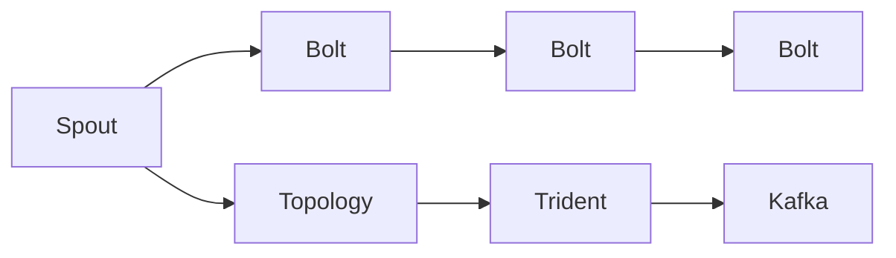
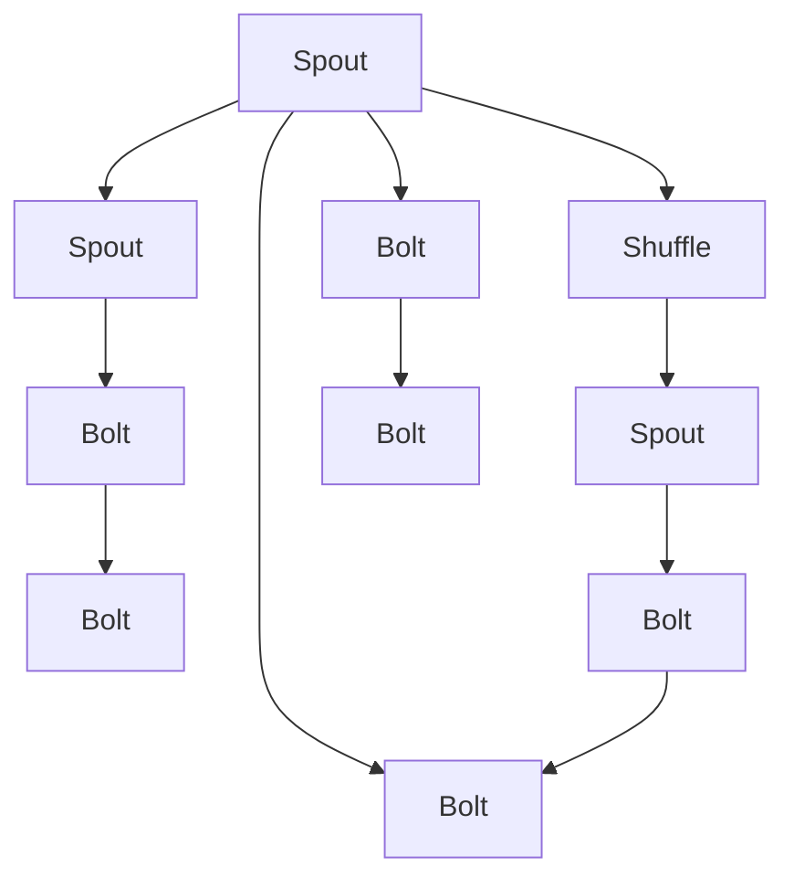
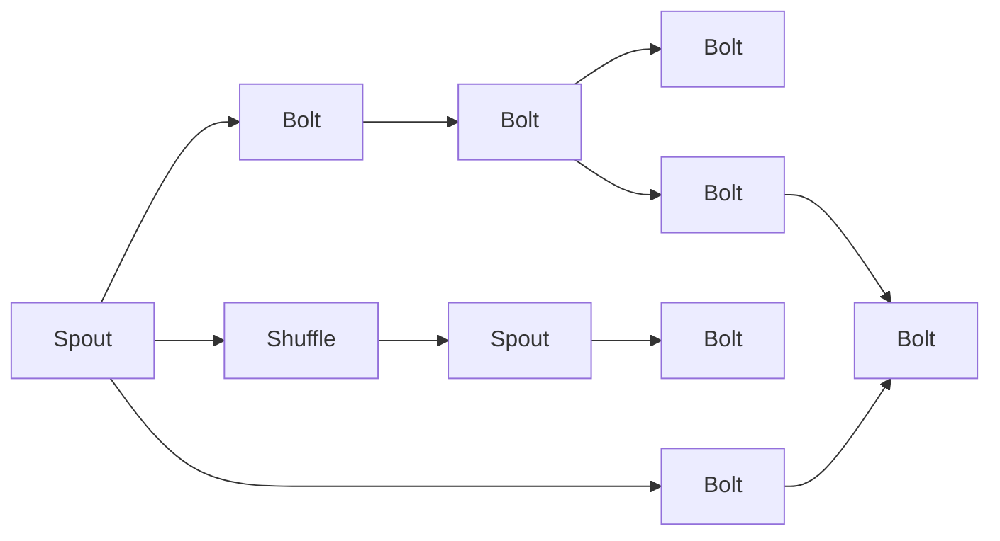
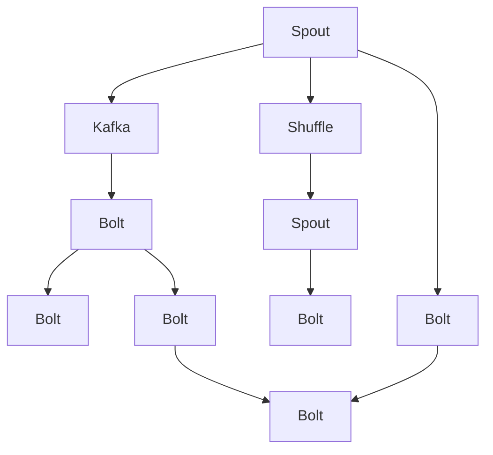

                 

# Storm原理与代码实例讲解

> 关键词：Storm,分布式流处理,Apache Kafka,Spark,微服务架构

## 1. 背景介绍

### 1.1 问题由来
Storm是一个开源的分布式流处理系统，由Twitter开发并于2011年开源。Storm能够处理海量数据流，支持实时数据处理、分布式计算等，广泛应用于实时数据处理、金融分析、日志分析、在线广告等场景。Storm的原理、架构和代码实现非常复杂，但同时也有一些非常优秀的设计理念，值得深入研究。

### 1.2 问题核心关键点
Storm的核心概念包括：
- Spout：负责从消息队列中获取数据，生成数据流。
- Bolt：负责对数据流进行处理，可以是数据存储、数据计算、数据过滤、数据统计等。
- Topology：是一个Spout和Bolt的拓扑结构图，描述了一个数据流处理的完整逻辑流程。
- Trident：是一个高层次的API，可以方便地对实时数据流进行分组、聚合等操作。

这些概念构成了Storm的基本架构，也奠定了Storm的核心优势。Storm的设计理念包括：
- 高效分布式：基于分布式计算模型，实现数据并行处理。
- 实时处理：通过Spout-Bolt的异步机制，实现数据的实时流处理。
- 可靠性和容错性：通过Bolt的shuffle机制，保证数据流处理的可靠性和容错性。

### 1.3 问题研究意义
Storm能够实时处理海量数据流，适应高并发的数据处理需求。通过对Storm原理的深入研究，可以更好地理解其设计理念和实现细节，优化Storm的性能，提升Storm的应用效果，加速Storm在更多场景下的应用。

## 2. 核心概念与联系

### 2.1 核心概念概述

为更好地理解Storm的原理和架构，本节将介绍几个密切相关的核心概念：

- Spout：负责从消息队列中获取数据，生成数据流。Spout是Storm的入口，所有的数据流处理都是从Spout开始的。

- Bolt：负责对数据流进行处理，可以是数据存储、数据计算、数据过滤、数据统计等。Bolt是Storm的核心组件，实现数据流处理的具体逻辑。

- Topology：是一个Spout和Bolt的拓扑结构图，描述了一个数据流处理的完整逻辑流程。Topology是Storm的宏观结构，由多个Spout和Bolt组成。

- Trident：是一个高层次的API，可以方便地对实时数据流进行分组、聚合等操作。Trident是Storm的一个高级组件，实现了数据的复杂处理逻辑。

- Apache Kafka：是一个分布式消息队列，用于存储和传输数据流。Kafka是Storm的主要数据源，Storm通过Kafka获取数据流，并进行处理。

这些核心概念之间的逻辑关系可以通过以下Mermaid流程图来展示：



这个流程图展示了几大核心概念的关系：

1. Spout负责从Kafka获取数据流，生成数据流。
2. Bolt对数据流进行处理，输出新的数据流。
3. Topology由多个Spout和Bolt组成，描述数据流处理的完整逻辑流程。
4. Trident是对数据流的高层次处理，可以实现复杂的分组、聚合操作。
5. Kafka用于存储和传输数据流，是Storm的主要数据源。

### 2.2 概念间的关系

这些核心概念之间存在着紧密的联系，形成了Storm的数据流处理架构。下面我通过几个Mermaid流程图来展示这些概念之间的关系。

#### 2.2.1 Storm的分布式处理



这个流程图展示了Storm的分布式处理机制。Spout负责从Kafka获取数据流，生成数据流。Bolt对数据流进行处理，输出新的数据流。Spout和Bolt之间通过shuffle机制进行数据分发，实现数据的并行处理。

#### 2.2.2 Trident的分布式处理



这个流程图展示了Trident的分布式处理机制。Trident通过Spout-Bolt的shuffle机制进行数据分发，实现数据的并行处理。Trident对数据流进行分组、聚合等复杂处理，支持高层次的数据处理逻辑。

#### 2.2.3 Kafka的数据流传输



这个流程图展示了Kafka在Storm中的作用。Kafka用于存储和传输数据流，Spout从Kafka中获取数据流，并进行处理。Bolt将处理后的数据流发送回Kafka，以便后续处理。

### 2.3 核心概念的整体架构

最后，我们用一个综合的流程图来展示这些核心概念在大数据流处理中的整体架构：

```mermaid
graph TB
    A[Spout] --> B[Bolt]
    B --> C[Bolt]
    C --> D[Bolt]
    A --> E[Shuffle]
    E --> F[Spout]
    F --> G[Bolt]
    A --> H[Bolt]
    C --> I[Bolt]
    I --> J[Bolt]
    H --> J
    A --> K[Trident]
    K --> L[Bolt]
    L --> M[Bolt]
    M --> N[Bolt]
    K --> O[Bolt]
    O --> P[Bolt]
    P --> Q[Bolt]
    Q --> R[Bolt]
    R --> S[Bolt]
    L --> S
    M --> T[Bolt]
    T --> U[Bolt]
    U --> V[Bolt]
    V --> W[Bolt]
    O --> W
    P --> X[Bolt]
    X --> Y[Bolt]
    Y --> Z[Bolt]
    Z --> AA[Bolt]
    T --> AA
    U --> AB[Bolt]
    AB --> AC[Bolt]
    V --> AC
    W --> AD[Bolt]
    X --> AD
    Y --> AE[Bolt]
    Z --> AE
    AD --> AF[Bolt]
    AF --> AG[Bolt]
    AE --> AG
    AF --> AH[Bolt]
    AG --> AH
    AH --> AI[Bolt]
    AI --> AJ[Bolt]
    AJ --> AK[Bolt]
    AK --> AL[Bolt]
    AI --> AM[Bolt]
    AM --> AN[Bolt]
    AN --> AO[Bolt]
    AO --> AP[Bolt]
    AO --> AQ[Bolt]
    AQ --> AR[Bolt]
    AR --> AS[Bolt]
    AS --> AT[Bolt]
    AT --> AU[Bolt]
    AU --> AV[Bolt]
    AV --> AW[Bolt]
    AW --> AX[Bolt]
    AX --> AY[Bolt]
    AY --> AZ[Bolt]
    AZ --> BA[Bolt]
    AT --> BA
    AU --> BB[Bolt]
    BB --> BC[Bolt]
    AV --> BC
    AW --> BC
    AX --> BC
    AY --> BC
    AZ --> BC
    BA --> BC
    BB --> BD[Bolt]
    BC --> BE[Bolt]
    BD --> BF[Bolt]
    BE --> BG[Bolt]
    BF --> BG
    BD --> BH[Bolt]
    BG --> BH
    BH --> BI[Bolt]
    BI --> BJ[Bolt]
    BJ --> BK[Bolt]
    BK --> BL[Bolt]
    BI --> BM[Bolt]
    BM --> BN[Bolt]
    BN --> BO[Bolt]
    BO --> BP[Bolt]
    BO --> BQ[Bolt]
    BQ --> BR[Bolt]
    BR --> BS[Bolt]
    BS --> BT[Bolt]
    BT --> BU[Bolt]
    BU --> BV[Bolt]
    BV --> BW[Bolt]
    BW --> BX[Bolt]
    BX --> BY[Bolt]
    BY --> BZ[Bolt]
    BZ --> CA[Bolt]
    BT --> CA
    BU --> CB[Bolt]
    CB --> CC[Bolt]
    BV --> CC
    BW --> CC
    BX --> CC
    BY --> CC
    BZ --> CC
    CA --> CC
    CB --> CD[Bolt]
    CC --> CE[Bolt]
    CD --> CF[Bolt]
    CE --> CG[Bolt]
    CF --> CG
    CD --> CH[Bolt]
    CG --> CH
    CH --> CI[Bolt]
    CI --> CJ[Bolt]
    CJ --> CK[Bolt]
    CK --> CL[Bolt]
    CI --> CM[Bolt]
    CM --> CN[Bolt]
    CN --> CO[Bolt]
    CO --> CP[Bolt]
    CO --> CQ[Bolt]
    CQ --> CR[Bolt]
    CR --> CS[Bolt]
    CS --> CT[Bolt]
    CT --> CU[Bolt]
    CU --> CV[Bolt]
    CV --> CW[Bolt]
    CW --> CX[Bolt]
    CX --> CY[Bolt]
    CY --> CZ[Bolt]
    CZ --> DA[Bolt]
    CT --> DA
    CU --> DB[Bolt]
    DB --> DC[Bolt]
    CV --> DC
    CW --> DC
    CX --> DC
    CY --> DC
    CZ --> DC
    DA --> DC
    DB --> DD[Bolt]
    DC --> DE[Bolt]
    DD --> DF[Bolt]
    DE --> DG[Bolt]
    DF --> DG
    DD --> DH[Bolt]
    DG --> DH
    DH --> DI[Bolt]
    DI --> DJ[Bolt]
    DJ --> DK[Bolt]
    DK --> DL[Bolt]
    DI --> DM[Bolt]
    DM --> DN[Bolt]
    DN --> DO[Bolt]
    DO --> DP[Bolt]
    DO --> DQ[Bolt]
    DQ --> DR[Bolt]
    DR --> DS[Bolt]
    DS --> DT[Bolt]
    DT --> DU[Bolt]
    DU --> DV[Bolt]
    DV --> DW[Bolt]
    DW --> DX[Bolt]
    DX --> DY[Bolt]
    DY --> DZ[Bolt]
    DZ --> EA[Bolt]
    DS --> EA
    DT --> EB[Bolt]
    EB --> EC[Bolt]
    DV --> EC
    DW --> EC
    DX --> EC
    DY --> EC
    DZ --> EC
    EA --> EC
    EB --> ED[Bolt]
    EC --> EE[Bolt]
    ED --> EF[Bolt]
    EE --> EG[Bolt]
    EF --> EG
    ED --> EH[Bolt]
    EG --> EH
    EH --> EI[Bolt]
    EI --> EJ[Bolt]
    EJ --> EK[Bolt]
    EK --> EL[Bolt]
    EI --> EM[Bolt]
    EM --> EN[Bolt]
    EN --> EO[Bolt]
    EO --> EP[Bolt]
    EO --> EQ[Bolt]
    EQ --> ER[Bolt]
    ER --> ES[Bolt]
    ES --> ET[Bolt]
    ET --> EU[Bolt]
    EU --> EV[Bolt]
    EV --> EW[Bolt]
    EW --> EX[Bolt]
    EX --> EY[Bolt]
    EY --> EZ[Bolt]
    EZ --> FA[Bolt]
    ET --> FA
    EU --> FB[Bolt]
    FB --> FC[Bolt]
    EV --> FC
    EW --> FC
    EX --> FC
    EY --> FC
    EZ --> FC
    FA --> FC
    FB --> FD[Bolt]
    FC --> FE[Bolt]
    FD --> FF[Bolt]
    FE --> FG[Bolt]
    FF --> FG
    FD --> FH[Bolt]
    FG --> FH
    FH --> FI[Bolt]
    FI --> FJ[Bolt]
    FJ --> FK[Bolt]
    FK --> FL[Bolt]
    FI --> FM[Bolt]
    FM --> FN[Bolt]
    FN --> FO[Bolt]
    FO --> FP[Bolt]
    FO --> FQ[Bolt]
    FQ --> FR[Bolt]
    FR --> FS[Bolt]
    FS --> FT[Bolt]
    FT --> FU[Bolt]
    FU --> FV[Bolt]
    FV --> FW[Bolt]
    FW --> FX[Bolt]
    FX --> FY[Bolt]
    FY --> FZ[Bolt]
    FZ --> GA[Bolt]
    FT --> GA
    FU --> GB[Bolt]
    GB --> GC[Bolt]
    FV --> GC
    FW --> GC
    FX --> GC
    FY --> GC
    FZ --> GC
    GA --> GC
    GB --> GD[Bolt]
    GC --> GE[Bolt]
    GD --> GF[Bolt]
    GE --> GG[Bolt]
    GF --> GG
    GD --> GH[Bolt]
    GG --> GH
    GH --> GI[Bolt]
    GI --> GJ[Bolt]
    GJ --> GK[Bolt]
    GK --> GL[Bolt]
    GI --> GM[Bolt]
    GM --> GN[Bolt]
    GN --> GO[Bolt]
    GO --> GP[Bolt]
    GO --> GQ[Bolt]
    GQ --> GR[Bolt]
    GR --> GS[Bolt]
    GS --> GT[Bolt]
    GT --> GU[Bolt]
    GU -->GV[Bolt]
    GV --> GW[Bolt]
    GW --> GX[Bolt]
    GX --> GY[Bolt]
    GY --> GZ[Bolt]
    GZ --> HA[Bolt]
    GS --> HA
    GT --> HB[Bolt]
    HB --> HC[Bolt]
    GV --> HC
    GW --> HC
    GX --> HC
    GY --> HC
    GZ --> HC
    HA --> HC
    HB --> HD[Bolt]
    HC --> HE[Bolt]
    HD --> HF[Bolt]
    HE --> HG[Bolt]
    HF --> HG
    HD --> HH[Bolt]
    HG --> HH
    HH --> HI[Bolt]
    HI --> HJ[Bolt]
    HJ --> HK[Bolt]
    HK --> HL[Bolt]
    HI --> HM[Bolt]
    HM --> HN[Bolt]
    HN --> HO[Bolt]
    HO --> HP[Bolt]
    HO --> HQ[Bolt]
    HQ --> HR[Bolt]
    HR --> HS[Bolt]
    HS --> HT[Bolt]
    HT --> HU[Bolt]
    HU --> HV[Bolt]
    HV --> HW[Bolt]
    HW --> HX[Bolt]
    HX --> HY[Bolt]
    HY --> HZ[Bolt]
    HZ --> IA[Bolt]
    HT --> IA
    HU --> IB[Bolt]
    IB --> IC[Bolt]
    HV --> IC
    HW --> IC
    HX --> IC
    HY --> IC
    HZ --> IC
    IA --> IC
    IB --> ID[Bolt]
    IC --> IE[Bolt]
    ID --> IF[Bolt]
    IE --> IG[Bolt]
    IF --> IG
    ID --> IH[Bolt]
    IG --> IH
    IH --> II[Bolt]
    II --> IJ[Bolt]
    IJ --> IK[Bolt]
    IK --> IL[Bolt]
    II --> IM[Bolt]
    IM --> IN[Bolt]
    IN --> IO[Bolt]
    IO --> IP[Bolt]
    IO --> IQ[Bolt]
    IQ --> IR[Bolt]
    IR --> IS[Bolt]
    IS --> IT[Bolt]
    IT --> IU[Bolt]
    IU --> IV[Bolt]
    IV --> IW[Bolt]
    IW --> IX[Bolt]
    IX --> IY[Bolt]
    IY --> IZ[Bolt]
    IZ --> JA[Bolt]
    IT --> JA
    IU --> JB[Bolt]
    JB --> JC[Bolt]
    IV --> JC
    IW --> JC
    IX --> JC
    IY --> JC
    IZ --> JC
    JA --> JC
    JB --> JD[Bolt]
    JC --> JE[Bolt]
    JD --> JF[Bolt]
    JE --> JG[Bolt]
    JF --> JG
    JD --> JH[Bolt]
    JG --> JH
    JH --> Ji[Bolt]
    Ji --> Jj[Bolt]
    Jj --> Jk[Bolt]
    Jk --> Jl[Bolt]
    Ji --> Jm[Bolt]
    Jm --> Jn[Bolt]
    Jn --> Jo[Bolt]
    Jo --> JP[Bolt]
    Jo --> JQ[Bolt]
    JQ --> JR[Bolt]
    JR --> JS[Bolt]
    JS --> JT[Bolt]
    JT --> JU[Bolt]
    JU --> JV[Bolt]
    JV --> JW[Bolt]
    JW --> JX[Bolt]
    JX --> JY[Bolt]
    JY --> JZ[Bolt]
    JZ --> KA[Bolt]
    JS --> KA
    JT --> KB[Bolt]
    KB --> KC[Bolt]
    JV --> KC
    JW --> KC
    JX --> KC
    JY --> KC
    JZ --> KC
    KA --> KC
    KB --> KD[Bolt]
    KC --> KE[Bolt]
    KD --> KF[Bolt]
    KE --> KG[Bolt]
    KF --> KG
    KD --> KH[Bolt]
    KG --> KH
    KH --> Ki[Bolt]
    Ki --> Kj[Bolt]
    Kj --> Kk[Bolt]
    Kk --> Kl[Bolt]
    Ki --> Km[Bolt]
    Km --> Kn[Bolt]
    Kn --> Ko[Bolt]
    Ko --> KP[Bolt]
    Ko --> KQ[Bolt]
    KQ --> KR[Bolt]
    KR --> KS[Bolt]
    KS --> KT[Bolt]
    KT --> KU[Bolt]
    KU --> KV[Bolt]
    KV --> KW[Bolt]
    KW --> KX[Bolt]
    KX --> KY[Bolt]
    KY --> KZ[Bolt]
    KZ --> LA[Bolt]
    KT --> LA
    KU --> LB[Bolt]
    LB --> LC[Bolt]
    KV --> LC
    KW --> LC
    KX --> LC
    KY --> LC
    KZ --> LC
    LA --> LC
    LB --> LD[Bolt]
    LC --> LE[Bolt]
    LD --> LF[Bolt]
    LE --> LG[Bolt]
    LF --> LG
    LD --> LH[Bolt]
    LG --> LH
    LH --> Li[Bolt]
    Li --> Lj[Bolt]
    Lj --> Lk[Bolt]
    Lk --> Ll[Bolt]
    Li --> Lm[Bolt]
    Lm --> Ln[Bolt]
    Ln --> Lo[Bolt]
    Lo --> LP[Bolt]
    Lo --> LQ[Bolt]
    LQ --> LR[Bolt]
    LR --> LS[Bolt]
    LS --> LT[Bolt]
    LT --> LU[Bolt]
    LU --> LV[Bolt]
    LV --> LW[Bolt]
    LW --> LX[Bolt]
    LX --> LY[Bolt]
    LY --> LZ[Bolt]
    LZ --> MA[Bolt]
    LS --> MA
    LT --> MB[Bolt]
    MB --> MC[Bolt]
    LV --> MC
    LW --> MC
    LX --> MC
    LY --> MC
    LZ --> MC
    MA --> MC
    MB --> MD[Bolt]
    MC --> ME[Bolt]
    MD --> MF[Bolt]
    ME --> MG[Bolt]
    MF --> MG
    MD --> MH[Bolt]
    MG --> MH
    MH --> Mi[Bolt]
    Mi --> Mj[Bolt]
    Mj --> Mk[Bolt]
    Mk --> Ml[Bolt]
    Mi --> Mm[Bolt]
    Mm --> Mn[Bolt]
    Mn --> Mo[Bolt]
    Mo --> MP[Bolt]
    Mo --> MQ[Bolt]
    MQ --> MR[Bolt]
    MR --> MS[Bolt]
    MS --> MT[Bolt]
    MT --> MU[Bolt]
    MU --> MV[Bolt]
    MV --> MW[Bolt]
    MW --> MX[Bolt]
    MX --> MY[Bolt]
    MY --> MZ[Bolt]
    MZ --> NA[Bolt]
    MT --> NA
    MU --> NB[Bolt]
    NB --> NC[Bolt]
    MV --> NC
    MW --> NC
    MX --> NC
    MY --> NC
    MZ --> NC
    NA --> NC
    NB --> ND[Bolt]
    NC --> NE[Bolt]
    ND --> NF[Bolt]
    NE --> NG[Bolt]
    NF --> NG
    ND --> NH[Bolt]
    NG --> NH
    NH --> Ni[Bolt]
    Ni --> Nj[Bolt]
    Nj --> Nk[Bolt]
    Nk --> Nl[Bolt]
    Ni --> Nm[Bolt]
    Nm --> Nn[Bolt]
    Nn --> No[Bolt]
    No --> NP[Bolt]
    No --> NQ[Bolt]
    NQ --> NR[Bolt]
    NR --> NS[Bolt]
    NS --> NT[Bolt]
    NT --> NU[Bolt]
    NU --> NV[Bolt]
    NV --> NW[Bolt]
    NW --> NX[Bolt]
    NX --> NY[Bolt]
    NY --> NZ[Bolt]
    NZ --> OA[Bolt]
    NS --> OA
    NT --> OB[Bolt]
    OB --> OC[Bolt]
    NV --> OC
    NW --> OC
    NX --> OC
    NY --> OC
    NZ --> OC
    OA --> OC
    OB --> OD[Bolt]
    OC --> OE[Bolt]
    OD --> OF[Bolt]
    OE --> OG[Bolt]
    OF --> OG
    OD --> OH[Bolt]
    OG --> OH
    OH --> Oi[Bolt]
    Oi --> Oj[Bolt]
    Oj --> Ok[Bolt]
    Ok --> Ol[Bolt]
    Oi --> Om[Bolt]
    Om --> On[Bolt]
    On --> Oo[Bolt]
    Oo --> OP[Bolt]
    Oo --> OQ[Bolt]
    OQ --> OR[Bolt]
    OR --> OS[Bolt]
    OS --> OT[Bolt]
    OT -->OU[Bolt]
    OU -->OV[Bolt]
    OV --> OW[Bolt]
    OW --> OX[Bolt]
    OX --> OY[Bolt]
    OY --> OZ[Bolt]
    OZ --> PA[Bolt]
    OS --> PA
    OT --> PB[Bolt]
    PB --> PC[Bolt]
    OV --> PC
    OW --> PC
    OX --> PC
    OY --> PC
    OZ --> PC
    PA --> PC
    PB --> PD[Bolt]
    PC --> PE[Bolt]
    PD --> PF[Bolt]
    PE --> PG[Bolt]
    PF --> PG
    PD --> PH[Bolt]
    PG --> PH
    PH --> Pi[Bolt]
    Pi --> Pj[Bolt]
    Pj --> Pk[Bolt]
    Pk --> Pl[Bolt]
    Pi --> Pm[Bolt]
    Pm --> Pn[Bolt]
    Pn --> Po[Bolt]
    Po --> PP[Bolt]
    Po --> PQ[Bolt]
    PQ --> PR[Bolt]
    PR --> PS[Bolt]
    PS --> PT[Bolt]
    PT -->PU[Bolt]
    PU -->PV[Bolt]
    PV --> PW[Bolt]
    PW --> PX[Bolt]
    PX --> PY[Bolt]
    PY --> PZ[Bolt]
    PZ --> QA[Bolt]
    PS --> QA
    PT --> QB[Bolt]
    QB --> QC[Bolt]
    PV --> QC
    PW --> QC
    PX --> QC
    PY --> QC
    PZ --> QC
    QA --> QC
    QB --> QD[Bolt]
    QC --> QE[Bolt]
    QD --> QF[Bolt]
    QE --> QG[Bolt]
    QF --> QG
    QD --> QH[Bolt]
    QG --> QH
    QH --> Qi[Bolt]
    Qi --> Qj[Bolt]
    Qj --> Qk[Bolt]
    Qk --> Ql[Bolt]
    Qi --> Qm[Bolt]
    Qm --> Qn[Bolt]
    Qn --> Qo[Bolt]
    Qo --> QP[Bolt]
    Qo --> QQ[Bolt]
    QQ --> QR[Bolt]
    QR --> QS[Bolt]
    QS --> QT[Bolt]
    QT --> QU[Bolt]
    QU --> QV[Bolt]
    QV --> QW[Bolt]
    QW --> QX[Bolt]
    QX --> QY[Bolt]
    QY --> QZ[Bolt]
    QZ --> RA[Bolt]
    QT --> RA
    QU --> RB[Bolt]
    RB --> RC[Bolt]
    QV --> RC
    QW --> RC
    QX --> RC
    QY --> RC
    QZ --> RC
    RA --> RC
    RB --> RD[Bolt]
    RC --> RE[Bolt]
    RD --> RF[Bolt]
    RE --> RG[Bolt]
    RF --> RG
    RD --> RH[Bolt]
    RG --> RH
    RH --> Ri[Bolt]
    Ri --> Rj[Bolt]
    Rj --> Rk[Bolt]
    Rk --> Rl[Bolt]
    Ri --> Rm[Bolt]
    Rm --> Rn[Bolt]
    Rn --> Ro

