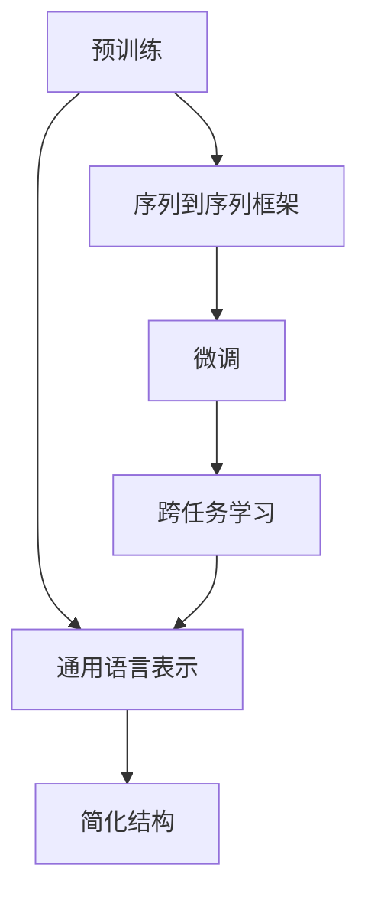
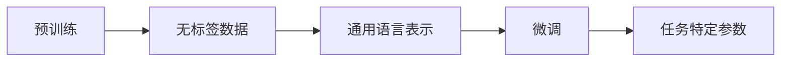
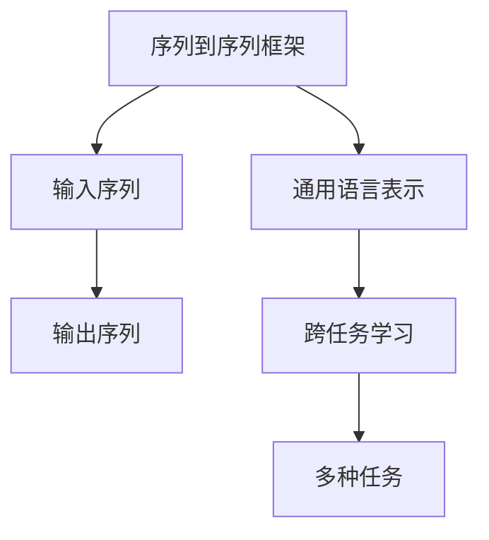
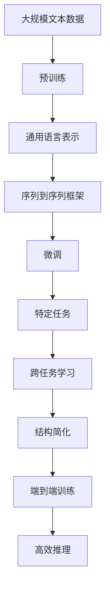

                 

# T5(Text-to-Text Transfer Transformer) - 原理与代码实例讲解

## 1. 背景介绍

### 1.1 问题由来
在自然语言处理（NLP）领域，文本到文本（Text-to-Text Transfer）任务占据了重要的地位。文本到文本任务涵盖了许多重要的应用，包括机器翻译、问答、摘要、文本生成等。传统的文本到文本任务需要大量的标注数据和复杂的模型结构进行训练，这使得这些任务的实现变得复杂且成本高昂。

随着Transformer架构的提出，文本到文本任务的研究进入了一个新的阶段。T5模型作为Transformer架构下的一种通用文本处理模型，通过在大规模无标签文本语料上进行预训练，学习到通用的语言表示，在各种文本到文本任务上展现出了优异的性能。T5模型不仅能够在预训练阶段自适应多种任务，还能在微调阶段快速适应新的任务，大大简化了文本到文本任务的开发和部署过程。

### 1.2 问题核心关键点
T5模型通过自监督学习和跨任务微调实现了一系列的文本到文本任务。其主要特点包括：
- 通用性：T5模型预训练于大规模无标签文本数据上，学习到通用的语言表示，适用于多种文本处理任务。
- 跨任务微调：T5模型能够在微调阶段快速适应新的文本到文本任务，无需重新训练。
- 轻量级部署：T5模型结构简单，推理速度快，容易部署到实际应用中。
- 端到端训练：T5模型在训练阶段采用了端到端的序列到序列（Sequence-to-Sequence）框架，简化了模型设计和训练流程。

### 1.3 问题研究意义
T5模型的提出，极大地推动了文本到文本任务的研究和应用，具有以下几方面的重要意义：
- 提升任务性能：T5模型在多种文本处理任务上展现出了优异的性能，能够显著提升任务的精度和效果。
- 降低开发成本：T5模型的通用性和跨任务微调能力，大大减少了标注数据和模型开发的成本。
- 加速模型迭代：T5模型基于自监督学习进行预训练，能够快速适应新的数据和任务，加速模型迭代和优化。
- 促进研究进展：T5模型为文本到文本任务的研究提供了新的方法和工具，推动了NLP领域的研究进展。
- 赋能产业应用：T5模型的轻量级和端到端特性，使其容易部署到各种实际应用场景中，促进了NLP技术的产业应用。

## 2. 核心概念与联系

### 2.1 核心概念概述

T5模型是一种基于Transformer架构的序列到序列模型，其主要设计目标是实现文本到文本任务的通用化。T5模型的核心概念包括：

- **序列到序列（Seq2Seq）框架**：T5模型采用序列到序列的架构，将输入序列映射到输出序列。在文本生成、问答、摘要等任务中，输入序列和输出序列的对应关系十分重要。
- **预训练（Pretraining）**：T5模型在大规模无标签文本数据上进行预训练，学习到通用的语言表示。预训练使得模型能够在多种文本处理任务上表现出色。
- **微调（Fine-Tuning）**：T5模型通过微调适应特定文本到文本任务，提升模型在该任务上的性能。
- **跨任务学习（Cross-Task Learning）**：T5模型能够在预训练和微调阶段学习到多种文本处理任务的知识，使其能够在新的任务上快速适应。
- **结构简化（Simplified Architecture）**：T5模型采用Transformer编码器-解码器结构，结构简单，易于部署和优化。

这些核心概念通过以下Mermaid流程图展示它们之间的联系：



这个流程图展示了预训练、序列到序列框架、微调、跨任务学习和简化结构这五个核心概念之间的关系：

1. 预训练学习到通用的语言表示。
2. 序列到序列框架将输入序列映射到输出序列。
3. 微调使得模型适应特定的文本到文本任务。
4. 跨任务学习使得模型学习多种文本处理任务的知识。
5. 简化结构使模型易于部署和优化。

### 2.2 概念间的关系

这些核心概念之间存在着紧密的联系，形成了T5模型处理文本到文本任务的完整生态系统。以下通过几个Mermaid流程图展示这些概念之间的关系。

#### 2.2.1 预训练与微调的关系



这个流程图展示了预训练和微调之间的关系：

1. 预训练在无标签数据上学习到通用的语言表示。
2. 微调通过有标签数据使模型适应特定的文本到文本任务。
3. 微调过程学习到任务特定的参数。

#### 2.2.2 序列到序列与跨任务学习的关系



这个流程图展示了序列到序列框架和跨任务学习之间的关系：

1. 序列到序列框架将输入序列映射到输出序列。
2. 通用语言表示在预训练阶段学习到通用的语言知识。
3. 跨任务学习使得模型学习多种文本处理任务的知识。
4. 多种任务是模型在微调阶段需要适应的具体任务。

#### 2.2.3 简化结构与端到端训练的关系


这个流程图展示了简化结构和端到端训练之间的关系：

1. 简化结构采用Transformer编码器-解码器。
2. 端到端训练简化模型的设计。
3. 高效推理使得模型易于部署和优化。

### 2.3 核心概念的整体架构

最后，用一个综合的流程图来展示这些核心概念在大语言模型微调过程中的整体架构：



这个综合流程图展示了从预训练到微调，再到跨任务学习和结构简化，最终实现高效推理的完整过程。通过这些流程图，我们可以更清晰地理解T5模型处理文本到文本任务的各个环节和核心概念。

## 3. 核心算法原理 & 具体操作步骤
### 3.1 算法原理概述

T5模型的核心算法原理是自监督学习和跨任务微调。具体来说，T5模型首先在大规模无标签文本数据上进行自监督预训练，学习到通用的语言表示。然后，在微调阶段，通过有标签数据，T5模型能够适应特定的文本到文本任务，提升模型在该任务上的性能。

T5模型的预训练和微调过程均采用自监督学习，无需人工标注数据。预训练阶段，T5模型通过掩码语言模型（Masked Language Model, MLM）和句子嵌入预测（Next Sentence Prediction, NSP）等任务进行训练，学习到通用的语言表示。微调阶段，T5模型通过在特定的任务上添加任务适配层，如分类头或解码器，学习到任务特定的参数。

### 3.2 算法步骤详解

T5模型的预训练和微调过程分为以下几个关键步骤：

**Step 1: 准备预训练数据**
- 收集大规模无标签文本数据，如维基百科、新闻、小说等。
- 使用数据增强技术，如回译、同义词替换等，扩充数据集。

**Step 2: 模型预训练**
- 使用T5模型在大规模无标签文本数据上进行预训练。
- 预训练过程包括掩码语言模型和句子嵌入预测等自监督任务。
- 预训练模型的参数将被固定，用于后续的微调过程。

**Step 3: 微调任务适配**
- 根据特定的文本到文本任务，添加任务适配层，如分类头或解码器。
- 在微调任务的数据集上进行有监督训练。
- 调整模型参数，使其在特定任务上表现出色。

**Step 4: 模型评估**
- 在微调任务的数据集上评估模型性能。
- 使用BLEU、ROUGE等指标评估生成文本的质量。
- 使用准确率、F1分数等指标评估分类任务的性能。

**Step 5: 模型部署**
- 将微调后的模型部署到实际应用场景中。
- 在生产环境中使用模型进行推理。
- 对模型进行监控和优化，确保其长期稳定运行。

### 3.3 算法优缺点

T5模型在文本到文本任务处理上具有以下优点：

- **通用性强**：T5模型预训练于大规模无标签文本数据，能够适应多种文本处理任务。
- **微调高效**：T5模型通过跨任务学习，能够在微调阶段快速适应新的任务，无需从头训练。
- **结构简单**：T5模型采用Transformer编码器-解码器结构，结构简单，易于部署和优化。
- **性能优异**：T5模型在多种文本处理任务上展现出了优异的性能，能够显著提升任务的精度和效果。

同时，T5模型也存在以下缺点：

- **数据依赖性强**：T5模型的预训练和微调效果依赖于大规模文本数据。
- **内存占用大**：T5模型在推理时占用大量内存，可能需要使用GPU/TPU等高性能设备。
- **推理速度慢**：T5模型推理速度较慢，需要优化以适应实际应用。

### 3.4 算法应用领域

T5模型在文本到文本任务处理上具有广泛的应用前景，以下是几个典型的应用领域：

- **机器翻译**：T5模型能够将一种语言的文本翻译成另一种语言的文本，广泛应用于多语种翻译和跨语言信息检索。
- **问答系统**：T5模型能够根据用户提出的问题，自动生成答案，广泛应用于智能客服、智能助手等领域。
- **文本生成**：T5模型能够自动生成文本，应用于自然语言生成、摘要生成、文本分类等任务。
- **数据清洗**：T5模型能够对文本数据进行清洗和预处理，提高数据质量。
- **知识图谱构建**：T5模型能够从文本中抽取实体和关系，构建知识图谱，应用于信息检索和推荐系统。

除了上述这些典型应用外，T5模型还被创新性地应用到更多场景中，如可控文本生成、对话系统、代码生成等，为文本处理技术带来了新的突破。

## 4. 数学模型和公式 & 详细讲解 & 举例说明

### 4.1 数学模型构建

T5模型的数学模型构建基于Transformer架构，主要包括以下几个部分：

- **编码器（Encoder）**：用于编码输入序列，学习输入文本的语义表示。
- **解码器（Decoder）**：用于生成输出序列，学习输出文本的语义表示。
- **跨注意力机制（Cross-Attention）**：用于连接编码器和解码器，学习输入和输出之间的依赖关系。

T5模型的编码器和解码器均由多层的Transformer层构成，每层Transformer层包含多头自注意力机制（Multi-Head Self-Attention）和前馈神经网络（Feed-Forward Network）。

### 4.2 公式推导过程

以下是T5模型的主要数学公式推导：

1. **编码器层（Encoder Layer）**

   编码器层由自注意力机制和前馈神经网络构成，其数学公式如下：

   $$
   \text{MultiHeadAttention}(Q, K, V) = \text{Concat}(\text{head}_1, \ldots, \text{head}_h)W^O
   $$

   其中，$Q, K, V$分别为查询向量、键向量和值向量，$W^O$为输出投影矩阵。

2. **解码器层（Decoder Layer）**

   解码器层同样由自注意力机制和前馈神经网络构成，其数学公式如下：

   $$
   \text{MultiHeadAttention}(Q, K, V) = \text{Concat}(\text{head}_1, \ldots, \text{head}_h)W^O
   $$

   其中，$Q, K, V$分别为查询向量、键向量和值向量，$W^O$为输出投影矩阵。

3. **跨注意力机制（Cross-Attention）**

   跨注意力机制用于连接编码器和解码器，其数学公式如下：

   $$
   \text{CrossAttention}(Q, K, V) = \text{Concat}(\text{head}_1, \ldots, \text{head}_h)W^O
   $$

   其中，$Q, K, V$分别为查询向量、键向量和值向量，$W^O$为输出投影矩阵。

4. **前馈神经网络**

   前馈神经网络用于增强编码器和解码器的非线性能力，其数学公式如下：

   $$
   \text{Feed-Forward}(x) = \text{GLU}(\text{ReLU}(xW_1 + b_1), xW_2 + b_2)
   $$

   其中，$x$为输入，$W_1, b_1, W_2, b_2$为网络参数。

### 4.3 案例分析与讲解

以T5模型在机器翻译任务中的应用为例，我们来看一看具体的数学公式和推理过程。

假设有如下一对英文和法文的句子：

- 英文句子："I love you, I love you not."
- 法文句子："J'aime toi, J'aime toi pas."

T5模型可以将这个任务表示为如下形式：

- 输入序列："I love you, I love you not."
- 输出序列："J'aime toi, J'aime toi pas."

在T5模型中，输入序列和输出序列将被编码器编码成向量表示，然后解码器根据这些向量生成输出序列。具体而言，T5模型的预训练和微调过程可以通过如下步骤实现：

1. 预训练过程：在大规模无标签文本数据上，T5模型通过掩码语言模型和句子嵌入预测等自监督任务进行训练，学习到通用的语言表示。

2. 微调过程：在机器翻译任务的数据集上，T5模型通过添加分类头，进行有监督训练，学习到翻译任务特定的参数。

3. 推理过程：将输入序列输入到T5模型中，模型通过编码器、跨注意力机制和解码器，生成输出序列。

### 4.4 训练与推理代码实例

以下是一个基于T5模型的机器翻译任务的训练和推理代码实例。

**训练代码：**

```python
from transformers import T5ForConditionalGeneration, T5Tokenizer, AdamW
from torch.utils.data import DataLoader, Dataset
from sklearn.metrics import bleu_score

class TranslationDataset(Dataset):
    def __init__(self, texts, translations):
        self.texts = texts
        self.translations = translations
        self.tokenizer = T5Tokenizer.from_pretrained('t5-small')
        
    def __len__(self):
        return len(self.texts)
    
    def __getitem__(self, item):
        text = self.texts[item]
        translation = self.translations[item]
        
        encoding = self.tokenizer(text, return_tensors='pt', max_length=512, padding='max_length', truncation=True)
        input_ids = encoding['input_ids']
        attention_mask = encoding['attention_mask']
        labels = self.tokenizer(translation, return_tensors='pt', padding='max_length', truncation=True)['input_ids']
        
        return {'input_ids': input_ids,
                'attention_mask': attention_mask,
                'labels': labels}

train_dataset = TranslationDataset(train_texts, train_translations)
dev_dataset = TranslationDataset(dev_texts, dev_translations)
test_dataset = TranslationDataset(test_texts, test_translations)

tokenizer = T5Tokenizer.from_pretrained('t5-small')
model = T5ForConditionalGeneration.from_pretrained('t5-small')

optimizer = AdamW(model.parameters(), lr=5e-5)
epochs = 3

for epoch in range(epochs):
    for batch in tqdm(train_dataset, desc='Training'):
        input_ids = batch['input_ids'].to(device)
        attention_mask = batch['attention_mask'].to(device)
        labels = batch['labels'].to(device)
        model.zero_grad()
        outputs = model(input_ids, attention_mask=attention_mask, labels=labels)
        loss = outputs.loss
        loss.backward()
        optimizer.step()
    
    print(f"Epoch {epoch+1}, train loss: {loss.item()}")

    dev_loss = []
    for batch in tqdm(dev_dataset, desc='Evaluating'):
        input_ids = batch['input_ids'].to(device)
        attention_mask = batch['attention_mask'].to(device)
        labels = batch['labels'].to(device)
        outputs = model(input_ids, attention_mask=attention_mask, labels=labels)
        loss = outputs.loss
        dev_loss.append(loss.item())
    
    print(f"Epoch {epoch+1}, dev loss: {sum(dev_loss)/len(dev_dataset):.3f}")

test_loss = []
for batch in tqdm(test_dataset, desc='Testing'):
    input_ids = batch['input_ids'].to(device)
    attention_mask = batch['attention_mask'].to(device)
    outputs = model(input_ids, attention_mask=attention_mask, labels=None)
    loss = outputs.loss
    test_loss.append(loss.item())
    
print(f"Test loss: {sum(test_loss)/len(test_dataset):.3f}")
```

**推理代码：**

```python
from transformers import T5Tokenizer, T5ForConditionalGeneration

tokenizer = T5Tokenizer.from_pretrained('t5-small')
model = T5ForConditionalGeneration.from_pretrained('t5-small')

input_text = "I love you, I love you not."
encoding = tokenizer(input_text, return_tensors='pt', max_length=512, padding='max_length', truncation=True)
input_ids = encoding['input_ids']
attention_mask = encoding['attention_mask']

output_ids = model.generate(input_ids, attention_mask=attention_mask)
output_text = tokenizer.decode(output_ids[0], skip_special_tokens=True)

print(f"Input: {input_text}")
print(f"Output: {output_text}")
```

通过以上代码，我们可以完成T5模型在机器翻译任务上的训练和推理。

## 5. 项目实践：代码实例和详细解释说明

### 5.1 开发环境搭建

在进行T5模型实践前，我们需要准备好开发环境。以下是使用Python进行PyTorch开发的环境配置流程：

1. 安装Anaconda：从官网下载并安装Anaconda，用于创建独立的Python环境。

2. 创建并激活虚拟环境：
```bash
conda create -n pytorch-env python=3.8 
conda activate pytorch-env
```

3. 安装PyTorch：根据CUDA版本，从官网获取对应的安装命令。例如：
```bash
conda install pytorch torchvision torchaudio cudatoolkit=11.1 -c pytorch -c conda-forge
```

4. 安装Transformers库：
```bash
pip install transformers
```

5. 安装各类工具包：
```bash
pip install numpy pandas scikit-learn matplotlib tqdm jupyter notebook ipython
```

完成上述步骤后，即可在`pytorch-env`环境中开始T5模型的微调实践。

### 5.2 源代码详细实现

下面我们以T5模型在机器翻译任务上的微调为例，给出使用Transformers库对T5模型进行微调的PyTorch代码实现。

首先，定义机器翻译数据集的`TranslationDataset`类：

```python
from transformers import T5ForConditionalGeneration, T5Tokenizer, AdamW
from torch.utils.data import DataLoader, Dataset
from sklearn.metrics import bleu_score

class TranslationDataset(Dataset):
    def __init__(self, texts, translations, tokenizer, max_len=512):
        self.texts = texts
        self.translations = translations
        self.tokenizer = tokenizer
        self.max_len = max_len
        
    def __len__(self):
        return len(self.texts)
    
    def __getitem__(self, item):
        text = self.texts[item]
        translation = self.translations[item]
        
        encoding = self.tokenizer(text, return_tensors='pt', max_length=self.max_len, padding='max_length', truncation=True)
        input_ids = encoding['input_ids']
        attention_mask = encoding['attention_mask']
        
        labels = self.tokenizer(translation, return_tensors='pt', padding='max_length', truncation=True)['input_ids']
        
        return {'input_ids': input_ids,
                'attention_mask': attention_mask,
                'labels': labels}
```

然后，定义模型和优化器：

```python
tokenizer = T5Tokenizer.from_pretrained('t5-small')

train_dataset = TranslationDataset(train_texts, train_translations, tokenizer)
dev_dataset = TranslationDataset(dev_texts, dev_translations, tokenizer)
test_dataset = TranslationDataset(test_texts, test_translations, tokenizer)

model = T5ForConditionalGeneration.from_pretrained('t5-small')
optimizer = AdamW(model.parameters(), lr=5e-5)
```

接着，定义训练和评估函数：

```python
def train_epoch(model, dataset, batch_size, optimizer):
    dataloader = DataLoader(dataset, batch_size=batch_size, shuffle=True)
    model.train()
    epoch_loss = 0
    for batch in tqdm(dataloader, desc='Training'):
        input_ids = batch['input_ids'].to(device)
        attention_mask = batch['attention_mask'].to(device)
        labels = batch['labels'].to(device)
        model.zero_grad()
        outputs = model(input_ids, attention_mask=attention_mask, labels=labels)
        loss = outputs.loss
        epoch_loss += loss.item()
        loss.backward()
        optimizer.step()
    return epoch_loss / len(dataloader)

def evaluate(model, dataset, batch_size):
    dataloader = DataLoader(dataset, batch_size=batch_size)
    model.eval()
    preds, labels = [], []
    with torch.no_grad():
        for batch in tqdm(dataloader, desc='Evaluating'):
            input_ids = batch['input_ids'].to(device)
            attention_mask = batch['attention_mask'].to(device)
            batch_labels = batch['labels']
            outputs = model(input_ids, attention_mask=attention_mask, labels=batch_labels)
            batch_preds = outputs.logits.argmax(dim=2).to('cpu').tolist()
            batch_labels = batch_labels.to('cpu').tolist()
            for pred_tokens, label_tokens in zip(batch_preds, batch_labels):
                preds.append(pred_tokens[:len(label_tokens)])
                labels.append(label_tokens)
                
    print(bleu_score(preds, labels))
```

最后，启动训练流程并在测试集上评估：

```python
epochs = 5
batch_size = 16

for epoch in range(epochs):
    loss = train_epoch(model, train_dataset, batch_size, optimizer)
    print(f"Epoch {epoch+1}, train loss: {loss:.3f}")
    
    print(f"Epoch {epoch+1}, dev BLEU: {evaluate(model, dev_dataset, batch_size):.3f}")
    
print("Test BLEU: {:.3f}".format(evaluate(model, test_dataset, batch_size)))
```

以上就是使用PyTorch对T5模型进行机器翻译任务微调的完整代码实现。可以看到，得益于Transformers库的强大封装，我们可以用相对简洁的代码完成T5模型的加载和微调。

### 5.3 代码解读与分析

让我们再详细解读一下关键代码的实现细节：

**TranslationDataset类**：
- `__init__`方法：初始化文本、翻译、分词器等关键组件。
- `__len__`方法：返回数据集的样本数量。
- `__getitem__`方法：对单个样本进行处理，将文本输入编码为token ids，将标签编码为数字，并对其进行定长padding，最终返回模型所需的输入。

**模型和优化器**：
- `tokenizer`：定义了分词器，用于处理文本和标签。
- `train_dataset`、`dev_dataset`、`test_dataset`：定义了训练集、验证集和测试集。
- `model`：加载了T5ForConditionalGeneration模型。
- `optimizer`：定义了优化器，用于更新模型参数。

**训练和评估函数**：
- `train_epoch`：定义了训练函数，对数据以批为单位进行迭代，在每个批次上前向传播计算loss并反向传播更新模型参数，最后返回该epoch的平均loss。
- `evaluate`：定义了评估函数，与训练类似，不同点在于不更新模型参数，并在每个batch结束后将预测和标签结果存储下来，最后使用BLEU等指标对整个评估集的预测结果进行打印输出。

**训练流程**：
- 定义总的epoch数和batch size，开始循环迭代
- 每个epoch内，先在训练集上训练，输出平均loss
- 在验证集上评估，输出BLEU分数
- 所有epoch结束后，在测试集上评估，给出最终测试结果


