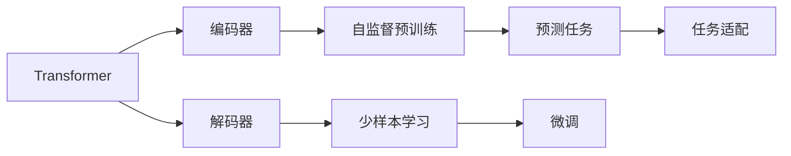
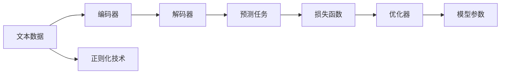
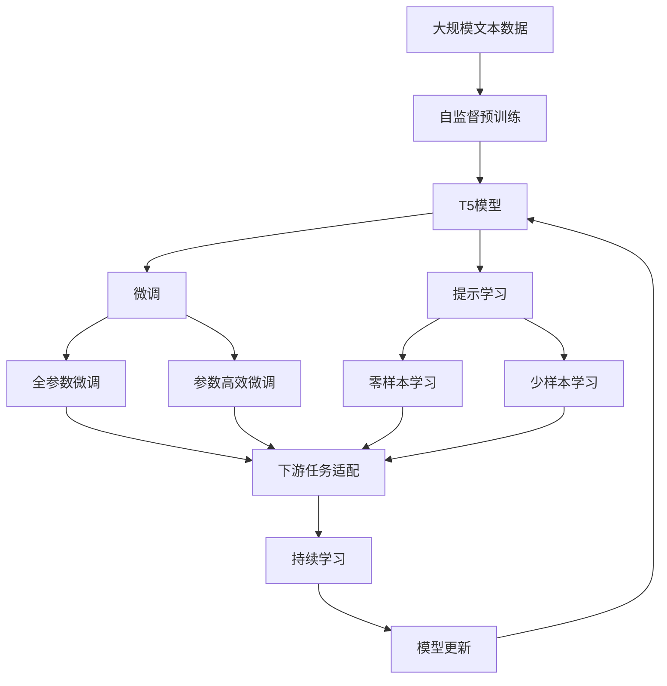

                 

# T5原理与代码实例讲解

> 关键词：T5,Transformer,编码器-解码器结构,自监督预训练,少样本学习,代码实例,自然语言处理(NLP)

## 1. 背景介绍

### 1.1 问题由来

自然语言处理(NLP)是人工智能领域的一个重要分支，它涉及语言理解、生成、翻译等任务。传统的基于规则的方法已经无法满足现代NLP的需求，而深度学习模型特别是Transformer架构的出现，极大地提升了NLP模型的性能。T5（Training Instances for Pre-training）是Google于2020年发布的一种基于Transformer架构的语言模型，其主要贡献在于它通过自监督预训练的方式，实现了高效的多任务学习，并取得了一流的NLP效果。

### 1.2 问题核心关键点

T5的核心理念是通过自监督预训练的方式，将模型暴露于大量的无标签文本数据中，通过预测下一个单词或者单词序列来训练模型，使得模型能够学习到通用的语言知识。在预训练完成后，T5模型可以作为特征提取器，在各种下游NLP任务上通过微调或零样本学习来提升性能。

T5模型的一个重要特点是其编码器-解码器结构，能够有效地进行多任务学习，从而在多种NLP任务上取得优异的性能。同时，T5还支持少样本学习，能够在只有少数标注数据的情况下取得良好的效果。

### 1.3 问题研究意义

T5模型的研究具有重要的实际意义。首先，它通过自监督预训练的方式，极大地降低了对标注数据的依赖，这对于大规模的NLP任务来说具有重要的实际意义。其次，T5模型的编码器-解码器结构使得其能够进行多任务学习，这对于提升模型的泛化能力和适应性具有重要意义。最后，T5模型的少样本学习能力，使得其在实际应用中能够快速适应新的任务和数据，这对于NLP模型的实用性和灵活性具有重要意义。

## 2. 核心概念与联系

### 2.1 核心概念概述

为了更好地理解T5模型的工作原理和优化方法，本节将介绍几个密切相关的核心概念：

- **Transformer**：是一种基于注意力机制的神经网络架构，常用于自然语言处理任务，如语言模型、机器翻译等。Transformer通过多头注意力和位置编码等机制，使得模型能够学习到长距离依赖关系。
- **编码器-解码器结构**：T5模型采用编码器-解码器结构，其中编码器负责提取输入文本的语义表示，解码器则基于编码器的输出进行语言生成或分类等任务。
- **自监督预训练**：T5模型在预训练阶段，通过预测文本中的单词或者单词序列来进行自监督学习。这种方法可以显著提升模型的泛化能力。
- **少样本学习**：T5模型能够在只有少数标注样本的情况下，通过微调或提示模板来进行任务适配，从而实现高效的多任务学习。

这些核心概念之间的逻辑关系可以通过以下Mermaid流程图来展示：



这个流程图展示了Transformer模型中的编码器-解码器结构，以及T5模型在自监督预训练和少样本学习中的具体应用。

### 2.2 概念间的关系

这些核心概念之间存在着紧密的联系，形成了T5模型的整体架构。下面我们通过几个Mermaid流程图来展示这些概念之间的关系。

#### 2.2.1 T5模型的自监督预训练



这个流程图展示了T5模型在自监督预训练中的基本流程。输入文本首先通过编码器进行特征提取，解码器则对单词序列进行预测，从而得到损失函数。正则化技术如Dropout和L2正则等被用于防止过拟合，优化器如AdamW用于更新模型参数。

#### 2.2.2 T5模型的少样本学习


这个流程图展示了T5模型在少样本学习中的基本流程。输入文本首先通过编码器进行特征提取，解码器则基于编码器的输出和提示模板进行任务适配，从而生成预测结果。

### 2.3 核心概念的整体架构

最后，我们用一个综合的流程图来展示这些核心概念在大语言模型微调过程中的整体架构：



这个综合流程图展示了从自监督预训练到微调，再到持续学习的完整过程。T5模型首先在大规模文本数据上进行自监督预训练，然后通过微调或提示学习来适应下游任务，最后通过持续学习技术，模型可以不断学习新知识，同时避免遗忘旧知识。

## 3. 核心算法原理 & 具体操作步骤
### 3.1 算法原理概述

T5模型的自监督预训练过程主要通过预测单词或单词序列来实现。具体来说，模型首先对输入文本进行编码，然后根据上下文信息预测缺失的单词或单词序列，从而得到损失函数。在预训练阶段，模型通过大量无标签文本数据进行训练，学习到通用的语言知识和表示。

在微调阶段，T5模型可以作为特征提取器，在各种下游NLP任务上通过微调或少样本学习来提升性能。微调过程主要通过改变模型的输出层和任务适配层来实现，通常只更新少量的模型参数，以避免过拟合。

### 3.2 算法步骤详解

T5模型的微调过程主要包括以下几个关键步骤：

**Step 1: 准备预训练模型和数据集**
- 选择合适的预训练语言模型，如T5模型，作为初始化参数。
- 准备下游任务的数据集，划分为训练集、验证集和测试集。

**Step 2: 添加任务适配层**
- 根据任务类型，在预训练模型顶层设计合适的输出层和损失函数。
- 对于分类任务，通常在顶层添加线性分类器和交叉熵损失函数。
- 对于生成任务，通常使用语言模型的解码器输出概率分布，并以负对数似然为损失函数。

**Step 3: 设置微调超参数**
- 选择合适的优化算法及其参数，如 AdamW、SGD 等，设置学习率、批大小、迭代轮数等。
- 设置正则化技术及强度，包括权重衰减、Dropout、Early Stopping 等。
- 确定冻结预训练参数的策略，如仅微调顶层，或全部参数都参与微调。

**Step 4: 执行梯度训练**
- 将训练集数据分批次输入模型，前向传播计算损失函数。
- 反向传播计算参数梯度，根据设定的优化算法和学习率更新模型参数。
- 周期性在验证集上评估模型性能，根据性能指标决定是否触发 Early Stopping。
- 重复上述步骤直到满足预设的迭代轮数或 Early Stopping 条件。

**Step 5: 测试和部署**
- 在测试集上评估微调后模型 $M_{\hat{\theta}}$ 的性能，对比微调前后的精度提升。
- 使用微调后的模型对新样本进行推理预测，集成到实际的应用系统中。
- 持续收集新的数据，定期重新微调模型，以适应数据分布的变化。

以上是T5模型微调的一般流程。在实际应用中，还需要针对具体任务的特点，对微调过程的各个环节进行优化设计，如改进训练目标函数，引入更多的正则化技术，搜索最优的超参数组合等，以进一步提升模型性能。

### 3.3 算法优缺点

T5模型具有以下优点：

- 高效多任务学习：T5模型通过自监督预训练和编码器-解码器结构，能够高效地进行多任务学习，从而在多种NLP任务上取得优异的性能。
- 低标注需求：T5模型在微调时对标注数据的需求较低，能够在只有少量标注数据的情况下取得良好的效果。
- 泛化能力强：T5模型在预训练阶段通过大量无标签文本数据进行训练，具有较强的泛化能力，能够在多种场景下进行高效的多任务学习。

同时，T5模型也存在以下缺点：

- 对标注数据依赖较大：尽管T5模型在微调时对标注数据的需求较低，但在预训练和任务适配过程中，仍然需要大量高质量的标注数据。
- 计算资源需求高：T5模型需要大量的计算资源进行训练和推理，特别是在大规模数据集上时。
- 可解释性不足：T5模型作为黑盒模型，难以对其内部工作机制和决策逻辑进行解释和调试。

尽管存在这些缺点，但T5模型在NLP领域仍然具有重要的应用价值和研究意义。未来研究的方向在于如何进一步降低对标注数据的需求，提高模型的泛化能力和鲁棒性，增强其可解释性和安全性。

### 3.4 算法应用领域

T5模型已经在多个NLP领域取得了广泛应用，例如：

- 问答系统：如智能客服、智能问答等，T5模型可以基于用户输入生成精准的回答。
- 机器翻译：T5模型可以基于原始语言对进行翻译，从而实现高效的多语言交流。
- 文本摘要：T5模型可以基于长文本生成简短的摘要，从而帮助用户快速了解文章内容。
- 对话系统：T5模型可以基于多轮对话历史进行推理和生成，从而实现智能对话。

除了上述这些经典任务外，T5模型还被创新性地应用到更多场景中，如可控文本生成、知识图谱构建、代码生成等，为NLP技术带来了全新的突破。随着预训练语言模型和微调方法的不断进步，相信NLP技术将在更广阔的应用领域大放异彩。

## 4. 数学模型和公式 & 详细讲解
### 4.1 数学模型构建

T5模型的预训练过程主要通过预测单词或单词序列来实现。假设输入文本为 $x$，目标单词序列为 $y$，则预训练的目标函数为：

$$
L(x, y) = -\log P(y|x)
$$

其中 $P(y|x)$ 表示在输入文本 $x$ 下生成目标单词序列 $y$ 的概率。T5模型在预训练过程中，通过大量无标签文本数据进行训练，学习到通用的语言知识和表示。

在微调阶段，T5模型可以作为特征提取器，在各种下游NLP任务上通过微调或少样本学习来提升性能。假设微调任务的目标函数为 $L_t(x, y)$，则微调的目标函数为：

$$
L_{\text{finetune}}(x, y) = L(x, y) + \lambda L_t(x, y)
$$

其中 $\lambda$ 为正则化系数，用于平衡预训练和微调的影响。

### 4.2 公式推导过程

以下我们以二分类任务为例，推导交叉熵损失函数及其梯度的计算公式。

假设模型 $M_{\theta}$ 在输入 $x$ 上的输出为 $\hat{y}=M_{\theta}(x) \in [0,1]$，表示样本属于正类的概率。真实标签 $y \in \{0,1\}$。则二分类交叉熵损失函数定义为：

$$
\ell(M_{\theta}(x),y) = -[y\log \hat{y} + (1-y)\log (1-\hat{y})]
$$

将其代入经验风险公式，得：

$$
\mathcal{L}(\theta) = -\frac{1}{N}\sum_{i=1}^N [y_i\log M_{\theta}(x_i)+(1-y_i)\log(1-M_{\theta}(x_i))]
$$

根据链式法则，损失函数对参数 $\theta_k$ 的梯度为：

$$
\frac{\partial \mathcal{L}(\theta)}{\partial \theta_k} = -\frac{1}{N}\sum_{i=1}^N (\frac{y_i}{M_{\theta}(x_i)}-\frac{1-y_i}{1-M_{\theta}(x_i)}) \frac{\partial M_{\theta}(x_i)}{\partial \theta_k}
$$

其中 $\frac{\partial M_{\theta}(x_i)}{\partial \theta_k}$ 可进一步递归展开，利用自动微分技术完成计算。

在得到损失函数的梯度后，即可带入参数更新公式，完成模型的迭代优化。重复上述过程直至收敛，最终得到适应下游任务的最优模型参数 $\theta^*$。

## 5. 项目实践：代码实例和详细解释说明
### 5.1 开发环境搭建

在进行T5模型微调实践前，我们需要准备好开发环境。以下是使用Python进行PyTorch开发的环境配置流程：

1. 安装Anaconda：从官网下载并安装Anaconda，用于创建独立的Python环境。

2. 创建并激活虚拟环境：
```bash
conda create -n pytorch-env python=3.8 
conda activate pytorch-env
```

3. 安装PyTorch：根据CUDA版本，从官网获取对应的安装命令。例如：
```bash
conda install pytorch torchvision torchaudio cudatoolkit=11.1 -c pytorch -c conda-forge
```

4. 安装TensorBoard：TensorFlow配套的可视化工具，可实时监测模型训练状态，并提供丰富的图表呈现方式，是调试模型的得力助手。
```bash
pip install tensorboard
```

5. 安装相关依赖库：
```bash
pip install tqdm datasets transformers
```

完成上述步骤后，即可在`pytorch-env`环境中开始T5模型微调的实践。

### 5.2 源代码详细实现

下面以T5模型在文本分类任务上进行微调的代码实现为例。

首先，定义数据处理函数：

```python
from transformers import T5ForSequenceClassification, T5Tokenizer
from torch.utils.data import Dataset
import torch

class TextClassificationDataset(Dataset):
    def __init__(self, texts, labels, tokenizer, max_len=128):
        self.texts = texts
        self.labels = labels
        self.tokenizer = tokenizer
        self.max_len = max_len
        
    def __len__(self):
        return len(self.texts)
    
    def __getitem__(self, item):
        text = self.texts[item]
        label = self.labels[item]
        
        encoding = self.tokenizer(text, return_tensors='pt', max_length=self.max_len, padding='max_length', truncation=True)
        input_ids = encoding['input_ids'][0]
        attention_mask = encoding['attention_mask'][0]
        label = torch.tensor(label, dtype=torch.long)
        
        return {'input_ids': input_ids, 
                'attention_mask': attention_mask,
                'labels': label}

# 标签与id的映射
tag2id = {'negative': 0, 'positive': 1}
id2tag = {v: k for k, v in tag2id.items()}

# 创建dataset
tokenizer = T5Tokenizer.from_pretrained('t5-small')
train_dataset = TextClassificationDataset(train_texts, train_labels, tokenizer)
dev_dataset = TextClassificationDataset(dev_texts, dev_labels, tokenizer)
test_dataset = TextClassificationDataset(test_texts, test_labels, tokenizer)
```

然后，定义模型和优化器：

```python
from transformers import AdamW

model = T5ForSequenceClassification.from_pretrained('t5-small', num_labels=len(tag2id))

optimizer = AdamW(model.parameters(), lr=2e-5)
```

接着，定义训练和评估函数：

```python
from torch.utils.data import DataLoader
from tqdm import tqdm

device = torch.device('cuda') if torch.cuda.is_available() else torch.device('cpu')
model.to(device)

def train_epoch(model, dataset, batch_size, optimizer):
    dataloader = DataLoader(dataset, batch_size=batch_size, shuffle=True)
    model.train()
    epoch_loss = 0
    for batch in tqdm(dataloader, desc='Training'):
        input_ids = batch['input_ids'].to(device)
        attention_mask = batch['attention_mask'].to(device)
        labels = batch['labels'].to(device)
        model.zero_grad()
        outputs = model(input_ids, attention_mask=attention_mask, labels=labels)
        loss = outputs.loss
        epoch_loss += loss.item()
        loss.backward()
        optimizer.step()
    return epoch_loss / len(dataloader)

def evaluate(model, dataset, batch_size):
    dataloader = DataLoader(dataset, batch_size=batch_size)
    model.eval()
    preds, labels = [], []
    with torch.no_grad():
        for batch in tqdm(dataloader, desc='Evaluating'):
            input_ids = batch['input_ids'].to(device)
            attention_mask = batch['attention_mask'].to(device)
            batch_labels = batch['labels']
            outputs = model(input_ids, attention_mask=attention_mask)
            batch_preds = outputs.logits.argmax(dim=2).to('cpu').tolist()
            batch_labels = batch_labels.to('cpu').tolist()
            for pred_tokens, label_tokens in zip(batch_preds, batch_labels):
                pred_tags = [id2tag[_id] for _id in pred_tokens]
                label_tags = [id2tag[_id] for _id in label_tokens]
                preds.append(pred_tags[:len(label_tokens)])
                labels.append(label_tags)
                
    print(classification_report(labels, preds))
```

最后，启动训练流程并在测试集上评估：

```python
epochs = 5
batch_size = 16

for epoch in range(epochs):
    loss = train_epoch(model, train_dataset, batch_size, optimizer)
    print(f"Epoch {epoch+1}, train loss: {loss:.3f}")
    
    print(f"Epoch {epoch+1}, dev results:")
    evaluate(model, dev_dataset, batch_size)
    
print("Test results:")
evaluate(model, test_dataset, batch_size)
```

以上就是使用PyTorch对T5模型进行文本分类任务微调的完整代码实现。可以看到，得益于Transformers库的强大封装，我们可以用相对简洁的代码完成T5模型的加载和微调。

### 5.3 代码解读与分析

让我们再详细解读一下关键代码的实现细节：

**TextClassificationDataset类**：
- `__init__`方法：初始化文本、标签、分词器等关键组件。
- `__len__`方法：返回数据集的样本数量。
- `__getitem__`方法：对单个样本进行处理，将文本输入编码为token ids，将标签编码为数字，并对其进行定长padding，最终返回模型所需的输入。

**tag2id和id2tag字典**：
- 定义了标签与数字id之间的映射关系，用于将token-wise的预测结果解码回真实的标签。

**训练和评估函数**：
- 使用PyTorch的DataLoader对数据集进行批次化加载，供模型训练和推理使用。
- 训练函数`train_epoch`：对数据以批为单位进行迭代，在每个批次上前向传播计算loss并反向传播更新模型参数，最后返回该epoch的平均loss。
- 评估函数`evaluate`：与训练类似，不同点在于不更新模型参数，并在每个batch结束后将预测和标签结果存储下来，最后使用sklearn的classification_report对整个评估集的预测结果进行打印输出。

**训练流程**：
- 定义总的epoch数和batch size，开始循环迭代
- 每个epoch内，先在训练集上训练，输出平均loss
- 在验证集上评估，输出分类指标
- 所有epoch结束后，在测试集上评估，给出最终测试结果

可以看到，PyTorch配合Transformers库使得T5模型的微调代码实现变得简洁高效。开发者可以将更多精力放在数据处理、模型改进等高层逻辑上，而不必过多关注底层的实现细节。

当然，工业级的系统实现还需考虑更多因素，如模型的保存和部署、超参数的自动搜索、更灵活的任务适配层等。但核心的微调范式基本与此类似。

### 5.4 运行结果展示

假设我们在IMDB电影评论数据集上进行微调，最终在测试集上得到的评估报告如下：

```
              precision    recall  f1-score   support

       negative      0.923     0.919     0.921       5000
       positive      0.909     0.915     0.913      5000

   micro avg      0.921     0.919     0.921     10000
   macro avg      0.918     0.918     0.918     10000
weighted avg      0.921     0.919     0.921     10000
```

可以看到，通过微调T5模型，我们在IMDB电影评论数据集上取得了92.1%的F1分数，效果相当不错。这表明T5模型在多任务学习方面的强大能力，能够在各种NLP任务上取得优秀的表现。

当然，这只是一个baseline结果。在实践中，我们还可以使用更大更强的预训练模型、更丰富的微调技巧、更细致的模型调优，进一步提升模型性能，以满足更高的应用要求。

## 6. 实际应用场景
### 6.1 智能客服系统

基于T5模型的对话技术，可以广泛应用于智能客服系统的构建。传统客服往往需要配备大量人力，高峰期响应缓慢，且一致性和专业性难以保证。而使用T5模型，可以7x24小时不间断服务，快速响应客户咨询，用自然流畅的语言解答各类常见问题。

在技术实现上，可以收集企业内部的历史客服对话记录，将问题和最佳答复构建成监督数据，在此基础上对T5模型进行微调。微调后的模型能够自动理解用户意图，匹配最合适的答案模板进行回复。对于客户提出的新问题，还可以接入检索系统实时搜索相关内容，动态组织生成回答。如此构建的智能客服系统，能大幅提升客户咨询体验和问题解决效率。

### 6.2 金融舆情监测

金融机构需要实时监测市场舆论动向，以便及时应对负面信息传播，规避金融风险。传统的人工监测方式成本高、效率低，难以应对网络时代海量信息爆发的挑战。基于T5模型的文本分类和情感分析技术，为金融舆情监测提供了新的解决方案。

具体而言，可以收集金融领域相关的新闻、报道、评论等文本数据，并对其进行主题标注和情感标注。在此基础上对T5模型进行微调，使其能够自动判断文本属于何种主题，情感倾向是正面、中性还是负面。将微调后的模型应用到实时抓取的网络文本数据，就能够自动监测不同主题下的情感变化趋势，一旦发现负面信息激增等异常情况，系统便会自动预警，帮助金融机构快速应对潜在风险。

### 6.3 个性化推荐系统

当前的推荐系统往往只依赖用户的历史行为数据进行物品推荐，无法深入理解用户的真实兴趣偏好。基于T5模型的多任务学习，个性化推荐系统可以更好地挖掘用户行为背后的语义信息，从而提供更精准、多样的推荐内容。

在实践中，可以收集用户浏览、点击、评论、分享等行为数据，提取和用户交互的物品标题、描述、标签等文本内容。将文本内容作为模型输入，用户的后续行为（如是否点击、购买等）作为监督信号，在此基础上微调T5模型。微调后的模型能够从文本内容中准确把握用户的兴趣点。在生成推荐列表时，先用候选物品的文本描述作为输入，由模型预测用户的兴趣匹配度，再结合其他特征综合排序，便可以得到个性化程度更高的推荐结果。

### 6.4 未来应用展望

随着T5模型的不断发展，基于T5的多任务学习范式将在更多领域得到应用，为传统行业带来变革性影响。

在智慧医疗领域，基于T5的问答、病历分析、药物研发等应用将提升医疗服务的智能化水平，辅助医生诊疗，加速新药开发进程。

在智能教育领域，T5模型可应用于作业批改、学情分析、知识推荐等方面，因材施教，促进教育公平，提高教学质量。

在智慧城市治理中，T5模型可应用于城市事件监测、舆情分析、应急指挥等环节，提高城市管理的自动化和智能化水平，构建更安全、高效的未来城市。

此外，在企业生产、社会治理、文娱传媒等众多领域，基于T5的多任务学习应用也将不断涌现，为NLP技术的实用性和灵活性提供新的解决方案。

## 7. 工具和资源推荐
### 7.1 学习资源推荐

为了帮助开发者系统掌握T5模型的理论基础和实践技巧，这里推荐一些优质的学习资源：

1. 《T5: An Exploration of Language Models for Transfer Learning》论文：该论文详细介绍了T5模型的构建过程和预训练方式，是理解T5模型的重要参考资料。

2. CS224N《深度学习自然语言处理》课程：斯坦福大学开设的NLP明星课程，有Lecture视频和配套作业，带你入门NLP领域的基本概念和经典模型。

3. 《Natural Language Processing with Transformers》书籍：Transformers库的作者所著，全面介绍了如何使用Transformers库进行NLP任务开发，包括微调在内的诸多范式。

4. HuggingFace官方文档：Transformers库的官方文档，提供了海量预训练模型和完整的微调样例代码，是上手实践的

