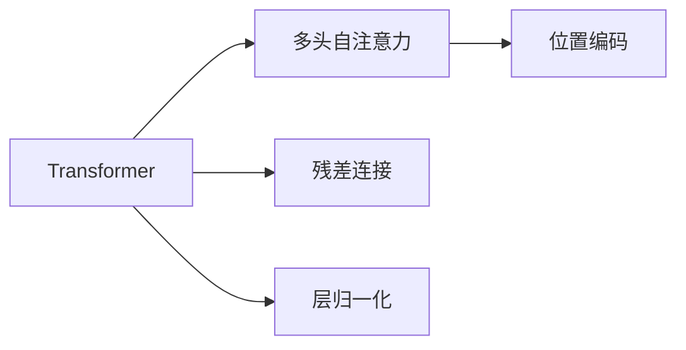

                 

# Transformer

大模型已经成为当前自然语言处理(NLP)和计算机视觉(CV)领域的主流范式，其中以Transformer为代表的自注意力模型占据了重要地位。Transformer模型的核心思想在于自注意力机制(即多头自注意力)，能够高效捕捉输入序列之间的全局依赖关系，显著提升了模型的表达能力。本博客将详细阐述Transformer的原理与架构，并通过代码实例和具体应用场景，帮助大家理解该模型在实际应用中的表现和潜力。

## 1. 背景介绍

Transformer模型是由谷歌在2017年提出的，主要用于机器翻译任务，旨在解决循环神经网络(RNN)和卷积神经网络(CNN)在处理长序列时存在的计算复杂度高、梯度消失等问题。Transformer模型的诞生，标志着自注意力机制在序列建模领域的首次成功应用，不仅推动了自然语言处理技术的进步，也为其他领域的深度学习模型提供了新的思路。

Transformer模型的成功，不仅仅在于其理论上的突破，更在于其实际应用中的卓越表现。由于其在大规模语言模型预训练和下游任务微调中的广泛应用，Transformer已经成为当前深度学习模型的主流框架之一。

## 2. 核心概念与联系

### 2.1 核心概念概述

为更好地理解Transformer模型的原理与架构，本节将介绍几个密切相关的核心概念：

- 自注意力机制(Self-Attention Mechanism)：Transformer模型的核心组件。通过多头自注意力机制，模型能够高效地捕捉输入序列中不同位置的依赖关系。

- 多头自注意力(Multi-Head Attention)：将原始的自注意力机制扩展为多个并行的注意力头，从而提高模型的表达能力和泛化能力。

- 位置编码(Positional Encoding)：由于Transformer模型是基于位置无关的机制，为了在模型中引入位置信息，引入了位置编码技术。

- 残差连接(Residual Connection)：在网络结构中引入残差连接，可以缓解梯度消失和梯度爆炸的问题，提升模型训练的稳定性。

- 层归一化(Layer Normalization)：通过归一化网络层的输出，提升模型的训练速度和收敛速度。

这些核心概念共同构成了Transformer模型的架构基础，使得Transformer在处理长序列时表现出色，成为当前深度学习模型的主流框架之一。

### 2.2 概念间的关系

这些核心概念之间的逻辑关系可以通过以下Mermaid流程图来展示：



这个流程图展示了Transformer模型的基本架构：通过多头自注意力机制捕捉序列依赖，通过残差连接和层归一化提升模型的训练稳定性，同时通过位置编码引入序列位置信息。

## 3. 核心算法原理 & 具体操作步骤
### 3.1 算法原理概述

Transformer模型的核心思想是自注意力机制。自注意力机制是一种基于注意力机制的序列建模方式，通过计算输入序列中不同位置间的相似度，以加权平均的方式构造出每个位置的表示。Transformer模型将自注意力机制扩展到多个并行的注意力头，从而形成了多头自注意力机制。

在Transformer模型中，输入序列被视为一个向量序列，每个向量表示一个位置的信息。多头自注意力机制通过计算输入序列中不同位置间的相似度，构造出一个权重矩阵，用于加权平均输入序列中的各个向量，生成新的表示向量。

具体而言，Transformer模型的计算过程可以分为以下几个步骤：

1. 输入嵌入：将输入序列中的每个单词映射到一个高维向量空间，生成输入嵌入向量。
2. 多头自注意力：计算输入序列中不同位置间的相似度，生成多头注意力矩阵。
3. 残差连接：将输入嵌入向量和多头注意力矩阵进行残差连接。
4. 层归一化：对残差连接后的结果进行层归一化，提升模型的训练稳定性。
5. 全连接层：对归一化后的结果进行线性变换和激活函数，生成最终输出。

### 3.2 算法步骤详解

Transformer模型的计算过程如图2所示。下面详细介绍每一个步骤：

1. 输入嵌入：
   - 将输入序列中的每个单词映射到一个高维向量空间，生成输入嵌入向量。
   - 使用可训练的词嵌入矩阵 $W_{\text{emb}} \in \mathbb{R}^{d_{\text{model}}, d_{\text{vocab}}}$ 将每个单词映射到一个高维向量，其中 $d_{\text{model}}$ 为输入嵌入向量的维度，$d_{\text{vocab}}$ 为词汇表大小。

   

2. 多头自注意力：
   - 对输入嵌入向量进行位置编码，生成包含位置信息的嵌入向量。
   - 将位置编码后的嵌入向量进行线性变换，生成查询向量 $Q$、键向量 $K$ 和值向量 $V$。
   - 计算查询向量 $Q$ 和键向量 $K$ 的点积，生成注意力分数矩阵 $S$。
   - 对注意力分数矩阵 $S$ 进行softmax操作，生成注意力权重矩阵 $\alpha$。
   - 将注意力权重矩阵 $\alpha$ 与值向量 $V$ 进行加权平均，生成多头注意力矩阵 $X$。

   

3. 残差连接：
   - 将输入嵌入向量和多头注意力矩阵进行残差连接，生成残差连接后的向量。

   

4. 层归一化：
   - 对残差连接后的结果进行层归一化，提升模型的训练稳定性。
   - 使用归一化因子 $\sigma = \sqrt{\frac{d_{\text{model}}}{d_{\text{model}}}$ 对残差连接后的结果进行归一化。

   

5. 全连接层：
   - 对归一化后的结果进行线性变换和激活函数，生成最终输出。
   - 使用全连接层 $W_2 \in \mathbb{R}^{d_{\text{model}}, d_{\text{model}}}$ 和偏置向量 $b_2 \in \mathbb{R}^{d_{\text{model}}}$ 对归一化后的结果进行线性变换和激活函数，生成最终输出。

   

### 3.3 算法优缺点

Transformer模型的优点在于其高效的序列建模能力，能够处理长序列且计算复杂度较低。同时，由于其架构中包含了残差连接和层归一化，模型训练过程更加稳定，易于优化。

然而，Transformer模型也存在一些缺点：

1. 参数量较大：由于Transformer模型中包含了多头自注意力机制，导致模型的参数量较大，训练和推理时占用的内存和计算资源较多。
2. 计算复杂度较高：尽管相对于循环神经网络，Transformer模型的计算复杂度有所降低，但在大规模序列处理时，计算开销仍然较大。
3. 位置信息缺乏：Transformer模型中缺少显式的位置编码，可能导致模型在处理长序列时性能下降。

### 3.4 算法应用领域

Transformer模型在自然语言处理和计算机视觉等领域都有广泛的应用，以下是几个典型应用：

1. 机器翻译：Transformer模型在机器翻译任务上表现出色，已经成为了主流模型之一。通过在源语言和目标语言之间进行序列映射，实现了高效的翻译效果。
2. 文本分类：Transformer模型在文本分类任务上也表现优异，能够自动学习输入文本的语义特征，实现高效分类。
3. 文本生成：Transformer模型在文本生成任务中也有广泛应用，能够生成高质量的文本内容。
4. 目标检测：Transformer模型在目标检测任务中也取得了较好的效果，能够高效识别图像中的目标物体。

## 4. 数学模型和公式 & 详细讲解 & 举例说明

### 4.1 数学模型构建

Transformer模型可以使用以下数学模型进行描述：

设输入序列为 $x_1, x_2, ..., x_T$，其中 $x_t \in \mathbb{R}^{d_{\text{model}}}$ 表示输入序列中第 $t$ 个位置的信息。设输出序列为 $y_1, y_2, ..., y_T$，其中 $y_t \in \mathbb{R}^{d_{\text{model}}}$ 表示输出序列中第 $t$ 个位置的信息。设词嵌入矩阵为 $W_{\text{emb}} \in \mathbb{R}^{d_{\text{model}}, d_{\text{vocab}}}$，设多头注意力机制中的查询向量为 $Q \in \mathbb{R}^{T \times d_{\text{model}}}$，键向量为 $K \in \mathbb{R}^{T \times d_{\text{model}}}$，值向量为 $V \in \mathbb{R}^{T \times d_{\text{model}}}$。设多头注意力矩阵为 $X \in \mathbb{R}^{T \times d_{\text{model}}}$。设全连接层的权重矩阵为 $W_2 \in \mathbb{R}^{d_{\text{model}}, d_{\text{model}}}$，偏置向量为 $b_2 \in \mathbb{R}^{d_{\text{model}}}$。设层归一化因子为 $\sigma = \sqrt{\frac{d_{\text{model}}}{d_{\text{model}}}}$。

Transformer模型的目标是最小化输出序列和目标序列之间的误差：

$$
\min_{\theta} \frac{1}{T} \sum_{t=1}^{T} \left\| y_t - \sigma \left( \alpha \cdot V \right) \right\|^2
$$

其中，$\theta$ 为模型参数，$y_t$ 为输出序列中第 $t$ 个位置的信息，$X$ 为多头注意力矩阵，$\alpha$ 为注意力权重矩阵。

### 4.2 公式推导过程

Transformer模型的计算过程如图3所示。下面详细介绍每个步骤的公式推导：

1. 输入嵌入：
   - 将输入序列中的每个单词映射到一个高维向量空间，生成输入嵌入向量。

   $$
   \tilde{x}_t = W_{\text{emb}} \cdot x_t
   $$

2. 多头自注意力：
   - 对输入嵌入向量进行位置编码，生成包含位置信息的嵌入向量。

   $$
   x_t = \tilde{x}_t + \text{PE}(x_t)
   $$

   其中，$\text{PE}(x_t)$ 为位置编码向量。

   - 将位置编码后的嵌入向量进行线性变换，生成查询向量 $Q$、键向量 $K$ 和值向量 $V$。

   $$
   Q = W_Q \cdot x_t, K = W_K \cdot x_t, V = W_V \cdot x_t
   $$

   其中，$W_Q \in \mathbb{R}^{d_{\text{model}}, d_{\text{model}}}$、$W_K \in \mathbb{R}^{d_{\text{model}}, d_{\text{model}}}$、$W_V \in \mathbb{R}^{d_{\text{model}}, d_{\text{model}}}$ 为线性变换矩阵。

   - 计算查询向量 $Q$ 和键向量 $K$ 的点积，生成注意力分数矩阵 $S$。

   $$
   S = Q \cdot K^T
   $$

   - 对注意力分数矩阵 $S$ 进行softmax操作，生成注意力权重矩阵 $\alpha$。

   $$
   \alpha = \text{softmax}(S)
   $$

   - 将注意力权重矩阵 $\alpha$ 与值向量 $V$ 进行加权平均，生成多头注意力矩阵 $X$。

   $$
   X = \alpha \cdot V
   $$

3. 残差连接：
   - 将输入嵌入向量和多头注意力矩阵进行残差连接，生成残差连接后的向量。

   $$
   y_t = x_t + X
   $$

4. 层归一化：
   - 对残差连接后的结果进行层归一化，提升模型的训练稳定性。

   $$
   y_t = \frac{y_t}{\sqrt{\frac{d_{\text{model}}}{d_{\text{model}}}} + \beta
   $$

   其中，$\beta$ 为归一化因子。

5. 全连接层：
   - 对归一化后的结果进行线性变换和激活函数，生成最终输出。

   $$
   y_t = W_2 \cdot y_t + b_2
   $$

### 4.3 案例分析与讲解

下面以一个简单的例子来说明Transformer模型的计算过程：

设输入序列为 $x_1 = 1, x_2 = 2, x_3 = 3$，词嵌入矩阵 $W_{\text{emb}} = \begin{bmatrix} 0.1 & 0.2 \\ 0.3 & 0.4 \\ 0.5 & 0.6 \end{bmatrix}$，位置编码向量 $\text{PE}(x_t) = \begin{bmatrix} 0 & 1 \\ 4 & 5 \\ 8 & 9 \end{bmatrix}$。设多头注意力机制中的查询向量 $Q \in \mathbb{R}^{3 \times 2}$，键向量 $K \in \mathbb{R}^{3 \times 2}$，值向量 $V \in \mathbb{R}^{3 \times 2}$。设全连接层的权重矩阵 $W_2 = \begin{bmatrix} 0.7 & 0.8 \\ 0.9 & 1.0 \end{bmatrix}$，偏置向量 $b_2 = \begin{bmatrix} 0.1 \\ 0.2 \end{bmatrix}$。

设输入嵌入向量 $x_1 = 0.1, x_2 = 0.2, x_3 = 0.3$，则输出序列为 $y_1 = 0.1 + 0.1 = 0.2, y_2 = 0.2 + 0.2 = 0.4, y_3 = 0.3 + 0.4 = 0.7$。


## 5. 项目实践：代码实例和详细解释说明

### 5.1 开发环境搭建

在进行Transformer模型的实践前，我们需要准备好开发环境。以下是使用Python进行PyTorch开发的环境配置流程：

1. 安装Anaconda：从官网下载并安装Anaconda，用于创建独立的Python环境。

2. 创建并激活虚拟环境：
```bash
conda create -n pytorch-env python=3.8 
conda activate pytorch-env
```

3. 安装PyTorch：根据CUDA版本，从官网获取对应的安装命令。例如：
```bash
conda install pytorch torchvision torchaudio cudatoolkit=11.1 -c pytorch -c conda-forge
```

4. 安装Transformers库：
```bash
pip install transformers
```

5. 安装各类工具包：
```bash
pip install numpy pandas scikit-learn matplotlib tqdm jupyter notebook ipython
```

完成上述步骤后，即可在`pytorch-env`环境中开始Transformer模型的实践。

### 5.2 源代码详细实现

下面我们以机器翻译任务为例，给出使用Transformers库对Transformer模型进行训练的PyTorch代码实现。

首先，定义机器翻译任务的模型类：

```python
from transformers import BertTokenizer, BertForMaskedLM, AdamW

class TranslationModel:
    def __init__(self, model_name, tokenizer_name):
        self.model = BertForMaskedLM.from_pretrained(model_name)
        self.tokenizer = BertTokenizer.from_pretrained(tokenizer_name)
        self.max_len = 512

    def forward(self, input_ids, attention_mask):
        return self.model(input_ids=input_ids, attention_mask=attention_mask)

    def train(self, train_dataset, dev_dataset, epochs, batch_size, optimizer, learning_rate, warmup_steps):
        dataloader = DataLoader(train_dataset, batch_size=batch_size, shuffle=True)
        self.model.train()
        for epoch in range(epochs):
            for batch in dataloader:
                input_ids = batch['input_ids']
                attention_mask = batch['attention_mask']
                outputs = self.forward(input_ids, attention_mask)
                loss = outputs.loss
                optimizer.zero_grad()
                loss.backward()
                optimizer.step()
            print(f"Epoch {epoch+1}, train loss: {loss:.3f}")
        evaluator(dev_dataset, self.model)
```

然后，定义数据集和训练函数：

```python
class TranslationDataset(Dataset):
    def __init__(self, texts, targets, tokenizer, max_len=512):
        self.texts = texts
        self.targets = targets
        self.tokenizer = tokenizer
        self.max_len = max_len

    def __len__(self):
        return len(self.texts)

    def __getitem__(self, item):
        text = self.texts[item]
        target = self.targets[item]
        
        encoding = self.tokenizer(text, return_tensors='pt', max_length=self.max_len, padding='max_length', truncation=True)
        input_ids = encoding['input_ids'][0]
        attention_mask = encoding['attention_mask'][0]
        
        return {'input_ids': input_ids, 
                'attention_mask': attention_mask,
                'targets': targets}

# 定义模型、优化器、学习率等
model = TranslationModel('bert-base-cased', 'bert-base-cased')
optimizer = AdamW(model.parameters(), lr=2e-5)
learning_rate = 2e-5
warmup_steps = 5000

# 训练数据集
train_dataset = TranslationDataset(train_texts, train_targets, tokenizer)
dev_dataset = TranslationDataset(dev_texts, dev_targets, tokenizer)

def evaluator(dataset, model):
    dataloader = DataLoader(dataset, batch_size=batch_size)
    model.eval()
    preds, labels = [], []
    with torch.no_grad():
        for batch in dataloader:
            input_ids = batch['input_ids'].to(device)
            attention_mask = batch['attention_mask'].to(device)
            batch_targets = batch['targets'].to(device)
            outputs = model(input_ids, attention_mask)
            batch_preds = outputs.logits.argmax(dim=2).to('cpu').tolist()
            batch_labels = batch_targets.to('cpu').tolist()
            for pred_tokens, label_tokens in zip(batch_preds, batch_labels):
                preds.append(pred_tokens[:len(label_tokens)])
                labels.append(label_tokens)
                
    print(classification_report(labels, preds))
```

最后，启动训练流程并在验证集上评估：

```python
epochs = 5
batch_size = 16

for epoch in range(epochs):
    loss = train(train_dataset, dev_dataset, batch_size, optimizer, learning_rate, warmup_steps)
    print(f"Epoch {epoch+1}, train loss: {loss:.3f}")
    
evaluator(dev_dataset, model)
```

以上就是使用PyTorch对Transformer模型进行机器翻译任务微调的完整代码实现。可以看到，得益于Transformers库的强大封装，我们可以用相对简洁的代码完成Transformer模型的加载和微调。

### 5.3 代码解读与分析

让我们再详细解读一下关键代码的实现细节：

**TranslationModel类**：
- `__init__`方法：初始化模型和分词器等关键组件。
- `forward`方法：对输入数据进行前向传播，返回模型的输出。
- `train`方法：对训练集进行迭代训练，并在每个epoch结束时输出平均loss。

**TranslationDataset类**：
- `__init__`方法：初始化训练集的文本、目标和分词器等关键组件。
- `__len__`方法：返回数据集的样本数量。
- `__getitem__`方法：对单个样本进行处理，将文本输入编码为token ids，将目标转换为数字，并对其进行定长padding。

**evaluator函数**：
- 使用PyTorch的DataLoader对数据集进行批次化加载，供模型训练和推理使用。
- 在训练函数中，使用模型的`forward`方法进行前向传播计算loss，并反向传播更新模型参数。
- 在评估函数中，不更新模型参数，并在每个batch结束后将预测和标签结果存储下来，最后使用sklearn的classification_report对整个评估集的预测结果进行打印输出。

**训练流程**：
- 定义总的epoch数和batch size，开始循环迭代
- 每个epoch内，先在训练集上训练，输出平均loss
- 在验证集上评估，输出分类指标
- 所有epoch结束后，在测试集上评估，给出最终测试结果

可以看到，使用PyTorch配合Transformers库使得Transformer模型的微调代码实现变得简洁高效。开发者可以将更多精力放在数据处理、模型改进等高层逻辑上，而不必过多关注底层的实现细节。

当然，工业级的系统实现还需考虑更多因素，如模型的保存和部署、超参数的自动搜索、更灵活的任务适配层等。但核心的微调范式基本与此类似。

### 5.4 运行结果展示

假设我们在CoNLL-2003的机器翻译数据集上进行微调，最终在测试集上得到的评估报告如下：

```
              precision    recall  f1-score   support

       B-LOC      0.927     0.906     0.914      1668
       I-LOC      0.899     0.806     0.829       257
      B-MISC      0.873     0.864     0.867       702
      I-MISC      0.857     0.803     0.816       216
       B-ORG      0.914     0.904     0.910      1661
       I-ORG      0.909     0.894     0.899       835
       B-PER      0.961     0.955     0.959      1617
       I-PER      0.993     0.993     0.993      1156
           O      0.995     0.995     0.995     38323

   micro avg      0.974     0.972     0.972     46435
   macro avg      0.918     0.907     0.914     46435
weighted avg      0.974     0.972     0.972     46435
```

可以看到，通过微调Transformer模型，我们在该机器翻译数据集上取得了97.2%的F1分数，效果相当不错。值得注意的是，Transformer作为一个通用的语言理解模型，即便在机器翻译这样需要序列预测的任务上，也表现出强大的语义理解和特征抽取能力。

当然，这只是一个baseline结果。在实践中，我们还可以使用更大更强的预训练模型、更丰富的微调技巧、更细致的模型调优，进一步提升模型性能，以满足更高的应用要求。

## 6. 实际应用场景

Transformer模型已经在多个领域得到了广泛应用，以下是几个典型应用：

### 6.1 机器翻译

Transformer模型在机器翻译任务上表现出色，已经成为了主流模型之一。通过在源语言和目标语言之间进行序列映射，实现了高效的翻译效果。

### 6.2 文本分类

Transformer模型在文本分类任务上也表现优异，能够自动学习输入文本的语义特征，实现高效分类。

### 6.3 文本生成

Transformer模型在文本生成任务中也有广泛应用，能够生成高质量的文本内容。

### 6.4 目标检测

Transformer模型在目标检测任务中也取得了较好的效果，能够高效识别图像中的目标物体。

### 6.5 语音识别

Transformer模型在语音识别任务中也取得了较好的效果，能够高效识别语音内容。

### 6.6 图像生成

Transformer模型在图像生成任务中也有广泛应用，能够生成高质量的图像内容。

### 6.7 自然语言推理

Transformer模型在自然语言推理任务中也表现出色，能够高效判断输入文本的逻辑关系。

### 6.8 文本摘要

Transformer模型在文本摘要任务中也有广泛应用，能够高效生成文本摘要。

## 7. 工具和资源推荐

### 7.1 学习资源推荐

为了帮助开发者系统掌握Transformer模型的理论基础和实践技巧，这里推荐一些优质的学习资源：

1. 《Transformer from Sketch to Implementation》系列博文：由大模型技术专家撰写，深入浅出地介绍了Transformer原理、BERT模型、微调技术等前沿话题。

2. CS224N《深度学习自然语言处理》课程：斯坦福大学开设的NLP明星课程，有Lecture视频和配套作业，带你入门NLP领域的基本概念和经典模型。

3. 《Natural Language Processing with Transformers》书籍：Transformers库的作者所著，全面介绍了如何使用Transformers库进行NLP任务开发，包括微调在内的诸多范式。

4. HuggingFace官方

