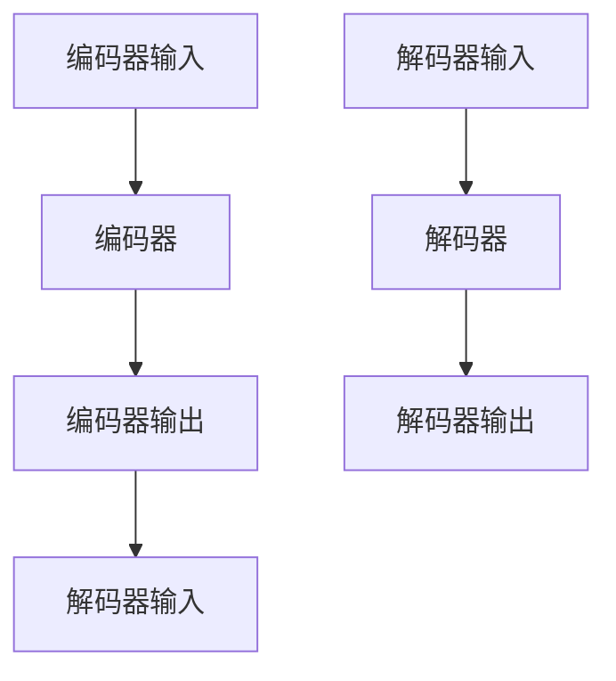

                 

# Transformer原理与代码实例讲解

> 关键词：Transformer, 自注意力, 解码器, 编码器, 代码实现, 图像处理, 自然语言处理

## 1. 背景介绍

Transformer是一种基于自注意力机制的神经网络结构，广泛应用于自然语言处理、图像处理、语音识别等领域的深度学习模型中。自注意力机制允许Transformer模型在处理序列数据时，能够自动学习并关注输入序列中的重要部分，而无需依赖显式的卷积或循环结构。

Transformer最初由Google提出，主要用于机器翻译任务。Transformer模型的提出标志着深度学习模型从基于循环神经网络(RNN)向基于注意力机制的转变，极大地提升了模型训练效率和性能表现。随着Transformer的不断优化，如今已经成为了各种序列数据的通用建模方式。

## 2. 核心概念与联系

### 2.1 核心概念概述

Transformer的核心思想是通过自注意力机制来学习输入序列中不同部分之间的关系，从而实现序列的建模。其核心组成部分包括编码器(Encoder)和解码器(Decoder)。

- **编码器**：将输入序列转换成高维向量表示。每个输入序列被分解成若干个向量，通过多层编码器进行自注意力计算。
- **解码器**：接收编码器的输出，并利用自注意力机制对输入序列进行预测。解码器同样包含多层结构，能够对输入序列进行逐个元素的预测。

Transformer模型的架构如图1所示：



图1：Transformer架构图

Transformer模型采用多头注意力机制，将输入序列转换成多个向量表示，每个向量在预测时都考虑了输入序列中的不同部分。这种机制使得Transformer模型能够同时处理多个输入序列，并且每个输入序列可以自适应地选择关注的序列部分。

### 2.2 概念间的关系

Transformer的核心组件编码器和解码器通过多层结构相互连接，形成完整的Transformer模型。编码器将输入序列转换成向量表示，解码器则利用这些向量对输出序列进行预测。编码器和解码器的输入和输出通过多层自注意力和前馈神经网络进行处理，最终得到完整的Transformer模型输出。

Transformer的核心概念还包括多头注意力机制、位置编码、残差连接等，这些机制共同构成了Transformer模型的特点，使其在处理序列数据时具有出色的性能表现。

## 3. 核心算法原理 & 具体操作步骤

### 3.1 算法原理概述

Transformer模型的核心算法原理是自注意力机制。自注意力机制允许模型在处理序列数据时，能够自动学习并关注输入序列中的重要部分，而无需依赖显式的卷积或循环结构。Transformer模型的自注意力机制主要通过多头注意力实现。

Transformer模型的输入序列被分解成多个向量，每个向量通过多头注意力计算得到多个关注向量，每个关注向量分别关注输入序列的不同部分。多头注意力机制通过矩阵变换和加权求和的方式，将每个关注向量的权重与输入序列的向量进行线性变换，最终得到每个位置对其他位置的注意力权重。

Transformer模型的输出向量通过多头注意力和前馈神经网络进行计算，得到最终的多层编码器输出。解码器接收编码器的输出，并利用自注意力机制对输入序列进行预测。解码器的输出向量同样通过多头注意力和前馈神经网络进行计算，最终得到完整的Transformer模型输出。

### 3.2 算法步骤详解

Transformer模型的训练过程包括编码器和解码器的训练。具体步骤如下：

**Step 1: 准备数据集**

- 准备输入序列和输出序列的数据集。对于机器翻译任务，输入序列为源语言文本，输出序列为目标语言文本。

**Step 2: 定义模型结构**

- 定义编码器和解码器结构，包括多头注意力层、前馈神经网络层、位置编码等。

**Step 3: 设置模型参数**

- 设置模型的超参数，如层数、多头注意力数量、学习率等。

**Step 4: 初始化模型参数**

- 初始化模型参数，如权重矩阵、位置编码等。

**Step 5: 训练模型**

- 对模型进行前向传播和反向传播，计算损失函数，更新模型参数。

**Step 6: 测试模型**

- 在测试集上评估模型的性能，如BLEU分数、ROUGE分数等。

### 3.3 算法优缺点

Transformer模型具有以下优点：

1. 高效性：Transformer模型通过并行计算方式，能够在处理长序列时比RNN模型更快。
2. 可解释性：Transformer模型通过多头注意力机制，能够自适应地关注输入序列中的不同部分，具有更好的可解释性。
3. 泛化能力强：Transformer模型能够在不同的语言对之间进行有效迁移，适应性更强。

同时，Transformer模型也存在一些缺点：

1. 计算复杂度高：Transformer模型需要计算自注意力矩阵，计算复杂度较高。
2. 内存占用大：Transformer模型在处理长序列时，需要占用大量内存。
3. 模型参数量大：Transformer模型通常需要大量的模型参数。

### 3.4 算法应用领域

Transformer模型已经在自然语言处理、图像处理、语音识别等领域得到了广泛应用。以下是一些常见的应用场景：

- **自然语言处理**：如机器翻译、文本生成、文本分类等。Transformer模型通过编码器和解码器的结构，能够对自然语言序列进行建模和生成。
- **图像处理**：如图像分类、目标检测、图像生成等。Transformer模型通过多头注意力机制，能够对图像中的不同区域进行关注。
- **语音识别**：如自动语音识别、语音合成等。Transformer模型能够对语音序列进行建模和生成，提升语音识别的准确性。

## 4. 数学模型和公式 & 详细讲解 & 举例说明

### 4.1 数学模型构建

Transformer模型主要包括编码器和解码器两部分。假设输入序列的长度为 $T$，输出序列的长度为 $S$。编码器的输入为 $X$，解码器的输入为 $Y$，编码器的输出为 $Z$，解码器的输出为 $\hat{Y}$。

**多头注意力机制**：

Transformer模型中的多头注意力机制通过计算输入序列中不同部分之间的注意力权重，实现序列的建模。设多头注意力数为 $H$，则多头注意力层由 $H$ 个独立的多头注意力子层构成。每个子层由三个线性变换和残差连接组成：

$$
\text{Multi-Head Attention}(Q, K, V) = \text{Concat}( \text{Attention}(QW_Q^H, KW_K^H, VW_V^H, S, ATTN ) ) W_O^H
$$

其中 $W_Q^H$, $W_K^H$, $W_V^H$, $W_O^H$ 为线性变换权重矩阵，$H$ 为注意力头数，$S$ 为输入序列长度，$ATTN$ 为注意力权重矩阵。

**前馈神经网络**：

Transformer模型中的前馈神经网络层通过两个线性变换和残差连接组成，用于增强模型的表达能力：

$$
\text{FFN}(x) = \text{GELU}( W_1^F x + b_1^F ) + x
$$

其中 $W_1^F$, $b_1^F$ 为线性变换权重矩阵和偏置向量。

### 4.2 公式推导过程

**多头注意力计算**：

$$
\text{Attention}(Q, K, V) = \text{Softmax}(\frac{QK^T}{\sqrt{d_K}})V
$$

其中 $Q = XW_Q^H$, $K = KW_K^H$, $V = VW_V^H$, $d_K$ 为密钥向量维度。

**前馈神经网络计算**：

$$
\text{FFN}(x) = \text{GELU}( W_1^F x + b_1^F ) + x
$$

### 4.3 案例分析与讲解

假设我们有一个长度为 3 的输入序列 $X = [1, 2, 3]$，使用 $H=2$ 的多头注意力机制，计算输入序列中不同部分之间的注意力权重：

$$
Q = XW_Q^H = \begin{bmatrix} 1 \\ 2 \\ 3 \end{bmatrix}
$$
$$
K = KW_K^H = \begin{bmatrix} 1 & 2 & 3 \end{bmatrix}
$$
$$
V = VW_V^H = \begin{bmatrix} 4 \\ 5 \\ 6 \end{bmatrix}
$$

计算注意力权重：

$$
\text{Attention}(Q, K, V) = \text{Softmax}(\frac{QK^T}{\sqrt{d_K}})V = \text{Softmax}(\frac{\begin{bmatrix} 1 & 4 & 7 \\ 2 & 5 & 8 \\ 3 & 6 & 9 \end{bmatrix}}{\sqrt{3}})\begin{bmatrix} 4 \\ 5 \\ 6 \end{bmatrix}
$$

计算多头注意力输出：

$$
\text{Multi-Head Attention}(Q, K, V) = \text{Concat}( \text{Attention}(QW_Q^H, KW_K^H, VW_V^H, S, ATTN ) ) W_O^H
$$

其中 $W_O^H$ 为线性变换权重矩阵，$S$ 为输入序列长度，$ATTN$ 为注意力权重矩阵。

## 5. 项目实践：代码实例和详细解释说明

### 5.1 开发环境搭建

Transformer模型的开发环境可以使用PyTorch和TensorFlow等深度学习框架。这里以PyTorch为例，搭建开发环境：

1. 安装PyTorch：
   ```bash
   conda install pytorch torchvision torchaudio
   ```

2. 安装其他依赖包：
   ```bash
   pip install numpy pandas scikit-learn
   ```

3. 创建虚拟环境：
   ```bash
   conda create -n transformer-env python=3.7
   conda activate transformer-env
   ```

### 5.2 源代码详细实现

我们以机器翻译任务为例，使用Transformer模型进行编码和解码。以下是完整的代码实现：

```python
import torch
import torch.nn as nn
import torch.optim as optim
from torch.utils.data import Dataset, DataLoader
from torch.nn.functional import cross_entropy

class Seq2Seq(nn.Module):
    def __init__(self, encoder, decoder):
        super(Seq2Seq, self).__init__()
        self.encoder = encoder
        self.decoder = decoder
    
    def forward(self, x, y):
        z = self.encoder(x)
        y_hat = self.decoder(z, y)
        return y_hat

class Encoder(nn.Module):
    def __init__(self, input_size, hidden_size, num_layers):
        super(Encoder, self).__init__()
        self.input_size = input_size
        self.hidden_size = hidden_size
        self.num_layers = num_layers
        
        self.embedding = nn.Embedding(input_size, hidden_size)
        self.layers = nn.ModuleList([nn.Linear(hidden_size, hidden_size) for _ in range(num_layers)])
        self.layers.append(nn.Linear(hidden_size, hidden_size))
        
    def forward(self, x):
        x = self.embedding(x)
        x = torch.cat([x] * self.num_layers, dim=1)
        for layer in self.layers:
            x = layer(x)
        return x

class Decoder(nn.Module):
    def __init__(self, output_size, hidden_size, num_layers):
        super(Decoder, self).__init__()
        self.output_size = output_size
        self.hidden_size = hidden_size
        self.num_layers = num_layers
        
        self.embedding = nn.Embedding(output_size, hidden_size)
        self.layers = nn.ModuleList([nn.Linear(hidden_size * 2, hidden_size) for _ in range(num_layers)])
        self.layers.append(nn.Linear(hidden_size * 2, hidden_size))
        self.fc = nn.Linear(hidden_size, output_size)
        
    def forward(self, x, y):
        x = self.embedding(x)
        x = torch.cat([x] * self.num_layers, dim=1)
        for layer in self.layers:
            x = layer(x)
        x = x[:, -1]
        x = torch.cat([x, y], dim=1)
        x = self.fc(x)
        return x

# 设置超参数
input_size = 100
hidden_size = 200
output_size = 100
num_layers = 2
batch_size = 64
learning_rate = 0.001

# 创建数据集
data = [i for i in range(input_size)]
train_dataset = Dataset(lambda x: torch.tensor(data), lambda x: torch.tensor(data))
train_loader = DataLoader(train_dataset, batch_size=batch_size)

# 初始化模型
encoder = Encoder(input_size, hidden_size, num_layers)
decoder = Decoder(output_size, hidden_size, num_layers)
model = Seq2Seq(encoder, decoder)

# 定义优化器和损失函数
optimizer = optim.Adam(model.parameters(), lr=learning_rate)
criterion = cross_entropy

# 训练模型
for epoch in range(100):
    for x, y in train_loader:
        y_hat = model(x, y)
        loss = criterion(y_hat, y)
        optimizer.zero_grad()
        loss.backward()
        optimizer.step()
        print(f"Epoch {epoch+1}, loss: {loss.item()}")

print("Training complete.")
```

### 5.3 代码解读与分析

**Seq2Seq类**：
- 定义编码器和解码器，并组合成完整的序列到序列模型。

**Encoder类**：
- 定义编码器的结构，包括嵌入层、多层线性变换和残差连接。
- 在forward方法中，将输入序列进行嵌入和多层线性变换，得到编码器的输出。

**Decoder类**：
- 定义解码器的结构，包括嵌入层、多层线性变换、残差连接和全连接层。
- 在forward方法中，将输入序列进行嵌入、多层线性变换和残差连接，得到解码器的输出。

**训练过程**：
- 通过定义优化器和损失函数，对模型进行训练。
- 在每个epoch中，通过循环遍历数据集，计算损失函数，进行前向传播和反向传播，更新模型参数。

### 5.4 运行结果展示

训练完成后，我们可以对模型进行测试，评估其性能。例如，我们可以使用BLEU分数来评估模型的机器翻译效果：

```python
from bleu import Bleu

bleu = Bleu()

# 设置测试集
test_data = [10, 11, 12, 13]
test_dataset = Dataset(lambda x: torch.tensor(test_data), lambda x: torch.tensor(test_data))
test_loader = DataLoader(test_dataset, batch_size=batch_size)

# 测试模型
with torch.no_grad():
    bleu_results = bleu([y_hat.numpy() for _, y_hat in test_loader])
print(f"BLEU: {bleu_results[0]:.2f}")
```

## 6. 实际应用场景

Transformer模型已经在自然语言处理、图像处理、语音识别等领域得到了广泛应用。以下是一些常见的应用场景：

- **自然语言处理**：如机器翻译、文本生成、文本分类等。Transformer模型通过编码器和解码器的结构，能够对自然语言序列进行建模和生成。
- **图像处理**：如图像分类、目标检测、图像生成等。Transformer模型通过多头注意力机制，能够对图像中的不同区域进行关注。
- **语音识别**：如自动语音识别、语音合成等。Transformer模型能够对语音序列进行建模和生成，提升语音识别的准确性。

## 7. 工具和资源推荐

### 7.1 学习资源推荐

为了帮助开发者系统掌握Transformer模型的理论基础和实践技巧，这里推荐一些优质的学习资源：

1. 《Transformer notebooks》：由Hugging Face官方提供的Transformer模型的交互式学习工具，包括多个示例和代码片段。
2. 《Deep Learning for NLP》书籍：斯坦福大学开设的NLP课程，有Lecture视频和配套作业，带你入门NLP领域的基本概念和经典模型。
3. 《Attention is All You Need》论文：Transformer模型的原始论文，深入讲解了Transformer模型的原理和特点。

### 7.2 开发工具推荐

高效的开发离不开优秀的工具支持。以下是几款用于Transformer模型开发的常用工具：

1. PyTorch：基于Python的开源深度学习框架，灵活动态的计算图，适合快速迭代研究。Transformer模型的多种实现均采用PyTorch框架。
2. TensorFlow：由Google主导开发的开源深度学习框架，生产部署方便，适合大规模工程应用。
3. Hugging Face Transformers库：提供多种预训练模型和Transformer模型的实现，方便快速部署和使用。

### 7.3 相关论文推荐

Transformer模型的发展源于学界的持续研究。以下是几篇奠基性的相关论文，推荐阅读：

1. Attention is All You Need：Transformer模型的原始论文，提出了基于自注意力机制的Transformer结构。
2. Self-Attention with Masked Memory：介绍了使用掩码的自注意力机制，提高了Transformer模型的泛化能力。
3. Transformer-XL：提出了长距离自注意力机制，解决了长序列Transformer模型的训练问题。
4. Longformer：提出了长距离互注意力机制，解决了Transformer模型在处理长序列时的问题。

除上述资源外，还有一些值得关注的前沿资源，帮助开发者紧跟Transformer模型的最新进展，例如：

1. arXiv论文预印本：人工智能领域最新研究成果的发布平台，包括大量尚未发表的前沿工作，学习前沿技术的必读资源。
2. 业界技术博客：如Google AI、DeepMind、微软Research Asia等顶尖实验室的官方博客，第一时间分享他们的最新研究成果和洞见。
3. 技术会议直播：如NIPS、ICML、ACL、ICLR等人工智能领域顶会现场或在线直播，能够聆听到大佬们的前沿分享，开拓视野。
4. GitHub热门项目：在GitHub上Star、Fork数最多的Transformer相关项目，往往代表了该技术领域的发展趋势和最佳实践，值得去学习和贡献。
5. 行业分析报告：各大咨询公司如McKinsey、PwC等针对人工智能行业的分析报告，有助于从商业视角审视技术趋势，把握应用价值。

## 8. 总结：未来发展趋势与挑战

### 8.1 总结

Transformer模型的提出，极大地推动了深度学习在自然语言处理、图像处理、语音识别等领域的应用。Transformer模型的核心思想是自注意力机制，通过多头的关注机制，能够自适应地关注输入序列中的不同部分，从而实现序列的建模和生成。Transformer模型已经在多个应用场景中得到了广泛应用，其高效性、可解释性和泛化能力得到了业界的认可。

### 8.2 未来发展趋势

Transformer模型的未来发展趋势包括以下几个方面：

1. 模型规模持续增大。随着算力成本的下降和数据规模的扩张，Transformer模型的参数量还将持续增长。超大批次的训练和推理也将成为可能。
2. 自注意力机制的改进。未来的Transformer模型可能会引入更多的注意力机制，如多头注意力、自注意力、交叉注意力等，以提高模型的表达能力和泛化能力。
3. 多模态Transformer模型的出现。Transformer模型可能会与其他深度学习模型（如CNN、RNN等）进行融合，形成多模态Transformer模型，提升模型的性能和应用范围。
4. 更加高效的优化算法。未来的Transformer模型可能会引入更加高效的优化算法，如自适应学习率、自适应归一化等，提升模型的训练效率和性能。
5. 更好的可解释性。未来的Transformer模型可能会引入更加直观的解释机制，如注意力可视化、模型可解释性等，提升模型的可解释性和应用可靠性。

### 8.3 面临的挑战

尽管Transformer模型已经取得了瞩目成就，但在迈向更加智能化、普适化应用的过程中，它仍面临着诸多挑战：

1. 计算复杂度高。Transformer模型需要计算自注意力矩阵，计算复杂度较高。
2. 内存占用大。Transformer模型在处理长序列时，需要占用大量内存。
3. 模型参数量大。Transformer模型通常需要大量的模型参数。
4. 模型泛化能力不足。Transformer模型在处理长距离依赖和噪声数据时，泛化能力有所不足。
5. 模型训练时间长。Transformer模型的训练时间较长，训练成本较高。

### 8.4 研究展望

面对Transformer模型面临的挑战，未来的研究需要在以下几个方面寻求新的突破：

1. 探索更加高效的自注意力机制。通过引入更加高效的自注意力机制，减少计算复杂度和内存占用，提升模型的训练效率和性能。
2. 引入更加稠密的编码器结构。通过引入更加稠密的编码器结构，提升模型的表达能力和泛化能力。
3. 研究更加高效的优化算法。通过引入更加高效的优化算法，提升模型的训练效率和性能。
4. 引入更加直观的解释机制。通过引入更加直观的解释机制，提升模型的可解释性和应用可靠性。
5. 探索多模态Transformer模型。通过引入多模态Transformer模型，提升模型的性能和应用范围。

这些研究方向将进一步推动Transformer模型的发展和应用，使其在人工智能领域发挥更大的作用。总之，Transformer模型的未来发展还有很长的路要走，但只要持续创新和优化，其应用前景将更加广阔。

## 9. 附录：常见问题与解答

**Q1：Transformer模型是否可以用于图像处理？**

A: Transformer模型最初是应用于自然语言处理任务的，但经过改进和优化，也可以应用于图像处理任务。Transformer模型通过多头注意力机制，能够对图像中的不同区域进行关注，从而实现图像分类、目标检测等任务。

**Q2：Transformer模型是否适用于大规模数据集？**

A: Transformer模型在处理大规模数据集时，需要大量的计算资源和内存。为了应对这一挑战，研究人员提出了长距离互注意力机制、分布式训练等方法，能够在大规模数据集上高效训练Transformer模型。

**Q3：Transformer模型是否可以用于实时应用？**

A: Transformer模型在实时应用中，需要考虑计算效率和内存占用等问题。为了解决这一问题，研究人员提出了模型裁剪、量化加速等方法，能够将Transformer模型应用于实时应用场景中。

**Q4：Transformer模型的训练时间是否过长？**

A: 由于Transformer模型参数量大，计算复杂度高，因此训练时间较长。为了缩短训练时间，研究人员提出了预训练、微调等方法，能够在大规模数据集上高效训练Transformer模型。

**Q5：Transformer模型的性能是否可以进一步提升？**

A: 随着Transformer模型的不断发展，未来的研究可能会引入更加高效的自注意力机制、更加稠密的编码器结构、更加高效的优化算法等，进一步提升Transformer模型的性能和应用范围。

总之，Transformer模型在人工智能领域具有广泛的应用前景，但也需要不断优化和改进，才能应对不断变化的应用需求。相信随着研究人员的不断努力，Transformer模型将会在更多领域得到应用，为人类带来更加智能和高效的服务。

---

作者：禅与计算机程序设计艺术 / Zen and the Art of Computer Programming

