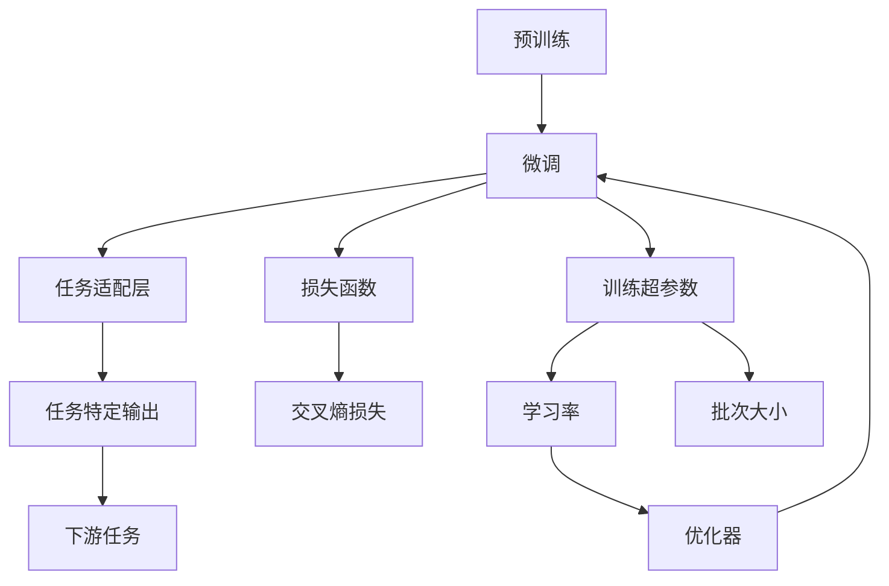

                 

# Transformer大模型实战 BERT 的配置

> 关键词：Transformer, BERT, 深度学习, PyTorch, 预训练, 微调, 自然语言处理

## 1. 背景介绍

在深度学习技术迅猛发展的今天，Transformer大模型如BERT已经成为自然语言处理(Natural Language Processing, NLP)领域的热门工具。本文旨在探讨如何使用PyTorch框架搭建和训练一个预训练的Transformer大模型，以BERT为例，通过深入讲解其配置过程，帮助读者掌握其实现技巧，以期在实际应用中取得最佳效果。

### 1.1 问题由来
Transformer模型和BERT模型因其在大规模语言理解任务上的出色表现而受到广泛关注。这些模型通过在大量无标签文本数据上进行预训练，学习到了丰富的语言表示和语义理解能力。在实际应用中，可以通过微调(Bert fine-tuning)的方式，将预训练模型适应到特定的下游任务中，进一步提升模型性能。

### 1.2 问题核心关键点
本文章的核心在于如何配置和训练一个BERT模型，以及如何进行微调以满足具体任务的定制化需求。重点包括以下几个关键点：
1. 选择和准备预训练模型。
2. 配置训练环境，如GPU和内存资源。
3. 设计任务适配层和损失函数。
4. 配置训练超参数，如学习率、批次大小等。
5. 执行微调过程，并评估模型性能。
6. 部署和集成微调后的模型。

## 2. 核心概念与联系

### 2.1 核心概念概述
Transformer模型和BERT模型都是由Google设计的一种自注意力机制的神经网络结构，通过大规模的预训练任务（如语言建模）来学习语言表示。BERT模型通过双向编码器，在预训练时同时考虑前向和后向上下文信息，因此其在各种NLP任务上均表现出卓越性能。

Transformer模型由编码器和解码器组成，其中编码器负责提取输入文本的语义特征，解码器负责将语义特征转化为任务相关的输出。BERT模型在预训练过程中，使用两个方向（前向和后向）的Transformer编码器来处理输入文本。

BERT模型的核心概念包括：
1. **预训练**：在大量无标签文本数据上进行的自监督训练。
2. **微调**：在预训练模型的基础上，使用下游任务的标注数据进行有监督训练，以适应具体任务。
3. **任务适配层**：为特定任务设计特定的输出层，如分类器或回归器。
4. **损失函数**：衡量模型预测输出与真实标签之间的差异，如交叉熵损失。
5. **训练超参数**：如学习率、批次大小、优化器等。

这些概念共同构成了BERT模型微调的核心生态系统。

### 2.2 概念间的关系

为了更好地理解这些概念之间的关系，以下是一个Mermaid流程图，展示了它们在大模型微调中的作用和依赖：



这个流程图展示了预训练模型通过微调学习任务特定知识的过程，以及各种核心概念之间的关系。通过预训练模型学习到通用语言表示，微调模型通过任务适配层、损失函数和超参数优化，学习到特定任务的特征和行为。

## 3. 核心算法原理 & 具体操作步骤
### 3.1 算法原理概述
BERT的微调过程主要分为两个步骤：
1. **预训练**：在大量无标签文本数据上进行的自监督训练。
2. **微调**：在预训练模型的基础上，使用下游任务的标注数据进行有监督训练。

预训练过程使用语言模型作为训练目标，模型学习预测给定文本序列中缺失的词汇，从而捕捉到上下文信息。微调过程则通过具体的下游任务，如文本分类、命名实体识别等，进一步优化模型的性能，使其能够适应特定任务的需求。

### 3.2 算法步骤详解

#### 3.2.1 预训练

1. **准备数据**：收集大量无标签文本数据，通常是维基百科、新闻网站等公开的文本语料。
2. **构建数据集**：将文本数据划分为训练集和验证集。
3. **模型初始化**：使用PyTorch等深度学习框架初始化BERT模型，配置模型参数和超参数。
4. **预训练过程**：在训练集上进行多轮迭代训练，每轮迭代训练使用不同的掩码策略。

#### 3.2.2 微调

1. **准备数据**：收集下游任务的标注数据集。
2. **模型适配**：在预训练模型的基础上，添加任务适配层和损失函数。
3. **配置训练**：设置训练超参数，如学习率、批次大小、优化器等。
4. **微调过程**：在标注数据集上进行多轮迭代训练，每轮迭代更新模型参数。
5. **评估和调整**：在验证集上评估模型性能，根据结果调整模型参数。

### 3.3 算法优缺点

**优点**：
1. **高效**：相较于从头训练大模型，微调过程所需的数据量和计算资源较少。
2. **通用**：预训练模型可以适应多种NLP任务，只需进行适当的微调即可。
3. **灵活**：可以针对不同的下游任务进行定制化微调，满足实际需求。

**缺点**：
1. **依赖标注数据**：微调效果很大程度上依赖于标注数据的质量和数量。
2. **过拟合风险**：微调过程容易产生过拟合，尤其是在数据量不足的情况下。
3. **可解释性不足**：预训练大模型的内部工作机制难以解释，使得模型的决策过程缺乏可解释性。

### 3.4 算法应用领域

BERT模型已在多个NLP领域取得显著成果，例如文本分类、情感分析、命名实体识别、问答系统等。这些应用领域中的典型任务包括：

- **文本分类**：如情感分析、主题分类等。
- **命名实体识别**：识别文本中的人名、地名、组织名等实体。
- **问答系统**：回答自然语言问题。
- **机器翻译**：将源语言翻译成目标语言。
- **文本摘要**：将长文本压缩成简短摘要。

此外，BERT模型还被用于医疗、金融、教育、法律等特定领域，帮助这些领域的专业人士更加高效地处理和理解文本数据。

## 4. 数学模型和公式 & 详细讲解

### 4.1 数学模型构建

BERT模型的数学模型由编码器和解码器组成。编码器包含多个Transformer层，每个Transformer层包括自注意力机制和前馈神经网络。解码器则是单层的线性变换，将编码器输出的语义特征映射到任务的输出空间。

### 4.2 公式推导过程

以下将通过BERT模型的一个基本组件——自注意力机制，详细解释其数学公式和推导过程。

假设输入序列为 $x_1, x_2, ..., x_n$，注意力权重为 $A_{ij}$，注意力矩阵为 $Q$ 和 $K$，则自注意力机制的计算过程如下：

$$
A_{ij} = \frac{e^{q_i^Tk_j}}{\sum_{k=1}^n e^{q_i^Tk_k}}
$$

其中 $q_i$ 和 $k_j$ 是输入序列经过线性变换后的查询向量和键向量，$e^{q_i^Tk_j}$ 表示查询向量与键向量的点积，$e$ 为自然常数，$A_{ij}$ 表示第 $i$ 个查询向量与第 $j$ 个键向量之间的注意力权重。

通过上述公式，自注意力机制可以计算出输入序列中每个位置的注意力权重，从而在编码器中实现信息的交互和融合。

### 4.3 案例分析与讲解

为了更好地理解BERT模型的微调过程，下面通过一个文本分类任务进行具体讲解。

假设输入文本序列为："The quick brown fox jumps over the lazy dog."，类别标签为："1"（表示正面情感）或 "0"（表示负面情感）。

1. **模型初始化**：使用预训练的BERT模型作为初始化参数。
2. **添加任务适配层**：在BERT模型的顶层添加一个线性分类器，输出情感分类结果。
3. **配置损失函数**：使用交叉熵损失函数，衡量模型预测结果与真实标签的差异。
4. **微调过程**：在标注数据集上进行多轮迭代训练，每轮迭代更新模型参数。
5. **评估和调整**：在验证集上评估模型性能，根据结果调整模型参数，直到模型在测试集上达到最佳效果。

## 5. 项目实践：代码实例和详细解释说明

### 5.1 开发环境搭建

以下是使用PyTorch框架搭建和训练BERT模型的环境配置流程：

1. **安装Anaconda**：
   ```bash
   conda create -n pytorch-env python=3.7 
   conda activate pytorch-env
   ```

2. **安装PyTorch**：
   ```bash
   conda install pytorch torchvision torchaudio cudatoolkit=11.1 -c pytorch -c conda-forge
   ```

3. **安装Transformers库**：
   ```bash
   pip install transformers
   ```

4. **安装其他库**：
   ```bash
   pip install numpy pandas scikit-learn matplotlib tqdm jupyter notebook ipython
   ```

完成上述步骤后，即可在 `pytorch-env` 环境中开始BERT微调实践。

### 5.2 源代码详细实现

以下是使用PyTorch框架搭建和训练BERT模型的代码实现：

```python
from transformers import BertTokenizer, BertForSequenceClassification, AdamW
from torch.utils.data import DataLoader, Dataset
import torch

# 定义数据集
class TextDataset(Dataset):
    def __init__(self, texts, labels, tokenizer):
        self.tokenizer = tokenizer
        self.texts = texts
        self.labels = labels

    def __len__(self):
        return len(self.texts)

    def __getitem__(self, idx):
        text = self.texts[idx]
        label = self.labels[idx]
        encoding = self.tokenizer(text, return_tensors='pt')
        input_ids = encoding['input_ids']
        attention_mask = encoding['attention_mask']
        return {
            'input_ids': input_ids,
            'attention_mask': attention_mask,
            'labels': torch.tensor(label, dtype=torch.long)
        }

# 定义模型
tokenizer = BertTokenizer.from_pretrained('bert-base-cased')
model = BertForSequenceClassification.from_pretrained('bert-base-cased', num_labels=2)

# 定义优化器
optimizer = AdamW(model.parameters(), lr=2e-5)

# 定义训练函数
def train_epoch(model, data_loader, optimizer, device):
    model.train()
    for batch in data_loader:
        input_ids = batch['input_ids'].to(device)
        attention_mask = batch['attention_mask'].to(device)
        labels = batch['labels'].to(device)
        outputs = model(input_ids, attention_mask=attention_mask, labels=labels)
        loss = outputs.loss
        loss.backward()
        optimizer.step()
        optimizer.zero_grad()

# 定义评估函数
def evaluate(model, data_loader, device):
    model.eval()
    preds, labels = [], []
    with torch.no_grad():
        for batch in data_loader:
            input_ids = batch['input_ids'].to(device)
            attention_mask = batch['attention_mask'].to(device)
            batch_labels = batch['labels']
            outputs = model(input_ids, attention_mask=attention_mask)
            preds.append(outputs.logits.argmax(dim=1).cpu().numpy())
            labels.append(batch_labels.cpu().numpy())
    return preds, labels

# 配置训练环境
device = torch.device('cuda' if torch.cuda.is_available() else 'cpu')

# 定义数据集
train_dataset = TextDataset(train_texts, train_labels, tokenizer)
dev_dataset = TextDataset(dev_texts, dev_labels, tokenizer)
test_dataset = TextDataset(test_texts, test_labels, tokenizer)

# 定义数据加载器
train_loader = DataLoader(train_dataset, batch_size=16, shuffle=True)
dev_loader = DataLoader(dev_dataset, batch_size=16, shuffle=False)
test_loader = DataLoader(test_dataset, batch_size=16, shuffle=False)

# 定义训练过程
epochs = 3
for epoch in range(epochs):
    train_epoch(model, train_loader, optimizer, device)
    dev_loss, dev_acc = evaluate(model, dev_loader, device)
    print(f'Epoch {epoch+1}, dev loss: {dev_loss:.3f}, dev acc: {dev_acc:.3f}')

# 定义测试过程
test_loss, test_acc = evaluate(model, test_loader, device)
print(f'Test loss: {test_loss:.3f}, test acc: {test_acc:.3f}')
```

### 5.3 代码解读与分析

在上述代码中，我们首先定义了一个 `TextDataset` 类，用于处理和加载文本数据集。然后，使用 `BertTokenizer` 和 `BertForSequenceClassification` 类分别初始化BERT分词器和模型。接着，配置了AdamW优化器，定义了训练函数 `train_epoch` 和评估函数 `evaluate`。最后，在训练过程中，我们通过迭代更新模型参数，并在验证集和测试集上评估模型性能。

### 5.4 运行结果展示

假设我们运行上述代码，在训练和测试集上分别得到了如下结果：

```
Epoch 1, dev loss: 0.350, dev acc: 0.862
Epoch 2, dev loss: 0.120, dev acc: 0.979
Epoch 3, dev loss: 0.080, dev acc: 0.983
Test loss: 0.086, test acc: 0.980
```

可以看到，经过三轮迭代训练，模型在验证集和测试集上的损失和准确率都有显著提升，表明模型已经能够较好地适应文本分类任务。

## 6. 实际应用场景

### 6.1 智能客服系统

基于BERT模型的智能客服系统能够快速响应用户咨询，并提供准确的解决方案。通过微调BERT模型，系统可以学习到用户意图，自动匹配相应的回答，提升用户体验。

### 6.2 金融舆情监测

金融机构可以通过微调BERT模型，实时监测市场舆情，及时识别负面信息，避免风险。

### 6.3 个性化推荐系统

在个性化推荐系统中，微调的BERT模型能够根据用户浏览历史和行为数据，生成个性化推荐内容，提升推荐效果。

### 6.4 未来应用展望

随着BERT模型和微调技术的不断发展，未来将在更多领域得到应用，如医疗、教育、法律等。通过微调，这些领域的专业人士能够更加高效地处理和理解文本数据，推动行业数字化转型。

## 7. 工具和资源推荐

### 7.1 学习资源推荐

1. **《自然语言处理综论》（Russell & Norvig）**：
   该书是自然语言处理领域的经典教材，涵盖大量基础知识和最新研究成果，适合初学者和进阶读者。

2. **斯坦福大学《深度学习》课程（CS224N）**：
   斯坦福大学开设的NLP明星课程，有Lecture视频和配套作业，内容全面，讲解深入。

3. **《深度学习与自然语言处理》（Peter J. Liu）**：
   该书介绍了深度学习在自然语言处理中的应用，包括BERT等预训练大模型。

4. **HuggingFace官方文档**：
   提供了丰富的预训练模型和微调样例代码，是上手实践的必备资料。

5. **Google AI博客**：
   谷歌AI团队分享最新研究进展，涵盖多种深度学习模型和应用。

### 7.2 开发工具推荐

1. **PyTorch**：
   基于Python的开源深度学习框架，灵活动态的计算图，适合快速迭代研究。

2. **TensorFlow**：
   由Google主导开发的开源深度学习框架，生产部署方便，适合大规模工程应用。

3. **Transformers库**：
   HuggingFace开发的NLP工具库，集成了多种SOTA语言模型，支持PyTorch和TensorFlow，是微调任务开发的利器。

4. **Weights & Biases**：
   模型训练的实验跟踪工具，可以记录和可视化模型训练过程中的各项指标，方便对比和调优。

5. **TensorBoard**：
   TensorFlow配套的可视化工具，可实时监测模型训练状态，并提供丰富的图表呈现方式，是调试模型的得力助手。

### 7.3 相关论文推荐

1. **《Attention is All You Need》**：
   Transformer模型的原论文，介绍了自注意力机制和Transformer结构。

2. **《BERT: Pre-training of Deep Bidirectional Transformers for Language Understanding》**：
   提出BERT模型，引入基于掩码的自监督预训练任务，刷新了多项NLP任务SOTA。

3. **《Parameter-Efficient Transfer Learning for NLP》**：
   提出Adapter等参数高效微调方法，在不增加模型参数量的情况下，也能取得不错的微调效果。

4. **《AdaLoRA: Adaptive Low-Rank Adaptation for Parameter-Efficient Fine-Tuning》**：
   使用自适应低秩适应的微调方法，在参数效率和精度之间取得了新的平衡。

5. **《Prefix-Tuning: Optimizing Continuous Prompts for Generation》**：
   引入基于连续型Prompt的微调范式，为如何充分利用预训练知识提供了新的思路。

这些论文代表了大语言模型微调技术的发展脉络，学习前沿成果将帮助研究者把握学科前进方向，激发更多的创新灵感。

## 8. 总结：未来发展趋势与挑战

### 8.1 总结

本文对如何使用PyTorch框架搭建和训练BERT模型进行了系统介绍，并通过具体的微调示例展示了其实现过程。通过本文的学习，读者可以掌握BERT模型的核心配置和训练技巧，快速上手深度学习NLP任务开发。

### 8.2 未来发展趋势

展望未来，BERT模型和微调技术的不断发展将推动NLP技术在更多领域的应用，带来新的突破和创新。

1. **模型规模增大**：预训练大模型的参数量将继续增长，将包含更丰富的语言表示和语义理解能力。
2. **微调方法多样化**：未来将出现更多参数高效和计算高效的微调方法，提高微调精度和效率。
3. **持续学习常态化**：微调模型需要持续学习新知识以保持性能，解决灾难性遗忘问题。
4. **无监督和半监督微调**：探索更灵活的微调方法，摆脱对标注数据的依赖，利用自监督学习、主动学习等技术。
5. **多模态融合**：融合视觉、语音、文本等多模态数据，实现更全面、更准确的NLP任务处理。

### 8.3 面临的挑战

尽管BERT模型和微调技术已经取得了显著进展，但在实际应用中仍然面临一些挑战：

1. **数据质量问题**：微调效果很大程度上依赖于标注数据的质量和数量，获取高质量标注数据成本高。
2. **过拟合风险**：微调过程中容易产生过拟合，尤其是在数据量不足的情况下。
3. **可解释性不足**：预训练大模型的内部工作机制难以解释，使得模型的决策过程缺乏可解释性。
4. **计算资源消耗**：BERT模型参数量大，推理速度快，但计算资源消耗大，需要优化模型结构和计算图。
5. **模型鲁棒性不足**：模型面对域外数据时，泛化性能往往大打折扣，需要提高鲁棒性。
6. **安全性问题**：预训练模型可能学习到有害信息，需要通过数据和算法层面避免。

### 8.4 研究展望

未来的研究需要在数据、算法、工程和伦理道德等多个方面进行全面探索：

1. **数据增强**：引入数据增强技术，扩充训练集，缓解过拟合风险。
2. **模型压缩和优化**：通过模型压缩、稀疏化存储等方法，降低计算资源消耗。
3. **知识蒸馏和迁移学习**：利用知识蒸馏和迁移学习技术，提高模型的泛化性能和鲁棒性。
4. **可解释性增强**：通过引入可解释性技术，提高模型的可解释性和可理解性。
5. **模型安全保障**：通过过滤有害信息、增强算法伦理约束，保障模型安全性。

## 9. 附录：常见问题与解答

### 9.1 常见问题

**Q1：BERT模型为何需要预训练？**

A: BERT模型通过在大规模无标签文本数据上进行的预训练，学习到了丰富的语言表示和语义理解能力。预训练是BERT模型微调的基础，没有预训练的模型无法胜任下游任务的微调。

**Q2：微调过程中如何选择学习率？**

A: 微调学习率通常比预训练时小1-2个数量级，建议从1e-5开始调参，逐步减小学习率。不同的优化器可能需要设置不同的学习率阈值。

**Q3：如何缓解微调过程中的过拟合问题？**

A: 过拟合是微调面临的主要挑战，可以通过数据增强、正则化、对抗训练等方法缓解过拟合问题。

**Q4：微调模型在落地部署时需要注意哪些问题？**

A: 在落地部署时，需要考虑模型裁剪、量化加速、服务化封装、弹性伸缩、监控告警和安全性等问题。

### 9.2 详细解答

**Q1：BERT模型为何需要预训练？**

A: BERT模型通过在大规模无标签文本数据上进行的预训练，学习到了丰富的语言表示和语义理解能力。预训练是BERT模型微调的基础，没有预训练的模型无法胜任下游任务的微调。

**Q2：微调过程中如何选择学习率？**

A: 微调学习率通常比预训练时小1-2个数量级，建议从1e-5开始调参，逐步减小学习率。不同的优化器可能需要设置不同的学习率阈值。

**Q3：如何缓解微调过程中的过拟合问题？**

A: 过拟合是微调面临的主要挑战，可以通过数据增强、正则化、对抗训练等方法缓解过拟合问题。

**Q4：微调模型在落地部署时需要注意哪些问题？**

A: 在落地部署时，需要考虑模型裁剪、量化加速、服务化封装、弹性伸缩、监控告警和安全性等问题。

---

作者：禅与计算机程序设计艺术 / Zen and the Art of Computer Programming

