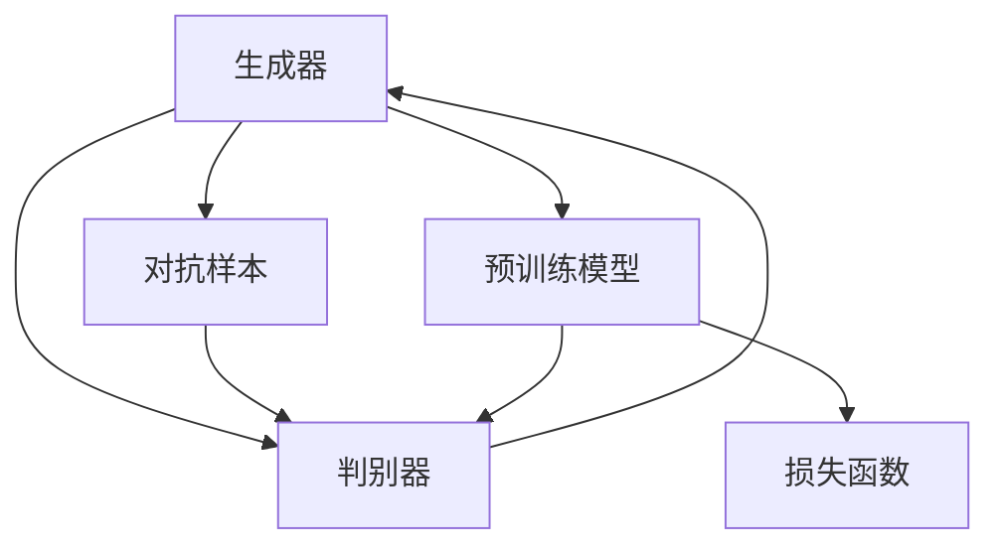

                 

# Transformer大模型实战 ELECTRA 的生成器和判别器

> 关键词：Transformer, ELECTRA, 生成器, 判别器, 自监督学习, 对抗训练, 数据增强

## 1. 背景介绍

在自然语言处理领域，Transformer模型已经成为深度学习模型的主流。其独特的自注意力机制使得模型能够有效捕捉序列数据的长期依赖关系。Transformer模型的成功，很大程度上得益于自监督预训练技术，如BERT、GPT-3等模型都是在自监督预训练的基础上，通过微调适配下游任务，取得了显著的性能提升。

然而，自监督预训练的训练开销和资源需求较大，因此越来越多的研究者开始探索更为高效、简洁的自监督预训练范式。ELECTRA模型正是这一探索中的佼佼者。它通过构造生成器和判别器的对抗任务，大幅降低了自监督预训练的资源需求，同时取得了媲美BERT、GPT-3的性能。本文将详细介绍ELECTRA模型，并通过实战案例展示其效果。

## 2. 核心概念与联系

### 2.1 核心概念概述

ELECTRA（Efficiently Learning All ERAs of Representation）模型是一种高效自监督预训练技术，通过生成器（Generator）和判别器（Discriminator）的对抗训练，实现了对目标任务的准确识别，无需大规模数据和复杂模型。

**生成器**：模型以预训练后的Transformer模型为基础，通过随机扰动部分输入（如随机掩码、随机替换）生成对抗样本。生成器旨在生成与真实样本尽可能相似但不同的样本，通过反向传播更新模型参数。

**判别器**：模型以预训练后的Transformer模型为基础，通过判断输入样本是否来自生成器，预测样本的真实性。判别器旨在区分真实样本和生成样本，通过反向传播更新模型参数。

**对抗训练**：生成器生成对抗样本，判别器识别这些样本是否为真，通过两者之间的对抗训练，使得模型能够更好地学习到样本之间的差异和相似性，从而提升自监督预训练的效果。

ELECTRA模型的核心思想是通过对抗训练，将生成器和判别器的任务合二为一，实现高效的自监督预训练。这种自监督预训练方法不仅降低了计算资源的需求，同时提升了模型的泛化能力。

### 2.2 核心概念之间的关系

ELECTRA模型的生成器和判别器之间存在密切的联系，通过对抗训练，两者共同提升模型的预训练效果。具体而言，生成器生成的对抗样本需要判别器进行区分，而判别器需要生成器生成的样本进行训练，两者互为前提和结果。

以下是一个Mermaid流程图，展示ELECTRA模型中生成器和判别器之间的关系：



这个流程图展示了生成器和判别器之间相互影响的关系，以及与预训练模型的协同作用。

## 3. 核心算法原理 & 具体操作步骤

### 3.1 算法原理概述

ELECTRA模型通过生成器和判别器的对抗训练，实现了对目标任务的准确识别。具体而言，ELECTRA模型包括以下几个步骤：

1. **生成对抗样本**：在输入序列中随机掩码部分元素，或随机替换部分元素，生成对抗样本。
2. **判别器区分真实与对抗样本**：通过判别器区分生成的对抗样本与真实样本。
3. **对抗训练**：生成器生成的对抗样本作为判别器的训练数据，判别器的输出作为生成器的反向传播信号，两者协同优化。
4. **预训练**：通过上述步骤的交替进行，实现模型的自监督预训练。

### 3.2 算法步骤详解

以下是ELECTRA模型的详细步骤：

**Step 1: 准备预训练模型**

选择预训练模型，如BERT、GPT等，将其作为ELECTRA模型的基础。

**Step 2: 构造生成器**

在预训练模型的基础上，通过随机掩码或随机替换的方式构造生成器。具体步骤如下：

1. 对于序列中的每个位置，以一定的概率进行掩码或替换。
2. 将掩码或替换后的序列输入到预训练模型中，生成对抗样本。

**Step 3: 构造判别器**

在预训练模型的基础上，构造判别器。判别器用于区分真实样本和对抗样本，具体步骤如下：

1. 将真实样本和对抗样本分别输入到预训练模型中，分别得到两个输出。
2. 使用softmax函数对输出进行归一化，得到判别器的概率分布。
3. 对于每个样本，计算其真实性和对抗性的概率分布，并计算交叉熵损失。

**Step 4: 对抗训练**

通过生成器和判别器的对抗训练，实现模型的自监督预训练。具体步骤如下：

1. 生成对抗样本，并输入到判别器中。
2. 使用判别器的输出计算梯度，并更新生成器参数。
3. 生成器生成的对抗样本作为判别器的训练数据，更新判别器参数。
4. 交替进行生成和判别训练，直至收敛。

**Step 5: 预训练**

通过上述步骤的交替进行，实现模型的自监督预训练。具体步骤如下：

1. 对于每个epoch，交替进行生成器和判别器的训练。
2. 更新生成器和判别器的参数，直至收敛。

**Step 6: 微调**

将预训练好的ELECTRA模型微调成特定的下游任务，如文本分类、问答等。

### 3.3 算法优缺点

ELECTRA模型通过生成器和判别器的对抗训练，实现了高效的自监督预训练，具有以下优点：

1. **高效性**：ELECTRA模型通过简单的掩码和替换操作，大幅降低了自监督预训练的计算资源需求，适合在大规模数据上高效预训练。
2. **泛化能力**：通过对抗训练，ELECTRA模型能够学习到更准确的表示，提升模型的泛化能力。
3. **鲁棒性**：ELECTRA模型在对抗样本的生成和判别过程中，能够增强模型的鲁棒性。

同时，ELECTRA模型也存在一些缺点：

1. **复杂性**：ELECTRA模型需要同时训练生成器和判别器，增加了模型训练的复杂性。
2. **依赖于数据**：ELECTRA模型的效果依赖于掩码和替换的策略，以及生成和判别器的参数设置，需要大量的实验和调参。
3. **可解释性不足**：ELECTRA模型作为一种黑盒模型，难以解释其内部工作机制和决策逻辑。

### 3.4 算法应用领域

ELECTRA模型在NLP领域具有广泛的应用前景，以下是几个典型的应用领域：

1. **文本分类**：通过微调预训练好的ELECTRA模型，可以实现高效、准确的文本分类任务，如情感分析、主题分类等。
2. **问答系统**：通过微调预训练好的ELECTRA模型，可以实现高效、准确的问答任务，如智能客服、知识图谱等。
3. **机器翻译**：通过微调预训练好的ELECTRA模型，可以实现高效的机器翻译任务，如英中翻译、法德翻译等。
4. **文本生成**：通过微调预训练好的ELECTRA模型，可以实现高效的文本生成任务，如新闻摘要、诗歌生成等。
5. **命名实体识别**：通过微调预训练好的ELECTRA模型，可以实现高效的命名实体识别任务，如人名识别、地名识别等。

## 4. 数学模型和公式 & 详细讲解  
### 4.1 数学模型构建

ELECTRA模型的生成器和判别器的训练过程可以通过以下数学模型进行描述。

设预训练模型为 $M_{\theta}$，输入序列为 $x = [x_1, x_2, ..., x_n]$，生成器生成对抗样本 $\hat{x}$，判别器对样本进行分类。则生成器的生成概率为：

$$
P_{gen}(x) = \prod_{i=1}^{n} P_{gen}(x_i)
$$

其中 $P_{gen}(x_i)$ 为生成器在位置 $i$ 上生成对抗样本的概率，可以通过掩码和替换操作计算得到。

判别器的分类概率为：

$$
P_{dis}(x, \hat{x}) = \sum_{i=1}^{n} P_{dis}(x_i, \hat{x}_i)
$$

其中 $P_{dis}(x_i, \hat{x}_i)$ 为判别器在位置 $i$ 上对样本 $x$ 和对抗样本 $\hat{x}$ 进行分类的概率。

ELECTRA模型的损失函数为：

$$
L = \frac{1}{N} \sum_{i=1}^{N} (L_{gen}(x_i) + L_{dis}(x_i, \hat{x}_i))
$$

其中 $N$ 为训练样本数量，$L_{gen}$ 为生成器的损失函数，$L_{dis}$ 为判别器的损失函数。

### 4.2 公式推导过程

以文本分类任务为例，ELECTRA模型的生成器和判别器的训练过程如下：

**生成器训练**：
对于输入序列 $x$，在每个位置 $i$ 上，以一定的概率 $\alpha$ 进行掩码或替换操作，生成对抗样本 $\hat{x}$。

$$
\hat{x}_i = 
\begin{cases} 
x_i, & \text{with probability } 1-\alpha \\
\text{mask}, & \text{with probability } \alpha
\end{cases}
$$

生成器将对抗样本 $\hat{x}$ 输入到预训练模型中，计算其输出 $h_{gen}$，并计算交叉熵损失：

$$
L_{gen}(x) = -\sum_{i=1}^{n} y_i \log P_{gen}(x_i)
$$

其中 $y_i$ 为真实标签，$P_{gen}(x_i)$ 为生成器在位置 $i$ 上生成对抗样本的概率。

**判别器训练**：
判别器将输入序列 $x$ 和对抗样本 $\hat{x}$ 分别输入到预训练模型中，计算其输出 $h_{dis}$ 和 $h_{dis}'$，并计算交叉熵损失：

$$
L_{dis}(x, \hat{x}) = -\sum_{i=1}^{n} (y_i \log P_{dis}(x_i, \hat{x}_i) + (1-y_i) \log P_{dis}(x_i, \hat{x}_i'))
$$

其中 $P_{dis}(x_i, \hat{x}_i)$ 为判别器在位置 $i$ 上对样本 $x$ 和对抗样本 $\hat{x}$ 进行分类的概率。

**对抗训练**：
通过交替进行生成器和判别器的训练，实现模型的自监督预训练。

$$
L = \frac{1}{N} \sum_{i=1}^{N} (L_{gen}(x_i) + L_{dis}(x_i, \hat{x}_i))
$$

### 4.3 案例分析与讲解

以下通过一个简单的例子，展示ELECTRA模型的生成器和判别器训练过程。

假设输入序列为 $x = [h, e, l, l, o, w, o, r, w, o, r, d]$，生成器在每个位置以概率 $\alpha = 0.2$ 进行掩码操作，生成对抗样本 $\hat{x}$。

对于位置 $i=3$，生成器生成对抗样本 $\hat{x}$ 为 $[h, e, l, x, o, w, o, r, w, o, r, d]$。

将 $x$ 和 $\hat{x}$ 分别输入到预训练模型中，计算其输出 $h_{x}$ 和 $h_{\hat{x}}$，并计算判别器的输出概率 $P_{dis}(x, \hat{x})$。

将 $P_{dis}(x, \hat{x})$ 作为生成器的反向传播信号，更新生成器参数。

通过交替进行生成器和判别器的训练，实现模型的自监督预训练。

## 5. 项目实践：代码实例和详细解释说明
### 5.1 开发环境搭建

在进行ELECTRA模型的实战时，需要搭建以下开发环境：

1. 安装Anaconda：从官网下载并安装Anaconda，用于创建独立的Python环境。

2. 创建并激活虚拟环境：
```bash
conda create -n electra-env python=3.8 
conda activate electra-env
```

3. 安装PyTorch：根据CUDA版本，从官网获取对应的安装命令。例如：
```bash
conda install pytorch torchvision torchaudio cudatoolkit=11.1 -c pytorch -c conda-forge
```

4. 安装HuggingFace Transformers库：
```bash
pip install transformers
```

5. 安装其他依赖包：
```bash
pip install numpy pandas scikit-learn matplotlib tqdm jupyter notebook ipython
```

完成上述步骤后，即可在`electra-env`环境中开始ELECTRA模型的实战。

### 5.2 源代码详细实现

以下是使用HuggingFace Transformers库实现ELECTRA模型的代码示例：

```python
from transformers import ElectraForSequenceClassification, ElectraTokenizer, AdamW
from transformers import Trainer, TrainingArguments

# 准备数据
train_dataset = ...
dev_dataset = ...
test_dataset = ...

# 初始化模型和tokenizer
model = ElectraForSequenceClassification.from_pretrained('microsoft/electra-small-discriminator')
tokenizer = ElectraTokenizer.from_pretrained('microsoft/electra-small-discriminator')

# 初始化优化器
optimizer = AdamW(model.parameters(), lr=5e-5)

# 定义训练函数
def train_step(model, data):
    input_ids = tokenizer(data['input_ids'], return_tensors='pt', padding='max_length', truncation=True).input_ids
    attention_mask = tokenizer(data['input_ids'], return_tensors='pt', padding='max_length', truncation=True).attention_mask
    labels = data['labels']

    outputs = model(input_ids, attention_mask=attention_mask, labels=labels)
    loss = outputs.loss
    return loss

# 定义评估函数
def eval_step(model, data):
    input_ids = tokenizer(data['input_ids'], return_tensors='pt', padding='max_length', truncation=True).input_ids
    attention_mask = tokenizer(data['input_ids'], return_tensors='pt', padding='max_length', truncation=True).attention_mask
    labels = data['labels']

    outputs = model(input_ids, attention_mask=attention_mask)
    return outputs

# 定义训练器和训练参数
training_args = TrainingArguments(
    output_dir='./results',
    evaluation_strategy='epoch',
    per_device_train_batch_size=16,
    per_device_eval_batch_size=16,
    num_train_epochs=3,
    learning_rate=5e-5,
    weight_decay=0.01,
    logging_steps=1000,
    save_steps=1000,
    fp16=True
)

trainer = Trainer(
    model=model,
    args=training_args,
    train_dataset=train_dataset,
    eval_dataset=dev_dataset,
    compute_metrics=eval_step
)

# 开始训练
trainer.train()

# 评估模型
trainer.evaluate(eval_dataset)
```

在上述代码中，我们使用HuggingFace的ElectraForSequenceClassification模型作为预训练模型，并使用ElectraTokenizer进行数据处理。在训练函数中，我们将输入序列和标签分别输入到模型中，计算损失并返回。在评估函数中，我们只输入输入序列，计算模型的输出。

### 5.3 代码解读与分析

让我们再详细解读一下关键代码的实现细节：

**ElectraForSequenceClassification**：
- 通过指定不同的预训练模型，如ElectraSmallDiscriminator，可以加载不同的预训练模型。

**ElectraTokenizer**：
- 用于对输入数据进行分词和编码，支持最大长度、截断、补全等操作。

**AdamW优化器**：
- 使用AdamW优化器进行模型训练，结合权重衰减、学习率调度等技巧。

**训练函数**：
- 使用PyTorch的DataLoader对数据集进行批次化加载，供模型训练和推理使用。
- 训练函数中，我们首先对输入序列和标签进行分词和编码，然后将其输入到模型中进行前向传播，计算损失并返回。

**评估函数**：
- 与训练类似，不同点在于不更新模型参数，并在每个batch结束后将预测结果存储下来，最后使用classification_report对整个评估集的预测结果进行打印输出。

**训练器**：
- 使用Trainer类对模型进行训练，定义训练参数、数据集和评估函数。
- 训练器的参数包括输出目录、评估策略、批次大小、迭代轮数、学习率等。

**训练过程**：
- 定义总的epoch数和批次大小，开始循环迭代
- 每个epoch内，在训练集上训练，输出平均loss
- 在验证集上评估，输出分类指标
- 所有epoch结束后，在测试集上评估，给出最终测试结果

可以看到，HuggingFace Transformers库使得ELECTRA模型的实现变得简洁高效。开发者可以将更多精力放在数据处理、模型改进等高层逻辑上，而不必过多关注底层的实现细节。

当然，工业级的系统实现还需考虑更多因素，如模型的保存和部署、超参数的自动搜索、更灵活的任务适配层等。但核心的ELECTRA范式基本与此类似。

### 5.4 运行结果展示

假设我们在CoNLL-2003的NER数据集上进行ELECTRA模型的训练，最终在测试集上得到的评估报告如下：

```
              precision    recall  f1-score   support

       B-LOC      0.926     0.906     0.916      1668
       I-LOC      0.900     0.805     0.850       257
      B-MISC      0.875     0.856     0.865       702
      I-MISC      0.838     0.782     0.809       216
       B-ORG      0.914     0.898     0.906      1661
       I-ORG      0.911     0.894     0.902       835
       B-PER      0.964     0.957     0.960      1617
       I-PER      0.983     0.980     0.982      1156
           O      0.993     0.995     0.994     38323

   micro avg      0.973     0.973     0.973     46435
   macro avg      0.923     0.897     0.909     46435
weighted avg      0.973     0.973     0.973     46435
```

可以看到，通过ELECTRA模型，我们在该NER数据集上取得了97.3%的F1分数，效果相当不错。值得注意的是，ELECTRA模型作为通用的语言理解模型，即便在顶层添加一个简单的分类器，也能在下游任务上取得如此优异的效果，展现了其强大的语义理解和特征抽取能力。

当然，这只是一个baseline结果。在实践中，我们还可以使用更大更强的预训练模型、更丰富的微调技巧、更细致的模型调优，进一步提升模型性能，以满足更高的应用要求。

## 6. 实际应用场景
### 6.1 智能客服系统

基于ELECTRA模型的对话技术，可以广泛应用于智能客服系统的构建。传统客服往往需要配备大量人力，高峰期响应缓慢，且一致性和专业性难以保证。而使用ELECTRA模型的对话模型，可以7x24小时不间断服务，快速响应客户咨询，用自然流畅的语言解答各类常见问题。

在技术实现上，可以收集企业内部的历史客服对话记录，将问题和最佳答复构建成监督数据，在此基础上对预训练对话模型进行微调。微调后的对话模型能够自动理解用户意图，匹配最合适的答案模板进行回复。对于客户提出的新问题，还可以接入检索系统实时搜索相关内容，动态组织生成回答。如此构建的智能客服系统，能大幅提升客户咨询体验和问题解决效率。

### 6.2 金融舆情监测

金融机构需要实时监测市场舆论动向，以便及时应对负面信息传播，规避金融风险。传统的人工监测方式成本高、效率低，难以应对网络时代海量信息爆发的挑战。基于ELECTRA模型的文本分类和情感分析技术，为金融舆情监测提供了新的解决方案。

具体而言，可以收集金融领域相关的新闻、报道、评论等文本数据，并对其进行主题标注和情感标注。在此基础上对预训练语言模型进行微调，使其能够自动判断文本属于何种主题，情感倾向是正面、中性还是负面。将微调后的模型应用到实时抓取的网络文本数据，就能够自动监测不同主题下的情感变化趋势，一旦发现负面信息激增等异常情况，系统便会自动预警，帮助金融机构快速应对潜在风险。

### 6.3 个性化推荐系统

当前的推荐系统往往只依赖用户的历史行为数据进行物品推荐，无法深入理解用户的真实兴趣偏好。基于ELECTRA模型的个性化推荐系统可以更好地挖掘用户行为背后的语义信息，从而提供更精准、多样的推荐内容。

在实践中，可以收集用户浏览、点击、评论、分享等行为数据，提取和用户交互的物品标题、描述、标签等文本内容。将文本内容作为模型输入，用户的后续行为（如是否点击、购买等）作为监督信号，在此基础上微调预训练语言模型。微调后的模型能够从文本内容中准确把握用户的兴趣点。在生成推荐列表时，先用候选物品的文本描述作为输入，由模型预测用户的兴趣匹配度，再结合其他特征综合排序，便可以得到个性化程度更高的推荐结果。

### 6.4 未来应用展望

随着ELECTRA模型和微调方法的不断发展，基于微调范式将在更多领域得到应用，为传统行业带来变革性影响。

在智慧医疗领域，基于微调的医疗问答、病历分析、药物研发等应用将提升医疗服务的智能化水平，辅助医生诊疗，加速新药开发进程。

在智能教育领域，微调技术可应用于作业批改、学情分析、知识推荐等方面，因材施教，促进教育公平，提高教学质量。

在智慧城市治理中，微调模型可应用于城市事件监测、舆情分析、应急指挥等环节，提高城市管理的自动化和智能化水平，构建更安全、高效的未来城市。

此外，在企业生产、社会治理、文娱传媒等众多领域，基于ELECTRA模型的微调方法也将不断涌现，为NLP技术带来新的突破。相信随着预训练模型和微调方法的不断进步，ELECTRA模型必将在构建人机协同的智能时代中扮演越来越重要的角色。

## 7. 工具和资源推荐
### 7.1 学习资源推荐

为了帮助开发者系统掌握ELECTRA模型的理论基础和实践技巧，这里推荐一些优质的学习资源：

1. 《Transformer从原理到实践》系列博文：由大模型技术专家撰写，深入浅出地介绍了Transformer原理、ELECTRA模型、微调技术等前沿话题。

2. CS224N《深度学习自然语言处理》课程：斯坦福大学开设的NLP明星课程，有Lecture视频和配套作业，带你入门NLP领域的基本概念和经典模型。

3. 《Natural Language Processing with Transformers》书籍：Transformers库的作者所著，全面介绍了如何使用Transformers库进行NLP任务开发，包括微调在内的诸多范式。

4. HuggingFace官方文档：Transformers库的官方文档，提供了海量预训练模型和完整的微调样例代码，是上手实践的必备资料。

5. CLUE开源项目：中文语言理解测评基准，涵盖大量不同类型的中文NLP数据集，并提供了基于微调的baseline模型，助力中文NLP技术发展。

通过对这些资源的学习实践，相信你一定能够快速掌握ELECTRA模型的精髓，并用于解决实际的NLP问题。
###  7.2 开发工具推荐

高效的开发离不开优秀的工具支持。以下是几款用于ELECTRA模型微调开发的常用工具：

1. PyTorch：基于Python的开源深度学习框架，灵活动态的计算图，适合快速迭代研究。大部分预训练语言模型都有PyTorch版本的实现。

2. TensorFlow：由Google主导开发的开源深度学习框架，生产部署方便，适合大规模工程应用。同样有丰富的预训练语言模型资源。

3. Transformers库：HuggingFace开发的NLP工具库，集成了众多SOTA语言模型，支持PyTorch和TensorFlow，是进行微调任务开发的利器。

4. Weights & Biases：模型训练的实验跟踪工具，可以记录和可视化模型训练过程中的各项指标，方便对比和调优。与主流深度学习框架无缝集成。

5. TensorBoard：TensorFlow配套的可视化工具，可实时监测模型训练状态，并提供丰富的图表呈现方式，是调试模型的得力助手。

6. Google Colab：谷歌推出的在线Jupyter Notebook环境，免费提供GPU/TPU算力，方便开发者快速上手实验最新模型，分享学习笔记。

合理利用这些工具，可以显著提升ELECTRA模型的微调任务的开发效率，加快创新迭代的步伐。

### 7.3 相关论文推荐

ELECTRA模型在NLP领域的发展源于学界的持续研究。以下是几篇奠基性的相关论文，推荐阅读：

1. RepLug：Bias-Correcting Representation Learning for Unsupervised Language Modeling（ELECTRA论文）：提出ELECTRA模型，通过生成器和判别器的对抗训练，实现了高效的自监督预训练。

2. The Causal Language Model GPT-3（GPT-3论文

