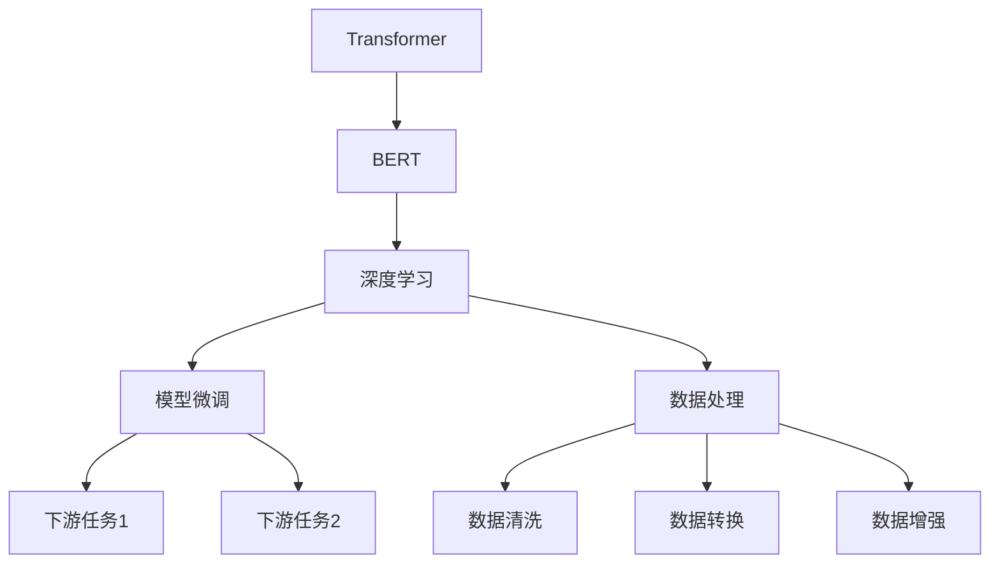

                 

# Transformer大模型实战 bert-as-service库

> 关键词：Transformer, BERT, 自然语言处理(NLP), 深度学习, bert-as-service, 模型微调, 数据处理, 代码实例, 性能优化

## 1. 背景介绍

### 1.1 问题由来
Transformer大模型，如BERT、GPT-3等，在自然语言处理（NLP）领域取得了革命性的进展。这些大模型通过自监督学习在无标签数据上预训练，学习到了丰富的语言知识和表示，能够处理多种复杂的语言任务。然而，在实际应用中，这些大模型的部署、微调、推理等环节都面临诸多挑战，需要强大的工具库来辅助实现。

为了应对这些挑战，Hugging Face公司推出了一个名为 `bert-as-service` 的开源工具库。它不仅封装了Transformer模型的核心功能，还提供了多种便捷的接口，使得部署、微调和使用Transformer大模型变得简单易行。通过 `bert-as-service`，开发者可以更轻松地将大模型集成到自己的应用中，提升NLP应用的开发效率和性能。

### 1.2 问题核心关键点
- 核心技术：Transformer架构、自监督学习、深度学习等。
- 核心难点：大模型的部署、微调、推理等环节的实现。
- 主要应用：自然语言处理、文本分类、信息检索、问答系统等。
- 工具优势：便捷的API接口、高性能推理、高效数据处理。

### 1.3 问题研究意义
`bert-as-service` 提供了一个直观易用的界面，使得研究人员和开发者可以更快速地进行模型微调、推理等任务。这对提升NLP应用的开发效率、降低技术门槛、加速模型应用部署具有重要意义。

## 2. 核心概念与联系

### 2.1 核心概念概述

为了更好地理解 `bert-as-service` 的实现和应用，我们需要了解一些核心概念：

- **Transformer**：一种基于注意力机制的深度神经网络架构，广泛应用于大模型和NLP任务中。
- **BERT**：基于Transformer的预训练语言模型，通过双向自监督学习在大量无标签文本上预训练，学习到了丰富的语言表示。
- **深度学习**：基于神经网络的机器学习范式，能够通过多层次网络结构处理复杂的非线性关系。
- **模型微调**：在预训练模型的基础上，使用下游任务的少量标注数据，通过有监督学习优化模型在特定任务上的性能。
- **数据处理**：包括数据清洗、转换、增强等步骤，确保输入数据的质量和一致性。

这些概念共同构成了 `bert-as-service` 的实现基础，使得它能够高效地支持Transformer大模型的部署和微调。

### 2.2 概念间的关系

这些核心概念之间存在着紧密的联系，形成了 `bert-as-service` 的核心应用框架。我们可以通过以下Mermaid流程图来展示它们之间的关系：



这个流程图展示了从Transformer大模型到下游任务的全流程，数据处理和模型微调是其中关键的两个环节。通过数据处理，确保输入数据的正确性和多样性；通过模型微调，提升模型在特定任务上的性能。

## 3. 核心算法原理 & 具体操作步骤

### 3.1 算法原理概述
`bert-as-service` 的核心算法原理基于Transformer架构和深度学习，主要包括以下几个步骤：

1. **模型预训练**：在大规模无标签数据上使用自监督任务进行预训练，学习通用的语言表示。
2. **模型微调**：在特定下游任务上，使用少量标注数据进行微调，优化模型在特定任务上的性能。
3. **模型推理**：利用微调后的模型对新数据进行推理，得到预测结果。

### 3.2 算法步骤详解

以下详细介绍 `bert-as-service` 的核心算法步骤：

#### 3.2.1 模型预训练

在 `bert-as-service` 中，模型预训练主要通过以下步骤实现：

1. **数据集准备**：收集大规模无标签文本数据，如维基百科、新闻、书籍等。
2. **模型构建**：使用 `transformers` 库中的 `BertModel` 类构建BERT模型。
3. **预训练任务**：在预训练任务中，模型将输入序列进行掩码预测，学习预测未见过的词语。

```python
from transformers import BertTokenizer, BertModel

tokenizer = BertTokenizer.from_pretrained('bert-base-cased')
model = BertModel.from_pretrained('bert-base-cased')
```

#### 3.2.2 模型微调

模型微调是 `bert-as-service` 的核心功能之一，包括以下关键步骤：

1. **数据准备**：准备下游任务的标注数据集，包括输入和输出标签。
2. **模型构建**：使用 `transformers` 库中的 `BertForSequenceClassification` 类构建分类模型，并设置损失函数和优化器。
3. **模型训练**：在微调任务上，使用训练数据进行模型训练，更新模型参数。

```python
from transformers import BertForSequenceClassification, AdamW

# 构建分类模型
model = BertForSequenceClassification.from_pretrained('bert-base-cased', num_labels=2)
# 设置优化器和损失函数
optimizer = AdamW(model.parameters(), lr=2e-5)
loss_fn = CrossEntropyLoss()

# 模型训练
for epoch in range(5):
    model.train()
    for batch in data_loader:
        inputs, labels = batch
        outputs = model(inputs)
        loss = loss_fn(outputs.logits, labels)
        loss.backward()
        optimizer.step()
```

#### 3.2.3 模型推理

模型推理是 `bert-as-service` 的最终应用环节，包括以下步骤：

1. **数据准备**：准备测试数据集，包括输入序列。
2. **模型推理**：使用推理API对测试数据进行推理，得到预测结果。

```python
from transformers import pipeline

# 构建文本分类器
classifier = pipeline('text-classification', model='bert-base-cased')

# 进行推理
result = classifier(input_text)
print(result)
```

### 3.3 算法优缺点

`bert-as-service` 的优点包括：

1. **便捷性**：通过统一的API接口，简化了模型部署和微调的过程，降低了技术门槛。
2. **高性能**：利用Transformer架构的高效计算特性，支持大规模模型的推理，性能优异。
3. **可扩展性**：支持多种下游任务的微调，通过修改代码即可实现不同的应用场景。

缺点包括：

1. **资源消耗大**：大规模模型的推理和微调需要大量计算资源，特别是GPU资源。
2. **数据依赖强**：模型预训练和微调依赖于大规模高质量的数据集，数据获取和处理成本较高。
3. **模型复杂度高**：大模型通常具有复杂的结构和庞大的参数量，增加了模型维护和调优的难度。

### 3.4 算法应用领域

`bert-as-service` 的应用领域非常广泛，以下是一些主要应用场景：

1. **文本分类**：对输入文本进行分类，如新闻分类、情感分析等。
2. **信息检索**：在文本集合中检索与输入文本相似的内容。
3. **问答系统**：回答自然语言提出的问题，如智能客服、智能助手等。
4. **命名实体识别**：识别文本中的实体名称，如人名、地名、组织名等。
5. **机器翻译**：将源语言文本翻译成目标语言。

## 4. 数学模型和公式 & 详细讲解  
### 4.1 数学模型构建

在 `bert-as-service` 中，模型主要通过以下数学模型进行构建和训练：

- **输入数据**：将输入序列进行tokenization，转化为模型可以接受的输入形式。
- **模型参数**：包括模型权重和偏置，通过反向传播算法进行更新。
- **损失函数**：定义模型输出与真实标签之间的差异，用于优化模型参数。

假设输入序列为 $x$，模型参数为 $\theta$，输出为 $y$，则损失函数可以表示为：

$$
L = \sum_{i=1}^N \ell(y_i, \hat{y}_i)
$$

其中，$\ell$ 为损失函数，$\hat{y}_i$ 为模型预测值，$N$ 为样本数量。

### 4.2 公式推导过程

以下详细介绍 `bert-as-service` 中常见损失函数的推导过程：

#### 4.2.1 交叉熵损失

交叉熵损失是一种常用的损失函数，适用于分类任务。其定义为：

$$
\ell(y_i, \hat{y}_i) = -\log \hat{y}_i^y
$$

其中，$y$ 为真实标签，$\hat{y}$ 为模型预测值。

在 `bert-as-service` 中，模型训练时，交叉熵损失函数的计算可以表示为：

```python
from transformers import CrossEntropyLoss

# 计算交叉熵损失
loss = CrossEntropyLoss()(outputs.logits, labels)
```

#### 4.2.2 均方误差损失

均方误差损失适用于回归任务，其定义为：

$$
\ell(y_i, \hat{y}_i) = \frac{1}{2}(y_i - \hat{y}_i)^2
$$

在 `bert-as-service` 中，均方误差损失的计算可以表示为：

```python
from transformers import MeanSquaredError

# 计算均方误差损失
loss = MeanSquaredError()(outputs, labels)
```

### 4.3 案例分析与讲解

以下通过一个具体的案例来分析 `bert-as-service` 的实现和应用。

假设我们希望构建一个文本分类器，用于将新闻文章分类为体育和财经两类。我们可以按照以下步骤进行实现：

1. **数据准备**：收集一组新闻文章和对应的分类标签。
2. **模型微调**：使用 `transformers` 库中的 `BertForSequenceClassification` 类构建分类模型，并在微调任务上进行训练。
3. **模型推理**：使用推理API对新文章进行分类预测。

```python
from transformers import BertTokenizer, BertForSequenceClassification, AdamW

# 构建分类模型
model = BertForSequenceClassification.from_pretrained('bert-base-cased', num_labels=2)
# 设置优化器和损失函数
optimizer = AdamW(model.parameters(), lr=2e-5)
loss_fn = CrossEntropyLoss()

# 模型训练
for epoch in range(5):
    model.train()
    for batch in data_loader:
        inputs, labels = batch
        outputs = model(inputs)
        loss = loss_fn(outputs.logits, labels)
        loss.backward()
        optimizer.step()

# 模型推理
classifier = pipeline('text-classification', model='bert-base-cased')
result = classifier(input_text)
print(result)
```

## 5. 项目实践：代码实例和详细解释说明

### 5.1 开发环境搭建

为了开始使用 `bert-as-service`，我们需要安装一些必要的库和工具：

1. 安装Anaconda：从官网下载并安装Anaconda，用于创建独立的Python环境。

```bash
conda create -n bert-as-service python=3.8
conda activate bert-as-service
```

2. 安装 `transformers` 库：

```bash
pip install transformers
```

3. 安装其他依赖库：

```bash
pip install numpy pandas scikit-learn torch torchtext torchvision transformers
```

4. 安装 `bert-as-service`：

```bash
pip install bert-as-service
```

完成上述步骤后，我们即可在 `bert-as-service` 环境中开始实践。

### 5.2 源代码详细实现

以下是一个基于 `bert-as-service` 的文本分类器的代码实现：

```python
from transformers import BertTokenizer, BertForSequenceClassification, AdamW, pipeline
from torch.utils.data import DataLoader
import torch
from sklearn.model_selection import train_test_split
from transformers import CrossEntropyLoss

# 数据准备
texts = ['新闻文章1', '新闻文章2', ...]
labels = [0, 1, 0, 1, ...]

# 划分训练集和测试集
train_texts, test_texts, train_labels, test_labels = train_test_split(texts, labels, test_size=0.2)

# 分词器和模型
tokenizer = BertTokenizer.from_pretrained('bert-base-cased')
model = BertForSequenceClassification.from_pretrained('bert-base-cased', num_labels=2)

# 数据预处理
train_data = [(tokenizer.encode(text, add_special_tokens=True), label) for text, label in zip(train_texts, train_labels)]
test_data = [(tokenizer.encode(text, add_special_tokens=True), label) for text, label in zip(test_texts, test_labels)]

# 训练集和测试集的DataLoader
train_loader = DataLoader(train_data, batch_size=16, shuffle=True)
test_loader = DataLoader(test_data, batch_size=16, shuffle=False)

# 训练
optimizer = AdamW(model.parameters(), lr=2e-5)
loss_fn = CrossEntropyLoss()
for epoch in range(5):
    model.train()
    for batch in train_loader:
        inputs, labels = batch
        outputs = model(inputs)
        loss = loss_fn(outputs.logits, labels)
        loss.backward()
        optimizer.step()

# 推理
classifier = pipeline('text-classification', model='bert-base-cased')
result = classifier(input_text)
print(result)
```

### 5.3 代码解读与分析

让我们对上述代码进行详细解读：

1. **数据准备**：收集文本和标签数据，并划分为训练集和测试集。
2. **分词和模型构建**：使用 `BertTokenizer` 进行分词，并使用 `BertForSequenceClassification` 构建分类模型。
3. **数据预处理**：将文本和标签数据转化为模型可以接受的输入形式，并进行归一化处理。
4. **模型训练**：使用训练数据进行模型训练，更新模型参数。
5. **模型推理**：使用推理API对新数据进行分类预测。

## 6. 实际应用场景

### 6.1 智能客服系统

`bert-as-service` 在智能客服系统中具有广泛的应用前景。传统客服系统需要大量人力，响应速度慢，且难以提供个性化服务。通过 `bert-as-service`，我们可以构建基于Transformer的智能客服系统，提升客服效率和用户体验。

具体实现步骤如下：

1. **数据准备**：收集历史客服对话数据，标注问题和最佳答复。
2. **模型微调**：使用 `bert-as-service` 进行模型微调，训练对话模型。
3. **部署和使用**：将微调后的模型部署到在线客服系统中，用户输入问题和对话历史，系统自动回复。

### 6.2 金融舆情监测

在金融领域，及时掌握市场舆情对于风险控制和投资决策具有重要意义。`bert-as-service` 可以用于构建金融舆情监测系统，通过分析新闻、评论等文本数据，及时发现市场动态。

具体实现步骤如下：

1. **数据准备**：收集金融领域的新闻、评论、公告等文本数据。
2. **模型微调**：使用 `bert-as-service` 进行模型微调，训练舆情分析模型。
3. **部署和使用**：将微调后的模型部署到实时监测系统中，实时分析市场舆情，及时预警。

### 6.3 个性化推荐系统

推荐系统是互联网应用的常见功能，能够为用户推荐个性化内容，提升用户体验。`bert-as-service` 可以用于构建基于Transformer的个性化推荐系统，提升推荐效果。

具体实现步骤如下：

1. **数据准备**：收集用户行为数据，如浏览、点击、评论等。
2. **模型微调**：使用 `bert-as-service` 进行模型微调，训练推荐模型。
3. **部署和使用**：将微调后的模型部署到推荐系统中，实时推荐个性化内容。

## 7. 工具和资源推荐

### 7.1 学习资源推荐

为了帮助开发者掌握 `bert-as-service` 的使用方法和应用技巧，以下是一些优质的学习资源：

1. **官方文档**：`bert-as-service` 的官方文档详细介绍了其使用方法和API接口，是学习 `bert-as-service` 的最佳入门资源。
2. **GitHub代码库**：`bert-as-service` 的GitHub代码库提供了详细的代码实现和示例，方便读者进行实践和贡献。
3. **线上教程**：如Google AI Blog、Hugging Face Blog等平台上的教程和案例，提供了丰富的实战经验和技术细节。

### 7.2 开发工具推荐

以下是一些常用的开发工具，可以帮助开发者高效使用 `bert-as-service`：

1. **Anaconda**：用于创建和管理Python环境，支持多种深度学习库的安装和配置。
2. **Jupyter Notebook**：用于编写和运行Python代码，支持实时交互和代码可视化。
3. **TensorBoard**：用于可视化模型训练过程和结果，帮助调试和优化模型。
4. **Weights & Biases**：用于记录和可视化模型训练过程中的各项指标，方便对比和调优。

### 7.3 相关论文推荐

为了深入理解 `bert-as-service` 的实现原理和应用方法，以下是一些相关的论文：

1. **BERT: Pre-training of Deep Bidirectional Transformers for Language Understanding**：介绍BERT模型的构建和训练方法，提供了Transformer大模型的基础知识。
2. **Transformer Is All You Need**：介绍Transformer架构的设计思想和实现细节，提供了深度学习模型的基本原理。
3. **Fine-tuning BERT for Sequence Classification Tasks**：介绍使用BERT进行序列分类任务的微调方法，提供了实际应用的案例和技巧。

## 8. 总结：未来发展趋势与挑战

### 8.1 总结

`bert-as-service` 作为基于Transformer大模型的开源工具库，提供了便捷的API接口和高效的数据处理能力，使得模型微调和推理变得更加简单和高效。本文详细介绍了 `bert-as-service` 的实现原理和操作步骤，并通过实际案例展示了其应用方法和效果。通过 `bert-as-service`，我们可以更快速地构建NLP应用，提升开发效率和性能。

### 8.2 未来发展趋势

展望未来，`bert-as-service` 将在以下几个方面继续发展：

1. **模型规模扩大**：随着计算资源的增加和数据量的积累，未来的Transformer大模型将具备更强的语义理解和生成能力。
2. **应用场景拓展**：除了传统的文本分类、信息检索等任务，未来将在更多的领域中得到应用，如医疗、法律、金融等。
3. **技术升级迭代**：新的算法和优化技术将不断涌现，进一步提升模型的性能和效率。

### 8.3 面临的挑战

尽管 `bert-as-service` 在NLP领域具有广泛的应用前景，但也面临着一些挑战：

1. **数据依赖性强**：模型的预训练和微调依赖于大规模高质量数据集，数据获取和处理成本较高。
2. **计算资源需求大**：大规模Transformer模型的推理和微调需要大量计算资源，特别是GPU资源。
3. **模型复杂度高**：模型的结构和参数量庞大，增加了模型维护和调优的难度。

### 8.4 研究展望

为了解决上述挑战，未来的研究需要从以下几个方面进行突破：

1. **数据获取优化**：开发高效的数据获取和处理算法，降低数据依赖性，提高数据质量和多样性。
2. **模型优化升级**：引入新的算法和优化技术，如知识蒸馏、模型压缩等，提高模型的效率和效果。
3. **模型管理和调优**：开发智能化的模型管理和调优工具，帮助开发者更快速地进行模型部署和微调。

总之，`bert-as-service` 作为Transformer大模型的重要工具库，将在未来的NLP应用中发挥重要作用。通过不断优化和升级，它将更好地支持大规模模型的部署和微调，为NLP技术的产业化应用提供强大的技术支撑。

## 9. 附录：常见问题与解答

**Q1：如何优化模型的推理速度？**

A: 推理速度的优化可以从多个方面进行：

1. **模型压缩**：通过剪枝、量化等技术对模型进行压缩，减少模型参数量，提高推理速度。
2. **硬件加速**：使用GPU、TPU等高性能硬件设备进行推理，加快计算速度。
3. **多模型并行**：使用分布式计算框架进行多模型并行推理，提高效率。

**Q2：如何降低模型的计算资源消耗？**

A: 计算资源消耗的降低可以从以下方面进行：

1. **模型裁剪**：去掉不重要的层和参数，减小模型尺寸，减少计算资源消耗。
2. **数据增强**：通过数据增强技术，扩充训练集，提高模型泛化能力，减少计算资源消耗。
3. **混合精度训练**：使用混合精度训练技术，减少浮点数计算，降低计算资源消耗。

**Q3：如何提升模型的泛化能力？**

A: 模型的泛化能力可以从以下方面进行提升：

1. **数据多样化**：收集多样化的数据，涵盖不同的场景和任务，提高模型的泛化能力。
2. **正则化技术**：使用L2正则化、Dropout等技术，防止模型过拟合，提高泛化能力。
3. **多模型集成**：通过集成多个模型的预测结果，提高模型的泛化能力。

总之，优化模型的推理速度、降低计算资源消耗和提升泛化能力是未来研究的重要方向。通过不断探索和创新，我们可以更好地应对大语言模型带来的挑战，推动NLP技术的产业化进程。

---

作者：禅与计算机程序设计艺术 / Zen and the Art of Computer Programming

