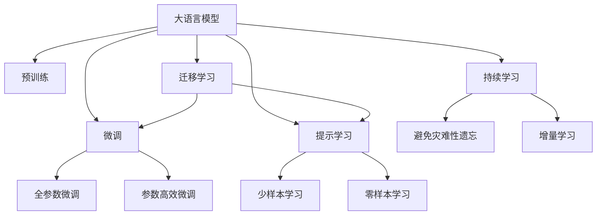
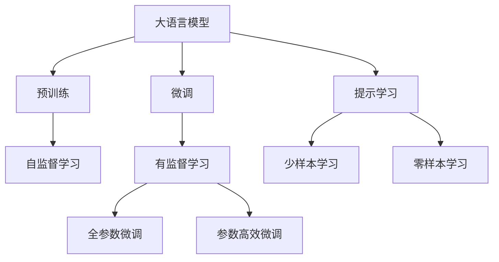
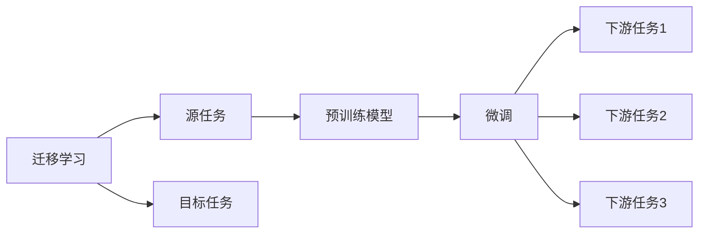
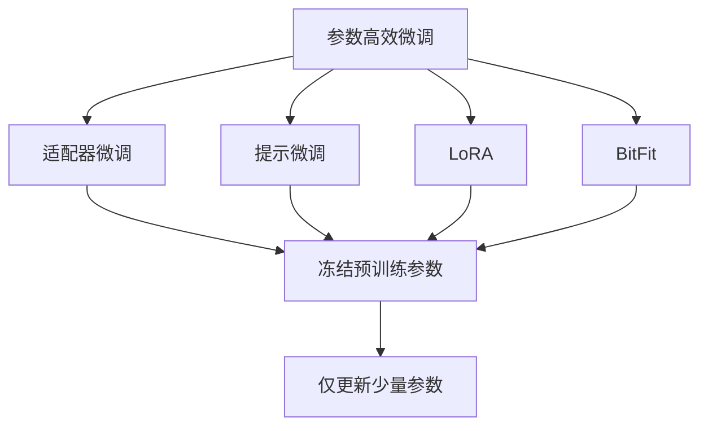
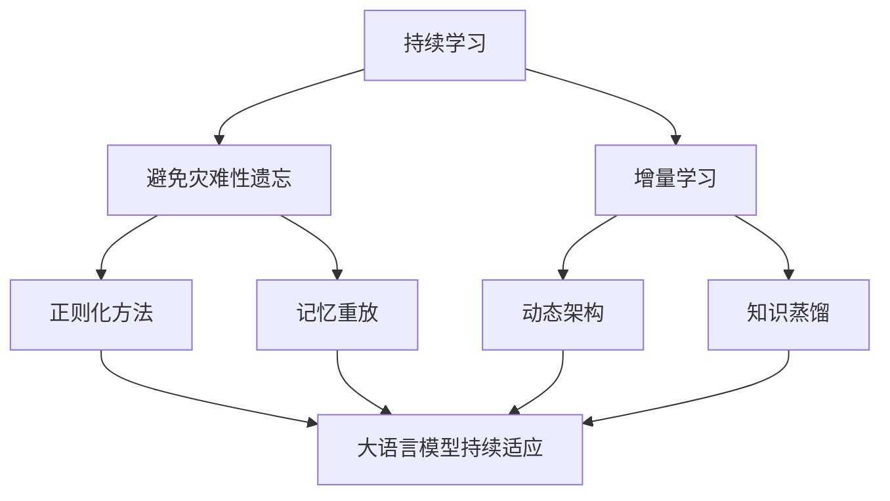
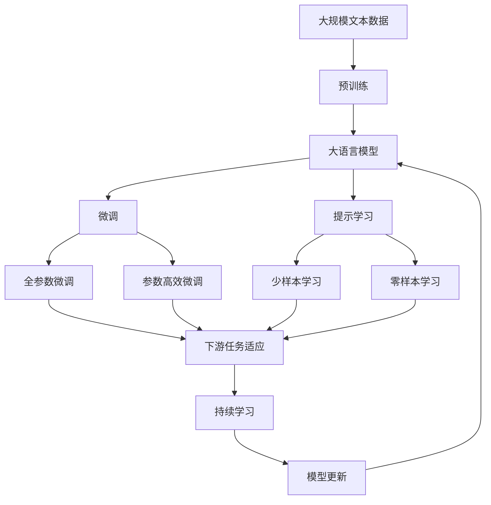

                 

# Transformer大模型实战 训练学生网络

> 关键词：Transformer,大模型,深度学习,自然语言处理,NLP

## 1. 背景介绍

### 1.1 问题由来
近年来，随着深度学习技术的快速发展，Transformer大模型在自然语言处理(NLP)领域取得了巨大的突破。这些大模型通过在大规模无标签文本数据上进行预训练，学习到了丰富的语言知识和常识，具备强大的语言理解和生成能力。通过在大规模无标签文本数据上进行预训练，Transformer大模型学习到了丰富的语言知识和常识，具备强大的语言理解和生成能力。

在大规模预训练的基础上，Transformer大模型可以通过微调(Fine-Tuning)来适应特定的下游任务，从而获得优异的性能。微调过程通常涉及将大模型的顶层参数进行调整，以适应特定的任务需求，而底层的预训练参数保持不变，以保留通用知识。

然而，尽管Transformer大模型在大规模语言任务上表现优异，但在实际应用中，训练学生网络（如自监督学习、迁移学习等）仍然是一个重要的研究方向。本文将详细介绍如何通过Transformer大模型训练学生网络，并介绍一些常用的训练技巧和应用场景。

### 1.2 问题核心关键点
本文将重点关注以下几个核心关键点：

- **Transformer大模型架构和预训练过程**：理解Transformer大模型的基本架构和预训练方法。
- **微调学生网络**：介绍如何通过微调Transformer大模型，适应特定的下游任务。
- **参数高效微调**：介绍一些参数高效微调的方法，减少微调过程中的计算成本。
- **实际应用场景**：展示Transformer大模型在各种应用场景中的表现。

### 1.3 问题研究意义
Transformer大模型训练学生网络的研究意义在于：

1. **提升模型性能**：通过微调，Transformer大模型能够更好地适应特定的下游任务，从而提升模型在实际应用中的性能。
2. **减少数据依赖**：相比于从头训练模型，微调能够使用更少的数据进行训练，从而降低数据获取成本。
3. **加速开发进程**：微调过程能够快速地将通用知识应用于特定的任务，加速模型的开发和部署。
4. **技术创新**：微调过程促进了对预训练和微调技术的深入研究，催生了新的研究方向，如参数高效微调和提示学习等。
5. **行业应用**：Transformer大模型训练学生网络的研究成果能够应用于各个行业，如金融、医疗、教育等，推动行业的数字化转型。

## 2. 核心概念与联系

### 2.1 核心概念概述

为更好地理解Transformer大模型训练学生网络的方法，本节将介绍几个密切相关的核心概念：

- **Transformer大模型**：以Transformer架构为基础的大规模预训练语言模型。通过在大规模无标签文本数据上进行自监督学习，Transformer大模型学习到了丰富的语言表示和语法知识。
- **自监督学习**：通过在大量无标签数据上进行训练，自动学习到数据中的结构和特征，从而提升模型的泛化能力。
- **微调(Fine-Tuning)**：在预训练模型的基础上，通过有标签数据进行有监督训练，优化模型在特定任务上的性能。
- **参数高效微调**：在微调过程中，只更新少量的模型参数，而固定大部分预训练权重不变，以提高微调效率。
- **提示学习(Prompt Learning)**：通过在输入文本中添加提示模板，引导模型进行特定的推理和生成，从而实现少样本学习。
- **少样本学习(Few-shot Learning)**：指模型在只有少量标注样本的情况下，能够快速适应新任务的学习能力。
- **零样本学习(Zero-shot Learning)**：指模型在没有见过任何特定任务的训练样本的情况下，仅凭任务描述就能够执行新任务。
- **迁移学习(Transfer Learning)**：指将一个领域学习到的知识，迁移应用到另一个不同但相关的领域的学习范式。

这些核心概念之间的逻辑关系可以通过以下Mermaid流程图来展示：



这个流程图展示了大语言模型的核心概念及其之间的关系：

1. 大语言模型通过预训练获得基础能力。
2. 微调是对预训练模型进行任务特定的优化，可以分为全参数微调和参数高效微调（PEFT）。
3. 提示学习是一种不更新模型参数的方法，可以实现少样本学习和零样本学习。
4. 迁移学习是连接预训练模型与下游任务的桥梁，可以通过微调或提示学习来实现。
5. 持续学习旨在使模型能够不断学习新知识，同时避免遗忘旧知识。

这些核心概念共同构成了Transformer大模型训练学生网络的完整生态系统。

### 2.2 概念间的关系

这些核心概念之间存在着紧密的联系，形成了Transformer大模型训练学生网络的完整生态系统。下面我们通过几个Mermaid流程图来展示这些概念之间的关系。

#### 2.2.1 大语言模型的学习范式



这个流程图展示了大语言模型的三种主要学习范式：预训练、微调和提示学习。预训练主要采用自监督学习方法，而微调则是有监督学习的过程。提示学习可以实现少样本学习和零样本学习。微调又可以分为全参数微调和参数高效微调两种方式。

#### 2.2.2 迁移学习与微调的关系



这个流程图展示了迁移学习的基本原理，以及它与微调的关系。迁移学习涉及源任务和目标任务，预训练模型在源任务上学习，然后通过微调适应各种下游任务（目标任务）。

#### 2.2.3 参数高效微调方法



这个流程图展示了几种常见的参数高效微调方法，包括适配器微调、提示微调、LoRA和BitFit。这些方法的共同特点是冻结大部分预训练参数，只更新少量参数，从而提高微调效率。

#### 2.2.4 持续学习在大语言模型中的应用



这个流程图展示了持续学习在大语言模型中的应用。持续学习的主要目标是避免灾难性遗忘和实现增量学习。通过正则化方法、记忆重放、动态架构和知识蒸馏等技术，可以使大语言模型持续适应新的任务和数据。

### 2.3 核心概念的整体架构

最后，我们用一个综合的流程图来展示这些核心概念在大语言模型训练学生网络过程中的整体架构：



这个综合流程图展示了从预训练到微调，再到持续学习的完整过程。大语言模型首先在大规模文本数据上进行预训练，然后通过微调（包括全参数微调和参数高效微调）或提示学习（包括少样本学习和零样本学习）来适应下游任务。最后，通过持续学习技术，模型可以不断更新和适应新的任务和数据。

## 3. 核心算法原理 & 具体操作步骤
### 3.1 算法原理概述

Transformer大模型训练学生网络，本质上是一个自监督学习过程。其核心思想是：通过在大规模无标签数据上进行自监督学习，自动学习到数据的结构和特征，从而提升模型的泛化能力。

形式化地，假设大语言模型为 $M_{\theta}$，其中 $\theta$ 为预训练得到的模型参数。给定大规模无标签数据集 $D=\{(x_i, y_i)\}_{i=1}^N$，自监督学习的目标是找到最优参数 $\hat{\theta}$，使得模型在数据集 $D$ 上的表现最好：

$$
\hat{\theta} = \mathop{\arg\min}_{\theta} \mathcal{L}(D, M_{\theta})
$$

其中 $\mathcal{L}$ 为损失函数，通常采用自监督学习任务（如掩码语言模型、next sentence prediction等）。通过反向传播算法，不断更新模型参数 $\theta$，最小化损失函数 $\mathcal{L}$，从而得到优化后的模型 $M_{\theta}$。

### 3.2 算法步骤详解

Transformer大模型训练学生网络一般包括以下几个关键步骤：

**Step 1: 准备预训练模型和数据集**
- 选择合适的预训练语言模型 $M_{\theta}$ 作为初始化参数，如BERT、GPT等。
- 准备大规模无标签数据集 $D=\{(x_i, y_i)\}_{i=1}^N$，其中 $x_i$ 为输入文本，$y_i$ 为自动生成的标签。

**Step 2: 设计自监督学习任务**
- 设计适合大语言模型的自监督学习任务，如掩码语言模型、next sentence prediction等。
- 根据任务设计损失函数 $\mathcal{L}(D, M_{\theta})$，通常采用交叉熵损失函数。

**Step 3: 设置自监督学习超参数**
- 选择合适的优化算法及其参数，如AdamW、SGD等，设置学习率、批大小、迭代轮数等。
- 设置正则化技术及强度，包括权重衰减、Dropout、Early Stopping等。

**Step 4: 执行自监督学习**
- 将无标签数据集 $D$ 分批次输入模型，前向传播计算损失函数。
- 反向传播计算参数梯度，根据设定的优化算法和学习率更新模型参数。
- 周期性在验证集上评估模型性能，根据性能指标决定是否触发 Early Stopping。
- 重复上述步骤直到满足预设的迭代轮数或 Early Stopping 条件。

**Step 5: 迁移学习与微调**
- 将训练好的大语言模型 $M_{\theta}$ 作为初始化参数，用于特定下游任务 $T$ 的微调。
- 准备下游任务的标注数据集 $D_T=\{(x_i, y_i)\}_{i=1}^M$，其中 $x_i$ 为输入文本，$y_i$ 为任务标签。
- 设计适合下游任务的输出层和损失函数，如分类任务使用交叉熵损失函数。
- 设置微调超参数，包括学习率、批大小、迭代轮数等。

**Step 6: 执行微调**
- 将下游任务数据集 $D_T$ 分批次输入模型，前向传播计算损失函数。
- 反向传播计算参数梯度，根据设定的优化算法和学习率更新模型参数。
- 周期性在验证集上评估模型性能，根据性能指标决定是否触发 Early Stopping。
- 重复上述步骤直到满足预设的迭代轮数或 Early Stopping 条件。

**Step 7: 测试和部署**
- 在测试集上评估微调后模型 $M_{\hat{\theta}}$ 的性能，对比微调前后的精度提升。
- 使用微调后的模型对新样本进行推理预测，集成到实际的应用系统中。
- 持续收集新的数据，定期重新微调模型，以适应数据分布的变化。

以上是Transformer大模型训练学生网络的一般流程。在实际应用中，还需要针对具体任务的特点，对自监督学习和微调过程的各个环节进行优化设计，如改进训练目标函数，引入更多的正则化技术，搜索最优的超参数组合等，以进一步提升模型性能。

### 3.3 算法优缺点

Transformer大模型训练学生网络具有以下优点：

1. **简单高效**：相比于从头训练模型，自监督学习需要的数据量较少，计算成本较低，且能够自动学习到数据的结构和特征，提升模型的泛化能力。
2. **通用适用**：自监督学习任务设计简单，适用于各种NLP下游任务，设计简单的输出层即可实现微调。
3. **参数高效**：利用参数高效微调技术，在固定大部分预训练参数的情况下，仍可取得不错的微调效果。
4. **效果显著**：在学术界和工业界的诸多任务上，自监督学习和微调方法已经刷新了最先进的性能指标。

同时，该方法也存在一定的局限性：

1. **依赖数据质量**：自监督学习的效果很大程度上取决于数据的质量和数量，获取高质量无标签数据的成本较高。
2. **迁移能力有限**：当自监督学习任务与目标任务差异较大时，模型的迁移能力有限。
3. **可解释性不足**：自监督学习模型通常缺乏可解释性，难以对其推理逻辑进行分析和调试。
4. **鲁棒性不足**：自监督学习模型面对域外数据时，泛化性能往往大打折扣。

尽管存在这些局限性，但就目前而言，自监督学习和微调方法仍然是大语言模型训练学生网络的主流范式。未来相关研究的重点在于如何进一步降低对标注数据的依赖，提高模型的少样本学习和跨领域迁移能力，同时兼顾可解释性和鲁棒性等因素。

### 3.4 算法应用领域

Transformer大模型训练学生网络已经在NLP领域得到了广泛的应用，覆盖了几乎所有常见任务，例如：

- 文本分类：如情感分析、主题分类、意图识别等。通过自动学习文本-标签映射，提升模型对特定主题的识别能力。
- 命名实体识别：识别文本中的人名、地名、机构名等特定实体。通过学习实体边界和类型，提升模型对实体的识别和分类能力。
- 关系抽取：从文本中抽取实体之间的语义关系。通过学习实体-关系三元组，提升模型对关系的识别和抽取能力。
- 问答系统：对自然语言问题给出答案。通过学习问题和答案的映射关系，提升模型对问答任务的响应能力。
- 机器翻译：将源语言文本翻译成目标语言。通过学习语言-语言映射，提升模型的翻译质量。
- 文本摘要：将长文本压缩成简短摘要。通过学习文本的关键信息，提升模型的摘要生成能力。
- 对话系统：使机器能够与人自然对话。通过学习对话历史和上下文信息，提升模型的回复生成能力。

除了上述这些经典任务外，Transformer大模型训练学生网络也被创新性地应用到更多场景中，如可控文本生成、常识推理、代码生成、数据增强等，为NLP技术带来了全新的突破。随着自监督学习和微调方法的不断进步，相信NLP技术将在更广阔的应用领域大放异彩。

## 4. 数学模型和公式 & 详细讲解 & 举例说明

### 4.1 数学模型构建

本节将使用数学语言对Transformer大模型训练学生网络的过程进行更加严格的刻画。

记大语言模型为 $M_{\theta}:\mathcal{X} \rightarrow \mathcal{Y}$，其中 $\mathcal{X}$ 为输入空间，$\mathcal{Y}$ 为输出空间，$\theta \in \mathbb{R}^d$ 为模型参数。假设自监督学习任务为 $S$，损失函数为 $\mathcal{L}_S(D, M_{\theta})$，则自监督学习的优化目标是最小化损失函数：

$$
\hat{\theta} = \mathop{\arg\min}_{\theta} \mathcal{L}_S(D, M_{\theta})
$$

在实践中，我们通常使用基于梯度的优化算法（如SGD、Adam等）来近似求解上述最优化问题。设 $\eta$ 为学习率，$\lambda$ 为正则化系数，则参数的更新公式为：

$$
\theta \leftarrow \theta - \eta \nabla_{\theta}\mathcal{L}_S(D, M_{\theta}) - \eta\lambda\theta
$$

其中 $\nabla_{\theta}\mathcal{L}_S(D, M_{\theta})$ 为损失函数对参数 $\theta$ 的梯度，可通过反向传播算法高效计算。

### 4.2 公式推导过程

以下我们以掩码语言模型为例，推导自监督学习的损失函数及其梯度的计算公式。

假设模型 $M_{\theta}$ 在输入 $x$ 上的输出为 $\hat{x}=M_{\theta}(x) \in [0,1]$，表示模型对输入 $x$ 的概率分布预测。自监督学习任务 $S$ 为掩码语言模型，其中 $\mathcal{X}$ 为输入空间，$\mathcal{Y}$ 为输出空间，$\theta \in \mathbb{R}^d$ 为模型参数。自监督学习的损失函数定义为：

$$
\mathcal{L}_S(D, M_{\theta}) = \frac{1}{N}\sum_{i=1}^N \sum_{j=1}^M -y_j \log \hat{y}_j
$$

其中 $y_j$ 为掩码位置的真实标签，$\hat{y}_j$ 为模型对掩码位置的预测概率。

根据链式法则，损失函数对参数 $\theta_k$ 的梯度为：

$$
\frac{\partial \mathcal{L}_S(D, M_{\theta})}{\partial \theta_k} = -\frac{1}{N}\sum_{i=1}^N \sum_{j=1}^M \frac{y_j}{\hat{y}_j} \frac{\partial \hat{y}_j}{\partial \theta_k}
$$

其中 $\frac{\partial \hat{y}_j}{\partial \theta_k}$ 可进一步递归展开，利用自动微分技术完成计算。

在得到损失函数的梯度后，即可带入参数更新公式，完成模型的迭代优化。重复上述过程直至收敛，最终得到适应自监督学习任务的最优模型参数 $\theta^*$。

## 5. 项目实践：代码实例和详细解释说明
### 5.1 开发环境搭建

在进行Transformer大模型训练学生网络实践前，我们需要准备好开发环境。以下是使用Python进行PyTorch开发的环境配置流程：

1. 安装Anaconda：从官网下载并安装Anaconda，用于创建独立的Python环境。

2. 创建并激活虚拟环境：
```bash
conda create -n pytorch-env python=3.8 
conda activate pytorch-env
```

3. 安装PyTorch：根据CUDA版本，从官网获取对应的安装命令。例如：
```bash
conda install pytorch torchvision torchaudio cudatoolkit=11.1 -c pytorch -c conda-forge
```

4. 安装Transformers库：
```bash
pip install transformers
```

5. 安装各类工具包：
```bash
pip install numpy pandas scikit-learn matplotlib tqdm jupyter notebook ipython
```

完成上述步骤后，即可在`pytorch-env`环境中开始Transformer大模型训练学生网络的实践。

### 5.2 源代码详细实现

这里我们以BERT模型进行自监督学习为例，给出使用Transformers库的PyTorch代码实现。

首先，定义自监督学习任务的数据处理函数：

```python
from transformers import BertTokenizer
from torch.utils.data import Dataset
import torch

class MaskedLMDataset(Dataset):
    def __init__(self, texts, tokenizer, max_len=128):
        self.texts = texts
        self.tokenizer = tokenizer
        self.max_len = max_len
        
    def __len__(self):
        return len(self.texts)
    
    def __getitem__(self, item):
        text = self.texts[item]
        
        encoding = self.tokenizer(text, return_tensors='pt', max_length=self.max_len, padding='max_length', truncation=True)
        input_ids = encoding['input_ids'][0]
        attention_mask = encoding['attention_mask'][0]
        
        # 掩码位置
        masked_token_index = torch.randint(0, input_ids.shape[1], (input_ids.shape[0],))
        masked_token_index = masked_token_index.masked_select((torch.rand(input_ids.shape[0]) < 0.15).long())
        
        # 填充掩码
        masked_token_index = torch.cat([torch.zeros(max_len, dtype=torch.long), masked_token_index])
        input_ids = torch.cat([input_ids, torch.zeros(max_len, dtype=torch.long)], dim=1)
        attention_mask = torch.cat([attention_mask, torch.zeros(max_len, dtype=torch.long)], dim=1)
        masked_token_index = torch.cat([masked_token_index, torch.zeros(max_len, dtype=torch.long)], dim=1)
        
        return {'input_ids': input_ids, 
                'attention_mask': attention_mask,
                'labels': masked_token_index}

# 创建dataset
tokenizer = BertTokenizer.from_pretrained('bert-base-cased')

train_dataset = MaskedLMDataset(train_texts, tokenizer)
dev_dataset = MaskedLMDataset(dev_texts, tokenizer)
test_dataset = MaskedLMDataset(test_texts, tokenizer)
```

然后，定义模型和优化器：

```python
from transformers import BertForMaskedLM, AdamW

model = BertForMaskedLM.from_pretrained('bert-base-cased')

optimizer = AdamW(model.parameters(), lr=2e-5)
```

接着，定义训练和评估函数：

```python
from torch.utils.data import DataLoader
from tqdm import tqdm
from sklearn.metrics import classification_report

device = torch.device('cuda') if torch.cuda.is_available() else torch.device('cpu')
model.to(device)

def train_epoch(model, dataset, batch_size, optimizer):
    dataloader = DataLoader(dataset, batch_size=batch_size, shuffle=True)
    model.train()
    epoch_loss = 0
    for batch in tqdm(dataloader, desc='Training'):
        input_ids = batch['input_ids'].to(device)
        attention_mask = batch['attention_mask'].to(device)
        labels = batch['labels'].to(device)
        model.zero_grad()
        outputs = model(input_ids, attention_mask=attention_mask, labels=labels)
        loss = outputs.loss
        epoch_loss += loss.item()
        loss.backward()
        optimizer.step()
    return epoch_loss / len(dataloader)

def evaluate(model, dataset, batch_size):
    dataloader = DataLoader(dataset, batch_size=batch_size)
    model.eval()
    preds, labels = [], []
    with torch.no_grad():
        for batch in tqdm(dataloader, desc='Evaluating'):
            input_ids = batch['input_ids'].to(device)
            attention_mask = batch['attention_mask'].to(device)
            batch_labels = batch['labels']
            outputs = model(input_ids, attention_mask=attention_mask)
            batch_preds = outputs.logits.argmax(dim=2).to('cpu').tolist()
            batch_labels = batch_labels.to('cpu').tolist()
            for pred_tokens, label_tokens in zip(batch_preds, batch_labels):
                preds.append(pred_tokens[:len(label_tokens)])
                labels.append(label_tokens)
                
    print(classification_report(labels, preds))
```

最后，启动训练流程并在测试集上评估：

```python
epochs = 5
batch_size = 16

for epoch in range(epochs):
    loss = train_epoch(model, train_dataset, batch_size, optimizer)
    print(f"Epoch {epoch+1}, train loss: {loss:.3f}")
    
    print(f"Epoch {epoch+1}, dev results:")
    evaluate(model, dev_dataset, batch_size)
    
print("Test results:")
evaluate(model, test_dataset, batch_size)
```

以上就是使用PyTorch对BERT进行自监督学习（掩码语言模型）的完整代码实现。可以看到，得益于Transformers库的强大封装，我们可以用相对简洁的代码完成BERT模型的加载和自监督学习。

### 5.3 代码解读与分析

让我们再详细解读一下关键代码的实现细节：

**MaskedLMDataset类**：
- `__init__`方法：初始化文本、分词器等关键组件。
- `__len__`方法：返回数据集的样本数量。
- `__getitem__`方法：对单个样本进行处理，将文本输入编码为token ids，并生成掩码位置，最终返回模型所需的输入。

**训练和评估函数**：
- 使用PyTorch的DataLoader对数据集进行批次化加载，供模型训练和推理使用

