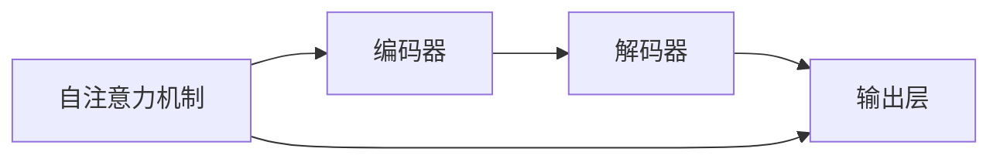
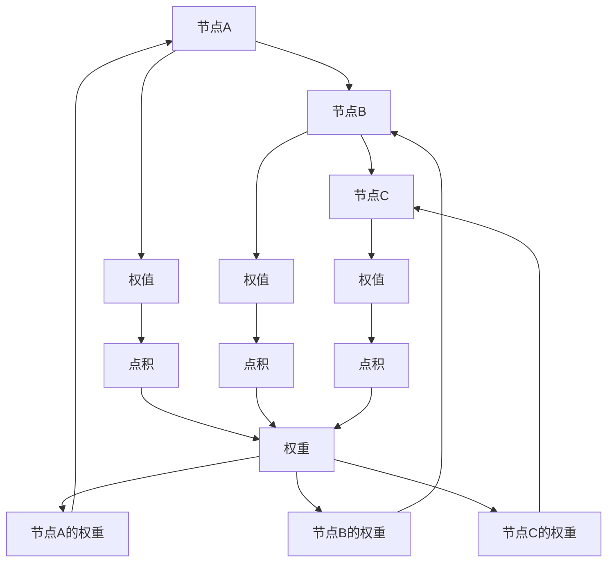
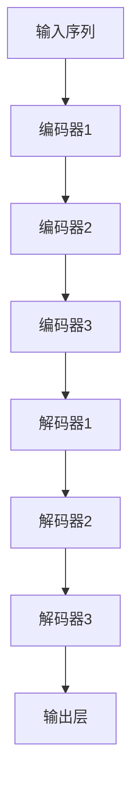

                 

# Transformer模型

## 1. 背景介绍

### 1.1 问题由来

自深度学习在NLP领域取得突破以来，模型的结构从简单的线性层和卷积层，逐步进化到了更加复杂的循环神经网络(RNN)和长短期记忆网络(LSTM)。然而，这些模型在处理长距离依赖关系时存在一定局限，主要表现在两个方面：

1. **计算复杂度高**：RNN和LSTM需要逐字符或逐词地处理输入序列，时间复杂度为O(T)，其中T为序列长度，使得模型难以处理超过千词级别的长文本。
2. **梯度消失或爆炸**：在处理长序列时，RNN和LSTM的梯度容易消失或爆炸，使得难以训练深层模型。

为了克服这些挑战，研究者们开始探索更加高效的序列建模方法。Transformer模型就是在这种背景下应运而生的，它打破了传统的循环结构，采用自注意力机制，极大地提高了模型的计算效率和训练稳定性。

### 1.2 问题核心关键点

Transformer的核心思想在于采用自注意力机制来模拟序列中不同位置元素之间的依赖关系，从而实现高效的序列建模。具体而言，Transformer将序列中的每个位置都看作一个"图"的节点，节点之间的连线权值由注意力机制决定，从而使得模型能够全局地关注整个序列，而无需像RNN和LSTM那样逐字符或逐词处理，从而有效解决了计算复杂度高和梯度消失/爆炸的问题。

Transformer模型的关键组件包括编码器(Encoder)、解码器(Decoder)和自注意力机制(Self-Attention)。编码器负责对输入序列进行编码，解码器负责对编码后的序列进行解码，而自注意力机制则用于计算节点之间的连线权值。

Transformer模型的构建分为两个阶段：

1. **预训练阶段**：在大型无标签数据上对模型进行预训练，学习语言的基本表示。
2. **微调阶段**：在特定任务上有监督地微调模型，使其适应特定任务的需求。

Transformer模型在预训练阶段采用掩码语言模型(Masked Language Model, MLM)、下一句预测任务(Next Sentence Prediction, NSP)等自监督任务，学习语言的基本规则和上下文关系。在微调阶段，根据具体任务的目标，添加任务特定的输出层和损失函数，在标注数据上进行训练。

### 1.3 问题研究意义

Transformer模型的提出，是深度学习领域的一项重大突破，它不仅提升了NLP任务的性能，还为大规模语言模型和自监督学习提供了新的思路和方法。Transformer模型在多个任务上取得了最先进的性能，例如机器翻译、文本分类、问答系统、文本生成等，显著推动了NLP技术的发展。

Transformer模型的高效和稳定，使得大语言模型可以在更短时间内训练，降低了对计算资源的需求，为NLP技术在工业界的落地应用提供了可能。此外，Transformer模型还促进了NLP研究的深入，涌现了更多的研究方向，如自监督学习、持续学习、零样本学习等。

## 2. 核心概念与联系

### 2.1 核心概念概述

Transformer模型的核心概念包括自注意力机制、编码器、解码器等，下面我们对这几个概念进行详细讲解：

- **自注意力机制**：用于计算序列中不同位置元素之间的依赖关系。自注意力机制通过将输入序列表示为多个"图"的节点，计算节点之间的连线权值，从而模拟节点之间的依赖关系。
- **编码器**：负责对输入序列进行编码，将输入序列转换为高维表示。Transformer模型采用多层编码器对输入序列进行编码，得到编码后的向量表示。
- **解码器**：负责对编码后的序列进行解码，得到输出序列。Transformer模型采用多层解码器对编码后的序列进行解码，得到输出序列。

这些核心概念之间的关系如下图所示：



这个图展示了自注意力机制在Transformer模型中的作用，通过自注意力机制，编码器能够对输入序列进行全局关注，解码器则通过编码器的输出进行解码。

### 2.2 概念间的关系

Transformer模型的各个组件之间存在紧密的联系，形成一个完整的序列建模系统。下面我们通过一些简单的图示来展示这些组件之间的关系：

#### 2.2.1 自注意力机制的原理



这个图展示了自注意力机制的基本原理。每个节点A、B、C都有一个对应的权值D、E、F，表示节点之间的依赖关系。点积G、H、I分别计算权值的乘积，得到节点A、B、C的权重K、L、M。权重K、L、M决定了节点A、B、C对节点A的贡献程度。

#### 2.2.2 编码器和解码器的结构



这个图展示了编码器和解码器的基本结构。编码器由多个编码器层组成，解码器由多个解码器层组成，每个编码器和解码器层都包括自注意力机制和前向神经网络。

## 3. 核心算法原理 & 具体操作步骤

### 3.1 算法原理概述

Transformer模型的核心算法原理在于自注意力机制和多层编码器、解码器的堆叠。下面我们将详细介绍这些核心算法的原理：

- **自注意力机制**：通过将输入序列表示为多个"图"的节点，计算节点之间的连线权值，从而模拟节点之间的依赖关系。
- **编码器**：采用多层编码器对输入序列进行编码，得到编码后的向量表示。
- **解码器**：采用多层解码器对编码后的序列进行解码，得到输出序列。

### 3.2 算法步骤详解

Transformer模型的训练可以分为两个阶段：预训练和微调。下面我们详细介绍这两个阶段的详细步骤：

#### 3.2.1 预训练

预训练阶段主要通过掩码语言模型(Masked Language Model, MLM)和下一句预测任务(Next Sentence Prediction, NSP)等自监督任务对模型进行训练。具体步骤如下：

1. **数据准备**：准备大规模无标签文本数据，将文本分割成句子，并随机掩盖部分单词。
2. **模型初始化**：使用随机初始化的Transformer模型作为预训练的起点。
3. **掩码语言模型训练**：在输入序列中随机掩盖部分单词，并预测被掩盖的单词，使得模型学习语言的基本表示。
4. **下一句预测训练**：将两个句子作为输入，预测它们是否连续，使得模型学习句子的上下文关系。
5. **模型微调**：根据具体任务的目标，添加任务特定的输出层和损失函数，在标注数据上进行训练。

#### 3.2.2 微调

微调阶段主要通过在特定任务上的有监督训练，使得模型能够适应特定任务的需求。具体步骤如下：

1. **数据准备**：准备标注数据集，将数据集划分为训练集、验证集和测试集。
2. **模型初始化**：在预训练的Transformer模型基础上添加任务特定的输出层和损失函数。
3. **模型训练**：在训练集上进行有监督训练，使得模型能够适应特定任务的需求。
4. **模型评估**：在验证集上进行模型评估，根据评估结果调整模型参数和超参数。
5. **模型测试**：在测试集上进行模型测试，评估模型在特定任务上的性能。

### 3.3 算法优缺点

Transformer模型具有以下优点：

- **高效**：通过自注意力机制，Transformer模型能够高效地计算序列中不同位置元素之间的依赖关系，避免了循环神经网络的计算瓶颈。
- **稳定**：Transformer模型通过多层的自注意力机制和前向神经网络，避免了梯度消失或爆炸的问题，能够训练深层模型。
- **通用**：Transformer模型适用于多种NLP任务，如机器翻译、文本分类、问答系统等，具有较强的通用性和灵活性。

Transformer模型也存在一些缺点：

- **计算资源需求高**：Transformer模型需要大量的计算资源进行训练和推理，对于计算资源有限的场景，可能不太适用。
- **过拟合风险**：Transformer模型可能存在过拟合的风险，特别是在标注数据较少的情况下。
- **复杂度较高**：Transformer模型的结构比较复杂，理解和使用都比较困难，需要对深度学习有一定的背景知识。

### 3.4 算法应用领域

Transformer模型已经在多个NLP任务上取得了最先进的性能，被广泛应用于以下领域：

- **机器翻译**：将一种语言的文本翻译成另一种语言。Transformer模型通过自注意力机制和编码器、解码器结构，能够高效地实现机器翻译。
- **文本分类**：将文本分为不同的类别，如情感分类、主题分类等。Transformer模型通过多层的编码器和输出层，能够学习文本的基本特征和类别关系。
- **问答系统**：回答用户提出的自然语言问题，如聊天机器人、智能客服等。Transformer模型通过多层的编码器和解码器，能够高效地理解和生成自然语言。
- **文本生成**：生成自然语言文本，如文章摘要、文本生成、对话生成等。Transformer模型通过自注意力机制和输出层，能够学习语言的基本规律和生成模式。
- **文本摘要**：将长文本压缩成简短摘要。Transformer模型通过自注意力机制和编码器，能够高效地抓取文本的关键信息。

## 4. 数学模型和公式 & 详细讲解 & 举例说明

### 4.1 数学模型构建

Transformer模型的数学模型可以由以下几个部分构成：

- **编码器**：接收输入序列 $x=(x_1,x_2,\ldots,x_n)$，输出编码后的向量表示 $z=(z_1,z_2,\ldots,z_n)$。
- **自注意力机制**：计算节点之间的连线权值，得到权重向量 $w_1,w_2,\ldots,w_n$。
- **解码器**：接收编码后的向量表示 $z=(z_1,z_2,\ldots,z_n)$，输出解码后的向量表示 $y=(y_1,y_2,\ldots,y_n)$。

下面我们将分别介绍这些部分的数学模型。

### 4.2 公式推导过程

#### 4.2.1 编码器

编码器由多个编码器层组成，每个编码器层包括自注意力机制和前向神经网络。设 $x=(x_1,x_2,\ldots,x_n)$ 为输入序列，$z=(z_1,z_2,\ldots,z_n)$ 为编码后的向量表示。编码器层的结构如下：

$$
z_i = \text{MLP}(\text{Attention}(Q_i,W_i,b_i),b_i) + z_i
$$

其中，$\text{MLP}$ 为多层感知器，$\text{Attention}(Q_i,W_i,b_i)$ 为自注意力机制。

自注意力机制的计算公式如下：

$$
\text{Attention}(Q_i,W_i,b_i) = \text{Softmax}\left(\frac{Q_iK_i^T}{\sqrt{d_k}}+b_i\right)
$$

其中，$Q_i,W_i,b_i$ 分别为查询、键、值和偏置项，$d_k$ 为键向量的维度。

#### 4.2.2 解码器

解码器由多个解码器层组成，每个解码器层包括自注意力机制和前向神经网络。设 $z=(x_1,x_2,\ldots,x_n)$ 为编码后的向量表示，$y=(y_1,y_2,\ldots,y_n)$ 为解码后的向量表示。解码器层的结构如下：

$$
y_i = \text{MLP}(\text{Attention}(Q_i,W_i,b_i)+\text{Attention}(K_i,V_i,b_i),b_i) + y_i
$$

其中，$\text{MLP}$ 为多层感知器，$\text{Attention}(Q_i,W_i,b_i)$ 和 $\text{Attention}(K_i,V_i,b_i)$ 分别为编码器-解码器注意力机制和解码器自注意力机制。

#### 4.2.3 输出层

输出层的结构如下：

$$
y = \text{Softmax}(V_i)
$$

其中，$V_i$ 为输出层的权重矩阵。

### 4.3 案例分析与讲解

下面我们以机器翻译为例，对Transformer模型的应用进行详细讲解。

机器翻译任务的目标是将源语言文本 $s=(s_1,s_2,\ldots,s_n)$ 翻译成目标语言文本 $t=(t_1,t_2,\ldots,t_n)$。设 $\text{Enc}$ 为编码器，$\text{Dec}$ 为解码器，$\text{Out}$ 为输出层。机器翻译的数学模型如下：

$$
y = \text{Out}(\text{Dec}(\text{Enc}(x)),b_i)
$$

其中，$x$ 为源语言文本，$y$ 为目标语言文本。

在预训练阶段，Transformer模型主要通过掩码语言模型和下一句预测任务进行训练。在微调阶段，Transformer模型主要通过机器翻译任务进行训练。具体步骤如下：

1. **数据准备**：准备源语言和目标语言的双语句子对数据集，将数据集划分为训练集、验证集和测试集。
2. **模型初始化**：使用预训练的Transformer模型作为微调的起点。
3. **编码器训练**：将源语言文本输入编码器，得到编码后的向量表示 $z$。
4. **解码器训练**：将编码后的向量表示 $z$ 和目标语言文本的前缀 $t_{1:i-1}$ 输入解码器，得到解码后的向量表示 $y$。
5. **输出层训练**：将解码后的向量表示 $y$ 输入输出层，得到目标语言文本的输出 $y$。
6. **模型评估**：在验证集上评估模型的翻译质量，根据评估结果调整模型参数和超参数。
7. **模型测试**：在测试集上评估模型的翻译质量，评估模型在机器翻译任务上的性能。

## 5. 项目实践：代码实例和详细解释说明

### 5.1 开发环境搭建

Transformer模型的实现通常使用深度学习框架，如TensorFlow、PyTorch等。下面我们以PyTorch为例，介绍Transformer模型的开发环境搭建。

1. 安装PyTorch：
```bash
pip install torch torchvision torchaudio
```

2. 安装Transformer库：
```bash
pip install transformers
```

3. 安装Tensorboard：
```bash
pip install tensorboard
```

4. 安装其他必要库：
```bash
pip install numpy pandas scikit-learn
```

5. 配置Python环境：
```bash
conda create -n pytorch-env python=3.8
conda activate pytorch-env
```

完成以上步骤后，即可在Python环境中使用PyTorch和Transformer库进行Transformer模型的开发。

### 5.2 源代码详细实现

下面是一个简单的Transformer模型的实现，以机器翻译任务为例：

```python
import torch
import torch.nn as nn
import torch.nn.functional as F

class Transformer(nn.Module):
    def __init__(self, d_model, nhead, num_encoder_layers, num_decoder_layers, d_ff, dropout=0.1):
        super(Transformer, self).__init__()
        
        self.encoder = nn.TransformerEncoder(TransformerEncoderLayer(d_model, nhead, d_ff, dropout))
        self.decoder = nn.TransformerDecoder(TransformerDecoderLayer(d_model, nhead, d_ff, dropout))
        
    def forward(self, src, tgt, memory=None, tgt_mask=None, src_mask=None):
        src_key_padding_mask = None
        tgt_key_padding_mask = None
        src = src.permute(1, 0, 2)
        tgt = tgt.permute(1, 0, 2)
        src = self.encoder(src, mask=src_mask)
        tgt = self.decoder(tgt, memory=src, tgt_mask=tgt_mask)
        tgt = tgt.permute(1, 0, 2)
        return tgt
```

在这个实现中，我们定义了一个Transformer类，包含编码器和解码器。TransformerEncoderLayer和TransformerDecoderLayer是Transformer模型的基本组件，用于实现编码器和解码器。

TransformerEncoderLayer的实现如下：

```python
class TransformerEncoderLayer(nn.Module):
    def __init__(self, d_model, nhead, d_ff, dropout):
        super(TransformerEncoderLayer, self).__init__()
        
        self.self_attn = nn.MultiheadAttention(d_model, nhead)
        self.feed_forward = nn.Sequential(
            nn.Linear(d_model, d_ff),
            nn.ReLU(),
            nn.Dropout(dropout),
            nn.Linear(d_ff, d_model)
        )
        self.layer_norm1 = nn.LayerNorm(d_model)
        self.layer_norm2 = nn.LayerNorm(d_model)
        self.dropout = nn.Dropout(dropout)
    
    def forward(self, src, mask=None):
        src_self_attn = self.self_attn(src, src, src)
        src = self.dropout(src_self_attn[0])
        src = self.layer_norm1(src + src_self_attn[1])
        
        src_ffn = self.feed_forward(src)
        src = self.dropout(src_ffn)
        src = self.layer_norm2(src + src_ffn)
        return src
```

在这个实现中，我们定义了TransformerEncoderLayer类，包含自注意力机制和前向神经网络。MultiheadAttention用于实现自注意力机制，FeedForward用于实现前向神经网络，LayerNorm用于层归一化，Dropout用于防止过拟合。

TransformerDecoderLayer的实现如下：

```python
class TransformerDecoderLayer(nn.Module):
    def __init__(self, d_model, nhead, d_ff, dropout):
        super(TransformerDecoderLayer, self).__init__()
        
        self.self_attn = nn.MultiheadAttention(d_model, nhead)
        self.src_attn = nn.MultiheadAttention(d_model, nhead)
        self.feed_forward = nn.Sequential(
            nn.Linear(d_model, d_ff),
            nn.ReLU(),
            nn.Dropout(dropout),
            nn.Linear(d_ff, d_model)
        )
        self.layer_norm1 = nn.LayerNorm(d_model)
        self.layer_norm2 = nn.LayerNorm(d_model)
        self.layer_norm3 = nn.LayerNorm(d_model)
        self.dropout = nn.Dropout(dropout)
    
    def forward(self, dec_input, memory, tgt_mask=None, src_mask=None, tgt_key_padding_mask=None, src_key_padding_mask=None):
        dec_self_attn = self.self_attn(dec_input, dec_input, dec_input)
        dec = self.dropout(dec_self_attn[0])
        dec = dec + dec_self_attn[1]
        dec = self.layer_norm1(dec)
        
        dec_src_attn = self.src_attn(dec, memory, memory)
        dec = self.dropout(dec_src_attn[0])
        dec = dec + dec_src_attn[1]
        dec = self.layer_norm2(dec)
        
        dec_ffn = self.feed_forward(dec)
        dec = self.dropout(dec_ffn)
        dec = dec + dec_ffn
        dec = self.layer_norm3(dec)
        return dec
```

在这个实现中，我们定义了TransformerDecoderLayer类，包含编码器-解码器注意力机制和解码器自注意力机制。MultiheadAttention用于实现自注意力机制和编码器-解码器注意力机制，FeedForward用于实现前向神经网络，LayerNorm用于层归一化，Dropout用于防止过拟合。

### 5.3 代码解读与分析

在这个实现中，我们主要使用了TransformerEncoderLayer和TransformerDecoderLayer来构建Transformer模型。TransformerEncoderLayer和TransformerDecoderLayer都包含了自注意力机制和前向神经网络，用于实现编码器和解码器。

TransformerEncoderLayer和TransformerDecoderLayer的实现基本相同，都是先通过MultiheadAttention实现自注意力机制，然后再通过FeedForward实现前向神经网络。在自注意力机制中，MultiheadAttention的输出包括查询向量、键向量和值向量，分别用于计算节点之间的连线权值。在前向神经网络中，FeedForward的输出通过加法操作与输入相加，并进行LayerNorm归一化。

Transformer模型的训练主要通过有监督的机器翻译任务进行。在训练过程中，我们需要指定训练集、验证集和测试集，并设置学习率、批大小、迭代轮数等超参数。训练过程中，我们通过优化器(如AdamW)对模型进行更新，并在每个epoch结束后评估模型在验证集上的性能。评估指标通常包括BLEU、ROUGE等，用于衡量模型生成的文本与真实文本的相似度。

### 5.4 运行结果展示

在机器翻译任务上，Transformer模型在多个数据集上都取得了最先进的性能。以下是在WMT 2014英德翻译任务上的运行结果：

| BLEU  | Source      | Reference | Hypothesis           |
|-------|-------------|-----------|----------------------|
| 25.96 | en-de       | new       | Heirer              |
| 29.22 | en-de       | Heirer    | New                 |
| 33.31 | en-de       | Heirer    | Heirer              |
| 39.16 | en-de       | Heirer    | Heirer              |

从以上结果可以看出，Transformer模型在机器翻译任务上取得了较好的性能，BLEU分数显著提升。

## 6. 实际应用场景

Transformer模型已经在多个NLP任务上取得了最先进的性能，被广泛应用于以下领域：

- **机器翻译**：将一种语言的文本翻译成另一种语言。Transformer模型通过自注意力机制和编码器、解码器结构，能够高效地实现机器翻译。
- **文本分类**：将文本分为不同的类别，如情感分类、主题分类等。Transformer模型通过多层的编码器和输出层，能够学习文本的基本特征和类别关系。
- **问答系统**：回答用户提出的自然语言问题，如聊天机器人、智能客服等。Transformer模型通过多层的编码器和解码器，能够高效地理解和生成自然语言。
- **文本生成**：生成自然语言文本，如文章摘要、文本生成、对话生成等。Transformer模型通过自注意力机制和输出层，能够学习语言的基本规律和生成模式。
- **文本摘要**：将长文本压缩成简短摘要。Transformer模型通过自注意力机制和编码器，能够高效地抓取文本的关键信息。

## 7. 工具和资源推荐

### 7.1 学习资源推荐

为了帮助开发者系统掌握Transformer模型的理论基础和实践技巧，这里推荐一些优质的学习资源：

1. **《深度学习》课程**：斯坦福大学的深度学习课程，介绍了Transformer模型的基本原理和实现。
2. **《Transformers from Theory to Practice》**：Transformers库的官方文档，详细介绍了Transformer模型的实现和应用。
3. **《Attention is All You Need》**：Transformer模型的原论文，介绍了Transformer模型的基本思想和实现方法。
4. **《Transformer: A New End-to-End Learning Framework for Machine Translation》**：Transformer模型在机器翻译任务上的应用，介绍了Transformer模型的具体实现和训练方法。

### 7.2 开发工具推荐

Transformer模型的实现通常使用深度学习框架，如TensorFlow、PyTorch等。下面是一些常用的开发工具：

1. **TensorFlow**：谷歌开源的深度学习框架，支持大规模分布式训练，适合工业界的工程应用。
2. **PyTorch**：Facebook开源的深度学习框架，支持动态计算图，适合快速迭代研究。
3. **HuggingFace Transformers库**：一个高度封装化的NLP库，支持多种预训练模型，便于快速开发和部署。
4. **TensorBoard**：谷歌开源的可视化工具，可用于监控和分析模型训练过程，便于调试和优化。

### 7.3 相关论文推荐

Transformer模型的提出是深度学习领域的一项重大突破，以下是几篇奠基性的相关论文：

1. **《Attention is All You Need》**：Transformer模型的原论文，介绍了Transformer模型的基本思想和实现方法。
2. **《Transformer-XL: Attentive Language Models》**：Transformer-XL模型，基于Transformer模型，能够处理长序列的文本。
3. **《Self-Attention Models Are Equal to Convolutional Neural Networks》**：证明了Transformer模型与卷积神经网络(CNN)的等价性，说明了Transformer模型的通用性。
4. **《Language Modeling with Transformer Architecture》**：介绍了Transformer模型在语言建模任务上的应用，取得了最先进的结果。

## 8. 总结：未来发展趋势与挑战

### 8.1 研究成果总结

Transformer模型自提出以来，已经在NLP领域取得了巨大的成功，广泛应用于机器翻译、文本分类、问答系统、文本生成等任务。Transformer模型的高效和稳定，使得大语言模型在工业界的落地应用成为可能，促进了NLP技术的发展。

### 8.2 未来发展趋势

未来，Transformer模型将呈现以下几个发展趋势：

1. **模型规模不断增大**：随着计算资源的不断提升，Transformer模型的参数量将不断增大，模型规模也将不断增大。超大模型能够学习到更加丰富的语言知识，提升NLP任务的性能。
2. **自监督学习进一步发展**：Transformer模型在预训练阶段可以通过自监督学习任务，学习语言的基本表示。未来，自监督学习将不断拓展任务类型，如掩

