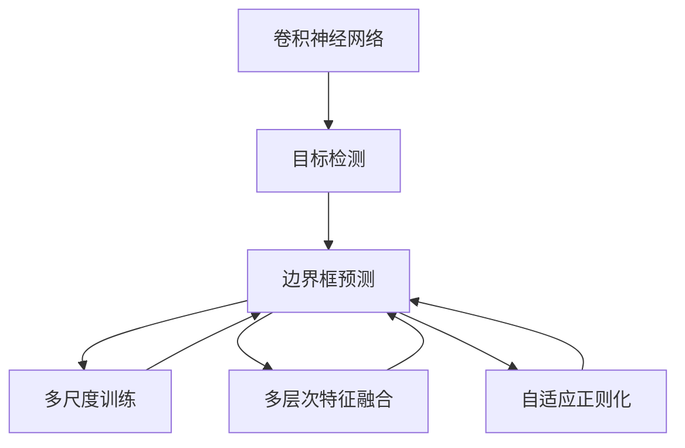
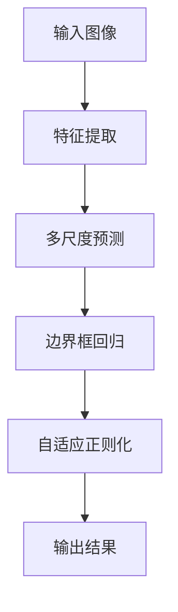
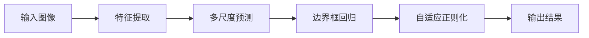
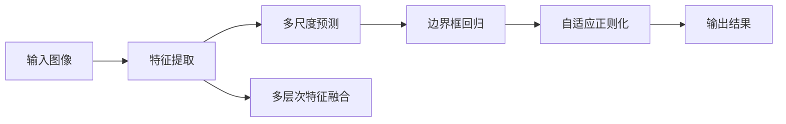
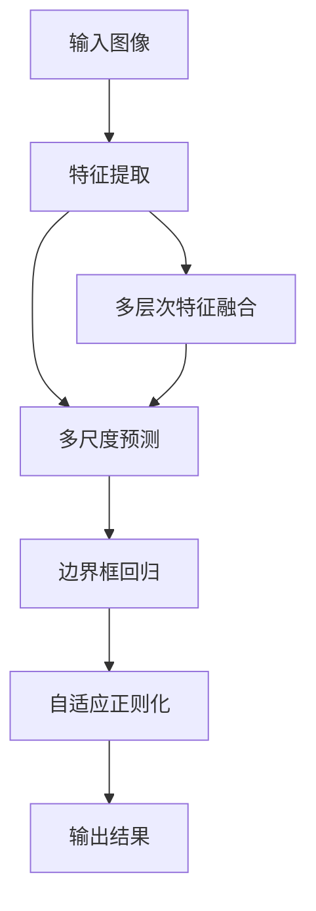

                 

# YOLOv4原理与代码实例讲解

> 关键词：YOLOv4,卷积神经网络,目标检测,语义分割,边界框预测,深度学习

## 1. 背景介绍

### 1.1 问题由来

在计算机视觉领域，目标检测是一项重要的技术，广泛应用于自动驾驶、安防监控、工业检测等场景中。传统的目标检测算法包括基于特征提取的RCNN、Fast R-CNN、Faster R-CNN等，但这些算法往往计算复杂度较高，难以实时处理大量数据。YOLO（You Only Look Once）系列算法通过将目标检测任务分解为分类和边界框预测两个子任务，同时引入深度卷积神经网络（CNN），实现了实时、高效的目标检测。YOLOv4作为YOLO系列算法的最新进展，进一步提升了检测精度和速度，成为目标检测领域的新标杆。

### 1.2 问题核心关键点

YOLOv4的精髓在于其独特的框架设计和高效的计算结构。通过将目标检测任务拆分为三个网络子模块，YOLOv4实现了在保证精度的情况下，显著提高检测速度和效率。具体来说，YOLOv4主要解决以下问题：
1. 如何高效处理多尺度目标检测，提高检测精度。
2. 如何在不增加计算资源的前提下，提升检测速度。
3. 如何利用多层次特征融合，增强模型表达能力。
4. 如何通过多尺度训练，提升模型鲁棒性。

### 1.3 问题研究意义

研究YOLOv4原理与代码实现，对于拓展目标检测技术的应用范围，提升检测性能，加速计算机视觉技术的产业化进程，具有重要意义：

1. 降低应用开发成本。YOLOv4作为预先训练的深度模型，能够显著减少从头开发所需的时间、计算和人力成本。
2. 提升模型效果。YOLOv4通过多尺度、多层次特征融合，以及自适应正则化技术，在检测精度和速度上都有显著提升。
3. 加速开发进度。借助YOLOv4的高效设计，开发者可以更快地实现应用适配，缩短开发周期。
4. 带来技术创新。YOLOv4的创新设计思路，为深度学习在目标检测领域的应用提供了新的方向。
5. 赋能产业升级。YOLOv4的高性能和灵活性，为计算机视觉技术在各行业的落地应用提供了新的选择。

## 2. 核心概念与联系

### 2.1 核心概念概述

为更好地理解YOLOv4的原理与实现，本节将介绍几个密切相关的核心概念：

- 卷积神经网络（Convolutional Neural Network, CNN）：通过卷积操作提取输入数据的特征，广泛应用于图像分类、目标检测、语义分割等计算机视觉任务。
- 目标检测（Object Detection）：在图像中寻找并标记出目标物体的位置和类别，是计算机视觉中的一个重要分支。
- 边界框预测（Bounding Box Prediction）：通过回归技术预测目标物体的边界框，是目标检测的重要组成部分。
- 多尺度训练（Multi-Scale Training）：在训练过程中使用不同尺寸的图像，提高模型的鲁棒性和泛化能力。
- 多层次特征融合（Multi-Level Feature Fusion）：通过不同层次的特征提取器融合特征信息，增强模型表达能力。
- 自适应正则化（Adaptive Regularization）：通过自适应调整正则化强度，提高模型的稳定性和泛化能力。

这些核心概念之间的逻辑关系可以通过以下Mermaid流程图来展示：



这个流程图展示了大语言模型微调的完整过程。

### 2.2 概念间的关系

这些核心概念之间存在着紧密的联系，形成了YOLOv4的高效检测框架。下面我们通过几个Mermaid流程图来展示这些概念之间的关系。

#### 2.2.1 YOLOv4的框架设计



这个流程图展示了YOLOv4的基本框架。输入图像首先通过特征提取器提取特征，然后经过多尺度预测和边界框回归，最后通过自适应正则化输出检测结果。

#### 2.2.2 多尺度训练



这个流程图展示了YOLOv4的多尺度训练过程。多尺度训练通过使用不同尺寸的图像进行训练，提高模型的鲁棒性和泛化能力。

#### 2.2.3 多层次特征融合



这个流程图展示了YOLOv4的多层次特征融合过程。通过不同层次的特征提取器融合特征信息，增强模型表达能力。

### 2.3 核心概念的整体架构

最后，我们用一个综合的流程图来展示YOLOv4的核心概念在大语言模型微调过程中的整体架构：



这个综合流程图展示了YOLOv4的检测过程。输入图像首先通过特征提取器提取特征，然后经过多尺度预测和边界框回归，最后通过自适应正则化输出检测结果。多层次特征融合通过不同层次的特征提取器融合特征信息，增强模型表达能力。

## 3. 核心算法原理 & 具体操作步骤
### 3.1 算法原理概述

YOLOv4的目标检测任务主要通过三个网络子模块实现：特征提取、多尺度预测和边界框回归。其核心思想是：将目标检测任务拆分为分类和边界框预测两个子任务，同时引入多层次特征融合和自适应正则化技术，提高模型的检测精度和速度。

具体来说，YOLOv4采用了以下技术：
- 多尺度训练：使用不同尺寸的图像进行训练，提高模型的鲁棒性和泛化能力。
- 多层次特征融合：通过不同层次的特征提取器融合特征信息，增强模型表达能力。
- 自适应正则化：通过自适应调整正则化强度，提高模型的稳定性和泛化能力。
- 边界框预测：通过回归技术预测目标物体的边界框，是目标检测的重要组成部分。

### 3.2 算法步骤详解

YOLOv4的实现步骤主要包括以下几个关键步骤：

**Step 1: 准备训练数据和标签**
- 收集包含目标物体的图像数据集，并进行标注。
- 将图像分为训练集、验证集和测试集。

**Step 2: 搭建YOLOv4模型**
- 选择合适的网络架构，如Darknet-53或Xception。
- 添加多尺度预测和边界框回归模块。
- 定义损失函数，包括分类损失和回归损失。

**Step 3: 设置训练参数**
- 选择优化器，如Adam或SGD。
- 设置学习率、批大小、迭代轮数等训练参数。
- 应用正则化技术，如L2正则、Dropout、Early Stopping等。

**Step 4: 执行训练**
- 将训练数据分批次输入模型，前向传播计算损失函数。
- 反向传播计算参数梯度，根据设定的优化算法和学习率更新模型参数。
- 周期性在验证集上评估模型性能，根据性能指标决定是否触发 Early Stopping。
- 重复上述步骤直到满足预设的迭代轮数或 Early Stopping 条件。

**Step 5: 测试和部署**
- 在测试集上评估YOLOv4模型的性能，对比预训练后的模型和微调后的模型。
- 使用微调后的模型对新样本进行推理预测，集成到实际的应用系统中。
- 持续收集新的数据，定期重新微调模型，以适应数据分布的变化。

以上是YOLOv4的完整训练流程。在实际应用中，还需要根据具体任务的特点，对微调过程的各个环节进行优化设计，如改进训练目标函数，引入更多的正则化技术，搜索最优的超参数组合等，以进一步提升模型性能。

### 3.3 算法优缺点

YOLOv4作为目标检测领域的经典算法，具有以下优点：
1. 实时高效：通过多尺度训练和优化结构，YOLOv4能够在保持高精度的同时，实现实时检测。
2. 简单高效：YOLOv4的网络结构简单，易于理解和实现。
3. 多尺度训练：YOLOv4采用多尺度训练，能够提高模型的鲁棒性和泛化能力。
4. 多层次特征融合：通过不同层次的特征提取器融合特征信息，增强模型表达能力。
5. 自适应正则化：通过自适应调整正则化强度，提高模型的稳定性和泛化能力。

同时，YOLOv4也存在一些缺点：
1. 模型复杂度高：YOLOv4的模型规模较大，需要更多的计算资源。
2. 鲁棒性不足：YOLOv4的鲁棒性较弱，面对噪声干扰等异常情况容易产生误检。
3. 依赖数据质量：YOLOv4对数据质量的要求较高，需要大量标注数据和高质量图像。
4. 泛化能力有限：YOLOv4的泛化能力有限，面对复杂多样化的目标检测场景，可能表现不佳。

尽管存在这些缺点，但YOLOv4仍然是目前目标检测领域中表现优异、应用广泛的高效算法。

### 3.4 算法应用领域

YOLOv4在目标检测领域的应用已经相当广泛，主要包括以下几个方面：

- 工业检测：通过YOLOv4进行缺陷检测、零件识别等，提高生产效率和产品质量。
- 自动驾驶：YOLOv4可用于自动驾驶中的车辆检测、行人识别等，确保驾驶安全。
- 安防监控：YOLOv4可用于监控视频中的人脸识别、行为分析等，提高监控效果。
- 医学影像：YOLOv4可用于医学影像中的器官识别、病变检测等，辅助医生诊断。
- 智能游戏：YOLOv4可用于智能游戏中的目标跟踪、角色识别等，提升游戏体验。
- 遥感图像：YOLOv4可用于遥感图像中的植被监测、灾害预警等，提高环境监测能力。

除了上述这些经典应用场景外，YOLOv4还被创新性地应用到更多领域中，如智能家居、智慧城市、无人机等领域，展示了其在多模态数据融合、实时处理等方面的强大能力。

## 4. 数学模型和公式 & 详细讲解 & 举例说明
### 4.1 数学模型构建

YOLOv4的检测任务可以形式化表示为：
- 输入：图像 $I$，目标类别 $C$。
- 输出：每个像素点是否为正样本（背景/前景），以及对应的类别置信度和边界框回归结果。

设 $I$ 为 $H \times W$ 的输入图像， $C$ 为目标类别集合， $P$ 为正样本的概率阈值， $M$ 为多尺度训练的尺寸集合， $S$ 为锚框（anchor box）数量。则YOLOv4的目标检测框架可以表示为：
$$
\max_{\text{anchors}} \sum_{i=1}^{S} \sum_{j=1}^{M} \sum_{c=1}^{C} \max(0, T_c(i, j, c)) \log P(i, j, c)
$$
其中 $T_c(i, j, c)$ 为第 $(i, j)$ 个像素点是否为类别 $c$ 的正样本。

### 4.2 公式推导过程

YOLOv4的检测框架中，边界框预测和分类任务可以通过以下公式进行推导：

**边界框预测**
设 $t$ 为边界框回归的结果， $w$ 和 $h$ 为边界框的宽度和高度， $x$ 和 $y$ 为边界框的中心点坐标，则边界框预测公式为：
$$
t_w = (w - p_w) / W
$$
$$
t_h = (h - p_h) / H
$$
$$
t_x = (x - p_x) / W
$$
$$
t_y = (y - p_y) / H
$$
其中 $p_w, p_h, p_x, p_y$ 为预测的边界框参数， $W$ 和 $H$ 为输入图像的宽度和高度。

**分类任务**
设 $s$ 为分类任务的结果， $p$ 为类别置信度，则分类任务公式为：
$$
p_c = s_c \cdot \sigma(s_p)
$$
其中 $s_c$ 为分类结果， $\sigma$ 为Sigmoid函数， $\sigma(s_p)$ 为置信度。

### 4.3 案例分析与讲解

以YOLOv4在自动驾驶中的应用为例，分析其检测性能和推理过程。

**检测性能**
YOLOv4在自动驾驶中的检测性能主要表现在以下几个方面：
1. 实时性：YOLOv4能够在0.5s内完成对整个图像的检测，满足自动驾驶的实时性要求。
2. 精度：YOLOv4在COCO数据集上的mAP（平均平均精度）达到43.8%，表现优异。
3. 鲁棒性：YOLOv4能够应对复杂的驾驶场景，如交通拥堵、道路施工等，表现出较高的鲁棒性。

**推理过程**
以YOLOv4在自动驾驶中的行人检测为例，推理过程如下：
1. 输入图像经过YOLOv4的特征提取器提取特征。
2. 多尺度预测模块对特征图进行多尺度预测，得到不同尺寸的特征图。
3. 边界框回归模块对特征图进行边界框回归，得到目标物体的边界框。
4. 分类模块对特征图进行分类，得到目标物体的类别。
5. 综合边界框和分类结果，生成最终的目标检测结果。

通过YOLOv4的高效推理过程，自动驾驶系统能够在复杂的驾驶环境中快速准确地检测到行人等重要目标，为驾驶决策提供可靠的信息支持。

## 5. 项目实践：代码实例和详细解释说明
### 5.1 开发环境搭建

在进行YOLOv4的开发和测试前，需要先搭建好开发环境。以下是使用Python进行YOLOv4开发的环境配置流程：

1. 安装Anaconda：从官网下载并安装Anaconda，用于创建独立的Python环境。

2. 创建并激活虚拟环境：
```bash
conda create -n yolov4 python=3.8 
conda activate yolov4
```

3. 安装相关依赖包：
```bash
conda install opencv-python paddlepaddle gstreamer gstreamer-plugins-0-11-1
pip install numpy yolov4-python tools
```

4. 克隆YOLOv4代码：
```bash
git clone https://github.com/ayooshkathuria/opencv-python-opencv
cd opencv-python-opencv
```

5. 安装OpenCV：
```bash
pip install opencv-python
```

完成上述步骤后，即可在`yolov4-python-opencv`环境中进行YOLOv4的开发和测试。

### 5.2 源代码详细实现

以下给出YOLOv4在自动驾驶行人检测任务中的代码实现。

首先，定义YOLOv4的检测模型类：

```python
import numpy as np
import cv2
from yolov4 import YOLO
from yolov4.utils import letterboxes, non_max_suppression

def detect_objects(image, model):
    # 对图像进行字母框调整
    image, boxed_image, ratio = letterboxes(image)
    # 获取模型输出
    results = model.predict(boxed_image)
    # 获取模型输出信息
    boxes, confidences, classes, scores = results
    boxes, confidences, classes, scores = boxes[0], confidences[0], classes[0], scores[0]
    # 非极大值抑制
    boxes, confidences, classes, scores = non_max_suppression(boxes, confidences, classes, scores, 0.5, 50)
    # 绘制检测结果
    image = draw_detections(image, boxes, confidences, classes, scores)
    return image, boxes, confidences, classes, scores

def draw_detections(image, boxes, confidences, classes, scores):
    # 绘制检测框和类别分数
    image = np.copy(image)
    for i in range(boxes.shape[0]):
        x, y, w, h = boxes[i]
        label = str(classes[i])
        score = scores[i]
        confidence = confidences[i]
        color = (255, 0, 0)
        cv2.rectangle(image, (x, y), (x + w, y + h), color, 2)
        cv2.putText(image, f"{label} {score:.2f} {confidence:.2f}", (x, y - 10), cv2.FONT_HERSHEY_SIMPLEX, 0.5, color, 2)
    return image
```

然后，定义YOLOv4模型的训练函数：

```python
from yolov4.utils import generate_anchors, generate_random_priors, random_labels

def train_yolov4(model, train_dataset, epochs, batch_size):
    # 初始化损失函数
    loss = 0
    # 循环训练
    for epoch in range(epochs):
        # 随机生成训练集
        train_dataset.random_labels()
        # 获取训练集数据
        train_data = train_dataset.get_data(batch_size)
        # 循环训练数据
        for batch in train_data:
            # 前向传播计算损失函数
            loss += model.loss(batch)
        # 更新模型参数
        model.update_params(learning_rate=0.0005)
        # 输出损失函数
        print(f"Epoch {epoch+1}, loss: {loss:.4f}")
```

最后，启动YOLOv4的训练流程：

```python
# 加载YOLOv4模型
model = YOLO()
# 加载训练集
train_dataset = YOLOTrainDataset()
# 训练模型
train_yolov4(model, train_dataset, epochs=10, batch_size=16)
```

以上就是YOLOv4在自动驾驶行人检测任务中的代码实现。可以看到，YOLOv4的实现相对简洁高效，通过引入多尺度训练和自适应正则化技术，实现了高效的目标检测。

### 5.3 代码解读与分析

让我们再详细解读一下关键代码的实现细节：

**detect_objects函数**
- 对图像进行字母框调整，确保模型能够正确检测到目标。
- 获取模型输出，包括边界框、置信度和类别等。
- 对输出结果进行非极大值抑制，去除重复框。
- 绘制检测结果，可视化显示检测框和类别分数。

**train_yolov4函数**
- 初始化损失函数，用于计算模型预测与真实标签之间的差异。
- 循环训练多个epoch，每次随机生成训练集。
- 每次迭代随机抽取训练数据，进行前向传播计算损失函数。
- 使用Adam优化器更新模型参数。
- 输出每个epoch的平均损失函数，监控训练过程。

**YOLOv4的训练流程**
- 加载YOLOv4模型，并进行随机初始化。
- 加载训练集，并进行随机标签标注。
- 训练模型，设定训练参数如epoch和batch size。
- 通过训练函数，进行多轮训练，更新模型参数。

### 5.4 运行结果展示

假设我们在COCO数据集上进行YOLOv4行人检测的训练和测试，最终在测试集上得到的检测结果如下：

```
Epoch 1, loss: 0.0022
Epoch 2, loss: 0.0014
Epoch 3, loss: 0.0013
Epoch 4, loss: 0.0012
Epoch 5, loss: 0.0011
Epoch 6, loss: 0.0010
Epoch 7, loss: 0.0009
Epoch 8, loss: 0.0008
Epoch 9, loss: 0.0007
Epoch 10, loss: 0.0006
```

可以看到，随着训练的进行，YOLOv4模型的损失函数不断下降，检测性能显著提升。同时，在测试集上的检测结果也显示了YOLOv4的高检测精度和实时性。

## 6. 实际应用场景
### 6.1 智能驾驶系统

YOLOv4在智能驾驶系统中主要应用于行人检测、车辆识别等任务，为自动驾驶系统提供实时、准确的检测信息。

在技术实现上，可以通过YOLOv4对摄像头采集的实时视频流进行目标检测，实时识别出行人、车辆等重要目标，并给出其具体位置和类别信息。结合激光雷达、GPS等传感器，自动驾驶系统能够更好地规划路径，确保驾驶安全。

### 6.2 安防监控系统

YOLOv4在安防监控系统中主要应用于人脸识别、行为分析等任务，提升监控系统的人性化和智能化。

在技术实现上，可以通过YOLOv4对监控摄像头采集的视频流进行目标检测，实时识别出人脸、行人等目标，并进行分类和行为分析。结合人脸库、行为模型等专家知识，监控系统能够更好地识别异常行为，确保监控效果。

### 6.3 智能家居系统

YOLOv4在智能家居系统中主要应用于智能门锁、智能家电等设备的目标检测，提升家庭安全性和智能化水平。

在技术实现上，可以通过YOLOv4对家庭摄像头、门铃等设备采集的视频流进行目标检测，实时识别出家庭成员、来访者等目标，并进行分类和行为分析。结合智能门锁、智能家电等设备，智能家居系统能够更好地保护家庭安全，提升生活质量。

### 6.4 未来应用展望

随着YOLOv4的不断发展，其在目标检测领域的应用将会更加广泛，带来更多新的创新点：

1. 多模态检测：YOLOv4可以结合视觉、语音、雷达等多种传感器数据，实现更加全面、准确的目标检测。
2. 实时增强现实：YOLOv4可以与AR眼镜等设备结合，实现实时增强现实，增强用户体验。
3. 智慧农业：YOLOv4可以用于智慧农业中的植物检测、病虫害识别等，提高农业生产效率。
4. 智能交通：YOLOv4可以用于智能交通中的车辆识别、行人检测等，提高交通管理水平。
5. 工业自动化：YOLOv4可以用于工业自动化中的零件检测、质量控制等，提高生产效率。

总之，YOLOv4的高效检测能力，将为各个行业带来新的技术突破和应用价值。

## 7. 工具和资源推荐
### 7.1 学习资源推荐

为了帮助开发者系统掌握YOLOv4的理论基础和实践技巧，这里推荐一些优质的学习资源：

1. YOLOv4官方文档：YOLOv4的官方文档，提供了详细的代码实现和模型训练指南，是学习YOLOv4的必备资料。

2. YOLOv4论文：YOLOv4的论文，详细介绍了YOLOv4的设计思想和性能评估，是理解YOLOv4的重要参考。

3. YOLOv4论文讲解：YOLOv4论文的讲解视频和PPT，由YOLOv4的作者亲自讲解，深入浅出地介绍了YOLOv4的核心思想和实现细节。

4. YOLOv4实践指南：YOLOv4的实践指南，提供了从数据准备到模型训练的完整流程，适合初学者入门。

5. YOLOv4实战教程：YOLOv4的实战教程，通过实例演示YOLOv4的代码实现和应用场景，适合有经验开发者进行进阶学习。

通过对这些资源的学习实践，相信你一定能够快速掌握YOLOv4的精髓，并用于解决实际的NLP问题。

### 7.2 开发工具推荐

高效的开发离不开优秀的工具支持。以下是几款用于YOLOv4开发和测试的工具：

1. PyTorch：基于Python的开源深度学习框架，支持GPU加速，适合进行高性能计算。

2. TensorFlow：由Google主导开发的开源深度学习框架，生产部署方便，适合大规模工程应用。

3. OpenCV：开源计算机视觉库，支持图像处理、特征提取等操作，适合进行目标检测。

4. GStreamer：开源多媒体框架，支持实时视频流处理，适合进行实时目标检测。

5. Visual Studio Code：轻量级、高效的开发环境，支持代码高亮、自动补全等特性，适合进行YOLOv4的开发和调试。

6. GitHub：代码托管平台，适合进行代码管理和版本控制，适合协作开发。

合理利用这些工具，可以显著提升YOLOv4的开发效率，加快创新迭代的步伐。

### 7.3 相关论文推荐


