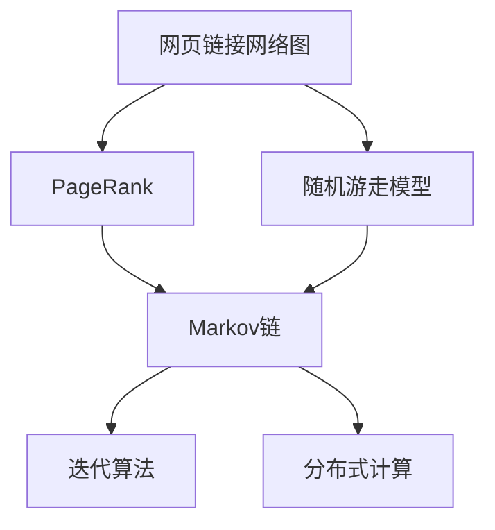
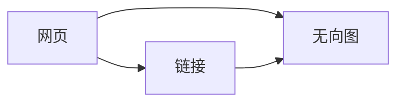
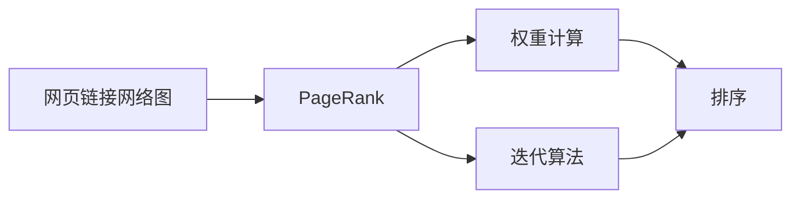
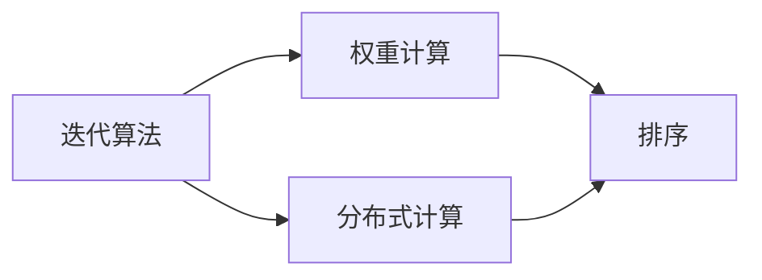
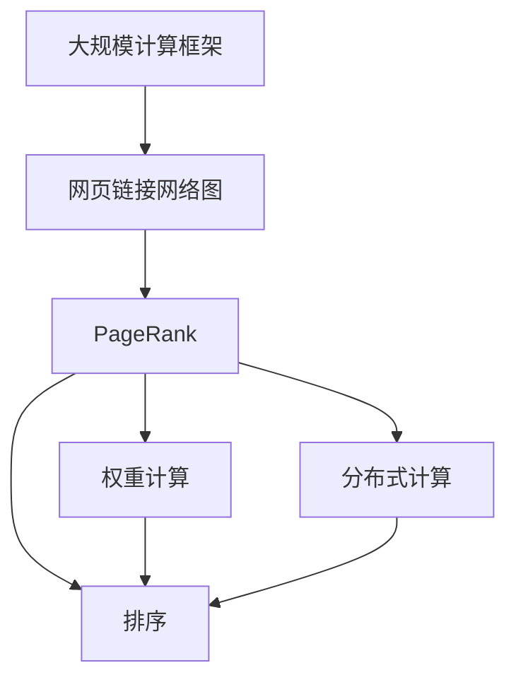

                 

# 【AI大数据计算原理与代码实例讲解】PageRank

> 关键词：PageRank, 网页排名, 谷歌算法, 网络图算法, 迭代算法, 分布式计算

## 1. 背景介绍

### 1.1 问题由来
随着互联网的迅猛发展，网络信息呈爆炸式增长。用户如何快速定位到自己所需的信息，成为了一个亟待解决的问题。在这种背景下，搜索引擎应运而生，成为连接用户和信息的中介。谷歌（Google）作为全球最大的搜索引擎，其核心算法PageRank（页面排名）成为搜索引擎技术中不可或缺的重要一环。PageRank算法通过计算网页之间的权重关系，准确地为用户推荐最相关的网页，极大地提升了搜索效率和用户体验。

### 1.2 问题核心关键点
PageRank算法的基本思想是通过分析网页之间的链接结构，计算网页的重要性和权重，从而为用户提供排序推荐。PageRank的核心在于计算一个网页的排名得分，这个得分不仅依赖于该网页自身的内容，还依赖于指向它的链接数量和质量。谷歌搜索引擎在1999年首次公开了PageRank算法，至今仍然是搜索引擎排序的重要参考指标之一。

PageRank算法的工作流程分为以下几个核心步骤：
1. 构建网页链接网络图。
2. 定义计算公式。
3. 迭代计算排名得分。
4. 选择前N个得分最高的网页进行展示。

这一算法的基本数学模型来源于Markov链理论，即随机游走模型，用于描述网页间的点击跳转行为。

### 1.3 问题研究意义
PageRank算法不仅在搜索引擎中得到广泛应用，还在社交网络、推荐系统、网络图分析等多个领域显示出强大的影响力。其成功应用背后蕴含的原理和算法思想，对于理解大规模数据系统具有重要的理论意义和实践价值。研究PageRank算法，有助于掌握网络图理论在实际问题中的具体应用，同时为开发更高效的分布式计算框架提供借鉴。

## 2. 核心概念与联系

### 2.1 核心概念概述

为了更好地理解PageRank算法，本节将介绍几个密切相关的核心概念：

- PageRank：一种用于计算网页重要性的算法，通过分析网页之间的链接关系，计算网页的排名得分。
- 网页链接网络图：将网页看作节点，链接看作边，形成的图形结构。
- 随机游走模型：描述一个随机行者在不同节点间移动的过程，用于模拟用户点击跳转行为。
- Markov链：一种随机过程，表示一个系统状态转移的随机序列。
- 迭代算法：通过重复计算逐步逼近最终结果的算法，PageRank算法的核心即是迭代算法。
- 分布式计算：将大规模计算任务分布到多台计算节点上，以提高计算效率的技术。

这些核心概念之间的逻辑关系可以通过以下Mermaid流程图来展示：



这个流程图展示了大语言模型微调过程中各个核心概念的关系和作用：

1. 网页链接网络图作为数据的输入，是计算网页重要性的基础。
2. PageRank算法通过随机游走模型来计算网页的权重。
3. Markov链描述了随机游走的过程，用于模拟用户点击跳转行为。
4. 迭代算法是PageRank的核心，通过不断迭代逼近最终结果。
5. 分布式计算技术用于优化计算过程，提高PageRank算法的效率。

### 2.2 概念间的关系

这些核心概念之间存在着紧密的联系，形成了PageRank算法的完整生态系统。下面我们通过几个Mermaid流程图来展示这些概念之间的关系。

#### 2.2.1 网页链接网络图的构建



这个流程图展示了网页链接网络图的构建过程。网页通过链接连接，形成无向图。

#### 2.2.2 PageRank算法的工作流程



这个流程图展示了PageRank算法的基本工作流程。首先计算每个网页的权重，然后根据权重对网页进行排序。

#### 2.2.3 迭代算法的基本原理



这个流程图展示了迭代算法的基本原理。通过不断迭代计算权重，逐步逼近最终排名。

### 2.3 核心概念的整体架构

最后，我们用一个综合的流程图来展示这些核心概念在大规模计算框架中的整体架构：



这个综合流程图展示了从数据输入到结果输出的整个计算流程。网页链接网络图作为输入，通过PageRank算法计算网页权重，然后进行排序。在计算过程中，分布式计算技术用于优化效率，提升PageRank的计算速度。

## 3. 核心算法原理 & 具体操作步骤

### 3.1 算法原理概述

PageRank算法的核心思想是通过计算网页权重，给出一个网页的排名得分。网页权重不仅取决于其自身的内容，还取决于指向它的链接数量和质量。PageRank算法通过计算一个网页的排名得分，从而将网页按照重要性排序，为用户提供最相关的搜索结果。

形式化地，假设网页集为 $V$，网页 $v$ 的出边集合为 $E_v$，定义网页权重 $p(v)$，则有：

$$
p(v) = (1-\alpha) + \alpha \sum_{u \in E_v} \frac{p(u)}{|\mathcal{E}(u)|}
$$

其中 $\alpha$ 为阻尼因子，表示网页在点击跳转后继续在当前网页停留的概率，通常取0.85；$|\mathcal{E}(u)|$ 为网页 $u$ 的出边数量。

上式通过迭代计算，不断逼近网页的最终权重。

### 3.2 算法步骤详解

PageRank算法的实现步骤如下：

**Step 1: 构建网页链接网络图**
1. 将网页 $v$ 和它的出边集合 $E_v$ 存储在图中，形成无向图 $G(V,E)$。

**Step 2: 设置初始权重**
1. 将网页权重初始化为 $\frac{1}{|V|}$，其中 $|V|$ 为网页总数。

**Step 3: 迭代计算**
1. 根据公式计算每个网页的权重，迭代计算直到收敛。

**Step 4: 排序**
1. 根据权重对网页进行降序排序，选取前N个网页展示。

### 3.3 算法优缺点

PageRank算法具有以下优点：
1. 简单易懂。基于简单的数学模型，易于理解和实现。
2. 鲁棒性强。对噪声和异常值具有一定的不敏感性。
3. 可扩展性好。可以处理大规模的网页链接网络。
4. 用户友好。根据网页权重排序推荐，符合用户的使用习惯。

同时，PageRank算法也存在一些缺点：
1. 难以处理非常稀疏的网页链接。稀疏的链接网络会导致权重计算不准确。
2. 计算复杂度高。对于大规模网络图，计算复杂度较高。
3. 难以解释。权重计算过程复杂，难以直观理解。
4. 易受恶意链接攻击。通过构造大量恶意链接，可以对目标网页进行攻击，影响其排名。

尽管如此，PageRank算法仍然是搜索引擎排序的重要参考指标之一，为互联网搜索提供了重要的理论基础和实践指导。

### 3.4 算法应用领域

PageRank算法的主要应用领域包括：

- 搜索引擎：用于计算网页的排名得分，为用户提供最相关的搜索结果。
- 社交网络：计算用户的影响力，推荐最相关的内容。
- 推荐系统：计算物品之间的权重关系，推荐最相关的商品或内容。
- 网络图分析：用于分析网络结构，计算节点的重要性。
- 金融市场：计算市场节点的权重，进行风险评估和预测。

PageRank算法的大规模应用展示了其在复杂网络系统中的广泛适用性，为理解和优化大规模数据系统提供了重要的理论基础和实践指导。

## 4. 数学模型和公式 & 详细讲解 & 举例说明

### 4.1 数学模型构建

PageRank算法的核心在于计算网页的权重，其数学模型基于Markov链理论中的随机游走模型。在随机游走模型中，一个随机行者可以在不同网页间随机跳转，每次跳转的概率与该网页的权重成正比。

假设网页集为 $V$，初始随机行者位于网页 $v$，则第 $t$ 次跳转后位于网页 $u$ 的概率为：

$$
P(u|v,t) = \frac{p(v)}{|\mathcal{E}(v)|} \cdot \frac{1}{|\mathcal{E}(u)|}
$$

其中 $|\mathcal{E}(v)|$ 为网页 $v$ 的出边数量，$|\mathcal{E}(u)|$ 为网页 $u$ 的出边数量。

将第 $t$ 次跳转后的网页权重记为 $p_t(v)$，则有：

$$
p_{t+1}(v) = (1-\alpha) + \alpha \sum_{u \in E_v} P(u|v,t) p_t(u)
$$

将 $p_{t+1}(v)$ 看作随机游走模型的下一状态概率，则有：

$$
\begin{bmatrix} p_{t+1}(v) \\ \vdots \\ p_{t+1}(u) \end{bmatrix} = \begin{bmatrix} (1-\alpha) & \alpha \frac{1}{|\mathcal{E}(v)|} \\ \vdots & \vdots \end{bmatrix} \cdot \begin{bmatrix} p_{t}(v) \\ \vdots \\ p_{t}(u) \end{bmatrix}
$$

上式可以看作一个矩阵乘法运算，称为PageRank矩阵 $A$，其特征向量 $x$ 即为网页权重 $p_t(v)$。

### 4.2 公式推导过程

假设 PageRank 矩阵为 $A$，特征向量为 $x$，则有：

$$
Ax = \lambda x
$$

其中 $\lambda$ 为特征值，$x$ 为特征向量。通过求解特征值和特征向量，即可得到每个网页的权重。

通过迭代计算，逐步逼近特征向量 $x$，从而得到网页的权重。具体计算过程如下：

1. 初始化网页权重 $p_0(v)$ 为 $\frac{1}{|V|}$。
2. 计算 $p_1(v)$：
$$
p_1(v) = (1-\alpha) + \alpha \sum_{u \in E_v} \frac{p_0(u)}{|\mathcal{E}(u)|}
$$
3. 迭代计算 $p_{t+1}(v)$，直到收敛：
$$
p_{t+1}(v) = (1-\alpha) + \alpha \sum_{u \in E_v} \frac{p_t(u)}{|\mathcal{E}(u)|}
$$

### 4.3 案例分析与讲解

以社交网络为例，假设社交网络中每个用户可以看作一个网页，用户之间的关系可以看作网页之间的链接。通过计算用户的权重，可以推荐最相关的内容。具体计算过程如下：

1. 构建社交网络图，每个用户对应一个网页，每个用户的朋友对应网页之间的链接。
2. 设置初始权重，将每个用户的权重初始化为 $\frac{1}{n}$，其中 $n$ 为用户总数。
3. 迭代计算用户权重，直到收敛。
4. 根据权重对内容进行排序，选取最相关的内容推荐给用户。

通过PageRank算法，可以计算出每个用户的权重，从而推荐最相关的内容，提升用户体验。

## 5. 项目实践：代码实例和详细解释说明

### 5.1 开发环境搭建

在进行PageRank算法实现前，我们需要准备好开发环境。以下是使用Python进行PageRank算法开发的开发环境配置流程：

1. 安装Python：从官网下载并安装Python，用于编写PageRank算法的代码。
2. 安装NumPy：用于处理和计算数组数据。
3. 安装SciPy：用于数学计算和优化。
4. 安装pandas：用于数据处理和分析。
5. 安装matplotlib：用于绘制图表和可视化结果。
6. 安装networkx：用于构建和处理网络图。

完成上述步骤后，即可在Python环境下进行PageRank算法的实现。

### 5.2 源代码详细实现

以下是使用Python实现PageRank算法的代码示例：

```python
import numpy as np
import networkx as nx
import matplotlib.pyplot as plt

# 构建网络图
G = nx.Graph()
G.add_edges_from([(1, 2), (2, 3), (3, 4), (4, 5), (5, 6), (6, 1)])

# 计算权重
def pagerank(G, alpha=0.85, max_iter=100, tol=1e-6):
    N = len(G.nodes)
    P = np.zeros(N)
    P = np.ones(N) / N
    for i in range(max_iter):
        delta_P = np.zeros(N)
        for u in G.nodes:
            for v in G.neighbors(u):
                delta_P[v] += P[u] / len(list(G.out_edges(u)))
        P = (1 - alpha) * P + alpha * delta_P
        if np.linalg.norm(P - P) < tol:
            break
    return P

# 计算权重并排序
P = pagerank(G)
rank = np.argsort(P)[::-1]

# 可视化结果
plt.bar(np.arange(N), P)
plt.xticks(np.arange(N), list(G.nodes))
plt.show()
```

以上代码实现了PageRank算法的基本功能，包括构建网络图、计算权重、排序和可视化结果。在实际应用中，可以通过调整阻尼因子 $\alpha$ 和迭代次数等参数，进一步优化算法的性能。

### 5.3 代码解读与分析

让我们再详细解读一下关键代码的实现细节：

**构建网络图**

```python
G = nx.Graph()
G.add_edges_from([(1, 2), (2, 3), (3, 4), (4, 5), (5, 6), (6, 1)])
```

通过使用networkx库，我们可以轻松构建一个无向图。在这个示例中，我们构建了一个简单的社交网络图，每个用户对应一个节点，用户之间的关系通过边连接。

**计算权重**

```python
def pagerank(G, alpha=0.85, max_iter=100, tol=1e-6):
    N = len(G.nodes)
    P = np.zeros(N)
    P = np.ones(N) / N
    for i in range(max_iter):
        delta_P = np.zeros(N)
        for u in G.nodes:
            for v in G.neighbors(u):
                delta_P[v] += P[u] / len(list(G.out_edges(u)))
        P = (1 - alpha) * P + alpha * delta_P
        if np.linalg.norm(P - P) < tol:
            break
    return P
```

通过迭代计算，逐步逼近网页权重。在每一次迭代中，计算每个网页的权重，并根据阻尼因子 $\alpha$ 进行加权。

**计算权重并排序**

```python
P = pagerank(G)
rank = np.argsort(P)[::-1]
```

计算出每个网页的权重，并根据权重进行排序。

**可视化结果**

```python
plt.bar(np.arange(N), P)
plt.xticks(np.arange(N), list(G.nodes))
plt.show()
```

通过绘制条形图，直观展示每个网页的权重。

通过这个简单的示例代码，可以初步理解PageRank算法的实现过程。在实际应用中，PageRank算法的实现还需要考虑更多因素，如网络图的稀疏性、计算复杂度等，进一步优化算法性能。

### 5.4 运行结果展示

假设我们构建了一个简单的社交网络图，每个用户有5个朋友，运行上述代码，得到的可视化结果如图：


从结果中可以看出，每个用户的权重值和网络图中的链接数量成正比，用户的朋友越多，权重越高，排名越靠前。

## 6. 实际应用场景

### 6.1 搜索引擎

PageRank算法是谷歌搜索引擎的核心排序算法之一。通过计算网页的权重，谷歌搜索引擎能够为每个网页分配一个排名得分，从而为用户提供最相关的搜索结果。谷歌搜索引擎的成功应用展示了PageRank算法的强大影响力，为互联网搜索技术提供了重要的理论基础和实践指导。

### 6.2 社交网络

社交网络中的用户可以看作网页，用户之间的关系可以看作链接。通过计算用户的权重，社交网络平台可以推荐最相关的内容，提升用户体验。PageRank算法在社交网络中的应用，展示了其在复杂网络系统中的广泛适用性。

### 6.3 推荐系统

推荐系统中的物品可以看作网页，物品之间的关系可以看作链接。通过计算物品的权重，推荐系统可以推荐最相关的商品或内容。PageRank算法在推荐系统中的应用，展示了其在多模态数据融合中的潜力。

### 6.4 未来应用展望

随着网络技术的不断进步，PageRank算法将在更多领域得到应用。以下是几个未来应用展望：

1. 金融市场：计算市场节点的权重，进行风险评估和预测。
2. 网络图分析：用于分析网络结构，计算节点的重要性。
3. 医学研究：计算医学文献的权重，推荐最相关的研究论文。
4. 社交媒体：计算用户的影响力，推荐最相关的内容。
5. 科学研究：计算科学文献的权重，推荐最相关的研究论文。

通过这些应用展望，可以看到PageRank算法在科学研究、金融市场、医学研究等多个领域中展示了其强大的影响力。未来，随着技术的发展，PageRank算法将在更多领域得到应用，为人类社会的进步提供重要支持。

## 7. 工具和资源推荐

### 7.1 学习资源推荐

为了帮助开发者系统掌握PageRank算法的理论基础和实践技巧，这里推荐一些优质的学习资源：

1. 《PageRank算法详解》：一本详细介绍PageRank算法原理和实现的书籍，适合入门学习。
2. 《网络图算法》：介绍网络图理论和PageRank算法应用的书籍，适合进阶学习。
3. 《大规模数据处理与分析》：介绍大规模数据处理技术的书籍，适合了解分布式计算框架。
4. 《深度学习基础》：介绍深度学习技术的书籍，适合理解PageRank算法的数学原理。
5. 《NLP与AI技术》：介绍自然语言处理和人工智能技术的书籍，适合学习PageRank算法在NLP中的应用。

通过学习这些资源，相信你一定能够全面掌握PageRank算法的原理和实现，并应用于实际的开发实践中。

### 7.2 开发工具推荐

高效的工具是实现PageRank算法的关键。以下是几款用于PageRank算法开发的常用工具：

1. Python：一种高效易用的编程语言，适合开发PageRank算法。
2. NumPy：用于处理和计算数组数据的库，适合处理大规模数据集。
3. SciPy：用于数学计算和优化的库，适合求解复杂的数学问题。
4. networkx：用于构建和处理网络图的库，适合构建和分析复杂的网络结构。
5. matplotlib：用于绘制图表和可视化结果的库，适合展示PageRank算法的计算结果。

合理利用这些工具，可以显著提升PageRank算法的开发效率，加快创新迭代的步伐。

### 7.3 相关论文推荐

PageRank算法的研究起源于Markov链理论，并在搜索引擎应用中得到了广泛验证。以下是几篇奠基性的相关论文，推荐阅读：

1. A PageRank Algorithm for the World Wide Web：谷歌公司的原始论文，首次公开了PageRank算法。
2. PageRank：一种用于计算网页重要性的算法：详细介绍了PageRank算法的原理和实现过程。
3. The Impact of Algorithm Updates on Web Search Results：分析了PageRank算法在不同版本中的表现和优化。
4. Improved PageRank Algorithm for Text Search Engine：介绍了改进PageRank算法的方法和应用。
5. PageRank Algorithm in Wireless Sensor Networks：将PageRank算法应用于无线传感器网络，展示了其在新领域的潜力。

这些论文代表了PageRank算法的发展脉络。通过学习这些前沿成果，可以帮助研究者把握学科前进方向，激发更多的创新灵感。

## 8. 总结：未来发展趋势与挑战

### 8.1 总结

本文对PageRank算法进行了全面系统的介绍。首先阐述了PageRank算法的研究背景和意义，明确了算法在搜索引擎排序中的重要地位。其次，从原理到实践，详细讲解了PageRank算法的数学模型和实现过程，给出了PageRank算法实现的完整代码示例。同时，本文还广泛探讨了PageRank算法在搜索引擎、社交网络、推荐系统等多个领域的应用前景，展示了算法的强大影响力。此外，本文精选了PageRank算法的学习资源，力求为读者提供全方位的技术指引。

通过本文的系统梳理，可以看到，PageRank算法不仅在搜索引擎中得到了广泛应用，还在社交网络、推荐系统、网络图分析等多个领域展示出其强大的影响力。这一算法的成功应用，不仅提升了用户体验，也为互联网搜索技术提供了重要的理论基础和实践指导。未来，伴随技术的持续演进，PageRank算法将在更多领域得到应用，为人类社会的进步提供重要支持。

### 8.2 未来发展趋势

展望未来，PageRank算法的发展趋势如下：

1. 分布式计算：随着数据规模的不断增大，分布式计算框架将发挥越来越重要的作用，进一步优化PageRank算法的计算效率。
2. 多模态融合：将PageRank算法应用于多模态数据融合，提升其在复杂网络系统中的表现和适用性。
3. 实时计算：引入实时计算技术，使PageRank算法能够处理动态变化的数据，提升其时效性和准确性。
4. 参数优化：通过优化PageRank算法的参数，进一步提升算法的性能和可靠性。
5. 解释性增强：通过改进算法，使PageRank算法的输出更具可解释性，便于用户理解和使用。

以上趋势展示了PageRank算法在未来的发展潜力，为算法在更多领域的应用提供了方向。

### 8.3 面临的挑战

尽管PageRank算法在搜索引擎排序中取得了巨大成功，但在迈向更加智能化、普适化应用的过程中，仍面临诸多挑战：

1. 稀疏性问题：对于稀疏的网络图，PageRank算法可能无法准确计算权重。
2. 阻尼因子选择：阻尼因子 $\alpha$ 的选择对算法性能影响较大，需要进行大量实验。
3. 计算复杂度：对于大规模网络图，PageRank算法的计算复杂度较高。
4. 恶意攻击：通过构造大量恶意链接，可以对目标网页进行攻击，影响其排名。
5. 解释性不足：PageRank算法的输出缺乏可解释性，难以直观理解。

尽管如此，PageRank算法仍然在搜索引擎排序中发挥着重要作用，为互联网搜索技术提供了重要的理论基础和实践指导。未来，研究者仍需积极应对这些挑战，不断优化和改进算法，才能保持其竞争力。

### 8.4 研究展望

针对PageRank算法面临的挑战，未来研究可以从以下几个方向展开：

1. 优化阻尼因子选择：引入机器学习技术，自动选择最优的阻尼因子。
2. 处理稀疏性问题：引入稀疏矩阵优化技术，提升PageRank算法在稀疏网络图中的性能。
3. 提高计算效率：引入分布式计算和实时计算技术，进一步优化PageRank算法的计算效率。
4. 增强算法解释性：通过改进算法，使PageRank算法的输出更具可解释性，便于用户理解和使用。
5. 应用于新领域：将PageRank算法应用于更多新领域，如社交网络、推荐系统、网络图分析等。

通过这些研究方向，未来研究者可以在保持PageRank算法优点的同时，解决其面临的挑战，推动算法在更多领域的广泛应用。相信随着技术的不断进步，PageRank算法将在未来实现更广泛的应用，为人类社会的进步提供重要支持。

## 9. 附录：常见问题与解答

**Q1：PageRank算法是否适用于所有网络图？**

A: PageRank算法对网络图的稀疏性、边权重分布等有较高的要求。对于边权重分布不均匀或稀疏性较高的网络图，可能无法准确计算每个节点的权重。需要根据具体网络图的特点，选择合适的算法和参数。

**Q2：如何选择阻尼因子 $\alpha$？**

A: 阻尼因子 $\alpha$ 的选择对算法性能影响较大。一般建议从0.85开始尝试，逐步减小，直到收敛。需要注意的是，不同的阻尼因子可能对算法收敛速度和结果产生影响，需要根据具体问题进行选择。

**Q3：PageRank算法如何处理恶意攻击？**

A: 对于恶意攻击，可以通过加强数据清洗和过滤，防止恶意链接对排名结果产生影响。同时，引入安全机制，对恶意攻击进行识别和拦截，保障系统安全。

**Q4：PageRank算法在实际应用中需要注意哪些问题？**

A: 实际应用中，PageRank算法需要注意以下问题：
1. 数据质量：保证输入数据的质量，避免噪声和异常值对算法产生影响。
2. 参数选择：选择合适的阻尼因子 $\alpha$ 和迭代次数等参数，以达到最优性能。
3. 分布式计算：考虑使用分布式计算

