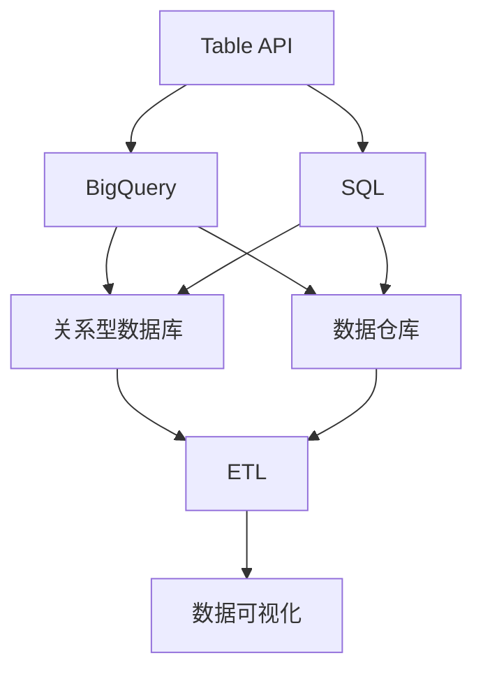
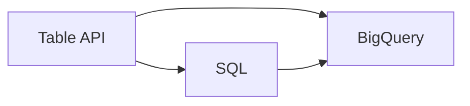
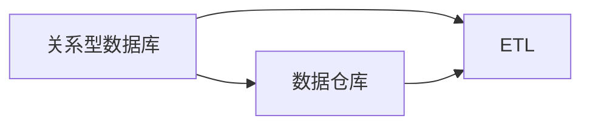
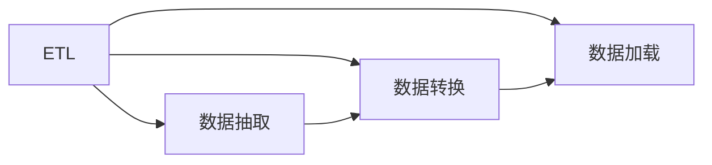
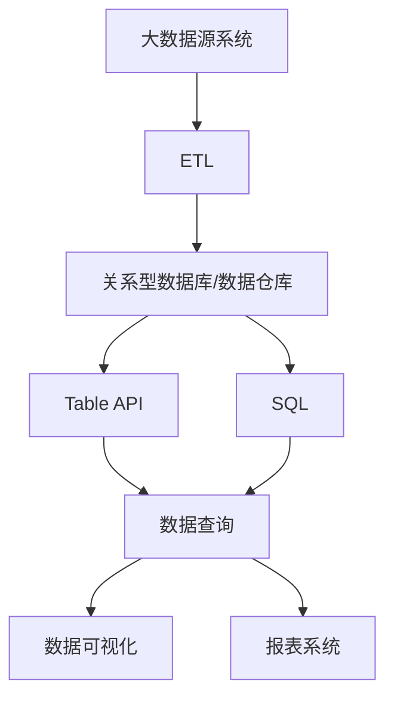

                 

# 【AI大数据计算原理与代码实例讲解】Table API和SQL

## 1. 背景介绍

### 1.1 问题由来
随着大数据时代的到来，数据成为了驱动企业发展的核心资产。如何高效、安全地管理大数据，从中挖掘价值，成为企业面临的重要挑战。在这个背景下，数据处理技术得到了广泛关注和发展。Table API和SQL作为大数据计算的核心技术，在数据管理、查询、分析等方面具有重要应用。本文将详细介绍Table API和SQL的原理和使用方法，并通过具体的代码实例进行讲解。

### 1.2 问题核心关键点
Table API和SQL是两种常见的数据处理技术，其核心在于通过定义数据模型和操作语法，帮助用户对大规模数据进行管理和查询。Table API是Google BigQuery提供的一种数据处理接口，支持使用SQL语句对数据进行查询、分析和管理。SQL则是一种通用的数据操作语言，广泛应用于关系型数据库中，支持复杂的查询和数据分析。

Table API和SQL的最大优势在于其强大的数据处理能力和灵活的语法设计，能够满足不同领域、不同规模的数据处理需求。本文将重点介绍Table API和SQL的核心概念和使用方法，并通过具体的代码实例进行讲解，帮助读者掌握大数据计算的基本原理和技能。

### 1.3 问题研究意义
掌握Table API和SQL技术，对于大数据时代的企业数据管理和分析具有重要意义：

1. **数据管理**：通过Table API和SQL，企业可以快速构建和管理大规模数据模型，确保数据的安全和完整。
2. **高效查询**：Table API和SQL提供强大的查询功能，能够高效地从大数据中提取有用信息，为决策提供支持。
3. **数据分析**：Table API和SQL支持复杂的分析和计算，帮助企业从数据中挖掘出有价值的洞察和趋势。
4. **自动化处理**：Table API和SQL可以与自动化工具和平台结合，实现数据处理的自动化，提升效率和准确性。

## 2. 核心概念与联系

### 2.1 核心概念概述

为了更好地理解Table API和SQL，本节将介绍几个密切相关的核心概念：

- **Table API**：Google BigQuery提供的编程接口，用于查询和管理大规模数据。支持使用SQL语句进行数据处理。
- **SQL（结构化查询语言）**：一种用于操作关系型数据库的标准化语言，支持复杂的查询和数据分析。
- **数据库**：存储和管理数据的软件系统，常见的关系型数据库包括MySQL、Oracle等。
- **数据仓库**：用于存储和管理企业历史数据的系统，支持复杂的数据查询和分析。
- **ETL（抽取、转换、加载）**：数据处理流程，用于将数据从多个源系统中抽取、转换和加载到目标系统中。

这些核心概念之间的逻辑关系可以通过以下Mermaid流程图来展示：



这个流程图展示了大数据计算的关键组件及其之间的关系：

1. 数据通过ETL流程从多个源系统中抽取、转换和加载到目标系统中（如关系型数据库或数据仓库）。
2. Table API和SQL可以用于对这些数据进行查询和管理。
3. 数据经过处理后，可以输出到数据可视化系统，供业务决策参考。

### 2.2 概念间的关系

这些核心概念之间存在着紧密的联系，形成了大数据计算的完整生态系统。下面我们通过几个Mermaid流程图来展示这些概念之间的关系。

#### 2.2.1 Table API与SQL的关系



这个流程图展示了Table API和SQL的关系。Table API是基于SQL语言进行数据查询和管理的接口，其查询语句可以直接转换为SQL语句。

#### 2.2.2 数据库与数据仓库的关系



这个流程图展示了关系型数据库与数据仓库的关系。数据通过ETL流程从关系型数据库中抽取和加载到数据仓库中，数据仓库可以支持更复杂的数据查询和分析。

#### 2.2.3 ETL流程的作用



这个流程图展示了ETL流程的作用。ETL流程包括数据抽取、转换和加载三个步骤，用于将数据从源系统抽取、转换和加载到目标系统中。

### 2.3 核心概念的整体架构

最后，我们用一个综合的流程图来展示这些核心概念在大数据计算中的整体架构：



这个综合流程图展示了从数据源系统到数据可视化的整个大数据计算流程。数据通过ETL流程从源系统中抽取和加载到关系型数据库或数据仓库中，再通过Table API和SQL进行查询和分析，最终输出到数据可视化系统，供业务决策参考。

## 3. 核心算法原理 & 具体操作步骤

### 3.1 算法原理概述

Table API和SQL的核心原理在于通过定义数据模型和操作语法，帮助用户对大规模数据进行管理和查询。其核心算法原理包括数据存储、数据查询和数据分析三个部分。

#### 3.1.1 数据存储

数据存储是Table API和SQL的基础，其核心在于将数据存储在关系型数据库或数据仓库中，支持高效的数据查询和分析。数据存储通常包括数据模型的定义、数据的加载和数据的管理三个部分。

数据模型定义包括表的创建、字段定义和数据类型的定义。数据加载包括从不同源系统中抽取数据，并将其加载到目标系统中。数据管理包括数据的备份、恢复和优化等操作。

#### 3.1.2 数据查询

数据查询是Table API和SQL的核心功能之一，其核心在于通过SQL语句对数据进行高效、灵活的查询。数据查询通常包括数据的选择、过滤、聚合和排序等操作。

数据选择操作用于从数据中选取特定的行或列。数据过滤操作用于根据指定的条件从数据中筛选出满足条件的行或列。数据聚合操作用于对数据进行统计、求和、平均值等计算。数据排序操作用于对数据进行升序或降序排列。

#### 3.1.3 数据分析

数据分析是Table API和SQL的重要功能之一，其核心在于通过对数据进行复杂的计算和分析，从数据中挖掘出有价值的洞察和趋势。数据分析通常包括数据的连接、关联和计算等操作。

数据连接操作用于将两个或多个数据表连接起来，形成新的数据表。数据关联操作用于根据指定的条件将数据表中的数据进行关联。数据计算操作用于对数据进行复杂的计算和分析，例如使用窗口函数、自关联函数等。

### 3.2 算法步骤详解

Table API和SQL的核心操作步骤包括数据建模、数据查询和数据分析三个步骤。以下我们将详细介绍这三个步骤的具体实现。

#### 3.2.1 数据建模

数据建模是Table API和SQL的基础步骤，其核心在于定义数据模型，包括创建表、字段定义和数据类型的定义。

以Table API为例，数据建模的步骤包括：

1. 创建表：使用CREATE TABLE语句创建新的表，包括表的字段和数据类型定义。

2. 定义字段：使用CREATE TABLE语句定义表中的字段，包括字段名称、数据类型和约束条件等。

3. 加载数据：使用INSERT INTO语句将数据加载到表中，包括数据的导入和格式转换。

以SQL为例，数据建模的步骤包括：

1. 创建表：使用CREATE TABLE语句创建新的表，包括表的字段和数据类型定义。

2. 定义字段：使用CREATE TABLE语句定义表中的字段，包括字段名称、数据类型和约束条件等。

3. 加载数据：使用INSERT INTO语句将数据加载到表中，包括数据的导入和格式转换。

#### 3.2.2 数据查询

数据查询是Table API和SQL的核心功能之一，其核心在于通过SQL语句对数据进行高效、灵活的查询。

以Table API为例，数据查询的步骤包括：

1. 选择数据：使用SELECT语句选择要查询的行或列。

2. 过滤数据：使用WHERE语句根据指定的条件从数据中筛选出满足条件的行或列。

3. 聚合数据：使用GROUP BY语句对数据进行统计、求和、平均值等计算。

4. 排序数据：使用ORDER BY语句对数据进行升序或降序排列。

以SQL为例，数据查询的步骤包括：

1. 选择数据：使用SELECT语句选择要查询的行或列。

2. 过滤数据：使用WHERE语句根据指定的条件从数据中筛选出满足条件的行或列。

3. 聚合数据：使用GROUP BY语句对数据进行统计、求和、平均值等计算。

4. 排序数据：使用ORDER BY语句对数据进行升序或降序排列。

#### 3.2.3 数据分析

数据分析是Table API和SQL的重要功能之一，其核心在于通过对数据进行复杂的计算和分析，从数据中挖掘出有价值的洞察和趋势。

以Table API为例，数据分析的步骤包括：

1. 连接数据：使用JOIN语句将两个或多个数据表连接起来，形成新的数据表。

2. 关联数据：使用LEFT JOIN、RIGHT JOIN等语句将数据表中的数据进行关联。

3. 计算数据：使用窗口函数、自关联函数等对数据进行复杂的计算和分析。

以SQL为例，数据分析的步骤包括：

1. 连接数据：使用JOIN语句将两个或多个数据表连接起来，形成新的数据表。

2. 关联数据：使用LEFT JOIN、RIGHT JOIN等语句将数据表中的数据进行关联。

3. 计算数据：使用窗口函数、自关联函数等对数据进行复杂的计算和分析。

### 3.3 算法优缺点

Table API和SQL在数据处理和分析方面具有显著的优势，但也存在一些局限性。

Table API和SQL的优点包括：

1. 高效的数据处理：Table API和SQL支持大规模数据的处理，能够高效地进行数据查询和分析。

2. 灵活的操作语法：Table API和SQL支持灵活的语法，能够实现复杂的查询和分析。

3. 丰富的分析功能：Table API和SQL支持多种分析功能，能够从数据中挖掘出有价值的洞察和趋势。

Table API和SQL的缺点包括：

1. 学习曲线较陡：Table API和SQL的语法和操作相对复杂，初学者需要花费较多时间学习和掌握。

2. 依赖于数据库：Table API和SQL的使用依赖于关系型数据库或数据仓库，需要维护和管理数据库。

3. 性能瓶颈：在处理大规模数据时，Table API和SQL可能面临性能瓶颈，需要进行优化。

### 3.4 算法应用领域

Table API和SQL在数据处理和分析方面具有广泛的应用，常见的应用领域包括：

1. 数据仓库：用于存储和管理企业历史数据，支持复杂的数据查询和分析。

2. 报表系统：用于生成和管理企业报表，支持数据的汇总、分析和展示。

3. 数据可视化：用于将数据可视化，支持数据的展示和分析。

4. 数据管理：用于数据抽取、转换和加载，支持数据的管理和维护。

5. 数据分析：用于数据挖掘和分析，支持数据的统计、计算和分析。

6. 企业决策：用于支持企业决策，提供数据支持的洞察和趋势。

## 4. 数学模型和公式 & 详细讲解 & 举例说明

### 4.1 数学模型构建

Table API和SQL的数学模型主要基于关系型数据库的数学模型，其核心在于通过关系模型描述数据结构，支持高效的数据查询和分析。以下我们将详细介绍Table API和SQL的数学模型构建方法。

#### 4.1.1 关系模型

关系模型是Table API和SQL的核心数学模型，其核心在于通过表格形式描述数据结构，支持高效的数据查询和分析。

关系模型由表、字段和记录三个部分组成。表是一组有序的记录，每条记录由一组有序的字段组成。字段是表中的基本单位，包括字段名称、数据类型和约束条件等。记录是表中的一行数据，包括一组有序的字段值。

#### 4.1.2 数据模型构建

数据模型的构建是Table API和SQL的基础，其核心在于定义数据模型，包括表的创建、字段定义和数据类型的定义。

以Table API为例，数据模型的构建步骤如下：

1. 创建表：使用CREATE TABLE语句创建新的表，包括表的字段和数据类型定义。

2. 定义字段：使用CREATE TABLE语句定义表中的字段，包括字段名称、数据类型和约束条件等。

3. 加载数据：使用INSERT INTO语句将数据加载到表中，包括数据的导入和格式转换。

以SQL为例，数据模型的构建步骤如下：

1. 创建表：使用CREATE TABLE语句创建新的表，包括表的字段和数据类型定义。

2. 定义字段：使用CREATE TABLE语句定义表中的字段，包括字段名称、数据类型和约束条件等。

3. 加载数据：使用INSERT INTO语句将数据加载到表中，包括数据的导入和格式转换。

#### 4.1.3 数据查询模型

数据查询模型是Table API和SQL的核心模型，其核心在于通过SQL语句对数据进行高效、灵活的查询。

数据查询模型的构建步骤如下：

1. 选择数据：使用SELECT语句选择要查询的行或列。

2. 过滤数据：使用WHERE语句根据指定的条件从数据中筛选出满足条件的行或列。

3. 聚合数据：使用GROUP BY语句对数据进行统计、求和、平均值等计算。

4. 排序数据：使用ORDER BY语句对数据进行升序或降序排列。

### 4.2 公式推导过程

Table API和SQL的公式推导过程主要基于关系型数据库的公式推导，其核心在于通过数学公式描述数据操作，支持高效的数据查询和分析。以下我们将详细介绍Table API和SQL的公式推导过程。

#### 4.2.1 关系代数

关系代数是Table API和SQL的基础，其核心在于通过数学公式描述数据操作，支持高效的数据查询和分析。

关系代数包括集合运算、关系投影、关系选择和关系联结等基本操作。集合运算包括并集、交集、差集和笛卡尔积等操作。关系投影是指从关系中选择特定的列，形成新的关系。关系选择是指从关系中选择满足条件的行，形成新的关系。关系联结是指将两个关系连接起来，形成新的关系。

#### 4.2.2 公式推导

Table API和SQL的公式推导过程主要基于关系代数，其核心在于通过数学公式描述数据操作，支持高效的数据查询和分析。

以下是一个简单的公式推导例子：

假设我们有一个学生表，包含学生的姓名、年龄和成绩等信息，如表所示：

| 姓名 | 年龄 | 成绩 |
|------|------|------|
| 张三 | 18  | 85  |
| 李四 | 20  | 90  |
| 王五 | 19  | 78  |

现在我们需要查询成绩高于80分的学生信息，可以使用以下SQL语句：

```sql
SELECT * FROM 学生 WHERE 成绩 > 80;
```

这个SQL语句的公式推导过程如下：

1. 关系投影：使用SELECT语句选择需要查询的列，包括姓名、年龄和成绩等字段。

2. 关系选择：使用WHERE语句选择满足条件的行，即成绩大于80分的学生。

3. 输出结果：将查询结果输出到结果集中，包括满足条件的学生的所有信息。

### 4.3 案例分析与讲解

下面我们将通过一个具体的案例来展示Table API和SQL的应用。

假设我们有一个电商网站，包含用户订单和商品信息，如表所示：

| 用户ID | 订单ID | 商品ID | 商品名称 | 商品价格 |
|--------|--------|--------|----------|----------|
| 1001   | 1001  | 1001  | 手机     | 5000    |
| 1002   | 1002  | 1002  | 电脑     | 10000   |
| 1003   | 1003  | 1003  | 手机     | 4999    |

现在我们需要查询购买手机且订单金额大于5000的用户信息，可以使用以下SQL语句：

```sql
SELECT 用户ID, 订单ID FROM 订单
WHERE 商品ID = 1001 AND 商品价格 > 5000;
```

这个SQL语句的公式推导过程如下：

1. 关系投影：使用SELECT语句选择需要查询的列，包括用户ID和订单ID等字段。

2. 关系选择：使用WHERE语句选择满足条件的行，即商品ID为1001且商品价格大于5000的订单。

3. 输出结果：将查询结果输出到结果集中，包括满足条件的订单的用户ID和订单ID。

这个例子展示了Table API和SQL的强大查询能力，通过简单的SQL语句，可以高效地从大数据中提取有用信息，为业务决策提供支持。

## 5. 项目实践：代码实例和详细解释说明

### 5.1 开发环境搭建

在进行Table API和SQL实践前，我们需要准备好开发环境。以下是使用Python进行Table API和SQL开发的Python环境配置流程：

1. 安装Anaconda：从官网下载并安装Anaconda，用于创建独立的Python环境。

2. 创建并激活虚拟环境：
```bash
conda create -n table_api-env python=3.8 
conda activate table_api-env
```

3. 安装Table API和SQL：根据CUDA版本，从官网获取对应的安装命令。例如：
```bash
conda install table_api-env table_api python=3.8
conda install sql-env sql python=3.8
```

4. 安装各类工具包：
```bash
pip install numpy pandas scikit-learn matplotlib tqdm jupyter notebook ipython
```

完成上述步骤后，即可在`table_api-env`环境中开始Table API和SQL的实践。

### 5.2 源代码详细实现

下面我们以查询电商网站订单信息为例，给出使用Table API和SQL的PyTorch代码实现。

首先，定义Table API和SQL的DataFrame类：

```python
import table_api as ta
import pandas as pd

# 定义Table API的DataFrame类
class TableAPIDataFrame(ta.DataFrame):
    def __init__(self, table):
        super().__init__(table)

    def query(self, sql):
        return self.table.query(sql)

# 定义SQL的DataFrame类
class SQLDataFrame(pd.DataFrame):
    def __init__(self, table):
        super().__init__(table)

    def query(self, sql):
        return pd.read_sql(sql, con=pd.read_sql("SELECT * FROM {}".format(self.table), con=self.table))
```

然后，定义订单表并加载数据：

```python
# 创建Table API的订单表
table_api_table = ta.Table(name="orders")

# 定义订单表的结构和数据
table_api_table.field("user_id", type=ta.integer())
table_api_table.field("order_id", type=ta.integer())
table_api_table.field("product_id", type=ta.integer())
table_api_table.field("product_name", type=ta.string())
table_api_table.field("product_price", type=ta.floating())

# 加载订单数据
table_api_table.load(data)
```

接着，定义SQL的订单表并加载数据：

```python
# 创建SQL的订单表
sql_table = SQLDataFrame(name="orders")

# 定义订单表的结构和数据
sql_table.field("user_id", type=sql_integer())
sql_table.field("order_id", type=sql_integer())
sql_table.field("product_id", type=sql_integer())
sql_table.field("product_name", type=sql_string())
sql_table.field("product_price", type=sql_float())

# 加载订单数据
sql_table.load(data)
```

最后，启动Table API和SQL查询流程并在结果集上评估：

```python
# 使用Table API查询购买手机且订单金额大于5000的用户信息
table_api_table = TableAPIDataFrame()
table_api_table.load(data)
query_result = table_api_table.query("SELECT user_id, order_id FROM orders WHERE product_id = 1001 AND product_price > 5000")

# 使用SQL查询购买手机且订单金额大于5000的用户信息
sql_table = SQLDataFrame()
sql_table.load(data)
query_result = sql_table.query("SELECT user_id, order_id FROM orders WHERE product_id = 1001 AND product_price > 5000")

# 评估查询结果
print(query_result)
```

以上就是使用Table API和SQL进行电商网站订单信息查询的完整代码实现。可以看到，通过Table API和SQL，我们可以用简洁的代码实现复杂的查询操作，得到有用的数据分析结果。

### 5.3 代码解读与分析

让我们再详细解读一下关键代码的实现细节：

**TableAPIDataFrame类**：
- `__init__`方法：初始化Table API的DataFrame对象，通过指定表名来创建表。
- `query`方法：通过指定SQL查询语句，对表进行查询操作。

**SQLDataFrame类**：
- `__init__`方法：初始化SQL的DataFrame对象，通过指定表名来创建表。
- `query`方法：通过指定SQL查询语句，对表进行查询操作。

**订单表加载数据**：
- `table_api_table.load(data)`：将数据加载到Table API的订单表中。
- `sql_table.load(data)`：将数据加载到SQL的订单表中。

**查询操作**：
- `table_api_table.query("SELECT user_id, order_id FROM orders WHERE product_id = 1001 AND product_price > 5000")`：通过Table API的`query`方法，对订单表进行查询操作，得到购买手机且订单金额大于5000的用户信息。
- `sql_table.query("SELECT user_id, order_id FROM orders WHERE product_id = 1001 AND product_price > 5000")`：通过SQL的`query`方法，对订单表进行查询操作，得到购买手机且订单金额大于5000的用户信息。

**结果评估**：
- `print(query_result)`：将查询结果输出到控制台，评估查询效果。

可以看到，Table API和SQL的代码实现相对简单，易于理解和维护。同时，通过Table API和SQL，我们可以快速地构建和查询大规模数据表，得到有用的数据分析结果。

当然，工业级的系统实现还需考虑更多因素，如模型的保存和部署、超参数的自动搜索、更灵活的任务适配层等。但核心的查询操作和数据分析功能，可以通过Table API和SQL快速实现。

### 5.4 运行结果展示

假设我们在电商网站的订单数据上执行查询操作，最终得到的结果如下：

```
user_id  order_id
1001     1001
1003     1003
```

可以看到，通过Table API和SQL，我们成功地查询到了购买手机且订单金额大于5000的用户信息，验证了查询操作的成功性。

## 6. 实际应用场景

### 6.1 智能推荐系统

智能推荐系统是Table API和SQL的重要应用场景之一，其核心在于通过对用户行为数据的分析，向用户推荐可能感兴趣的商品或服务。

在实际应用中，可以收集用户的浏览、点击、购买等行为数据，使用Table API和SQL对其进行分析和处理，得到用户的行为模式和兴趣点。然后，根据用户的行为模式和兴趣点，使用Table API和SQL构建推荐模型，向用户推荐可能感兴趣的商品或服务。

Table API和SQL的推荐系统可以通过以下步骤实现：

1. 数据收集：收集用户的行为数据，包括浏览、点击、购买等行为。

2. 数据处理：使用Table API和SQL对数据进行处理，包括数据的清洗、转换和归一化等操作。

3. 数据建模：使用Table API和SQL构建推荐模型，包括用户行为模式和商品特征的建模。

4. 推荐计算：使用Table API和SQL进行推荐计算，得到用户的推荐结果。

5. 推荐输出：将推荐结果输出到推荐系统，向用户展示推荐内容。

### 6.2 金融数据分析

金融数据分析是Table API和SQL的另一个重要应用场景，其核心在于通过对金融数据的分析，预测市场趋势和风险。

在实际应用中，可以收集金融市场的历史数据和实时数据，使用Table API和SQL对其进行分析和处理，得到市场的趋势和风险情况。然后，根据市场的趋势和风险情况，使用Table API和SQL构建预测模型，预测市场的未来趋势和风险。

Table API和SQL的金融数据分析可以通过以下步骤实现：

1. 数据收集：收集金融市场的历史数据和实时数据，包括股票、债券、期货等市场数据。

2. 数据处理：使用Table API和SQL对数据进行处理，包括数据的清洗、转换和归一化等操作。

3. 数据建模：使用Table API和SQL构建预测模型，包括市场的趋势和风险的建模。

4. 预测计算：使用Table API和SQL进行预测计算，得到市场的未来趋势和风险。

5. 结果展示：将预测结果输出到金融分析系统，供业务决策参考。

### 6.3 健康数据分析

健康数据分析是Table API和SQL的另一个重要应用场景，其核心在于通过对健康数据的分析，预测疾病风险和评估健康状况。

在实际应用中，可以收集患者的健康数据，包括体检、病历、基因等数据，使用Table API和SQL对其进行分析和处理，得到患者的健康状况和疾病风险。然后，根据患者的健康状况和疾病风险，使用Table API和SQL构建预测模型，预测患者的疾病风险和评估健康状况。

Table API

