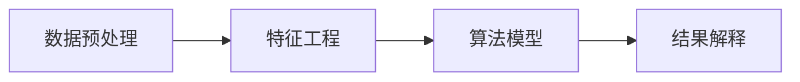

                 

# 【AI大数据计算原理与代码实例讲解】数据挖掘

## 1. 背景介绍

### 1.1 问题由来

数据挖掘（Data Mining）是大数据分析领域的一个重要分支，它通过从大量数据中提取有价值的信息和知识，帮助企业做出更为科学的决策，提高运营效率和竞争力。数据挖掘技术已经成为金融、医疗、电商、社交媒体等多个行业的重要工具，广泛应用于客户细分、风险评估、个性化推荐、内容推荐等场景。

### 1.2 问题核心关键点

数据挖掘的核心在于从数据中提取隐含的、先前未知的、对决策有潜在价值的信息。数据挖掘方法主要包括分类、聚类、关联规则挖掘、异常检测等。这些方法通过算法模型在数据集中发现规律、模式和关联，从而帮助用户发现潜在的知识和商业机会。

数据挖掘技术的发展可以追溯到上世纪80年代，但直到90年代中期，随着大数据技术的崛起和互联网的普及，数据挖掘才得以大规模应用，成为业界的热点。目前，数据挖掘已经形成了完善的理论体系和技术框架，广泛用于各个行业领域。

### 1.3 问题研究意义

研究数据挖掘技术，对于提升企业决策的科学性、增强市场竞争力、推动产业创新具有重要意义：

1. 提升决策科学性：数据挖掘可以帮助企业从海量数据中发现隐藏的知识和规律，基于数据驱动决策，提升决策的科学性和准确性。
2. 增强市场竞争力：通过个性化推荐、客户细分等技术，数据挖掘可以提升用户体验，增强企业的市场竞争力和客户粘性。
3. 推动产业创新：数据挖掘结合了统计学、机器学习、人工智能等多个领域的知识，为各行各业带来了新的技术和应用方法。
4. 促进数据驱动：数据挖掘技术能够帮助企业从数据中挖掘出有价值的信息，推动企业从以经验为主的决策模式向以数据为主的决策模式转变。
5. 促进智能应用：数据挖掘技术能够处理非结构化数据、异构数据等多种数据类型，支持更多智能应用场景，如推荐系统、智能客服、自动驾驶等。

## 2. 核心概念与联系

### 2.1 核心概念概述

数据挖掘的核心概念主要包括数据预处理、特征工程、算法模型、结果解释等，各概念之间的联系密切。

1. **数据预处理**：对原始数据进行清洗、缺失值处理、特征选择等，为后续分析提供干净、高质量的数据。数据预处理是数据挖掘的第一步，直接影响模型的性能和结果的可靠性。
2. **特征工程**：通过选择、组合、变换特征，构建更有助于模型学习的数据表示。特征工程是数据挖掘的重要环节，对模型的泛化能力和性能有显著影响。
3. **算法模型**：数据挖掘算法模型包括分类、聚类、关联规则挖掘、异常检测等多种方法。这些算法通过建立数据之间的关联和规律，发现数据中的知识。
4. **结果解释**：对模型输出进行解释和可视化，帮助用户理解数据挖掘结果，从而更好地应用于实际场景。

### 2.2 概念间的关系

这些核心概念之间存在紧密的联系，形成一个完整的系统框架，如图所示：



数据预处理和特征工程为模型训练提供数据支持，算法模型通过学习数据之间的关联和规律，输出挖掘结果，结果解释则帮助用户理解结果并应用到实际场景中。

### 2.3 核心概念的整体架构


此架构展示了数据挖掘的完整流程，包括数据收集、数据预处理、特征工程、模型训练、结果解释等环节，形成一个闭环系统。

## 3. 核心算法原理 & 具体操作步骤

### 3.1 算法原理概述

数据挖掘算法的基本原理是利用数学模型和统计学方法，从数据集中发现隐含的规律和知识。数据挖掘算法主要分为以下几类：

1. **监督学习（Supervised Learning）**：利用有标签的数据进行训练，模型能够对新数据进行预测和分类。常用的监督学习算法包括决策树、支持向量机、随机森林等。
2. **无监督学习（Unsupervised Learning）**：利用无标签的数据进行训练，发现数据之间的内在结构和规律。常用的无监督学习算法包括聚类、降维、关联规则挖掘等。
3. **半监督学习（Semi-supervised Learning）**：同时利用少量有标签数据和大量无标签数据进行训练，提高模型的泛化能力。常用的半监督学习算法包括标签传播、协同训练等。
4. **强化学习（Reinforcement Learning）**：通过与环境的交互，模型根据奖励信号进行优化。常用于游戏、机器人等领域。

### 3.2 算法步骤详解

数据挖掘的典型流程包括数据收集、数据预处理、特征选择、算法模型训练、结果解释和应用等多个环节。以下以监督学习为例，详细讲解数据挖掘的具体操作步骤：

1. **数据收集**：从企业内部和外部收集相关的数据，包括结构化数据、半结构化数据和非结构化数据。
2. **数据预处理**：对收集到的数据进行清洗、去重、缺失值处理、异常值检测等，确保数据质量。
3. **特征选择**：选择和构造对模型有用的特征，去除噪声和冗余特征，构建特征集合。
4. **算法模型训练**：选择适当的算法模型，利用训练数据进行模型训练，优化模型参数。
5. **结果解释**：对模型输出进行解释，生成可视化图表，帮助用户理解模型结果。
6. **应用与优化**：将模型应用于实际业务场景，不断优化模型，提升模型性能。

### 3.3 算法优缺点

数据挖掘算法的主要优点包括：

- **高效性**：数据挖掘能够高效地处理大规模数据，发现数据中的模式和规律，帮助企业快速做出决策。
- **鲁棒性**：数据挖掘算法能够处理噪声和缺失值，具有一定的鲁棒性，适应不同类型的数据。
- **普适性**：数据挖掘算法适用于多种行业和场景，能够解决实际问题，提升企业效率和竞争力。

同时，数据挖掘算法也存在一些缺点：

- **模型复杂性**：数据挖掘算法模型复杂，需要大量的数据和计算资源进行训练和优化。
- **结果解释困难**：一些复杂模型难以解释，用户难以理解模型输出，限制了模型的应用范围。
- **过拟合风险**：模型过度拟合训练数据，可能导致在实际应用中的性能下降。
- **数据隐私问题**：数据挖掘涉及大量个人和企业数据，存在隐私和安全风险。

### 3.4 算法应用领域

数据挖掘算法在各个行业领域都有广泛应用，以下是几个典型的应用场景：

1. **金融行业**：数据挖掘应用于信用评分、欺诈检测、投资组合优化等领域，帮助金融机构识别风险和机会，提升业务效率。
2. **电商行业**：数据挖掘应用于个性化推荐、客户细分、价格优化等领域，帮助电商平台提升用户满意度和销售业绩。
3. **医疗行业**：数据挖掘应用于疾病预测、患者分群、治疗效果评估等领域，帮助医疗机构提升医疗服务水平和患者体验。
4. **零售行业**：数据挖掘应用于库存管理、需求预测、商品推荐等领域，帮助零售商优化供应链，提升销售业绩。
5. **社交媒体**：数据挖掘应用于用户行为分析、内容推荐、情感分析等领域，帮助社交媒体平台提升用户体验和内容质量。

## 4. 数学模型和公式 & 详细讲解  
### 4.1 数学模型构建

数据挖掘算法的数学模型通常建立在统计学和机器学习的基础之上。以监督学习中的决策树算法为例，其数学模型可以表示为：

$$
P(Y|X) = \sum_{i=1}^{n} P(Y|X,x_i)P(x_i)
$$

其中，$P(Y|X)$ 表示在给定特征$X$的情况下，目标变量$Y$的条件概率，$x_i$表示第$i$个特征值，$n$表示特征值的数量。

### 4.2 公式推导过程

以决策树算法为例，其基本思想是通过递归地对特征进行二值分割，找到最佳的分割点，构建决策树。决策树算法的基本推导过程如下：

1. **划分目标**：选择一个特征$x_i$，将数据集$D$划分为两个子集$D_L$和$D_R$，使得$P(Y|X=x_i)$在两个子集上达到最大。
2. **递归分割**：对子集$D_L$和$D_R$分别重复步骤1，构建左右子树，最终形成完整的决策树。
3. **剪枝优化**：对构建好的决策树进行剪枝优化，防止过拟合。

### 4.3 案例分析与讲解

以电商平台的个性化推荐系统为例，其核心算法为协同过滤算法。协同过滤算法的基本思想是利用用户历史行为数据，发现用户之间的相似性，为用户推荐其未尝试过的商品。协同过滤算法的数学模型可以表示为：

$$
R_{ij} = \sum_{k=1}^{n}P_{ik}P_{kj}
$$

其中，$R_{ij}$表示用户$i$对商品$j$的评分，$P_{ik}$表示用户$i$对商品$k$的评分，$P_{kj}$表示用户$k$对商品$j$的评分，$n$表示商品数量。

## 5. 项目实践：代码实例和详细解释说明

### 5.1 开发环境搭建

数据挖掘项目一般需要大量的数据和计算资源，因此需要配置合适的开发环境。以下是一个典型的Python数据挖掘项目开发环境配置流程：

1. **安装Python和相关库**：
   - 安装Python 3.x版本，可以使用Anaconda或Miniconda进行环境管理。
   - 安装常用的数据挖掘库，如Pandas、NumPy、Scikit-learn、TensorFlow等。

2. **安装数据预处理和特征工程库**：
   - 安装数据清洗和预处理库，如Pandas、OpenCV、NLTK等。
   - 安装特征工程库，如Scikit-learn、TF-IDF、LDA等。

3. **安装可视化工具**：
   - 安装数据可视化库，如Matplotlib、Seaborn、Plotly等。
   - 安装交互式可视化库，如Bokeh、Dash等。

4. **安装机器学习库**：
   - 安装常用的机器学习库，如Scikit-learn、TensorFlow、Keras等。

5. **安装部署工具**：
   - 安装应用程序部署工具，如Flask、Django等。
   - 安装容器化工具，如Docker、Kubernetes等。

完成上述步骤后，即可在配置好的环境中进行数据挖掘项目的开发和部署。

### 5.2 源代码详细实现

以下是一个简单的数据挖掘项目，使用Scikit-learn库实现决策树算法对顾客是否购买商品的分类任务：

```python
# 导入必要的库
import pandas as pd
from sklearn.model_selection import train_test_split
from sklearn.tree import DecisionTreeClassifier
from sklearn.metrics import accuracy_score

# 读取数据
data = pd.read_csv('customer_purchase.csv')

# 数据预处理
data = data.dropna()

# 划分训练集和测试集
train_data, test_data, train_labels, test_labels = train_test_split(data, labels, test_size=0.2, random_state=42)

# 特征工程
train_features = train_data.drop('label', axis=1)
test_features = test_data.drop('label', axis=1)

# 模型训练
clf = DecisionTreeClassifier()
clf.fit(train_features, train_labels)

# 模型评估
predictions = clf.predict(test_features)
accuracy = accuracy_score(test_labels, predictions)
print('Accuracy:', accuracy)
```

### 5.3 代码解读与分析

上述代码实现了使用决策树算法对顾客是否购买商品的分类任务。以下是对关键代码的解读和分析：

1. **数据读取和预处理**：
   - `pd.read_csv('customer_purchase.csv')`：从CSV文件中读取数据。
   - `data = data.dropna()`：删除缺失值，保证数据完整性。

2. **数据划分**：
   - `train_data, test_data, train_labels, test_labels = train_test_split(data, labels, test_size=0.2, random_state=42)`：将数据划分为训练集和测试集，设置测试集占总数据集的20%。

3. **特征工程**：
   - `train_features = train_data.drop('label', axis=1)`：删除标签列，得到训练集特征。
   - `test_features = test_data.drop('label', axis=1)`：删除标签列，得到测试集特征。

4. **模型训练**：
   - `clf = DecisionTreeClassifier()`：创建决策树分类器对象。
   - `clf.fit(train_features, train_labels)`：使用训练集数据训练模型。

5. **模型评估**：
   - `predictions = clf.predict(test_features)`：对测试集数据进行预测。
   - `accuracy = accuracy_score(test_labels, predictions)`：计算预测准确率。
   - `print('Accuracy:', accuracy)`：输出准确率。

### 5.4 运行结果展示

假设上述代码运行后，输出的准确率结果为0.85，表示模型能够正确预测85%的顾客是否购买商品，达到了较高的预测效果。

## 6. 实际应用场景

### 6.1 智能客服

智能客服系统利用数据挖掘技术，通过分析客户的历史对话数据，预测客户的意图和需求，提供个性化的服务。在实际应用中，智能客服系统可以结合自然语言处理和机器学习算法，对客户提出的问题进行快速响应，提高客户满意度。

### 6.2 营销自动化

营销自动化系统通过数据挖掘技术，分析客户的行为数据，识别出高价值客户和潜在客户，制定个性化的营销策略，提升销售额和客户转化率。在实际应用中，营销自动化系统可以结合客户细分、客户画像、推荐系统等技术，提供精准的营销方案。

### 6.3 金融风险管理

金融风险管理通过数据挖掘技术，分析客户的信用数据和交易数据，预测客户的违约风险，制定风险控制策略，降低不良贷款率。在实际应用中，金融风险管理系统可以结合信用评分、欺诈检测、信用评分等技术，提升风险管理的准确性和效率。

### 6.4 供应链优化

供应链优化通过数据挖掘技术，分析供应链中的数据，识别出供应链中的瓶颈和风险点，优化供应链流程，提升供应链效率和稳定性。在实际应用中，供应链优化系统可以结合需求预测、库存管理、物流优化等技术，提供更为科学和高效的供应链管理方案。

## 7. 工具和资源推荐

### 7.1 学习资源推荐

为了帮助开发者系统掌握数据挖掘的理论基础和实践技巧，以下是一些优质的学习资源：

1. 《数据挖掘导论》：这是一本经典的教材，系统介绍了数据挖掘的基本概念、算法和技术。
2. 《机器学习实战》：该书结合了Python和Scikit-learn库，提供了很多实际案例和代码，适合实战学习。
3. 《Python数据科学手册》：该书介绍了Python在数据挖掘和机器学习中的广泛应用，适合初学者入门。
4. Kaggle：这是一个著名的数据挖掘竞赛平台，提供丰富的数据集和竞赛题目，适合实战练习。
5. Coursera：这是一个在线教育平台，提供多个数据挖掘相关课程，涵盖从入门到高级的内容。

通过这些学习资源的学习，可以全面掌握数据挖掘的理论基础和实践技巧，为实际应用奠定坚实的基础。

### 7.2 开发工具推荐

数据挖掘项目通常需要大量的数据和计算资源，因此需要选择合适的开发工具。以下是几个常用的数据挖掘开发工具：

1. Python：Python是数据挖掘领域最流行的编程语言之一，具有丰富的库和工具支持。
2. R语言：R语言是另一个常用的数据挖掘工具，具有强大的统计分析和可视化功能。
3. Scikit-learn：Scikit-learn是Python中最流行的机器学习库之一，提供了多种数据挖掘算法。
4. TensorFlow：TensorFlow是谷歌开发的深度学习框架，适合处理大规模数据集。
5. PyTorch：PyTorch是Facebook开发的深度学习框架，具有灵活的动态计算图。

选择合适的开发工具，可以大大提高数据挖掘项目的开发效率和性能。

### 7.3 相关论文推荐

数据挖掘技术的发展得益于学术界的不懈探索和创新。以下是几篇重要的相关论文，推荐阅读：

1. "Data Mining: Concepts and Techniques"：这是一本经典的教材，涵盖了数据挖掘的各个方面，是数据挖掘领域的必读之作。
2. "Introduction to Data Mining in Python"：这是一本实用的教材，介绍了Python在数据挖掘中的应用，适合实战学习。
3. "Data Mining and Statistical Learning"：这是一本系统介绍了数据挖掘和统计学习的书籍，适合深入学习。
4. "Machine Learning: A Probabilistic Perspective"：这是一本经典的机器学习教材，涵盖了很多数据挖掘算法和理论。
5. "The Elements of Statistical Learning"：这是一本统计学习领域的经典书籍，涵盖了数据挖掘和机器学习中的统计方法和理论。

这些论文代表了大数据挖掘领域的最新进展，通过阅读这些论文，可以深入理解数据挖掘的原理和应用。

## 8. 总结：未来发展趋势与挑战

### 8.1 研究成果总结

数据挖掘技术经过多年的发展，已经形成了比较成熟的技术框架和方法体系。其主要研究方向包括：

1. **模型优化**：优化数据挖掘算法模型，提高模型准确性和泛化能力。
2. **特征选择**：研究如何选择合适的特征，提升模型性能和解释能力。
3. **数据预处理**：研究如何处理噪声、缺失值和异常值，提高数据质量。
4. **算法融合**：研究如何融合多种算法，提高模型稳定性和鲁棒性。
5. **可视化分析**：研究如何可视化数据挖掘结果，帮助用户理解模型输出。

### 8.2 未来发展趋势

未来数据挖掘技术将呈现以下几个发展趋势：

1. **大数据挖掘**：随着数据量的不断增加，大数据挖掘技术将成为数据挖掘领域的重要方向，能够处理海量数据，发现更为复杂的规律和知识。
2. **跨领域挖掘**：数据挖掘技术将跨越不同领域，结合多模态数据，提升模型的综合能力。
3. **实时挖掘**：实时数据挖掘技术将进一步发展，支持实时数据处理和分析，提升业务决策的及时性。
4. **深度学习融合**：深度学习技术将与数据挖掘技术深度融合，提升模型的复杂性和准确性。
5. **智能挖掘**：结合人工智能技术，数据挖掘技术将更加智能化，能够处理更复杂的问题。

### 8.3 面临的挑战

尽管数据挖掘技术已经取得了显著的进展，但仍面临诸多挑战：

1. **数据隐私问题**：数据挖掘涉及大量个人和企业数据，存在隐私和安全风险。
2. **模型可解释性**：复杂的数据挖掘模型难以解释，用户难以理解模型输出，限制了模型的应用范围。
3. **数据质量问题**：数据挖掘算法对数据质量要求较高，数据不完整、不规范等问题将影响模型性能。
4. **计算资源问题**：大规模数据挖掘任务需要大量的计算资源，硬件成本较高。
5. **模型过拟合**：复杂的数据挖掘模型容易过拟合，导致模型泛化能力不足。

### 8.4 研究展望

为了应对这些挑战，未来的数据挖掘研究需要在以下几个方面进行突破：

1. **数据隐私保护**：研究如何保护数据隐私和安全，确保数据挖掘的应用范围和合法性。
2. **模型可解释性**：研究如何提高模型的可解释性，帮助用户理解和信任模型输出。
3. **数据预处理**：研究如何提高数据质量和数据处理效率，确保数据挖掘的准确性和稳定性。
4. **计算资源优化**：研究如何优化计算资源，降低数据挖掘的硬件成本和运行时间。
5. **跨领域融合**：研究如何结合多种技术，提升数据挖掘的跨领域能力和综合性能。

## 9. 附录：常见问题与解答

**Q1：数据挖掘中常用的算法有哪些？**

A: 数据挖掘中常用的算法包括分类算法（如决策树、支持向量机、随机森林等）、聚类算法（如K-means、层次聚类等）、关联规则挖掘算法（如Apriori、FP-growth等）、异常检测算法（如孤立森林、DBSCAN等）等。

**Q2：数据挖掘中如何进行特征选择？**

A: 特征选择是数据挖掘中的重要环节，常用的特征选择方法包括方差选择、卡方检验、互信息选择等。同时，也可以通过特征重要性排序、正则化方法等提高特征选择的效果。

**Q3：数据挖掘中如何进行数据预处理？**

A: 数据预处理包括数据清洗、缺失值处理、异常值检测等。具体方法包括删除缺失值、插值、标准化、归一化等。

**Q4：数据挖掘中如何提高模型可解释性？**

A: 提高模型可解释性可以从以下几个方面入手：选择简单模型、使用可视化工具、加入专家知识、结合领域知识等。

**Q5：数据挖掘中如何进行跨领域挖掘？**

A: 跨领域挖掘可以通过结合多模态数据、跨领域数据融合、领域知识抽取等方法实现。同时，还可以通过迁移学习和多任务学习等技术，提升模型的跨领域能力。

---

作者：禅与计算机程序设计艺术 / Zen and the Art of Computer Programming

