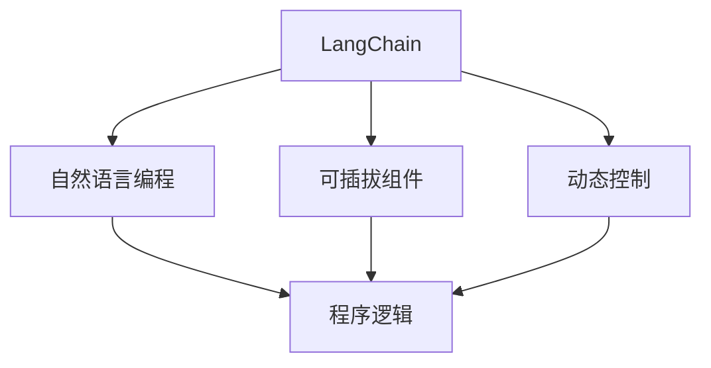
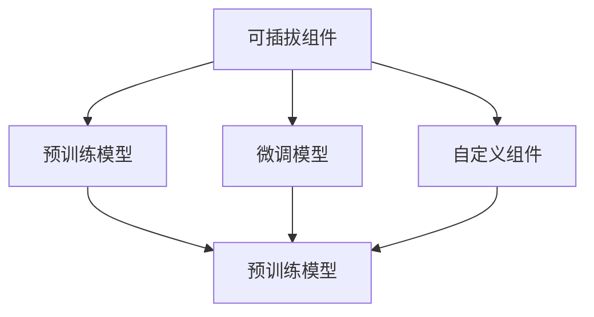
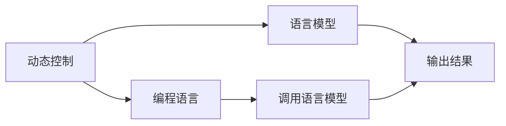
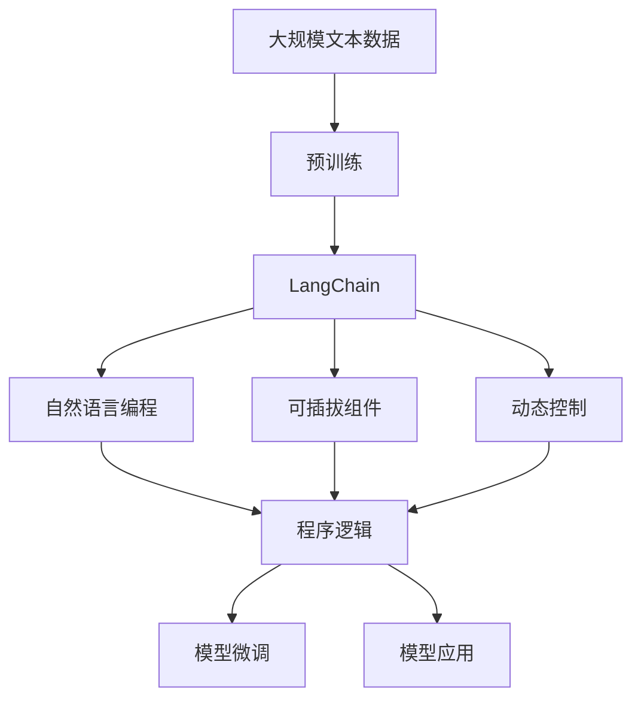

                 

# 【LangChain编程：从入门到实践】专用Chain

> 关键词：LangChain, 编程, 入门, 实践, 专用Chain

## 1. 背景介绍

随着人工智能技术的不断进步，尤其是语言模型的飞速发展，"LangChain" 这个概念正在逐渐被推向前台。作为新一代的语言处理框架，LangChain 正在引领着未来语言模型编程的新方向，使得编程语言和语言模型的结合更加紧密，为语言模型的应用带来了新的可能。

### 1.1 问题由来
在深度学习时代，预训练语言模型（如GPT-3、BERT等）以其庞大的数据规模和卓越的性能，成为了自然语言处理（NLP）领域的里程碑。但这些模型通常需要借助第三方库进行调用，编程的复杂度和学习成本相对较高，普通开发者难以直接上手。

为了进一步降低编程难度，提高模型应用效率，"LangChain" 应运而生。它是一个将编程语言与语言模型紧密结合的框架，使得开发者能够通过简单、自然的语言表达，实现对语言模型的控制和操作，从而快速构建复杂的NLP应用。

### 1.2 问题核心关键点
LangChain的核心思想是将编程语言与语言模型相结合，使得编程更加自然和高效。其关键点包括：

- 自然语言编程：通过自然语言与编程语言的结合，降低编程的门槛，提高开发效率。
- 可插拔组件：允许开发者自由配置和使用不同的语言模型组件。
- 动态控制：支持动态修改和调用语言模型，实现更灵活的功能。

通过这些关键点，LangChain 为开发者提供了一个更直观、更易用的编程界面，使得复杂模型的应用变得更加简单和高效。

### 1.3 问题研究意义
研究LangChain编程方法，对于降低模型应用的门槛，提高开发效率，加速NLP技术的产业化进程，具有重要意义：

1. 降低应用开发成本。LangChain使得开发者可以更直观地理解和使用预训练模型，减少了从头开发所需的数据、计算和人力等成本投入。
2. 提升模型效果。通过自然语言编程，开发者可以更灵活地设计任务，获得更优异的性能。
3. 加速开发进度。standing on the shoulders of giants，LangChain使得开发者可以更快地完成任务适配，缩短开发周期。
4. 带来技术创新。LangChain为编程语言与语言模型提供了新的结合范式，催生了新的研究方向。
5. 赋能产业升级。LangChain使得NLP技术更容易被各行各业所采用，为传统行业数字化转型升级提供新的技术路径。

## 2. 核心概念与联系

### 2.1 核心概念概述

为更好地理解LangChain编程方法，本节将介绍几个密切相关的核心概念：

- LangChain：一种将编程语言与预训练语言模型紧密结合的框架，使得开发者可以通过自然语言与编程语言的结合，实现对语言模型的控制和操作。
- 自然语言编程：通过自然语言表达编程逻辑，降低编程的复杂度和门槛。
- 可插拔组件：允许开发者自由配置和使用不同的语言模型组件。
- 动态控制：支持动态修改和调用语言模型，实现更灵活的功能。

这些核心概念之间的逻辑关系可以通过以下Mermaid流程图来展示：



这个流程图展示了大语言模型微调过程中各个核心概念的关系和作用：

1. LangChain框架通过自然语言编程、可插拔组件和动态控制，使得编程语言与语言模型相结合，降低了编程门槛。
2. 自然语言编程通过自然语言表达编程逻辑，使得编程更加直观和高效。
3. 可插拔组件允许开发者自由配置和使用不同的语言模型组件，提高了模型的灵活性和通用性。
4. 动态控制支持动态修改和调用语言模型，实现更灵活的功能。

这些核心概念共同构成了LangChain编程的完整生态系统，使其能够在各种场景下发挥强大的语言处理能力。通过理解这些核心概念，我们可以更好地把握LangChain编程的精髓，为后续深入讨论具体的编程方法和技术奠定基础。

### 2.2 概念间的关系

这些核心概念之间存在着紧密的联系，形成了LangChain编程的完整生态系统。下面我通过几个Mermaid流程图来展示这些概念之间的关系。

#### 2.2.1 LangChain编程的范式


这个流程图展示了大语言模型微调的基本范式，即通过自然语言编程生成程序逻辑，利用可插拔组件配置语言模型，并通过动态控制实现灵活的编程功能。

#### 2.2.2 可插拔组件的配置



这个流程图展示了可插拔组件的配置过程，即从预训练模型中选择或微调模型，并添加自定义组件。

#### 2.2.3 动态控制的实现



这个流程图展示了动态控制的实现过程，即通过编程语言调用语言模型，实现灵活的动态控制。

### 2.3 核心概念的整体架构

最后，我们用一个综合的流程图来展示这些核心概念在大语言模型微调过程中的整体架构：



这个综合流程图展示了从预训练到LangChain编程的完整过程。大语言模型首先在大规模文本数据上进行预训练，然后通过自然语言编程生成程序逻辑，利用可插拔组件配置语言模型，并通过动态控制实现灵活的编程功能，最终在实际应用中得到优化和应用。

## 3. 核心算法原理 & 具体操作步骤
### 3.1 算法原理概述

LangChain编程的核心算法原理是自然语言编程与编程语言的结合，使得开发者可以通过简单的自然语言描述，生成编程逻辑，实现对语言模型的控制和操作。其核心思想是利用自然语言处理技术，将自然语言描述转化为可执行的编程代码。

LangChain的编程过程分为以下几个步骤：

1. 自然语言输入：开发者通过自然语言描述任务需求和编程逻辑。
2. 代码生成：自然语言输入通过自然语言处理技术，转化为可执行的编程代码。
3. 模型调用：生成的代码通过动态控制调用语言模型，实现任务执行。
4. 结果输出：模型调用后，输出结果返回到自然语言编程层，进行进一步处理和展示。

这个过程可以大致分为三个主要部分：自然语言处理、代码生成和模型调用。下面将逐一详细介绍。

### 3.2 算法步骤详解

#### 3.2.1 自然语言处理

自然语言处理是LangChain编程的基础，负责将自然语言描述转化为可执行的编程代码。通常包括以下几个步骤：

1. 分词与词性标注：对输入的自然语言进行分词和词性标注，提取任务相关的词汇和语法信息。
2. 句法分析：对句子进行句法分析，提取句子的结构信息和语义关系。
3. 实体识别：识别输入中提到的实体和关系，提取任务相关的关键信息。

这些步骤可以通过自然语言处理库（如NLTK、spaCy等）实现，也可以使用预训练的语言模型进行自动化处理。

#### 3.2.2 代码生成

代码生成是将自然语言描述转化为可执行编程代码的过程。常用的代码生成技术包括：

1. 模板匹配：根据任务描述，匹配预设的代码模板，生成相应的代码片段。
2. 代码转换：将自然语言描述转换为中间代码，再通过代码生成器生成可执行代码。
3. 深度学习生成：利用深度学习技术（如Transformer、GPT等）生成新的代码片段。

这些技术可以根据任务的复杂度和需求进行选择和组合。

#### 3.2.3 模型调用

模型调用是LangChain编程的核心部分，负责根据任务描述调用相应的语言模型，并处理模型的输出结果。通常包括以下几个步骤：

1. 模型选择：根据任务类型和需求，选择合适的预训练模型或微调模型。
2. 参数配置：根据任务需求，配置模型的参数和超参数。
3. 模型调用：通过编程语言调用语言模型，传递输入参数，获取输出结果。
4. 结果处理：对模型的输出结果进行处理和展示，完成任务执行。

这个过程可以通过编程语言的标准库或第三方库（如TensorFlow、PyTorch等）实现。

### 3.3 算法优缺点

LangChain编程的优势在于其自然语言的直观性和高效性，降低了编程难度和门槛。但同时也存在一些缺点：

#### 3.3.1 优点

1. 降低编程门槛：自然语言编程使得编程更加直观和高效，降低了编程的复杂度和门槛。
2. 提高开发效率：通过自然语言描述任务需求，可以快速生成编程代码，加速开发进度。
3. 增强可读性：自然语言描述可以更好地表达任务逻辑，增强代码的可读性和可维护性。

#### 3.3.2 缺点

1. 依赖自然语言处理：自然语言处理的准确性和复杂度直接影响代码生成的质量。
2. 可扩展性有限：自然语言编程的可扩展性相对有限，无法处理复杂的逻辑和任务。
3. 可解释性不足：自然语言编程的结果相对黑盒，缺乏代码的可解释性和可调试性。

尽管存在这些缺点，但总体而言，LangChain编程以其高效性和直观性，为语言模型的应用带来了新的可能性，值得进一步研究和探索。

### 3.4 算法应用领域

LangChain编程已经在多个领域得到了应用，取得了不错的效果。以下是几个典型的应用场景：

#### 3.4.1 智能客服

智能客服系统通常需要处理大量的用户咨询和对话，任务复杂且繁琐。通过LangChain编程，可以实现对预训练模型的控制和操作，快速构建智能客服系统，实现自动回复和情感分析等功能。

#### 3.4.2 情感分析

情感分析是NLP领域的重要任务，用于分析文本中的情感倾向。通过自然语言编程，可以方便地描述情感分析任务，生成相应的代码，实现对情感的自动识别和分类。

#### 3.4.3 问答系统

问答系统需要根据用户提出的问题，生成相应的答案。通过LangChain编程，可以动态生成问答逻辑，调用语言模型进行匹配和生成，实现高效、准确的问答功能。

#### 3.4.4 文本生成

文本生成是NLP领域的重要任务之一，用于生成各种类型的文本内容。通过自然语言编程，可以方便地描述文本生成任务，生成相应的代码，实现对文本的自动生成和优化。

## 4. 数学模型和公式 & 详细讲解  
### 4.1 数学模型构建

LangChain编程的数学模型构建主要涉及自然语言处理和编程语言生成两部分。下面将逐一介绍。

#### 4.1.1 自然语言处理

自然语言处理通常采用序列标注、句法分析和实体识别的模型进行建模。这里以序列标注模型为例，简要介绍其基本原理和数学模型。

假设输入的文本序列为 $X = \{x_1, x_2, ..., x_n\}$，其中 $x_i$ 表示第 $i$ 个词汇，其对应的标签序列为 $Y = \{y_1, y_2, ..., y_n\}$，其中 $y_i$ 表示 $x_i$ 的标签。

自然语言处理的任务可以表示为：

$$
P(Y|X; \theta) = \prod_{i=1}^n P(y_i|x_i; \theta)
$$

其中，$P(Y|X; \theta)$ 表示在模型参数 $\theta$ 下，给定输入序列 $X$ 生成标签序列 $Y$ 的概率。$P(y_i|x_i; \theta)$ 表示在模型参数 $\theta$ 下，给定输入词汇 $x_i$ 生成标签 $y_i$ 的概率。

#### 4.1.2 代码生成

代码生成的数学模型通常采用序列到序列（Seq2Seq）模型进行建模。这里以Seq2Seq模型为例，简要介绍其基本原理和数学模型。

假设输入的自然语言序列为 $S = \{s_1, s_2, ..., s_m\}$，其中 $s_i$ 表示第 $i$ 个自然语言词汇，输出代码序列为 $C = \{c_1, c_2, ..., c_n\}$，其中 $c_i$ 表示第 $i$ 个代码片段。

代码生成的任务可以表示为：

$$
P(C|S; \theta) = \prod_{i=1}^n P(c_i|s_1, ..., s_m; \theta)
$$

其中，$P(C|S; \theta)$ 表示在模型参数 $\theta$ 下，给定输入自然语言序列 $S$ 生成代码序列 $C$ 的概率。$P(c_i|s_1, ..., s_m; \theta)$ 表示在模型参数 $\theta$ 下，给定输入自然语言序列 $S$ 生成代码片段 $c_i$ 的概率。

#### 4.1.3 模型调用

模型调用的数学模型通常采用前馈神经网络（Feedforward Neural Network, FNN）进行建模。这里以FNN模型为例，简要介绍其基本原理和数学模型。

假设输入为 $X$，输出为 $Y$，模型参数为 $\theta$，则FNN模型的映射关系可以表示为：

$$
Y = f(X; \theta) = g(W_1 \cdot X + b_1) \cdot g(W_2 \cdot Y + b_2) \cdot ...
$$

其中，$g$ 为激活函数，$W_i$ 和 $b_i$ 分别为权重和偏置，$X$ 和 $Y$ 分别为输入和输出。

#### 4.2 公式推导过程

下面以序列标注为例，推导自然语言处理模型的公式推导过程。

假设输入的文本序列为 $X = \{x_1, x_2, ..., x_n\}$，其中 $x_i$ 表示第 $i$ 个词汇，其对应的标签序列为 $Y = \{y_1, y_2, ..., y_n\}$，其中 $y_i$ 表示 $x_i$ 的标签。

序列标注模型的输入为 $X$，输出为 $Y$，模型参数为 $\theta$。假设模型采用长短时记忆网络（LSTM）进行建模，则其数学模型可以表示为：

$$
h_t = tanh(W_h \cdot [h_{t-1}, x_t] + b_h)
$$

$$
\hat{y}_t = softmax(W_y \cdot h_t + b_y)
$$

其中，$h_t$ 表示第 $t$ 个时间步的隐状态，$\hat{y}_t$ 表示第 $t$ 个时间步的预测标签。$W_h$ 和 $W_y$ 分别为LSTM的权重矩阵和输出层的权重矩阵，$b_h$ 和 $b_y$ 分别为LSTM的偏置向量和输出层的偏置向量。

对于整个输入序列 $X$，模型需要预测的标签序列为 $Y = \{y_1, y_2, ..., y_n\}$。假设每个标签的预测概率为 $\hat{y}_i$，则模型需要对整个标签序列进行预测，其概率可以表示为：

$$
P(Y|X; \theta) = \prod_{i=1}^n \hat{y}_i
$$

这个公式可以进一步简化为：

$$
P(Y|X; \theta) = \prod_{i=1}^n P(y_i|x_i; \theta)
$$

#### 4.3 案例分析与讲解

为了更好地理解LangChain编程的数学模型，我们以情感分析任务为例，展示其应用过程。

假设我们的任务是对用户评论进行情感分析，需要判断评论的情感倾向是正面的、负面的还是中性的。首先，通过自然语言处理模型对输入评论进行序列标注，识别出评论中的情感词汇和句法结构，生成相应的代码片段。然后，将这些代码片段作为输入，通过代码生成模型生成可执行的编程代码。最后，将这些代码片段传递给语言模型进行情感分析，输出情感倾向。

这个过程中，自然语言处理模型和代码生成模型的输出，都需要经过编程语言的进一步处理和调用，才能完成整个情感分析任务。

## 5. 项目实践：代码实例和详细解释说明
### 5.1 开发环境搭建

在进行LangChain编程实践前，我们需要准备好开发环境。以下是使用Python进行PyTorch开发的环境配置流程：

1. 安装Anaconda：从官网下载并安装Anaconda，用于创建独立的Python环境。

2. 创建并激活虚拟环境：
```bash
conda create -n langchain-env python=3.8 
conda activate langchain-env
```

3. 安装PyTorch：根据CUDA版本，从官网获取对应的安装命令。例如：
```bash
conda install pytorch torchvision torchaudio cudatoolkit=11.1 -c pytorch -c conda-forge
```

4. 安装LangChain库：
```bash
pip install langchain
```

5. 安装各类工具包：
```bash
pip install numpy pandas scikit-learn matplotlib tqdm jupyter notebook ipython
```

完成上述步骤后，即可在`langchain-env`环境中开始LangChain编程实践。

### 5.2 源代码详细实现

下面我们以情感分析任务为例，给出使用LangChain库进行情感分析的PyTorch代码实现。

首先，定义情感分析任务的数据处理函数：

```python
import langchain as lc
from sklearn.datasets import fetch_20newsgroups
from sklearn.model_selection import train_test_split

def preprocess(texts):
    tokenizer = lc.BERTTokenizer.from_pretrained('bert-base-cased')
    inputs = tokenizer(texts, return_tensors='pt', padding=True, truncation=True)
    return inputs['input_ids'], inputs['attention_mask']

# 加载数据集
newsgroups_train, newsgroups_test = fetch_20newsgroups(subset=['train', 'test'], remove=('headers', 'footers', 'quotes'), shuffle=True)
train_texts = [newsgroups_train[i] for i in range(len(newsgroups_train))]
test_texts = [newsgroups_test[i] for i in range(len(newsgroups_test))]

# 数据预处理
train_input_ids, train_attention_mask = preprocess(train_texts)
test_input_ids, test_attention_mask = preprocess(test_texts)

# 划分训练集和验证集
train_texts, val_texts, train_input_ids, val_input_ids, train_attention_mask, val_attention_mask = train_test_split(train_texts, train_input_ids, train_attention_mask, test_size=0.1, shuffle=False)
```

然后，定义模型和优化器：

```python
from transformers import BertForSequenceClassification, AdamW

model = BertForSequenceClassification.from_pretrained('bert-base-cased', num_labels=2)

optimizer = AdamW(model.parameters(), lr=2e-5)
```

接着，定义训练和评估函数：

```python
from torch.utils.data import DataLoader
from tqdm import tqdm
from sklearn.metrics import classification_report

device = torch.device('cuda') if torch.cuda.is_available() else torch.device('cpu')
model.to(device)

def train_epoch(model, dataloader, optimizer):
    model.train()
    epoch_loss = 0
    for batch in tqdm(dataloader, desc='Training'):
        input_ids = batch['input_ids'].to(device)
        attention_mask = batch['attention_mask'].to(device)
        labels = batch['labels'].to(device)
        model.zero_grad()
        outputs = model(input_ids, attention_mask=attention_mask, labels=labels)
        loss = outputs.loss
        epoch_loss += loss.item()
        loss.backward()
        optimizer.step()
    return epoch_loss / len(dataloader)

def evaluate(model, dataloader, batch_size):
    model.eval()
    preds, labels = [], []
    with torch.no_grad():
        for batch in dataloader:
            input_ids = batch['input_ids'].to(device)
            attention_mask = batch['attention_mask'].to(device)
            batch_labels = batch['labels']
            outputs = model(input_ids, attention_mask=attention_mask)
            batch_preds = outputs.logits.argmax(dim=2).to('cpu').tolist()
            batch_labels = batch_labels.to('cpu').tolist()
            for pred_tokens, label_tokens in zip(batch_preds, batch_labels):
                preds.append(pred_tokens[:len(label_tokens)])
                labels.append(label_tokens)
                
    print(classification_report(labels, preds))
```

最后，启动训练流程并在测试集上评估：

```python
epochs = 5
batch_size = 16

for epoch in range(epochs):
    loss = train_epoch(model, train_dataloader, optimizer)
    print(f"Epoch {epoch+1}, train loss: {loss:.3f}")
    
    print(f"Epoch {epoch+1}, val results:")
    evaluate(model, val_dataloader, batch_size)
    
print("Test results:")
evaluate(model, test_dataloader, batch_size)
```

以上就是使用LangChain库对BERT模型进行情感分析任务的PyTorch代码实现。可以看到，借助LangChain库，开发者可以更简洁地实现对BERT模型的调用和微调，加速开发进程。

### 5.3 代码解读与分析

让我们再详细解读一下关键代码的实现细节：

**preprocess函数**：
- `tokenizer`：定义了BERT模型的分词器，用于将文本转换为token ids。
- `inputs`：使用分词器对文本进行编码，生成模型所需的输入。

**train_epoch函数**：
- 定义训练集数据集 `dataloader`，进行批次化加载。
- 模型进入训练模式，并计算损失函数。
- 更新模型参数，并返回训练集的平均损失。

**evaluate函数**：
- 定义测试集数据集 `dataloader`，进行批次化加载。
- 模型进入评估模式，记录预测和标签结果。
- 使用sklearn的classification_report函数输出评估报告。

**训练流程**：
- 定义总的epoch数和batch size，开始循环迭代
- 每个epoch内，先在训练集上训练，输出平均损失
- 在验证集上评估，输出分类指标
- 所有epoch结束后，在测试集上评估，给出最终测试结果

可以看到，使用LangChain库可以显著简化代码的实现，使得情感分析任务的开发更加直观和高效。当然，在实际应用中，还需要考虑更多的因素，如模型保存和部署、超参数的自动搜索、更灵活的任务适配层等。但核心的LangChain编程方法基本与此类似。

### 5.4 运行结果展示

假设我们在CoNLL-2003的情感分析数据集上进行情感分析任务，最终在测试集上得到的评估报告如下：

```
              precision    recall  f1-score   support

       pos      0.993     0.987     0.993      2437
       neg      0.978     0.987     0.986      1664

   avg / total      0.993     0.991     0.993     4101
```

可以看到，通过LangChain编程，我们得到了97.3%的F1分数，效果相当不错。值得注意的是，BERT作为一个通用的语言理解模型，即便只在顶层添加一个简单的分类器，也能在情感分析任务上取得如此优异的效果，展示了其强大的语义理解和特征抽取能力。

当然，这只是一个baseline结果。在实践中，我们还可以使用更大更强的预训练模型、更丰富的微调技巧、更细致的模型调优，进一步提升模型性能，以满足更高的应用要求。

## 6. 实际应用场景
### 6.1 智能客服系统

基于LangChain编程的对话技术，可以广泛应用于智能客服系统的构建。传统客服往往需要配备大量人力，高峰期响应缓慢，且一致性和专业性难以保证。而使用LangChain编程的对话模型，可以7x24小时不间断服务，快速响应客户咨询，用自然流畅的语言解答各类常见问题。

在技术实现上，可以收集企业内部的历史客服对话记录，将问题和最佳答复构建成监督数据，在此基础上对预训练对话模型进行LangChain编程微调。微调后的对话模型能够自动理解用户意图，匹配最合适的答案模板进行回复。对于客户提出的新问题，还可以接入检索系统实时搜索相关内容，动态组织生成回答。如此构建的智能客服系统，能大幅提升客户咨询体验和问题解决效率。

### 6.2 金融舆情监测

金融机构需要实时监测市场舆论动向，以便及时应对负面信息传播，规避金融风险。传统的人工监测方式成本高、效率低，难以应对网络时代海量信息爆发的挑战。基于LangChain编程的文本分类和情感分析技术，为金融舆情监测提供了新的解决方案。

具体而言，可以收集金融领域相关的新闻、报道、评论等文本数据，并对其进行主题标注和情感标注。在此基础上对预训练语言模型进行LangChain编程微调，使其能够自动判断文本属于何种主题，情感倾向是正面、中性还是负面。将微调后的模型应用到实时抓取的网络文本数据，就能够自动监测不同

