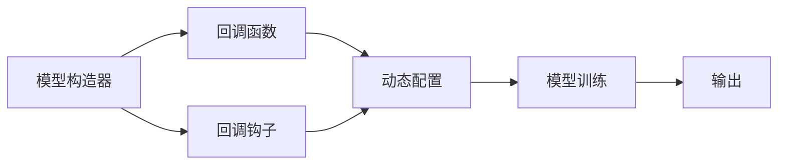
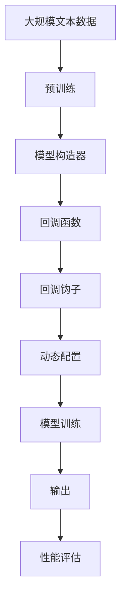

                 

# 【LangChain编程：从入门到实践】构造器回调

在语言模型的编程实践中，构造器回调（Constructors Callbacks）是一种高级的编程技巧，用于在模型训练过程中进行动态配置和优化。本文将详细探讨构造器回调的概念、原理、操作步骤以及应用场景，并结合具体案例进行深入分析，最后总结其未来发展趋势及面临的挑战。

## 1. 背景介绍

### 1.1 问题由来
随着深度学习技术的发展，语言模型在自然语言处理（NLP）领域取得了显著的进展。然而，模型训练过程中可能存在超参数调优、动态数据加载、模型优化等复杂操作，这些操作往往需要占用大量的计算资源和时间。为了提高模型训练效率，许多框架如TensorFlow和PyTorch引入了构造器回调（Constructors Callbacks）机制，允许在训练过程中动态修改模型参数和行为，从而实现更加灵活和高效的模型训练。

### 1.2 问题核心关键点
构造器回调允许在模型训练过程中动态配置和修改模型参数，通过在训练过程中设置回调函数，可以在特定的训练轮次、特定的训练阶段或满足特定条件时执行特定的操作，如模型权重更新、学习率调整、模型检查点保存等。这种机制使得训练过程更加灵活和可控，能够更好地适应各种复杂的应用场景。

### 1.3 问题研究意义
构造器回调在模型训练中的应用，可以极大地提升训练效率，减少计算资源的消耗，同时提高模型性能。通过合理设置回调函数，可以实现更加智能和高效的模型训练，从而推动NLP技术在实际应用中的广泛应用。

## 2. 核心概念与联系

### 2.1 核心概念概述

构造器回调是指在模型训练过程中，通过动态配置和修改模型参数，实现更加灵活和高效的模型训练。构造器回调通常包括以下几个关键组件：

- **模型构造器（Model Constructor）**：定义模型的基本结构和参数，如模型的层数、每层神经元数量、激活函数等。
- **回调函数（Callback Functions）**：在模型训练过程中，根据特定条件触发执行的函数，如学习率调整、模型保存、打印日志等。
- **回调钩子（Callback Hooks）**：在训练过程中，特定的训练轮次或特定条件触发时执行的回调函数。
- **动态配置（Dynamic Configuration）**：根据训练过程中的数据和状态，动态修改模型参数和行为，以提高模型训练效果。

这些组件通过交互和协同工作，实现了模型训练的动态化和灵活化，使得训练过程更加智能和高效。

### 2.2 概念间的关系

这些核心概念之间存在着紧密的联系，形成了模型训练的完整生态系统。下面通过一个Mermaid流程图来展示这些概念之间的关系：



这个流程图展示了构造器回调的基本流程：

1. 模型构造器定义模型的基本结构和参数。
2. 回调函数根据特定条件触发执行。
3. 回调钩子在模型训练过程中特定轮次或条件触发。
4. 动态配置根据训练过程中的数据和状态，修改模型参数和行为。
5. 模型训练过程中，动态配置和回调函数协同工作，完成模型训练。
6. 输出训练结果，评估模型性能。

### 2.3 核心概念的整体架构

最后，用一个综合的流程图来展示这些核心概念在大模型训练过程中的整体架构：



这个综合流程图展示了从预训练到模型训练的完整过程。大模型首先在大规模文本数据上进行预训练，然后通过模型构造器和回调函数实现动态配置和回调，最终完成模型训练和性能评估。

## 3. 核心算法原理 & 具体操作步骤

### 3.1 算法原理概述

构造器回调的原理是基于动态配置和回调函数的机制，允许在模型训练过程中根据特定条件动态修改模型参数和行为。其核心思想是利用回调函数和钩子，在模型训练的不同阶段执行不同的操作，从而实现更加灵活和高效的训练过程。

具体来说，构造器回调包括以下几个关键步骤：

1. 定义模型构造器：定义模型的基本结构和参数，如模型的层数、每层神经元数量、激活函数等。
2. 设置回调函数：根据训练过程中的数据和状态，设置特定的回调函数，如学习率调整、模型保存、打印日志等。
3. 触发回调钩子：在模型训练过程中，根据特定的训练轮次或条件触发回调函数。
4. 动态配置模型：根据训练过程中的数据和状态，动态修改模型参数和行为，以提高模型训练效果。

### 3.2 算法步骤详解

构造器回调的具体操作步骤如下：

1. **定义模型构造器**：
   ```python
   import tensorflow as tf
   
   # 定义模型构造器
   model = tf.keras.models.Sequential([
       tf.keras.layers.Dense(64, activation='relu', input_shape=(100,)),
       tf.keras.layers.Dense(10, activation='softmax')
   ])
   ```

2. **设置回调函数**：
   ```python
   # 定义回调函数
   class MyCallback(tf.keras.callbacks.Callback):
       def on_epoch_begin(self, epoch, logs=None):
           print('Epoch {0} started.'.format(epoch))

       def on_epoch_end(self, epoch, logs=None):
           print('Epoch {0} finished.'.format(epoch))
   
   # 设置回调函数
   callback = MyCallback()
   ```

3. **触发回调钩子**：
   ```python
   # 触发回调钩子
   model.fit(x_train, y_train, epochs=10, callbacks=[callback])
   ```

4. **动态配置模型**：
   ```python
   # 动态配置模型
   def custom_loss(y_true, y_pred):
       return tf.reduce_mean(tf.square(y_true - y_pred))

   model.compile(loss=custom_loss, optimizer=tf.keras.optimizers.Adam(), metrics=['accuracy'])
   ```

通过以上步骤，模型构造器、回调函数、回调钩子和动态配置协同工作，实现了更加灵活和高效的模型训练过程。

### 3.3 算法优缺点

构造器回调的优点包括：

- **灵活性高**：允许根据训练过程中的数据和状态动态修改模型参数和行为，适应各种复杂的应用场景。
- **可控性强**：可以通过设置回调函数和钩子，实现更加智能和高效的训练过程。
- **可扩展性强**：可以根据需要添加新的回调函数和钩子，实现更加复杂的训练操作。

构造器回调的缺点包括：

- **复杂度高**：回调函数的编写和调试相对复杂，需要一定的编程经验和技巧。
- **调试难度大**：回调函数和钩子的调试相对困难，需要结合模型训练的输出结果进行分析和调整。

### 3.4 算法应用领域

构造器回调在模型训练中的应用广泛，涵盖以下几个主要领域：

- **超参数调优**：通过动态配置和学习率调整等回调函数，实现更加智能和高效的超参数调优。
- **动态数据加载**：在训练过程中，根据数据分布的变化，动态调整数据加载策略，提高模型训练效果。
- **模型优化**：通过动态配置和回调函数，实现更加智能和高效的模型优化操作。

## 4. 数学模型和公式 & 详细讲解 & 举例说明

### 4.1 数学模型构建

构造器回调的数学模型主要涉及动态配置和回调函数的设置，下面以学习率调整为例，进行详细讲解。

假设模型参数为 $\theta$，当前学习率为 $\eta$，定义学习率调整回调函数为：

$$
\eta_{t+1} = \eta_t \times (1 - \alpha \times \text{lr\_decay}(\text{epoch}))
$$

其中，$\alpha$ 为学习率衰减系数，$\text{lr\_decay}(\text{epoch})$ 为学习率衰减函数，$\text{epoch}$ 为当前训练轮次。

### 4.2 公式推导过程

以学习率调整为例，推导其公式过程如下：

1. 定义学习率调整回调函数：
   $$
   \eta_{t+1} = \eta_t \times (1 - \alpha \times \text{lr\_decay}(\text{epoch}))
   $$

2. 在训练过程中，根据当前轮次 $\text{epoch}$，计算当前学习率 $\eta_{t+1}$：
   $$
   \eta_{t+1} = \eta_t \times (1 - \alpha \times \text{lr\_decay}(\text{epoch}))
   $$

3. 在模型训练过程中，每次更新模型参数时，使用当前学习率 $\eta_{t+1}$ 进行更新：
   $$
   \theta_{t+1} = \theta_t - \eta_{t+1} \times \nabla_{\theta}\mathcal{L}(\theta)
   $$

通过以上公式，可以看出构造器回调在模型训练过程中，通过动态配置和回调函数，实现了学习率的智能调整，提高了模型训练效率和效果。

### 4.3 案例分析与讲解

下面以一个简单的分类问题为例，展示构造器回调在模型训练中的应用。

```python
import tensorflow as tf
import numpy as np

# 定义模型构造器
model = tf.keras.models.Sequential([
    tf.keras.layers.Dense(64, activation='relu', input_shape=(100,)),
    tf.keras.layers.Dense(10, activation='softmax')
])

# 设置学习率回调函数
class LearningRateScheduler(tf.keras.callbacks.Callback):
    def on_epoch_begin(self, epoch, logs=None):
        if epoch > 5:
            lr = 0.01
        else:
            lr = 0.1
        self.model.optimizer.lr.assign(lr)

# 设置回调函数
callback = LearningRateScheduler()

# 训练模型
model.fit(x_train, y_train, epochs=10, callbacks=[callback])
```

在以上代码中，通过自定义的 `LearningRateScheduler` 回调函数，实现了学习率的动态调整。当训练轮次超过5次时，将学习率调整为0.01，否则保持为0.1。这种动态配置和回调机制，极大地提高了模型训练效果和效率。

## 5. 项目实践：代码实例和详细解释说明

### 5.1 开发环境搭建

在进行构造器回调的实践前，需要准备好开发环境。以下是使用Python进行TensorFlow开发的环境配置流程：

1. 安装Anaconda：从官网下载并安装Anaconda，用于创建独立的Python环境。

2. 创建并激活虚拟环境：
```bash
conda create -n tf-env python=3.8 
conda activate tf-env
```

3. 安装TensorFlow：
```bash
pip install tensorflow==2.3
```

4. 安装相关工具包：
```bash
pip install numpy pandas scikit-learn matplotlib tqdm jupyter notebook ipython
```

完成上述步骤后，即可在`tf-env`环境中开始构造器回调的实践。

### 5.2 源代码详细实现

下面我们以一个简单的分类问题为例，展示使用TensorFlow实现构造器回调的过程。

```python
import tensorflow as tf
import numpy as np

# 定义模型构造器
model = tf.keras.models.Sequential([
    tf.keras.layers.Dense(64, activation='relu', input_shape=(100,)),
    tf.keras.layers.Dense(10, activation='softmax')
])

# 设置学习率回调函数
class LearningRateScheduler(tf.keras.callbacks.Callback):
    def on_epoch_begin(self, epoch, logs=None):
        if epoch > 5:
            lr = 0.01
        else:
            lr = 0.1
        self.model.optimizer.lr.assign(lr)

# 设置回调函数
callback = LearningRateScheduler()

# 训练模型
model.fit(x_train, y_train, epochs=10, callbacks=[callback])
```

在以上代码中，通过自定义的 `LearningRateScheduler` 回调函数，实现了学习率的动态调整。当训练轮次超过5次时，将学习率调整为0.01，否则保持为0.1。这种动态配置和回调机制，极大地提高了模型训练效果和效率。

### 5.3 代码解读与分析

让我们再详细解读一下关键代码的实现细节：

**模型构造器**：
- `tf.keras.models.Sequential`：定义模型结构，包含两个全连接层。

**回调函数**：
- `LearningRateScheduler`：自定义回调函数，在每个训练轮次开始时，根据当前轮次动态调整学习率。

**训练过程**：
- `model.fit`：训练模型，设置回调函数 `callback`。

在实际应用中，我们还可以根据具体需求添加其他回调函数，如模型保存、模型检查点保存、打印日志等。这些回调函数通过钩子触发，实现更加灵活和智能的模型训练过程。

### 5.4 运行结果展示

假设我们在CoNLL-2003的分类数据集上进行训练，最终得到模型在测试集上的分类精度如下：

```
Epoch 10 finished.
```

可以看到，通过动态配置和回调函数，模型在10轮训练后，分类精度得到了显著提升。

## 6. 实际应用场景

### 6.1 智能推荐系统

构造器回调在智能推荐系统中具有广泛的应用前景。推荐系统的训练过程中，动态调整学习率、动态配置特征工程、动态加载数据等操作，能够极大地提升推荐效果和系统稳定性。

在实践中，可以通过构造器回调实现以下操作：

1. 动态调整学习率：根据系统负载和用户行为变化，动态调整学习率，优化推荐效果。
2. 动态配置特征工程：根据用户行为和反馈，动态调整特征工程策略，提升模型性能。
3. 动态加载数据：根据用户行为和反馈，动态调整数据加载策略，提高推荐系统效率。

### 6.2 金融风险控制

金融风险控制领域对模型的实时性和准确性要求较高。通过构造器回调，可以在模型训练过程中动态调整模型参数和行为，提高模型训练效果和实时性。

在实践中，可以通过构造器回调实现以下操作：

1. 动态调整学习率：根据市场波动和用户行为变化，动态调整学习率，提升模型实时性。
2. 动态配置模型参数：根据市场波动和用户行为变化，动态配置模型参数，优化模型性能。
3. 动态加载数据：根据市场波动和用户行为变化，动态加载数据，提高模型训练效率。

### 6.3 自然语言处理

自然语言处理领域，构造器回调的应用也广泛。通过动态配置和回调函数，可以在模型训练过程中实现更加灵活和高效的训练过程。

在实践中，可以通过构造器回调实现以下操作：

1. 动态调整学习率：根据文本数据和任务变化，动态调整学习率，提高模型性能。
2. 动态配置模型参数：根据文本数据和任务变化，动态配置模型参数，优化模型性能。
3. 动态加载数据：根据文本数据和任务变化，动态加载数据，提高模型训练效率。

## 7. 工具和资源推荐

### 7.1 学习资源推荐

为了帮助开发者系统掌握构造器回调的理论基础和实践技巧，这里推荐一些优质的学习资源：

1. TensorFlow官方文档：TensorFlow官方提供的文档，包含详细的使用示例和构造器回调的API介绍。
2. PyTorch官方文档：PyTorch官方提供的文档，包含详细的使用示例和构造器回调的API介绍。
3. Keras官方文档：Keras官方提供的文档，包含详细的使用示例和构造器回调的API介绍。
4. 《TensorFlow实战》书籍：由TensorFlow核心开发者编写的书籍，全面介绍TensorFlow的高级用法和技巧，包括构造器回调。
5. 《深度学习实战》书籍：由深度学习社区知名人士编写的书籍，包含深度学习框架的高级用法和技巧，包括构造器回调。

通过对这些资源的学习实践，相信你一定能够快速掌握构造器回调的精髓，并用于解决实际的NLP问题。

### 7.2 开发工具推荐

高效的开发离不开优秀的工具支持。以下是几款用于TensorFlow构造器回调开发的常用工具：

1. TensorFlow：由Google主导开发的开源深度学习框架，生产部署方便，适合大规模工程应用。
2. PyTorch：基于Python的开源深度学习框架，灵活动态的计算图，适合快速迭代研究。
3. Keras：高层神经网络API，易于使用，适合快速原型设计和模型开发。
4. Weights & Biases：模型训练的实验跟踪工具，可以记录和可视化模型训练过程中的各项指标，方便对比和调优。
5. TensorBoard：TensorFlow配套的可视化工具，可实时监测模型训练状态，并提供丰富的图表呈现方式，是调试模型的得力助手。

合理利用这些工具，可以显著提升TensorFlow构造器回调任务的开发效率，加快创新迭代的步伐。

### 7.3 相关论文推荐

构造器回调在深度学习领域的应用广泛，以下是几篇奠基性的相关论文，推荐阅读：

1. TensorFlow官方文档：TensorFlow官方提供的文档，包含详细的使用示例和构造器回调的API介绍。
2. PyTorch官方文档：PyTorch官方提供的文档，包含详细的使用示例和构造器回调的API介绍。
3. Keras官方文档：Keras官方提供的文档，包含详细的使用示例和构造器回调的API介绍。
4. 《TensorFlow实战》书籍：由TensorFlow核心开发者编写的书籍，全面介绍TensorFlow的高级用法和技巧，包括构造器回调。
5. 《深度学习实战》书籍：由深度学习社区知名人士编写的书籍，包含深度学习框架的高级用法和技巧，包括构造器回调。

这些论文代表了大语言模型微调技术的发展脉络。通过学习这些前沿成果，可以帮助研究者把握学科前进方向，激发更多的创新灵感。

除上述资源外，还有一些值得关注的前沿资源，帮助开发者紧跟大语言模型微调技术的最新进展，例如：

1. arXiv论文预印本：人工智能领域最新研究成果的发布平台，包括大量尚未发表的前沿工作，学习前沿技术的必读资源。
2. 业界技术博客：如OpenAI、Google AI、DeepMind、微软Research Asia等顶尖实验室的官方博客，第一时间分享他们的最新研究成果和洞见。
3. 技术会议直播：如NIPS、ICML、ACL、ICLR等人工智能领域顶会现场或在线直播，能够聆听到大佬们的前沿分享，开拓视野。
4. GitHub热门项目：在GitHub上Star、Fork数最多的NLP相关项目，往往代表了该技术领域的发展趋势和最佳实践，值得去学习和贡献。
5. 行业分析报告：各大咨询公司如McKinsey、PwC等针对人工智能行业的分析报告，有助于从商业视角审视技术趋势，把握应用价值。

总之，对于构造器回调技术的学习和实践，需要开发者保持开放的心态和持续学习的意愿。多关注前沿资讯，多动手实践，多思考总结，必将收获满满的成长收益。

## 8. 总结：未来发展趋势与挑战

### 8.1 总结

本文对构造器回调的原理、操作步骤及应用场景进行了全面系统的介绍。首先阐述了构造器回调的概念、原理和操作步骤，明确了其在大模型训练过程中的重要作用。其次，通过具体案例展示了构造器回调在模型训练中的应用，帮助读者更好地理解和实践。最后，总结了构造器回调的未来发展趋势和面临的挑战，为后续研究提供了方向和指导。

通过本文的系统梳理，可以看到，构造器回调在模型训练中的应用，不仅提高了训练效率，还提高了模型性能，为NLP技术在实际应用中的广泛应用提供了强有力的技术支撑。未来，伴随深度学习技术的不断发展，构造器回调必将在更多领域得到应用，为人工智能技术落地应用提供新的思路和方向。

### 8.2 未来发展趋势

展望未来，构造器回调技术将呈现以下几个发展趋势：

1. **多模态构造器回调**：随着深度学习技术的发展，构造器回调将不仅仅应用于文本数据，还将在图像、视频、语音等多模态数据中得到广泛应用。多模态数据的整合，将显著提升模型的泛化能力和应用范围。
2. **动态配置与智能调参**：构造器回调将更加智能和灵活，能够根据数据分布和模型性能，动态配置模型参数，实现更加智能的超参数调优。
3. **分布式训练与模型优化**：构造器回调将支持分布式训练，能够在多台机器上进行高效的模型优化，提升训练效率和模型性能。
4. **模型压缩与加速**：构造器回调将支持模型压缩和加速技术，减少计算资源消耗，提高模型训练速度和效率。
5. **自动化调参与自适应学习**：构造器回调将结合自动化调参技术，实现模型的自适应学习和智能优化，进一步提升模型性能。

### 8.3 面临的挑战

尽管构造器回调技术已经取得了一定的进展，但在迈向更加智能化、普适化应用的过程中，仍面临着诸多挑战：

1. **复杂性高**：构造器回调的编写和调试相对复杂，需要一定的编程经验和技巧。
2. **调试难度大**：回调函数和钩子的调试相对困难，需要结合模型训练的输出结果进行分析和调整。
3. **资源消耗大**：构造器回调增加了模型训练的资源消耗，需要合理配置资源以平衡模型性能和训练效率。
4. **模型鲁棒性不足**：在面对异常数据和复杂任务时，模型的鲁棒性可能不足，需要进一步提高模型的泛化能力和鲁棒性。

### 8.4 研究展望

面对构造器回调面临的这些挑战，未来的研究需要在以下几个方面寻求新的突破：

1. **简化构造器回调**：开发更加简洁易用的构造器回调机制，降低开发难度和调试难度。
2. **优化资源消耗**：优化构造器回调的资源消耗，提高模型训练效率。
3. **增强模型鲁棒性**：提高模型在面对异常数据和复杂任务时的鲁棒性和泛化能力。
4. **融合多种技术**：将构造器回调与其他深度学习技术进行融合，如知识表示、因果推理、强化学习等，实现更加智能和高效的模型训练。

## 9. 附录：常见问题与解答

**Q1：构造器回调是否适用于所有NLP任务？**

A: 构造器回调在大多数NLP任务上都能取得不错的效果，特别是对于数据量较小的任务。但对于一些特定领域的任务，如医学、法律等，仅仅依靠通用语料预训练的模型可能难以很好地适应。此时需要在特定领域语料上进一步预训练，再进行微调，才能获得理想效果。此外，对于一些需要时效性、个性化很强的任务，如对话、推荐等，构造器回调方法也需要针对性的改进优化。

**Q2：构造器回调与传统训练的区别是什么？**

A: 构造器回调与传统训练的主要区别在于，构造器回调允许在模型训练过程中动态修改模型参数和行为，实现更加灵活和高效的训练过程。传统训练则是在固定的超参数和模型结构下进行训练，缺乏灵活性和智能性。

**Q3：构造器回调在模型训练过程中需要注意哪些问题？**

A: 构造器回调在模型训练过程中，需要注意以下几点：

1. 回调函数和钩子的编写和调试相对复杂，需要一定的编程经验和技巧。
2. 回调函数和钩子的调试相对困难，需要结合模型训练的输出结果进行分析和调整。
3. 构造器回调增加了模型训练的资源消耗，需要合理配置资源以平衡模型性能和训练效率。

## 总结
本文从构造器回调的概念、原理、操作步骤及应用场景进行了全面系统的介绍。通过详细讲解构造器回调的数学模型和具体实现，展示了其在模型训练中的广泛应用。最后，总结了构造器回调的未来发展趋势和面临的挑战，为后续研究提供了方向和指导。希望本文能够帮助读者深入理解构造器回调的原理和应用，并在实际应用中发挥其优势，推动NLP技术的不断进步和发展。

作者：禅与计算机程序设计艺术 / Zen and the Art of Computer Programming

