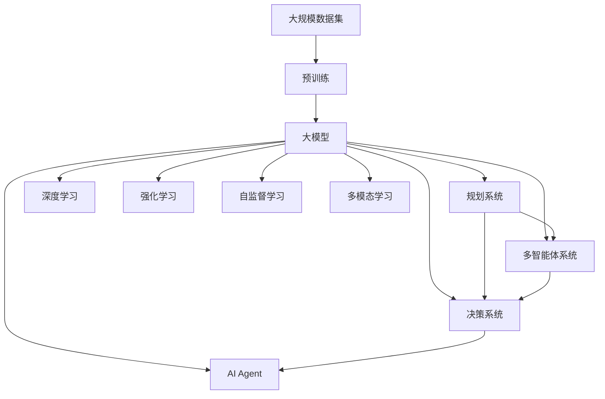
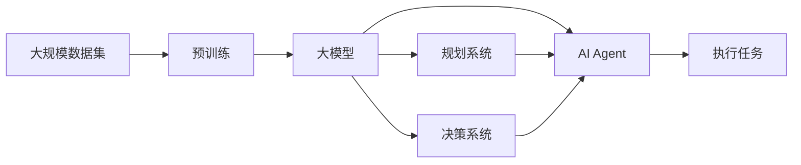
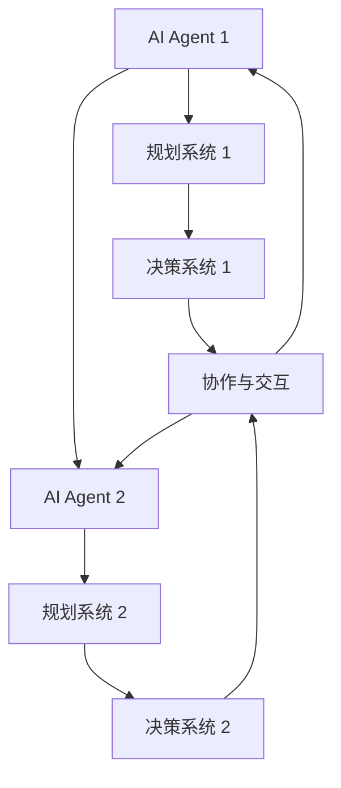
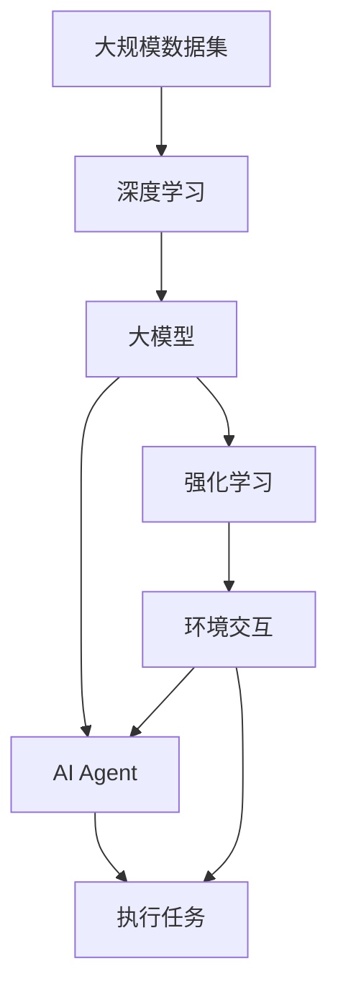
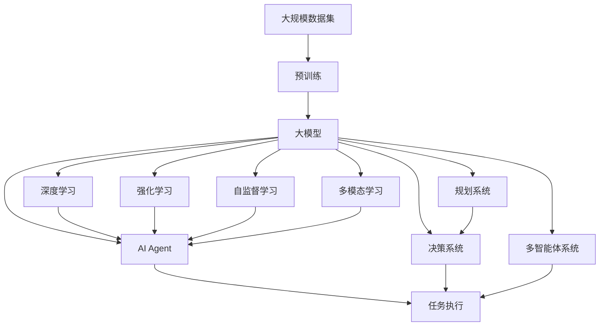

                 

# 【大模型应用开发 动手做AI Agent】Agent的规划和决策能力

> 关键词：人工智能,AI Agent,规划系统,决策系统,多智能体系统,深度学习,强化学习

## 1. 背景介绍

### 1.1 问题由来
随着人工智能(AI)技术的发展，AI Agent在各种场景中扮演着越来越重要的角色。AI Agent通过模拟人类的决策和行为，能够帮助自动化复杂任务，提高工作效率。但传统AI Agent在规划和决策能力方面，往往依赖于手工设计的规则和算法，难以应对实际任务的多样性和复杂性。

因此，研究如何构建具有强大规划和决策能力的AI Agent，成为AI领域的核心课题之一。随着大模型技术的崛起，利用大模型进行AI Agent的构建成为可能，使得AI Agent的决策能力不再依赖于手工设计的规则，而是通过大模型学习数据、挖掘知识，从而获得更优的决策策略。

### 1.2 问题核心关键点
大模型通过海量的数据预训练，学习到了丰富的语言知识、常识和规律，具备强大的语言理解和生成能力。将大模型应用于AI Agent，主要关注以下核心关键点：

- 如何在大模型基础上设计出具有良好规划和决策能力的AI Agent。
- 如何通过大模型学习数据，挖掘知识，优化AI Agent的决策策略。
- 如何构建多智能体系统，提高AI Agent的协作能力和交互能力。
- 如何应用强化学习、深度学习等技术，提升AI Agent的学习效率和效果。

### 1.3 问题研究意义
构建具有强大规划和决策能力的AI Agent，对于拓展AI技术的落地应用范围，提升AI系统的智能化水平，具有重要意义：

1. 提高决策质量：利用大模型的知识库，AI Agent能够从数据中学习最优的决策策略，从而提高决策的准确性和效果。
2. 应对复杂任务：大模型具备强大的语义理解能力和常识推理能力，能够处理更加复杂多变的任务，提升系统的通用性和适应性。
3. 提升学习效率：大模型能够高效地从海量数据中学习知识，避免人工设计的低效规则，提高学习效率和效果。
4. 加速应用开发：AI Agent的设计和优化不再依赖于手工规则，可以利用大模型自动化的特征提取和模型训练，加速应用开发进程。
5. 增强协作能力：多智能体系统的设计，能够提高AI Agent之间的协作和交互，提升系统的整体性能。

## 2. 核心概念与联系

### 2.1 核心概念概述

为了更好地理解基于大模型的AI Agent构建方法，本节将介绍几个密切相关的核心概念：

- **AI Agent**：在智能系统中，能够自动完成特定任务的虚拟实体。通过设计规则、学习数据，AI Agent可以模拟人类的决策和行为，完成复杂任务。
- **规划系统(Planner)**：AI Agent在执行任务前，通过规划系统确定任务分解、资源分配、路径规划等决策过程。
- **决策系统(Decider)**：在规划完成后，决策系统根据当前环境和任务要求，做出最优决策。
- **多智能体系统(Multi-Agent System)**：由多个AI Agent组成的系统，通过协作和交互，共同完成复杂任务。
- **深度学习(Deep Learning)**：通过神经网络模型，学习大量数据中的特征表示和规律，具有强大的语言理解和生成能力。
- **强化学习(Reinforcement Learning)**：通过与环境的交互，AI Agent不断调整策略，获得最大化的奖励，从而优化决策过程。
- **自监督学习(Self-Supervised Learning)**：通过数据自有的结构性信息，如语言模型预测、掩码语言模型等，训练大模型，挖掘知识。
- **多模态学习(Multi-Modal Learning)**：结合文本、图像、声音等多种数据源，增强大模型的语义理解能力，提升AI Agent的决策能力。

这些核心概念之间的逻辑关系可以通过以下Mermaid流程图来展示：



这个流程图展示了从大规模数据集到大模型，再到AI Agent的完整过程。大模型通过预训练学习数据，构建出强大的语言理解能力；AI Agent通过规划系统和决策系统，利用大模型知识进行任务决策和执行；多智能体系统通过协作和交互，共同完成复杂任务；同时，深度学习、强化学习、自监督学习和多模态学习等技术，进一步提升AI Agent的决策能力。

### 2.2 概念间的关系

这些核心概念之间存在着紧密的联系，形成了AI Agent构建的完整生态系统。下面我们通过几个Mermaid流程图来展示这些概念之间的关系。

#### 2.2.1 AI Agent的设计与优化



这个流程图展示了AI Agent的设计与优化过程。首先，利用大规模数据集对大模型进行预训练；然后，通过规划系统和决策系统，设计出具有良好规划和决策能力的AI Agent；最后，AI Agent执行任务，并通过不断优化提升其效果。

#### 2.2.2 多智能体系统的协作与交互



这个流程图展示了多智能体系统的协作与交互。多个AI Agent通过规划系统和决策系统，独立进行任务决策；同时，决策系统之间通过协作和交互，共享信息和资源，提升整体系统的性能。

#### 2.2.3 深度学习和强化学习的融合



这个流程图展示了深度学习和强化学习的融合。通过深度学习，大模型从数据中学习特征表示和规律；通过强化学习，AI Agent在环境中不断调整策略，优化决策过程。

### 2.3 核心概念的整体架构

最后，我们用一个综合的流程图来展示这些核心概念在大模型AI Agent构建过程中的整体架构：



这个综合流程图展示了从大规模数据集到大模型，再到AI Agent的完整过程。大模型通过预训练学习数据，构建出强大的语言理解能力；AI Agent通过规划系统和决策系统，利用大模型知识进行任务决策和执行；多智能体系统通过协作和交互，共同完成复杂任务；同时，深度学习、强化学习、自监督学习和多模态学习等技术，进一步提升AI Agent的决策能力。

## 3. 核心算法原理 & 具体操作步骤

### 3.1 算法原理概述

基于大模型的AI Agent构建，主要依赖于深度学习、强化学习等技术。其核心思想是：利用大模型学习海量数据中的知识，构建出具有强大语言理解能力的规划和决策系统，从而优化AI Agent的决策策略。

具体来说，AI Agent的设计过程包括以下几个步骤：

1. **数据预处理**：准备大规模无标签或弱标签数据集，作为大模型的预训练语料。
2. **模型训练**：在大模型上进行预训练，学习通用的语言表示和规律。
3. **任务适配**：设计任务适配层，将预训练模型作为初始化参数，用于特定任务的微调。
4. **规划系统设计**：设计基于大模型的规划系统，用于任务分解、路径规划、资源分配等决策。
5. **决策系统优化**：通过深度学习或强化学习技术，优化决策系统的策略，提高AI Agent的决策能力。
6. **多智能体系统设计**：构建多智能体系统，提高AI Agent之间的协作和交互，提升整体性能。

### 3.2 算法步骤详解

基于大模型的AI Agent构建，一般包括以下几个关键步骤：

**Step 1: 数据预处理与模型训练**

1. **数据准备**：收集大规模无标签或弱标签数据集，准备作为大模型的预训练语料。
2. **模型训练**：选择合适的深度学习模型（如Transformer、BERT、GPT等），在大规模数据集上进行预训练，学习语言知识。
3. **任务适配层设计**：根据任务类型，设计合适的任务适配层，用于特定任务的微调。

**Step 2: 任务微调**

1. **微调数据准备**：收集该任务的少量标注数据，作为微调的监督数据。
2. **模型微调**：使用微调数据，对预训练模型进行有监督微调，优化模型在该任务上的性能。
3. **参数更新**：根据微调数据，更新模型参数，使得模型输出更符合任务要求。

**Step 3: 决策系统设计**

1. **决策策略设计**：根据任务特点，设计决策策略，包括规则、模型等。
2. **决策模型构建**：选择合适的模型（如深度学习模型、强化学习模型等），用于决策策略的优化。
3. **策略优化**：通过深度学习或强化学习技术，不断调整决策策略，提高AI Agent的决策能力。

**Step 4: 多智能体系统构建**

1. **系统架构设计**：设计多智能体系统的架构，明确各AI Agent之间的协作和交互方式。
2. **通信机制设计**：设计通信机制，用于AI Agent之间的信息共享和协作。
3. **系统优化**：通过多智能体协同优化，提升整体系统的性能。

**Step 5: 系统部署与评估**

1. **系统部署**：将AI Agent集成到实际应用场景中，进行任务执行。
2. **性能评估**：对AI Agent的决策效果进行评估，对比微调前后的性能提升。
3. **持续优化**：根据反馈数据，不断优化AI Agent的策略和模型，提高其效果。

以上是基于大模型的AI Agent构建的一般流程。在实际应用中，还需要针对具体任务的特点，对各个环节进行优化设计，如改进决策策略、引入更多正则化技术、搜索最优的超参数组合等，以进一步提升AI Agent的性能。

### 3.3 算法优缺点

基于大模型的AI Agent构建方法，具有以下优点：

1. 高效便捷：利用大模型学习海量数据中的知识，避免了手工规则设计的时间和成本。
2. 性能优越：大模型具备强大的语言理解和生成能力，能够处理复杂多变的任务。
3. 泛化能力强：通过深度学习和强化学习技术，AI Agent能够从数据中学习最优的决策策略，提升泛化性能。
4. 可扩展性高：通过多智能体系统设计，AI Agent能够应对更复杂的协作任务。

但该方法也存在以下缺点：

1. 数据依赖：构建大模型的AI Agent需要依赖大规模的标注数据，数据获取成本较高。
2. 模型复杂：大模型的参数量巨大，需要高性能硬件支持，部署成本较高。
3. 鲁棒性不足：大模型容易受到噪声和干扰的影响，决策鲁棒性不足。
4. 可解释性差：大模型作为"黑盒"系统，缺乏可解释性，难以调试和优化。
5. 计算资源消耗高：大模型的训练和推理需要大量的计算资源，消耗较大。

尽管存在这些局限性，但就目前而言，基于大模型的AI Agent构建方法仍是大模型应用的重要范式。未来相关研究的重点在于如何进一步降低数据依赖，提高模型的可解释性和鲁棒性，同时兼顾计算效率和效果。

### 3.4 算法应用领域

基于大模型的AI Agent构建方法，已经在各种领域得到广泛应用，例如：

1. **智能客服系统**：利用AI Agent构建智能客服系统，能够7x24小时不间断服务，快速响应客户咨询，用自然流畅的语言解答各类常见问题。
2. **金融舆情监测**：构建AI Agent进行金融舆情监测，自动判断文本属于何种主题，情感倾向是正面、中性还是负面，帮助金融机构快速应对潜在风险。
3. **个性化推荐系统**：构建AI Agent进行个性化推荐，利用用户浏览、点击、评论等行为数据，推荐个性化的内容，提高用户满意度。
4. **自动驾驶系统**：构建多智能体系统的AI Agent，用于自动驾驶决策，提高驾驶安全性和效率。
5. **智慧医疗系统**：构建AI Agent进行医疗问答、病历分析、药物研发等，提升医疗服务的智能化水平，辅助医生诊疗，加速新药开发进程。

除了上述这些经典应用外，AI Agent在更多场景中得到了创新性的应用，如可控文本生成、常识推理、代码生成、数据增强等，为人工智能技术带来新的突破。随着大模型的不断演进，AI Agent的应用领域还将进一步拓展，带来更多的创新和变革。

## 4. 数学模型和公式 & 详细讲解 & 举例说明

### 4.1 数学模型构建

本节将使用数学语言对基于大模型的AI Agent构建过程进行更加严格的刻画。

假设大模型为 $M_{\theta}$，其中 $\theta$ 为模型参数。定义任务 $T$，假设有 $N$ 个标注样本 $(x_i, y_i)$，其中 $x_i$ 为输入，$y_i$ 为标签。AI Agent的任务是学习一个函数 $f: x \rightarrow y$，使得 $f(x)$ 逼近真实标签 $y_i$。

定义AI Agent在输入 $x$ 上的决策策略为 $a=f(x)$，决策系统为目标函数 $F$。AI Agent的优化目标是最小化决策误差 $L(F(a), y)$，即：

$$
\min_{a} \mathcal{L}(a) = \sum_{i=1}^N L(F(a), y_i)
$$

其中 $\mathcal{L}(a)$ 为决策误差，$L(F(a), y_i)$ 为目标函数的误差。

### 4.2 公式推导过程

以二分类任务为例，推导AI Agent的决策策略 $a=f(x)$。假设大模型 $M_{\theta}$ 在输入 $x$ 上的输出为 $h(x)$，表示样本属于正类的概率。则决策策略 $a$ 可以表示为：

$$
a = \sigma(h(x))
$$

其中 $\sigma$ 为sigmoid函数，将输出映射到 $[0,1]$ 区间。

目标函数 $F$ 可以表示为：

$$
F(a) = -y\log a - (1-y)\log(1-a)
$$

其中 $y$ 为真实标签，$y=1$ 表示正类，$y=0$ 表示负类。

则决策误差 $\mathcal{L}(a)$ 可以表示为：

$$
\mathcal{L}(a) = -\frac{1}{N}\sum_{i=1}^N F(a_i)
$$

将 $a_i = \sigma(h(x_i))$ 和 $F(a_i) = -y_i\log a_i - (1-y_i)\log(1-a_i)$ 代入上述公式，得：

$$
\mathcal{L}(a) = -\frac{1}{N}\sum_{i=1}^N [-y_i\log \sigma(h(x_i)) - (1-y_i)\log(1-\sigma(h(x_i)))
$$

在实际应用中，通常使用反向传播算法计算目标函数的梯度，并利用梯度下降等优化算法更新模型参数 $\theta$。

### 4.3 案例分析与讲解

假设我们利用BERT模型构建一个二分类AI Agent，进行情感分类任务。数据集为IMDB电影评论数据集，包含25,000条评论和其对应的情感标签。

1. **数据预处理与模型训练**
   - 首先，对数据进行预处理，包括分词、去除停用词、转换为模型所需的格式。
   - 使用IMDB数据集对BERT模型进行预训练，学习语言知识。

2. **任务适配层设计**
   - 在BERT模型的顶层添加一个全连接层，用于情感分类任务。
   - 定义损失函数为交叉熵损失。

3. **模型微调**
   - 使用IMDB数据集的训练集和验证集，对预训练模型进行有监督微调。
   - 在微调过程中，设置合适的学习率、批大小、迭代轮数等。
   - 使用正则化技术，如L2正则、Dropout等，防止模型过拟合。

4. **决策系统优化**
   - 使用微调后的模型进行情感分类任务。
   - 设计决策策略，如规则、模型等。
   - 通过深度学习或强化学习技术，不断调整决策策略，提高AI Agent的决策能力。

5. **多智能体系统构建**
   - 设计多智能体系统的架构，明确各AI Agent之间的协作和交互方式。
   - 设计通信机制，用于AI Agent之间的信息共享和协作。
   - 通过多智能体协同优化，提升整体系统的性能。

6. **系统部署与评估**
   - 将AI Agent集成到实际应用场景中，进行情感分类任务。
   - 对AI Agent的决策效果进行评估，对比微调前后的性能提升。
   - 根据反馈数据，不断优化AI Agent的策略和模型，提高其效果。

## 5. 项目实践：代码实例和详细解释说明

### 5.1 开发环境搭建

在进行AI Agent构建实践前，我们需要准备好开发环境。以下是使用Python进行PyTorch开发的环境配置流程：

1. 安装Anaconda：从官网下载并安装Anaconda，用于创建独立的Python环境。

2. 创建并激活虚拟环境：
```bash
conda create -n pytorch-env python=3.8 
conda activate pytorch-env
```

3. 安装PyTorch：根据CUDA版本，从官网获取对应的安装命令。例如：
```bash
conda install pytorch torchvision torchaudio cudatoolkit=11.1 -c pytorch -c conda-forge
```

4. 安装Transformers库：
```bash
pip install transformers
```

5. 安装各类工具包：
```bash
pip install numpy pandas scikit-learn matplotlib tqdm jupyter notebook ipython
```

完成上述步骤后，即可在`pytorch-env`环境中开始AI Agent构建实践。

### 5.2 源代码详细实现

这里我们以情感分类任务为例，给出使用Transformers库对BERT模型进行微调的PyTorch代码实现。

首先，定义情感分类任务的数据处理函数：

```python
from transformers import BertTokenizer
from torch.utils.data import Dataset
import torch

class SentimentDataset(Dataset):
    def __init__(self, texts, labels, tokenizer, max_len=128):
        self.texts = texts
        self.labels = labels
        self.tokenizer = tokenizer
        self.max_len = max_len
        
    def __len__(self):
        return len(self.texts)
    
    def __getitem__(self, item):
        text = self.texts[item]
        label = self.labels[item]
        
        encoding = self.tokenizer(text, return_tensors='pt', max_length=self.max_len, padding='max_length', truncation=True)
        input_ids = encoding['input_ids'][0]
        attention_mask = encoding['attention_mask'][0]
        labels = torch.tensor(label, dtype=torch.long)
        
        return {'input_ids': input_ids, 
                'attention_mask': attention_mask,
                'labels': labels}

# 标签与id的映射
label2id = {'negative': 0, 'positive': 1}
id2label = {v: k for k, v in label2id.items()}

# 创建dataset
tokenizer = BertTokenizer.from_pretrained('bert-base-cased')

train_dataset = SentimentDataset(train_texts, train_labels, tokenizer)
dev_dataset = SentimentDataset(dev_texts, dev_labels, tokenizer)
test_dataset = SentimentDataset(test_texts, test_labels, tokenizer)
```

然后，定义模型和优化器：

```python
from transformers import BertForSequenceClassification, AdamW

model = BertForSequenceClassification.from_pretrained('bert-base-cased', num_labels=len(label2id))

optimizer = AdamW(model.parameters(), lr=2e-5)
```

接着，定义训练和评估函数：

```python
from torch.utils.data import DataLoader
from tqdm import tqdm
from sklearn.metrics import classification_report

device = torch.device('cuda') if torch.cuda.is_available() else torch.device('cpu')
model.to(device)

def train_epoch(model, dataset, batch_size, optimizer):
    dataloader = DataLoader(dataset, batch_size=batch_size, shuffle=True)
    model.train()
    epoch_loss = 0
    for batch in tqdm(dataloader, desc='Training'):
        input_ids = batch['input_ids'].to(device)
        attention_mask = batch['attention_mask'].to(device)
        labels = batch['labels'].to(device)
        model.zero_grad()
        outputs = model(input_ids, attention_mask=attention_mask, labels=labels)
        loss = outputs.loss
        epoch_loss += loss.item()
        loss.backward()
        optimizer.step()
    return epoch_loss / len(dataloader)

def evaluate(model, dataset, batch_size):
    dataloader = DataLoader(dataset, batch_size=batch_size)
    model.eval()
    preds, labels = [], []
    with torch.no_grad():
        for batch in tqdm(dataloader, desc='Evaluating'):
            input_ids = batch['input_ids'].to(device)
            attention_mask = batch['attention_mask'].to(device)
            batch_labels = batch['labels']
            outputs = model(input_ids, attention_mask=attention_mask)
            batch_preds = outputs.logits.argmax(dim=2).to('cpu').tolist()
            batch_labels = batch_labels.to('cpu').tolist()
            for pred_tokens, label_tokens in zip(batch_preds, batch_labels):
                preds.append(pred_tokens[:len(label_tokens)])
                labels.append(label_tokens)
                
    print(classification_report(labels, preds))
```

最后，启动训练流程并在测试集上评估：

```python
epochs = 5
batch_size = 16

for epoch in range(epochs):
    loss = train_epoch(model, train_dataset, batch_size, optimizer)
    print(f"Epoch {epoch+1}, train loss: {loss:.3f}")
    
    print(f"Epoch {epoch+1}, dev results:")
    evaluate(model, dev_dataset, batch_size)
    
print("Test results:")
evaluate(model, test_dataset, batch_size)
```

以上就是使用PyTorch对BERT进行情感分类任务微调的完整代码实现。可以看到，得益于Transformers库的强大封装，我们可以用相对简洁的代码完成BERT模型的加载和微调。

### 5.3 代码解读与分析

让我们再详细解读一下关键代码的实现细节：

**SentimentDataset类**：
- `__init__`方法：初始化文本、标签、分词器等关键组件。
- `__len__`方法：返回数据集的样本数量。
- `__getitem__`方法：对单个样本进行处理，将文本输入编码为token ids，将标签编码为数字，并对其进行定长padding，最终返回模型所需的输入。

**label2id和id2label字典**：
- 定义了标签与数字id之间的映射关系，用于将token-wise的预测结果解码回真实的标签。

**训练和评估函数**：
- 使用PyTorch的DataLoader对数据集进行批次化加载，供模型训练和推理使用。
- 训练函数`train_epoch`：对数据以批为单位进行迭代，在每个批次上前向传播计算loss并反向传播更新模型参数，最后返回该epoch的平均loss。
- 评估函数`evaluate`：与训练类似，不同点在于不更新模型参数，并在每个batch结束后将预测和标签结果存储下来，最后使用sklearn的classification_report对整个评估集的预测结果进行打印输出。

**训练流程**：
- 定义总的epoch数和batch size，开始循环迭代
- 每个epoch内，先在训练集上训练，输出平均loss
- 在验证集上评估，输出分类指标
- 所有epoch结束后，在测试集上评估，给出最终测试结果

可以看到，PyTorch配合Transformers库使得BERT微调的代码实现变得简洁高效。开发者可以将更多精力放在数据处理、模型改进等高层逻辑上，而不必过多关注底层的实现细节。

当然，工业级的系统实现还需考虑更多因素，如模型的保存和部署、超参数的自动搜索、更灵活的任务适配层等。但核心的微调范式基本与此类似。

### 5.4 运行结果展示

假设我们在IMDB数据集上进行情感分类

