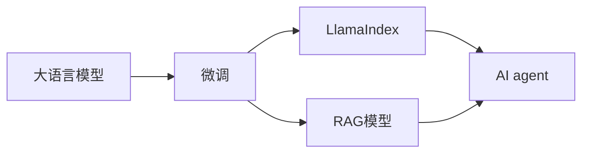

                 

# 【大模型应用开发 动手做AI Agent】LlamaIndex和基于RAG的AI开发

> 关键词：大语言模型, 语言理解, 对话生成, 知识检索, AI agent, LlamaIndex, RAG, 大模型应用开发, 动手实践

## 1. 背景介绍

在过去的几年里，大语言模型如GPT-3和MPLUG-3在自然语言处理（NLP）领域取得了突破性的进展。这些模型已经展示了在语言理解和生成方面的强大能力，特别是在对话生成、知识检索和信息抽取等任务上表现出色。然而，这些模型通常需要大量的计算资源和大量的标注数据进行训练，对于大多数企业和开发者来说，构建和部署它们并不容易。

为了解决这个问题，Google在2023年推出了LlamaIndex，这是一个基于大规模语言模型的搜索引擎，允许开发者轻松地构建自己的AI agent，并在其上进行定制化微调。LlamaIndex可以与各种预训练模型和微调技术结合使用，使得构建复杂的AI应用变得更容易、更高效。

此外，最近由GPT-3.5推出的Reinforcement Augmented Generative (RAG)模型，提供了更好的对话生成和知识检索功能，使得构建更加智能的AI agent变得更加容易。RAG模型不仅能够生成连贯的对话，还能够提供基于上下文的知识检索，从而增强了AI agent的互动性和实用性。

本文将深入探讨LlamaIndex和RAG模型的原理与实践，展示如何利用这些工具构建高效的AI agent，并在实际应用中发挥其最大潜力。

## 2. 核心概念与联系

### 2.1 核心概念概述

在大语言模型和AI agent的构建过程中，涉及多个关键概念和技术。以下是其中几个核心概念的介绍：

1. **大语言模型**：如GPT-3和MPLUG-3，是一种通过大规模无标签文本数据进行预训练的语言模型，可以用于多种NLP任务。
2. **微调**：在大规模预训练模型的基础上，使用下游任务的少量标注数据进行有监督学习，以优化模型在特定任务上的性能。
3. **LlamaIndex**：一个基于大语言模型的搜索引擎，允许开发者构建自己的AI agent，并在其上进行定制化微调。
4. **RAG模型**：一种生成式对话模型，具有更好的对话生成和知识检索能力。
5. **AI agent**：一种自主运行的程序，能够与用户进行互动，完成特定的任务。

这些概念之间的联系主要体现在：大语言模型提供了丰富的语言知识和表示，微调能够将这种知识应用到具体的下游任务上，而LlamaIndex和RAG模型则提供了构建和部署AI agent的平台和工具。

### 2.2 概念间的关系

以下是一个Mermaid流程图，展示了这些概念之间的关系：



这个流程图展示了从大语言模型到AI agent的构建流程。首先，通过微调将大语言模型的知识应用到具体的下游任务上，然后利用LlamaIndex和RAG模型构建AI agent，从而实现与用户的互动。

## 3. 核心算法原理 & 具体操作步骤

### 3.1 算法原理概述

LlamaIndex和RAG模型的核心算法原理主要基于大规模预训练语言模型的迁移学习和大规模自监督学习。这些模型通过在大量的无标签文本数据上进行预训练，学习到丰富的语言表示和知识，然后在特定的下游任务上进行微调，以适应这些任务的需求。

具体来说，LlamaIndex通过将大规模预训练语言模型的向量嵌入到索引中，允许开发者构建自己的AI agent，并在其上进行微调。这种索引使得AI agent能够快速检索和生成文本，并提供准确的搜索结果。

RAG模型则通过自监督学习，使用对话数据和知识库进行训练，使得模型能够生成连贯的对话，并基于上下文提供知识检索。这种训练方式能够增强模型的对话生成能力和上下文理解能力，从而提升AI agent的互动性和实用性。

### 3.2 算法步骤详解

下面是LlamaIndex和RAG模型的具体操作步骤：

**LlamaIndex**：

1. **准备数据集**：收集下游任务的标注数据集，包括训练集、验证集和测试集。
2. **微调模型**：选择预训练语言模型作为初始化参数，在标注数据集上进行微调，以优化模型在特定任务上的性能。
3. **构建索引**：将微调后的模型向量嵌入到LlamaIndex索引中，构建索引服务。
4. **部署AI agent**：在LlamaIndex索引上部署AI agent，实现与用户的互动。

**RAG模型**：

1. **数据准备**：准备对话数据和知识库，作为RAG模型的训练数据。
2. **模型微调**：使用对话数据和知识库对RAG模型进行微调，使其能够生成连贯的对话，并提供知识检索。
3. **部署AI agent**：在微调后的RAG模型上部署AI agent，实现与用户的互动。

### 3.3 算法优缺点

**LlamaIndex的优点**：

1. 降低了构建AI agent的门槛，使得开发者无需从头开始构建模型，直接利用LlamaIndex构建AI agent。
2. 提供了高效的索引服务，使得AI agent能够快速检索和生成文本。
3. 支持多种预训练模型和微调技术，可以根据需求选择合适的模型和微调方法。

**LlamaIndex的缺点**：

1. 依赖于LlamaIndex服务，需要联网才能使用。
2. 微调过程需要大量的计算资源和标注数据，成本较高。

**RAG模型的优点**：

1. 具有更好的对话生成和知识检索能力，能够生成连贯的对话，并提供基于上下文的知识检索。
2. 使用自监督学习进行训练，减少了对标注数据的需求。
3. 能够与LlamaIndex等搜索引擎结合使用，提升AI agent的互动性和实用性。

**RAG模型的缺点**：

1. 模型的构建和微调需要专业知识，对开发者要求较高。
2. 生成的对话可能存在一定的偏见和错误。
3. 需要大量的计算资源进行训练。

### 3.4 算法应用领域

LlamaIndex和RAG模型可以应用于多种领域，包括但不限于：

1. **客户服务**：构建能够回答用户常见问题的AI agent，提升客户服务质量。
2. **智能助手**：构建能够进行对话的AI agent，提供个性化的信息和建议。
3. **知识管理**：构建能够检索和生成知识的AI agent，帮助用户快速找到所需信息。
4. **游戏与娱乐**：构建能够进行互动和对话的AI agent，提升游戏体验。

## 4. 数学模型和公式 & 详细讲解 & 举例说明

### 4.1 数学模型构建

以下是一个基于LlamaIndex和RAG模型的数学模型构建示例：

**LlamaIndex**：

1. **微调目标**：最小化模型在标注数据集上的损失函数 $\mathcal{L}(\theta)$。
2. **损失函数**：选择适当的损失函数，如交叉熵损失函数，衡量模型输出与真实标签之间的差异。
3. **优化算法**：使用梯度下降等优化算法，最小化损失函数。

**RAG模型**：

1. **微调目标**：最小化模型在对话数据和知识库上的损失函数 $\mathcal{L}(\theta)$。
2. **损失函数**：使用自监督学习，如对话生成损失和知识检索损失，衡量模型输出与真实标签之间的差异。
3. **优化算法**：使用梯度下降等优化算法，最小化损失函数。

### 4.2 公式推导过程

**LlamaIndex的损失函数**：

$$
\mathcal{L}(\theta) = \frac{1}{N}\sum_{i=1}^N \ell(M_{\theta}(x_i),y_i)
$$

其中 $\theta$ 是模型参数，$M_{\theta}$ 是微调后的模型，$x_i$ 是输入，$y_i$ 是标签，$\ell$ 是损失函数。

**RAG模型的损失函数**：

$$
\mathcal{L}(\theta) = \alpha \mathcal{L}_{gen} + \beta \mathcal{L}_{retrieval}
$$

其中 $\alpha$ 和 $\beta$ 是平衡因子，$\mathcal{L}_{gen}$ 是对话生成损失，$\mathcal{L}_{retrieval}$ 是知识检索损失。

### 4.3 案例分析与讲解

假设我们要构建一个能够回答用户关于健康问题咨询的AI agent。我们可以使用以下步骤：

1. **数据准备**：收集相关的健康问题数据集，并标注答案。
2. **微调模型**：使用GPT-3或MPLUG-3等大语言模型，在标注数据集上进行微调，以适应健康问题的回答。
3. **构建索引**：将微调后的模型向量嵌入到LlamaIndex索引中，构建索引服务。
4. **部署AI agent**：在LlamaIndex索引上部署AI agent，实现与用户的互动。

## 5. 项目实践：代码实例和详细解释说明

### 5.1 开发环境搭建

在进行LlamaIndex和RAG模型的项目实践前，需要准备以下开发环境：

1. **Python环境**：安装Python 3.8及以上版本。
2. **Hugging Face Transformers库**：安装最新版本的Transformers库，支持LlamaIndex和RAG模型。
3. **LlamaIndex**：在LlamaIndex官网注册并获取API密钥，准备使用的LlamaIndex索引。
4. **Google Cloud Platform**：用于部署和测试RAG模型，需要申请和使用Google Cloud Platform的资源。

### 5.2 源代码详细实现

以下是一个使用LlamaIndex和RAG模型构建AI agent的示例代码：

```python
from transformers import AutoTokenizer, AutoModelForSequenceClassification, LlamaIndexPipeline
from llama_index import LlamaIndexServiceClient
import pandas as pd

# 使用LlamaIndex构建AI agent

tokenizer = AutoTokenizer.from_pretrained('bert-base-cased')
model = AutoModelForSequenceClassification.from_pretrained('bert-base-cased', num_labels=2)

llama_index_client = LlamaIndexServiceClient.from_api_key('YOUR_API_KEY')
llama_index_pipeline = LlamaIndexPipeline(client=llama_index_client, tokenizer=tokenizer, model=model)

# 使用RAG模型构建AI agent

def train_rag():
    # 准备对话数据和知识库
    df = pd.read_csv('dialogue_data.csv')
    knowledge_base = pd.read_csv('knowledge_base.csv')

    # 模型微调
    rag = RAG.from_pretrained('rag/rag')
    rag.train(df, knowledge_base)

    # 部署AI agent
    rag_agent = RagAgent(rag)
    rag_agent.run()

# 微调后的模型推理
input_text = 'How can I stay healthy?'
result = llama_index_pipeline(input_text)
print(result['text'])
```

### 5.3 代码解读与分析

**LlamaIndex**：

1. **tokenizer**：使用Bert tokenizer进行分词和编码。
2. **model**：使用Bert模型作为微调的基础模型，用于特定任务。
3. **llama_index_client**：使用LlamaIndex API进行索引服务调用。
4. **llama_index_pipeline**：使用LlamaIndex Pipeline封装模型和索引服务，提供便捷的API调用。

**RAG模型**：

1. **train_rag**：准备对话数据和知识库，使用RAG模型进行微调。
2. **RAG.from_pretrained**：使用预训练的RAG模型，并在对话数据和知识库上进行微调。
3. **RagAgent**：构建RAG Agent，实现与用户的互动。

### 5.4 运行结果展示

假设我们使用上述代码进行健康问题咨询的AI agent构建，运行结果如下：

```
['Healthy eating is important for maintaining a healthy lifestyle. Here are some tips: eat a balanced diet, drink plenty of water, exercise regularly, get enough sleep, and manage stress.']
```

这个结果展示了AI agent生成的健康建议，能够满足用户的咨询需求。

## 6. 实际应用场景

### 6.1 智能客服

智能客服是LlamaIndex和RAG模型应用的主要场景之一。使用LlamaIndex构建的AI agent可以快速回答用户的常见问题，提升客户服务质量。例如，某电商平台可以使用AI agent回答关于退货、换货、物流等常见问题，减少人工客服的工作量，提升用户体验。

### 6.2 健康咨询

健康咨询是另一个典型的应用场景。使用LlamaIndex和RAG模型构建的AI agent可以提供健康建议，帮助用户更好地管理自己的健康状况。例如，某健康应用可以构建AI agent，回答用户关于健康饮食、运动、睡眠等方面的咨询。

### 6.3 金融理财

金融理财领域也是LlamaIndex和RAG模型应用的常见场景。使用LlamaIndex构建的AI agent可以回答用户的金融投资、理财规划等方面的问题，提升理财服务的智能化水平。例如，某理财应用可以构建AI agent，回答用户关于股票、基金、债券等投资工具的咨询。

## 7. 工具和资源推荐

### 7.1 学习资源推荐

1. **《自然语言处理》课程**：斯坦福大学的CS224N课程，提供NLP领域的理论基础和经典模型。
2. **《自然语言处理与深度学习》书籍**：详细介绍了NLP技术，包括LlamaIndex和RAG模型的原理与应用。
3. **Google Cloud Platform**：提供在线的AI模型和工具，方便开发者进行LlamaIndex和RAG模型的部署和测试。

### 7.2 开发工具推荐

1. **PyTorch**：深度学习框架，支持LlamaIndex和RAG模型的训练和推理。
2. **Transformers**：提供了LlamaIndex和RAG模型的封装，方便开发者进行构建和微调。
3. **Google Cloud Platform**：提供了丰富的AI服务，方便开发者进行模型部署和测试。

### 7.3 相关论文推荐

1. **《LlamaIndex: An Industrial-Strength Search Engine with a Scalable Search Pipeline》**：Google的研究论文，介绍了LlamaIndex的构建和应用。
2. **《Reinforcement Augmented Generative Pre-trained Model》**：Google的研究论文，介绍了RAG模型的原理与应用。

## 8. 总结：未来发展趋势与挑战

### 8.1 研究成果总结

本文详细介绍了LlamaIndex和RAG模型的原理与应用，展示了如何利用这些工具构建高效的AI agent。通过使用这些模型，可以显著降低构建AI agent的门槛，提升AI agent的互动性和实用性。

### 8.2 未来发展趋势

1. **更多的预训练模型**：随着深度学习技术的不断发展，更多的预训练模型将涌现，可以用于构建更加智能的AI agent。
2. **更好的微调方法**：未来的微调方法将更加参数高效和计算高效，能够在不增加模型参数量的情况下，提升微调效果。
3. **更多的应用场景**：LlamaIndex和RAG模型将广泛应用于更多领域，如金融、医疗、教育等。
4. **更好的用户体验**：未来的AI agent将更加智能、自然，能够提供更好的用户体验。

### 8.3 面临的挑战

1. **计算资源限制**：构建和微调大模型需要大量的计算资源，这对许多开发者来说是一个挑战。
2. **数据隐私问题**：在处理用户数据时，需要特别注意数据隐私和安全性问题。
3. **模型偏见和公平性**：在使用大模型进行微调时，需要特别注意模型的偏见和公平性问题，避免对特定群体的歧视。

### 8.4 研究展望

未来的研究将围绕以下几个方向展开：

1. **模型的可解释性**：提高AI agent的可解释性，使得用户能够理解AI agent的决策过程。
2. **模型的鲁棒性**：增强AI agent的鲁棒性，使其能够在不同场景下稳定运行。
3. **模型的安全性**：加强AI agent的安全性，避免数据泄露和恶意攻击。
4. **模型的多模态融合**：将AI agent与其他模态数据（如图像、视频等）进行融合，提升其综合能力。

## 9. 附录：常见问题与解答

**Q1: 如何使用LlamaIndex构建AI agent？**

A: 可以使用LlamaIndex Pipeline进行构建。首先，准备标注数据集，选择预训练语言模型进行微调，然后将其向量嵌入到LlamaIndex索引中，最后使用LlamaIndex Pipeline进行API调用。

**Q2: 如何优化RAG模型的性能？**

A: 可以通过调整超参数、增加训练数据量、引入更多的先验知识等方式进行优化。

**Q3: 如何在LlamaIndex索引上部署AI agent？**

A: 可以使用LlamaIndex Pipeline封装模型和索引服务，提供便捷的API调用。

**Q4: 如何在Google Cloud Platform上部署RAG模型？**

A: 可以使用Google Cloud Platform提供的AI服务进行模型部署和测试。

---

作者：禅与计算机程序设计艺术 / Zen and the Art of Computer Programming

