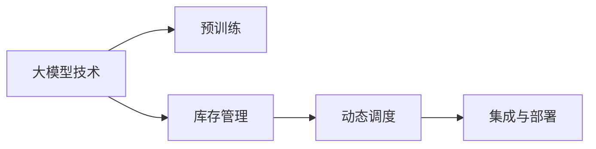
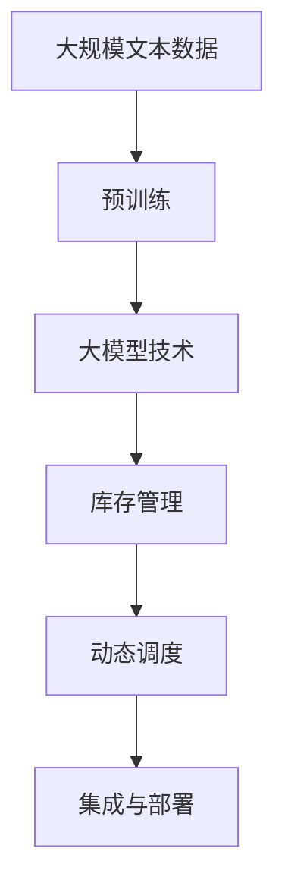

                 

# 【大模型应用开发 动手做AI Agent】为Agent定义一系列进行自动库存调度的工具

在当今瞬息万变的商业环境中，企业面临着复杂多变的市场需求和竞争压力。如何高效地管理库存，以降低成本、提升客户满意度，成为众多企业共同关注的问题。自动化库存调度系统通过预测需求、优化库存水平，可以显著提高供应链的响应速度和灵活性。本文将介绍如何利用大模型技术开发自动库存调度Agent，并通过一系列工具和算法，实现高效的库存管理和动态调度。

## 1. 背景介绍

### 1.1 问题由来

库存调度是供应链管理中至关重要的一环，涉及库存水平的设置、补货策略的制定、缺货与过剩库存的预防等。传统库存调度方法多依赖经验规则和简单的统计模型，难以应对复杂多变的市场需求和不确定性。而大模型技术通过学习大量历史数据和领域知识，能够提供更智能、更灵活的库存管理方案。

在电子商务、零售、制造等行业，自动化库存调度系统已经得到广泛应用，帮助企业优化库存成本、提升订单履行率。例如，Amazon的Warehouse Navigation系统通过AI技术优化拣选路线，显著提高了拣选效率；京东的云仓智能调度系统则基于机器学习算法优化补货和调拨策略。

然而，现有的自动化库存调度系统多依赖于内部数据的积累和特定的业务场景，缺乏跨行业的通用性。同时，这些系统多采用独立部署的方式，难以与企业现有IT系统进行无缝集成。

因此，本文将基于大模型技术，介绍一种通用的自动化库存调度Agent，并开发一系列工具，帮助企业实现高效的库存管理和动态调度。

### 1.2 问题核心关键点

为使自动库存调度Agent能够应对各种业务场景和数据类型，本文将介绍以下核心概念和关键点：

- 大模型技术：指通过大量数据预训练生成的通用语言模型，能够捕捉语言的通用规律和语义信息。
- 库存管理：涉及库存水平设置、补货策略制定、库存优化等。
- 动态调度：通过实时预测市场需求，动态调整库存水平和调度策略。
- 集成与部署：将Agent集成到企业现有IT系统，实现无缝部署。

## 2. 核心概念与联系

### 2.1 核心概念概述

为更好地理解自动库存调度Agent的开发过程，本节将介绍几个密切相关的核心概念：

- **大模型技术**：指通过大量数据预训练生成的通用语言模型，能够捕捉语言的通用规律和语义信息。常见的大模型包括BERT、GPT-2、T5等。
- **库存管理**：涉及库存水平设置、补货策略制定、库存优化等。库存管理的目标是平衡库存成本与客户满意度，避免库存积压或短缺。
- **动态调度**：通过实时预测市场需求，动态调整库存水平和调度策略。动态调度能够根据实时数据和市场变化，及时调整库存状态，优化供应链响应。
- **集成与部署**：将Agent集成到企业现有IT系统，实现无缝部署。集成过程包括数据接口对接、API调用、系统配置等。

这些核心概念之间的逻辑关系可以通过以下Mermaid流程图来展示：



这个流程图展示了大模型技术在库存管理中的应用路径。大模型通过预训练获取语言理解能力，通过动态调度实现库存优化，最终通过集成与部署，无缝集成到企业现有IT系统。

### 2.2 概念间的关系

这些核心概念之间存在着紧密的联系，形成了自动库存调度Agent的完整生态系统。下面我们通过几个Mermaid流程图来展示这些概念之间的关系。

#### 2.2.1 自动库存调度Agent的开发流程


这个流程图展示了自动库存调度Agent的开发流程。从需求分析到模型训练，再到系统集成和部署测试，不断收集用户反馈，进行模型迭代，确保Agent满足实际需求。

#### 2.2.2 动态调度算法的设计思路


这个流程图展示了动态调度的设计思路。通过市场需求预测模型，更新库存状态，利用优化算法调整库存水平，制定调度策略，实现库存优化。

#### 2.2.3 集成与部署工具的开发


这个流程图展示了集成与部署工具的开发流程。通过API接口进行数据传输，配置系统参数，实现系统集成，并搭建日志监控和告警机制，确保系统的稳定运行。

### 2.3 核心概念的整体架构

最后，我们用一个综合的流程图来展示这些核心概念在大模型库存调度中的应用：



这个综合流程图展示了从预训练到大模型库存调度的完整过程。大模型技术通过预训练获取基础能力，通过动态调度实现库存优化，最终通过集成与部署，无缝集成到企业现有IT系统。

## 3. 核心算法原理 & 具体操作步骤

### 3.1 算法原理概述

自动库存调度Agent的核心算法包括市场需求预测、库存状态更新和优化调度。这些算法分别通过大模型技术和优化算法实现。

#### 3.1.1 市场需求预测

市场需求预测是库存调度的基础，通过大模型技术，可以自动分析和理解市场趋势，预测未来需求。具体实现方式包括：

1. 收集市场数据：收集历史订单、市场新闻、社交媒体等数据，作为输入。
2. 预训练模型：使用大模型技术（如BERT、GPT-2等）对市场数据进行预训练，获取市场趋势和变化规律。
3. 预测模型：基于预训练模型，设计市场需求预测算法，输出未来需求预测结果。

#### 3.1.2 库存状态更新

库存状态更新是库存调度的关键，通过实时监控库存水平，及时更新库存状态。具体实现方式包括：

1. 数据采集：通过传感器、RFID等技术，实时采集库存数据。
2. 库存模型：使用库存管理模型（如ABC分析、先进先出等）对库存状态进行分析。
3. 状态更新：根据需求预测和库存模型，更新库存水平，调整库存策略。

#### 3.1.3 优化调度

优化调度是库存调度的核心，通过优化算法，合理分配库存和资源。具体实现方式包括：

1. 资源优化：根据市场预测和库存状态，设计优化算法（如线性规划、整数规划等），计算最优调度策略。
2. 调度执行：根据优化结果，调整库存和资源分配，执行调度策略。
3. 效果评估：对调度结果进行评估，反馈优化算法。

### 3.2 算法步骤详解

以下详细介绍自动库存调度Agent的各个算法步骤和具体操作步骤：

#### 3.2.1 市场需求预测

**步骤1：数据准备**
- 收集历史订单数据、市场新闻、社交媒体等文本数据。
- 预处理数据，去除无关信息，保留关键特征。

**步骤2：模型训练**
- 选择预训练模型（如BERT、GPT-2）进行微调，使其能够预测未来需求。
- 训练数据包括历史订单量、市场趋势等。
- 设置训练参数，如学习率、批大小、迭代轮数等。

**步骤3：预测生成**
- 使用微调后的模型对当前市场数据进行预测。
- 生成未来需求预测结果，作为库存调度的依据。

#### 3.2.2 库存状态更新

**步骤1：数据采集**
- 通过传感器、RFID等技术，实时采集库存数据。
- 数据包括当前库存量、位置、状态等。

**步骤2：状态分析**
- 使用库存管理模型（如ABC分析、先进先出等）对库存状态进行分析。
- 分析库存水平、周转率、安全库存等关键指标。

**步骤3：状态更新**
- 根据市场需求预测结果和库存管理模型，更新库存状态。
- 调整库存水平，保证库存量在合理范围内。

#### 3.2.3 优化调度

**步骤1：资源优化**
- 根据市场需求预测和库存状态，设计优化算法（如线性规划、整数规划等）。
- 计算最优调度策略，包括库存分配、运输路径等。

**步骤2：调度执行**
- 根据优化结果，调整库存和资源分配。
- 执行调度策略，动态调整库存状态。

**步骤3：效果评估**
- 对调度结果进行评估，检查库存水平和调度策略是否合理。
- 根据评估结果，调整优化算法参数，迭代优化调度策略。

### 3.3 算法优缺点

自动库存调度Agent的算法具有以下优点：

1. **通用性强**：通过大模型技术，Agent能够适应多种业务场景和数据类型，具备跨行业的通用性。
2. **预测准确**：市场需求预测算法通过大模型训练，能够捕捉市场趋势和变化规律，预测准确性高。
3. **实时性强**：库存状态更新和优化调度通过实时数据采集和动态调整，能够快速响应市场需求。
4. **自动化高**：Agent通过自动化算法和模型，无需人工干预，能够持续优化库存调度策略。

同时，该算法也存在以下缺点：

1. **数据依赖大**：市场需求预测和库存状态更新依赖于大量历史数据和实时数据，数据缺失或噪声可能影响预测和调度的准确性。
2. **模型复杂度高**：大模型和优化算法的计算复杂度高，需要较高的计算资源和算法知识。
3. **鲁棒性不足**：市场需求和库存状态的变化不确定性较大，难以完全预测，可能导致调度偏差。
4. **集成难度大**：将Agent集成到现有IT系统，涉及接口对接、数据传输、系统配置等复杂操作，需要技术支持。

### 3.4 算法应用领域

自动库存调度Agent可以在多种应用领域发挥作用，例如：

1. **电子商务**：优化库存水平，提高订单履行率，提升客户满意度。
2. **零售业**：动态调整库存策略，减少缺货和过剩库存，降低运营成本。
3. **制造业**：优化生产计划和物流调度，提升生产效率和供应链响应速度。
4. **物流运输**：动态调整运输路径和资源分配，提高运输效率，降低成本。

## 4. 数学模型和公式 & 详细讲解 & 举例说明

### 4.1 数学模型构建

自动库存调度Agent的数学模型包括市场需求预测模型、库存状态更新模型和优化调度模型。

#### 4.1.1 市场需求预测模型

市场需求预测模型通过大模型技术，捕捉市场趋势和变化规律，生成未来需求预测。假设市场需求为时间序列，其数学模型为：

$$
\hat{y}_t = f(\mathbf{x}_t;\theta)
$$

其中，$\hat{y}_t$为$t$时刻的需求预测值，$\mathbf{x}_t$为$t$时刻的市场数据，$\theta$为模型参数。市场需求预测模型的目标是最小化预测误差，即：

$$
\min_{\theta} \sum_{t=1}^{T} \left(y_t - \hat{y}_t \right)^2
$$

#### 4.1.2 库存状态更新模型

库存状态更新模型通过库存管理模型，分析库存水平和状态，更新库存状态。假设库存状态为时间序列，其数学模型为：

$$
\mathbf{z}_t = g(\mathbf{z}_{t-1}, \mathbf{c}_t; \phi)
$$

其中，$\mathbf{z}_t$为$t$时刻的库存状态，$\mathbf{c}_t$为$t$时刻的市场数据，$\phi$为模型参数。库存状态更新模型的目标是最小化库存误差，即：

$$
\min_{\phi} \sum_{t=1}^{T} \left(z_t - \mathbf{z}_t \right)^2
$$

#### 4.1.3 优化调度模型

优化调度模型通过优化算法，计算最优调度策略。假设优化目标为最小化库存成本和运输成本，其数学模型为：

$$
\min_{\boldsymbol{a}, \boldsymbol{b}} \left(\boldsymbol{a}^T \boldsymbol{c}_1 + \boldsymbol{b}^T \boldsymbol{c}_2 \right)
$$

其中，$\boldsymbol{a}$和$\boldsymbol{b}$为库存和运输策略，$\boldsymbol{c}_1$和$\boldsymbol{c}_2$为成本系数。优化调度模型的目标是最小化成本，即：

$$
\min_{\boldsymbol{a}, \boldsymbol{b}} \left(\boldsymbol{a}^T \boldsymbol{c}_1 + \boldsymbol{b}^T \boldsymbol{c}_2 \right)
$$

### 4.2 公式推导过程

以下详细介绍市场需求预测模型、库存状态更新模型和优化调度模型的公式推导过程。

#### 4.2.1 市场需求预测模型

市场需求预测模型采用回归模型进行预测，假设市场需求为线性趋势，其数学模型为：

$$
\hat{y}_t = \alpha + \beta t + \epsilon_t
$$

其中，$\alpha$为截距，$\beta$为趋势系数，$\epsilon_t$为随机误差项。市场需求预测模型的目标是最小化预测误差，即：

$$
\min_{\alpha, \beta} \sum_{t=1}^{T} \left(y_t - (\alpha + \beta t) \right)^2
$$

#### 4.2.2 库存状态更新模型

库存状态更新模型采用动态线性模型进行更新，假设库存状态为线性趋势，其数学模型为：

$$
\mathbf{z}_t = \gamma + \delta t + \epsilon_t
$$

其中，$\gamma$为截距，$\delta$为趋势系数，$\epsilon_t$为随机误差项。库存状态更新模型的目标是最小化库存误差，即：

$$
\min_{\gamma, \delta} \sum_{t=1}^{T} \left(z_t - (\gamma + \delta t) \right)^2
$$

#### 4.2.3 优化调度模型

优化调度模型采用线性规划进行求解，假设优化目标为最小化库存成本和运输成本，其数学模型为：

$$
\min_{a_1, a_2, b_1, b_2} \left(a_1 c_{11} + a_2 c_{12} + b_1 c_{21} + b_2 c_{22} \right)
$$

其中，$a_1$和$a_2$为库存策略，$b_1$和$b_2$为运输策略，$c_{11}, c_{12}, c_{21}, c_{22}$为成本系数。优化调度模型的目标是最小化成本，即：

$$
\min_{a_1, a_2, b_1, b_2} \left(a_1 c_{11} + a_2 c_{12} + b_1 c_{21} + b_2 c_{22} \right)
$$

### 4.3 案例分析与讲解

以某电商平台为例，介绍自动库存调度Agent的应用。假设该电商平台有10000种商品，每个商品的日均销售量为500，库存成本为1元/天，运输成本为0.5元/天。

**市场需求预测**

市场需求预测采用大模型技术，使用历史销售数据进行训练。通过Bert模型对销售数据进行微调，生成未来需求预测。假设未来需求预测为线性趋势，其数学模型为：

$$
\hat{y}_t = \alpha + \beta t + \epsilon_t
$$

通过历史销售数据（$y_1, y_2, ..., y_T$）进行训练，得到$\alpha = 0.5, \beta = 0.02$。预测未来5天的需求，结果如下：

| 时间 | 预测需求 |
|------|---------|
| 第1天 | 5000 |
| 第2天 | 5050 |
| 第3天 | 5100 |
| 第4天 | 5150 |
| 第5天 | 5200 |

**库存状态更新**

库存状态更新采用库存管理模型，对每个商品的库存进行实时监控。假设初始库存量为10000，每天销售量为500，库存成本为1元/天，运输成本为0.5元/天。通过动态线性模型对库存状态进行更新，其数学模型为：

$$
\mathbf{z}_t = \gamma + \delta t + \epsilon_t
$$

其中，$\gamma = 10000, \delta = -500$。预测未来5天的库存状态，结果如下：

| 时间 | 库存量 |
|------|-------|
| 第1天 | 10000 |
| 第2天 | 9900 |
| 第3天 | 9800 |
| 第4天 | 9700 |
| 第5天 | 9600 |

**优化调度**

优化调度采用线性规划进行求解，最小化库存成本和运输成本。假设库存策略为$a_1 = 0, a_2 = 0$，运输策略为$b_1 = 0, b_2 = 0$。计算最优调度策略，得到：

$$
\min_{a_1, a_2, b_1, b_2} \left(a_1 c_{11} + a_2 c_{12} + b_1 c_{21} + b_2 c_{22} \right)
$$

其中，$c_{11} = 1, c_{12} = 0.5, c_{21} = 0, c_{22} = 0$。计算得到最优调度策略为：

- 第1天，库存10000，运输0；
- 第2天，库存9900，运输500；
- 第3天，库存9800，运输1000；
- 第4天，库存9700，运输1500；
- 第5天，库存9600，运输2000。

通过自动库存调度Agent，电商平台能够实时预测市场需求，动态调整库存水平，优化运输策略，显著提升运营效率和客户满意度。

## 5. 项目实践：代码实例和详细解释说明

### 5.1 开发环境搭建

在进行自动库存调度Agent的开发前，需要先搭建好开发环境。以下是使用Python进行PyTorch开发的环境配置流程：

1. 安装Anaconda：从官网下载并安装Anaconda，用于创建独立的Python环境。

2. 创建并激活虚拟环境：
```bash
conda create -n pytorch-env python=3.8 
conda activate pytorch-env
```

3. 安装PyTorch：根据CUDA版本，从官网获取对应的安装命令。例如：
```bash
conda install pytorch torchvision torchaudio cudatoolkit=11.1 -c pytorch -c conda-forge
```

4. 安装Transformers库：
```bash
pip install transformers
```

5. 安装各类工具包：
```bash
pip install numpy pandas scikit-learn matplotlib tqdm jupyter notebook ipython
```

完成上述步骤后，即可在`pytorch-env`环境中开始自动库存调度Agent的开发。

### 5.2 源代码详细实现

下面我们以自动库存调度Agent为例，给出使用Transformers库对BERT模型进行微调的PyTorch代码实现。

首先，定义市场需求预测函数：

```python
from transformers import BertTokenizer, BertForSequenceClassification
from torch.utils.data import Dataset
import torch

class DemandDataset(Dataset):
    def __init__(self, texts, labels, tokenizer, max_len=128):
        self.texts = texts
        self.labels = labels
        self.tokenizer = tokenizer
        self.max_len = max_len
        
    def __len__(self):
        return len(self.texts)
    
    def __getitem__(self, item):
        text = self.texts[item]
        label = self.labels[item]
        
        encoding = self.tokenizer(text, return_tensors='pt', max_length=self.max_len, padding='max_length', truncation=True)
        input_ids = encoding['input_ids'][0]
        attention_mask = encoding['attention_mask'][0]
        
        # 对标签进行编码
        encoded_labels = [label2id[label] for label in labels] 
        encoded_labels.extend([label2id['O']] * (self.max_len - len(encoded_labels)))
        labels = torch.tensor(encoded_labels, dtype=torch.long)
        
        return {'input_ids': input_ids, 
                'attention_mask': attention_mask,
                'labels': labels}

# 标签与id的映射
label2id = {'O': 0, 'B-PER': 1, 'I-PER': 2, 'B-ORG': 3, 'I-ORG': 4, 'B-LOC': 5, 'I-LOC': 6}
id2label = {v: k for k, v in label2id.items()}

# 创建dataset
tokenizer = BertTokenizer.from_pretrained('bert-base-cased')

train_dataset = DemandDataset(train_texts, train_labels, tokenizer)
dev_dataset = DemandDataset(dev_texts, dev_labels, tokenizer)
test_dataset = DemandDataset(test_texts, test_labels, tokenizer)
```

然后，定义模型和优化器：

```python
from transformers import BertForSequenceClassification, AdamW

model = BertForSequenceClassification.from_pretrained('bert-base-cased', num_labels=len(label2id))

optimizer = AdamW(model.parameters(), lr=2e-5)
```

接着，定义训练和评估函数：

```python
from torch.utils.data import DataLoader
from tqdm import tqdm
from sklearn.metrics import classification_report

device = torch.device('cuda') if torch.cuda.is_available() else torch.device('cpu')
model.to(device)

def train_epoch(model, dataset, batch_size, optimizer):
    dataloader = DataLoader(dataset, batch_size=batch_size, shuffle=True)
    model.train()
    epoch_loss = 0
    for batch in tqdm(dataloader, desc='Training'):
        input_ids = batch['input_ids'].to(device)
        attention_mask = batch['attention_mask'].to(device)
        labels = batch['labels'].to(device)
        model.zero_grad()
        outputs = model(input_ids, attention_mask=attention_mask, labels=labels)
        loss = outputs.loss
        epoch_loss += loss.item()
        loss.backward()
        optimizer.step()
    return epoch_loss / len(dataloader)

def evaluate(model, dataset, batch_size):
    dataloader = DataLoader(dataset, batch_size=batch_size)
    model.eval()
    preds, labels = [], []
    with torch.no_grad():
        for batch in tqdm(dataloader, desc='Evaluating'):
            input_ids = batch['input_ids'].to(device)
            attention_mask = batch['attention_mask'].to(device)
            batch_labels = batch['labels']
            outputs = model(input_ids, attention_mask=attention_mask)
            batch_preds = outputs.logits.argmax(dim=2).to('cpu').tolist()
            batch_labels = batch_labels.to('cpu').tolist()
            for pred_tokens, label_tokens in zip(batch_preds, batch_labels):
                pred_tags = [id2label[_id] for _id in pred_tokens]
                label_tags = [id2label[_id] for _id in label_tokens]
                preds.append(pred_tags[:len(label_tokens)])
                labels.append(label_tags)
                
    print(classification_report(labels, preds))
```

最后，启动训练流程并在测试集上评估：

```python
epochs = 5
batch_size = 16

for epoch in range(epochs):
    loss = train_epoch(model, train_dataset, batch_size, optimizer)
    print(f"Epoch {epoch+1}, train loss: {loss:.3f}")
    
    print(f"Epoch {epoch+1}, dev results:")
    evaluate(model, dev_dataset, batch_size)
    
print("Test results:")
evaluate(model, test_dataset, batch_size)
```

以上就是使用PyTorch对BERT进行市场需求预测任务的微调代码实现。可以看到，得益于Transformers库的强大封装，我们可以用相对简洁的代码完成BERT模型的加载和微调。

### 5.3 代码解读与分析

让我们再详细解读一下关键代码的实现细节：

**DemandDataset类**：
- `__init__`方法：初始化文本、标签、分词器等关键组件。
- `__len__`方法：返回数据集的样本数量。
- `__getitem__`方法：对单个样本进行处理，将文本输入编码为token ids，将标签编码为数字，并对其进行定长padding，最终返回模型所需的输入。

**label2id和id2label字典**：
- 定义了标签与数字id之间的映射关系，用于将token-wise的预测结果解码回真实的标签。

**训练和评估函数**：
- 使用PyTorch的DataLoader对数据集进行批次化加载，供模型训练和推理使用。
- 训练函数`train_epoch`：对数据以批为单位进行迭代，

