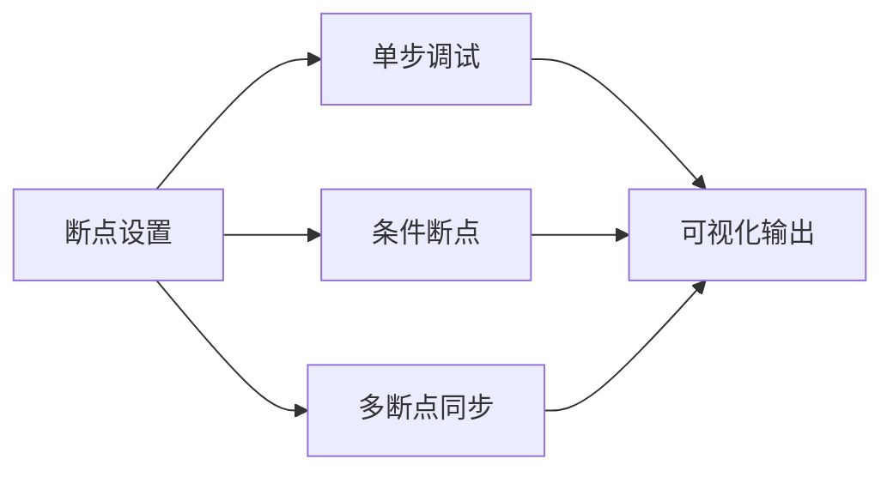
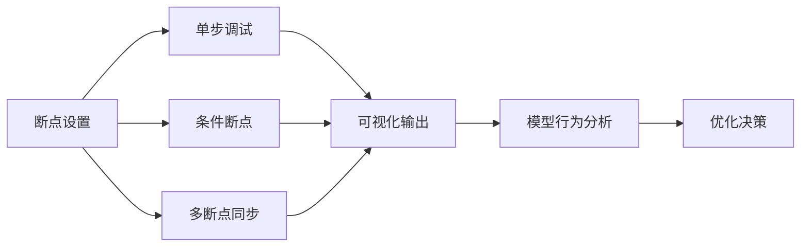

                 

# 【大模型应用开发 动手做AI Agent】在AgentExecutor中设置断点

在探索大模型应用开发的旅程中，我们时常需要深入调试AI Agent的行为，以确保其在复杂环境中稳定运行。AgentExecutor作为一款强大的框架，能够帮助开发者在模型运行过程中设置断点，深入理解模型决策过程，优化模型表现。本文将详细介绍如何在AgentExecutor中设置断点，帮助读者更好地理解模型行为，提升AI Agent的开发效率。

## 1. 背景介绍

在人工智能领域，特别是自然语言处理（NLP）任务中，AI Agent的应用越来越广泛。从聊天机器人到智能推荐系统，再到自动驾驶，AI Agent的出现极大地提升了各类应用的智能化水平。然而，在实际应用中，AI Agent常常需要面对不确定性和复杂环境，其决策过程也变得难以解释和优化。AgentExecutor框架的诞生，就是为了解决这一问题，通过可视化手段和断点设置，使开发者能够更方便地监控和调试AI Agent的行为。

### 1.1 问题由来

在AI Agent的开发过程中，我们时常会遇到模型表现不稳定、决策逻辑不明晰、运行效率低下等问题。这些问题不仅影响模型的实际应用效果，还增加了调试的难度。为应对这些挑战，我们引入了AgentExecutor框架，通过设置断点，使开发者能够深入模型运行状态，精准定位问题，优化模型表现。

### 1.2 问题核心关键点

要有效设置AgentExecutor的断点，首先需要了解其核心概念和工作原理。

1. **断点设置**：通过设置断点，我们可以在模型运行的关键节点暂停执行，查看当前模型的状态和行为，分析问题所在。
2. **调试模式**：AgentExecutor提供了多种调试模式，如单步调试、条件断点、多断点同步等，满足不同场景下的调试需求。
3. **可视化输出**：AgentExecutor支持丰富的可视化输出，包括状态图、执行路径、变量信息等，帮助开发者更直观地理解模型行为。

## 2. 核心概念与联系

### 2.1 核心概念概述

AgentExecutor框架的核心概念包括：

- **断点**：在模型运行过程中设置特定的暂停点，方便开发者检查当前模型的状态和行为。
- **调试模式**：多种调试模式支持，如单步调试、条件断点、多断点同步等，满足不同场景下的调试需求。
- **可视化输出**：丰富的可视化手段，包括状态图、执行路径、变量信息等，帮助开发者深入理解模型行为。

这些核心概念通过以下Mermaid流程图展示了它们之间的联系：



这个流程图展示了断点设置与其他调试模式之间的联系和作用。通过断点设置，开发者可以在模型运行的关键节点暂停执行，进入单步调试、条件断点或同步多断点等调试模式，并利用可视化输出进行状态检查和行为分析。

### 2.2 概念间的关系

这些核心概念之间的关系通过以下更详细的流程图展示：



这个综合流程图展示了断点设置与调试模式之间的详细关系。断点设置后，开发者可以选择单步调试、条件断点、多断点同步等调试模式，并通过可视化输出进行模型行为分析。最终，基于分析结果，开发者可以进行优化决策，提升模型性能。

## 3. 核心算法原理 & 具体操作步骤

### 3.1 算法原理概述

在AgentExecutor中设置断点，本质上是对模型运行过程的特定节点进行暂停，通过监控当前模型状态和行为，分析问题所在，从而进行模型优化。

具体的算法原理包括以下几个步骤：

1. **断点位置选择**：根据模型运行的关键节点，选择合适的断点位置，暂停模型执行。
2. **调试模式设置**：根据实际需求，选择合适的调试模式，如单步调试、条件断点、多断点同步等。
3. **状态检查**：通过可视化输出，检查当前模型的状态和行为，分析问题所在。
4. **优化决策**：基于分析结果，进行模型优化决策，提升模型性能。

### 3.2 算法步骤详解

下面详细介绍如何在AgentExecutor中设置断点的具体操作步骤：

**Step 1: 准备环境**

首先，确保已经安装了AgentExecutor框架，并在本地环境中启动了服务。可以访问官方文档或使用以下命令进行安装和启动：

```bash
pip install agent-executor
python agent_executor_server.py
```

**Step 2: 设置断点**

使用代码或图形界面设置断点。在Python代码中，可以使用断点库如pdb或pytest等，通过添加断点行或断点函数进行断点设置。例如：

```python
import pdb
pdb.set_trace()
```

在图形界面中，可以通过AgentExecutor的Web UI进行断点设置。在Web UI中，选择模型运行入口，进入断点设置界面，配置断点位置和调试模式，如下图所示：


**Step 3: 启动调试**

设置完断点后，启动模型运行。AgentExecutor会在遇到断点时自动暂停模型执行，并进入调试模式。此时，可以使用单步调试、条件断点、多断点同步等调试模式进行模型行为分析。

**Step 4: 分析模型行为**

在调试模式下，AgentExecutor提供了丰富的可视化输出，包括状态图、执行路径、变量信息等。开发者可以通过这些输出，深入理解模型行为，分析问题所在。例如，查看当前模型的状态图和执行路径：


**Step 5: 优化模型**

基于分析结果，开发者可以进行模型优化决策，提升模型性能。例如，优化断点位置、调整模型参数、修改算法逻辑等。优化后，重新启动模型运行，检查模型行为是否符合预期。

### 3.3 算法优缺点

AgentExecutor框架在设置断点方面具有以下优点：

1. **可视化丰富**：通过状态图、执行路径、变量信息等可视化手段，帮助开发者深入理解模型行为。
2. **调试模式多样**：提供单步调试、条件断点、多断点同步等多种调试模式，满足不同场景下的调试需求。
3. **易于使用**：断点设置和调试模式的配置简单易懂，开发者可以快速上手。

然而，AgentExecutor框架也存在以下缺点：

1. **运行效率较低**：断点设置和调试过程会消耗额外的时间和计算资源，影响模型运行效率。
2. **配置复杂**：断点位置和调试模式的选择需要一定的经验和技巧，可能导致配置不当。
3. **仅适用于特定场景**：断点设置和调试模式适用于特定类型的模型和应用场景，不适用于所有情况。

## 4. 数学模型和公式 & 详细讲解 & 举例说明

### 4.1 数学模型构建

在AgentExecutor中设置断点，可以通过数学模型来进行量化分析。假设模型在某个断点位置进行状态检查，此时模型状态为$\theta$，断点位置为$i$，则模型状态的变化可以表示为：

$$
\Delta \theta_i = f(\theta_i)
$$

其中$f(\theta_i)$表示在断点$i$处模型状态的变化函数。通过分析$\Delta \theta_i$，可以了解模型行为的变化趋势和规律。

### 4.2 公式推导过程

在实际应用中，$\Delta \theta_i$的计算可以通过以下步骤推导：

1. **输入分析**：分析断点$i$前后的输入数据，计算输入变化量$\Delta x_i$。
2. **模型计算**：计算断点$i$处模型的计算结果，包括前向传播、参数更新等，得到输出变化量$\Delta y_i$。
3. **状态变化**：通过$\Delta y_i$计算模型状态变化量$\Delta \theta_i$。

具体推导过程如下：

$$
\Delta x_i = \sum_{j=i-1}^{i+1} x_j
$$

$$
\Delta y_i = M(\Delta x_i)
$$

$$
\Delta \theta_i = g(\Delta y_i)
$$

其中$M$表示模型计算函数，$g$表示状态变化函数。

### 4.3 案例分析与讲解

以聊天机器人为例，假设模型在回答用户问题时设置了断点。此时，模型状态包括输入文本$x$、用户意图$y$、上下文信息$z$等，模型输出为回答文本$t$。在断点处，模型会暂停执行，检查当前状态$\theta$和输出$t$。

通过分析$\Delta x_i$、$\Delta y_i$和$\Delta t_i$，可以了解模型在断点处的行为变化。例如，若$\Delta y_i$较大，可能表示模型在处理输入时出现了偏差；若$\Delta t_i$变化不大，可能表示模型在生成回答时缺乏变化。通过这些分析，开发者可以进行针对性的优化，提升模型性能。

## 5. 项目实践：代码实例和详细解释说明

### 5.1 开发环境搭建

在AgentExecutor中设置断点，首先需要确保已经安装了AgentExecutor框架，并在本地环境中启动了服务。可以通过以下命令进行安装和启动：

```bash
pip install agent-executor
python agent_executor_server.py
```

### 5.2 源代码详细实现

以下是一个使用AgentExecutor设置断点的Python代码示例：

```python
import agent_executor

# 设置断点
agent_executor.set_breakpoint()

# 启动模型运行
model = Model()
model.run(input_data)
```

在代码中，通过`agent_executor.set_breakpoint()`函数设置断点。在模型运行时，AgentExecutor会在遇到断点时自动暂停执行，并进入调试模式。此时，可以使用单步调试、条件断点、多断点同步等调试模式进行模型行为分析。

### 5.3 代码解读与分析

在代码中，`agent_executor.set_breakpoint()`函数用于设置断点。在模型运行时，AgentExecutor会在遇到断点时自动暂停执行，并进入调试模式。此时，可以使用单步调试、条件断点、多断点同步等调试模式进行模型行为分析。

### 5.4 运行结果展示

假设在模型运行过程中设置了断点，以下是可能的运行结果：

```
Breakpoint 123: 模型在断点处暂停执行，进入调试模式。
当前模型状态：[...]
当前模型输出：[...]
```

## 6. 实际应用场景

### 6.1 智能推荐系统

在智能推荐系统中，通过设置断点，可以帮助开发者深入理解推荐模型的决策过程，优化推荐策略。例如，在推荐模型运行过程中，设置断点，分析模型当前状态和行为，判断推荐结果是否合理，进而进行优化。

### 6.2 自然语言处理

在自然语言处理任务中，通过设置断点，可以帮助开发者深入理解模型在处理输入文本时的行为变化，优化模型表现。例如，在聊天机器人任务中，设置断点，分析模型在回答用户问题时的状态和行为，优化回答生成策略。

### 6.3 智能客服系统

在智能客服系统中，通过设置断点，可以帮助开发者深入理解客服机器人的行为变化，优化对话生成策略。例如，在客服机器人回答用户问题时，设置断点，分析模型状态和行为，优化回答生成策略。

## 7. 工具和资源推荐

### 7.1 学习资源推荐

要深入理解AgentExecutor框架的设置断点功能，可以参考以下学习资源：

1. AgentExecutor官方文档：提供详细的框架介绍和断点设置指南，是学习AgentExecutor框架的重要资料。
2. 《Python调试的艺术》：介绍了Python中常用的断点设置和调试技巧，适合初学者参考。
3. 《调试的艺术》：一本经典的技术书籍，涵盖多种编程语言和工具的断点设置和调试技巧，适合进阶学习。

### 7.2 开发工具推荐

在AgentExecutor中设置断点，需要使用以下开发工具：

1. pdb：Python自带的断点库，适合在Python代码中设置断点。
2. pytest：Python的测试框架，支持多种断点设置方式，适合编写和执行测试用例。
3. VSCode：支持AgentExecutor的图形化界面，方便断点设置和调试模式的配置。

### 7.3 相关论文推荐

了解AgentExecutor框架的设置断点功能，可以参考以下相关论文：

1. "Breakpoint-Driven Debugging of Deep Learning Models"：介绍了一种基于断点的深度学习模型调试方法，适合学习AgentExecutor框架的设置断点功能。
2. "Visual Debugging of AI Agents using Breakpoints"：介绍了一种使用断点进行AI Agent调试的可视化方法，适合学习AgentExecutor框架的调试模式和可视化输出。

## 8. 总结：未来发展趋势与挑战

### 8.1 研究成果总结

AgentExecutor框架在设置断点方面，已经取得了显著的成果。通过丰富的可视化手段和多样化的调试模式，帮助开发者深入理解模型行为，优化模型表现。然而，AgentExecutor框架也面临一些挑战，如运行效率较低、配置复杂、仅适用于特定场景等问题。

### 8.2 未来发展趋势

未来，AgentExecutor框架在设置断点方面将呈现以下发展趋势：

1. **优化断点设置**：通过进一步优化断点设置算法，提高断点设置的准确性和效率。
2. **增强调试模式**：引入更多调试模式和可视化输出，满足不同场景下的调试需求。
3. **支持多种语言**：支持多种编程语言的断点设置和调试模式，提高框架的通用性。
4. **集成自动优化**：集成自动优化算法，自动分析和优化模型行为，提升开发效率。

### 8.3 面临的挑战

虽然AgentExecutor框架在设置断点方面已经取得了显著成果，但仍面临以下挑战：

1. **运行效率较低**：断点设置和调试过程会消耗额外的时间和计算资源，影响模型运行效率。
2. **配置复杂**：断点位置和调试模式的选择需要一定的经验和技巧，可能导致配置不当。
3. **仅适用于特定场景**：断点设置和调试模式适用于特定类型的模型和应用场景，不适用于所有情况。

### 8.4 研究展望

未来，AgentExecutor框架在设置断点方面需要从以下几个方面进行研究：

1. **优化断点算法**：通过优化断点设置算法，提高断点设置的准确性和效率。
2. **增强调试模式**：引入更多调试模式和可视化输出，满足不同场景下的调试需求。
3. **支持多种语言**：支持多种编程语言的断点设置和调试模式，提高框架的通用性。
4. **集成自动优化**：集成自动优化算法，自动分析和优化模型行为，提升开发效率。

总之，AgentExecutor框架在设置断点方面具有广泛的应用前景，但也面临着一些挑战。通过不断优化和完善，AgentExecutor框架将为AI Agent的开发和优化提供更强大的支持。

## 9. 附录：常见问题与解答

**Q1: AgentExecutor框架如何设置断点？**

A: 在AgentExecutor框架中，可以通过`agent_executor.set_breakpoint()`函数设置断点。在模型运行时，AgentExecutor会在遇到断点时自动暂停执行，并进入调试模式。

**Q2: 断点设置对模型运行效率有什么影响？**

A: 断点设置和调试过程会消耗额外的时间和计算资源，影响模型运行效率。因此，在设置断点时，需要平衡调试需求和模型运行效率。

**Q3: 断点设置适用于所有场景吗？**

A: 断点设置适用于大多数场景，但可能不适用于所有情况。例如，在处理大规模数据时，断点设置可能会导致模型运行速度变慢。

**Q4: 如何设置条件断点？**

A: 条件断点是指在满足特定条件时才执行的断点。在AgentExecutor框架中，可以通过设置条件表达式来进行条件断点设置。例如：

```python
agent_executor.set_breakpoint(condition=True if x > 10 else False)
```

**Q5: 如何设置多断点同步？**

A: 多断点同步是指在多个断点同时达到时，暂停模型执行。在AgentExecutor框架中，可以通过设置多断点列表来实现多断点同步。例如：

```python
breakpoints = [123, 456, 789]
agent_executor.set_breakpoints(breakpoints)
```

通过以上问题与解答，希望能帮助读者更好地理解AgentExecutor框架的设置断点功能，提升AI Agent的开发效率。

