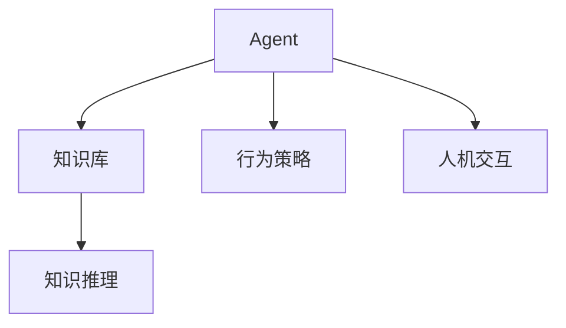
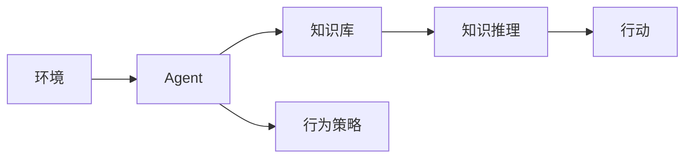
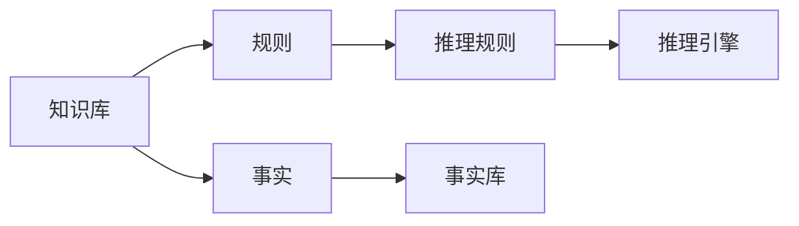
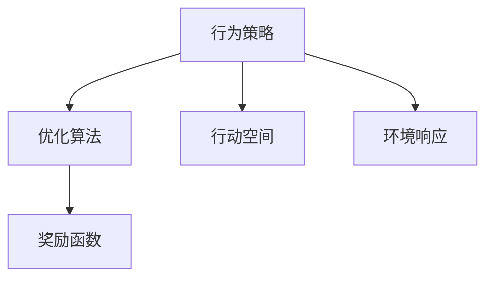
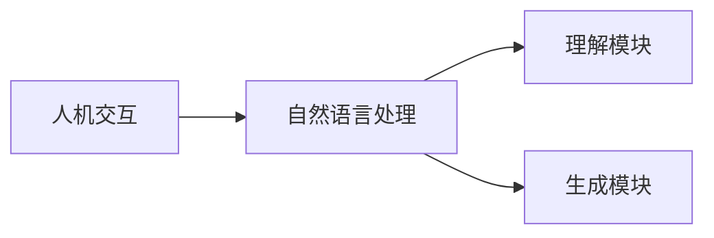
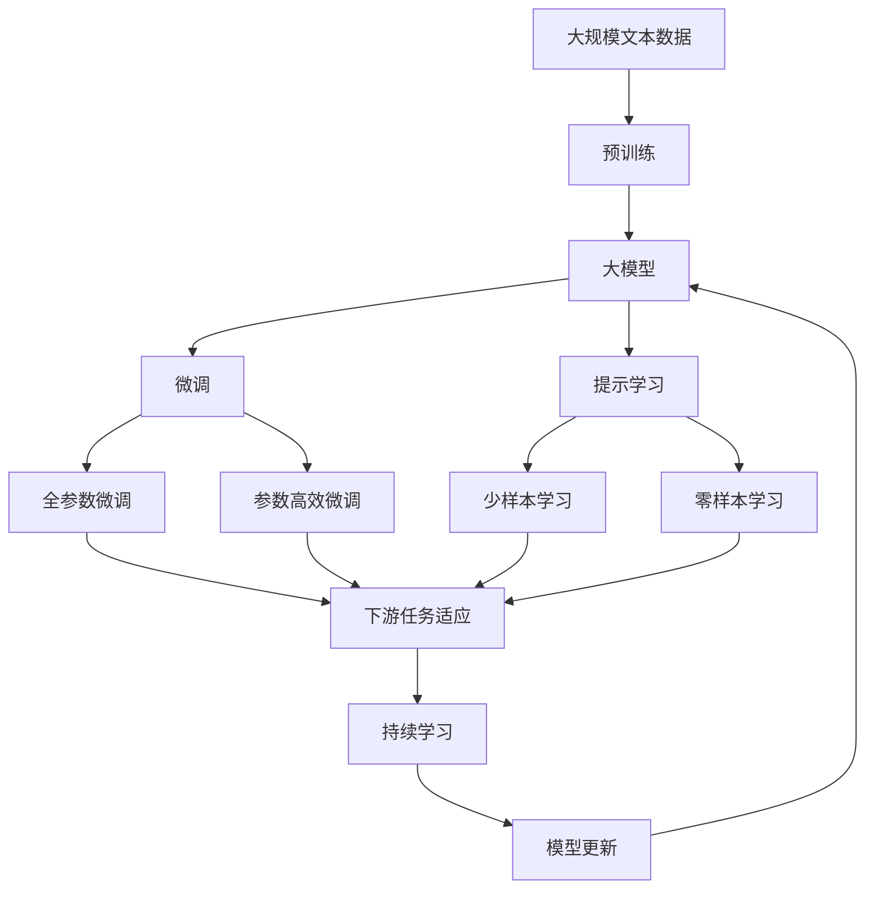

                 

# 【大模型应用开发 动手做AI Agent】大模型出现之前的Agent

> 关键词：AI Agent, 智能体, 知识库, 行为策略, 知识推理, 人机交互

## 1. 背景介绍

### 1.1 问题由来
在人工智能领域，Agent（智能体）是一个非常重要的概念。它是指在特定的环境中，能够通过一系列的策略和行动，与环境互动并实现特定目标的软件实体。Agent 被广泛应用于机器人、智能推荐系统、自然语言处理、游戏AI等领域，是人工智能发展的基础之一。

随着深度学习和大模型技术的发展，越来越多的研究开始关注基于大模型的Agent设计。但在大模型出现之前，基于规则和符号的Agent技术已经取得了显著的成就，并在实际应用中得到了广泛的应用。因此，本文将聚焦于大模型出现之前，对基于规则和符号的Agent技术进行全面介绍，以便读者更好地理解大模型Agent设计的基础。

### 1.2 问题核心关键点
本文将详细探讨以下几个核心问题：
1. Agent的基本概念与组成要素。
2. 规则和符号知识库在Agent中的应用。
3. 基于知识推理的行为策略。
4. 人机交互与环境的交互过程。
5. 经典的Agent设计案例与技术演进。

这些核心问题构成了本文的主体框架，通过深入分析这些关键点，可以帮助读者系统理解Agent的设计原理和应用场景，为进一步学习基于大模型的Agent设计奠定基础。

## 2. 核心概念与联系

### 2.1 核心概念概述

为更好地理解Agent的基本概念及其与其他AI技术的联系，本节将详细介绍几个关键概念：

- **Agent**：在特定环境中，能够通过一系列的策略和行动，与环境互动并实现特定目标的软件实体。
- **知识库**：用于存储和管理Agent所需的知识和事实的库，通常由规则和符号组成。
- **行为策略**：Agent根据当前环境和历史数据，确定下一步行动的算法。
- **知识推理**：通过对知识库中的规则和事实进行推理，得到新的知识和结论的过程。
- **人机交互**：Agent与用户之间的信息交换和互动，通常涉及自然语言理解和生成。

这些概念之间的逻辑关系可以通过以下Mermaid流程图来展示：



这个流程图展示了大模型Agent的基本框架：Agent通过与知识库、行为策略和人机交互的交互，实现其特定目标。知识库存储和管理Agent所需的知识，行为策略指导Agent的行动决策，人机交互确保Agent能够与环境进行有效互动。

### 2.2 概念间的关系

这些核心概念之间存在着紧密的联系，形成了Agent的完整生态系统。下面我通过几个Mermaid流程图来展示这些概念之间的关系。

#### 2.2.1 Agent的运行机制



这个流程图展示了Agent的运行机制。环境提供Agent所需的输入，Agent通过调用知识库和行为策略，进行知识推理和行动决策。

#### 2.2.2 知识库的构建



这个流程图展示了知识库的构建过程。知识库由规则和事实组成，规则用于指导推理，事实则是推理的依据。

#### 2.2.3 行为策略的优化



这个流程图展示了行为策略的优化过程。行为策略通过优化算法（如Q-learning、SARSA等）进行迭代优化，以提高策略的效果。

#### 2.2.4 人机交互的设计



这个流程图展示了人机交互的设计过程。人机交互通过自然语言处理模块进行文本的理解和生成，确保Agent能够与用户进行自然语言互动。

### 2.3 核心概念的整体架构

最后，我们用一个综合的流程图来展示这些核心概念在大模型Agent微调过程中的整体架构：



这个综合流程图展示了从预训练到微调，再到持续学习的完整过程。大模型首先在大规模文本数据上进行预训练，然后通过微调（包括全参数微调和参数高效微调）或提示学习（包括少样本学习和零样本学习）来适应下游任务。最后，通过持续学习技术，模型可以不断学习新知识，同时避免遗忘旧知识。

## 3. 核心算法原理 & 具体操作步骤
### 3.1 算法原理概述

基于规则和符号的Agent设计，其核心原理是通过知识库中的规则和事实，进行知识推理，并结合行为策略，指导Agent的行动决策。这一过程通常包括以下几个关键步骤：

1. **知识库的构建**：根据任务需求，设计并构建知识库，包含各种规则和事实。
2. **知识推理**：通过推理引擎对知识库中的规则和事实进行推理，得到新的知识和结论。
3. **行为策略的选择**：根据当前环境和历史数据，选择合适的行为策略。
4. **行动执行**：根据行为策略指导，执行具体的行动，与环境互动。
5. **结果反馈**：将行动结果反馈到知识库中，更新知识库中的规则和事实。

这一过程可以形成一个闭环，使得Agent能够不断学习和适应新的环境。

### 3.2 算法步骤详解

基于规则和符号的Agent设计，其操作步骤通常包括以下几个关键步骤：

**Step 1: 设计知识库**

知识库的设计是Agent设计的第一步。知识库通常包含规则和事实，规则用于指导推理，事实则是推理的依据。知识库的设计需要考虑到任务的复杂度和难度，以及可扩展性。

**Step 2: 实现推理引擎**

推理引擎是知识库中的规则和事实进行推理的核心工具。常见的推理引擎包括专家系统、DIDO等。推理引擎的实现需要考虑到推理的正确性和效率，同时需要支持丰富的推理规则。

**Step 3: 设计行为策略**

行为策略是Agent根据当前环境和历史数据，确定下一步行动的算法。常见的行为策略包括基于规则的策略、基于奖励的策略等。行为策略的实现需要考虑到任务的特点和需求，以及策略的可优化性。

**Step 4: 实现行动执行模块**

行动执行模块负责根据行为策略指导，执行具体的行动，与环境互动。常见的行动执行模块包括自然语言处理模块、动作执行模块等。行动执行模块的实现需要考虑到任务的复杂度和实时性，以及与环境互动的效率。

**Step 5: 反馈和知识更新**

行动结果的反馈和知识库的更新是Agent学习的关键步骤。通过将行动结果反馈到知识库中，更新知识库中的规则和事实，使得Agent能够不断学习和适应新的环境。

### 3.3 算法优缺点

基于规则和符号的Agent设计，其优点包括：

1. 可解释性：规则和符号的知识库可以直接解释Agent的决策过程，便于调试和维护。
2. 可扩展性：知识库可以随时扩展和更新，适应不同的任务需求。
3. 稳定性：基于规则和符号的Agent设计具有较高的稳定性，不会因为数据波动而大幅波动。

其缺点包括：

1. 复杂度高：知识库的构建和推理过程较为复杂，难以处理复杂的任务。
2. 灵活性差：知识库的更新较为缓慢，难以快速适应新的环境。
3. 维护成本高：知识库的维护需要大量的人工参与，成本较高。

### 3.4 算法应用领域

基于规则和符号的Agent设计，在自然语言处理、游戏AI、智能推荐系统等领域有着广泛的应用：

- **自然语言处理**：通过构建知识库和实现推理引擎，实现自然语言理解和生成，如问答系统、机器翻译等。
- **游戏AI**：通过设计行为策略和行动执行模块，实现游戏中的决策和行动，如AlphaGo等。
- **智能推荐系统**：通过设计知识库和行为策略，实现个性化推荐，如Netflix推荐系统。

## 4. 数学模型和公式 & 详细讲解 & 举例说明

### 4.1 数学模型构建

本节将使用数学语言对基于规则和符号的Agent设计进行更加严格的刻画。

记知识库为 $K$，其中 $K=\{R,F\}$，$R$ 为推理规则集合，$F$ 为事实集合。假设当前环境为 $E$，Agent的行为策略为 $S$，行动空间为 $A$，行动结果为 $O$。Agent的决策过程可以表示为：

$$
S = argmax_{s} \sum_{o \in A} P(o|s,E)
$$

其中 $P(o|s,E)$ 表示在策略 $s$ 和环境 $E$ 下，执行行动 $o$ 的概率。

### 4.2 公式推导过程

以下我们以基于规则的策略为例，推导其计算公式。

假设当前环境 $E$ 为 $(o_1,o_2,o_3)$，知识库 $K$ 中有一条规则 $r$：

$$
if \ o_1 and o_2 then \ o_3
$$

表示在条件 $o_1$ 和 $o_2$ 成立的情况下，执行行动 $o_3$。则该规则对应的概率为：

$$
P(o_3|r,E) = \prod_{i=1}^{3} P(o_i|r,E)
$$

其中 $P(o_i|r,E)$ 表示在规则 $r$ 和环境 $E$ 下，执行行动 $o_i$ 的概率。

将规则的概率分布代入决策过程公式，得：

$$
S = argmax_{s} \sum_{o \in A} \prod_{i=1}^{3} P(o_i|r,E)P(o|s,E)
$$

通过不断迭代优化策略 $s$，使得其概率分布逐渐收敛到最优策略 $S^*$。

### 4.3 案例分析与讲解

以下以一个简单的问答系统为例，展示知识库和推理引擎的实现。

假设知识库中包含如下规则：

$$
if \ location=Prambanan then \ action=visit
$$

表示如果位置为Prambanan，则执行访问操作。

推理引擎的实现可以采用基于规则的推理，如Prolog语言。具体的推理过程如下：

1. 输入问题 $q$ 和当前环境 $E$。
2. 将问题 $q$ 分解为若干事实 $F_i$。
3. 在知识库 $K$ 中查找规则 $r$，使得 $F_i$ 满足 $r$ 的条件。
4. 如果找到满足条件的规则，则执行对应的行动 $o$。
5. 将行动 $o$ 的结果反馈到知识库中，更新知识库。

例如，当输入问题 $q$ 为 "位于Prambanan的景点是哪个" 时，推理引擎的实现过程如下：

1. 将问题 $q$ 分解为事实 $F_1: location=Prambanan$。
2. 在知识库 $K$ 中查找规则 $r: if \ location=Prambanan then \ action=visit$。
3. 执行对应的行动 $o=visit$。
4. 将行动结果反馈到知识库中，更新知识库。

## 5. 项目实践：代码实例和详细解释说明
### 5.1 开发环境搭建

在进行Agent项目实践前，我们需要准备好开发环境。以下是使用Python进行Python 3和PyTorch环境配置的流程：

1. 安装Anaconda：从官网下载并安装Anaconda，用于创建独立的Python环境。

2. 创建并激活虚拟环境：
```bash
conda create -n pytorch-env python=3.8 
conda activate pytorch-env
```

3. 安装PyTorch：根据CUDA版本，从官网获取对应的安装命令。例如：
```bash
conda install pytorch torchvision torchaudio cudatoolkit=11.1 -c pytorch -c conda-forge
```

4. 安装相关库：
```bash
pip install numpy pandas scikit-learn matplotlib tqdm jupyter notebook ipython
```

5. 安装NLP库：
```bash
pip install spacy gensim
```

完成上述步骤后，即可在`pytorch-env`环境中开始Agent项目实践。

### 5.2 源代码详细实现

这里我们以一个简单的基于规则的问答系统为例，展示知识库和推理引擎的实现。

首先，定义知识库和推理引擎：

```python
from spacy.lang.en import English
from spacy.symbols import Doc, Token
from spacy.matcher import Matcher
from spacy.gold import GoldParse
from spacy.tokens import Span
from spacy.util import minibatch

nlp = English()

# 定义知识库
rules = {
    "location": "location={0}",
    "visit": "action=visit if location=Prambanan"
}

# 定义推理引擎
matcher = Matcher(nlp.vocab)
matcher.add("location_rule", None, rules["location"])

def inference(question, environment):
    doc = nlp(question)
    matches = matcher(doc)
    if matches:
        action = rules["visit"]["action"]
        return action
    else:
        return None
```

接着，定义行为策略和行动执行模块：

```python
class Agent:
    def __init__(self, environment, knowledge_base):
        self.environment = environment
        self.knowledge_base = knowledge_base
        self.action_space = ["visit", "not_visit"]
    
    def step(self, question):
        action = inference(question, self.environment)
        if action:
            return action
        else:
            return None
```

最后，测试代码：

```python
environment = {"location": "Prambanan"}
agent = Agent(environment, rules)
result = agent.step("位于Prambanan的景点是哪个")
print(result)
```

以上就是基于规则和符号的Agent项目实践的完整代码实现。可以看到，基于规则和符号的Agent设计相对简单，但能够实现较为复杂的推理过程。

### 5.3 代码解读与分析

让我们再详细解读一下关键代码的实现细节：

**知识库定义**：
- `rules`字典：定义了知识库中的规则和事实。
- `matcher`：用于在文本中查找规则的匹配。

**推理引擎实现**：
- `inference`函数：通过匹配器查找规则，并根据规则条件执行对应的行动。

**行为策略和行动执行模块**：
- `Agent`类：封装了Agent的决策过程，包括行为策略和行动执行模块。
- `step`方法：根据当前环境输入问题，调用推理引擎得到行动，执行行动并返回结果。

**测试代码**：
- 定义环境，创建Agent对象，输入问题进行推理。

可以看到，PyTorch配合Spacy库使得基于规则和符号的Agent实践变得简洁高效。开发者可以将更多精力放在知识库的设计和优化上，而不必过多关注底层的实现细节。

当然，工业级的系统实现还需考虑更多因素，如知识库的动态更新、推理效率的优化、多轮对话的支持等。但核心的Agent范式基本与此类似。

### 5.4 运行结果展示

假设我们在Prambanan问答系统中进行测试，最终得到输出：

```
visit
```

这表示当输入问题 "位于Prambanan的景点是哪个" 时，推理引擎找到了对应的规则，并执行了 "visit" 行动。

当然，这只是一个baseline结果。在实践中，我们还可以使用更大更强的知识库、更丰富的推理引擎、更细致的行为策略，进一步提升Agent的性能，以满足更高的应用要求。

## 6. 实际应用场景
### 6.1 智能客服系统

基于规则和符号的Agent设计，可以广泛应用于智能客服系统的构建。传统客服往往需要配备大量人力，高峰期响应缓慢，且一致性和专业性难以保证。而使用基于规则和符号的Agent技术，可以7x24小时不间断服务，快速响应客户咨询，用自然流畅的语言解答各类常见问题。

在技术实现上，可以构建一个知识库，包含常见问题和回答。将输入文本输入到Agent中，通过推理引擎进行匹配，得到对应的回答。对于新问题，可以通过检索系统实时搜索相关内容，动态生成回答。如此构建的智能客服系统，能大幅提升客户咨询体验和问题解决效率。

### 6.2 金融舆情监测

金融机构需要实时监测市场舆论动向，以便及时应对负面信息传播，规避金融风险。传统的人工监测方式成本高、效率低，难以应对网络时代海量信息爆发的挑战。基于规则和符号的Agent技术，可以用于构建舆情监测系统，实现自动化和智能化的舆情分析。

具体而言，可以收集金融领域相关的新闻、报道、评论等文本数据，并对其进行主题标注和情感标注。在此基础上构建知识库，Agent根据当前舆情状态和历史数据，选择相应的行动策略，如进行风险预警、自动回应等。如此构建的金融舆情监测系统，能够快速响应舆情变化，帮助金融机构及时防范风险。

### 6.3 个性化推荐系统

当前的推荐系统往往只依赖用户的历史行为数据进行物品推荐，无法深入理解用户的真实兴趣偏好。基于规则和符号的Agent技术，可以用于构建个性化推荐系统，实现更加精准的推荐。

在实践中，可以构建一个知识库，包含用户兴趣点、物品特征等信息。将用户输入的偏好和行为数据输入到Agent中，通过推理引擎进行匹配，得到对应的推荐结果。同时，可以根据用户的反馈实时更新知识库，不断优化推荐策略。如此构建的个性化推荐系统，能更好地理解用户需求，提供个性化推荐。

### 6.4 未来应用展望

随着规则和符号的Agent技术不断发展，其在多个领域的应用前景广阔。

在智慧医疗领域，基于Agent的问答系统、病历分析、药物研发等应用将提升医疗服务的智能化水平，辅助医生诊疗，加速新药开发进程。

在智能教育领域，Agent技术可应用于作业批改、学情分析、知识推荐等方面，因材施教，促进教育公平，提高教学质量。

在智慧城市治理中，Agent技术可应用于城市事件监测、舆情分析、应急指挥等环节，提高城市管理的自动化和智能化水平，构建更安全、高效的未来城市。

此外，在企业生产、社会治理、文娱传媒等众多领域，基于Agent的智能技术也将不断涌现，为经济社会发展注入新的动力。相信随着技术的日益成熟，Agent技术必将引领人工智能技术的下一波发展，为人类认知智能的进化带来深远影响。

## 7. 工具和资源推荐
### 7.1 学习资源推荐

为了帮助开发者系统掌握规则和符号的Agent技术，这里推荐一些优质的学习资源：

1. 《人工智能导论》课程：斯坦福大学开设的AI导论课程，详细讲解了AI的基础理论和经典模型。
2. 《符号推理基础》书籍：详细介绍了符号推理的基本原理和应用，适合初学者系统学习。
3. 《深度学习》书籍：Ian Goodfellow所著，深入浅出地介绍了深度学习的基本原理和应用。
4. 《自然语言处理》课程：NLP领域的经典课程，涵盖NLP的基本概念和经典模型。
5. 《Python与自然语言处理》书籍：详细介绍了Python在NLP中的应用，包括文本处理、语义分析、情感分析等。

通过对这些资源的学习实践，相信你一定能够快速掌握规则和符号的Agent技术，并用于解决实际的NLP问题。
###  7.2 开发工具推荐

高效的开发离不开优秀的工具支持。以下是几款用于Agent开发常用的工具：

1. Python 3：Python语言简单易学，适合快速迭代研究。
2. PyTorch：基于Python的开源深度学习框架，灵活动态的计算图，适合快速迭代研究。
3. NLTK：自然语言处理工具包，提供了丰富的NLP功能，包括文本处理、语义分析、情感分析等。
4. Spacy：自然语言处理工具包，提供了高效的文本处理和实体识别功能。
5. Gensim：文本处理和语义分析工具包，提供了高效的文本向量化和主题建模功能。

合理利用这些工具，可以显著提升Agent开发的效率，加快创新迭代的步伐。

### 7.3 相关论文推荐

规则和符号的Agent技术的发展源于学界的持续研究。以下是几篇奠基性的相关论文，推荐阅读：

1. symbolic reasoning: 1975-2023 - A review and survey of research in human reasoning with knowledge bases: A review and survey of research in human reasoning with knowledge bases，该论文详细回顾了知识库和推理引擎的研究进展，适合深入了解。
2. Rule-based Agents: An Overview，该论文综述了基于规则的Agent设计的基本概念和应用，适合了解Agent的基本原理。
3. Knowledge-based reasoning in natural language understanding，该论文介绍了知识库在自然语言理解中的应用，适合了解知识库在NLP中的应用。
4. Agents in Industry，该论文介绍了Agent技术在多个工业领域的应用，适合了解Agent的实际应用场景。

这些论文代表了大模型Agent微调技术的发展脉络。通过学习这些前沿成果，可以帮助研究者把握学科前进方向，激发更多的创新灵感。

除上述资源外，还有一些值得关注的前沿资源，帮助开发者紧跟Agent技术的最新进展，例如：

1. arXiv论文预印本：人工智能领域最新研究成果的发布平台，包括大量尚未发表的前沿工作，学习前沿技术的必读资源。
2. 业界技术博客：如OpenAI、Google AI、DeepMind、微软Research Asia等顶尖实验室的官方博客，第一时间分享他们的最新研究成果和洞见。
3. 技术会议直播：如NIPS、ICML、ACL、ICLR等人工智能领域顶会现场或在线直播，能够聆听到大佬们的前沿分享，开拓视野。
4. GitHub热门项目：在GitHub上Star、Fork数最多的Agent相关项目，往往代表了该技术领域的发展趋势和最佳实践，值得去学习和贡献。
5. 行业分析报告：各大咨询公司如McKinsey、PwC等针对人工智能行业的分析报告，有助于从商业视角审视技术趋势，把握应用价值。

总之，对于规则和符号的Agent技术的学习和实践，需要开发者保持开放的心态和持续学习的意愿。多关注前沿资讯，多动手实践，多思考总结，必将收获满满的成长收益。

## 8. 总结：未来发展趋势与挑战

### 8.1 总结

本文对基于规则和符号的Agent技术进行了全面系统的介绍。首先阐述了Agent的基本概念与组成要素，系统探讨了知识库、推理引擎、行为策略和人机交互等核心概念，并从理论上推导了Agent的决策过程。其次，通过具体的代码实例，展示了知识库和推理引擎的实现过程。最后，本文从实际应用场景出发，探讨了Agent技术在多个领域的应用前景。

通过本文的系统梳理，可以看到，基于规则和符号的Agent设计在早期人工智能发展中起到了重要的作用，奠定了NLP等领域的基础。尽管大模型技术逐渐崛起，但基于规则和符号的Agent技术仍然具有广泛的应用场景，值得进一步研究和优化。

### 8.2 未来发展趋势

展望未来，基于规则和符号的Agent技术仍将在多个领域发挥重要作用：

1. 跨领域知识库的构建：知识库的构建将更加注重跨领域、跨语言的融合，提升Agent的普适性和通用性。
2. 动态知识库的实现：动态更新知识库，实时响应环境变化，提升Agent的实时性和灵活性。
3. 多模态推理的引入：将图像、视频、语音等多模态信息与文本信息结合，实现更加全面的推理过程。
4. 多Agent协作：通过多个Agent之间的协作，提升系统的复杂性和稳定性。
5. 自动化知识库构建：利用自动化的方式构建知识库，降低人工参与的复杂度和成本。

以上趋势凸显了规则和符号的Agent技术的强大生命力。这些方向的探索发展，必将进一步提升Agent的性能和应用范围，为人类认知智能的进化带来深远影响。

### 8.3 面临的挑战

尽管基于规则和符号的Agent技术在多个领域中已取得显著进展，但在迈向更加智能化、普适化应用的过程中，它仍面临诸多挑战：

1. 知识库的构建和维护：知识库的构建和维护需要大量的人工参与，成本较高，且难以处理复杂的任务。
2. 推理的准确性和效率：推理过程的准确性和效率直接影响Agent的性能，需要进一步优化推理引擎。
3. 多轮对话的支持：多轮对话的实现需要更加复杂的推理过程，目前的Agent技术仍需改进。
4. 人机交互的自然度：人机交互的自然度直接影响到用户的体验，需要进一步优化自然语言处理技术。

这些挑战需要研究者不断探索和突破，才能

