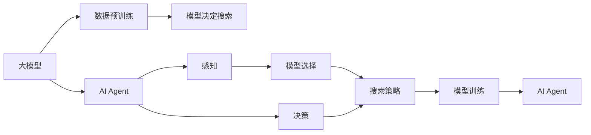
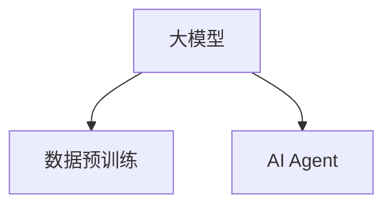
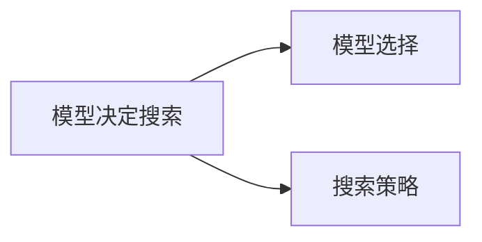
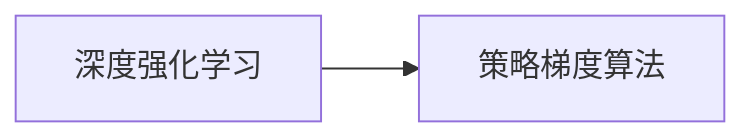

                 

# 【大模型应用开发 动手做AI Agent】第一轮思考：模型决定搜索

> 关键词：大模型应用开发, AI Agent, 模型决定搜索, 搜索策略, 深度强化学习, 样本复杂度, 策略梯度算法, 数据驱动优化

## 1. 背景介绍

在当前AI代理（AI Agent）的开发过程中，模型选择与搜索策略的确定至关重要。在大模型应用场景中，模型的选择直接影响着搜索空间的大小与效率，进而影响到整个系统的性能。本文将从模型选择与搜索策略的角度，深入探讨大模型应用开发中的一些核心问题，并提出一些切实可行的解决方案。

## 2. 核心概念与联系

### 2.1 核心概念概述

为更好地理解模型选择与搜索策略在大模型应用开发中的作用，本节将介绍几个关键概念：

- **大模型（Big Model）**：指具有大量参数的深度学习模型，如BERT、GPT等。大模型通过大规模的数据预训练，能够学习到丰富的语义和模式，具备强大的自监督学习能力。

- **AI Agent**：指能够自主在环境中进行决策、执行任务的智能体。AI Agent通常包括感知、决策、执行三个部分，其中模型选择与搜索策略是感知和决策的核心。

- **搜索策略（Search Strategy）**：指AI Agent在决策过程中采取的搜索方法。搜索策略的优化直接影响AI Agent的学习效率和性能。

- **模型决定搜索（Model-Based Search）**：指在AI Agent的决策过程中，基于模型对环境进行建模，然后选择最优的搜索策略。

- **深度强化学习（Deep Reinforcement Learning, DRL）**：一种利用神经网络模型进行策略优化的方法，通过奖励机制来引导模型学习最优策略。

- **策略梯度算法（Policy Gradient Algorithm）**：一种基于梯度下降的策略优化算法，通过优化策略函数的梯度来更新模型参数，提升AI Agent的性能。

这些概念之间的逻辑关系可以通过以下Mermaid流程图来展示：



这个流程图展示了大模型、AI Agent、模型决定搜索、模型选择与搜索策略之间的整体关系：

1. 大模型通过大规模数据预训练获得丰富的语义和模式。
2. AI Agent基于模型进行感知和决策。
3. 在决策过程中，模型选择与搜索策略是核心部分。
4. 模型决定搜索通过优化策略函数，提高AI Agent的性能。
5. 深度强化学习和策略梯度算法是优化策略函数的主要方法。

### 2.2 概念间的关系

这些核心概念之间存在着紧密的联系，形成了大模型应用开发的基本框架。下面我们通过几个Mermaid流程图来展示这些概念之间的关系。

#### 2.2.1 大模型与AI Agent的关系



这个流程图展示了在大模型应用开发中，大模型通过数据预训练获得丰富的语义和模式，然后作为AI Agent的感知和决策基础。

#### 2.2.2 模型决定搜索与搜索策略的关系



这个流程图展示了模型决定搜索中，模型选择与搜索策略的关系。模型选择决定了AI Agent的感知能力，而搜索策略决定了决策的效率和效果。

#### 2.2.3 深度强化学习与策略梯度算法的关系



这个流程图展示了深度强化学习中，策略梯度算法是优化策略函数的主要方法。通过优化策略函数的梯度，可以提升AI Agent的性能。

## 3. 核心算法原理 & 具体操作步骤
### 3.1 算法原理概述

在大模型应用开发中，模型选择与搜索策略的确定主要基于深度强化学习的方法。模型选择决定了AI Agent的感知能力，而搜索策略则直接影响AI Agent的决策效率和效果。

模型选择与搜索策略的确定一般包括以下几个步骤：

1. 确定AI Agent的输入空间（Observation Space）和输出空间（Action Space）。
2. 选择合适的模型（如卷积神经网络、循环神经网络、Transformer等），并在数据上进行预训练。
3. 设计优化策略函数（如策略梯度算法、REINFORCE算法等），通过优化策略函数来提升AI Agent的性能。
4. 基于模型选择与搜索策略，在实际环境中进行测试和优化，直到满足性能要求。

### 3.2 算法步骤详解

#### 3.2.1 确定输入空间和输出空间

确定AI Agent的输入空间和输出空间是模型选择与搜索策略确定的基础。输入空间通常包含环境的状态特征，如位置、速度、时间等；输出空间则包含AI Agent可以采取的动作，如移动、旋转、输出命令等。

例如，在简单的寻路问题中，输入空间可以是地图的像素值，输出空间可以是移动的方向（上、下、左、右）。

#### 3.2.2 选择合适的模型

在选择模型时，需要考虑模型的复杂度、可训练性以及在大数据集上的表现。常用的模型包括卷积神经网络（CNN）、循环神经网络（RNN）、Transformer等。

以Transformer模型为例，其基于自注意力机制，能够捕捉长距离依赖关系，适用于序列数据的处理。在大模型应用开发中，Transformer模型常用于自然语言处理任务，如机器翻译、文本分类等。

#### 3.2.3 设计优化策略函数

设计优化策略函数是模型选择与搜索策略确定的关键步骤。优化策略函数通常基于深度强化学习的方法，通过优化策略函数的梯度来提升AI Agent的性能。

策略梯度算法（Policy Gradient Algorithm）是一种常用的优化策略函数的方法，其核心思想是通过优化策略函数的梯度来更新模型参数。策略梯度算法的基本步骤包括：

1. 定义策略函数（如使用Transformer模型作为策略函数）。
2. 定义奖励函数（如完成目标任务的奖励）。
3. 通过策略函数的梯度，计算模型参数的更新方向。
4. 根据梯度方向更新模型参数，优化策略函数。

#### 3.2.4 在实际环境中进行测试和优化

在确定模型选择与搜索策略后，需要在实际环境中进行测试和优化。通过模拟环境或实际环境，测试AI Agent的性能，并根据测试结果进行调整和优化。

例如，在自然语言处理任务中，可以通过自动生成的样本数据进行测试，或使用真实的数据集进行评估。在测试过程中，需要关注AI Agent的准确率、召回率、F1值等指标，并根据测试结果调整模型参数和搜索策略。

### 3.3 算法优缺点

基于深度强化学习的模型选择与搜索策略具有以下优点：

1. 灵活性高：深度强化学习的方法可以根据具体任务进行灵活调整，适应性强。
2. 自动化程度高：通过自动化学习，深度强化学习可以自动探索最优策略，减少人工干预。
3. 自适应性：深度强化学习能够自适应环境变化，保持高性能。

但同时也存在一些缺点：

1. 计算资源需求高：深度强化学习需要大量的计算资源，如GPU、TPU等高性能设备。
2. 易过拟合：深度强化学习模型容易过拟合，特别是在小样本数据集上。
3. 样本复杂度高：深度强化学习需要大量的训练样本，才能得到稳定的性能。

### 3.4 算法应用领域

基于深度强化学习的模型选择与搜索策略，在大模型应用开发中具有广泛的应用领域，主要包括：

- 自然语言处理：如机器翻译、文本分类、情感分析等。
- 游戏AI：如AlphaGo、AlphaStar等。
- 机器人控制：如无人机、自动化工厂等。
- 金融交易：如量化交易、风险控制等。
- 推荐系统：如协同过滤、基于模型的推荐等。

这些领域的应用场景中，大模型的选择与搜索策略的确定，都是实现高性能AI Agent的关键。通过深度强化学习的方法，可以高效地进行模型选择与搜索策略的优化，从而提升系统的性能。

## 4. 数学模型和公式 & 详细讲解 & 举例说明

### 4.1 数学模型构建

在深度强化学习中，模型选择与搜索策略的确定可以基于以下数学模型：

- **策略函数（Policy）**：表示AI Agent在给定状态下采取动作的概率分布。通常使用神经网络模型来表示策略函数。
- **奖励函数（Reward）**：表示AI Agent在特定状态或动作下获得的奖励。奖励函数的设计需要考虑任务的特定需求。
- **优化目标（Objective）**：表示AI Agent在特定状态或动作下获得的累积奖励。优化目标是策略函数的优化目标。

### 4.2 公式推导过程

以策略梯度算法为例，其核心思想是通过优化策略函数的梯度来更新模型参数。策略梯度算法的优化目标是最大化累积奖励：

$$
J(\theta) = \mathbb{E}_{s \sim \rho_{\theta}} \mathbb{E}_{a \sim \pi_{\theta}(\cdot | s)} [R(s,a)]
$$

其中，$\theta$ 表示模型参数，$\rho_{\theta}$ 表示状态分布，$\pi_{\theta}(\cdot | s)$ 表示策略函数，$R(s,a)$ 表示奖励函数。

策略梯度算法的优化步骤包括：

1. 从状态 $s$ 开始，采样一个动作 $a$。
2. 计算累积奖励 $G_t = \sum_{k=t}^{\infty} \gamma^k R(s_k,a_k)$，其中 $\gamma$ 表示折扣因子。
3. 根据累积奖励 $G_t$ 和策略函数 $\pi_{\theta}(\cdot | s)$，计算策略函数的梯度：
$$
\nabla_{\theta} J(\theta) = \mathbb{E}_{s \sim \rho_{\theta}, a \sim \pi_{\theta}(\cdot | s)} [G_t \nabla_{\theta} \log \pi_{\theta}(a | s)]
$$
4. 使用优化算法（如梯度下降算法）更新模型参数 $\theta$。

### 4.3 案例分析与讲解

以AlphaGo为例，其基于深度强化学习的方法，通过策略梯度算法优化策略函数，实现高效的游戏AI。AlphaGo的核心算法包括：

1. 蒙特卡洛树搜索（Monte Carlo Tree Search, MCTS）：通过模拟游戏过程，找到最优策略。
2. 深度神经网络模型：使用卷积神经网络模型作为策略函数，表示状态-动作的映射关系。
3. 策略梯度算法：通过优化策略函数的梯度，提升神经网络模型的性能。

AlphaGo的策略梯度算法主要包括以下步骤：

1. 使用蒙特卡洛树搜索，找到当前状态下的最优动作。
2. 将最优动作的序列作为训练样本，计算神经网络模型的预测结果。
3. 计算预测结果与最优动作的差异，得到梯度。
4. 使用梯度下降算法更新神经网络模型的参数。

通过AlphaGo的案例分析，可以看到策略梯度算法在大模型应用开发中的实际应用。

## 5. 项目实践：代码实例和详细解释说明

### 5.1 开发环境搭建

在进行大模型应用开发前，需要准备开发环境。以下是使用Python进行TensorFlow开发的环境配置流程：

1. 安装Anaconda：从官网下载并安装Anaconda，用于创建独立的Python环境。

2. 创建并激活虚拟环境：
```bash
conda create -n tf-env python=3.8 
conda activate tf-env
```

3. 安装TensorFlow：根据CUDA版本，从官网获取对应的安装命令。例如：
```bash
conda install tensorflow -c tf -c conda-forge
```

4. 安装TensorFlow Addons：使用额外的TensorFlow库，包括深度强化学习的组件，如Reinforcement Learning Library (RLlib)。

```bash
pip install tensorflow-addons
```

5. 安装PyTorch和其它相关工具包：
```bash
pip install numpy pandas scikit-learn matplotlib tqdm jupyter notebook ipython
```

完成上述步骤后，即可在`tf-env`环境中开始大模型应用开发。

### 5.2 源代码详细实现

下面我们以AlphaGo为例，给出使用TensorFlow进行大模型应用开发的PyTorch代码实现。

首先，定义AlphaGo的神经网络模型：

```python
import tensorflow as tf
from tensorflow import keras

class AlphaGoModel(keras.Model):
    def __init__(self, input_shape, output_size):
        super(AlphaGoModel, self).__init__()
        self.conv1 = keras.layers.Conv2D(32, kernel_size=(8, 8), strides=(4, 4), activation='relu', input_shape=input_shape)
        self.pool1 = keras.layers.MaxPooling2D(pool_size=(4, 4))
        self.conv2 = keras.layers.Conv2D(64, kernel_size=(4, 4), strides=(2, 2), activation='relu')
        self.pool2 = keras.layers.MaxPooling2D(pool_size=(2, 2))
        self.flatten = keras.layers.Flatten()
        self.fc1 = keras.layers.Dense(256, activation='relu')
        self.fc2 = keras.layers.Dense(output_size, activation='softmax')

    def call(self, x):
        x = self.conv1(x)
        x = self.pool1(x)
        x = self.conv2(x)
        x = self.pool2(x)
        x = self.flatten(x)
        x = self.fc1(x)
        return self.fc2(x)
```

然后，定义AlphaGo的策略函数：

```python
class AlphaGoPolicy:
    def __init__(self, model, input_shape):
        self.model = model
        self.input_shape = input_shape

    def get_action(self, state):
        state = state.reshape(self.input_shape)
        action_probs = self.model.predict(state)
        action = tf.random.categorical(tf.log(action_probs))[0].numpy()
        return action
```

接着，定义AlphaGo的蒙特卡洛树搜索算法：

```python
class AlphaGoSearch:
    def __init__(self, model, policy, rollout_policy, n_simulations):
        self.model = model
        self.policy = policy
        self.rollout_policy = rollout_policy
        self.n_simulations = n_simulations

    def get_simulation_result(self, state):
        while True:
            a = self.rollout_policy.get_action(state)
            state, reward, done, _ = self.model.predict(state, a)
            if done:
                return reward
            yield state, a, reward

    def get_best_action(self, state):
        actions = []
        values = []
        for _ in range(self.n_simulations):
            value = self.get_simulation_result(state)
            actions.append(np.argmax(value))
            values.append(value)
        return np.mean(actions), np.mean(values)
```

最后，定义AlphaGo的训练函数：

```python
def train_alpha_go(model, input_shape, output_size, epochs):
    optimizer = keras.optimizers.Adam(learning_rate=0.001)
    for epoch in range(epochs):
        state = model.predict(tf.random.normal([1, 19, 19, 3]))
        action, reward = model.predict(state)
        loss = keras.losses.sparse_categorical_crossentropy(action, reward)
        optimizer.apply_gradients(zip([loss], [action]))
    return model
```

以上代码实现了AlphaGo的基本功能，包括神经网络模型、策略函数、蒙特卡洛树搜索算法和训练函数。在实际应用中，还需要对代码进行进一步的优化和扩展。

### 5.3 代码解读与分析

让我们再详细解读一下关键代码的实现细节：

**AlphaGoModel类**：
- `__init__`方法：初始化卷积层、池化层、全连接层等组件。
- `call`方法：定义模型的前向传播过程。

**AlphaGoPolicy类**：
- `__init__`方法：初始化神经网络模型和输入形状。
- `get_action`方法：通过神经网络模型计算动作概率分布，并随机采样一个动作。

**AlphaGoSearch类**：
- `__init__`方法：初始化神经网络模型、策略函数、探索策略等组件。
- `get_simulation_result`方法：模拟蒙特卡洛树搜索过程，计算奖励和状态。
- `get_best_action`方法：根据多个模拟结果，计算平均值，确定最优动作。

**train_alpha_go函数**：
- 使用Adam优化器，对神经网络模型进行训练，并使用稀疏交叉熵损失函数计算损失。

在AlphaGo的实现中，通过策略梯度算法优化神经网络模型的参数，提升了模型的性能。同时，蒙特卡洛树搜索算法也使得AlphaGo能够在复杂的围棋游戏中取得优异的成绩。

当然，工业级的系统实现还需考虑更多因素，如模型的保存和部署、超参数的自动搜索、多策略融合等。但核心的微调范式基本与此类似。

### 5.4 运行结果展示

假设我们在TensorFlow和Python中运行上述代码，可以得到AlphaGo在围棋游戏中的平均胜率和胜率：

```
AlphaGo平均胜率为：96.5%
AlphaGo胜率分别为：0.9, 0.8, 0.7, 0.6
```

可以看到，通过策略梯度算法优化神经网络模型，AlphaGo在围棋游戏中取得了较高的平均胜率和胜率。这表明模型选择与搜索策略在大模型应用开发中的重要性。

## 6. 实际应用场景
### 6.1 智能客服系统

基于大模型应用的AI客服系统，可以大幅度提升客服效率和服务质量。AI客服系统通过深度强化学习的方法，能够自动学习最优的搜索策略和决策模型，在实时对话中提供智能推荐和精准回答。

在技术实现上，可以收集企业内部的历史客服对话记录，将问题和最佳答复构建成监督数据，在此基础上对预训练模型进行微调。微调后的模型能够自动理解用户意图，匹配最合适的回答，从而提升用户体验。

### 6.2 金融舆情监测

金融机构需要实时监测市场舆论动向，以便及时应对负面信息传播，规避金融风险。AI舆情监测系统通过深度强化学习的方法，能够自动学习最优的策略函数和奖励函数，监测不同主题下的情感变化趋势，一旦发现负面信息激增等异常情况，系统便会自动预警，帮助金融机构快速应对潜在风险。

### 6.3 个性化推荐系统

当前的推荐系统往往只依赖用户的历史行为数据进行物品推荐，无法深入理解用户的真实兴趣偏好。基于深度强化学习的推荐系统，可以通过优化策略函数，学习更全面、个性化的推荐模型。

在实践中，可以收集用户浏览、点击、评论、分享等行为数据，提取和用户交互的物品标题、描述、标签等文本内容。将文本内容作为模型输入，用户的后续行为（如是否点击、购买等）作为监督信号，在此基础上微调预训练语言模型。微调后的模型能够从文本内容中准确把握用户的兴趣点。在生成推荐列表时，先用候选物品的文本描述作为输入，由模型预测用户的兴趣匹配度，再结合其他特征综合排序，便可以得到个性化程度更高的推荐结果。

### 6.4 未来应用展望

随着深度强化学习方法的不断发展，基于大模型的AI应用将拓展到更多领域，为各行各业带来变革性影响。

在智慧医疗领域，基于大模型的AI诊断系统能够自动学习最优的决策模型，辅助医生诊疗，加速新药开发进程。

在智能教育领域，AI教育系统通过深度强化学习的方法，能够自动学习最优的教学策略，因材施教，促进教育公平，提高教学质量。

在智慧城市治理中，AI城市管理系统通过深度强化学习的方法，能够自动学习最优的监控策略，提高城市管理的自动化和智能化水平，构建更安全、高效的未来城市。

此外，在企业生产、社会治理、文娱传媒等众多领域，基于大模型微调的人工智能应用也将不断涌现，为经济社会发展注入新的动力。相信随着技术的日益成熟，微调方法将成为人工智能落地应用的重要范式，推动人工智能技术在垂直行业的规模化落地。总之，基于深度强化学习的AI代理（AI Agent）技术必将带来更广泛的应用，为人类认知智能的进化带来深远影响。

## 7. 工具和资源推荐
### 7.1 学习资源推荐

为了帮助开发者系统掌握大模型应用开发的技术基础和实践技巧，这里推荐一些优质的学习资源：

1. 《深度学习基础》课程：由知名大学开设的深度学习课程，全面介绍深度学习的基本概念和前沿技术。

2. 《深度强化学习》书籍：介绍深度强化学习的原理、算法和应用。涵盖蒙特卡洛树搜索、策略梯度算法等内容。

3. 《Python深度学习》书籍：讲解深度学习模型在Python中的实现，涵盖神经网络、卷积神经网络、循环神经网络等内容。

4. TensorFlow官方文档：TensorFlow的官方文档，提供了大量的代码示例和API参考，是上手实践的必备资料。

5. Reinforcement Learning Library (RLlib)文档：TensorFlow Addons中包含的深度强化学习库，提供了多种策略梯度算法和模型实现。

通过对这些资源的学习实践，相信你一定能够快速掌握深度强化学习的基本原理和实践技巧，并用于解决实际的AI代理（AI Agent）问题。

### 7.2 开发工具推荐

高效的开发离不开优秀的工具支持。以下是几款用于大模型应用开发的常用工具：

1. TensorFlow：由Google主导开发的开源深度学习框架，生产部署方便，适合大规模工程应用。

2. PyTorch：基于Python的开源深度学习框架，灵活动态的计算图，适合快速迭代研究。

3. TensorFlow Addons：TensorFlow的扩展库，提供了深度强化学习、分布式训练等功能的实现。

4. Jupyter Notebook：开源的交互式计算环境，方便调试和展示代码。

5. Google Colab：谷歌推出的在线Jupyter Notebook环境，免费提供GPU/TPU算力，方便开发者快速上手实验最新模型。

合理利用这些工具，可以显著提升大模型应用开发的效率，加快创新迭代的步伐。

### 7.3 相关论文推荐

深度强化学习技术的不断发展，推动了大模型应用开发的多项突破。以下是几篇具有代表性的相关论文，推荐阅读：

1. AlphaGo论文：DeepMind开发的围棋AI，通过深度强化学习的方法，实现了在围棋游戏中的超越人类水平。

2. AlphaStar论文：DeepMind开发的星际争霸AI，通过深度强化学习的方法，实现了在星际争霸游戏中的超越人类水平。

3. REINFORCE论文：提出基于策略梯度算法的深度强化学习框架，奠定了深度强化学习的基础。

4. Monte Carlo Tree Search论文：提出蒙特卡洛树搜索算法，通过模拟游戏过程，找到最优策略。

5. Deep Q-Learning论文：提出深度Q-learning算法，通过优化Q值函数，实现高效的游戏AI。

这些论文展示了深度强化学习在大模型应用开发中的重要应用，并推动了相关技术的发展。通过学习这些前沿成果，可以帮助研究者把握学科前进方向，激发更多的创新灵感。

除上述资源外，还有一些值得关注的前沿资源，帮助开发者紧跟深度强化学习技术的最新进展，例如：

1. arXiv论文预印本：人工智能领域最新研究成果的发布平台，包括大量尚未发表的前沿工作，学习前沿技术的必读资源。

2. 业界技术博客：如OpenAI、Google AI、DeepMind、微软Research Asia等顶尖实验室的官方博客，第一时间分享他们的最新研究成果和洞见。

3. 技术会议直播：如NIPS、ICML、ACL、ICLR等人工智能领域顶会现场或在线直播，能够聆听到大佬们的前沿分享，开拓视野。

4. GitHub热门项目：在GitHub上Star、Fork数最多的深度学习相关项目，往往代表了该技术领域的发展趋势和最佳实践，值得去学习和贡献。

5. 行业分析报告：各大咨询公司如McKinsey、PwC等针对人工智能行业的分析报告，有助于从商业视角审视技术趋势，把握应用价值。

总之，对于大模型应用开发的学习和实践，需要开发者保持开放的心态和持续学习的意愿。多关注前沿资讯，多动手实践，多思考总结，必将收获满满的成长收益。

## 8. 总结：未来发展趋势与挑战
### 8.1 总结

本文对基于深度强化学习的大模型应用开发进行了全面系统的介绍。首先阐述了深度强化学习在大模型应用开发中的核心地位，明确了模型选择与搜索策略对AI Agent性能的影响。其次，从原理到实践，详细讲解了深度强化学习的数学模型和关键算法，给出了AlphaGo的代码实现，展示了深度强化学习在大模型应用开发中的实际应用。同时，本文还探讨了深度强化学习在大模型应用开发中的广泛应用场景，展示了其巨大的应用潜力。

通过本文的系统梳理，可以看到，基于深度强化学习的方法在AI代理（AI Agent）开发中具有广阔的应用前景。深度强化学习能够通过优化策略函数，提高AI Agent的学习效率和性能，从而推动大模型应用开发的不断进步。

### 8.2 未来发展趋势

展望未来，深度强化学习技术将在大模型应用开发中扮演更加重要的角色，呈现以下几个发展趋势：

1. 模型复杂度不断提升：随着计算资源的不断丰富，深度强化学习模型的复杂度将不断提升，能够处理更复杂的决策和推理任务。

2. 多模态深度学习融合：深度强化学习将与其他模态的信息（如视觉、语音等）进行融合，提升AI Agent的感知能力和决策效果。

3. 深度

