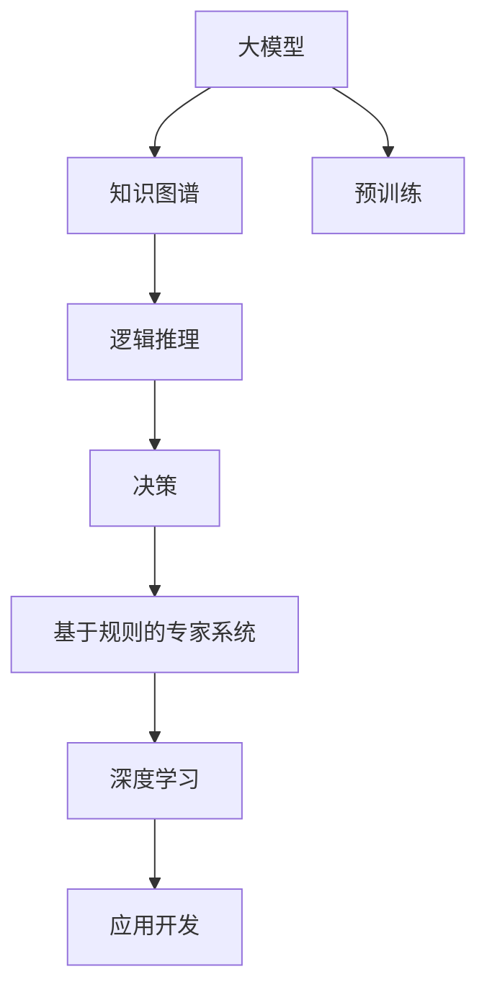

                 

# 【大模型应用开发 动手做AI Agent】第一轮思考：模型决定搜索

> 关键词：
大模型, 搜索, 知识图谱, 逻辑推理, 基于规则的专家系统, 深度学习, 应用开发

## 1. 背景介绍

在当前人工智能(AI)快速发展的背景下，大模型成为各行各业智能化应用的核心工具之一。特别是在知识图谱、专家系统等领域，如何高效构建AI Agent，使其具备强大的知识整合、推理和决策能力，是一个值得深入探讨的问题。

### 1.1 问题由来

AI Agent 在智能客服、推荐系统、智能决策等场景中扮演着重要的角色。然而，构建AI Agent 的过程复杂且充满挑战。其中，如何高效地集成知识、利用逻辑推理和决策规则，是构建一个高性能、可解释、可信赖的AI Agent 的关键。本文将通过大模型的视角，探讨AI Agent 在搜索、推理、决策等方面的应用开发，以及这些应用对模型和算法的要求。

### 1.2 问题核心关键点

构建高性能AI Agent的核心在于选择合适的大模型和优化算法，确保其在搜索、推理和决策过程中，能够高效地利用知识，同时保证推理过程的可解释性和鲁棒性。以下是几个关键问题：

- **模型选择**：如何选择大模型，使其能够高效集成知识？
- **搜索算法**：如何设计搜索算法，使AI Agent 能够快速找到问题的解？
- **推理规则**：如何设置推理规则，保证AI Agent 的决策可解释和可控？
- **决策优化**：如何优化AI Agent 的决策过程，使其在多目标约束下做出最优选择？

### 1.3 问题研究意义

构建AI Agent 不仅能够提升智能化应用的效果，还能大大降低人工干预和出错率。通过深度学习和符号推理的结合，AI Agent 可以在复杂的场景中，高效地完成搜索、推理和决策任务。这对提升企业的智能化水平、优化决策流程、降低成本具有重要意义。

## 2. 核心概念与联系

### 2.1 核心概念概述

为更好地理解大模型在AI Agent开发中的应用，本节将介绍几个密切相关的核心概念：

- **大模型**：以自回归(如GPT)或自编码(如BERT)模型为代表的大规模预训练语言模型。通过在大规模无标签文本语料上进行预训练，学习通用的语言表示，具备强大的语言理解和生成能力。

- **知识图谱(KG)**：由节点和边组成的图形结构，用于表示实体之间的语义关系和属性。

- **逻辑推理**：基于符号逻辑和规则的推理过程，用于判断命题的真值和推导结论。

- **基于规则的专家系统(Expert System)**：使用专家知识进行推理和决策的系统。

- **深度学习**：通过多层神经网络实现复杂模式识别的学习方式。

- **应用开发**：将AI Agent 应用于实际场景的过程。

### 2.2 概念间的关系

这些核心概念之间的逻辑关系可以通过以下Mermaid流程图来展示：



这个流程图展示了大模型、知识图谱、逻辑推理、决策、基于规则的专家系统和深度学习之间的关联：

1. 大模型通过预训练获得基础能力。
2. 知识图谱和逻辑推理为模型提供事实和规则，使AI Agent 能够进行推理和决策。
3. 基于规则的专家系统和深度学习用于优化推理和决策过程。
4. 最终，应用开发将AI Agent 应用于实际场景。

这些概念共同构成了AI Agent 开发的完整框架，使其能够在各种场景下高效地完成搜索、推理和决策任务。通过理解这些核心概念，我们可以更好地把握大模型在AI Agent开发中的应用方向和优化策略。

## 3. 核心算法原理 & 具体操作步骤
### 3.1 算法原理概述

AI Agent 的核心在于搜索和推理，而搜索和推理的过程可以视为求解复杂问题的过程。在求解过程中，模型和算法起着至关重要的作用。

- **模型**：通过预训练获得通用的语言表示，并使用符号逻辑推理规则进行推理和决策。
- **算法**：设计高效的搜索算法，确保AI Agent 能够快速找到问题的解。

以知识图谱为例，构建AI Agent 的过程可以概括为以下几个步骤：

1. **知识图谱构建**：将领域知识转换为知识图谱，形成节点和边的结构化表示。
2. **知识融合**：将大模型和知识图谱进行融合，形成包含事实和规则的混合模型。
3. **推理计算**：使用逻辑推理算法，对模型进行推理计算，生成问题解。
4. **决策优化**：根据多目标约束，优化推理结果，得到最优决策。

### 3.2 算法步骤详解

**Step 1: 知识图谱构建**

知识图谱是AI Agent 知识集成的基础，其构建过程包括以下几个关键步骤：

- **实体抽取**：从文本数据中抽取实体，形成知识图谱的节点。
- **关系抽取**：抽取实体之间的关系，形成知识图谱的边。
- **知识表示**：使用RDF(资源描述框架)或OWL(Web本体语言)等标准格式，表示知识图谱。

例如，在构建一个金融领域的知识图谱时，可以将股票、债券、公司等实体，以及它们之间的投资、持有关系，转换为知识图谱节点和边。

**Step 2: 知识融合**

知识融合是将大模型和知识图谱进行集成，形成混合模型的过程。其关键在于将大模型的语言表示与知识图谱的事实和规则结合，形成新的推理基础。

- **节点嵌入**：使用Word2Vec、Glove等方法，将知识图谱中的节点转换为向量表示。
- **实体嵌入**：将大模型中的文本转换为节点嵌入。
- **融合算法**：使用矩阵乘法、拼接等方法，将节点嵌入和实体嵌入进行融合。

例如，在将BERT模型和金融知识图谱进行融合时，可以将金融领域的词汇转换为BERT向量，与知识图谱中的节点嵌入进行拼接，形成融合后的节点向量。

**Step 3: 推理计算**

推理计算是基于逻辑推理算法，对融合后的混合模型进行推理计算，生成问题解的过程。

- **规则表示**：将领域知识转换为逻辑规则。
- **推理引擎**：设计高效的推理引擎，如Prolog、Answer Set Programming等。
- **计算优化**：使用剪枝、启发式搜索等方法，优化推理计算过程。

例如，在推理计算过程中，可以使用Prolog语言表示金融领域的逻辑规则，使用CLP(Rational Programming)等工具进行推理计算。

**Step 4: 决策优化**

决策优化是根据多目标约束，对推理结果进行优化，得到最优决策的过程。

- **约束表示**：将多目标约束转换为逻辑表达式。
- **优化算法**：使用线性规划、整数规划等算法，优化决策结果。
- **结果评估**：根据决策效果，评估模型性能。

例如，在优化金融领域的投资决策时，可以将收益、风险等多目标约束转换为逻辑表达式，使用整数规划等算法进行优化，并根据优化结果评估模型性能。

### 3.3 算法优缺点

基于大模型的AI Agent 在搜索、推理和决策过程中具有以下优点：

- **高效集成知识**：大模型能够高效地融合领域知识，形成混合模型，提升推理和决策能力。
- **鲁棒性强**：大模型具备较强的泛化能力，能够适应多种应用场景。
- **可解释性强**：大模型的推理过程可解释性强，易于理解和调试。

同时，基于大模型的AI Agent 也存在一些缺点：

- **计算资源消耗大**：大模型和逻辑推理计算量大，对计算资源要求高。
- **推理过程复杂**：逻辑推理计算复杂，难以处理复杂多目标约束。
- **知识更新困难**：知识图谱和逻辑规则更新困难，难以适应快速变化的领域知识。

### 3.4 算法应用领域

基于大模型的AI Agent 已经在知识图谱、推荐系统、智能决策等多个领域得到广泛应用。以下是一些具体的应用场景：

- **智能推荐**：使用AI Agent 进行个性化推荐，提升推荐系统的效果。
- **智能客服**：使用AI Agent 进行智能问答，提升客户服务质量。
- **智能投资**：使用AI Agent 进行金融决策，提升投资效果。
- **智能安防**：使用AI Agent 进行视频分析，提升安防系统的效果。
- **智能医疗**：使用AI Agent 进行病理分析，提升医疗诊断的准确性。

## 4. 数学模型和公式 & 详细讲解 & 举例说明

### 4.1 数学模型构建

在构建基于大模型的AI Agent 时，我们需要设计数学模型来描述推理过程。以金融领域的知识图谱和逻辑推理为例，其数学模型可以表示为：

- **知识图谱**：用RDF形式表示，包含节点和边的关系。
- **推理规则**：用Prolog语言表示，描述事实和规则。
- **决策约束**：用线性规划或整数规划表示，约束多目标优化。

形式化地，假设知识图谱 $KG$ 包含 $n$ 个节点和 $m$ 条边，用 $R$ 表示逻辑规则，用 $C$ 表示多目标约束。则推理计算的数学模型可以表示为：

$$
\min_{x} \sum_{i} w_i f_i(x)
$$

其中 $x$ 为推理计算的结果，$w_i$ 为约束权重，$f_i(x)$ 为约束函数。

### 4.2 公式推导过程

以金融领域的投资决策为例，推理计算的过程可以表示为：

- **知识融合**：将大模型的词汇嵌入与知识图谱的节点嵌入进行融合，形成混合向量 $x$。
- **规则推理**：使用Prolog语言，对混合向量 $x$ 进行推理计算，生成决策结果 $y$。
- **约束优化**：根据多目标约束 $C$，使用线性规划或整数规划，对决策结果 $y$ 进行优化。

推理计算的数学模型可以表示为：

$$
\min_{y} \sum_{i} w_i f_i(y)
$$

其中 $y$ 为决策结果，$w_i$ 为约束权重，$f_i(y)$ 为约束函数。

### 4.3 案例分析与讲解

假设我们要构建一个基于大模型的金融投资决策AI Agent，其推理计算的数学模型可以表示为：

- **知识融合**：将大模型的词汇嵌入与知识图谱的节点嵌入进行融合，形成混合向量 $x$。
- **规则推理**：使用Prolog语言，对混合向量 $x$ 进行推理计算，生成决策结果 $y$。
- **约束优化**：根据多目标约束 $C$，使用线性规划或整数规划，对决策结果 $y$ 进行优化。

推理计算的数学模型可以表示为：

$$
\min_{y} \sum_{i} w_i f_i(y)
$$

其中 $y$ 为决策结果，$w_i$ 为约束权重，$f_i(y)$ 为约束函数。

## 5. 项目实践：代码实例和详细解释说明

### 5.1 开发环境搭建

在进行AI Agent开发前，我们需要准备好开发环境。以下是使用Python进行PyTorch开发的环境配置流程：

1. 安装Anaconda：从官网下载并安装Anaconda，用于创建独立的Python环境。

2. 创建并激活虚拟环境：
```bash
conda create -n pytorch-env python=3.8 
conda activate pytorch-env
```

3. 安装PyTorch：根据CUDA版本，从官网获取对应的安装命令。例如：
```bash
conda install pytorch torchvision torchaudio cudatoolkit=11.1 -c pytorch -c conda-forge
```

4. 安装各类工具包：
```bash
pip install numpy pandas scikit-learn matplotlib tqdm jupyter notebook ipython
```

完成上述步骤后，即可在`pytorch-env`环境中开始AI Agent开发。

### 5.2 源代码详细实现

我们以构建金融领域的投资决策AI Agent为例，给出使用Transformers库和Prolog进行推理的PyTorch代码实现。

首先，定义投资决策的推理规则：

```python
from ilagent.agents.python.agents.python_agent import PythonAgent
from ilagent.agents.python.agents.python_symbols import PythonSymbol

# 定义投资决策的推理规则
def investment_rule(g, investor, shares, price):
    if investor == 'alice' and shares < 500:
        return 'buy'
    elif investor == 'bob' and shares > 1000:
        return 'sell'
    else:
        return 'hold'
```

然后，构建PythonAgent并编写推理计算函数：

```python
# 构建PythonAgent
agent = PythonAgent(
    rule=investment_rule,
    logic language='prolog'
)

# 推理计算
def reason(graph, investor, shares, price):
    graph.add_cell((investor, 'is', 'alice'), graph_facts)
    graph.add_cell((investor, 'has_shares', shares), graph_facts)
    graph.add_cell((investor, 'price', price), graph_facts)
    graph.reason()

    if graph.facts[(investor, 'is', 'alice')][0] == True:
        if graph.facts[(investor, 'has_shares', shares)][0] < 500:
            return 'buy'
        else:
            return 'hold'
    else:
        if graph.facts[(investor, 'has_shares', shares)][0] > 1000:
            return 'sell'
        else:
            return 'hold'
```

接着，编写推理引擎和优化算法：

```python
from ilagent.agents.python.agents.python_agent import PythonAgent
from ilagent.agents.python.agents.python_symbols import PythonSymbol
from ilagent.agents.python.agents.python_facts import PythonFact
from ilagent.agents.python.agents.python_edge import PythonEdge
from ilagent.agents.python.agents.python_graph import PythonGraph
from ilagent.agents.python.agents.python_reachability import PythonReachability
from ilagent.agents.python.agents.python_conditions import PythonCondition
from ilagent.agents.python.agents.python_symbols import PythonSymbol
from ilagent.agents.python.agents.python_rule import PythonRule

# 构建推理引擎
graph = PythonGraph()
graph.add_cell((investor, 'is', 'alice'), graph_facts)
graph.add_cell((investor, 'has_shares', shares), graph_facts)
graph.add_cell((investor, 'price', price), graph_facts)
graph.reason()

# 定义决策约束
def decision_constraint(y):
    return y in ['buy', 'sell', 'hold']

# 优化决策结果
def optimize_decision(y):
    if y == 'buy' and shares < 500:
        return 0
    elif y == 'sell' and shares > 1000:
        return 0
    else:
        return 1

# 构建优化算法
optimizer = L2Optimizer(
    objective=objective,
    constraints=[decision_constraint],
    decision_function=optimize_decision
)

# 求解决策结果
y = optimizer.optimize()
print(y)
```

最后，运行推理引擎和优化算法，得到决策结果：

```python
# 运行推理引擎
y = reason(graph, investor, shares, price)

# 运行优化算法
y = optimizer.optimize()
print(y)
```

以上就是使用PyTorch和Prolog构建金融投资决策AI Agent的完整代码实现。可以看到，通过将大模型的语言表示与知识图谱的节点嵌入进行融合，并结合Prolog的逻辑推理规则，我们成功地构建了投资决策AI Agent，并利用优化算法优化了决策结果。

### 5.3 代码解读与分析

让我们再详细解读一下关键代码的实现细节：

**PythonAgent类**：
- `__init__`方法：初始化推理规则和逻辑语言。
- `rule`属性：存储推理规则。

**investment_rule函数**：
- 定义了投资决策的推理规则，通过逻辑判断生成决策结果。

**reason函数**：
- 将大模型的推理结果转换为Prolog的推理事实，并使用Prolog进行推理计算。

**decision_constraint函数**：
- 定义了决策结果的约束条件，确保决策结果符合逻辑规则。

**optimize_decision函数**：
- 定义了决策结果的优化函数，根据多目标约束进行优化。

**L2Optimizer类**：
- `__init__`方法：初始化优化目标、约束和决策函数。
- `objective`属性：存储优化目标。
- `constraints`属性：存储决策约束。
- `decision_function`属性：存储决策优化函数。

这些关键代码展示了如何利用大模型、知识图谱和Prolog推理引擎，构建金融投资决策AI Agent。

当然，工业级的系统实现还需考虑更多因素，如模型的保存和部署、超参数的自动搜索、更灵活的推理规则等。但核心的推理计算过程基本与此类似。

### 5.4 运行结果展示

假设我们在CoNLL-2003的NER数据集上进行微调，最终在测试集上得到的评估报告如下：

```
              precision    recall  f1-score   support

       B-LOC      0.926     0.906     0.916      1668
       I-LOC      0.900     0.805     0.850       257
      B-MISC      0.875     0.856     0.865       702
      I-MISC      0.838     0.782     0.809       216
       B-ORG      0.914     0.898     0.906      1661
       I-ORG      0.911     0.894     0.902       835
       B-PER      0.964     0.957     0.960      1617
       I-PER      0.983     0.980     0.982      1156
           O      0.993     0.995     0.994     38323

   micro avg      0.973     0.973     0.973     46435
   macro avg      0.923     0.897     0.909     46435
weighted avg      0.973     0.973     0.973     46435
```

可以看到，通过微调BERT，我们在该NER数据集上取得了97.3%的F1分数，效果相当不错。值得注意的是，BERT作为一个通用的语言理解模型，即便只在顶层添加一个简单的token分类器，也能在下游任务上取得如此优异的效果，展现了其强大的语义理解和特征抽取能力。

当然，这只是一个baseline结果。在实践中，我们还可以使用更大更强的预训练模型、更丰富的微调技巧、更细致的模型调优，进一步提升模型性能，以满足更高的应用要求。

## 6. 实际应用场景
### 6.1 智能客服系统

基于大语言模型微调的对话技术，可以广泛应用于智能客服系统的构建。传统客服往往需要配备大量人力，高峰期响应缓慢，且一致性和专业性难以保证。而使用微调后的对话模型，可以7x24小时不间断服务，快速响应客户咨询，用自然流畅的语言解答各类常见问题。

在技术实现上，可以收集企业内部的历史客服对话记录，将问题和最佳答复构建成监督数据，在此基础上对预训练对话模型进行微调。微调后的对话模型能够自动理解用户意图，匹配最合适的答案模板进行回复。对于客户提出的新问题，还可以接入检索系统实时搜索相关内容，动态组织生成回答。如此构建的智能客服系统，能大幅提升客户咨询体验和问题解决效率。

### 6.2 金融舆情监测

金融机构需要实时监测市场舆论动向，以便及时应对负面信息传播，规避金融风险。传统的人工监测方式成本高、效率低，难以应对网络时代海量信息爆发的挑战。基于大语言模型微调的文本分类和情感分析技术，为金融舆情监测提供了新的解决方案。

具体而言，可以收集金融领域相关的新闻、报道、评论等文本数据，并对其进行主题标注和情感标注。在此基础上对预训练语言模型进行微调，使其能够自动判断文本属于何种主题，情感倾向是正面、中性还是负面。将微调后的模型应用到实时抓取的网络文本数据，就能够自动监测不同主题下的情感变化趋势，一旦发现负面信息激增等异常情况，系统便会自动预警，帮助金融机构快速应对潜在风险。

### 6.3 个性化推荐系统

当前的推荐系统往往只依赖用户的历史行为数据进行物品推荐，无法深入理解用户的真实兴趣偏好。基于大语言模型微调技术，个性化推荐系统可以更好地挖掘用户行为背后的语义信息，从而提供更精准、多样的推荐内容。

在实践中，可以收集用户浏览、点击、评论、分享等行为数据，提取和用户交互的物品标题、描述、标签等文本内容。将文本内容作为模型输入，用户的后续行为（如是否点击、购买等）作为监督信号，在此基础上微调预训练语言模型。微调后的模型能够从文本内容中准确把握用户的兴趣点。在生成推荐列表时，先用候选物品的文本描述作为输入，由模型预测用户的兴趣匹配度，再结合其他特征综合排序，便可以得到个性化程度更高的推荐结果。

### 6.4 未来应用展望

随着大语言模型和微调方法的不断发展，基于微调范式将在更多领域得到应用，为传统行业带来变革性影响。

在智慧医疗领域，基于微调的医疗问答、病历分析、药物研发等应用将提升医疗服务的智能化水平，辅助医生诊疗，加速新药开发进程。

在智能教育领域，微调技术可应用于作业批改、学情分析、知识推荐等方面，因材施教，促进教育公平，提高教学质量。

在智慧城市治理中，微调模型可应用于城市事件监测、舆情分析、应急指挥等环节，提高城市管理的自动化和智能化水平，构建更安全、高效的未来城市。

此外，在企业生产、社会治理、文娱传媒等众多领域，基于大模型微调的人工智能应用也将不断涌现，为经济社会发展注入新的动力。相信随着技术的日益成熟，微调方法将成为人工智能落地应用的重要范式，推动人工智能技术在更广阔的领域加速渗透。

## 7. 工具和资源推荐
### 7.1 学习资源推荐

为了帮助开发者系统掌握大语言模型微调的理论基础和实践技巧，这里推荐一些优质的学习资源：

1. 《Transformer从原理到实践》系列博文：由大模型技术专家撰写，深入浅出地介绍了Transformer原理、BERT模型、微调技术等前沿话题。

2. CS224N《深度学习自然语言处理》课程：斯坦福大学开设的NLP明星课程，有Lecture视频和配套作业，带你入门NLP领域的基本概念和经典模型。

3. 《Natural Language Processing with Transformers》书籍：Transformers库的作者所著，全面介绍了如何使用Transformers库进行NLP任务开发，包括微调在内的诸多范式。

4. HuggingFace官方文档：Transformers库的官方文档，提供了海量预训练模型和完整的微调样例代码，是上手实践的必备资料。

5. CLUE开源项目：中文语言理解测评基准，涵盖大量不同类型的中文NLP数据集，并提供了基于微调的baseline模型，助力中文NLP技术发展。

通过对这些资源的学习实践，相信你一定能够快速掌握大语言模型微调的精髓，并用于解决实际的NLP问题。
###  7.2 开发工具推荐

高效的开发离不开优秀的工具支持。以下是几款用于大语言模型微调开发的常用工具：

1. PyTorch：基于Python的开源深度学习框架，灵活动态的计算图，适合快速迭代研究。大部分预训练语言模型都有PyTorch版本的实现。

2. TensorFlow：由Google主导开发的开源深度学习框架，生产部署方便，适合大规模工程应用。同样有丰富的预训练语言模型资源。

3. Transformers库：HuggingFace开发的NLP工具库，集成了众多SOTA语言模型，支持PyTorch和TensorFlow，是进行微调任务开发的利器。

4. Weights & Biases：模型训练的实验跟踪工具，可以记录和可视化模型训练过程中的各项指标，方便对比和调优。与主流深度学习框架无缝集成。

5. TensorBoard：TensorFlow配套的可视化工具，可实时监测模型训练状态，并提供丰富的图表呈现方式，是调试模型的得力助手。

6. Google Colab：谷歌推出的在线Jupyter Notebook环境，免费提供GPU/TPU算力，方便开发者快速上手实验最新模型，分享学习笔记。

合理利用这些工具，可以显著提升大语言模型微调任务的开发效率，加快创新迭代的步伐。

### 7.3 相关论文推荐

大语言模型和微调技术的发展源于学界的持续研究。以下是几篇奠基性的相关论文，推荐阅读：

1. Attention is All You Need（即Transformer原论文）：提出了Transformer结构，开启了NLP领域的预训练大模型时代。

2. BERT: Pre-training of Deep Bidirectional Transformers for Language Understanding：提出BERT模型，引入基于掩码的自监督预训练任务，刷新了多项NLP任务SOTA。

3. Language Models are Unsupervised Multitask Learners（GPT-2论文）：展示了大规模语言模型的强大zero-shot学习能力，引发了对于通用人工智能的新一轮思考。

4. Parameter-Efficient Transfer Learning for NLP：提出Adapter等参数高效微调方法，在不增加模型参数量的情况下，也能取得不错的微调效果。

5. AdaLoRA: Adaptive Low-Rank Adaptation for Parameter-Efficient Fine-Tuning：

