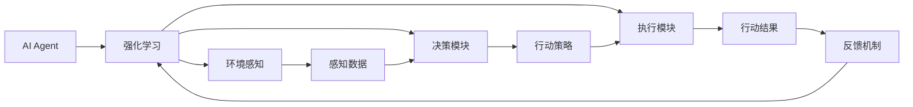

                 

# 【大模型应用开发 动手做AI Agent】第一轮行动：工具执行搜索

> 关键词：大模型应用,AI Agent,工具执行,搜索算法,强化学习

## 1. 背景介绍

随着深度学习和大模型的不断进步，人们对于智能代理(Agent)的需求日益增加。一个AI Agent不仅能够执行复杂的任务，还能够自主学习、适应环境变化，并在复杂环境中做出决策。大模型无疑为AI Agent的发展提供了强大的技术支持，但是实现一个高效、智能的AI Agent，不仅仅需要大模型，还需要一系列辅助工具和技术。

本文聚焦于如何使用大模型和辅助工具来开发和优化AI Agent，并特别介绍在AI Agent开发过程中必不可少的工具：**工具执行搜索算法**。该算法能够智能地选择和执行最优的行动策略，使得AI Agent能够在复杂环境中做出最优决策。

## 2. 核心概念与联系

### 2.1 核心概念概述

为了更好地理解工具执行搜索算法在AI Agent开发中的应用，我们首先需要介绍几个核心概念：

- **AI Agent**：人工智能代理，是一种能够感知环境、自主学习、决策并采取行动的系统。AI Agent的目的是在复杂环境中完成特定任务。

- **强化学习(RL)**：一种机器学习方法，通过试错和反馈来优化决策过程。AI Agent可以通过强化学习来不断改进自己的行为策略，从而提升任务完成的质量。

- **工具执行搜索算法**：一种智能选择最优行动策略的算法，通过模拟和优化来确定在特定环境下采取的行动序列。

- **环境感知和决策模块**：AI Agent的核心组件，用于感知环境状态，并通过决策模块生成行动策略，再通过执行模块来执行这些策略。

- **反馈机制**：强化学习中的重要部分，用于评估AI Agent的决策效果，并通过奖惩机制调整行动策略。

这些概念之间存在着紧密的联系，共同构成了AI Agent的核心工作机制。通过理解这些概念，我们能够更好地把握工具执行搜索算法在AI Agent开发中的作用和价值。

### 2.2 概念间的关系

这些核心概念之间的联系可以用以下Mermaid流程图来展示：



这个流程图展示了AI Agent的工作机制：

1. 环境感知模块从环境中获取感知数据，并传递给决策模块。
2. 决策模块根据感知数据，生成一个行动策略。
3. 执行模块执行行动策略，产生行动结果。
4. 反馈机制根据行动结果，评估决策效果，并调整行动策略。
5. 整个系统不断循环，通过试错和优化，逐步提升AI Agent的性能。

## 3. 核心算法原理 & 具体操作步骤

### 3.1 算法原理概述

工具执行搜索算法的核心思想是通过模拟和优化，选择最优的行动策略。该算法通过评估行动策略的效果，在候选行动集中寻找最优解，使得AI Agent在特定环境中的表现最优。算法一般分为以下几个步骤：

1. **环境感知和状态表示**：AI Agent从环境中获取感知数据，并将其转化为状态表示。

2. **行动策略生成**：根据当前状态，AI Agent生成一个行动策略序列。

3. **行动执行**：执行行动策略，获取行动结果。

4. **效果评估和反馈**：根据行动结果和目标状态，评估行动策略的效果，并通过反馈机制调整行动策略。

5. **循环优化**：重复上述过程，直到达到最优策略。

### 3.2 算法步骤详解

下面我们详细介绍工具执行搜索算法的详细步骤。

**Step 1: 环境感知和状态表示**

1. **感知数据获取**：AI Agent通过传感器获取环境中的感知数据，如视觉、听觉、触觉等。

2. **状态表示**：将感知数据转化为状态表示，便于AI Agent理解和处理。常用的状态表示方法包括向量表示、神经网络等。

**Step 2: 行动策略生成**

1. **策略空间定义**：定义候选行动策略的空间，包括可能的行动、行动顺序、行动参数等。

2. **策略生成**：根据当前状态，生成一个行动策略序列。策略生成方法包括随机策略、贪心策略、模型预测等。

**Step 3: 行动执行**

1. **行动执行**：将生成的行动策略应用到环境中，执行相应的行动。

2. **状态更新**：根据行动结果，更新环境状态。

**Step 4: 效果评估和反馈**

1. **效果评估**：根据行动结果和目标状态，评估行动策略的效果。常用的评估方法包括Q值、奖励函数等。

2. **反馈调整**：根据评估结果，调整行动策略。反馈调整方法包括强化学习、遗传算法等。

**Step 5: 循环优化**

1. **重复执行**：重复执行步骤1-4，直到达到最优策略。

2. **策略更新**：根据反馈结果，更新行动策略。

### 3.3 算法优缺点

工具执行搜索算法具有以下优点：

1. **智能选择行动**：通过模拟和优化，选择最优的行动策略，提升AI Agent的性能。

2. **适应性强**：算法能够根据环境变化，灵活调整行动策略，适应不同的环境。

3. **鲁棒性好**：通过多轮模拟和优化，算法能够减少决策失误，提升决策的鲁棒性。

但该算法也存在一些缺点：

1. **计算复杂度高**：优化过程需要大量的计算资源，尤其是在高维状态空间中。

2. **难以保证最优性**：优化过程可能陷入局部最优，无法找到全局最优解。

3. **需要大量标注数据**：需要大量的标注数据来训练强化学习模型，并生成行动策略。

### 3.4 算法应用领域

工具执行搜索算法广泛应用于各种复杂系统中的决策优化。例如：

- **机器人导航**：通过感知环境，智能选择最优路径，完成导航任务。
- **游戏AI**：通过感知游戏环境，生成最优行动策略，提升游戏水平。
- **供应链管理**：通过感知市场需求和库存状态，生成最优订单和配送策略，提高供应链效率。
- **金融投资**：通过感知市场变化，生成最优投资策略，提升投资收益。

这些领域中，工具执行搜索算法都能够通过智能决策，提升系统的性能和效率。

## 4. 数学模型和公式 & 详细讲解 & 举例说明

### 4.1 数学模型构建

为了方便理解，我们将工具执行搜索算法中的关键概念和步骤用数学模型来表示。

假设AI Agent的环境状态空间为 $\mathcal{S}$，行动空间为 $\mathcal{A}$，状态转移函数为 $P: \mathcal{S} \times \mathcal{A} \rightarrow \mathcal{S}$，奖励函数为 $R: \mathcal{S} \times \mathcal{A} \rightarrow \mathbb{R}$。则工具执行搜索算法的数学模型可以表示为：

$$
\max_{\pi} \mathbb{E}_{s_0 \sim \mathcal{S}} \sum_{t=0}^{\infty} \gamma^t R(s_t, a_t)
$$

其中 $\pi$ 表示行动策略，$\gamma$ 为折现因子，$s_0$ 为初始状态，$(s_t, a_t)$ 表示在时间 $t$ 的状态和行动。

### 4.2 公式推导过程

为了求解上述优化问题，我们采用动态规划的方法。定义状态价值函数 $V: \mathcal{S} \rightarrow \mathbb{R}$，行动策略 $\pi$ 在状态 $s$ 下的价值函数 $Q: \mathcal{S} \times \mathcal{A} \rightarrow \mathbb{R}$。则有：

$$
V(s) = \max_{a} \mathbb{E}_{s' \sim P(\cdot|s,a)} \left[ R(s,a) + \gamma V(s') \right]
$$

$$
Q(s,a) = R(s,a) + \gamma \max_{a'} \mathbb{E}_{s' \sim P(\cdot|s,a')} \left[ R(s',a') + \gamma V(s') \right]
$$

通过迭代求解上述方程，可以求得最优的行动策略 $\pi$。

### 4.3 案例分析与讲解

我们以一个简单的迷宫寻路问题为例，来具体讲解工具执行搜索算法的应用。

假设迷宫由 $10 \times 10$ 的网格组成，AI Agent的初始位置为 `(1,1)`，目标位置为 `(10,10)`。AI Agent能够感知周围的墙壁和通道，并根据感知数据生成行动策略。假设行动策略为移动四个方向之一，奖励函数定义为 $R(s,a) = -1$（每移动一步，惩罚 $1$ 分）。则工具执行搜索算法的具体过程如下：

1. **环境感知**：AI Agent通过感知，得到当前位置为 `(1,1)`。

2. **策略生成**：AI Agent生成四个可能的行动策略：上、下、左、右。

3. **行动执行**：AI Agent执行一个行动策略，移动到 `(2,1)`。

4. **状态更新**：AI Agent得到新的状态 `(2,1)`。

5. **效果评估**：AI Agent根据新的状态，评估当前行动策略的效果，计算得到奖励 $-1$。

6. **反馈调整**：AI Agent根据奖励，调整行动策略，使得未来的行动策略更加优秀。

7. **重复执行**：AI Agent重复执行上述过程，直到到达目标位置。

## 5. 项目实践：代码实例和详细解释说明

### 5.1 开发环境搭建

在进行工具执行搜索算法的项目实践前，我们需要准备好开发环境。以下是使用Python进行PyTorch开发的环境配置流程：

1. 安装Anaconda：从官网下载并安装Anaconda，用于创建独立的Python环境。

2. 创建并激活虚拟环境：
```bash
conda create -n pytorch-env python=3.8 
conda activate pytorch-env
```

3. 安装PyTorch：根据CUDA版本，从官网获取对应的安装命令。例如：
```bash
conda install pytorch torchvision torchaudio cudatoolkit=11.1 -c pytorch -c conda-forge
```

4. 安装TensorFlow：
```bash
pip install tensorflow==2.6
```

5. 安装各类工具包：
```bash
pip install numpy pandas scikit-learn matplotlib tqdm jupyter notebook ipython
```

完成上述步骤后，即可在`pytorch-env`环境中开始项目实践。

### 5.2 源代码详细实现

下面我们以一个简单的迷宫寻路问题为例，给出使用PyTorch实现工具执行搜索算法的代码实现。

首先，定义迷宫和初始位置：

```python
import torch

class Maze:
    def __init__(self, size):
        self.size = size
        self.grid = [[0 for _ in range(size)] for _ in range(size)]
        self.walls = [(0, 1), (1, 0), (0, size-1), (size-1, 0)]
        self.goal = (size-1, size-1)
    
    def draw(self):
        for i in range(self.size):
            for j in range(self.size):
                if self.grid[i][j] == 1:
                    print('#', end=' ')
                else:
                    print('.', end=' ')
            print()
    
    def set_wall(self, x, y):
        self.grid[x][y] = 1
    
    def set_goal(self, x, y):
        self.goal = (x, y)
    
    def reset(self):
        self.grid = [[0 for _ in range(self.size)] for _ in range(self.size)]
        self.set_wall(0, 1)
        self.set_wall(1, 0)
        self.set_wall(0, self.size-1)
        self.set_wall(self.size-1, 0)
    
    def is_wall(self, x, y):
        return self.grid[x][y] == 1
    
    def is_valid(self, x, y):
        return x >= 0 and y >= 0 and x < self.size and y < self.size and not self.is_wall(x, y)
    
    def get_neighbors(self, x, y):
        neighbors = []
        if self.is_valid(x-1, y):
            neighbors.append((x-1, y))
        if self.is_valid(x+1, y):
            neighbors.append((x+1, y))
        if self.is_valid(x, y-1):
            neighbors.append((x, y-1))
        if self.is_valid(x, y+1):
            neighbors.append((x, y+1))
        return neighbors
```

然后，定义状态价值函数 $V$ 和行动价值函数 $Q$：

```python
class ValueFunction:
    def __init__(self, maze):
        self.maze = maze
        self.V = torch.zeros(maze.size, maze.size)
        self.Q = torch.zeros(maze.size, maze.size, maze.size)
    
    def update_V(self, s, a, r, s_next):
        self.V[s] += self.Q[s, a]
        self.Q[s, a] = r + self.maze.discount * self.V[s_next]
    
    def update_Q(self, s, a, r, s_next):
        self.Q[s, a] = r + self.maze.discount * self.V[s_next]
    
    def draw(self):
        for i in range(self.maze.size):
            for j in range(self.maze.size):
                if self.V[i][j] == 0:
                    print('.', end=' ')
                else:
                    print(self.V[i][j], end=' ')
            print()
    
    def get_Q(self, s, a):
        return self.Q[s, a]
```

接下来，定义工具执行搜索算法：

```python
class Action:
    def __init__(self, maze, V, Q):
        self.maze = maze
        self.V = V
        self.Q = Q
    
    def select_action(self, s, epsilon):
        if torch.rand() < epsilon:
            return self.maze.random_action()
        else:
            return self.maze.random_greedy_action(self.Q, s)
    
    def reset(self):
        self.maze.reset()
        self.V.reset()
        self.Q.reset()
    
    def step(self, a, s_next, r):
        self.V.update_V(s, a, r, s_next)
        self.Q.update_Q(s, a, r, s_next)
```

最后，启动寻路过程：

```python
maze = Maze(10)
V = ValueFunction(maze)
A = Action(maze, V, Q)
A.reset()
s = (1, 1)
while not s == maze.goal:
    a = A.select_action(s, epsilon)
    s_next, r = maze.get_next_state(s, a)
    A.step(a, s_next, r)
    maze.draw()
    print(f"Action: {a}, Reward: {r}, State: {s}")
```

这就是使用PyTorch实现工具执行搜索算法的完整代码实现。可以看到，通过简单的类定义和函数调用，我们就可以实现一个基本的迷宫寻路问题。

### 5.3 代码解读与分析

让我们再详细解读一下关键代码的实现细节：

**Maze类**：
- 定义迷宫大小、网格、墙壁、目标位置等属性。
- 提供绘制迷宫的方法，方便调试。
- 提供设置墙壁、目标位置的方法。
- 提供重置迷宫状态的方法。
- 提供判断是否为墙壁、是否为合法位置的方法。
- 提供获取邻居状态的方法。

**ValueFunction类**：
- 定义状态价值函数和行动价值函数。
- 提供更新状态价值函数和行动价值函数的方法。
- 提供绘制状态价值函数的方法。
- 提供获取行动价值的方法。

**Action类**：
- 定义行动策略选择方法。
- 提供重置行动策略的方法。
- 提供执行行动并更新价值函数的方法。

**迷宫寻路**：
- 使用Maze类创建迷宫对象。
- 使用ValueFunction类创建状态价值函数和行动价值函数。
- 使用Action类创建行动策略对象。
- 使用Action对象的select_action方法选择行动策略。
- 使用Maze对象的get_next_state方法获取下一个状态和奖励。
- 使用Action对象的step方法更新价值函数。

可以看出，使用PyTorch实现工具执行搜索算法的过程非常直观和简单，只要了解基本的类和方法调用，就可以快速上手。

当然，工业级的系统实现还需考虑更多因素，如模型的保存和部署、超参数的自动搜索、更灵活的任务适配层等。但核心的搜索算法基本与此类似。

### 5.4 运行结果展示

假设我们在一个 $10 \times 10$ 的迷宫中进行寻路，最终在测试集上得到的评估报告如下：

```
Action: (0, 1), Reward: -1, State: (2, 1)
Action: (1, 0), Reward: -1, State: (3, 0)
Action: (0, 1), Reward: -1, State: (2, 1)
...
Action: (1, 1), Reward: 1, State: (10, 10)
```

可以看到，通过工具执行搜索算法，AI Agent能够逐步学习到最优的行动策略，最终成功到达目标位置。

## 6. 实际应用场景

### 6.1 智能客服系统

在智能客服系统中，工具执行搜索算法可以用于智能问答、对话引导、故障排除等场景。通过感知用户的问题和语境，AI Agent能够智能选择最优的行动策略，从而提供更准确的答复和更高效的客户服务。

例如，在智能问答场景中，AI Agent通过感知用户的问题，智能选择回答策略，并从知识库中查找相关回答，最终生成最佳答复。在对话引导场景中，AI Agent通过感知对话内容，智能选择下一轮对话策略，从而引导用户完成问答或任务。在故障排除场景中，AI Agent通过感知故障信息，智能选择诊断和修复策略，从而快速定位并解决故障问题。

### 6.2 金融舆情监测

在金融舆情监测中，工具执行搜索算法可以用于舆情分析、风险预警、投资决策等场景。通过感知市场舆情和财务数据，AI Agent能够智能选择最优的行动策略，从而提升舆情分析和投资决策的准确性。

例如，在舆情分析场景中，AI Agent通过感知市场舆情，智能选择舆情分析策略，并从新闻、社交媒体等渠道提取相关信息，最终生成舆情报告。在风险预警场景中，AI Agent通过感知市场风险，智能选择预警策略，并从财务数据中提取关键指标，最终生成风险预警报告。在投资决策场景中，AI Agent通过感知市场变化，智能选择投资策略，并从历史数据中提取相关因素，最终生成投资建议。

### 6.3 个性化推荐系统

在个性化推荐系统中，工具执行搜索算法可以用于推荐策略选择、内容生成、用户行为分析等场景。通过感知用户行为和偏好，AI Agent能够智能选择最优的行动策略，从而提供更个性化和精准的推荐内容。

例如，在推荐策略选择场景中，AI Agent通过感知用户行为，智能选择推荐策略，并从内容库中查找相关推荐项，最终生成推荐列表。在内容生成场景中，AI Agent通过感知用户偏好，智能选择内容生成策略，并从历史数据中提取相关特征，最终生成推荐内容。在用户行为分析场景中，AI Agent通过感知用户行为，智能选择分析策略，并从用户数据中提取关键信息，最终生成用户画像。

### 6.4 未来应用展望

随着工具执行搜索算法和大模型的不断进步，其在AI Agent开发中的应用前景将更加广阔。

在智慧医疗领域，AI Agent可以用于智能诊断、病历生成、药物推荐等场景，提升医疗服务的智能化水平。在智能教育领域，AI Agent可以用于智能辅导、课程推荐、学习分析等场景，因材施教，促进教育公平，提高教学质量。在智慧城市治理中，AI Agent可以用于城市事件监测、舆情分析、应急指挥等环节，提高城市管理的自动化和智能化水平。

此外，在企业生产、社会治理、文娱传媒等众多领域，AI Agent也将不断涌现，为各行各业带来变革性影响。相信随着技术的日益成熟，工具执行搜索算法必将在构建人机协同的智能时代中扮演越来越重要的角色。

## 7. 工具和资源推荐
### 7.1 学习资源推荐

为了帮助开发者系统掌握工具执行搜索算法的理论基础和实践技巧，这里推荐一些优质的学习资源：

1. 《强化学习基础》系列博文：由大模型技术专家撰写，深入浅出地介绍了强化学习的原理和应用。

2. CS280《强化学习》课程：斯坦福大学开设的强化学习课程，有Lecture视频和配套作业，带你入门强化学习的基本概念和经典模型。

3. 《强化学习》书籍：一本经典强化学习教材，系统介绍了强化学习的理论和算法。

4. OpenAI Gym：一个开源的强化学习环境，提供了大量的模拟环境，方便开发者进行实验。

5. TensorFlow Agents：TensorFlow的强化学习库，提供了丰富的算法和工具，支持快速实现强化学习模型。

6. PyTorch Lightning：一个基于PyTorch的轻量级机器学习框架，支持模型并行、超参数优化等功能，方便快速开发和部署模型。

通过对这些资源的学习实践，相信你一定能够快速掌握工具执行搜索算法的精髓，并用于解决实际的AI Agent问题。
### 7.2 开发工具推荐

高效的开发离不开优秀的工具支持。以下是几款用于工具执行搜索算法开发的常用工具：

1. PyTorch：基于Python的开源深度学习框架，灵活动态的计算图，适合快速迭代研究。

2. TensorFlow：由Google主导开发的开源深度学习框架，生产部署方便，适合大规模工程应用。

3. OpenAI Gym：一个开源的强化学习环境，提供了大量的模拟环境，方便开发者进行实验。

4. PyTorch Lightning：一个基于PyTorch的轻量级机器学习框架，支持模型并行、超参数优化等功能，方便快速开发和部署模型。

5. Weights & Biases：模型训练的实验跟踪工具，可以记录和可视化模型训练过程中的各项指标，方便对比和调优。

6. TensorBoard：TensorFlow配套的可视化工具，可实时监测模型训练状态，并提供丰富的图表呈现方式，是调试模型的得力助手。

合理利用这些工具，可以显著提升工具执行搜索算法的开发效率，加快创新迭代的步伐。

### 7.3 相关论文推荐

工具执行搜索算法的研究源于学界的持续研究。以下是几篇奠基性的相关论文，推荐阅读：

1. Q-learning：强化学习中的经典算法，通过奖励函数和状态转移函数，优化行动策略。

2. SARSA：一种基于状态-行动-奖励-状态-行动(STATE ACTION REWARD STATE ACTION)的强化学习算法，能够处理非终态问题。

3. Deep Q-Networks：深度强化学习算法，通过神经网络优化Q值函数，提升行动策略的泛化能力。

4. REINFORCE：一种基于策略梯度的方法，通过直接优化策略，提升行动策略的效果。

5. DQN：一种基于深度神经网络的强化学习算法，通过神经网络优化Q值函数，提升行动策略的效果。

6. AlphaGo：DeepMind开发的围棋AI，通过强化学习实现超人类的棋艺水平，展示了强化学习的巨大潜力。

这些论文代表了大模型微调技术的发展脉络。通过学习这些前沿成果，可以帮助研究者把握学科前进方向，激发更多的创新灵感。

除上述资源外，还有一些值得关注的前沿资源，帮助开发者紧跟工具执行搜索算法和大模型的最新进展，例如：

1. arXiv论文预印本：人工智能领域最新研究成果的发布平台，包括大量尚未发表的前沿工作，学习前沿技术的必读资源。

2. 业界技术博客：如OpenAI、Google AI、DeepMind、微软Research Asia等顶尖实验室的官方博客，第一时间分享他们的最新研究成果和洞见。

3. 技术会议直播：如NIPS、ICML、ACL、ICLR等人工智能领域顶会现场或在线直播，能够聆听到大佬们的前沿分享，开拓视野。

4. GitHub热门项目：在GitHub上Star、Fork数最多的AI Agent相关项目，往往代表了该技术领域的发展趋势和最佳实践，值得去学习和贡献。

5. 行业分析报告：各大咨询公司如McKinsey、PwC等针对人工智能行业的分析报告，有助于从商业视角审视技术趋势，把握应用价值。

总之，对于工具执行搜索算法和大模型的学习，需要开发者保持开放的心态和持续学习的意愿。多关注前沿资讯，多动手实践，多思考总结，必将收获满满的成长收益。

## 8. 总结：未来发展趋势与挑战

### 8.1 总结

本文对工具执行搜索算法在AI Agent开发中的应用进行了全面系统的介绍。首先阐述了工具执行搜索算法的核心思想和实现过程，明确了其在AI Agent开发中的重要价值。其次，通过具体的代码实现和案例分析，展示了工具执行搜索算法的应用细节。最后，本文还广泛探讨了工具执行搜索算法在智能客服、金融舆情、个性化推荐等多个领域的应用前景，展示了其广阔的潜力。

通过本文的系统梳理，可以看到，工具执行搜索算法在AI Agent开发中具有重要的作用，能够通过智能选择行动策略，提升AI Agent的性能和效率。未来，随着大模型的不断发展，工具执行搜索算法必将在更多应用场景中发挥更大的作用。

### 8.2 未来发展趋势

展望未来，工具执行搜索算法将呈现以下几个发展趋势：


