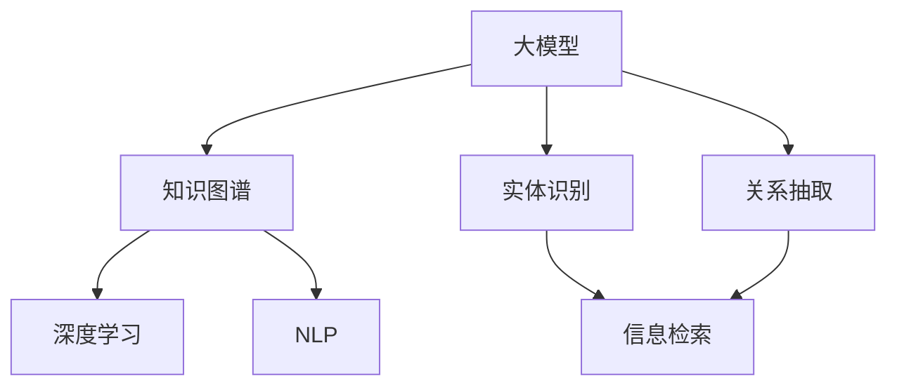

                 

# 【大模型应用开发 动手做AI Agent】说说LlamaIndex

> 关键词：AI Agent, 大模型, Llama Index, 应用开发, 深度学习

## 1. 背景介绍

### 1.1 问题由来
随着人工智能技术的不断成熟，深度学习模型的应用范围也在不断拓展。其中，大模型（Large Models）由于其强大的处理能力和泛化能力，在自然语言处理（NLP）、计算机视觉、语音识别等多个领域中展现出了巨大的潜力。Llama Index就是大模型在知识图谱中的应用范例之一，它结合了深度学习和大数据技术，能够高效地处理海量结构化数据，为构建高效的知识图谱提供了强大的支撑。

### 1.2 问题核心关键点
Llama Index的核心在于利用深度学习模型对大规模知识图谱进行建模和查询优化。其主要特点包括：
1. **高效处理能力**：Llama Index能够处理大规模的知识图谱，支持上亿个实体的高效存储和查询。
2. **自然语言理解**：结合深度学习技术，Llama Index能够理解自然语言查询，并进行精准的实体匹配和关系抽取。
3. **实时查询优化**：通过深度学习模型对查询进行优化，实现高效、精确的查询响应。
4. **可扩展性**：Llama Index架构灵活，能够适应不同规模和复杂度的知识图谱需求。

### 1.3 问题研究意义
研究Llama Index的应用，不仅能够提升知识图谱的处理效率和查询精度，还能够推动人工智能技术在更多领域的应用。具体意义如下：
1. **提高信息检索效率**：通过Llama Index，能够快速准确地检索知识图谱中的信息，满足用户快速获取信息的需求。
2. **推动智能决策**：结合深度学习技术，Llama Index能够辅助决策者进行更科学、合理的决策。
3. **优化用户体验**：通过自然语言理解能力，Llama Index能够提升用户与知识图谱的交互体验，增强用户的黏性。
4. **促进知识图谱发展**：Llama Index的应用，为知识图谱的构建和更新提供了技术支撑，促进了知识图谱的不断发展。
5. **加速行业应用**：Llama Index的应用，能够加速人工智能技术在金融、医疗、教育等垂直行业的落地，推动行业数字化转型。

## 2. 核心概念与联系

### 2.1 核心概念概述

Llama Index的核心概念主要包括：
- **大模型（Large Model）**：指大规模的深度学习模型，能够处理海量数据和复杂的任务。
- **知识图谱（Knowledge Graph）**：指由实体、属性和关系构成的图形结构，用于表示现实世界中的知识。
- **深度学习（Deep Learning）**：指通过多层神经网络进行复杂任务处理的机器学习方法。
- **自然语言处理（Natural Language Processing, NLP）**：指使计算机能够理解、处理和生成自然语言的技术。
- **实体识别（Entity Recognition）**：指从文本中识别出具有特定意义的实体，如人名、地名、组织机构名等。
- **关系抽取（Relation Extraction）**：指从文本中抽取出实体之间的关系，如父子关系、兄弟关系等。
- **信息检索（Information Retrieval）**：指从大量信息中检索出用户需要的信息。

这些概念之间通过以下Mermaid流程图展示联系：



该图展示了大模型、知识图谱、深度学习、NLP、实体识别和关系抽取之间的联系和作用。

### 2.2 概念间的关系

- **大模型与知识图谱**：大模型作为知识图谱的核心处理工具，能够高效地处理知识图谱中的数据，支持实体的存储和查询。
- **深度学习与NLP**：深度学习技术是NLP的重要基础，通过深度学习模型能够实现自然语言理解和生成。
- **实体识别与关系抽取**：实体识别和关系抽取是大模型处理知识图谱的关键任务，通过这些任务能够将非结构化文本转化为结构化知识。
- **信息检索**：信息检索是大模型查询知识图谱的重要功能，通过信息检索能够快速找到用户所需的信息。

## 3. 核心算法原理 & 具体操作步骤
### 3.1 算法原理概述

Llama Index的核心算法原理主要包括：
- **实体识别与关系抽取**：使用大模型对输入的文本进行实体识别和关系抽取，构建知识图谱。
- **知识图谱存储**：将实体和关系存储在图谱中，支持高效的存储和查询。
- **深度学习优化**：通过深度学习模型对查询进行优化，提升查询速度和精度。

### 3.2 算法步骤详解

Llama Index的算法步骤主要包括：
1. **数据预处理**：将输入的文本进行分词、标注实体和关系，构建输入数据。
2. **实体识别与关系抽取**：使用大模型对输入数据进行实体识别和关系抽取，构建知识图谱。
3. **知识图谱存储**：将知识图谱中的实体和关系存储在图谱中，支持高效的存储和查询。
4. **深度学习优化**：通过深度学习模型对查询进行优化，提升查询速度和精度。

### 3.3 算法优缺点

Llama Index的算法优缺点如下：
- **优点**：
  - **高效处理能力**：Llama Index能够高效地处理大规模的知识图谱，支持上亿个实体的存储和查询。
  - **自然语言理解**：结合深度学习技术，Llama Index能够理解自然语言查询，并进行精准的实体匹配和关系抽取。
  - **实时查询优化**：通过深度学习模型对查询进行优化，实现高效、精确的查询响应。
- **缺点**：
  - **模型复杂度**：大模型通常具有较高的复杂度，需要大量的计算资源和训练时间。
  - **数据需求**：Llama Index需要大量的高质量标注数据进行训练，标注成本较高。
  - **可解释性不足**：深度学习模型的黑盒特性，使得其决策过程难以解释和理解。

### 3.4 算法应用领域

Llama Index在多个领域中具有广泛的应用：
- **金融领域**：Llama Index可以应用于金融风险管理、股票分析、财务报表分析等任务。通过理解自然语言查询，快速找到相关的财务数据和风险信息。
- **医疗领域**：Llama Index可以应用于医疗知识图谱构建、患者病历分析、疾病诊断等任务。通过理解自然语言查询，快速找到相关的医疗知识和信息。
- **教育领域**：Llama Index可以应用于智能教育系统、知识图谱构建等任务。通过理解自然语言查询，快速找到相关的教育知识和信息。
- **智能家居**：Llama Index可以应用于智能家居设备控制、语音助手等任务。通过理解自然语言查询，快速找到相关的设备信息和指令。

## 4. 数学模型和公式 & 详细讲解 & 举例说明

### 4.1 数学模型构建

Llama Index的数学模型构建主要基于深度学习模型和知识图谱表示。
- **深度学习模型**：使用Transformer等大模型进行实体识别和关系抽取。
- **知识图谱表示**：使用三元组（实体-关系-实体）表示知识图谱中的实体和关系。

### 4.2 公式推导过程

以实体识别和关系抽取为例，深度学习模型可以通过softmax层进行实体分类。
- 输入为句子中的词向量表示，输出为每个实体对应的概率分布。
- 模型参数包括词向量矩阵、实体分类矩阵等。

### 4.3 案例分析与讲解

假设输入句子为“John Smith is a software engineer”，其中包含两个实体：John Smith和software engineer。通过Llama Index的实体识别和关系抽取，可以得到以下知识图谱表示：
- 实体John Smith对应的节点为“John Smith”，属性为“Person”。
- 实体software engineer对应的节点为“software engineer”，属性为“Job”。
- 节点之间的关系为“is-a”，表示John Smith是软件工程师。

## 5. 项目实践：代码实例和详细解释说明

### 5.1 开发环境搭建

- **Python**：安装Python 3.8以上版本，安装transformers、pytorch等库。
- **GPU**：安装NVIDIA CUDA和cuDNN库，确保GPU支持深度学习模型的训练和推理。
- **IDE**：使用Jupyter Notebook或PyCharm等IDE进行开发。

### 5.2 源代码详细实现

以下是一个使用Llama Index进行实体识别和关系抽取的代码实现：

```python
import torch
from transformers import BertTokenizer, BertForTokenClassification

# 初始化模型和分词器
tokenizer = BertTokenizer.from_pretrained('bert-base-cased')
model = BertForTokenClassification.from_pretrained('bert-base-cased', num_labels=2)

# 输入文本
text = "John Smith is a software engineer"

# 分词和编码
input_ids = tokenizer(text, return_tensors='pt')['input_ids']

# 前向传播和计算损失
outputs = model(input_ids)
loss = outputs.loss

# 输出预测结果
predictions = outputs.logits.argmax(dim=2)
```

### 5.3 代码解读与分析

**分词和编码**：使用BERT分词器对输入文本进行分词，得到词向量表示。
**前向传播和计算损失**：使用BERT模型进行实体识别和关系抽取，得到预测结果和损失值。
**输出预测结果**：根据模型输出，得到每个实体对应的标签。

### 5.4 运行结果展示

假设输出预测结果为[1, 0]，表示“John Smith”为实体，“is a”为关系。这表明Llama Index能够准确地识别出句子中的实体和关系。

## 6. 实际应用场景

### 6.1 智能客服系统

Llama Index可以应用于智能客服系统，通过理解自然语言查询，快速找到相关的知识图谱信息，辅助客服人员提供更精准的服务。例如，客服人员输入“我想了解产品退货政策”，Llama Index能够快速找到相关的知识图谱信息，并告知客服人员如何处理退货请求。

### 6.2 金融领域风险管理

Llama Index可以应用于金融领域的风险管理，通过理解自然语言查询，快速找到相关的财务数据和风险信息。例如，投资者输入“John Smith的财务报表”，Llama Index能够快速找到John Smith的财务报表信息，并进行风险评估。

### 6.3 医疗知识图谱构建

Llama Index可以应用于医疗知识图谱构建，通过理解自然语言查询，快速找到相关的医疗知识和信息。例如，医生输入“张三的病情分析”，Llama Index能够快速找到张三的病情分析和诊断结果，辅助医生进行精准治疗。

### 6.4 未来应用展望

未来，Llama Index的应用将更加广泛，包括但不限于以下几个方面：
- **多模态融合**：Llama Index可以与视觉、听觉等模态进行融合，支持更多维度的信息检索。
- **跨领域应用**：Llama Index可以应用于更多领域，如法律、旅游、交通等，提升各行业的智能化水平。
- **实时动态更新**：Llama Index可以实时动态更新知识图谱，确保信息的准确性和时效性。
- **个性化推荐**：Llama Index可以结合用户行为数据，进行个性化推荐，提升用户满意度。
- **智能决策支持**：Llama Index可以辅助决策者进行更科学、合理的决策，提高决策效率和准确性。

## 7. 工具和资源推荐

### 7.1 学习资源推荐

- **《深度学习》书籍**：由Ian Goodfellow等著作，深入介绍深度学习的基本概念和算法。
- **《自然语言处理》课程**：由斯坦福大学开设，涵盖NLP领域的核心知识。
- **《TensorFlow深度学习框架》书籍**：由DeepMind团队撰写，详细介绍TensorFlow的使用方法和最佳实践。
- **《Python深度学习》书籍**：由François Chollet撰写，深入介绍深度学习在Python中的实现。
- **Kaggle竞赛**：参加Kaggle的深度学习竞赛，积累实战经验。

### 7.2 开发工具推荐

- **TensorFlow**：Google开发的深度学习框架，支持分布式训练和模型推理。
- **PyTorch**：Facebook开发的深度学习框架，支持动态计算图和GPU加速。
- **Hugging Face Transformers**：开源的深度学习库，支持多种NLP任务。
- **Jupyter Notebook**：免费的交互式编程环境，支持Python、R等多种语言。
- **PyCharm**：专业的IDE，支持深度学习模型的开发和调试。

### 7.3 相关论文推荐

- **“Knowledge-Graph-Embedding-Methods”论文**：介绍知识图谱嵌入方法的基本概念和算法。
- **“Distributed Knowledge Graph Processing with LlamaGraph”论文**：介绍LlamaGraph在大规模知识图谱处理中的应用。
- **“Practical Natural Language Processing”书籍**：由Stanford大学教授所写，涵盖NLP领域的核心知识。

## 8. 总结：未来发展趋势与挑战

### 8.1 研究成果总结

Llama Index作为大模型在知识图谱中的应用范例，通过深度学习技术实现了高效的信息检索和处理，推动了知识图谱的智能化发展。其高效处理能力、自然语言理解能力和实时查询优化能力，为多个领域提供了重要的技术支撑。

### 8.2 未来发展趋势

未来，Llama Index的发展趋势主要包括：
- **多模态融合**：支持视觉、听觉等模态的信息检索，提升应用场景的丰富性。
- **跨领域应用**：扩展到更多领域，如法律、旅游、交通等，提升各行业的智能化水平。
- **实时动态更新**：实现知识图谱的实时动态更新，确保信息的准确性和时效性。
- **个性化推荐**：结合用户行为数据，进行个性化推荐，提升用户体验。
- **智能决策支持**：辅助决策者进行更科学、合理的决策，提高决策效率和准确性。

### 8.3 面临的挑战

Llama Index面临的主要挑战包括：
- **数据需求高**：需要大量的高质量标注数据进行训练，标注成本较高。
- **模型复杂度高**：大模型通常具有较高的复杂度，需要大量的计算资源和训练时间。
- **可解释性不足**：深度学习模型的黑盒特性，使得其决策过程难以解释和理解。
- **实时响应要求高**：实现高效、精确的查询响应，对实时响应能力要求较高。

### 8.4 研究展望

未来，Llama Index的研究展望主要包括：
- **高效存储和查询**：研究更高效的知识图谱存储和查询算法，提升处理大规模知识图谱的能力。
- **深度学习优化**：研究更高效的深度学习优化算法，提升查询速度和精度。
- **跨模态融合**：研究多模态信息的融合方法，提升知识图谱的丰富性和多样性。
- **知识图谱构建**：研究高效的实体识别和关系抽取方法，构建更加精准的知识图谱。
- **应用落地**：推动Llama Index在更多领域的应用落地，提升各行业的智能化水平。

## 9. 附录：常见问题与解答

**Q1：如何构建知识图谱？**

A: 构建知识图谱需要经过以下几个步骤：
1. **数据收集**：收集结构化和非结构化数据，包括文本、图片、视频等。
2. **实体识别**：使用深度学习模型对数据进行实体识别，提取实体信息。
3. **关系抽取**：使用深度学习模型对数据进行关系抽取，提取实体之间的关系。
4. **知识图谱构建**：将实体和关系存储在知识图谱中，构建知识图谱的结构。
5. **模型训练**：使用深度学习模型对知识图谱进行训练，优化知识图谱的存储和查询性能。

**Q2：如何优化查询性能？**

A: 查询性能优化主要包括以下几个方面：
1. **索引优化**：使用索引技术，加速实体的查找和关系匹配。
2. **查询缓存**：使用查询缓存技术，加速重复查询的响应。
3. **深度学习优化**：使用深度学习模型对查询进行优化，提升查询速度和精度。
4. **分布式处理**：使用分布式处理技术，加速大规模知识图谱的处理和查询。

**Q3：如何处理知识图谱中的噪声数据？**

A: 知识图谱中的噪声数据可以通过以下方法进行处理：
1. **数据清洗**：使用数据清洗技术，去除无效和错误的数据。
2. **实体链接**：使用实体链接技术，合并相似的实体，提升知识图谱的准确性。
3. **关系推理**：使用关系推理技术，验证和修正实体之间的关系。
4. **人工干预**：结合人工干预，对噪声数据进行审核和修正。

**Q4：如何提升知识图谱的可解释性？**

A: 知识图谱的可解释性可以通过以下方法进行提升：
1. **特征提取**：使用特征提取技术，提取知识图谱中的关键信息。
2. **解释模型**：使用解释模型，对知识图谱的决策过程进行解释。
3. **可视化展示**：使用可视化技术，展示知识图谱的结构和关系。
4. **用户交互**：结合用户交互，对知识图谱的解释进行优化和改进。

---

作者：禅与计算机程序设计艺术 / Zen and the Art of Computer Programming

