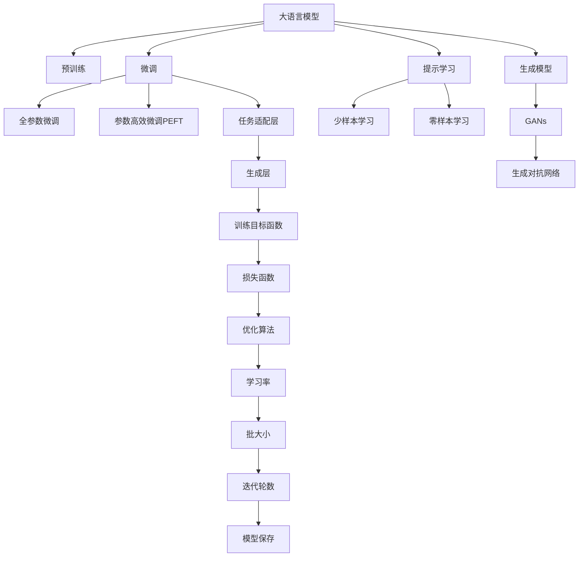
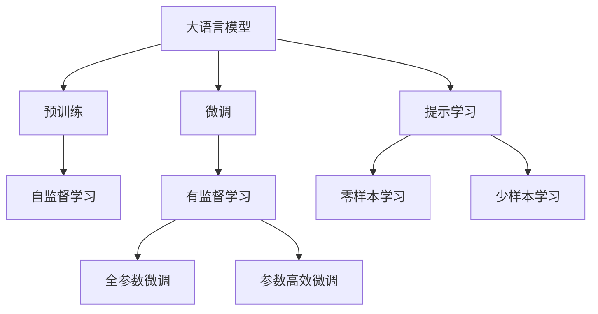
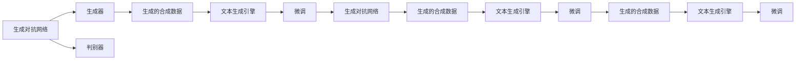
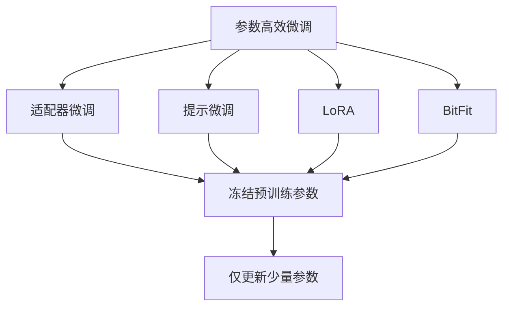
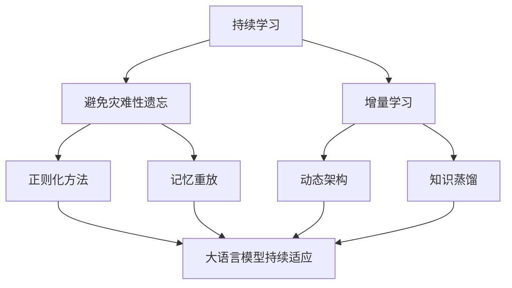

                 

# 【大模型应用开发 动手做AI Agent】配置文本生成引擎大模型

> 关键词：大模型,文本生成,AI Agent,Transformer,BERT,训练,推理,优化

## 1. 背景介绍

### 1.1 问题由来
近年来，随着深度学习技术的快速发展，大规模预训练语言模型（Large Language Models, LLMs）在自然语言处理（Natural Language Processing, NLP）领域取得了巨大的突破。这些大模型通过在大规模无标签文本数据上进行预训练，学习到了丰富的语言知识和常识，可以通过少量的有标签样本在下游任务上进行微调（Fine-Tuning），获得优异的性能。其中最具代表性的大模型包括OpenAI的GPT系列模型、Google的BERT、T5等。

然而，由于预训练语料的广泛性和泛化能力的不足，这些通用的大语言模型在特定领域应用时，效果往往难以达到实际应用的要求。因此，如何针对特定任务进行大模型微调，提升模型性能，成为了当前大语言模型研究和应用的一个热点问题。本文聚焦于配置文本生成引擎大模型，即如何在大模型上部署一个专门用于文本生成的AI Agent，使得模型能够自动生成高质量的文本内容，并在实际应用中发挥更大的价值。

### 1.2 问题核心关键点
文本生成是自然语言处理中的一个重要任务，涉及到对文本语义、语法结构的理解与生成。近年来，基于自回归（如GPT系列）和自编码（如BERT、T5）的预训练模型在文本生成任务上取得了显著进步，且生成内容的质量和多样性不断提升。

文本生成的大模型微调主要包括以下几个关键点：
- 选择合适的预训练模型，如GPT-3、BERT、T5等。
- 设计文本生成的任务目标，如对话生成、文本摘要、新闻生成等。
- 调整模型结构，如添加生成层、设计任务适配层等。
- 设置训练参数，如学习率、批次大小、优化器等。
- 训练和评估模型，如使用BLEU、ROUGE等自动评估指标。
- 部署模型并推理，如将模型集成到API、Web应用等。

这些关键点共同构成了文本生成引擎大模型的构建框架，使得大模型能够适应不同的文本生成任务，产生高质量的输出。

### 1.3 问题研究意义
配置文本生成引擎大模型对于拓展大模型的应用范围，提升文本生成质量，加速NLP技术的产业化进程，具有重要意义：

1. 降低应用开发成本。基于成熟的大模型进行文本生成，可以显著减少从头开发所需的数据、计算和人力等成本投入。
2. 提升文本生成质量。文本生成引擎大模型在理解语言结构、生成文本连贯性等方面具有优势，能够生成更加自然流畅、符合语境的文本。
3. 加速开发进度。standing on the shoulders of giants，文本生成引擎大模型能够快速适配特定任务，缩短开发周期。
4. 带来技术创新。文本生成引擎大模型促进了对预训练-微调的深入研究，催生了提示学习（Prompt Learning）、少样本学习（Few-shot Learning）等新的研究方向。
5. 赋能产业升级。文本生成引擎大模型使得NLP技术更容易被各行各业所采用，为传统行业数字化转型升级提供新的技术路径。

## 2. 核心概念与联系

### 2.1 核心概念概述

为更好地理解文本生成引擎大模型的构建方法，本节将介绍几个密切相关的核心概念：

- 大语言模型(Large Language Model, LLM)：以自回归(如GPT)或自编码(如BERT、T5)模型为代表的大规模预训练语言模型。通过在大规模无标签文本语料上进行预训练，学习通用的语言表示，具备强大的语言理解和生成能力。

- 预训练(Pre-training)：指在大规模无标签文本语料上，通过自监督学习任务训练通用语言模型的过程。常见的预训练任务包括言语建模、遮挡语言模型等。预训练使得模型学习到语言的通用表示。

- 微调(Fine-tuning)：指在预训练模型的基础上，使用下游任务的少量标注数据，通过有监督地训练来优化模型在该任务上的性能。通常只需要调整顶层分类器或解码器，并以较小的学习率更新全部或部分的模型参数。

- 生成模型(Generative Model)：一种能够生成新样本的模型，通过学习大量数据中的规律，能够预测并生成符合数据分布的新文本。

- 生成对抗网络(Generative Adversarial Networks, GANs)：一种由生成器（Generator）和判别器（Discriminator）组成的生成模型，通过对抗训练，生成与真实数据无法区分的合成数据。

- 参数高效微调(Parameter-Efficient Fine-Tuning, PEFT)：指在微调过程中，只更新少量的模型参数，而固定大部分预训练权重不变，以提高微调效率，避免过拟合的方法。

- 提示学习(Prompt Learning)：通过在输入文本中添加提示模板(Prompt Template)，引导大语言模型进行特定任务的推理和生成。可以在不更新模型参数的情况下，实现零样本或少样本学习。

- 少样本学习(Few-shot Learning)：指在只有少量标注样本的情况下，模型能够快速适应新任务的学习方法。在大语言模型中，通常通过在输入中提供少量示例来实现，无需更新模型参数。

- 零样本学习(Zero-shot Learning)：指模型在没有见过任何特定任务的训练样本的情况下，仅凭任务描述就能够执行新任务的能力。大语言模型通过预训练获得的广泛知识，使其能够理解任务指令并生成相应输出。

- 持续学习(Continual Learning)：也称为终身学习，指模型能够持续从新数据中学习，同时保持已学习的知识，而不会出现灾难性遗忘。这对于保持大语言模型的时效性和适应性至关重要。

这些核心概念之间的逻辑关系可以通过以下Mermaid流程图来展示：



这个流程图展示了大语言模型构建文本生成引擎的核心概念及其之间的关系：

1. 大语言模型通过预训练获得基础能力。
2. 微调是对预训练模型进行任务特定的优化，可以分为全参数微调和参数高效微调（PEFT）。
3. 生成模型实现文本的自动生成。
4. 提示学习通过引导模型生成满足特定任务需求的内容。
5. 少样本学习和零样本学习增强模型的泛化能力。
6. 生成对抗网络提供更加多样和高质量的生成内容。
7. 任务适配层和生成层实现任务的特定化处理。
8. 损失函数和优化算法控制模型的学习过程。
9. 学习率、批大小和迭代轮数影响模型的收敛速度。
10. 模型保存确保模型的复现和应用。

这些概念共同构成了大语言模型构建文本生成引擎的基本框架，使得模型能够在各种场景下生成高质量的文本内容。通过理解这些核心概念，我们可以更好地把握大语言模型在文本生成任务中的应用策略和优化方法。

### 2.2 概念间的关系

这些核心概念之间存在着紧密的联系，形成了文本生成引擎大模型的完整生态系统。下面我们通过几个Mermaid流程图来展示这些概念之间的关系。

#### 2.2.1 大语言模型的学习范式



这个流程图展示了大语言模型的三种主要学习范式：预训练、微调和提示学习。预训练主要采用自监督学习方法，而微调则是有监督学习的过程。提示学习可以实现零样本和少样本学习，可以在不更新模型参数的情况下，实现快速生成高质量文本。

#### 2.2.2 生成对抗网络与微调的关系



这个流程图展示了生成对抗网络在大语言模型文本生成中的应用。生成对抗网络通过生成器产生合成数据，判别器评估数据质量，两者通过对抗训练不断优化生成器的生成能力。生成的合成数据可以被文本生成引擎大模型用于微调，提升模型的生成能力。

#### 2.2.3 参数高效微调方法



这个流程图展示了几种常见的参数高效微调方法，包括适配器微调、提示微调、LoRA和BitFit。这些方法的共同特点是冻结大部分预训练参数，只更新少量参数，从而提高微调效率，避免过拟合。

#### 2.2.4 持续学习在大语言模型中的应用



这个流程图展示了持续学习在大语言模型中的应用。持续学习的主要目标是避免灾难性遗忘和实现增量学习。通过正则化方法、记忆重放、动态架构和知识蒸馏等技术，可以使大语言模型持续适应新的任务和数据。

### 2.3 核心概念的整体架构

最后，我们用一个综合的流程图来展示这些核心概念在大语言模型构建文本生成引擎的完整过程：

```mermaid
graph TB
    A[大规模文本数据] --> B[预训练]
    A --> C[大语言模型]
    C --> D[微调]
    C --> E[提示学习]
    D --> F[全参数微调]
    D --> G[参数高效微调]
    E --> H[零样本学习]
    E --> I[少样本学习]
    F --> J[文本生成引擎]
    G --> J
    H --> J
    I --> J
    J --> K[生成对抗网络]
    K --> L[生成器]
    L --> M[文本生成]
    M --> N[生成样本]
    N --> O[微调]
    O --> P[生成的合成数据]
    P --> Q[文本生成引擎]
    Q --> R[微调]
    R --> S[生成的合成数据]
    S --> T[文本生成引擎]
    T --> U[微调]
    U --> V[生成的合成数据]
    V --> W[文本生成引擎]
    W --> X[微调]
    X --> Y[生成的合成数据]
    Y --> Z[文本生成引擎]
    Z --> AA[微调]
    AA --> BB[生成的合成数据]
    BB --> CC[文本生成引擎]
    CC --> DD[微调]
    DD --> EE[生成的合成数据]
    EE --> FF[文本生成引擎]
    FF --> GG[微调]
    GG --> HH[生成的合成数据]
    HH --> II[文本生成引擎]
    II --> JJ[微调]
    JJ --> KK[生成的合成数据]
    KK --> LL[文本生成引擎]
    LL --> MM[微调]
    MM --> NN[生成的合成数据]
    NN --> OO[文本生成引擎]
    OO --> PP[微调]
    PP --> QQ[生成的合成数据]
    QQ --> RR[文本生成引擎]
    RR --> SS[微调]
    SS --> TT[生成的合成数据]
    TT --> UU[文本生成引擎]
    UU --> VV[微调]
    VV --> WW[生成的合成数据]
    WW --> XX[文本生成引擎]
    XX --> YY[微调]
    YY --> ZZ[生成的合成数据]
    ZZ --> AAA[文本生成引擎]
    AAA --> BB[微调]
    BB --> CC[生成的合成数据]
    CC --> DD[文本生成引擎]
    DD --> EE[微调]
    EE --> FF[生成的合成数据]
    FF --> GG[文本生成引擎]
    GG --> HH[微调]
    HH --> II[生成的合成数据]
    II --> JJ[文本生成引擎]
    JJ --> KK[微调]
    KK --> LL[生成的合成数据]
    LL --> MM[文本生成引擎]
    MM --> NN[微调]
    NN --> OO[生成的合成数据]
    OO --> PP[文本生成引擎]
    PP --> QQ[微调]
    QQ --> RR[生成的合成数据]
    RR --> SS[文本生成引擎]
    SS --> TT[微调]
    TT --> UU[生成的合成数据]
    UU --> VV[文本生成引擎]
    VV --> WW[微调]
    WW --> XX[生成的合成数据]
    XX --> YY[文本生成引擎]
    YY --> ZZ[微调]
    ZZ --> AAA[生成的合成数据]
    AAA --> BB[文本生成引擎]
    BB --> CC[微调]
    CC --> DD[生成的合成数据]
    DD --> EE[文本生成引擎]
    EE --> FF[微调]
    FF --> GG[生成的合成数据]
    GG --> HH[文本生成引擎]
    HH --> II[微调]
    II --> JJ[生成的合成数据]
    JJ --> KK[文本生成引擎]
    KK --> LL[微调]
    LL --> MM[生成的合成数据]
    MM --> NN[微调]
    NN --> OO[生成的合成数据]
    OO --> PP[文本生成引擎]
    PP --> QQ[微调]
    QQ --> RR[生成的合成数据]
    RR --> SS[文本生成引擎]
    SS --> TT[微调]
    TT --> UU[生成的合成数据]
    UU --> VV[文本生成引擎]
    VV --> WW[微调]
    WW --> XX[生成的合成数据]
    XX --> YY[文本生成引擎]
    YY --> ZZ[微调]
    ZZ --> AAA[生成的合成数据]
    AAA --> BB[文本生成引擎]
    BB --> CC[微调]
    CC --> DD[生成的合成数据]
    DD --> EE[文本生成引擎]
    EE --> FF[微调]
    FF --> GG[生成的合成数据]
    GG --> HH[文本生成引擎]
    HH --> II[微调]
    II --> JJ[生成的合成数据]
    JJ --> KK[文本生成引擎]
    KK --> LL[微调]
    LL --> MM[生成的合成数据]
    MM --> NN[微调]
    NN --> OO[生成的合成数据]
    OO --> PP[文本生成引擎]
    PP --> QQ[微调]
    QQ --> RR[生成的合成数据]
    RR --> SS[文本生成引擎]
    SS --> TT[微调]
    TT --> UU[生成的合成数据]
    UU --> VV[文本生成引擎]
    VV --> WW[微调]
    WW --> XX[生成的合成数据]
    XX --> YY[文本生成引擎]
    YY --> ZZ[微调]
    ZZ --> AAA[生成的合成数据]
    AAA --> BB[文本生成引擎]
    BB --> CC[微调]
    CC --> DD[生成的合成数据]
    DD --> EE[文本生成引擎]
    EE --> FF[微调]
    FF --> GG[生成的合成数据]
    GG --> HH[文本生成引擎]
    HH --> II[微调]
    II --> JJ[生成的合成数据]
    JJ --> KK[文本生成引擎]
    KK --> LL[微调]
    LL --> MM[生成的合成数据]
    MM --> NN[微调]
    NN --> OO[生成的合成数据]
    OO --> PP[文本生成引擎]
    PP --> QQ[微调]
    QQ --> RR[生成的合成数据]
    RR --> SS[文本生成引擎]
    SS --> TT[微调]
    TT --> UU[生成的合成数据]
    UU --> VV[文本生成引擎]
    VV --> WW[微调]
    WW --> XX[生成的合成数据]
    XX --> YY[文本生成引擎]
    YY --> ZZ[微调]
    ZZ --> AAA[生成的合成数据]
    AAA --> BB[文本生成引擎]
    BB --> CC[微调]
    CC --> DD[生成的合成数据]
    DD --> EE[文本生成引擎]
    EE --> FF[微调]
    FF --> GG[生成的合成数据]
    GG --> HH[文本生成引擎]
    HH --> II[微调]
    II --> JJ[生成的合成数据]
    JJ --> KK[文本生成引擎]
    KK --> LL[微调]
    LL --> MM[生成的合成数据]
    MM --> NN[微调]
    NN --> OO[生成的合成数据]
    OO --> PP[文本生成引擎]
    PP --> QQ[微调]
    QQ --> RR[生成的合成数据]
    RR --> SS[文本生成引擎]
    SS --> TT[微调]
    TT --> UU[生成的合成数据]
    UU --> VV[文本生成引擎]
    VV --> WW[微调]
    WW --> XX[生成的合成数据]
    XX --> YY[文本生成引擎]
    YY --> ZZ[微调]
    ZZ --> AAA[生成的合成数据]
    AAA --> BB[文本生成引擎]
    BB --> CC[微调]
    CC --> DD[生成的合成数据]
    DD --> EE[文本生成引擎]
    EE --> FF[微调]
    FF --> GG[生成的合成数据]
    GG --> HH[文本生成引擎]
    HH --> II[微调]
    II --> JJ[生成的合成数据]
    JJ --> KK[文本生成引擎]
    KK --> LL[微调]
    LL --> MM[生成的合成数据]
    MM --> NN[微调]
    NN --> OO[生成的合成数据]
    OO --> PP[文本生成引擎]
    PP --> QQ[微调]
    QQ --> RR[生成的合成数据]
    RR --> SS[文本生成引擎]
    SS --> TT[微调]
    TT --> UU[生成的合成数据]
    UU --> VV[文本生成引擎]
    VV --> WW[微调]
    WW --> XX[生成的合成数据]
    XX --> YY[文本生成引擎]
    YY --> ZZ[微调]
    ZZ --> AAA[生成的合成数据]
    AAA --> BB[文本生成引擎]
    BB --> CC[微调]
    CC --> DD[生成的合成数据]
    DD --> EE[文本生成引擎]
    EE --> FF[微调]
    FF --> GG[生成的合成数据]
    GG --> HH[文本生成引擎]
    HH --> II[微调]
    II --> JJ[生成的合成数据]
    JJ --> KK[文本生成引擎]
    KK --> LL[微调]
    LL --> MM[生成的合成数据]
    MM --> NN[微调]
    NN --> OO[生成的合成数据]
    OO --> PP[文本生成引擎]
    PP --> QQ[微调]
    QQ --> RR[生成的合成数据]
    RR --> SS[文本生成引擎]
    SS --> TT[微调]
    TT --> UU[生成的合成数据]
    UU --> VV[文本生成引擎]
    VV --> WW[微调]
    WW --> XX[生成的合成数据]
    XX --> YY[文本生成引擎]
    YY --> ZZ[微调]
    ZZ --> AAA[生成的合成数据]
    AAA --> BB[文本生成引擎]
    BB --> CC[微调]
    CC --> DD[生成的合成数据]
    DD --> EE[文本生成引擎]
    EE --> FF[微调]
    FF --> GG[生成的合成数据]
    GG --> HH[文本生成引擎]
    HH --> II[微调]
    II --> JJ[生成的合成数据]
    JJ --> KK[文本生成引擎]
    KK --> LL[微调]
    LL --> MM[生成的合成数据]
    MM --> NN[微调]
    NN --> OO[生成的合成数据]
    OO --> PP[文本生成引擎]
    PP --> QQ[微调]
    QQ --> RR[生成的合成数据]
    RR --> SS[文本生成引擎]
    SS --> TT[微调]
    TT --> UU[生成的合成数据]
    UU --> VV[文本生成引擎]
    VV --> WW[微调]
    WW --> XX[生成的合成数据]
    XX --> YY[文本生成引擎]
    YY --> ZZ[微调]
    ZZ --> AAA[生成的合成数据]
    AAA --> BB[文本生成引擎]
    BB --> CC[微调]
    CC --> DD[生成的合成数据]
    DD --> EE[文本生成引擎]
    EE --> FF[微调]
    FF --> GG[生成的合成数据]
    GG --> HH[文本生成引擎]
    HH --> II[微调]
    II --> JJ[生成的合成数据]
    JJ --> KK[文本生成引擎]
    KK --> LL[微调]
    LL --> MM[生成的合成数据]
    MM --> NN[微调]
    NN --> OO[生成的合成数据]
    OO --> PP[文本生成引擎]
    PP --> QQ[微调]
    QQ --> RR[生成的合成数据]
    RR --> SS[文本生成引擎]
    SS --> TT[微调]
    TT --> UU[生成的合成数据]
    UU --> VV[文本生成引擎]
    VV --> WW[微调]
    WW --> XX[生成的合成数据]
    XX --> YY[文本生成引擎]
    YY --> ZZ[微调]
    ZZ --> AAA[生成的合成数据]
    AAA --> BB[文本生成引擎]
    BB --> CC[微调]
    CC --> DD[生成的合成数据]
    DD --> EE[文本生成引擎]
    EE --> FF[微调]
    FF --> GG[生成的合成数据]
    GG --> HH[文本生成引擎]
    HH --> II[微调]
    II --> JJ[生成的合成数据]
    JJ --> KK[文本生成引擎]
    KK --> LL[微调]
    LL --> MM[生成的合成数据]
    MM --> NN[微调]
    NN --> OO[生成的合成数据]
    OO --> PP[文本生成引擎]
    PP --> QQ[微调]
    QQ --> RR[生成的合成数据]
    RR --> SS[文本生成引擎]
    SS --> TT[微调]
    TT --> UU[生成的合成数据]
    UU --> VV[文本生成引擎]
    VV --> WW[微调]
    WW --> XX[生成的合成数据]
    XX --> YY[文本生成引擎]
    YY --> ZZ[微调]
    ZZ --> AAA[生成的合成数据]
    AAA --> BB[文本生成引擎]
    BB --> CC[微调]
    CC --> DD[生成的合成数据]
    DD --> EE[文本生成引擎]
    EE --> FF[微调]
    FF --> GG[生成的合成数据]
    GG --> HH[文本生成引擎]
    HH --> II[微调]
    II --> JJ[生成的合成数据]
    JJ --> KK[文本生成引擎]
    KK --> LL[微调]
    LL --> MM[生成的合成数据]
    MM --> NN[微调]
    NN --> OO[生成的合成数据]
    OO --> PP[文本生成引擎]
    PP --> QQ[微调]
    QQ --> RR[生成的合成数据]
    RR --> SS[文本生成引擎]
    SS --> TT[微调]
    TT --> UU[生成的合成数据]
    UU --> VV[文本生成引擎]
    VV --> WW[微调]
    WW --> XX[生成的合成数据]
    XX --> YY[文本生成引擎]
    YY --> ZZ[微调]
    ZZ --> AAA[生成的合成数据]
    AAA --> BB[文本生成引擎]
    BB --> CC[微调]
    CC --> DD[生成的合成数据]
    DD --> EE[文本生成引擎]
    EE --> FF[微调]
    FF --> GG[生成的合成数据]
    GG --> HH[文本生成引擎]
    HH --> II[微调]
    II --> JJ[生成的合成数据]
    JJ --> KK[文本生成引擎]
    KK --> LL[微调]
    LL --> MM[生成的合成数据]
    MM --> NN[微调]
    NN --> OO[生成的合成数据]
    OO --> PP[文本生成引擎]
    PP --> QQ[微调]
    QQ --> RR[生成的合成数据]
    RR --> SS[文本生成引擎]
    SS --> TT[微调]
    TT --> UU[生成的合成数据]
    UU --> VV[文本生成引擎]
    VV --> WW[微调]
    WW --> XX[生成的合成数据]
    XX --> YY[文本生成引擎]
    YY --> ZZ[微调]
    ZZ --> AAA[生成的合成数据]
    AAA --> BB[文本生成引擎]
    BB --> CC[微调]
    CC --> DD[生成的合成数据]
    DD --> EE[文本生成引擎]
    EE --> FF[微调

