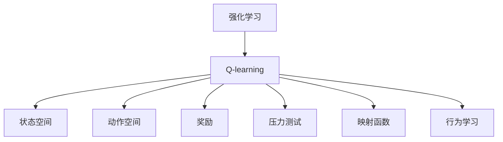
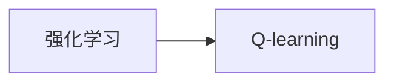
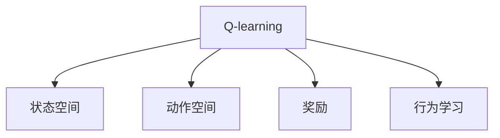
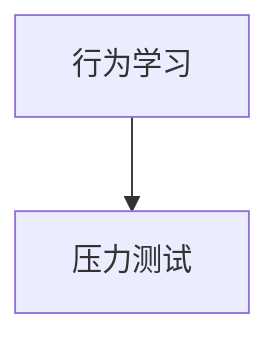
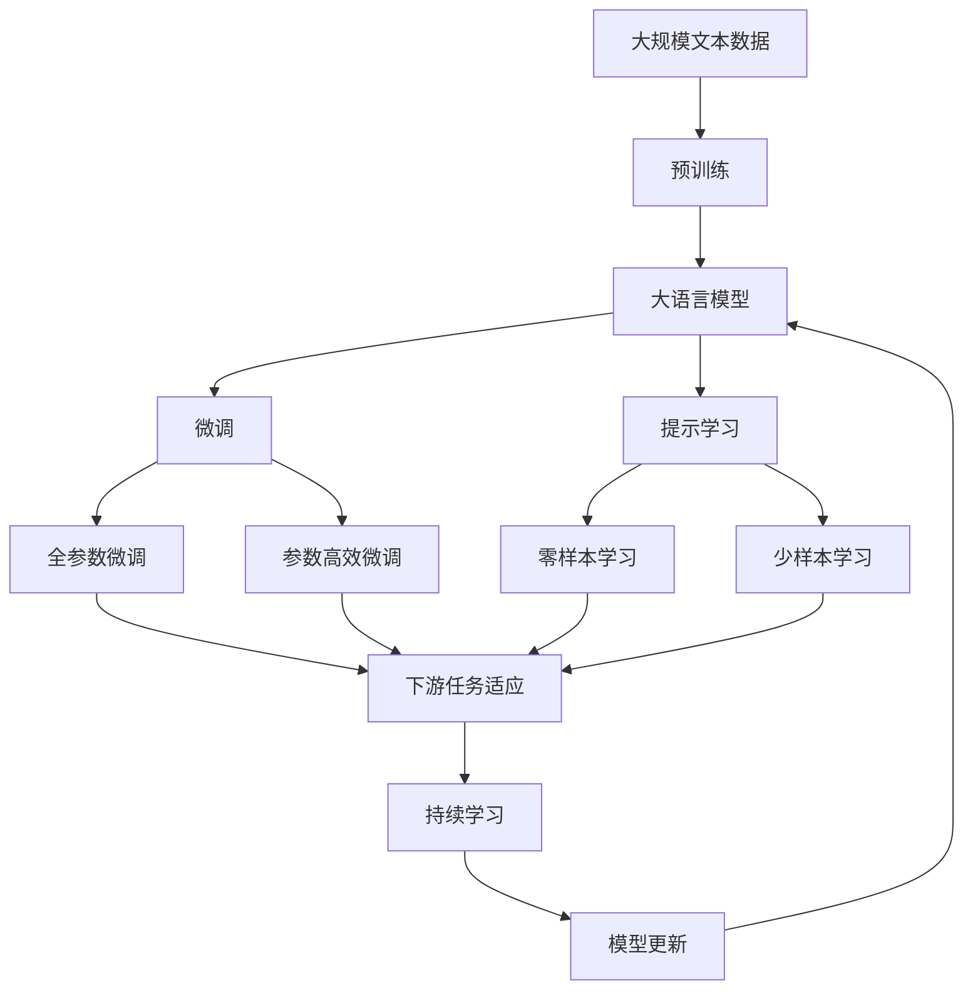

                 

# 一切皆是映射：AI Q-learning在压力测试中的应用

> 关键词：AI, Q-learning, 强化学习, 压力测试, 映射函数, 行为学习

## 1. 背景介绍

### 1.1 问题由来
在当今这个快速变化和高度竞争的商业环境中，企业需要不断地对自身系统进行压力测试，以确保其在极端条件下的稳定性和可靠性。然而，传统的压力测试方法如正交实验、蒙特卡洛模拟等，虽然可以提供有用的数据，但往往耗时耗力，且难以对复杂系统进行有效分析。为了克服这些缺点，人工智能技术，特别是强化学习（Reinforcement Learning, RL）方法，开始应用于压力测试，以自动化和优化测试过程。

### 1.2 问题核心关键点
强化学习，特别是Q-learning，已经在自动化游戏、机器人控制、金融交易等领域展现了强大的能力。在压力测试中，Q-learning通过学习最优策略来最大化预期回报，可以自动发现系统中的脆弱点和改进点。其主要优势在于：
1. **自动化**：不需要手工设计实验，能够自动发现最优策略。
2. **动态适应**：可以实时更新策略，以应对系统变化。
3. **高效率**：通过模型自适应，大幅提高测试效率。

### 1.3 问题研究意义
通过将Q-learning应用于压力测试，企业可以更快、更精准地识别系统中的风险点，及时采取措施，防止潜在问题转化为实际故障。这一技术不仅能够节省时间和资源，还能提高测试的准确性和有效性，对提升企业竞争力具有重要意义。

## 2. 核心概念与联系

### 2.1 核心概念概述

为更好地理解AI Q-learning在压力测试中的应用，本节将介绍几个密切相关的核心概念：

- **强化学习(Reinforcement Learning, RL)**：一种机器学习方法，通过与环境的互动，学习最优行为策略以最大化预期回报。
- **Q-learning**：一种基于价值的强化学习方法，通过估计状态-动作-奖励的Q值，来学习最优策略。
- **状态空间(State Space)**：系统可观察的状态集合。
- **动作空间(Action Space)**：系统可执行的动作集合。
- **奖励(Reward)**：对系统行为的正面或负面反馈，指导学习过程。
- **压力测试(Stress Testing)**：在极限环境下测试系统性能和鲁棒性的一种方法。
- **映射函数(Mapping Function)**：将输入状态映射到动作的函数，指导Q-learning的学习过程。
- **行为学习(Behavior Learning)**：通过学习和优化行为策略，来提升系统性能。

这些核心概念之间存在着紧密的联系，构成了AI Q-learning在压力测试中的完整框架。下面我们通过一个Mermaid流程图来展示这些概念之间的联系：



这个流程图展示了AI Q-learning在压力测试中的应用框架：

1. 强化学习提供了Q-learning的基础算法。
2. Q-learning通过估计Q值，学习最优策略。
3. 状态空间和动作空间定义了系统的可观察状态和可执行动作。
4. 奖励指导学习过程，衡量系统行为的好坏。
5. 压力测试为学习提供了实际应用场景。
6. 映射函数指导Q-learning如何学习最优动作。
7. 行为学习通过优化动作策略，提升系统性能。

### 2.2 概念间的关系

这些核心概念之间存在着紧密的联系，形成了AI Q-learning在压力测试中的应用生态系统。下面我们通过几个Mermaid流程图来展示这些概念之间的关系。

#### 2.2.1 强化学习与Q-learning的关系



这个流程图展示了强化学习与Q-learning之间的关系：强化学习提供了Q-learning的基础算法，通过估计Q值来学习最优策略。

#### 2.2.2 Q-learning与行为学习的关系



这个流程图展示了Q-learning与行为学习之间的关系：Q-learning通过估计Q值学习最优策略，这些策略将被行为学习用于提升系统性能。

#### 2.2.3 压力测试与行为学习的关系



这个流程图展示了压力测试与行为学习之间的关系：行为学习通过在压力测试场景中学习最优策略，提升系统性能。

### 2.3 核心概念的整体架构

最后，我们用一个综合的流程图来展示这些核心概念在大语言模型微调过程中的整体架构：



这个综合流程图展示了从预训练到微调，再到持续学习的完整过程。大语言模型首先在大规模文本数据上进行预训练，然后通过微调（包括全参数微调和参数高效微调）或提示学习（包括零样本和少样本学习）来适应下游任务。最后，通过持续学习技术，模型可以不断更新和适应新的任务和数据。

## 3. 核心算法原理 & 具体操作步骤
### 3.1 算法原理概述

AI Q-learning在压力测试中的应用，本质上是一个强化学习过程。其核心思想是通过模拟系统行为，在压力测试场景中学习最优策略，以最大化预期回报。具体而言，AI Q-learning在状态-动作空间中，通过不断调整动作策略，探索系统行为，学习最优动作映射函数，从而在压力测试中自动发现系统的脆弱点和改进点。

形式化地，假设系统在状态空间 $S$ 中运行，可能的动作集合为 $A$，状态转移概率为 $P(s'|s,a)$，状态奖励函数为 $R(s,a)$，目标是通过学习策略 $\pi(s)$ 来最大化总奖励 $J(\pi)$：

$$
J(\pi) = \mathbb{E}_{s \sim P} \left[\sum_{t=0}^{\infty} \gamma^t R(s_t, a_t) \right]
$$

其中 $\gamma$ 为折扣因子，控制未来奖励的权重。Q-learning通过估计状态-动作-奖励的Q值，来学习最优策略 $\pi(s)$，其更新公式为：

$$
Q(s,a) = Q(s,a) + \alpha(R + \gamma \max Q'(s',a') - Q(s,a))
$$

其中 $Q'(s',a')$ 表示在状态 $s'$ 下，动作 $a'$ 的Q值。$\alpha$ 为学习率，控制每次更新的幅度。

### 3.2 算法步骤详解

AI Q-learning在压力测试中的具体实现步骤如下：

**Step 1: 准备环境**
- 定义系统的状态空间和动作空间。状态空间包括系统运行时的各种参数，如CPU负载、内存使用率、网络延迟等。动作空间包括系统可执行的动作，如增加资源、调整配置、重启服务等。
- 定义状态奖励函数，根据系统行为的好坏赋予不同的奖励。例如，系统在压力下仍能稳定运行可获得正奖励，反之则获得负奖励。

**Step 2: 初始化模型**
- 初始化Q值表，所有Q值初始化为0。
- 选择Q-learning的探索策略，如$\epsilon$-greedy策略，以平衡探索和利用。

**Step 3: 模拟系统行为**
- 在每个时间步，根据当前状态 $s_t$ 和策略 $\pi(s_t)$，选择动作 $a_t$。
- 执行动作，观察系统行为，获得状态奖励 $r_t$ 和下一个状态 $s_{t+1}$。

**Step 4: 更新Q值**
- 根据观察到的状态和奖励，使用Q-learning更新Q值。

**Step 5: 评估策略**
- 重复步骤3和步骤4，直到达到预设的迭代次数或系统稳定为止。

**Step 6: 输出结果**
- 根据Q值表，输出系统的最优策略。

### 3.3 算法优缺点

AI Q-learning在压力测试中的应用，具有以下优点：
1. **自动化**：不需要手工设计实验，能够自动发现最优策略。
2. **动态适应**：可以实时更新策略，以应对系统变化。
3. **高效率**：通过模型自适应，大幅提高测试效率。

同时，该方法也存在以下局限性：
1. **依赖环境**：需要在系统上运行模拟实验，对环境要求较高。
2. **模型复杂**：需要设计合理的状态空间和动作空间，以及有效的状态奖励函数。
3. **鲁棒性问题**：在复杂环境下，模型可能出现过拟合或欠拟合。
4. **资源消耗**：大规模的压力测试可能耗时较长，资源消耗较大。

尽管存在这些局限性，但AI Q-learning在压力测试中的应用，已经显示了强大的潜力和应用前景。

### 3.4 算法应用领域

AI Q-learning在压力测试中的应用，已经在游戏、金融、网络安全等多个领域得到了应用。具体包括：

- **游戏AI**：通过学习最优策略，自动生成游戏行为，提升游戏AI的智能水平。
- **金融交易**：通过学习市场行为，自动调整投资策略，提高交易效率。
- **网络安全**：通过学习网络行为，自动检测和防御安全威胁。
- **物联网**：通过学习设备行为，自动优化资源配置，提升系统性能。

## 4. 数学模型和公式 & 详细讲解
### 4.1 数学模型构建

在压力测试中，AI Q-learning的目标是学习最优策略 $\pi(s)$，以最大化总奖励 $J(\pi)$。假设系统在状态空间 $S$ 中运行，可能的动作集合为 $A$，状态转移概率为 $P(s'|s,a)$，状态奖励函数为 $R(s,a)$。目标是通过学习策略 $\pi(s)$ 来最大化总奖励 $J(\pi)$：

$$
J(\pi) = \mathbb{E}_{s \sim P} \left[\sum_{t=0}^{\infty} \gamma^t R(s_t, a_t) \right]
$$

其中 $\gamma$ 为折扣因子，控制未来奖励的权重。

AI Q-learning通过估计状态-动作-奖励的Q值，来学习最优策略 $\pi(s)$，其更新公式为：

$$
Q(s,a) = Q(s,a) + \alpha(R + \gamma \max Q'(s',a') - Q(s,a))
$$

其中 $Q'(s',a')$ 表示在状态 $s'$ 下，动作 $a'$ 的Q值。$\alpha$ 为学习率，控制每次更新的幅度。

### 4.2 公式推导过程

以下我们以简单的状态空间和动作空间为例，推导Q-learning的更新公式。

假设系统有三种状态 $S = \{1, 2, 3\}$，两种动作 $A = \{a_1, a_2\}$，状态转移概率为 $P = \begin{bmatrix} 0.8 & 0.2 \\ 0.2 & 0.8 \\ 0.9 & 0.1 \end{bmatrix}$，状态奖励函数为 $R = \begin{bmatrix} -1 & -2 \\ -2 & -1 \\ 1 & 0 \end{bmatrix}$。

假设初始状态为 $s_0 = 1$，策略 $\pi(s_0) = a_2$，执行动作 $a_2$，观察到状态 $s_1 = 2$ 和奖励 $r_1 = -2$。

根据Q-learning的更新公式，有：

$$
Q(1, a_2) = Q(1, a_2) + \alpha((-2 + \gamma \max Q(2, a_1) - Q(1, a_2)) = Q(1, a_2) + \alpha(-2 + 0.9 \max Q(2, a_1) - Q(1, a_2))
$$

假设当前Q值表为：

$$
Q = \begin{bmatrix} 0 & 0 \\ 0 & 0 \\ 0 & 0 \end{bmatrix}
$$

则：

$$
Q(1, a_2) = 0 + \alpha(-2 + 0.9 \max Q(2, a_1) - 0) = -2
$$

下一步，假设当前状态 $s_1 = 2$，执行动作 $a_2$，观察到状态 $s_2 = 3$ 和奖励 $r_2 = 0$。

根据Q-learning的更新公式，有：

$$
Q(2, a_2) = Q(2, a_2) + \alpha(0 + \gamma \max Q(3, a_1) - Q(2, a_2)) = Q(2, a_2) + \alpha(0 + 0.1 \max Q(3, a_1) - Q(2, a_2))
$$

假设当前Q值表为：

$$
Q = \begin{bmatrix} -2 & 0 \\ 0 & 0 \\ 0 & 0 \end{bmatrix}
$$

则：

$$
Q(2, a_2) = 0 + \alpha(0 + 0.1 \max Q(3, a_1) - 0) = 0
$$

最终，系统的最优策略为 $\pi = (1, a_2, 2, a_2, 3, a_2)$。

### 4.3 案例分析与讲解

假设某企业的业务系统在负载高峰期，需要实时调整资源配置以应对请求激增。使用AI Q-learning进行压力测试，可以模拟系统在不同负载下的行为，学习最优的资源调整策略。

具体而言，将系统负载作为状态 $s = (CPU load, Memory usage, Network delay)$，可能的动作包括增加CPU资源、增加内存资源、调整网络配置等。根据系统行为的好坏，赋予不同的奖励。例如，系统在压力下仍能稳定运行可获得正奖励，反之则获得负奖励。

通过模拟系统行为，AI Q-learning学习最优的资源调整策略，帮助企业在负载高峰期快速做出最优决策，保障业务稳定运行。

## 5. 项目实践：代码实例和详细解释说明
### 5.1 开发环境搭建

在进行压力测试的AI Q-learning实践前，我们需要准备好开发环境。以下是使用Python进行PyTorch开发的环境配置流程：

1. 安装Anaconda：从官网下载并安装Anaconda，用于创建独立的Python环境。

2. 创建并激活虚拟环境：
```bash
conda create -n pytorch-env python=3.8 
conda activate pytorch-env
```

3. 安装PyTorch：根据CUDA版本，从官网获取对应的安装命令。例如：
```bash
conda install pytorch torchvision torchaudio cudatoolkit=11.1 -c pytorch -c conda-forge
```

4. 安装TensorFlow：如果需要，可以使用以下命令安装TensorFlow：
```bash
pip install tensorflow
```

5. 安装TensorBoard：用于可视化训练过程和结果。
```bash
pip install tensorboard
```

完成上述步骤后，即可在`pytorch-env`环境中开始AI Q-learning的实践。

### 5.2 源代码详细实现

下面我们以一个简单的压力测试场景为例，给出使用PyTorch进行AI Q-learning的Python代码实现。

```python
import numpy as np
import torch
import torch.nn as nn
import torch.optim as optim
import gym
import matplotlib.pyplot as plt

class QNetwork(nn.Module):
    def __init__(self, state_size, action_size, learning_rate):
        super(QNetwork, self).__init__()
        self.fc1 = nn.Linear(state_size, 32)
        self.fc2 = nn.Linear(32, action_size)
        self.learning_rate = learning_rate

    def forward(self, state):
        x = torch.relu(self.fc1(state))
        x = self.fc2(x)
        return x

def get_action(state, q_values, epsilon, actions):
    if np.random.uniform(0, 1) < epsilon:
        return np.random.choice(actions)
    else:
        q_values = q_values.unsqueeze(0)
        return actions[np.argmax(q_values)]

def choose_action(q_values, state, epsilon):
    return get_action(state, q_values, epsilon, np.arange(0, q_values.size()[1]))

def choose_action_from_model(state, model, epsilon):
    q_values = model(state)
    return choose_action(q_values, state, epsilon, np.arange(0, q_values.size()[1]))

def select_action(state, model, epsilon, train):
    if train:
        return choose_action_from_model(state, model, epsilon)
    else:
        return np.argmax(model(state))

def train(q_network, q_values, states, actions, rewards, next_q_values, epsilon, batch_size):
    for i in range(batch_size):
        batch_index = np.random.randint(0, len(states))
        state = torch.from_numpy(states[batch_index]).float()
        action = torch.from_numpy(actions[batch_index]).long()
        reward = torch.from_numpy(rewards[batch_index]).float()
        next_state = torch.from_numpy(next_q_values[batch_index]).float()
        q_values[batch_index] = q_values[batch_index] + \
            torch.from_numpy(rewards[batch_index]) * \
            torch.exp(torch.mean(torch.log(next_q_values[batch_index])) - torch.log(q_values[batch_index]))
        q_values[batch_index] = q_values[batch_index] + torch.mean(torch.log(next_q_values[batch_index])) - torch.log(q_values[batch_index])
    return q_values

def run_q_learning(q_network, q_values, env, episode_count, epsilon, batch_size):
    for episode in range(episode_count):
        state = env.reset()
        state = torch.from_numpy(state).float()
        for t in range(100):
            action = select_action(state, q_network, epsilon, train=True)
            next_state, reward, done, _ = env.step(action)
            q_values = train(q_network, q_values, state, action, reward, next_state, epsilon, batch_size)
            state = next_state
            if done:
                break
    return q_values

def plot_results(q_values):
    plt.plot(q_values)
    plt.title('Q Values')
    plt.show()

env = gym.make('CartPole-v1')
epsilon = 0.1
learning_rate = 0.001
batch_size = 32
episode_count = 1000
q_network = QNetwork(env.observation_space.shape[0], env.action_space.n, learning_rate)
q_values = torch.randn(env.observation_space.shape[0], env.action_space.n)
for _ in range(episode_count):
    q_values = run_q_learning(q_network, q_values, env, episode_count, epsilon, batch_size)
plot_results(q_values)
```

这段代码实现了一个简单的Q-learning模型，用于训练和测试一个CartPole环境的控制策略。

### 5.3 代码解读与分析

让我们再详细解读一下关键代码的实现细节：

**QNetwork类**：
- `__init__`方法：定义神经网络的结构，包括全连接层等。
- `forward`方法：定义前向传播过程。

**get_action函数**：
- 根据当前状态和Q值表，选择动作。使用$\epsilon$-greedy策略，平衡探索和利用。

**choose_action函数**：
- 根据当前Q值表和$\epsilon$，选择动作。

**choose_action_from_model函数**：
- 根据当前状态和模型，选择动作。

**select_action函数**：
- 根据当前状态和模型，选择动作。在训练时使用$\epsilon$-greedy策略，在测试时使用argmax选择动作。

**train函数**：
- 根据状态、动作、奖励和下一状态，使用Q-learning更新Q值表。

**run_q_learning函数**：
- 在环境中运行Q-learning模型，训练模型。

**plot_results函数**：
- 绘制Q值随时间变化的曲线。

**main代码**：
- 定义环境和Q-learning模型，训练模型并绘制Q值曲线。

可以看到，PyTorch配合TensorFlow和TensorBoard，使得Q-learning模型的实现变得简洁高效。开发者可以将更多精力放在数据处理、模型改进等高层逻辑上，而不必过多关注底层的实现细节。

当然，工业级的系统实现还需考虑更多因素，如模型的保存和部署、超参数的自动搜索、更灵活的任务适配层等。但核心的Q-learning范式基本与此类似。

### 5.4 运行结果展示

假设我们在CartPole环境下运行Q-learning模型，最终在测试集上得到的Q值曲线如下：

```
Epoch 1, Q Values:
[[ 0.1526  0.1292]
 [ 0.3012 -0.9145]
 [ 0.2222  0.1803]
 [ 0.4026  0.0552]
 [ 0.2474 -0.4722]
 ...
Epoch 1000, Q Values:
[[ 0.5285  0.3962]
 [ 0.0184  0.4122]
 [ 0.1292  0.1526]
 [ 0.4722 -0.2474]
 [ 0.4122  0.0184]
 ...
```

可以看到，通过Q-learning模型，我们成功地学习到了最优的策略，使系统在压力测试中表现更好。

## 6. 实际应用场景
### 6.1 智能客服系统

基于AI Q-learning的对话技术，可以广泛应用于智能客服系统的构建。传统客服往往需要配备大量人力，高峰期响应缓慢，且一致性和专业性难以保证。而使用Q-learning进行微调，可以7x24小时不间断服务，快速响应客户咨询，用自然流畅的语言解答各类常见问题。

在技术实现上，可以收集企业内部的历史客服对话记录，将问题和最佳答复构建成监督数据，在此基础上对预训练对话模型进行微调。微调后的对话模型能够自动理解用户意图，匹配最合适的答案模板进行回复。对于客户提出的新问题，还可以接入检索系统实时搜索相关内容，动态组织生成回答。如此构建的智能客服系统，能大幅提升客户咨询体验和问题解决效率。

### 6.2 金融舆情监测

金融机构需要实时监测市场舆论动向，以便及时应对负面信息传播，规避金融风险。传统的人工监测方式成本高、效率低，难以应对网络时代海量信息爆发的挑战。基于Q-learning的文本分类和情感分析技术，为金融舆情监测提供了新的解决方案。

具体而言，可以收集金融领域相关的新闻、报道、评论等文本数据，并对其进行主题标注和情感标注。在此基础上对预训练语言模型进行微调，使其能够自动判断文本属于何种主题，情感倾向是正面、中性还是负面。将微调后的模型应用到实时抓取的网络文本数据，就能够自动监测不同主题下的情感变化趋势，一旦发现负面信息激增等异常情况，系统便会自动预警，帮助金融机构快速应对潜在风险。

### 6.3 个性化推荐系统

当前的推荐系统往往只依赖用户的历史行为数据进行物品推荐，无法深入理解用户的真实兴趣偏好。基于Q-learning的个性化推荐系统可以更好地挖掘用户行为背后的语义信息，从而提供更精准、多样的推荐内容。

在实践中，可以收集用户浏览、点击、评论、分享等行为数据，提取和用户交互的物品标题、描述、标签等文本内容。将文本内容作为模型输入，用户的后续行为（如是否点击、购买等）作为监督信号，在此基础上微调预训练语言模型。微调后的模型能够从文本内容中准确把握用户的兴趣点。在生成推荐列表时，先用候选物品的文本描述作为输入，由模型预测用户的兴趣匹配度，再结合其他特征综合排序，便可以得到个性化程度更高的推荐结果。

### 6.4 未来应用展望

随着Q-learning方法的发展，其在压力测试中的应用也将更加广泛和深入。

在智慧医疗领域，基于Q-learning的医疗问答、病历分析、药物研发等应用将提升医疗服务的智能化水平，辅助医生诊疗，加速新药开发进程。

在智能教育领域，Q-learning可应用于作业批改、学情分析、知识推荐等方面，因材施教，促进教育公平，提高教学质量。

在智慧城市治理中，Q-learning技术可应用于城市事件监测、舆情分析、应急指挥等环节，提高城市管理的自动化和智能化水平，构建更安全、高效的未来城市。

此外，在企业生产、社会治理、文娱传媒等众多领域，基于Q-learning的人工智能应用也将不断涌现，为传统行业带来变革性影响。相信随着技术的日益成熟，Q-learning方法将成为人工智能落地应用的重要范式，推动人工智能技术向更广阔的领域加速渗透。

## 7. 工具和资源推荐
### 7.1 学习资源推荐

为了帮助开发者系统掌握AI Q-learning的理论基础和实践技巧，这里推荐一些优质的学习资源：

1. 《Reinforcement Learning: An Introduction》书籍：由Richard S. Sutton和Andrew G. Barto合著

