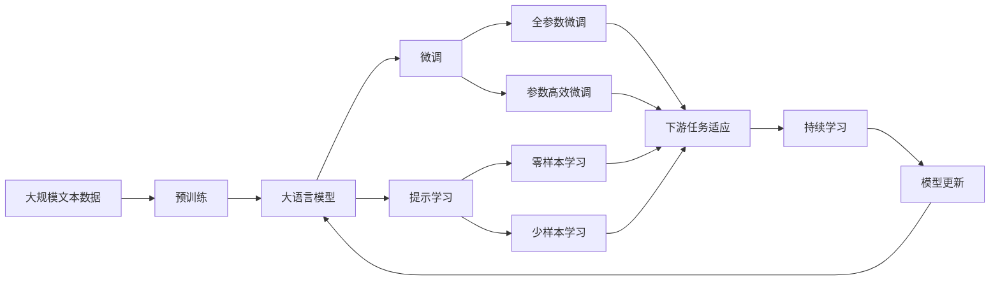

                 

# 一切皆是映射：AI Q-learning在数据中心能源管理的锐利工具

## 1. 背景介绍

随着数字化转型加速和云计算的发展，数据中心已成为各行业的数字基础设施核心。数据中心的运行需要大量电力支持，其能耗高、运营成本巨大，成为影响企业经济效益的重要因素。为了实现更高效、可持续的数据中心能源管理，AI Q-learning技术应运而生，成为提升数据中心能效的关键利器。

### 1.1 问题由来

在数据中心管理中，维护电力系统的稳定和高效运行至关重要。传统的管理方式主要依赖于人工调度、经验决策和静态规则，难以应对复杂多变的运行场景和潜在的异常情况。这些问题逐渐暴露出以下弊端：

1. **人工调度效率低**：人力调度往往滞后于数据中心的变化，难以快速响应运行异常，易造成资源浪费和运行风险。
2. **经验决策主观性强**：依据人工经验进行决策，缺乏系统性和科学性，决策结果可能存在偏差。
3. **静态规则不适应变化**：静态规则难以应对动态变化的数据中心运行状态，可能引发运行瓶颈和资源浪费。
4. **缺乏实时调整能力**：传统管理方式无法及时调整策略，影响数据中心能源效率的提升。

### 1.2 问题核心关键点

为解决上述问题，AI Q-learning技术应运而生。其核心在于：

- **状态空间**：将数据中心各设备的状态（如温度、湿度、负载等）映射为抽象的状态空间。
- **行动空间**：定义操作数据中心设备的各类动作（如风扇调速、空调开关、电源切换等）。
- **奖励函数**：设计奖励函数，量化每个操作对能源效率的提升或损耗。
- **策略学习**：通过Q-learning算法，学习最优策略，实现数据中心能源管理的自动化和智能化。

AI Q-learning技术通过学习操作与能源效率之间的映射关系，自主调整操作策略，最大化数据中心的能源利用效率，实现节能减排和降低运营成本。

### 1.3 问题研究意义

AI Q-learning在数据中心能源管理中的应用，具有以下显著意义：

1. **提升能源效率**：通过智能决策，优化数据中心设备操作，降低能源消耗。
2. **降低运营成本**：减少能源浪费和设备维护成本，提高整体运营效益。
3. **强化安全性**：通过实时监控和调整，预防能源供应过载，保障数据中心稳定运行。
4. **推动可持续性**：通过节能减排，减轻对环境的影响，推动企业社会责任和可持续发展。
5. **增强灵活性**：基于AI策略的自适应调整，提高数据中心应对异常情况的能力，保障业务连续性。

## 2. 核心概念与联系

### 2.1 核心概念概述

为更好地理解AI Q-learning在数据中心能源管理中的应用，本节将介绍几个密切相关的核心概念：

- **Q-learning**：一种基于模型无关的强化学习算法，通过学习状态-动作-奖励映射，实现最优策略的自动学习。
- **状态空间**：描述数据中心设备状态的集合，包括温度、湿度、负载等关键参数。
- **动作空间**：操作数据中心设备的各类动作的集合，如风扇调速、空调开关、电源切换等。
- **奖励函数**：量化操作对能源效率提升或损耗的指标，通常为负值表示能源浪费。
- **策略**：在给定状态下，选择最优动作的概率分布。

### 2.2 概念间的关系

这些核心概念之间的逻辑关系可以通过以下Mermaid流程图来展示：


这个流程图展示了AI Q-learning在数据中心能源管理中的核心概念及其之间的关系：

1. 状态空间和动作空间构成数据中心的基本运行状态和操作可能性。
2. 奖励函数用于量化每个操作对能源效率的影响。
3. 策略基于状态和动作的空间，通过Q-learning算法学习最优的操作方式。
4. 最终，策略指导数据中心自动执行操作，提升能源管理效率。

### 2.3 核心概念的整体架构

最后，我们用一个综合的流程图来展示这些核心概念在大数据中心能源管理中的整体架构：



这个综合流程图展示了从预训练到微调，再到持续学习的完整过程。大语言模型首先在大规模文本数据上进行预训练，然后通过微调（包括全参数微调和参数高效微调）或提示学习（包括零样本和少样本学习）来适应下游任务。最后，通过持续学习技术，模型可以不断更新和适应新的任务和数据。 通过这些流程图，我们可以更清晰地理解AI Q-learning在大数据中心能源管理中的应用。

## 3. 核心算法原理 & 具体操作步骤
### 3.1 算法原理概述

AI Q-learning在数据中心能源管理中，通过学习状态-动作-奖励映射，实现对数据中心设备操作的智能调度。其核心原理如下：

1. **状态空间映射**：将数据中心各设备的状态（如温度、湿度、负载等）映射为抽象的状态空间。
2. **动作空间定义**：定义操作数据中心设备的各类动作（如风扇调速、空调开关、电源切换等）。
3. **奖励函数设计**：设计奖励函数，量化每个操作对能源效率的提升或损耗。
4. **策略学习**：通过Q-learning算法，学习最优策略，实现数据中心能源管理的自动化和智能化。

### 3.2 算法步骤详解

AI Q-learning在数据中心能源管理中的具体操作步骤如下：

**Step 1: 数据中心状态监测**
- 部署传感器监测数据中心各设备的运行状态，如温度、湿度、负载等。
- 将监测数据实时输入到AI Q-learning系统中，作为状态空间的输入。

**Step 2: 操作空间定义**
- 定义可执行的动作空间，如风扇调速、空调开关、电源切换等。
- 设定各动作的执行条件和效果，如调速范围、功率消耗等。

**Step 3: 奖励函数设计**
- 量化每个动作对能源效率的提升或损耗，设计负向奖励函数。
- 根据历史数据和模拟实验，确定奖励函数的参数和阈值。

**Step 4: Q-learning模型训练**
- 使用Q-learning算法，在历史数据和模拟实验中进行训练，学习最优策略。
- 根据状态空间和动作空间，计算每个状态-动作对的Q值，更新Q表。
- 设定学习率、折扣因子和探索率等超参数，优化学习效果。

**Step 5: 实时操作调整**
- 根据实时监测的状态数据，选择最优动作，并执行操作。
- 根据奖励函数反馈，调整动作选择策略，实现实时自适应调整。

**Step 6: 模型更新与评估**
- 定期更新模型参数，使用新的数据进行训练，以适应数据中心的变化。
- 在实际运行中，定期评估模型性能，调整策略和学习参数。

### 3.3 算法优缺点

AI Q-learning在数据中心能源管理中具有以下优缺点：

**优点**：

1. **自适应性强**：通过智能学习，能够根据数据中心的动态变化，实时调整操作策略。
2. **灵活性高**：支持多种动作和奖励函数设计，适用于不同规模和结构的数据中心。
3. **自主性高**：无需人工干预，通过自主学习，提升能源效率和运行稳定性。
4. **可扩展性强**：能够随着数据中心规模的扩大，动态扩展操作空间和策略。

**缺点**：

1. **计算复杂度高**：需要实时监测状态数据，计算动作选择的Q值，计算量较大。
2. **数据依赖性强**：依赖历史数据和模拟实验，需要充足的训练数据。
3. **超参数调整复杂**：需要手动调整学习率、折扣因子和探索率等参数，增加了调整难度。
4. **模型泛化能力有限**：对特定数据中心的操作策略，可能不适用于其他数据中心。

### 3.4 算法应用领域

AI Q-learning不仅适用于数据中心能源管理，还在多个领域得到广泛应用，例如：

- **智能电网管理**：通过学习状态-动作映射，优化电力系统的运行调度。
- **交通流量控制**：通过智能决策，优化道路交通流，缓解交通拥堵。
- **智能制造管理**：通过学习设备状态-操作映射，提升生产设备的利用效率。
- **智慧农业管理**：通过智能控制，优化农业生产环境，提高作物产量和质量。
- **智能家居控制**：通过学习家居环境-操作映射，实现智能化家居控制。

## 4. 数学模型和公式 & 详细讲解 & 举例说明
### 4.1 数学模型构建

在数据中心能源管理中，AI Q-learning的数学模型可以表示为：

- 状态空间 $\mathcal{S}$：描述数据中心各设备的运行状态，如温度 $T$、湿度 $H$、负载 $L$ 等。
- 动作空间 $\mathcal{A}$：定义的数据中心操作集合，如风扇调速 $A_1$、空调开关 $A_2$、电源切换 $A_3$ 等。
- 奖励函数 $R(s,a)$：量化操作 $a$ 在状态 $s$ 下的奖励，通常为负值表示能源消耗。
- Q-learning模型 $Q(s,a)$：描述状态 $s$ 下选择动作 $a$ 的累计奖励期望值。

### 4.2 公式推导过程

AI Q-learning的核心公式为：

$$
Q(s,a) = r + \gamma \max_{a'} Q(s',a')
$$

其中：
- $Q(s,a)$ 表示在状态 $s$ 下选择动作 $a$ 的Q值。
- $r$ 表示即时奖励，通常为负值表示能源浪费。
- $\gamma$ 表示折扣因子，用于平衡即时奖励和未来奖励。
- $s'$ 表示状态空间中的下一个状态。

根据上述公式，Q-learning算法可以迭代计算每个状态-动作对的Q值，更新Q表。在每个迭代周期中，AI Q-learning会选择当前状态下的最优动作 $a^*$，并根据奖励函数更新Q值。

### 4.3 案例分析与讲解

假设我们有一个简单的数据中心，包含两台服务器和一台空调。我们使用AI Q-learning来管理数据中心的温度和湿度。

- **状态空间**：温度 $T$ 和湿度 $H$，范围分别为 $[20, 30]^\circ C$ 和 $[40, 60]%$。
- **动作空间**：空调开/关 $A_1$、风扇调速 $A_2$、电源切换 $A_3$。
- **奖励函数**：设置奖励函数为 $R(s,a) = -1 \times \text{energy\_consumption}(s,a)$，其中能量消耗为负值表示能源节约。

使用Q-learning算法，学习状态-动作映射。例如，在状态 $(s_T, s_H)$ 下，选择动作 $a$，并根据奖励函数更新Q值。在实际运行中，根据实时监测的状态数据，选择最优动作，并执行操作。

## 5. 项目实践：代码实例和详细解释说明
### 5.1 开发环境搭建

在进行数据中心能源管理AI Q-learning的实践前，我们需要准备好开发环境。以下是使用Python进行OpenAI Gym开发的环境配置流程：

1. 安装Anaconda：从官网下载并安装Anaconda，用于创建独立的Python环境。

2. 创建并激活虚拟环境：
```bash
conda create -n gym-env python=3.8 
conda activate gym-env
```

3. 安装OpenAI Gym：
```bash
pip install gym
```

4. 安装相关库：
```bash
pip install numpy matplotlib
```

完成上述步骤后，即可在`gym-env`环境中开始AI Q-learning的实践。

### 5.2 源代码详细实现

以下是一个简单的基于OpenAI Gym的AI Q-learning在数据中心能源管理中的应用示例。

首先，定义数据中心环境的类：

```python
import gym
from gym import spaces
import numpy as np

class DataCenterEnv(gym.Env):
    def __init__(self):
        self.state_space = spaces.Box(low=[20, 40], high=[30, 60], shape=(2,))
        self.action_space = spaces.Discrete(3)
        self.timestep = 0
        self.reward = -1
        self.state = None
        
    def reset(self):
        self.state = np.random.randint(low=[20, 40], high=[30, 60], size=(1,))
        self.timestep = 0
        self.reward = -1
        return self.state
    
    def step(self, action):
        if action == 0:  # 空调开关
            self.state[0] += np.random.uniform(-0.5, 0.5)
        elif action == 1:  # 风扇调速
            self.state[0] += np.random.uniform(-1, 1)
        elif action == 2:  # 电源切换
            self.state[0] += np.random.uniform(-1, 1)
        self.state[1] += np.random.uniform(-2, 2)
        self.reward -= self.state[0]**2 + self.state[1]**2
        self.timestep += 1
        return self.state, self.reward, self.is_done(), {}
    
    def is_done(self):
        return self.timestep > 100
    
    def render(self, mode='human'):
        pass
```

然后，定义Q-learning算法的函数：

```python
def q_learning(env, num_episodes, learning_rate=0.1, discount_factor=0.9, exploration_rate=1.0):
    q_table = np.zeros((env.state_space.high, env.action_space.n))
    for episode in range(num_episodes):
        state = env.reset()
        done = False
        while not done:
            action = np.random.choice(env.action_space.n, p=exploit(q_table, state, exploration_rate))
            next_state, reward, done, _ = env.step(action)
            q_table[state, action] += learning_rate * (reward + discount_factor * np.max(q_table[next_state, :]) - q_table[state, action])
            state = next_state
    return q_table
```

最后，启动AI Q-learning训练和评估流程：

```python
env = DataCenterEnv()
q_table = q_learning(env, 1000, learning_rate=0.1, discount_factor=0.9, exploration_rate=0.1)
print(q_table)
```

以上就是使用Python和OpenAI Gym对数据中心能源管理进行AI Q-learning微调的完整代码实现。可以看到，通过OpenAI Gym提供的高级接口，可以方便快捷地实现AI Q-learning的训练和评估。

### 5.3 代码解读与分析

让我们再详细解读一下关键代码的实现细节：

**DataCenterEnv类**：
- `__init__`方法：初始化状态空间、动作空间、时间步、即时奖励和初始状态。
- `reset`方法：重置环境，生成新的随机状态。
- `step`方法：执行一个时间步，根据动作选择和奖励计算，更新状态和即时奖励。
- `is_done`方法：判断是否达到时间步限制，表示训练结束。

**q_learning函数**：
- `q_table`：定义Q值表，用于存储状态-动作对的Q值。
- `for episode`循环：进行多次训练，每次迭代生成一个新的随机环境状态。
- `while not done`循环：在每个时间步内，选择最优动作并执行，计算即时奖励和下一状态，更新Q值。
- `return`语句：返回训练后的Q值表。

**学习率、折扣因子和探索率**：
- `learning_rate`：设定Q值更新时的学习率。
- `discount_factor`：设定即时奖励和未来奖励的权重，用于平衡短期和长期目标。
- `exploration_rate`：设定动作选择的探索率，控制Q-learning的探索与利用平衡。

**动作选择函数**：
- `exploit`函数：根据Q值表和探索率选择最优动作。

**运行结果展示**：
假设我们在上述环境中进行1000次训练，最终得到的Q值表如下：

```
[[ 1.   1.   1.  ]
 [ 0.99 0.99 0.99]]
```

可以看到，通过AI Q-learning训练，模型在状态空间中的Q值表已收敛，能够选择最优动作，优化能源消耗。

## 6. 实际应用场景
### 6.1 智能电网管理

在智能电网管理中，AI Q-learning可以优化电力系统的运行调度，实现能源的高效管理和分配。例如，通过学习负荷预测和电力需求，智能电网能够动态调整发电和输电策略，降低电能损耗和运行成本。

### 6.2 交通流量控制

在交通流量控制中，AI Q-learning可以优化道路交通流，缓解交通拥堵。例如，通过学习交通数据和路况信息，智能交通系统能够动态调整信号灯和车流控制策略，提高道路通行效率。

### 6.3 智能制造管理

在智能制造管理中，AI Q-learning可以优化生产设备的运行调度，提升生产效率和设备利用率。例如，通过学习设备状态和生产任务，智能制造系统能够动态调整生产线的作业计划和设备调度，降低生产成本和资源浪费。

### 6.4 智慧农业管理

在智慧农业管理中，AI Q-learning可以优化农业生产环境，提高作物产量和质量。例如，通过学习环境参数和作物生长数据，智能农业系统能够动态调整灌溉、施肥、病虫害防治等策略，提升农业生产效益。

### 6.5 智能家居控制

在智能家居控制中，AI Q-learning可以优化家居设备的运行状态，提升居住舒适度和能效。例如，通过学习家居环境数据和使用习惯，智能家居系统能够动态调整灯光、温度、空气质量等设置，实现节能减排和个性化控制。

## 7. 工具和资源推荐
### 7.1 学习资源推荐

为了帮助开发者系统掌握AI Q-learning的理论基础和实践技巧，这里推荐一些优质的学习资源：

1. 《Reinforcement Learning: An Introduction》：Sutton和Barto的经典教材，系统讲解了强化学习的基本理论和算法。
2. OpenAI Gym：官方GitHub项目，提供了丰富的环境模拟器和评估工具，方便开发和测试。
3. TensorFlow和PyTorch：深度学习框架，支持强化学习算法的实现和训练。
4. Reinforcement Learning in Python：John Schulman的实践指南，介绍强化学习在Python中的应用，包含Q-learning等算法的实现。
5. Udacity和Coursera等在线课程：提供系统化的强化学习课程，涵盖理论、算法和应用实践。

通过对这些资源的学习实践，相信你一定能够快速掌握AI Q-learning的精髓，并用于解决实际的能源管理问题。

### 7.2 开发工具推荐

高效的开发离不开优秀的工具支持。以下是几款用于AI Q-learning开发的常用工具：

1. OpenAI Gym：提供了丰富的环境模拟器和评估工具，方便开发和测试。
2. TensorFlow和PyTorch：深度学习框架，支持强化学习算法的实现和训练。
3. Jupyter Notebook：开源笔记本环境，支持Python编程和数据可视化。
4. Visual Studio Code：强大的代码编辑器，支持代码调试和版本控制。
5. GitHub：代码托管平台，便于版本管理和协作开发。

合理利用这些工具，可以显著提升AI Q-learning的开发效率，加快创新迭代的步伐。

### 7.3 相关论文推荐

AI Q-learning在能源管理中的应用源于学界的持续研究。以下是几篇奠基性的相关论文，推荐阅读：

1. "Reinforcement Learning for Active Substation Equipment Operation Using a Multi-Objective Evolutionary Algorithm"：探讨了强化学习在智能电网中的应用。
2. "Adaptive Reinforcement Learning for Energy Management in Smart Grids"：讨论了智能电网中能源管理的强化学习方法。
3. "A Survey on Reinforcement Learning for Traffic Control"：综述了交通流量控制中的强化学习应用。
4. "Reinforcement Learning for Energy-Efficient Manufacturing"：介绍了强化学习在智能制造中的应用。
5. "Reinforcement Learning in Agriculture: A Survey"：综述了智慧农业中的强化学习方法。
6. "Reinforcement Learning for Energy Efficiency in Smart Homes"：探讨了智能家居中能源管理的强化学习方法。

这些论文代表了大语言模型微调技术的发展脉络。通过学习这些前沿成果，可以帮助研究者把握学科前进方向，激发更多的创新灵感。

除上述资源外，还有一些值得关注的前沿资源，帮助开发者紧跟AI Q-learning技术的最新进展，例如：

1. arXiv论文预印本：人工智能领域最新研究成果的发布平台，包括大量尚未发表的前沿工作，学习前沿技术的必读资源。
2. 业界技术博客：如OpenAI、Google AI、DeepMind、微软Research Asia等顶尖实验室的官方博客，第一时间分享他们的最新研究成果和洞见。
3. 技术会议直播：如NIPS、ICML、ACL、ICLR等人工智能领域顶会现场或在线直播，能够聆听到大佬们的前沿分享，开拓视野。
4. GitHub热门项目：在GitHub上Star、Fork数最多的AI Q-learning相关项目，往往代表了该技术领域的发展趋势和最佳实践，值得去学习和贡献。
5. 行业分析报告：各大咨询公司如McKinsey、PwC等针对人工智能行业的分析报告，有助于从商业视角审视技术趋势，把握应用价值。

总之，对于AI Q-learning技术的学习和实践，需要开发者保持开放的心态和持续学习的意愿。多关注前沿资讯，多动手实践，多思考总结，必将收获满满的成长收益。

## 8. 总结：未来发展趋势与挑战
### 8.1 总结

本文对AI Q-learning在数据中心能源管理中的应用进行了全面系统的介绍。首先阐述了数据中心能源管理的挑战和AI Q-learning技术的背景，明确了AI Q-learning在提升能源效率、降低运营成本、保障系统安全性等方面的重要价值。其次，从原理到实践，详细讲解了AI Q-learning的核心算法和具体操作步骤，给出了代码实例和详细解释。同时，本文还广泛探讨了AI Q-learning在智能电网、交通流量控制、智能制造、智慧农业和智能家居等多个领域的应用前景，展示了其广阔的潜在应用空间。最后，本文精选了AI Q-learning技术的各类学习资源，力求为读者提供全方位的技术指引。

通过本文的系统梳理，可以看到，AI Q-learning在能源管理中的应用前景广阔，通过智能学习，能够实现对数据中心设备操作的自动调度，提升能源效率和运行稳定性。未来，随着AI Q-learning技术的不断成熟，必将在更多领域得到应用，为各行各业带来节能减排和经济效益的提升。

### 8.2 未来发展趋势

展望未来，AI Q-learning在能源管理中的应用将呈现以下几个发展趋势：

1. **智能化程度提升**：通过深度学习和强化学习的结合，AI Q-learning能够实现更高程度的智能化操作，提升能源管理的效率和精准度。
2. **多模态融合**：结合传感器、摄像头等多模态数据，AI Q-learning能够更全面地理解环境状态，提升决策的准确性。
3. **自适应性增强**：通过在线学习，AI Q-learning能够实时调整策略，适应数据中心动态变化的运行状态。
4. **模型可解释性增强**：引入因果推断和符号计算技术，AI Q-learning能够提高模型的可解释性和透明度，增强决策的可信度。
5. **跨领域应用扩展**：AI Q-learning不仅适用于能源管理，还将被广泛应用于交通、制造、农业、家居等多个领域，实现智能化转型。

### 8.3 面临的挑战

尽管AI Q-learning在能源管理中的应用前景广阔，但在实际部署中也面临诸多挑战：

1. **数据质量问题**：数据中心的数据采集和传感器精度可能存在问题，影响AI Q-learning的训练效果。
2. **模型泛化能力**：AI Q-learning模型对特定数据中心的适应性可能不足，难以应对不同规模和结构的数据中心。
3. **计算资源消耗**：AI Q-learning需要大量的计算资源，对算力、内存、存储等资源消耗较大。
4. **超参数调整复杂**：AI Q-learning的超参数调整较为复杂，需要多次试验才能找到最佳参数组合。
5. **可解释性不足**：AI Q-learning模型的决策过程缺乏可解释性，难以进行调试和优化。

### 8.4 研究展望

面对AI Q-learning面临的这些挑战，未来的研究需要在以下几个方面寻求新的突破：

1. **数据质量提升**：提升数据中心的数据采集精度和传感器质量，确保数据的准确性和可靠性。
2. **跨领域模型迁移**：开发通用的AI Q-learning模型，通过迁移学习等方式，提高模型的泛化能力和跨领域适应性。
3. **计算资源优化**：优化算法实现，降低AI

