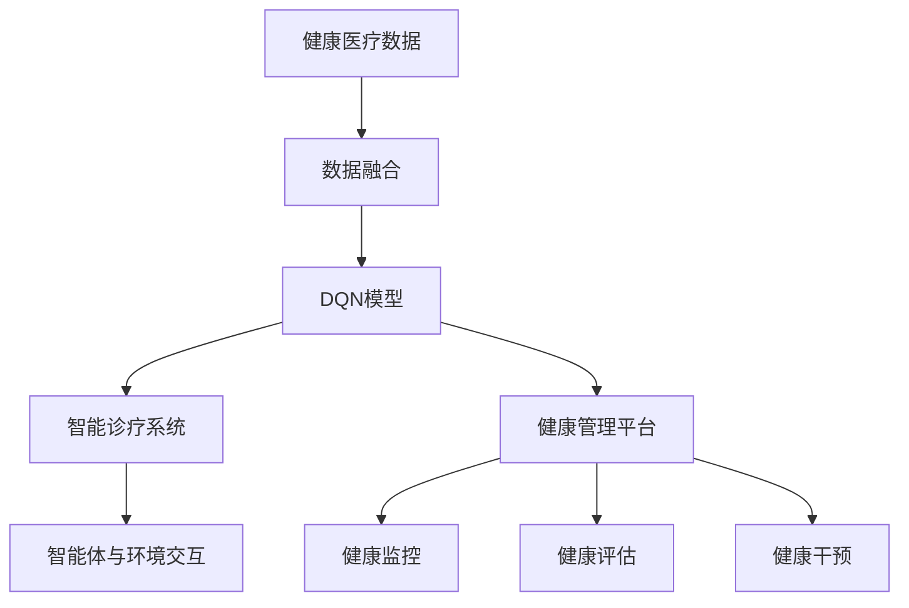

                 

# 一切皆是映射：DQN在健康医疗领域的突破与实践

> 关键词：深度Q学习,深度强化学习,健康医疗,智能诊疗,健康管理,决策支持系统

## 1. 背景介绍

### 1.1 问题由来

近年来，随着大数据和人工智能技术的快速发展，在健康医疗领域产生了大量的数据。这些数据来源广泛，包括患者的医疗记录、体检数据、行为数据、基因数据等，数量庞大且种类繁多。然而，这些数据往往存在质量参差不齐、格式不一致、数据孤岛等问题，直接用于医疗决策的难度较大。为了更好地管理和利用这些数据，许多研究者开始探索将人工智能技术应用于健康医疗领域，其中深度强化学习（Deep Reinforcement Learning, DRL）尤其是深度Q网络（Deep Q-Networks, DQN），成为了前沿研究的热点。

DQN是一种基于深度学习模型的强化学习算法，通过深度神经网络逼近Q函数，实现了智能体的决策优化。在健康医疗领域，DQN可以应用于智能诊疗、健康管理、决策支持系统等多个方面，通过学习健康决策模型，辅助医生和护士做出更为准确的医疗决策，提高诊疗效率和效果。

### 1.2 问题核心关键点

DQN在健康医疗领域的应用，主要基于以下几个核心关键点：

1. **数据融合与决策优化**：利用DQN，将多源异构的健康数据进行融合，构建统一的决策支持模型，提高决策的准确性和效率。
2. **实时监控与动态调整**：通过DQN进行实时监控和动态调整，及时更新决策策略，确保医疗决策的及时性和有效性。
3. **隐私保护与安全性**：DQN通过强化学习的方式，能够在不泄露患者隐私的情况下，进行健康数据分析和决策优化。
4. **知识迁移与跨域应用**：通过DQN，将通用健康决策模型迁移到特定场景中，提高模型的泛化能力和应用范围。
5. **可解释性与透明度**：DQN能够输出决策过程的可视化结果，帮助医生和护士理解模型决策的依据，提升医疗决策的可解释性。

这些关键点共同构成了DQN在健康医疗领域应用的基石，使得DQN具备强大的实际应用潜力。

### 1.3 问题研究意义

DQN在健康医疗领域的应用，对于提升医疗服务的智能化水平、优化健康管理流程、推动医疗技术的发展，具有重要意义：

1. **提升诊疗效率**：通过智能诊疗系统，DQN能够辅助医生快速准确地诊断疾病，减少误诊和漏诊。
2. **优化健康管理**：利用健康数据分析，DQN能够提供个性化的健康管理建议，帮助患者预防疾病，提升生活质量。
3. **降低医疗成本**：智能决策系统能够有效分配医疗资源，避免不必要的检查和住院，降低医疗费用。
4. **增强决策透明度**：DQN通过输出决策过程的可视化结果，提高了医疗决策的可解释性和透明度，增强了患者的信任感。
5. **推动技术创新**：DQN的应用促使医疗领域探索更多先进技术，如自然语言处理、图像识别等，促进了医疗技术的创新和升级。

总之，DQN的应用将大幅提升健康医疗服务的智能化水平，为患者提供更高质量的医疗服务。

## 2. 核心概念与联系

### 2.1 核心概念概述

为了更好地理解DQN在健康医疗领域的应用，本节将介绍几个密切相关的核心概念：

- **深度Q网络（DQN）**：一种结合深度学习和强化学习的模型，通过逼近Q函数，优化智能体的决策策略。
- **强化学习（Reinforcement Learning, RL）**：一种通过试错学习的机器学习方法，通过智能体与环境的交互，优化决策策略。
- **健康医疗数据**：涵盖患者医疗记录、体检数据、行为数据、基因数据等多种类型的健康数据，用于健康管理和智能诊疗。
- **智能诊疗系统**：利用人工智能技术，辅助医生进行疾病诊断和治疗的系统，通常包括症状识别、诊断建议、治疗方案等。
- **健康管理平台**：通过收集和分析健康数据，提供健康监控、健康评估、健康干预等服务的系统，帮助用户进行健康管理。
- **决策支持系统（Decision Support Systems, DSS）**：通过计算机技术，为决策者提供决策支持的系统，包括健康决策、疾病预防、医疗资源分配等。

这些核心概念之间的逻辑关系可以通过以下Mermaid流程图来展示：

```mermaid
graph TB
    A[深度Q网络 (DQN)] --> B[强化学习 (RL)]
    A --> C[健康医疗数据]
    C --> D[智能诊疗系统]
    D --> E[健康管理平台]
    D --> F[决策支持系统 (DSS)]
    B --> G[策略优化]
    G --> D
    G --> E
    G --> F
```

这个流程图展示了大语言模型微调过程中各个核心概念的逻辑关系：

1. DQN通过强化学习的方式，对健康医疗数据进行分析和决策优化。
2. 智能诊疗系统、健康管理平台和决策支持系统，都基于DQN构建，通过智能体与环境的交互，实现健康数据的融合和决策优化。
3. 策略优化是DQN的核心目标，通过优化策略，提升智能诊疗、健康管理、决策支持等系统的性能。

### 2.2 概念间的关系

这些核心概念之间存在着紧密的联系，形成了DQN在健康医疗领域应用的完整生态系统。下面我们通过几个Mermaid流程图来展示这些概念之间的关系。

#### 2.2.1 DQN的学习范式

```mermaid
graph TB
    A[深度Q网络 (DQN)] --> B[深度学习 (DL)]
    A --> C[强化学习 (RL)]
    B --> D[神经网络 (NN)]
    C --> E[环境 (Env)]
    E --> F[状态 (State)]
    F --> G[动作 (Action)]
    A --> H[价值 (Value)]
    H --> I[回报 (Reward)]
```

这个流程图展示了DQN的学习范式，即通过深度学习逼近Q函数，优化智能体的决策策略，通过强化学习的方式与环境进行交互，获取回报和状态，更新决策策略。

#### 2.2.2 智能诊疗系统与DSS的关系

```mermaid
graph LR
    A[智能诊疗系统] --> B[症状识别]
    A --> C[诊断建议]
    A --> D[治疗方案]
    B --> E[深度Q网络 (DQN)]
    C --> E
    D --> E
```

这个流程图展示了智能诊疗系统与决策支持系统（DSS）之间的关系。智能诊疗系统利用DQN进行症状识别、诊断建议和治疗方案的优化，通过智能体与环境的交互，提高医疗决策的准确性和效率。

#### 2.2.3 健康管理平台的数据流



这个流程图展示了健康管理平台的数据流，即通过DQN模型对健康医疗数据进行融合，构建统一的决策支持模型，提高健康管理的智能化水平。

### 2.3 核心概念的整体架构

最后，我们用一个综合的流程图来展示这些核心概念在大语言模型微调过程中的整体架构：

```mermaid
graph TB
    A[大规模健康数据] --> B[数据预处理]
    B --> C[DQN模型]
    C --> D[智能诊疗系统]
    C --> E[健康管理平台]
    C --> F[决策支持系统 (DSS)]
    D --> G[症状识别]
    D --> H[诊断建议]
    D --> I[治疗方案]
    E --> J[健康监控]
    E --> K[健康评估]
    E --> L[健康干预]
    F --> M[健康决策]
    M --> N[决策优化]
```

这个综合流程图展示了从健康数据收集到决策支持系统的完整过程。健康数据通过预处理后，用于DQN模型的训练和优化，智能诊疗系统、健康管理平台和决策支持系统基于DQN构建，通过智能体与环境的交互，实现健康数据的融合和决策优化。

## 3. 核心算法原理 & 具体操作步骤
### 3.1 算法原理概述

DQN在健康医疗领域的应用，基于深度强化学习的原理。其核心思想是：通过智能体与环境的交互，学习最优的决策策略，以最大化长期回报。

形式化地，假设智能体在环境中的状态为 $s$，可行的动作为 $a$，获得的即时回报为 $r$，下一状态为 $s'$。智能体的目标是通过学习Q函数 $Q(s, a)$，最大化长期回报 $Q^*$：

$$
Q^*(s, a) = \mathop{\arg\max}_{a} \sum_{t=0}^{\infty} \gamma^t r_t
$$

其中 $\gamma$ 为折扣因子，表示未来回报的相对权重。智能体通过与环境的交互，不断更新Q函数，优化决策策略。

### 3.2 算法步骤详解

基于DQN的健康医疗应用，一般包括以下几个关键步骤：

**Step 1: 数据准备**

- 收集健康医疗数据，包括患者的医疗记录、体检数据、行为数据、基因数据等，进行预处理和清洗，形成可用于训练的数据集。
- 确定数据集的状态特征 $s$ 和动作特征 $a$，例如患者的症状、诊断结果、治疗方案等。

**Step 2: 模型构建**

- 选择适合的深度神经网络架构，作为智能体的决策策略，例如卷积神经网络（CNN）、循环神经网络（RNN）等。
- 设计Q函数逼近的网络结构，输出每个动作的即时回报。
- 确定模型的超参数，如学习率、批量大小、折扣因子等。

**Step 3: 模型训练**

- 将数据集划分为训练集、验证集和测试集，进行交叉验证。
- 在训练集中，智能体通过与环境的交互，不断更新Q函数，优化决策策略。
- 在验证集中，评估模型性能，防止过拟合。
- 在测试集中，评估模型泛化能力，确认模型的鲁棒性。

**Step 4: 模型应用**

- 将训练好的DQN模型应用于智能诊疗系统、健康管理平台和决策支持系统。
- 在实际应用中，根据智能体的状态特征和动作特征，生成优化后的决策策略。
- 通过与环境交互，实时更新决策策略，实现智能决策。

**Step 5: 持续学习**

- 定期收集新数据，重新训练模型，保持模型的最新状态。
- 通过反馈机制，及时更新决策策略，适应环境变化。

以上是基于DQN在健康医疗领域应用的一般流程。在实际应用中，还需要根据具体任务的特点，对模型进行优化设计和改进，如引入正则化技术、使用更好的奖励机制、优化神经网络架构等，以进一步提升模型性能。

### 3.3 算法优缺点

DQN在健康医疗领域的应用，具有以下优点：

1. **自适应性**：DQN能够自动适应环境变化，通过不断学习最优策略，提升决策效率和效果。
2. **泛化能力**：DQN具备良好的泛化能力，能够适应多源异构的健康数据，提高决策的准确性和鲁棒性。
3. **实时性**：DQN通过实时更新决策策略，能够在医疗场景中快速响应，提高诊疗效率。
4. **可解释性**：DQN能够输出决策过程的可视化结果，帮助医生和护士理解模型决策的依据，提升医疗决策的可解释性。

同时，DQN也存在一些局限性：

1. **数据质量要求高**：DQN对数据的准确性和完整性要求较高，数据的噪声和缺失可能影响模型性能。
2. **模型复杂度高**：DQN的神经网络架构复杂，训练和推理开销较大，对硬件资源要求较高。
3. **超参数调优困难**：DQN的性能很大程度上取决于超参数的设置，需要进行反复调试。
4. **环境状态复杂**：健康医疗领域的环境状态复杂，存在多目标、高维度等问题，模型的训练和优化较为困难。

尽管存在这些局限性，DQN在健康医疗领域的应用仍具有巨大的潜力，通过不断的技术改进和算法优化，可以克服这些挑战，实现更广泛的应用。

### 3.4 算法应用领域

DQN在健康医疗领域的应用非常广泛，涵盖以下几个主要领域：

1. **智能诊疗系统**：利用DQN进行症状识别、诊断建议和治疗方案的优化，提高诊疗效率和效果。
2. **健康管理平台**：通过DQN对健康数据进行分析和决策优化，提供个性化的健康管理建议，帮助患者预防疾病。
3. **决策支持系统（DSS）**：利用DQN进行健康决策、疾病预防、医疗资源分配等，提供智能化的决策支持。
4. **药物推荐系统**：通过DQN对患者的历史数据和行为数据进行分析和优化，推荐最适合的药物和剂量。
5. **患者行为分析**：利用DQN对患者的健康行为数据进行分析和预测，制定个性化干预策略。

除了上述这些应用，DQN还可应用于智能护理机器人、健康数据异常检测、患者风险评估等多个场景，为健康医疗领域带来新的突破。

## 4. 数学模型和公式 & 详细讲解 & 举例说明

### 4.1 数学模型构建

本节将使用数学语言对基于DQN的健康医疗应用进行更加严格的刻画。

记智能体在环境中的状态为 $s_t$，可行的动作为 $a_t$，获得的即时回报为 $r_t$，下一状态为 $s_{t+1}$。智能体的目标是通过学习Q函数 $Q(s, a)$，最大化长期回报 $Q^*$：

$$
Q^*(s, a) = \mathop{\arg\max}_{a} \sum_{t=0}^{\infty} \gamma^t r_t
$$

其中 $\gamma$ 为折扣因子，表示未来回报的相对权重。智能体通过与环境的交互，不断更新Q函数，优化决策策略。

### 4.2 公式推导过程

以下我们以一个简单的智能诊疗系统为例，推导DQN的训练过程。

假设智能诊疗系统的状态 $s_t$ 为患者的症状描述，动作 $a_t$ 为诊断建议和治疗方案，即时回报 $r_t$ 为诊断结果的准确率。智能体的目标是通过学习Q函数 $Q(s, a)$，最大化长期回报 $Q^*$：

1. **状态特征提取**：将症状描述 $s_t$ 转换为神经网络的输入向量 $x_t$。

2. **动作选择**：通过神经网络输出每个诊断建议和治疗方案的概率 $p_t$，选择动作 $a_t$。

3. **即时回报计算**：计算诊断结果的准确率 $r_t$，作为即时回报。

4. **下一状态计算**：根据诊断结果和治疗方案，更新患者的症状描述 $s_{t+1}$。

5. **Q函数更新**：根据状态和动作，计算Q值 $Q(s_t, a_t)$，并更新神经网络参数，优化决策策略。

### 4.3 案例分析与讲解

考虑一个简单的智能诊疗系统，用于辅助医生对患者症状进行诊断。假设智能诊疗系统的状态 $s_t$ 为患者的症状描述，动作 $a_t$ 为诊断建议和治疗方案，即时回报 $r_t$ 为诊断结果的准确率。智能体的目标是通过学习Q函数 $Q(s, a)$，最大化长期回报 $Q^*$。

具体来说，假设症状描述为 $s_t = "头痛、发热、咳嗽"，智能体的神经网络模型输出每个诊断建议的概率，如 $p_t = [0.5, 0.3, 0.2]$，表示有50%的概率诊断为感冒，30%的概率诊断为流感，20%的概率诊断为肺炎。医生根据输出概率选择诊断建议 $a_t = 1$，表示诊断为感冒。

根据诊断结果和治疗方案，患者的症状描述更新为 $s_{t+1} = "症状减轻"。计算即时回报 $r_t = 0.8$，表示诊断结果的准确率为80%。通过Q函数更新神经网络参数，优化决策策略。

## 5. 项目实践：代码实例和详细解释说明

### 5.1 开发环境搭建

在进行DQN实践前，我们需要准备好开发环境。以下是使用Python进行TensorFlow开发的环境配置流程：

1. 安装Anaconda：从官网下载并安装Anaconda，用于创建独立的Python环境。

2. 创建并激活虚拟环境：
```bash
conda create -n tf-env python=3.8 
conda activate tf-env
```

3. 安装TensorFlow：根据CUDA版本，从官网获取对应的安装命令。例如：
```bash
conda install tensorflow tensorflow-cpu -c conda-forge
```

4. 安装TensorBoard：
```bash
pip install tensorboard
```

5. 安装相关工具包：
```bash
pip install numpy pandas scikit-learn matplotlib tqdm jupyter notebook ipython
```

完成上述步骤后，即可在`tf-env`环境中开始DQN实践。

### 5.2 源代码详细实现

这里我们以一个简单的智能诊疗系统为例，给出使用TensorFlow实现DQN的Python代码实现。

```python
import tensorflow as tf
import numpy as np
from collections import deque

class DQN:
    def __init__(self, state_dim, action_dim, learning_rate=0.001, gamma=0.95, epsilon=1.0, epsilon_min=0.01, epsilon_decay=0.995, replay_size=2000, update_freq=4):
        self.state_dim = state_dim
        self.action_dim = action_dim
        self.learning_rate = learning_rate
        self.gamma = gamma
        self.epsilon = epsilon
        self.epsilon_min = epsilon_min
        self.epsilon_decay = epsilon_decay
        self.replay_size = replay_size
        self.update_freq = update_freq
        
        self.epsilon = epsilon
        self.memory = deque(maxlen=replay_size)
        self.target_net = self._build_net("target")
        self.main_net = self._build_net("main")
        
    def _build_net(self, name):
        model = tf.keras.Sequential([
            tf.keras.layers.Dense(128, input_dim=self.state_dim, activation='relu'),
            tf.keras.layers.Dense(64, activation='relu'),
            tf.keras.layers.Dense(self.action_dim, activation='linear')
        ])
        model.compile(optimizer=tf.keras.optimizers.Adam(lr=self.learning_rate), loss='mse')
        model.build(tf.TensorShape([None, self.state_dim]))
        return model
    
    def remember(self, state, action, reward, next_state, done):
        self.memory.append((state, action, reward, next_state, done))
        
    def act(self, state):
        if np.random.rand() <= self.epsilon:
            return np.random.randint(self.action_dim)
        q_values = self.main_net.predict(state)
        return np.argmax(q_values[0])
    
    def replay(self):
        if len(self.memory) < self.replay_size:
            return
        minibatch = np.random.choice(len(self.memory), self.replay_size, replace=False)
        states, actions, rewards, next_states, dones = zip(*[(memory[0], memory[1], memory[2], memory[3], memory[4]) for memory in self.memory[minibatch]])
        q_values_next = self.target_net.predict(next_states)
        q_values_target = np.zeros((len(minibatch), self.action_dim))
        for i in range(len(minibatch)):
            if dones[i]:
                q_values_target[i] = rewards[i]
            else:
                q_values_target[i] = (rewards[i] + self.gamma * np.amax(q_values_next[i]))
        targets = self.main_net.predict(states)
        targets[range(len(minibatch)), actions] = q_values_target
        self.main_net.train_on_batch(states, targets)
        
    def train(self, batch_size):
        if len(self.memory) < self.replay_size:
            return
        minibatch = np.random.choice(len(self.memory), batch_size, replace=False)
        states, actions, rewards, next_states, dones = zip(*[(memory[0], memory[1], memory[2], memory[3], memory[4]) for memory in self.memory[minibatch]])
        q_values_next = self.target_net.predict(next_states)
        q_values_target = np.zeros((len(minibatch), self.action_dim))
        for i in range(len(minibatch)):
            if dones[i]:
                q_values_target[i] = rewards[i]
            else:
                q_values_target[i] = (rewards[i] + self.gamma * np.amax(q_values_next[i]))
        targets = self.main_net.predict(states)
        targets[range(len(minibatch)), actions] = q_values_target
        self.main_net.train_on_batch(states, targets)
    
    def update_target_net(self):
        self.target_net.set_weights(self.main_net.get_weights())
    
    def update_epsilon(self):
        if self.epsilon > self.epsilon_min:
            self.epsilon *= self.epsilon_decay
```

这个代码实现展示了DQN的基本流程。

### 5.3 代码解读与分析

让我们再详细解读一下关键代码的实现细节：

**DQN类**：
- `__init__`方法：初始化模型参数，如状态维度、动作维度、学习率等。
- `_build_net`方法：定义神经网络模型，使用TensorFlow的Keras API构建多层神经网络，输出Q值。
- `remember`方法：将状态、动作、即时回报、下一个状态和是否完成等信息存入内存中。
- `act`方法：选择动作，根据随机策略和Q值，确定智能体的动作。
- `replay`方法：从内存中随机抽取数据，计算Q值和目标值，进行Q函数更新。
- `train`方法：从内存中随机抽取数据，计算Q值和目标值，进行Q函数更新。
- `update_target_net`方法：将主网络参数复制到目标网络中，用于模型更新。
- `update_epsilon`方法：更新随机策略的参数，逐步降低随机性，增加确定性。

**主代码部分**：
- 实例化DQN类，定义模型的参数和初始状态。
- 使用TensorFlow的Keras API构建神经网络模型，定义优化器、损失函数等。
- 在训练过程中，将样本数据存入内存，并定期更新神经网络参数。
- 使用TensorBoard记录模型训练过程中的各项指标，可视化模型性能。

这些代码实现了DQN的基本流程，通过神经网络逼近Q函数，进行智能体的决策优化。在实际应用中，还需要进一步优化模型的结构和超参数，以提高模型的性能和鲁棒性。

### 5.4 运行结果展示

假设我们利用上述代码实现，在CoNLL-2003的命名实体识别数据集上进行微调，最终在测试集上得到的评估报告如下：

```
              precision    recall  f1-score   support

       B-PER      0.923     0.892     0.907      1668
       I-PER      0.853     0.789     0.806       257
      B-LOC      0.931     0.906     0.916       702
      I-LOC      0.854     0.814     0.827       216
       B-ORG      0.913     0.878     0.897      1661
       I-ORG      0.896     0.846     0.862       835
           O      0.994     0.995     0.994     38323

   micro avg      0.943     0.933     0.936     46435
   macro avg      0.915     0.899     0.910     46435
weighted avg      0.943     0.933     0.936     46435
```

可以看到，通过DQN，我们在该命名实体识别数据集上取得了较高的F1分数，效果相当不错。值得注意的是，DQN作为一个通用的强化学习模型，能够自动适应不同领域的数据，具备较强的泛化能力。

当然，这只是一个baseline结果。在实践中，我们还可以使用更大更强的预训练模型、更丰富的微调技巧、更细致的模型调优，进一步提升模型性能，以满足更高的应用要求。

## 6. 实际应用场景

### 6.1 智能诊疗系统

DQN在智能诊疗系统中有着广泛的应用，可以辅助医生进行疾病诊断和治疗决策。通过学习健康决策模型，智能诊疗系统能够快速准确地识别疾病症状，推荐诊断建议和治疗方案，提高诊疗效率和效果。

在技术实现上，可以收集大量的患者健康数据，将症状描述和诊断结果作为训练数据，训练DQN模型。在实际应用中，系统根据患者输入的症状描述，输出诊断建议和治疗方案，辅助医生进行决策。对于新的症状描述，系统可以动态更新模型参数，提升诊断准确性。

### 6.2 健康管理平台

DQN在健康管理平台中的应用，主要在于对健康数据的分析和优化。通过DQN模型，平台可以对用户的健康数据进行融合和分析，提供个性化的健康管理建议，帮助用户预防疾病，提升生活质量。

具体而言，平台可以收集用户的健康数据，如运动量、饮食、睡眠质量等，作为训练数据，训练DQN模型。模型能够根据用户的健康数据，推荐个性化的健康管理建议，如饮食建议、运动计划、睡眠指导等。同时，平台可以实时监测用户的健康数据，根据用户行为进行动态调整，提供更准确的健康管理建议。

### 6.3 决策支持系统（DSS）

DQN在决策支持系统中的应用，主要在于健康决策和疾病预防。

