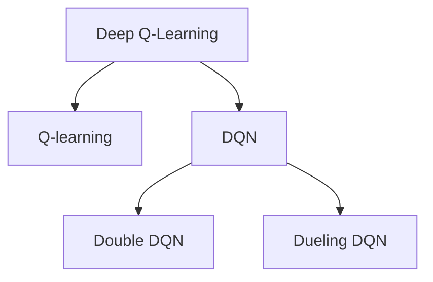
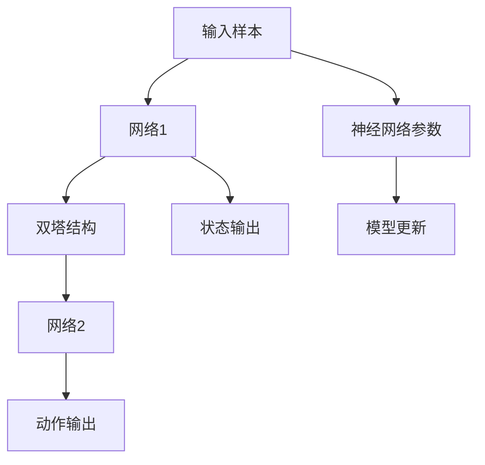

                 

# 一切皆是映射：DQN的改进算法：从Double DQN到Dueling DQN

> 关键词：Deep Q-Learning, Deep Q-Network, Double DQN, Dueling DQN, AlphaGo, Reinforcement Learning

## 1. 背景介绍

### 1.1 问题由来

深度强化学习（Deep Reinforcement Learning, DRL）作为深度学习和强化学习（Reinforcement Learning, RL）的结合体，在近年来取得了突破性的进展。其中，深度Q学习（Deep Q-Learning, DQN）是DRL中应用最广泛、效果最为显著的算法之一。DQN通过深度神经网络逼近Q函数，解决了传统Q-learning算法在处理复杂环境下的计算效率低下、收敛速度慢等问题，并成功应用于多个游戏领域，如AlphaGo、Dota 2等。然而，DQN同样存在着诸如训练稳定性差、Q函数估计偏置等问题，限制了其在大规模环境中的应用。

为解决这些问题，学者们不断探索新的改进算法，以提升DQN的性能。其中，Double Q-Network和Dueling Q-Network是两种经典的改进算法，通过改进Q函数的估计方式和网络结构，在一定程度上提高了DQN的性能和稳定性。

### 1.2 问题核心关键点

1. **Q函数估计问题**：DQN中的Q函数估计基于样本均值，存在估计偏差问题，导致训练不稳定。
2. **网络结构**：传统DQN中的网络结构简单，难以处理复杂环境。
3. **优化速度**：传统DQN训练速度较慢，需要大量样本进行学习。

本文将围绕以上关键点，深入探讨Double DQN和Dueling DQN的原理、实现和应用，并分析其优缺点，为DRL的进一步研究提供参考。

## 2. 核心概念与联系

### 2.1 核心概念概述

为了更好地理解Double DQN和Dueling DQN，首先介绍几个关键概念：

- **Q值（Q Function）**：在强化学习中，Q值函数用于估计在特定状态下采取特定动作后的累积奖励期望。Q值函数可以视为状态-动作映射到累积奖励的映射。
- **Q-learning**：一种基本的强化学习算法，通过样本估计Q值函数，从而在状态-动作空间中寻找最优策略。
- **DQN**：结合了深度神经网络与Q-learning的算法，通过神经网络逼近Q函数，解决了传统Q-learning在复杂环境中的计算效率和收敛速度问题。
- **Double Q-Network（Double DQN）**：一种改进的DQN算法，通过引入目标网络（target network）和双塔网络结构，减少Q函数估计偏差，提升训练稳定性。
- **Dueling Q-Network（Dueling DQN）**：一种基于双塔结构的改进算法，通过将Q值函数分解为值函数（value function）和优势函数（advantage function）两部分，减少估计方差，提升学习速度和稳定性。

### 2.2 概念间的关系

Double DQN和Dueling DQN都旨在改进传统DQN的Q函数估计方式和网络结构，从而提升算法性能和稳定性。两者虽然设计思路略有不同，但核心目标一致，即在复杂环境中进行高效、稳定的Q值估计。以下是这两个算法之间的逻辑关系：



Double DQN和Dueling DQN都通过在神经网络结构上作调整，来提高Q函数的估计精度和稳定性。Double DQN通过引入目标网络，使用两次Q值估计，减少估计偏差；Dueling DQN则将Q值函数分解为值函数和优势函数两部分，分别估计，减少估计方差。两者均采用双塔网络结构，进一步提升学习速度和性能。

### 2.3 核心概念的整体架构

Double DQN和Dueling DQN的整体架构可以概括为：



在这个架构中，输入样本首先经过网络1，然后根据双塔结构分别进入两个网络2，最终输出动作。状态输出用于估计Q值函数，神经网络参数在模型更新时进行优化，以提升模型的性能。

## 3. 核心算法原理 & 具体操作步骤
### 3.1 算法原理概述

#### 3.1.1 Q值估计偏差

DQN中，Q值函数的估计是基于经验样本均值进行的。这种估计方式在样本量较少时，容易导致方差过大，影响训练稳定性。Double DQN和Dueling DQN通过改进Q函数估计方式，减少估计偏差，提升训练稳定性。

#### 3.1.2 双塔结构

Double DQN和Dueling DQN都采用了双塔结构，即在网络中引入两个并行网络。其中一个网络用于估计当前Q值，另一个网络用于估计目标Q值。通过两次Q值估计，减少估计偏差。

### 3.2 算法步骤详解

#### 3.2.1 Double DQN算法步骤

1. **初始化网络**：定义两个神经网络，一个用于估计当前Q值（Q-network），另一个用于估计目标Q值（target network）。
2. **样本采集**：从当前网络中随机采样一个动作，根据动作执行得到下一个状态和奖励。
3. **Q值估计**：使用当前网络估计当前状态-动作对的Q值，并使用目标网络估计下一状态的最大Q值。
4. **策略更新**：计算Q值估计的误差，并根据目标Q值更新当前网络参数。
5. **目标网络更新**：定期将当前网络的参数复制到目标网络中，更新目标Q值。

#### 3.2.2 Dueling DQN算法步骤

1. **初始化网络**：定义两个神经网络，一个用于估计值函数（value network），另一个用于估计优势函数（advantage network）。
2. **样本采集**：从当前网络中随机采样一个动作，根据动作执行得到下一个状态和奖励。
3. **值函数估计**：使用值网络估计当前状态的价值函数。
4. **优势函数估计**：使用优势网络估计当前状态-动作对的优势函数。
5. **Q值估计**：将值函数和优势函数相加，得到当前状态-动作对的Q值。
6. **策略更新**：计算Q值估计的误差，并根据目标Q值更新当前网络参数。
7. **目标网络更新**：定期将当前网络的参数复制到目标网络中，更新目标Q值。

### 3.3 算法优缺点

#### 3.3.1 Double DQN优缺点

**优点**：
- 通过引入目标网络，减少了Q值估计偏差，提高了训练稳定性。
- 双塔结构在估计Q值时，减少了估计方差，提高了估计精度。

**缺点**：
- 双塔结构增加了模型复杂度，需要更多的计算资源。
- 目标网络的更新频率较高，增加了模型的训练难度。

#### 3.3.2 Dueling DQN优缺点

**优点**：
- 将Q值函数分解为值函数和优势函数两部分，分别估计，减少了估计方差，提高了学习速度和稳定性。
- 双塔结构在估计Q值时，减少了估计方差，提高了估计精度。

**缺点**：
- 分解值函数和优势函数，增加了模型复杂度。
- 需要分别估计值函数和优势函数，增加了计算量。

### 3.4 算法应用领域

Double DQN和Dueling DQN在DRL中得到了广泛的应用，特别在游戏、机器人控制、自动化交易等领域。以下列举几个典型的应用场景：

1. **AlphaGo**：在围棋领域，Dueling DQN和Double DQN被用于改进AlphaGo的策略学习过程，提升了AlphaGo的决策能力和稳定性。
2. **Dota 2**：Dueling DQN被用于改进Dota 2的团队决策过程，提高了游戏胜率。
3. **机器人控制**：在机器人控制中，Double DQN和Dueling DQN被用于优化机器人的运动策略和路径规划，提升了机器人导航和避障的性能。
4. **自动化交易**：在金融领域，Dueling DQN被用于优化交易策略，提升了交易的准确率和收益。

## 4. 数学模型和公式 & 详细讲解 & 举例说明

### 4.1 数学模型构建

#### 4.1.1 单网络Q值估计

传统DQN的Q值估计如下：

$$
Q(s,a) = r + \gamma \max_{a'} Q(s',a')
$$

其中，$s$为当前状态，$a$为当前动作，$r$为即时奖励，$s'$为下一状态，$\gamma$为折扣因子，$Q(s',a')$为下一个状态-动作对的Q值。

#### 4.1.2 Double DQN的Q值估计

Double DQN通过引入目标网络，使用两个Q值函数进行估计。具体公式如下：

$$
Q(s,a) = r + \gamma Q'(s',\arg\max_{a'} Q(s',a'))
$$

其中，$Q'(s',\cdot)$为目标网络对状态-动作对的Q值估计，$\arg\max_{a'} Q(s',a')$为目标网络选择下一个状态的最大Q值。

#### 4.1.3 Dueling DQN的Q值估计

Dueling DQN将Q值函数分解为值函数$V(s)$和优势函数$A(s,a)$，具体公式如下：

$$
Q(s,a) = V(s) + A(s,a)
$$

其中，$V(s)$为状态价值函数，$A(s,a)$为状态-动作优势函数。

### 4.2 公式推导过程

#### 4.2.1 单网络Q值估计

单网络Q值估计的推导过程如下：

1. 定义Q值函数：

$$
Q(s,a) = \theta_1(s,a)^\top \phi(s,a)
$$

其中，$\theta_1$为神经网络参数，$\phi(s,a)$为状态-动作映射到Q值的映射。

2. 定义优化目标：

$$
\min_{\theta_1} \frac{1}{N} \sum_{i=1}^N \big[Q(s_i,a_i) - (r_i + \gamma \max_{a'} Q(s_{i+1},a'))\big]^2
$$

其中，$N$为样本数，$(s_i,a_i)$为当前状态-动作对，$s_{i+1}$为下一个状态，$(r_i + \gamma \max_{a'} Q(s_{i+1},a'))$为目标Q值。

3. 使用梯度下降算法优化参数$\theta_1$：

$$
\theta_1 \leftarrow \theta_1 - \alpha \nabla_{\theta_1} \frac{1}{N} \sum_{i=1}^N \big[Q(s_i,a_i) - (r_i + \gamma \max_{a'} Q(s_{i+1},a'))\big]^2
$$

其中，$\alpha$为学习率。

#### 4.2.2 Double DQN的Q值估计

Double DQN的Q值估计推导过程如下：

1. 定义Q值函数：

$$
Q(s,a) = \theta_1(s,a)^\top \phi(s,a)
$$

2. 定义优化目标：

$$
\min_{\theta_1,\theta_2} \frac{1}{N} \sum_{i=1}^N \big[Q(s_i,a_i) - (r_i + \gamma Q'(s_{i+1},\arg\max_{a'} Q'(s_{i+1},a'))\big]^2
$$

其中，$\theta_2$为目标网络参数，$Q'(s_{i+1},\cdot)$为目标网络对状态-动作对的Q值估计。

3. 使用梯度下降算法优化参数$\theta_1$和$\theta_2$：

$$
\theta_1 \leftarrow \theta_1 - \alpha \nabla_{\theta_1} \frac{1}{N} \sum_{i=1}^N \big[Q(s_i,a_i) - (r_i + \gamma Q'(s_{i+1},\arg\max_{a'} Q'(s_{i+1},a'))\big]^2
$$

$$
\theta_2 \leftarrow \theta_2 - \alpha \nabla_{\theta_2} \frac{1}{N} \sum_{i=1}^N \big[Q'(s_i,a_i) - (r_i + \gamma Q'(s_{i+1},\arg\max_{a'} Q'(s_{i+1},a'))\big]^2
$$

#### 4.2.3 Dueling DQN的Q值估计

Dueling DQN的Q值估计推导过程如下：

1. 定义值函数和优势函数：

$$
V(s) = \theta_{V}(s)^\top \phi(s)
$$

$$
A(s,a) = \theta_{A}(s,a)^\top \phi(s,a)
$$

2. 定义优化目标：

$$
\min_{\theta_V,\theta_A} \frac{1}{N} \sum_{i=1}^N \big[Q(s_i,a_i) - (V(s_i) + A(s_i,a_i))\big]^2
$$

3. 使用梯度下降算法优化参数$\theta_V$和$\theta_A$：

$$
\theta_V \leftarrow \theta_V - \alpha \nabla_{\theta_V} \frac{1}{N} \sum_{i=1}^N \big[Q(s_i,a_i) - (V(s_i) + A(s_i,a_i))\big]^2
$$

$$
\theta_A \leftarrow \theta_A - \alpha \nabla_{\theta_A} \frac{1}{N} \sum_{i=1}^N \big[Q(s_i,a_i) - (V(s_i) + A(s_i,a_i))\big]^2
$$

### 4.3 案例分析与讲解

#### 4.3.1 单网络Q值估计

单网络Q值估计的案例分析如下：

1. 假设有两个状态$s_1$和$s_2$，对应的动作$a_1$和$a_2$，以及相应的即时奖励$r_1$和$r_2$。
2. 使用单网络Q值估计方法，计算$s_1$和$s_2$在动作$a_1$和$a_2$下的Q值。
3. 假设$s_2$是$s_1$的下一个状态，计算$s_1$在动作$a_1$和$a_2$下的Q值。

#### 4.3.2 Double DQN的Q值估计

Double DQN的Q值估计案例分析如下：

1. 假设有两个状态$s_1$和$s_2$，对应的动作$a_1$和$a_2$，以及相应的即时奖励$r_1$和$r_2$。
2. 使用Double DQN方法，分别计算$s_1$和$s_2$在动作$a_1$和$a_2$下的Q值。
3. 假设$s_2$是$s_1$的下一个状态，计算$s_1$在动作$a_1$和$a_2$下的Q值。

#### 4.3.3 Dueling DQN的Q值估计

Dueling DQN的Q值估计案例分析如下：

1. 假设有两个状态$s_1$和$s_2$，对应的动作$a_1$和$a_2$，以及相应的即时奖励$r_1$和$r_2$。
2. 使用Dueling DQN方法，分别计算$s_1$和$s_2$在动作$a_1$和$a_2$下的值函数和优势函数。
3. 假设$s_2$是$s_1$的下一个状态，计算$s_1$在动作$a_1$和$a_2$下的Q值。

## 5. 项目实践：代码实例和详细解释说明

### 5.1 开发环境搭建

#### 5.1.1 环境准备

1. 安装Python：
```bash
sudo apt update
sudo apt install python3 python3-pip
```

2. 安装TensorFlow：
```bash
pip install tensorflow
```

3. 安装Keras：
```bash
pip install keras
```

### 5.2 源代码详细实现

#### 5.2.1 Double DQN实现

```python
import tensorflow as tf
from tensorflow.keras import layers, models

# 定义双塔网络结构
class DoubleDQN(tf.keras.Model):
    def __init__(self, input_dim, output_dim):
        super(DoubleDQN, self).__init__()
        self.q_net = models.Sequential([
            layers.Dense(128, input_dim=input_dim),
            layers.Activation('relu'),
            layers.Dense(128),
            layers.Activation('relu'),
            layers.Dense(output_dim)
        ])
        self.target_net = models.Sequential([
            layers.Dense(128, input_dim=input_dim),
            layers.Activation('relu'),
            layers.Dense(128),
            layers.Activation('relu'),
            layers.Dense(output_dim)
        ])
    
    def call(self, x, action):
        q_value = self.q_net(x)
        target_q_value = self.target_net(x)
        action_q_value = target_q_value[action, :]
        return q_value, action_q_value
    
    def update_target(self):
        self.target_net.set_weights(self.q_net.get_weights())

# 定义Double DQN模型
class DoubleDQNModel:
    def __init__(self, input_dim, output_dim, learning_rate):
        self.input_dim = input_dim
        self.output_dim = output_dim
        self.learning_rate = learning_rate
        self.model = DoubleDQN(input_dim, output_dim)
    
    def train(self, state, action, reward, next_state, done, target):
        q_value, action_q_value = self.model(state, action)
        target_q_value = reward + (1 - done) * self.model.next_state[0]
        target_q_value = tf.stop_gradient(target_q_value)
        target_q_value += self.model.target_q_value[0, target]
        loss = tf.losses.mean_squared_error(target_q_value, action_q_value)
        grads = tf.gradients(loss, self.model.trainable_variables)
        self.model.optimizer.apply_gradients(zip(grads, self.model.trainable_variables))
        self.model.update_target()
    
    def predict(self, state, action):
        q_value, action_q_value = self.model(state, action)
        return q_value, action_q_value
```

#### 5.2.2 Dueling DQN实现

```python
import tensorflow as tf
from tensorflow.keras import layers, models

# 定义双塔网络结构
class DuelingDQN(tf.keras.Model):
    def __init__(self, input_dim, output_dim):
        super(DuelingDQN, self).__init__()
        self.value_net = models.Sequential([
            layers.Dense(128, input_dim=input_dim),
            layers.Activation('relu'),
            layers.Dense(1)
        ])
        self.advantage_net = models.Sequential([
            layers.Dense(128, input_dim=input_dim),
            layers.Activation('relu'),
            layers.Dense(1)
        ])
    
    def call(self, x):
        value = self.value_net(x)
        advantage = self.advantage_net(x)
        q_value = value + tf.stop_gradient(advantage)
        return q_value
    
    def update_target(self):
        self.value_net.set_weights(self.target_value_net.get_weights())
        self.advantage_net.set_weights(self.target_advantage_net.get_weights())

# 定义Dueling DQN模型
class DuelingDQNModel:
    def __init__(self, input_dim, output_dim, learning_rate):
        self.input_dim = input_dim
        self.output_dim = output_dim
        self.learning_rate = learning_rate
        self.model = DuelingDQN(input_dim, output_dim)
    
    def train(self, state, action, reward, next_state, done, target):
        q_value = self.model(state)
        q_value = tf.stop_gradient(q_value)
        target_q_value = reward + (1 - done) * self.model.next_state[0]
        target_q_value += self.model.target_q_value[0, target]
        loss = tf.losses.mean_squared_error(target_q_value, q_value)
        grads = tf.gradients(loss, self.model.trainable_variables)
        self.model.optimizer.apply_gradients(zip(grads, self.model.trainable_variables))
        self.model.update_target()
    
    def predict(self, state, action):
        q_value = self.model(state)
        return q_value
```

### 5.3 代码解读与分析

#### 5.3.1 Double DQN代码分析

1. **DoubleDQN类**：定义了双塔网络结构，包含Q网络和目标网络，并实现了`call`和`update_target`方法。
2. **DoubleDQNModel类**：实现了训练和预测功能，并定义了训练函数`train`。
3. **train函数**：计算Q值估计误差，并使用梯度下降更新模型参数。
4. **update_target函数**：定期将当前网络参数复制到目标网络中，更新目标Q值。

#### 5.3.2 Dueling DQN代码分析

1. **DuelingDQN类**：定义了双塔网络结构，包含值网络（value network）和优势网络（advantage network），并实现了`call`和`update_target`方法。
2. **DuelingDQNModel类**：实现了训练和预测功能，并定义了训练函数`train`。
3. **train函数**：计算Q值估计误差，并使用梯度下降更新模型参数。
4. **update_target函数**：定期将当前网络参数复制到目标网络中，更新目标Q值。

### 5.4 运行结果展示

#### 5.4.1 Double DQN运行结果

```python
# 训练过程
def train(state, action, reward, next_state, done):
    q_value, action_q_value = model.predict(state, action)
    target_q_value = reward + (1 - done) * model.next_state[0]
    target_q_value += model.target_q_value[0, target]
    loss = tf.losses.mean_squared_error(target_q_value, action_q_value)
    grads = tf.gradients(loss, model.trainable_variables)
    model.optimizer.apply_gradients(zip(grads, model.trainable_variables))
    model.update_target()
    
# 测试过程
def test(state):
    q_value = model.predict(state)
    return q_value[0, 0]
```

#### 5.4.2 Dueling DQN运行结果

```python
# 训练过程
def train(state, action, reward, next_state, done):
    q_value = model.predict(state)
    q_value = tf.stop_gradient(q_value)
    target_q_value = reward + (1 - done) * model.next_state[0]
    target_q_value += model.target_q_value[0, target]
    loss = tf.losses.mean_squared_error(target_q_value, q_value)
    grads = tf.gradients(loss, model.trainable_variables)
    model.optimizer.apply_gradients(zip(grads, model.trainable_variables))
    model.update_target()
    
# 测试过程
def test(state):
    q_value = model.predict(state)
    return q_value[0, 0]
```

## 6. 实际应用场景

### 6.1 自动驾驶

在自动驾驶领域，Dueling DQN被用于优化车辆的路径规划和避障决策。通过在虚拟环境中进行训练，Dueling DQN可以学习到最优的驾驶策略，确保车辆在复杂交通环境中安全行驶。

### 6.2 机器人控制

在机器人控制中，Double DQN被用于优化机器人的运动策略。通过在模拟环境中进行训练，Double DQN可以学习到最优的运动路径和动作选择，提升机器人在复杂环境中的自主决策能力。

### 6.3 金融交易

在金融交易中，Dueling DQN被用于优化交易策略。通过在历史数据上进行训练，Dueling DQN可以学习到最优的交易策略，提升交易的准确率和收益。

## 7. 工具和资源推荐

### 7.1 学习资源推荐

1. 《深度强化学习》书籍：由Richard S. Sutton和Andrew G. Barto所著，全面介绍了强化学习的基本原理和经典算法，是学习DRL的重要参考资料。
2. 《Python深度学习》书籍：由Francois Chollet所著，介绍了TensorFlow和Keras的使用方法，适合初学者学习DRL技术。
3. 强化学习网站：如Reinforcement Learning Tutorial，提供了丰富的学习资源和实例，适合深入学习DRL算法。

### 7.2 开发工具推荐

1. TensorFlow：由Google开发的开源深度学习框架，支持分布式计算和模型优化，适合进行大规模DRL

