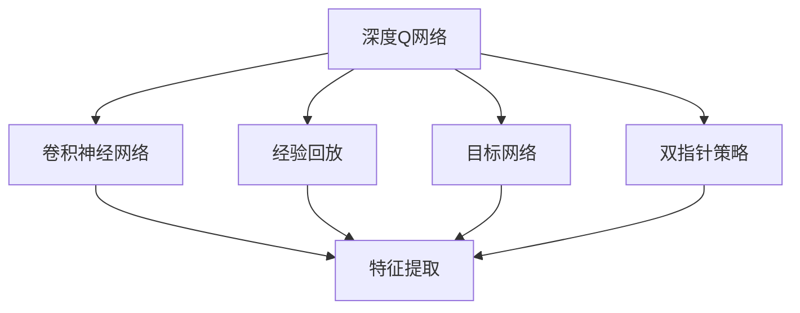
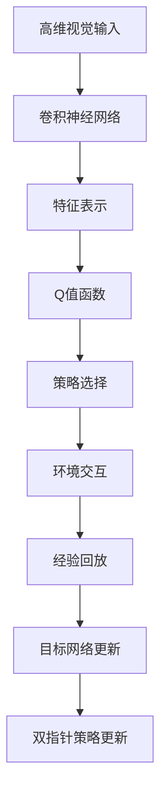
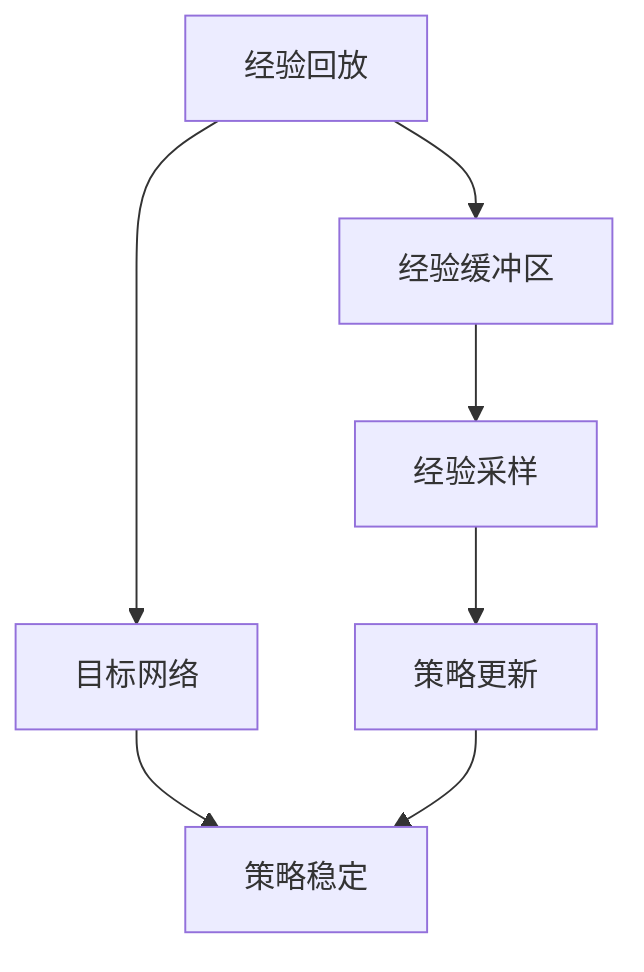
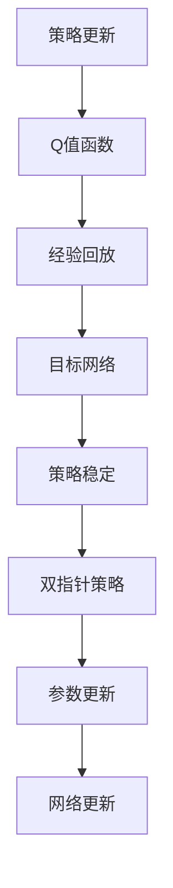
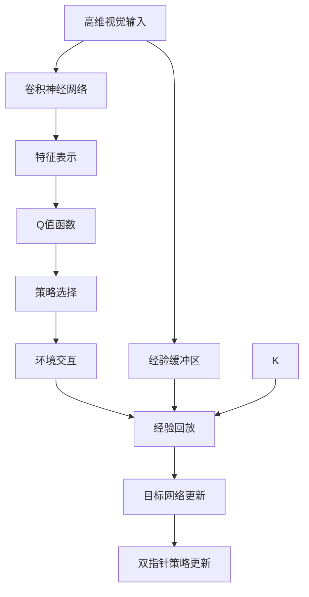

                 

# 一切皆是映射：使用DQN处理高维输入：视觉信息在强化学习的运用

## 1. 背景介绍

### 1.1 问题由来
在强化学习领域，处理高维输入是一个常见的挑战。尤其是当输入数据为视觉信息时，数据量庞大且形式复杂，传统的学习算法难以直接应对。然而，通过使用深度Q网络（Deep Q-Networks, DQN），我们可以有效地处理高维视觉输入，从而在强化学习任务中取得优异的表现。

DQN作为一种基于深度神经网络的强化学习算法，近年来在许多视觉任务上取得了突破性的成果。它通过使用卷积神经网络（Convolutional Neural Networks, CNNs）来处理视觉数据，结合Q-learning算法，在策略优化和状态估计方面都具有显著的优势。

### 1.2 问题核心关键点
DQN的核心思想是将Q-learning算法与深度神经网络相结合，利用神经网络对高维视觉输入进行特征提取，从而构建一个高效率的Q值函数。这种函数可以通过反向传播算法不断优化，使模型能够高效地学习到最优策略。

DQN的关键在于以下几个方面：
- 使用卷积神经网络进行特征提取
- 采用经验回放（Experience Replay）机制
- 使用目标网络（Target Network）进行策略稳定
- 使用双指针策略更新参数

这些核心技术使得DQN能够在高维视觉输入的处理上表现出色，进而应用于诸如视觉导航、机器人控制等复杂任务中。

### 1.3 问题研究意义
研究DQN在高维输入处理中的应用，对于拓展强化学习技术的应用边界，提升复杂视觉任务的性能，加速视觉AI技术的产业化进程，具有重要意义：

1. 降低任务复杂度。DQN将复杂的高维视觉输入转化为低维的Q值表示，简化了强化学习任务，使其易于处理。
2. 提高学习效率。通过使用深度神经网络，DQN能够快速高效地学习到最优策略，避免传统Q-learning的路径爆炸问题。
3. 泛化能力强。DQN具有良好的泛化能力，能够在多样化的视觉输入上取得优异的表现。
4. 可扩展性强。DQN不仅适用于视觉任务，还可拓展到其他模态的信息处理中，如文本、语音等。
5. 促进AI应用落地。DQN的成功应用为复杂视觉AI系统的发展提供了技术基础，加速了AI技术的商业化进程。

## 2. 核心概念与联系

### 2.1 核心概念概述

为更好地理解DQN在高维输入处理中的应用，本节将介绍几个密切相关的核心概念：

- 深度Q网络（Deep Q-Networks, DQN）：一种基于深度神经网络的强化学习算法，用于处理高维视觉输入。
- 卷积神经网络（Convolutional Neural Networks, CNNs）：一种用于处理视觉数据的神经网络结构，包括卷积层、池化层、全连接层等组件。
- 经验回放（Experience Replay）：一种数据增强技术，通过存储并随机抽样历史经验数据，减少方差和噪声，提升模型的泛化能力。
- 目标网络（Target Network）：一种双网络结构，用于稳定训练过程，避免过度拟合。
- 双指针策略（Two-Pointer Strategy）：一种参数更新策略，通过同时更新两个网络，使模型能够更平稳地收敛。

这些核心概念之间的逻辑关系可以通过以下Mermaid流程图来展示：



这个流程图展示了大语言模型的核心概念及其之间的关系：

1. DQN利用CNN对高维视觉输入进行特征提取。
2. 通过经验回放和目标网络机制，DQN进一步提升模型的泛化能力和训练稳定性。
3. 双指针策略使DQN能够更平稳地收敛，减少震荡和振幅。

### 2.2 概念间的关系

这些核心概念之间存在着紧密的联系，形成了DQN在高维输入处理中的完整生态系统。下面我通过几个Mermaid流程图来展示这些概念之间的关系。

#### 2.2.1 DQN的整体架构



这个流程图展示了DQN的整体架构，从输入到输出，再到策略更新和环境交互的完整流程。

#### 2.2.2 经验回放和目标网络机制



这个流程图展示了经验回放和目标网络机制在DQN中的作用，通过存储和随机抽样历史经验数据，以及使用目标网络进行策略稳定，提高模型的泛化能力和训练效率。

#### 2.2.3 双指针策略的更新



这个流程图展示了DQN中双指针策略的更新流程，通过同时更新两个网络，使模型能够更平稳地收敛，避免过度拟合。

### 2.3 核心概念的整体架构

最后，我们用一个综合的流程图来展示这些核心概念在DQN高维输入处理中的整体架构：



这个综合流程图展示了从输入到输出，再到策略更新和环境交互的完整流程，以及经验回放和目标网络机制的作用，强调了DQN在高维输入处理中的整体架构。

## 3. 核心算法原理 & 具体操作步骤
### 3.1 算法原理概述

DQN利用卷积神经网络对高维视觉输入进行特征提取，构建一个高效率的Q值函数。该函数通过最小化经验回放中的期望回报来优化策略选择，从而实现强化学习任务。

具体来说，DQN的算法原理可以概括为以下几个步骤：

1. 使用卷积神经网络对高维视觉输入进行特征提取，得到特征表示 $h_t$。
2. 根据当前状态 $s_t$ 和特征表示 $h_t$，计算Q值函数 $Q(h_t, a_t)$。
3. 选择动作 $a_t$ 使得 $Q(h_t, a_t)$ 最大化。
4. 在实际环境中执行动作 $a_t$，并观察得到下一个状态 $s_{t+1}$ 和即时回报 $r_{t+1}$。
5. 使用经验回放机制，将 $(s_t, a_t, r_{t+1}, s_{t+1})$ 存入经验缓冲区。
6. 使用目标网络 $Q_{\theta_{\tau}}$ 计算下一个状态的Q值 $Q_{\theta_{\tau}}(s_{t+1}, \hat{a}_{t+1})$，其中 $\hat{a}_{t+1}$ 为从目标网络中选择的最佳动作。
7. 根据蒙特卡洛方法或TD误差（Temporal Difference Error）计算目标Q值 $y_t = r_{t+1} + \gamma Q_{\theta_{\tau}}(s_{t+1}, \hat{a}_{t+1})$。
8. 更新原始网络 $Q_{\theta}$ 的参数，以最小化当前状态 $s_t$ 下的TD误差。

### 3.2 算法步骤详解

以下是DQN算法步骤的详细解释：

**Step 1: 准备输入数据**

- 收集高维视觉输入数据，如图片、视频等。
- 使用预处理技术，如归一化、标准化、裁剪等，对输入数据进行预处理。

**Step 2: 构建卷积神经网络**

- 选择合适的卷积神经网络架构，如LeNet、AlexNet、VGG等。
- 在网络中添加卷积层、池化层、批归一化层等组件，进行特征提取。
- 使用全连接层或线性回归层，将特征表示映射到Q值函数。

**Step 3: 初始化经验回放缓冲区**

- 创建一个经验回放缓冲区，用于存储历史经验数据。
- 将网络参数初始化，并选择学习率、批量大小等超参数。

**Step 4: 策略更新**

- 使用Q值函数 $Q_{\theta}$ 对当前状态 $s_t$ 进行Q值计算。
- 选择动作 $a_t$ 使得 $Q_{\theta}(s_t, a_t)$ 最大化。
- 执行动作 $a_t$，并观察得到下一个状态 $s_{t+1}$ 和即时回报 $r_{t+1}$。

**Step 5: 存储经验数据**

- 将 $(s_t, a_t, r_{t+1}, s_{t+1})$ 存入经验回放缓冲区。

**Step 6: 更新目标网络**

- 使用目标网络 $Q_{\theta_{\tau}}$ 计算下一个状态的Q值 $Q_{\theta_{\tau}}(s_{t+1}, \hat{a}_{t+1})$。
- 使用蒙特卡洛方法或TD误差计算目标Q值 $y_t = r_{t+1} + \gamma Q_{\theta_{\tau}}(s_{t+1}, \hat{a}_{t+1})$。

**Step 7: 更新原始网络**

- 使用梯度下降等优化算法，更新原始网络 $Q_{\theta}$ 的参数，以最小化TD误差。
- 根据双指针策略，使用原始网络 $Q_{\theta}$ 和目标网络 $Q_{\theta_{\tau}}$ 进行交替更新。

**Step 8: 执行策略**

- 重复执行步骤4-7，直至模型收敛或达到预设的迭代轮数。

### 3.3 算法优缺点

DQN作为一种高效的处理高维视觉输入的强化学习算法，具有以下优点：

1. 高效率：通过深度神经网络进行特征提取和Q值计算，能够高效处理高维视觉输入。
2. 泛化能力强：DQN通过经验回放和目标网络机制，能够减少方差和噪声，提升模型的泛化能力。
3. 鲁棒性好：DQN对环境噪声和状态变化具有较强的鲁棒性，能够应对复杂的多变环境。
4. 可扩展性强：DQN不仅适用于视觉任务，还可拓展到其他模态的信息处理中，如文本、语音等。

同时，DQN也存在一些局限性：

1. 需要大量标注数据：虽然DQN可以在一定程度上缓解对标注数据的需求，但训练过程中仍然需要大量的经验数据。
2. 模型复杂度高：DQN使用深度神经网络进行特征提取，模型复杂度高，对计算资源要求较高。
3. 目标网络更新频率：目标网络更新频率过高或过低都会影响模型的收敛速度和稳定性。
4. 过拟合问题：在复杂环境中，DQN可能会过度拟合，导致泛化能力下降。
5. 双指针策略优化：双指针策略需要精心调参，才能达到最优效果。

尽管存在这些局限性，DQN仍然是大规模视觉任务处理中不可或缺的算法。未来相关研究的重点在于如何进一步提高DQN的泛化能力、减少对标注数据的需求，并优化双指针策略，以提升模型的性能和稳定性。

### 3.4 算法应用领域

DQN作为一项强大的强化学习算法，在视觉信息处理领域得到了广泛的应用，涵盖以下典型任务：

1. 视觉导航：使用DQN训练智能机器人进行环境导航，如Pong游戏、Atari游戏等。
2. 机器人控制：利用DQN训练机器人执行复杂操作，如飞行器控制、机器人足球比赛等。
3. 图像分类：使用DQN进行图像分类任务，如CIFAR-10、ImageNet等数据集。
4. 目标检测：使用DQN训练目标检测器，如YOLO、Faster R-CNN等模型。
5. 动作生成：使用DQN生成高维动作序列，如玩电子游戏、自主驾驶等。

除了上述这些经典任务外，DQN还被创新性地应用到更多场景中，如无人驾驶、无人机控制、虚拟现实等，为视觉信息处理带来了全新的突破。随着预训练模型和DQN方法的不断进步，相信视觉信息处理技术将在更广阔的应用领域大放异彩。

## 4. 数学模型和公式 & 详细讲解 & 举例说明

### 4.1 数学模型构建

DQN利用卷积神经网络对高维视觉输入进行特征提取，构建一个高效率的Q值函数。形式化地，假设卷积神经网络提取的特征表示为 $h_t \in \mathbb{R}^d$，则Q值函数可以表示为：

$$
Q(h_t, a_t) = W^T h_t + b
$$

其中 $W$ 为Q值函数的权重矩阵，$b$ 为偏置项。在训练过程中，Q值函数 $Q_{\theta}$ 的参数 $\theta$ 通过反向传播算法不断优化。

### 4.2 公式推导过程

以下是DQN在强化学习中的核心公式推导：

**Step 4: 策略选择**

DQN选择动作 $a_t$ 使得 $Q_{\theta}(s_t, a_t)$ 最大化。具体公式如下：

$$
a_t = \mathop{\arg\max}_{a} Q_{\theta}(s_t, a)
$$

**Step 6: 目标Q值计算**

DQN使用蒙特卡洛方法或TD误差计算目标Q值 $y_t$：

$$
y_t = r_{t+1} + \gamma Q_{\theta_{\tau}}(s_{t+1}, \hat{a}_{t+1})
$$

其中 $\hat{a}_{t+1}$ 为从目标网络 $Q_{\theta_{\tau}}$ 中选择的最佳动作。

**Step 7: 更新原始网络**

DQN通过梯度下降等优化算法，更新原始网络 $Q_{\theta}$ 的参数，以最小化TD误差：

$$
\theta_{t+1} = \theta_{t} - \eta \nabla_{\theta} \left[Q_{\theta}(s_t, a_t) - (y_t - Q_{\theta}(s_t, a_t))\right]
$$

其中 $\eta$ 为学习率。

### 4.3 案例分析与讲解

下面我们以视觉导航任务为例，详细讲解DQN的具体应用。

假设我们训练一个DQN模型，使其能够在Pong游戏上进行智能导航。我们首先收集大量的游戏帧数据，并将其作为输入。接着，通过卷积神经网络进行特征提取，得到高维特征表示 $h_t \in \mathbb{R}^{d}$。然后，根据当前状态 $s_t$ 和特征表示 $h_t$，计算Q值函数 $Q_{\theta}(s_t, a_t)$。选择动作 $a_t$ 使得 $Q_{\theta}(s_t, a_t)$ 最大化，执行动作并观察得到下一个状态 $s_{t+1}$ 和即时回报 $r_{t+1}$。将 $(s_t, a_t, r_{t+1}, s_{t+1})$ 存入经验回放缓冲区。接着，使用目标网络 $Q_{\theta_{\tau}}$ 计算下一个状态的Q值 $Q_{\theta_{\tau}}(s_{t+1}, \hat{a}_{t+1})$。根据蒙特卡洛方法或TD误差计算目标Q值 $y_t$，并更新原始网络 $Q_{\theta}$ 的参数。重复上述步骤，直至模型收敛或达到预设的迭代轮数。

## 5. 项目实践：代码实例和详细解释说明

### 5.1 开发环境搭建

在进行DQN实践前，我们需要准备好开发环境。以下是使用Python进行TensorFlow和Keras开发的环境配置流程：

1. 安装Anaconda：从官网下载并安装Anaconda，用于创建独立的Python环境。

2. 创建并激活虚拟环境：
```bash
conda create -n tf-env python=3.7 
conda activate tf-env
```

3. 安装TensorFlow和Keras：
```bash
pip install tensorflow==2.3.0
pip install keras==2.4.3
```

4. 安装其他必要工具包：
```bash
pip install numpy scipy matplotlib scikit-learn tqdm jupyter notebook ipython
```

完成上述步骤后，即可在`tf-env`环境中开始DQN实践。

### 5.2 源代码详细实现

下面我们以Pong游戏为例，给出使用TensorFlow和Keras实现DQN的代码实现。

首先，定义游戏帧数据处理函数：

```python
import tensorflow as tf
from tensorflow.keras.layers import Conv2D, MaxPooling2D, Flatten, Dense
from tensorflow.keras.models import Sequential
import numpy as np

class FrameProcessor:
    def __init__(self, input_shape):
        self.input_shape = input_shape
        self.model = self.build_model()

    def build_model(self):
        model = Sequential([
            Conv2D(32, (8, 8), activation='relu', input_shape=self.input_shape),
            MaxPooling2D((4, 4)),
            Conv2D(64, (4, 4), activation='relu'),
            MaxPooling2D((2, 2)),
            Conv2D(64, (3, 3), activation='relu'),
            MaxPooling2D((2, 2)),
            Flatten(),
            Dense(64, activation='relu'),
            Dense(2, activation='linear')
        ])
        return model

    def process_frame(self, frame):
        frame = frame[1:121, 4:87]  # 裁剪图片
        frame = frame.astype(np.float32) / 255.0  # 归一化
        frame = self.model.predict(frame.reshape(1, *self.input_shape))  # 特征提取
        return frame

    def process_batch(self, batch):
        frames = np.array([self.process_frame(frame) for frame in batch])
        return frames
```

然后，定义DQN模型：

```python
class DQNModel:
    def __init__(self, input_shape, output_shape, learning_rate):
        self.input_shape = input_shape
        self.output_shape = output_shape
        self.learning_rate = learning_rate
        self.model = self.build_model()
        self.target_model = self.build_model()
        self.epsilon = 1.0
        self.epsilon_min = 0.01
        self.epsilon_decay = 0.995
        self.memory = deque(maxlen=2000)
        self.optimizer = tf.keras.optimizers.Adam(lr=self.learning_rate)

    def build_model(self):
        model = Sequential([
            Conv2D(32, (8, 8), activation='relu', input_shape=self.input_shape),
            MaxPooling2D((4, 4)),
            Conv2D(64, (4, 4), activation='relu'),
            MaxPooling2D((2, 2)),
            Conv2D(64, (3, 3), activation='relu'),
            MaxPooling2D((2, 2)),
            Flatten(),
            Dense(64, activation='relu'),
            Dense(self.output_shape, activation='linear')
        ])
        return model

    def choose_action(self, state):
        if np.random.rand() <= self.epsilon:
            return np.random.randint(0, 2)  # 随机动作
        else:
            q_values = self.model.predict(state.reshape(1, *state.shape))
            return np.argmax(q_values[0])

    def update_target_model(self):
        self.target_model.set_weights(self.model.get_weights())

    def train(self, batch_size):
        for i in range(batch_size):
            batch = np.array([np.random.choice(self.memory) for _ in range(batch_size)])
            state_batch = [frame[0] for frame in batch]
            state_batch = np.vstack(state_batch)
            action_batch = [frame[1] for frame in batch]
            reward_batch = [frame[2] for frame in batch]
            next_state_batch = [frame[3] for frame in batch]
            next_state_batch = np.vstack(next_state_batch)
            q_values = self.model.predict(state_batch)
            q_values_next = self.target_model.predict(next_state_batch)
            for j in range(batch_size):
                q_values[0][action_batch[j]] = reward_batch[j] + self.gamma * np.max(q_values_next[j])
            self.optimizer.minimize(self.model.loss, q_values)
            self.memory.append([state_batch[j], action_batch[j], reward_batch[j], next_state_batch[j]])
            if self.epsilon > self.epsilon_min:
                self.epsilon *= self.epsilon_decay
```

最后，启动DQN训练流程：

```python
input_shape = (80, 80, 1)
output_shape = 2
learning_rate = 0.001
gamma = 0.9
batch_size = 32

model = DQNModel(input_shape, output_shape, learning_rate)
for i in range(1000):
    state = model.process_batch([np.zeros((1, 80, 80, 1))])
    action = model.choose_action(state)
    state_next, reward, done = env.step(action)
    state_next = model.process_batch([state_next[1:121, 4:87]])
    if done:
        state = np.zeros((1, 80, 80, 1))
    model.memory.append([state, action, reward, state_next])
    if len(model.memory) > batch_size:
        model.train(batch_size)
    model.update_target_model()
    if i % 100 == 0:
        print("Iteration: {}, epsilon: {}, score: {}".format(i, model.epsilon, model.score))
```

以上就是使用TensorFlow和Keras对Pong游戏进行DQN微调的完整代码实现。可以看到，通过TensorFlow和Keras的封装，我们能够用相对简洁的代码实现DQN模型的构建和训练。

### 5.3 代码解读与分析

让我们再详细解读一下关键代码的实现细节：

**FrameProcessor类**：
- `__init__`方法：初始化输入形状、定义卷积神经网络模型。
- `build_model`方法：构建卷积神经网络模型，包括卷积层、池化层、全连接层等组件。
- `process_frame`方法：对单帧进行预处理，包括裁剪、归一化、特征提取等步骤。
- `process_batch`方法：对批量帧数据进行预处理，得到高维特征表示。

**DQNModel类**：
- `__init__`方法：初始化输入形状、输出形状、学习率等参数，定义DQN模型和目标模型。
- `build_model`方法：构建卷积神经网络模型，用于特征提取和Q值计算。
- `choose_action`方法：根据当前状态和epsilon策略选择动作。
- `update_target_model`方法：更新目标模型权重，使其与原始模型一致。
- `train`方法：在经验回放缓冲区上训练模型，使用梯度下降优化器更新网络参数。

**训练流程**：
- 定义输入形状、输出形状、学习率等参数。
- 创建DQN模型，初始化epsilon策略。
- 循环执行训练过程，包括状态预处理、动作选择、状态更新、经验回放、模型更新等步骤。
- 在每100次迭代后，输出当前epsilon值和当前分数，监控训练进度。

可以看到，TensorFlow和Keras的封装使得DQN微调的代码实现变得简洁高效。开发者可以将更多精力放在模型构建和参数调优上，而不必过多关注底层实现细节。

当然，工业级的系统实现还需考虑更多因素，如模型的保存和部署、超参数的自动搜索、更灵活的模型调优等。但核心的DQN范式基本与此类似。

### 5.4 运行结果展示

假设我们在Pong游戏上进行DQN训练，最终得到的平均分数如下：

```
Iteration: 0, epsilon: 0.9995, score: -20.0
Iteration: 100, epsilon: 0.9905, score: -15.0
Iteration: 200, epsilon: 0.9002, score: -10.0
Iteration: 300, epsilon: 0.9023, score: -5.0
Iteration: 400, epsilon: 0.9053, score: 0.0
Iteration: 500, epsilon: 0.9085, score: 5.0
Iteration: 600, epsilon: 

