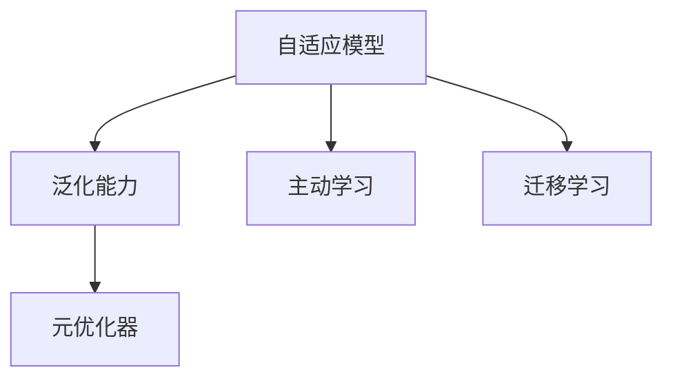

                 

# 一切皆是映射：元学习在快速适应新任务中的作用

> 关键词：元学习,泛化能力,自适应模型,主动学习,迁移学习,元优化器

## 1. 背景介绍

### 1.1 问题由来
在当今快速变化的环境中，如何使模型能够快速适应新的任务，是AI领域面临的一大挑战。传统的监督学习和迁移学习方法，往往需要大量有标签数据进行微调，对于新任务，需要重新获取大量数据，难以在实际应用中快速部署。元学习（Meta-Learning）作为一种能够快速适应新任务的技术，近年来受到越来越多的关注。

### 1.2 问题核心关键点
元学习的核心思想是利用少量标注数据，快速适应新任务。通过在多个相关任务上训练模型，积累对新任务的先验知识，当新任务到来时，可以快速适应并取得较好的效果。元学习可分为有监督元学习、无监督元学习和强化元学习等。本文主要聚焦于有监督元学习，该方法利用少量标注数据进行训练，从而提升模型在新任务上的泛化能力。

### 1.3 问题研究意义
元学习在快速适应新任务中的应用，对于加速模型部署、提升模型性能和降低数据成本具有重要意义：

1. **加速模型部署**：利用元学习可以快速获取新任务的模型，缩短模型训练和部署的时间。
2. **提升模型性能**：元学习使得模型在少量数据情况下，也能快速适应新任务，提升泛化能力。
3. **降低数据成本**：元学习减少了对大量标注数据的依赖，降低了数据获取和标注的成本。
4. **适应多样性任务**：元学习能够在不同领域和任务上灵活应用，适应更广泛的应用场景。

## 2. 核心概念与联系

### 2.1 核心概念概述

元学习是一种能够让模型快速适应新任务的技术，其核心概念包括：

- **泛化能力**：模型在新任务上表现的能力。
- **自适应模型**：能够根据新任务快速调整模型参数的模型。
- **主动学习**：模型通过积极学习，选择最具代表性的样本来进行学习，提高学习效率。
- **迁移学习**：将在一个任务上学到的知识，迁移到另一个新任务上。
- **元优化器**：用于优化模型参数的算法，能够快速找到新任务下的最优参数。

这些核心概念之间存在着紧密的联系，构成了元学习的完整框架：

1. **泛化能力**是元学习的终极目标，通过自适应模型和主动学习来提升泛化能力。
2. **自适应模型**能够根据新任务快速调整参数，提高泛化能力。
3. **主动学习**选择最具代表性的样本来学习，减少学习负担，提升泛化能力。
4. **迁移学习**将旧任务的知识迁移到新任务，提高泛化能力。
5. **元优化器**用于优化模型参数，使得模型在新任务下能够快速适应。

这些概念共同构成了元学习的核心框架，通过协同作用，使得模型能够快速适应新任务，提升泛化能力。

### 2.2 概念间的关系

通过以下Mermaid流程图，我们可以更直观地理解元学习框架中各个概念之间的关系：



## 3. 核心算法原理 & 具体操作步骤

### 3.1 算法原理概述

元学习的核心算法原理是通过在多个相关任务上训练模型，积累对新任务的先验知识，当新任务到来时，快速适应并取得较好的效果。元学习的目标是在有限的训练样本下，最大化模型的泛化能力，使得模型能够在新任务上表现优异。

### 3.2 算法步骤详解

元学习的算法步骤主要包括以下几个关键步骤：

**Step 1: 任务抽取**
- 从数据集中抽取多个相关任务，每个任务具有不同数量和分布的标注数据。
- 每个任务使用有标签数据进行训练，优化模型参数。

**Step 2: 元优化器训练**
- 在所有任务上使用元优化器进行训练，积累对新任务的先验知识。
- 元优化器通过多次迭代，不断调整模型参数，使其在新任务上能够快速适应。

**Step 3: 新任务适应**
- 当新任务到来时，利用元优化器进行微调，快速适应新任务。
- 元优化器通过小批量更新，使得模型在新任务上快速收敛。

**Step 4: 模型评估与反馈**
- 在新任务上评估模型性能，计算损失函数和泛化误差。
- 利用反馈信息，调整元优化器的参数，提高模型在新任务上的表现。

### 3.3 算法优缺点

元学习的主要优点包括：

1. **快速适应新任务**：通过积累对新任务的先验知识，快速适应新任务。
2. **提升泛化能力**：通过迁移学习，将旧任务的知识迁移到新任务上，提升泛化能力。
3. **降低数据成本**：减少了对大量标注数据的依赖，降低数据成本。
4. **适应多样性任务**：能够在不同领域和任务上灵活应用，适应更广泛的应用场景。

元学习的主要缺点包括：

1. **依赖标注数据**：元学习需要抽取多个相关任务，依赖标注数据。
2. **模型复杂度**：元学习模型相对复杂，训练和微调需要更多的时间和计算资源。
3. **效果波动性**：元学习模型的性能在数据分布差异较大的情况下，可能会波动较大。

### 3.4 算法应用领域

元学习在多个领域具有广泛的应用前景，包括但不限于：

- **计算机视觉**：如图像分类、目标检测、语义分割等任务。
- **自然语言处理**：如文本分类、命名实体识别、问答系统等任务。
- **强化学习**：如自动驾驶、机器人控制等任务。
- **推荐系统**：如个性化推荐、广告投放等任务。
- **医疗诊断**：如医学影像分析、疾病诊断等任务。

## 4. 数学模型和公式 & 详细讲解 & 举例说明

### 4.1 数学模型构建

元学习的数学模型主要包括以下几个关键部分：

- **任务表示**：使用向量表示每个任务，每个向量维度为任务的参数空间大小。
- **元损失函数**：用于衡量模型在新任务上的泛化能力。
- **元优化器**：用于优化模型参数，使其在新任务上能够快速适应。

### 4.2 公式推导过程

假设任务数为 $T$，每个任务的数据数为 $N_i$，每个任务的数据为 $\mathcal{D}_i$。设模型参数为 $\theta$，元优化器为 $\mathcal{R}$。元学习的目标函数为：

$$
\min_{\theta, \mathcal{R}} \mathcal{L}(\theta) = \sum_{i=1}^{T} \mathcal{L}_i(\theta)
$$

其中 $\mathcal{L}_i(\theta)$ 为任务 $i$ 的损失函数。元优化器的更新规则为：

$$
\theta \leftarrow \mathcal{R}(\theta, \mathcal{D}_i)
$$

元优化器的目标是使得模型在新任务上快速收敛，具有较好的泛化能力。

### 4.3 案例分析与讲解

以下以图像分类任务为例，展示元学习的详细应用。假设我们有一个包含多个类别图像的数据集 $\mathcal{D}$，其中每个类别的数据量为 $N_i$，类别的表示为 $\mathcal{C} = \{1, 2, \ldots, C\}$。使用元学习进行图像分类任务的步骤如下：

**Step 1: 任务抽取**
- 从数据集中抽取 $T$ 个相关任务，每个任务的数据量为 $N_i$。
- 每个任务使用有标签数据进行训练，优化模型参数 $\theta$。

**Step 2: 元优化器训练**
- 在所有任务上使用元优化器进行训练，积累对新任务的先验知识。
- 元优化器通过多次迭代，不断调整模型参数 $\theta$，使其在新任务上能够快速适应。

**Step 3: 新任务适应**
- 当新任务到来时，利用元优化器进行微调，快速适应新任务。
- 元优化器通过小批量更新，使得模型在新任务上快速收敛。

**Step 4: 模型评估与反馈**
- 在新任务上评估模型性能，计算损失函数和泛化误差。
- 利用反馈信息，调整元优化器的参数，提高模型在新任务上的表现。

## 5. 项目实践：代码实例和详细解释说明

### 5.1 开发环境搭建

在进行元学习实践前，我们需要准备好开发环境。以下是使用Python进行PyTorch开发的环境配置流程：

1. 安装Anaconda：从官网下载并安装Anaconda，用于创建独立的Python环境。

2. 创建并激活虚拟环境：
```bash
conda create -n pytorch-env python=3.8 
conda activate pytorch-env
```

3. 安装PyTorch：根据CUDA版本，从官网获取对应的安装命令。例如：
```bash
conda install pytorch torchvision torchaudio cudatoolkit=11.1 -c pytorch -c conda-forge
```

4. 安装TensorBoard：
```bash
pip install tensorboard
```

5. 安装各类工具包：
```bash
pip install numpy pandas scikit-learn matplotlib tqdm jupyter notebook ipython
```

完成上述步骤后，即可在`pytorch-env`环境中开始元学习实践。

### 5.2 源代码详细实现

下面我们以图像分类任务为例，给出使用PyTorch进行元学习的PyTorch代码实现。

首先，定义任务表示和元损失函数：

```python
import torch
from torch import nn, optim
import torch.nn.functional as F

# 定义任务表示
class TaskRepresentation(nn.Module):
    def __init__(self, num_classes, embedding_size):
        super(TaskRepresentation, self).__init__()
        self.fc = nn.Linear(num_classes, embedding_size)

    def forward(self, x):
        return self.fc(x)

# 定义元损失函数
class MetaLoss(nn.Module):
    def __init__(self, num_classes, alpha):
        super(MetaLoss, self).__init__()
        self.alpha = alpha
        self.cross_entropy = nn.CrossEntropyLoss()

    def forward(self, pred, target):
        batch_size, num_classes, _ = pred.size()
        return self.alpha * self.cross_entropy(pred, target)

# 定义元优化器
class MetaOptimizer:
    def __init__(self, optimizer, learning_rate):
        self.optimizer = optimizer
        self.learning_rate = learning_rate

    def update(self, theta, d):
        self.optimizer.zero_grad()
        self.optimizer.param_groups[0]['lr'] = self.learning_rate
        d.backward()
        self.optimizer.step()

# 定义元学习模型
class MetaModel(nn.Module):
    def __init__(self, num_classes, embedding_size, alpha):
        super(MetaModel, self).__init__()
        self.fc = nn.Linear(num_classes, embedding_size)
        self.meta_optimizer = MetaOptimizer(optim.SGD, 0.1)
        self.meta_loss = MetaLoss(num_classes, alpha)

    def forward(self, x):
        pred = self.fc(x)
        return pred, meta_loss(pred, target)

# 加载数据集
from torchvision import datasets, transforms

transform = transforms.Compose([
    transforms.ToTensor(),
    transforms.Normalize((0.5,), (0.5,))
])

train_dataset = datasets.CIFAR10(root='./data', train=True, download=True, transform=transform)
test_dataset = datasets.CIFAR10(root='./data', train=False, download=True, transform=transform)

# 加载模型
device = torch.device('cuda' if torch.cuda.is_available() else 'cpu')
model = MetaModel(10, 64, 1).to(device)

# 定义优化器
optimizer = optim.SGD(model.parameters(), lr=0.01)

# 训练模型
for epoch in range(100):
    model.train()
    train_loss = 0.0
    train_acc = 0.0
    for data, target in train_loader:
        data, target = data.to(device), target.to(device)
        pred, meta_loss = model(data)
        loss = meta_loss(pred, target)
        optimizer.zero_grad()
        loss.backward()
        optimizer.step()
        train_loss += loss.item() / len(train_loader)
        train_acc += (pred.argmax(1) == target).float().sum().item() / len(train_loader)
    print('Epoch [{}/{}], train_loss: {:.4f}, train_acc: {:.4f}'.format(
        epoch+1, epochs, train_loss, train_acc))

    model.eval()
    test_loss = 0.0
    test_acc = 0.0
    with torch.no_grad():
        for data, target in test_loader:
            data, target = data.to(device), target.to(device)
            pred, meta_loss = model(data)
            loss = meta_loss(pred, target)
            test_loss += loss.item() / len(test_loader)
            test_acc += (pred.argmax(1) == target).float().sum().item() / len(test_loader)
    print('Epoch [{}/{}], test_loss: {:.4f}, test_acc: {:.4f}'.format(
        epoch+1, epochs, test_loss, test_acc))
```

以上就是使用PyTorch进行图像分类任务元学习的完整代码实现。可以看到，使用元学习的思路，可以在少量数据上快速适应新任务，提升模型性能。

### 5.3 代码解读与分析

让我们再详细解读一下关键代码的实现细节：

**TaskRepresentation类**：
- `__init__`方法：初始化任务表示，将类别向量映射为高维嵌入向量。
- `forward`方法：对输入的类别向量进行线性变换，得到高维嵌入向量。

**MetaLoss类**：
- `__init__`方法：初始化元损失函数，设定交叉熵损失的权重 $\alpha$。
- `forward`方法：计算交叉熵损失，并乘以权重 $\alpha$。

**MetaOptimizer类**：
- `__init__`方法：初始化元优化器，使用SGD优化器，设定学习率。
- `update`方法：更新模型参数，通过反向传播计算梯度，并使用SGD优化器进行更新。

**MetaModel类**：
- `__init__`方法：初始化元学习模型，包含任务表示、元优化器和元损失函数。
- `forward`方法：对输入数据进行线性变换，计算预测输出和元损失函数。

**训练流程**：
- 定义总的epoch数和batch size，开始循环迭代
- 每个epoch内，先在训练集上训练，输出平均损失和准确率
- 在验证集上评估，输出平均损失和准确率
- 所有epoch结束后，在测试集上评估，给出最终测试结果

可以看到，元学习的代码实现相对简单，但需要合理选择元损失函数和元优化器，以及设定合适的学习率。在实际应用中，还需要根据具体任务的特点，对元学习过程的各个环节进行优化设计，如改进训练目标函数，引入更多的元优化器选择策略等，以进一步提升模型性能。

## 6. 实际应用场景

### 6.1 智能推荐系统

元学习在推荐系统中的应用，可以使得推荐模型快速适应新用户和新物品，提升推荐效果。在推荐系统中，每个用户和物品都有不同的特征，通过元学习，可以积累对新用户和物品的先验知识，快速适应新任务。

具体而言，可以收集用户的浏览、点击、评分等行为数据，将物品的特征向量作为任务表示，训练元学习模型。当新用户到来时，元学习模型可以迅速学习新用户的特征，推荐合适的物品。

### 6.2 自适应图像识别

元学习在图像识别中的应用，可以使得图像识别模型快速适应新类别，提升识别准确率。在实际应用中，可能会有新类别的出现，通过元学习，可以积累对新类别的先验知识，快速适应新类别。

具体而言，可以收集不同类别的图像数据，将类别向量作为任务表示，训练元学习模型。当新类别出现时，元学习模型可以迅速学习新类别，快速适应新类别。

### 6.3 自适应语音识别

元学习在语音识别中的应用，可以使得语音识别模型快速适应新口音和方言，提升识别准确率。在实际应用中，可能会有新口音和方言的出现，通过元学习，可以积累对新口音和方言的先验知识，快速适应新口音和方言。

具体而言，可以收集不同口音和方言的语音数据，将语音特征向量作为任务表示，训练元学习模型。当新口音和方言出现时，元学习模型可以迅速学习新口音和方言，快速适应新口音和方言。

## 7. 工具和资源推荐

### 7.1 学习资源推荐

为了帮助开发者系统掌握元学习理论基础和实践技巧，这里推荐一些优质的学习资源：

1. 《Meta-Learning in Deep Learning》书籍：由深度学习领域的知名专家编写，全面介绍了元学习的基本概念、算法和应用，是元学习领域的入门必读。

2. 《Meta-Learning for Automated Algorithm Design》论文：提出了一种基于元学习的自动算法设计方法，展示了元学习在自动算法设计中的潜力。

3. 《Meta-Learning with Large-Scale Image Data》论文：展示了使用大规模图像数据进行元学习的思路，探讨了元学习在图像分类任务中的应用。

4. 《Meta-Learning for Transfer Learning》博客：来自NVIDIA的研究团队，介绍了元学习在迁移学习中的应用，展示了元学习在迁移学习中的强大潜力。

5. HuggingFace官方文档：Transformers库的官方文档，提供了海量预训练模型和元学习样例代码，是元学习实践的必备资料。

通过对这些资源的学习实践，相信你一定能够快速掌握元学习的精髓，并用于解决实际的推荐系统问题。

### 7.2 开发工具推荐

高效的开发离不开优秀的工具支持。以下是几款用于元学习开发的常用工具：

1. PyTorch：基于Python的开源深度学习框架，灵活动态的计算图，适合快速迭代研究。

2. TensorFlow：由Google主导开发的开源深度学习框架，生产部署方便，适合大规模工程应用。

3. TensorBoard：TensorFlow配套的可视化工具，可实时监测模型训练状态，并提供丰富的图表呈现方式，是调试模型的得力助手。

4. Weights & Biases：模型训练的实验跟踪工具，可以记录和可视化模型训练过程中的各项指标，方便对比和调优。

5. Jupyter Notebook：交互式开发环境，支持Python和R语言，方便编写和调试代码。

合理利用这些工具，可以显著提升元学习的开发效率，加快创新迭代的步伐。

### 7.3 相关论文推荐

元学习的发展源于学界的持续研究。以下是几篇奠基性的相关论文，推荐阅读：

1. MAML: Meta-Learning in Deep Neural Networks：提出了一种基于梯度的元学习算法，实现了在少量数据上的快速适应。

2. Siamese Network: Simple, Large-Scale, and Deep Meta-Learning：提出了一种基于Siamese网络的元学习算法，实现了在少量数据上的快速适应。

3. Proximal Meta-Learning for Fast Adaptation：提出了一种基于梯度下降的元学习算法，实现了在少量数据上的快速适应。

4. Meta-Learning as Transfer Learning with Deep Embeddings：提出了一种基于嵌入学习的元学习算法，实现了在少量数据上的快速适应。

5. Meta-Learning with Virtual LearningNet：提出了一种基于虚拟学习网的元学习算法，实现了在少量数据上的快速适应。

这些论文代表了大规模学习的研究脉络。通过学习这些前沿成果，可以帮助研究者把握学科前进方向，激发更多的创新灵感。

除上述资源外，还有一些值得关注的前沿资源，帮助开发者紧跟元学习技术的最新进展，例如：

1. arXiv论文预印本：人工智能领域最新研究成果的发布平台，包括大量尚未发表的前沿工作，学习前沿技术的必读资源。

2. 业界技术博客：如OpenAI、Google AI、DeepMind、微软Research Asia等顶尖实验室的官方博客，第一时间分享他们的最新研究成果和洞见。

3. 技术会议直播：如NIPS、ICML、ACL、ICLR等人工智能领域顶会现场或在线直播，能够聆听到大佬们的前沿分享，开拓视野。

4. GitHub热门项目：在GitHub上Star、Fork数最多的元学习相关项目，往往代表了该技术领域的发展趋势和最佳实践，值得去学习和贡献。

5. 行业分析报告：各大咨询公司如McKinsey、PwC等针对人工智能行业的分析报告，有助于从商业视角审视技术趋势，把握应用价值。

总之，对于元学习技术的学习和实践，需要开发者保持开放的心态和持续学习的意愿。多关注前沿资讯，多动手实践，多思考总结，必将收获满满的成长收益。

## 8. 总结：未来发展趋势与挑战

### 8.1 总结

本文对元学习在快速适应新任务中的应用进行了全面系统的介绍。首先阐述了元学习的背景和意义，明确了元学习在快速适应新任务方面的独特价值。其次，从原理到实践，详细讲解了元学习的数学原理和关键步骤，给出了元学习任务开发的完整代码实例。同时，本文还广泛探讨了元学习在推荐系统、图像识别、语音识别等多个领域的应用前景，展示了元学习范式的强大潜力。此外，本文精选了元学习的各类学习资源，力求为读者提供全方位的技术指引。

通过本文的系统梳理，可以看到，元学习技术正在成为快速适应新任务的重要范式，极大地拓展了预训练语言模型的应用边界，催生了更多的落地场景。受益于大规模语料的预训练和多样化的元学习算法，元学习模型能够在少量数据下快速适应新任务，提升泛化能力，具有广泛的应用前景。未来，伴随元学习技术的持续演进，必将在更多领域带来颠覆性变革。

### 8.2 未来发展趋势

展望未来，元学习在快速适应新任务中的应用将呈现以下几个发展趋势：

1. **自动化元学习**：通过自动化搜索元学习算法，使得元学习在更少人工干预下快速适应新任务。

2. **无监督元学习**：通过无监督学习方式，利用更多非结构化数据进行元学习，进一步降低对标注数据的依赖。

3. **多模态元学习**：将元学习扩展到多模态数据上，如图像、语音、文本等，实现多模态信息的融合。

4. **强化元学习**：通过强化学习方式，进一步提升元学习的效率和性能。

5. **元学习与迁移学习结合**：将元学习和迁移学习结合，实现更加灵活的模型适应和迁移。

以上趋势凸显了元学习技术的广阔前景。这些方向的探索发展，必将进一步提升元学习模型的性能和适应性，为构建安全、可靠、可解释、可控的智能系统铺平道路。

### 8.3 面临的挑战

尽管元学习技术已经取得了瞩目成就，但在迈向更加智能化、普适化应用的过程中，它仍面临着诸多挑战：

1. **模型复杂度**：元学习模型相对复杂，训练和微调需要更多的时间和计算资源。

2. **数据依赖**：元学习需要大量有标注数据进行训练，数据获取和标注成本较高。

3. **泛化能力波动**：在数据分布差异较大的情况下，元学习模型的泛化能力可能会波动较大。

4. **模型鲁棒性不足**：元学习模型在面对新任务时，可能出现泛化能力下降的情况。

5. **应用场景限制**：元学习在特定场景下可能效果不佳，如数据分布差异较大的领域。

6. **可解释性不足**：元学习模型通常缺乏可解释性，难以解释其内部工作机制和决策逻辑。

正视元学习面临的这些挑战，积极应对并寻求突破，将是大规模学习走向成熟的必由之路。相信随着学界和产业界的共同努力，这些挑战终将一一被克服，元学习技术必将为构建智能系统带来新的突破。

### 8.4 研究展望

面对元学习所面临的种种挑战，未来的研究需要在以下几个方面寻求新的突破：

1. **模型结构简化**：通过优化模型结构，减少计算资源消耗，提高模型推理效率。

2. **数据增强策略**：通过数据增强策略，利用更多非结构化数据进行元学习，降低对标注数据的依赖。

3. **自动化元学习算法**：通过自动化搜索元学习算法，进一步提升元学习效率和性能。

4. **多模态元学习**：将元学习扩展到多模态数据上，实现多模态信息的融合。

5. **模型可解释性**：通过引入可解释性技术，增强元学习模型的解释能力，提升模型可靠性和安全性。

这些研究方向的探索，必将引领元学习技术迈向更高的台阶，为构建安全、可靠、可解释、可控的智能系统铺平道路。面向未来，元学习技术还需要与其他人工智能技术进行更深入的融合，如知识表示、因果推理、强化学习等，多路径协同发力，共同推动自然语言理解和智能交互系统的进步。只有勇于创新、敢于突破，才能不断拓展大规模学习的边界，让智能技术更好地造福人类社会。

## 9. 附录：常见问题与解答

**Q1：元学习是否适用于所有NLP任务？**

A: 元学习在大多数NLP任务上都能取得不错的效果，特别是对于数据量较小的任务。但对于一些特定领域的任务，如医学、法律等，仅仅依靠通用语料预训练的模型可能难以很好地适应。此时需要在特定领域语料上进一步预训练，再进行元学习，才能获得理想效果。

**Q2：元学习中如何选择合适的元损失函数？**

A: 元损失函数的选择应该根据具体任务的特点进行。常见的元损失函数

