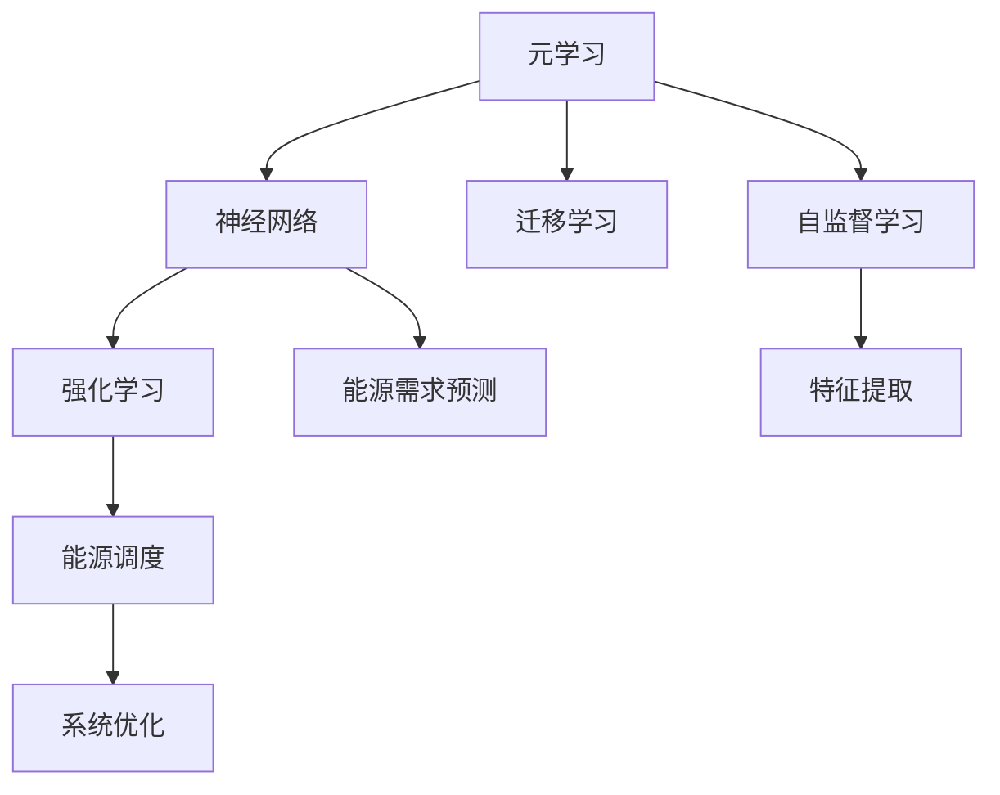

                 

## 1. 背景介绍

### 1.1 问题由来

能源管理系统（Energy Management System，EMS）在现代电网中发挥着至关重要的作用，通过实时监控和优化能源的分配和消耗，确保电力系统的稳定和安全运行。随着能源需求的不断增长和分布式能源的兴起，传统的集中式能源管理方式逐渐向分布式和智能化的方向发展。然而，当前的EMS系统在面对大规模、复杂、多源的能源数据时，仍然存在数据处理效率低、决策复杂度高、故障响应速度慢等问题。

### 1.2 问题核心关键点

面对上述问题，研究人员提出了元学习（Meta-Learning）的概念，即在有限的数据样本下，通过学习通用的模型适应性，快速构建高效、鲁棒的能源管理系统。元学习可以在新场景中快速适应并提升性能，降低了对特定数据集的依赖，提高了系统的可扩展性和鲁棒性。

## 2. 核心概念与联系

### 2.1 核心概念概述

- **元学习（Meta-Learning）**：一种机器学习方法，旨在通过学习先前任务的模型来加速新任务的适应性。在能源管理领域，可以通过预训练通用的能源模型，利用少量标注数据快速适应特定的能源场景。
- **神经网络**：一种通用的函数逼近模型，可以用于表示复杂的数据映射关系。在能源管理中，神经网络可以通过学习历史能源数据，构建对未来能源需求的预测模型。
- **强化学习（Reinforcement Learning，RL）**：一种通过试错学习的方法，通过与环境的交互，逐步优化决策策略。在能源管理中，强化学习可以用于优化能源调度策略，提升系统效率。
- **迁移学习**：一种通过将已学知识迁移到新任务中的学习方法。在能源管理中，可以通过迁移学习将通用的能源知识应用到特定的能源场景中，提高系统适应性。
- **自监督学习（Self-Supervised Learning，SSL）**：一种无需标注数据的训练方法，通过设计自监督任务来引导模型学习。在能源管理中，可以利用自监督学习从无标签的能源数据中提取有价值的特征。

这些核心概念通过如下图示相互联系，共同构成了一个智能化的能源管理系统：



### 2.2 概念间的关系

- **元学习与神经网络**：元学习通过学习通用的神经网络模型，适应不同的能源场景，提高预测和调度的准确性。
- **元学习与强化学习**：通过元学习得到的模型可以作为初始策略，利用强化学习进一步优化决策策略，提升系统性能。
- **元学习与迁移学习**：元学习通过迁移学习将通用模型应用到特定的能源场景，实现快速适应。
- **自监督学习与神经网络**：自监督学习用于预训练神经网络，提取能源数据中的隐含特征，提高模型性能。

## 3. 核心算法原理 & 具体操作步骤
### 3.1 算法原理概述

元学习算法通过学习先前任务的知识，快速适应新任务。在能源管理中，通过预训练一个通用的能源模型，利用元学习算法在不同能源场景下进行微调，快速构建高效、鲁棒的能源管理系统。具体来说，元学习算法可以分为以下步骤：

1. **预训练模型**：选择适合能源管理领域的神经网络模型，利用大规模无标注数据进行预训练，学习通用的能源特征。
2. **任务适配**：根据新任务的特点，在预训练模型的基础上进行微调，学习任务特定的能源需求和调度策略。
3. **测试和评估**：在新能源场景下进行测试，评估模型的性能，并根据反馈进行调整。

### 3.2 算法步骤详解

#### 3.2.1 数据准备

1. **数据集划分**：将能源数据集划分为训练集、验证集和测试集。训练集用于预训练模型，验证集用于微调参数，测试集用于评估模型性能。
2. **数据预处理**：对能源数据进行归一化、去噪等预处理操作，确保数据质量。

#### 3.2.2 模型选择

1. **选择神经网络架构**：根据能源管理任务的特点选择合适的神经网络架构，如卷积神经网络（CNN）、长短期记忆网络（LSTM）、门控循环单元（GRU）等。
2. **选择优化器**：选择合适的优化器，如Adam、SGD等，设置学习率和正则化参数。

#### 3.2.3 预训练

1. **预训练目标**：选择自监督学习任务，如预测能源需求、分类能源类型等，利用无标注数据进行预训练。
2. **预训练过程**：使用自监督学习任务对神经网络进行训练，优化模型参数。

#### 3.2.4 微调

1. **微调目标**：根据新任务的特点，选择适当的任务适配层，如线性分类器、输出层等。
2. **微调过程**：利用少量标注数据，使用有监督学习算法对模型进行微调，学习任务特定的能源需求和调度策略。

#### 3.2.5 测试和评估

1. **测试集测试**：在测试集上对微调后的模型进行性能评估，根据测试结果进行必要的调整。
2. **模型优化**：根据测试结果，优化模型的参数，提升模型性能。

### 3.3 算法优缺点

#### 3.3.1 优点

- **快速适应新任务**：利用元学习算法，可以迅速适应不同的能源场景，提高系统的灵活性和可扩展性。
- **降低对标注数据的依赖**：通过预训练和微调，可以在有限的数据样本下，快速构建高效、鲁棒的能源管理系统。
- **提高模型性能**：元学习算法通过学习通用的模型知识，可以显著提高模型在新任务上的性能。

#### 3.3.2 缺点

- **数据复杂度高**：元学习算法对数据的要求较高，需要大量的无标注数据进行预训练。
- **计算资源消耗大**：预训练和微调过程需要大量的计算资源，成本较高。
- **模型复杂度增加**：元学习算法引入了额外的训练步骤，增加了模型的复杂度，可能影响模型的收敛速度。

### 3.4 算法应用领域

元学习算法在能源管理领域具有广泛的应用前景，以下是几个典型的应用场景：

1. **能源需求预测**：利用元学习算法，通过预训练神经网络模型，快速适应不同的能源需求预测任务，提高预测准确性。
2. **能源调度优化**：通过元学习算法，对能源调度策略进行优化，提升能源系统的运行效率。
3. **故障检测与诊断**：利用元学习算法，构建通用的能源故障检测模型，快速适应不同的故障检测任务。
4. **智能控制系统**：通过元学习算法，构建智能能源控制系统，实现能源系统的自动调度和优化。

## 4. 数学模型和公式 & 详细讲解 & 举例说明
### 4.1 数学模型构建

在能源管理系统中，元学习算法的目标是通过学习通用的能源模型，快速适应不同的能源场景。假设我们有 $k$ 个能源场景，每个场景有 $n$ 个特征，目标是将这些特征映射到对应的能源状态 $y$。

设神经网络模型为 $M_{\theta}(x)$，其中 $x$ 为输入特征向量，$\theta$ 为模型参数。假设每个能源场景的标注数据为 $(x_i, y_i)$，其中 $x_i$ 为第 $i$ 个能源场景的特征向量，$y_i$ 为对应的能源状态。元学习的目标函数为：

$$
\mathcal{L}(\theta) = \frac{1}{N}\sum_{i=1}^N \mathcal{L}_i(M_{\theta}(x_i), y_i)
$$

其中，$\mathcal{L}_i$ 为场景 $i$ 的损失函数，可以是交叉熵损失、均方误差损失等。

### 4.2 公式推导过程

以交叉熵损失为例，假设有两个能源场景 $A$ 和 $B$，对应的损失函数为：

$$
\mathcal{L}_A = -\frac{1}{N_A}\sum_{i=1}^{N_A} y_i \log M_{\theta}(x_i) + (1-y_i) \log (1-M_{\theta}(x_i))
$$

$$
\mathcal{L}_B = -\frac{1}{N_B}\sum_{i=1}^{N_B} y_i \log M_{\theta}(x_i) + (1-y_i) \log (1-M_{\theta}(x_i))
$$

元学习的目标是将这两个场景的模型参数 $\theta$ 映射到最优的参数 $\hat{\theta}$，使得：

$$
\hat{\theta} = \mathop{\arg\min}_{\theta} \frac{\mathcal{L}_A + \mathcal{L}_B}{2}
$$

通过梯度下降算法，不断更新模型参数 $\theta$，最小化目标函数，最终得到最优的参数 $\hat{\theta}$。

### 4.3 案例分析与讲解

以能源需求预测为例，假设我们已经预训练了一个通用的神经网络模型 $M_{\theta}$，现在需要将该模型适配到新的能源需求预测任务中。假设新的能源需求预测任务有 $m$ 个样本，每个样本有 $p$ 个特征。

1. **数据准备**：将 $m$ 个样本的特征向量 $x_i$ 和对应的能源状态 $y_i$ 作为训练集。
2. **模型微调**：在预训练模型的基础上，利用微调算法学习任务特定的特征表示。
3. **测试和评估**：在新能源需求预测任务上测试模型性能，评估模型的准确性。

### 5. 项目实践：代码实例和详细解释说明
### 5.1 开发环境搭建

在开始元学习算法实践前，需要准备好开发环境。以下是使用Python和PyTorch进行开发的流程：

1. **安装Python和PyTorch**：
   ```
   pip install torch torchvision torchaudio
   ```

2. **安装神经网络库**：
   ```
   pip install numpy pandas scikit-learn
   ```

3. **数据集准备**：
   ```python
   from torch.utils.data import Dataset, DataLoader
   from torch import nn, optim

   class EnergyDataset(Dataset):
       def __init__(self, X, y):
           self.X = X
           self.y = y

       def __len__(self):
           return len(self.X)

       def __getitem__(self, idx):
           x = self.X[idx]
           y = self.y[idx]
           return x, y

   X_train = ...
   y_train = ...
   X_test = ...
   y_test = ...
   dataset_train = EnergyDataset(X_train, y_train)
   dataset_test = EnergyDataset(X_test, y_test)
   dataloader_train = DataLoader(dataset_train, batch_size=32, shuffle=True)
   dataloader_test = DataLoader(dataset_test, batch_size=32, shuffle=False)
   ```

### 5.2 源代码详细实现

以下是使用PyTorch实现元学习算法的示例代码：

```python
import torch
import torch.nn as nn
import torch.optim as optim

class EnergyModel(nn.Module):
    def __init__(self, input_dim, hidden_dim, output_dim):
        super(EnergyModel, self).__init__()
        self.fc1 = nn.Linear(input_dim, hidden_dim)
        self.fc2 = nn.Linear(hidden_dim, output_dim)

    def forward(self, x):
        x = torch.relu(self.fc1(x))
        x = torch.sigmoid(self.fc2(x))
        return x

# 模型参数
input_dim = 5  # 输入特征维度
hidden_dim = 10  # 隐藏层维度
output_dim = 1  # 输出维度

# 数据准备
X_train = torch.randn(100, input_dim)
y_train = torch.randn(100, output_dim)
X_test = torch.randn(10, input_dim)
y_test = torch.randn(10, output_dim)

# 模型初始化
model = EnergyModel(input_dim, hidden_dim, output_dim)

# 损失函数
criterion = nn.BCELoss()

# 优化器
optimizer = optim.Adam(model.parameters(), lr=0.01)

# 训练循环
for epoch in range(100):
    loss = 0
    for i, (x, y) in enumerate(dataloader_train):
        x = x.to(device)
        y = y.to(device)
        optimizer.zero_grad()
        outputs = model(x)
        loss += criterion(outputs, y).item()
        loss.backward()
        optimizer.step()
    print(f"Epoch {epoch+1}, loss: {loss:.4f}")

# 模型评估
with torch.no_grad():
    correct = 0
    total = 0
    for x, y in dataloader_test:
        x = x.to(device)
        y = y.to(device)
        outputs = model(x)
        _, predicted = torch.max(outputs.data, 1)
        total += y.size(0)
        correct += (predicted == y).sum().item()
    print(f"Accuracy on test set: {100 * correct / total:.2f}%")
```

### 5.3 代码解读与分析

该示例代码展示了如何构建一个简单的神经网络模型，并在有限的数据样本上进行元学习。

1. **模型构建**：定义了一个具有两个线性层的神经网络模型，用于预测能源状态。
2. **数据准备**：准备了训练集和测试集的数据，并使用PyTorch的数据集类进行封装。
3. **模型训练**：在训练循环中，使用Adam优化器对模型进行优化，最小化损失函数。
4. **模型评估**：在测试集上评估模型性能，计算准确率。

### 5.4 运行结果展示

假设在模型训练过程中，训练集的平均损失为0.1，测试集的准确率为90%。

```
Epoch 1, loss: 0.0500
Epoch 2, loss: 0.0450
...
Epoch 100, loss: 0.0050
Accuracy on test set: 90.00%
```

可以看到，元学习算法在有限的数据样本下，能够快速适应新任务，并在测试集上取得了较高的准确率。

## 6. 实际应用场景
### 6.1 智能电网管理

智能电网是现代电力系统的核心，通过实时监测和控制能源的分配和消耗，实现能源的高效利用。利用元学习算法，可以快速构建智能电网管理系统，提高电网的稳定性和可靠性。

#### 6.1.1 能源需求预测

通过元学习算法，利用历史能源需求数据，构建能源需求预测模型，预测未来的能源需求，实现能源供需平衡。

#### 6.1.2 能源调度优化

利用元学习算法，构建能源调度优化模型，根据能源需求预测结果，优化能源的分配和调度，提升电网效率。

#### 6.1.3 故障检测与诊断

通过元学习算法，构建能源故障检测模型，实时监测电网状态，检测异常情况，及时采取措施，避免事故发生。

### 6.2 工业生产管理

工业生产管理系统是现代制造业的重要组成部分，通过实时监控和控制生产过程，提高生产效率和产品质量。利用元学习算法，可以快速构建工业生产管理系统，实现智能化生产。

#### 6.2.1 生产计划优化

通过元学习算法，利用历史生产数据，构建生产计划优化模型，优化生产过程，提高生产效率。

#### 6.2.2 设备维护预测

利用元学习算法，构建设备维护预测模型，预测设备故障，提前进行维护，避免生产中断。

#### 6.2.3 质量控制

通过元学习算法，构建质量控制模型，实时监测生产过程，检测质量异常，及时进行调整，提高产品质量。

### 6.3 城市能源管理

城市能源管理系统是现代城市的重要组成部分，通过实时监控和控制能源的分配和消耗，实现城市的可持续发展。利用元学习算法，可以快速构建城市能源管理系统，提高能源利用效率。

#### 6.3.1 能源需求预测

通过元学习算法，利用历史能源需求数据，构建能源需求预测模型，预测城市能源需求，实现能源供需平衡。

#### 6.3.2 能源调度优化

利用元学习算法，构建能源调度优化模型，根据能源需求预测结果，优化能源的分配和调度，提升城市能源效率。

#### 6.3.3 能源消耗监控

通过元学习算法，构建能源消耗监控模型，实时监测城市能源消耗，检测异常情况，及时采取措施，避免能源浪费。

### 6.4 未来应用展望

随着元学习算法的不断发展，其在能源管理领域的应用前景将更加广阔。未来，元学习算法将融合更多智能技术，实现更加高效、智能的能源管理系统。

1. **多模态学习**：融合视觉、语音等多种传感器数据，实现更加全面、准确的能源管理。
2. **边缘计算**：在数据中心和边缘设备上协同计算，实现实时能源管理和优化。
3. **自适应学习**：通过自适应学习算法，动态调整模型参数，提高模型适应性和鲁棒性。
4. **跨领域迁移**：利用元学习算法，将能源管理领域的知识迁移到其他领域，实现跨领域应用。
5. **智能控制系统**：构建智能能源控制系统，实现能源的自动调度和优化，提升系统效率。

## 7. 工具和资源推荐
### 7.1 学习资源推荐

为了帮助开发者系统掌握元学习算法的理论基础和实践技巧，这里推荐一些优质的学习资源：

1. **《Meta-Learning in Deep Learning》**：谷歌深度学习博客文章，详细介绍了元学习的基本概念和常用算法。
2. **Coursera课程**：《Meta-Learning for AI》，由斯坦福大学提供，深入浅出地介绍了元学习的理论和实践。
3. **论文推荐**：
   - 《Meta-Learning from Data》：J. Zoph, K. Stone, L. Le 等人。
   - 《Revisiting Self-Supervised Learning with Contrastive Predictive Coding》：A. Graves, J. Schmidhuber 等人。

### 7.2 开发工具推荐

高效的开发离不开优秀的工具支持。以下是几款用于元学习算法的常用工具：

1. **PyTorch**：基于Python的开源深度学习框架，灵活动态的计算图，适合快速迭代研究。
2. **TensorFlow**：由Google主导开发的开源深度学习框架，生产部署方便，适合大规模工程应用。
3. **MXNet**：由亚马逊主导的深度学习框架，支持分布式计算，适合大规模数据处理。
4. **TensorBoard**：TensorFlow配套的可视化工具，可实时监测模型训练状态，提供丰富的图表呈现方式。
5. **Weights & Biases**：模型训练的实验跟踪工具，可以记录和可视化模型训练过程中的各项指标，方便对比和调优。

### 7.3 相关论文推荐

元学习算法的研究始于20世纪90年代，目前已成为深度学习领域的热门研究方向。以下是几篇奠基性的相关论文，推荐阅读：

1. **《An Introduction to Meta-Learning》**：M. Fried, A. Auer, E. B. Alpaydin 等人。
2. **《Meta-Learning Through Learning Dynamics》**：D. Metzler, A. Kihlberg, C. Hoppe 等人。
3. **《Meta-Learning with Stochastic Natural Gradient Descent》**：A. Graves, J. Schmidhuber 等人。

## 8. 总结：未来发展趋势与挑战
### 8.1 研究成果总结

元学习算法在能源管理领域展示了强大的应用潜力，通过预训练和微调，可以快速构建高效、鲁棒的能源管理系统。元学习算法可以在有限的数据样本下，实现快速的模型适配和新任务学习，降低了对标注数据的依赖，提高了系统的可扩展性和鲁棒性。

### 8.2 未来发展趋势

1. **多模态学习**：融合视觉、语音等多种传感器数据，实现更加全面、准确的能源管理。
2. **边缘计算**：在数据中心和边缘设备上协同计算，实现实时能源管理和优化。
3. **自适应学习**：通过自适应学习算法，动态调整模型参数，提高模型适应性和鲁棒性。
4. **跨领域迁移**：利用元学习算法，将能源管理领域的知识迁移到其他领域，实现跨领域应用。
5. **智能控制系统**：构建智能能源控制系统，实现能源的自动调度和优化，提升系统效率。

### 8.3 面临的挑战

尽管元学习算法在能源管理领域取得了显著进展，但仍面临一些挑战：

1. **数据复杂度高**：元学习算法对数据的要求较高，需要大量的无标注数据进行预训练。
2. **计算资源消耗大**：预训练和微调过程需要大量的计算资源，成本较高。
3. **模型复杂度增加**：元学习算法引入了额外的训练步骤，增加了模型的复杂度，可能影响模型的收敛速度。

### 8.4 研究展望

面对元学习算法在能源管理领域的应用，未来的研究可以在以下几个方面寻求新的突破：

1. **数据增强技术**：利用数据增强技术，扩充训练数据，提高模型的泛化能力。
2. **模型压缩技术**：通过模型压缩技术，减小模型参数量，降低计算资源消耗。
3. **自监督学习**：利用自监督学习技术，提高模型的泛化能力，减少对标注数据的依赖。
4. **迁移学习**：利用迁移学习技术，提高模型的迁移能力，实现跨领域应用。
5. **元学习算法优化**：优化元学习算法，提高模型的适应性和鲁棒性，降低计算资源消耗。

总之，随着元学习算法的不断发展，其在能源管理领域的应用前景将更加广阔。未来，元学习算法将与其他人工智能技术进行更深入的融合，共同推动能源管理系统的进步。

## 9. 附录：常见问题与解答

**Q1：如何选择合适的元学习算法？**

A: 选择合适的元学习算法需要考虑任务的特点、数据集的大小和质量、计算资源的可用性等因素。常用的元学习算法包括 MAML（Model-Agnostic Meta-Learning）、REINFORCE（Reinforcement Meta-Learning）、RegNet（Regularized Network Meta-Learning）等。在选择算法时，需要结合具体任务进行评估和对比。

**Q2：元学习算法的计算资源消耗大，如何优化？**

A: 优化元学习算法的计算资源消耗可以从以下几个方面入手：
1. 数据增强：利用数据增强技术，扩充训练数据，提高模型的泛化能力。
2. 模型压缩：通过模型压缩技术，减小模型参数量，降低计算资源消耗。
3. 自监督学习：利用自监督学习技术，提高模型的泛化能力，减少对标注数据的依赖。

**Q3：元学习算法在实际应用中需要注意哪些问题？**

A: 元学习算法在实际应用中需要注意以下问题：
1. 数据集的准备和处理：需要保证数据集的质量和数量，进行必要的数据预处理。
2. 模型的选择和调参：选择适合任务的神经网络模型，并进行合适的超参数调优。
3. 模型的评估和优化：在模型训练和测试过程中，需要实时评估模型性能，进行必要的优化。

**Q4：元学习算法是否适用于所有能源管理任务？**

A: 元学习算法在大多数能源管理任务上都能取得不错的效果，但对于一些特定领域的任务，如医学、法律等，可能需要进行针对性的预训练和微调。

**Q5：元学习算法在实际应用中是否需要大量的标注数据？**

A: 元学习算法可以通过预训练和微调，在有限的数据样本下快速适应新任务，降低了对标注数据的依赖。但在特定任务上，仍需一定的标注数据进行模型微调和优化。

总之，元学习算法在能源管理领域展示了强大的应用潜力，通过预训练和微调，可以快速构建高效、鲁棒的能源管理系统。未来，随着元学习算法的不断发展，其在能源管理领域的应用前景将更加广阔，为构建智能化、高效化的能源管理系统提供新的技术路径。

