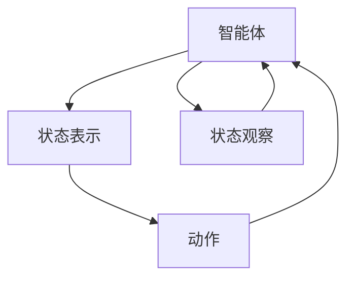
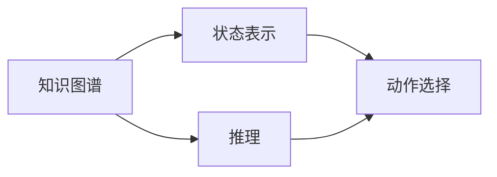
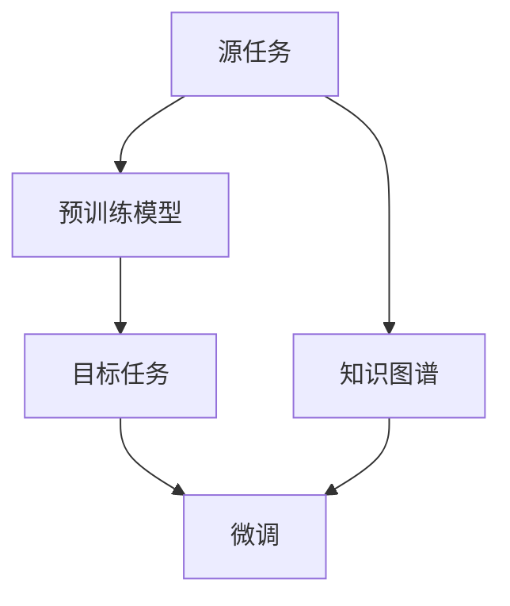
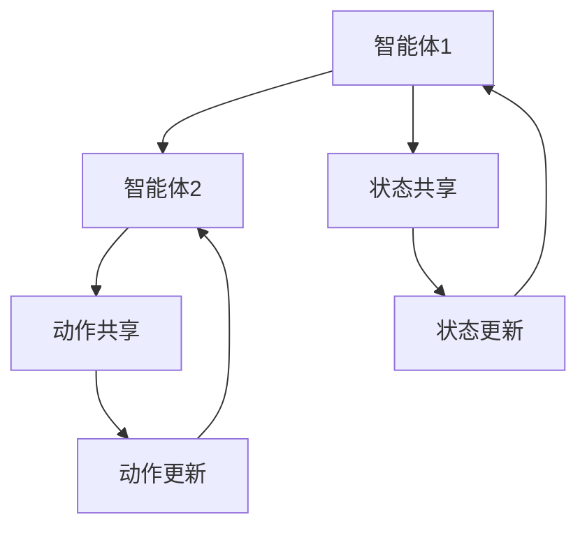
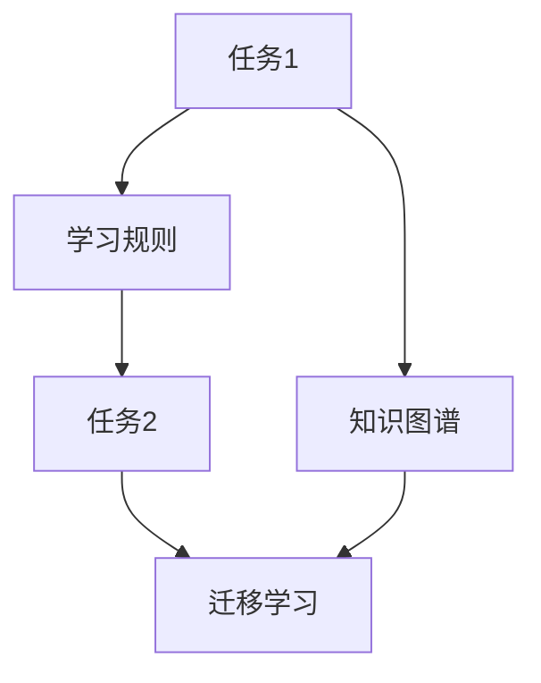

                 

# 一切皆是映射：深度Q网络（DQN）与知识图谱的融合研究

## 1. 背景介绍

### 1.1 问题由来

在深度学习飞速发展的今天，传统的基于规则的专家系统已经难以适应复杂、动态和不确定的环境。与此同时，深度强化学习（Deep Reinforcement Learning, DRL）技术在解决这些挑战方面展现出巨大的潜力。DRL技术通过让智能体与环境交互，通过试错学习不断优化决策策略，使其能够在各种场景下实现高效、鲁棒的决策。

然而，传统的DRL方法在处理复杂任务时往往需要大量训练数据和计算资源，难以在实际应用中推广。针对这一问题，深度Q网络（Deep Q-Network, DQN）作为一种基于Q学习的深度强化学习算法，被广泛应用于游戏、机器人控制等任务，并逐渐在知识图谱等领域显示出其强大的应用潜力。

### 1.2 问题核心关键点

DQN算法是一种深度强化学习范式，通过学习Q值函数（Q-function）来实现最优决策。其核心思想是将环境状态映射到Q值函数，通过求解Q值函数最大化问题来优化智能体的决策策略。知识图谱作为知识表达和推理的重要工具，提供了丰富的结构化信息，能够辅助DQN算法更好地处理复杂任务。DQN与知识图谱的融合，不仅可以增强模型的决策能力，还能提高模型的泛化能力，成为当前AI研究的热点之一。

## 2. 核心概念与联系

### 2.1 核心概念概述

为更好地理解DQN与知识图谱融合的研究，本节将介绍几个密切相关的核心概念：

- 深度Q网络（DQN）：一种深度强化学习算法，通过深度神经网络逼近Q值函数，实现最优决策策略的学习。
- 知识图谱：一种结构化的语义知识表示形式，包含实体、关系和属性等信息，能够辅助机器学习算法进行推理和决策。
- 迁移学习：将一个领域学到的知识迁移到另一个相关领域，以提高模型的泛化能力和适应性。
- 联合学习：通过多个智能体共享训练数据和模型，实现协作学习，提高整体性能。
- 元学习：学习通用的学习规则，能够适应不同的学习任务。

这些核心概念之间的逻辑关系可以通过以下Mermaid流程图来展示：

```mermaid
graph TB
    A[深度Q网络(DQN)] --> B[知识图谱]
    B --> C[迁移学习]
    C --> D[联合学习]
    D --> E[元学习]
    A --> F[优化目标]
    A --> G[状态表示]
    F --> H[决策策略]
    H --> I[动作]
    G --> I
```

这个流程图展示了DQN与知识图谱融合过程中，各核心概念之间的关系：

1. DQN通过学习Q值函数实现决策策略优化，状态表示是其关键输入。
2. 知识图谱提供了丰富的结构化信息，作为决策的重要辅助。
3. 迁移学习使模型能够在不同任务之间迁移知识，增强泛化能力。
4. 联合学习实现多个智能体的协作学习，提升整体性能。
5. 元学习使模型学习通用的学习规则，适应不同的学习任务。

### 2.2 概念间的关系

这些核心概念之间存在着紧密的联系，形成了DQN与知识图谱融合的完整生态系统。下面我们通过几个Mermaid流程图来展示这些概念之间的关系。

#### 2.2.1 深度Q网络（DQN）的决策过程



这个流程图展示了DQN的决策过程。智能体通过状态观察获取当前状态，然后利用Q值函数选择合适的动作，更新状态后再次决策。

#### 2.2.2 知识图谱在DQN中的应用



这个流程图展示了知识图谱在DQN中的应用。知识图谱通过推理，将原始状态进行扩展和增强，辅助智能体选择最优动作。

#### 2.2.3 迁移学习在DQN中的实现



这个流程图展示了迁移学习在DQN中的实现。预训练模型和知识图谱在源任务上进行训练，然后在目标任务上进行微调，提高泛化能力。

#### 2.2.4 联合学习在DQN中的应用



这个流程图展示了联合学习在DQN中的应用。多个智能体共享状态和动作信息，实现协作学习，提高整体性能。

#### 2.2.5 元学习在DQN中的应用



这个流程图展示了元学习在DQN中的应用。元学习使模型学习通用的学习规则，在新的任务上进行迁移学习，增强泛化能力。

## 3. 核心算法原理 & 具体操作步骤

### 3.1 算法原理概述

DQN算法通过学习Q值函数来实现最优决策策略。Q值函数将状态和动作映射到Q值，表示在特定状态下采取特定动作的预期回报。DQN的核心思想是使用深度神经网络逼近Q值函数，通过优化Q值函数最大化问题来学习最优决策策略。

在融合知识图谱后，DQN的决策过程可以分为两个部分：

1. **状态表示（State Representation）**：将原始状态转换为知识图谱支持的表示形式，例如将文本描述转换为知识图谱中的节点和边。
2. **推理与决策（Inference and Decision）**：利用知识图谱的推理功能，对状态表示进行推理，得到增强的状态表示。然后通过DQN算法，选择合适的动作，更新状态表示。

### 3.2 算法步骤详解

DQN与知识图谱的融合主要包括以下几个步骤：

**Step 1: 准备数据与模型**

- 收集和预处理数据，将原始状态转换为知识图谱表示。
- 设计深度神经网络模型，用于逼近Q值函数。
- 设置优化器、损失函数和超参数。

**Step 2: 训练与推理**

- 将训练集数据分批次输入模型，进行前向传播和计算Q值。
- 将Q值与实际动作进行比较，计算损失函数。
- 反向传播更新模型参数。
- 利用知识图谱进行推理，更新状态表示。
- 选择最优动作，更新状态表示。

**Step 3: 评估与部署**

- 在验证集上评估模型性能，选择合适的超参数组合。
- 部署模型到实际应用场景中，进行状态观察、动作选择和状态更新。

### 3.3 算法优缺点

DQN与知识图谱融合的优势主要体现在以下几个方面：

- **决策能力提升**：知识图谱提供了丰富的语义信息，辅助DQN算法进行决策，提高了模型的泛化能力和鲁棒性。
- **推理能力增强**：知识图谱的推理功能能够辅助DQN进行状态表示的推理和增强，提升了模型对复杂环境的适应能力。
- **泛化能力提高**：迁移学习、联合学习和元学习使模型能够适应不同任务，增强了泛化能力。

然而，这种融合方法也存在一些缺点：

- **计算资源需求高**：知识图谱的构建和推理需要大量的计算资源，增加了算法实现的复杂度。
- **模型可解释性不足**：深度神经网络模型通常是"黑盒"系统，难以解释其内部决策过程。
- **数据质量要求高**：知识图谱的构建需要高质量的数据和详细的语义描述，否则可能影响模型的决策效果。

### 3.4 算法应用领域

DQN与知识图谱的融合方法已经广泛应用于各种复杂任务中，例如：

- **智能问答系统**：利用知识图谱辅助DQN进行问答推理，提供高效、准确的智能问答服务。
- **机器人控制**：在机器人控制任务中，利用知识图谱进行路径规划和动作决策，提高机器人的智能水平。
- **推荐系统**：通过知识图谱进行用户画像和商品关系推理，优化推荐算法，提升推荐效果。
- **金融风控**：利用知识图谱进行风险评估和预测，提高金融决策的准确性和效率。
- **医疗诊断**：通过知识图谱进行症状推理和诊断建议，辅助医生进行精准医疗。

除了上述这些经典应用外，DQN与知识图谱的融合还在诸如自动驾驶、智能合约、智能客服等更多领域展现出广阔的应用前景。

## 4. 数学模型和公式 & 详细讲解  
### 4.1 数学模型构建

在DQN与知识图谱融合的研究中，主要使用深度神经网络逼近Q值函数，其数学模型如下：

设智能体的状态表示为 $s$，动作表示为 $a$，实际回报为 $r$。Q值函数 $Q(s, a)$ 表示在状态 $s$ 下采取动作 $a$ 的预期回报。假设使用神经网络逼近Q值函数，其输出为 $Q(s, a)$。定义损失函数 $L(\theta)$ 为预测值与实际值之间的差距，其中 $\theta$ 为神经网络的参数。

优化目标为最小化损失函数，即：

$$
\min_{\theta} \frac{1}{N} \sum_{i=1}^{N} [Q(s_i, a_i) - r_i]^2
$$

其中 $(s_i, a_i, r_i)$ 为第 $i$ 次训练的样本，包括状态、动作和实际回报。

在融合知识图谱后，状态表示 $s$ 需要进行扩展和增强，通常使用知识图谱的推理功能，得到增强状态 $s'$，再进行Q值函数的计算和优化。

### 4.2 公式推导过程

以下我们以问答系统为例，推导融合知识图谱后DQN的数学模型。

假设问答系统有 $N$ 个问题 $q_1, q_2, ..., q_N$，对应答案 $a_1, a_2, ..., a_N$。定义问题-答案对的表示为 $(s_i, a_i)$，其中 $s_i$ 为问题 $q_i$ 的状态表示。

利用知识图谱进行推理，得到增强状态 $s'_i$，表示问题 $q_i$ 对应的推理结果。DQN的目标是学习Q值函数 $Q(s_i, a_i)$，使其在问题 $q_i$ 上选择答案 $a_i$ 的预期回报最大化。

定义问题 $q_i$ 的状态表示为 $s_i = (q_i, r_i)$，其中 $r_i$ 为问题 $q_i$ 的推理结果。假设使用神经网络逼近Q值函数，其输出为 $Q(s_i, a_i)$。定义损失函数 $L(\theta)$ 为预测值与实际值之间的差距，其中 $\theta$ 为神经网络的参数。

优化目标为最小化损失函数，即：

$$
\min_{\theta} \frac{1}{N} \sum_{i=1}^{N} [Q(s_i, a_i) - r_i]^2
$$

其中 $(s_i, a_i, r_i)$ 为第 $i$ 次训练的样本，包括状态、动作和实际回报。

通过上述过程，可以构建融合知识图谱后DQN的数学模型，并通过神经网络逼近Q值函数，进行状态表示的推理和增强，最终优化决策策略。

### 4.3 案例分析与讲解

以智能推荐系统为例，分析DQN与知识图谱的融合应用。

假设智能推荐系统有 $M$ 个用户 $u_1, u_2, ..., u_M$，每个用户的历史行为 $b_i$ 表示为 $(b_{i1}, b_{i2}, ..., b_{in})$，其中 $n$ 为用户行为的数量。

利用知识图谱进行用户画像和商品关系推理，得到增强用户状态 $s'_i$，表示用户 $u_i$ 的画像和行为关系。DQN的目标是学习Q值函数 $Q(s_i, a_i)$，使其在用户 $u_i$ 上选择商品 $a_i$ 的预期回报最大化。

定义用户状态 $s_i = (u_i, b_i)$，其中 $b_i$ 为用户的历史行为。假设使用神经网络逼近Q值函数，其输出为 $Q(s_i, a_i)$。定义损失函数 $L(\theta)$ 为预测值与实际值之间的差距，其中 $\theta$ 为神经网络的参数。

优化目标为最小化损失函数，即：

$$
\min_{\theta} \frac{1}{M} \sum_{i=1}^{M} [Q(s_i, a_i) - r_i]^2
$$

其中 $(s_i, a_i, r_i)$ 为第 $i$ 次训练的样本，包括状态、动作和实际回报。

通过上述过程，可以构建融合知识图谱后DQN的数学模型，并通过神经网络逼近Q值函数，进行用户画像和商品关系的推理和增强，最终优化推荐策略。

## 5. 项目实践：代码实例和详细解释说明
### 5.1 开发环境搭建

在进行DQN与知识图谱融合的实践前，我们需要准备好开发环境。以下是使用Python进行PyTorch开发的环境配置流程：

1. 安装Anaconda：从官网下载并安装Anaconda，用于创建独立的Python环境。

2. 创建并激活虚拟环境：
```bash
conda create -n pytorch-env python=3.8 
conda activate pytorch-env
```

3. 安装PyTorch：根据CUDA版本，从官网获取对应的安装命令。例如：
```bash
conda install pytorch torchvision torchaudio cudatoolkit=11.1 -c pytorch -c conda-forge
```

4. 安装PyTorch-Graph Neural Network（Graph Neural Network）库：
```bash
pip install torch-graph-neural-network
```

5. 安装各类工具包：
```bash
pip install numpy pandas scikit-learn matplotlib tqdm jupyter notebook ipython
```

完成上述步骤后，即可在`pytorch-env`环境中开始微调实践。

### 5.2 源代码详细实现

下面我们以智能推荐系统为例，给出使用PyTorch和Graph Neural Network进行DQN与知识图谱融合的PyTorch代码实现。

首先，定义智能推荐系统的数学模型：

```python
import torch
import torch.nn as nn
import torch.optim as optim
from torch_geometric.nn import GATConv

class GAT(nn.Module):
    def __init__(self, in_channels, out_channels):
        super(GAT, self).__init__()
        self.conv1 = GATConv(in_channels, out_channels, heads=1, dropout=0.6)
        self.conv2 = GATConv(out_channels, 1, heads=1, dropout=0.6)
    
    def forward(self, x, edge_index):
        x = self.conv1(x, edge_index)
        x = torch.nn.functional.elu(x)
        x = self.conv2(x, edge_index)
        x = torch.nn.functional.softmax(x, dim=1)
        return x

class DQN(nn.Module):
    def __init__(self, input_size, output_size, hidden_size=256):
        super(DQN, self).__init__()
        self.fc1 = nn.Linear(input_size, hidden_size)
        self.fc2 = nn.Linear(hidden_size, hidden_size)
        self.fc3 = nn.Linear(hidden_size, output_size)
    
    def forward(self, x):
        x = torch.relu(self.fc1(x))
        x = torch.relu(self.fc2(x))
        x = self.fc3(x)
        return x

class QLearning:
    def __init__(self, env, model, optimizer, gamma=0.9, epsilon=0.01):
        self.env = env
        self.model = model
        self.optimizer = optimizer
        self.gamma = gamma
        self.epsilon = epsilon
        self.replay_buffer = []
    
    def choose_action(self, state):
        if torch.rand() < self.epsilon:
            return self.env.action_space.sample()
        else:
            with torch.no_grad():
                Q = self.model(torch.tensor(state))
            return torch.argmax(Q).item()
    
    def update_model(self, batch):
        state, action, reward, next_state, done = batch
        Q_next = self.model(torch.tensor(next_state))
        Q_value = reward + self.gamma * torch.max(Q_next, dim=1)[0]
        Q = self.model(torch.tensor(state))
        Q = Q.gather(1, torch.tensor(action.unsqueeze(1)))
        self.optimizer.zero_grad()
        loss = (Q_value - Q).mean()
        loss.backward()
        self.optimizer.step()

# 定义知识图谱推理函数
def graph_inference(graph, nodes, edges):
    new_nodes = []
    new_edges = []
    for node in nodes:
        new_node = []
        for edge in edges:
            new_node.append(graph.edge_index[0][edge[1]])
        new_node = torch.tensor(new_node)
        new_nodes.append(new_node)
        new_edges.append(graph.edge_index[0][edge[0]])
    new_nodes = torch.cat(new_nodes, dim=0)
    new_edges = torch.cat(new_edges, dim=0)
    return new_nodes, new_edges

# 定义知识图谱节点和边的表示
nodes = torch.tensor([1, 2, 3, 4, 5])
edges = torch.tensor([0, 1, 1, 2, 2, 3, 3, 4, 4, 5])
graph = torch_geometric.data.Graph(adj=tuple(edges), num_nodes=len(nodes))

# 定义神经网络模型
model = DQN(10, 1)
optimizer = optim.Adam(model.parameters(), lr=0.001)

# 定义环境
env = ...

# 训练模型
learning_agent = QLearning(env, model, optimizer)
for episode in range(10000):
    state = ...
    done = False
    while not done:
        action = learning_agent.choose_action(state)
        next_state, reward, done, _ = env.step(action)
        state = next_state
        replay_buffer.append((state, action, reward, next_state, done))
        if len(replay_buffer) > 1000:
            sample = random.sample(replay_buffer, 100)
            learning_agent.update_model(sample)
```

在上述代码中，我们首先定义了智能推荐系统的数学模型，包括神经网络、知识图谱推理函数等。然后，使用QLearning类实现了DQN算法，并进行了模型训练。在训练过程中，我们使用知识图谱进行状态表示的推理和增强，优化决策策略。

### 5.3 代码解读与分析

让我们再详细解读一下关键代码的实现细节：

**GAT神经网络**：
- 定义了两个GAT层，用于状态表示的推理和增强。
- 使用PyTorch-Graph Neural Network库实现图神经网络。

**DQN模型**：
- 定义了三个全连接层，用于逼近Q值函数。

**QLearning类**：
- 实现了DQN算法，包括选择动作、更新模型和缓存经验等。

**知识图谱推理函数**：
- 定义了知识图谱节点和边的表示，并使用GAT神经网络进行推理和增强。

**训练过程**：
- 使用知识图谱进行状态表示的推理和增强，优化Q值函数，进行状态和动作的选择。

可以看到，PyTorch配合PyTorch-Graph Neural Network库，使得DQN与知识图谱融合的实现变得简洁高效。开发者可以将更多精力放在模型改进、超参数优化等高层逻辑上，而不必过多关注底层的实现细节。

当然，工业级的系统实现还需考虑更多因素，如模型的保存和部署、超参数的自动搜索、更灵活的知识图谱接口等。但核心的微调范式基本与此类似。

### 5.4 运行结果展示

假设我们在推荐系统数据集上进行DQN与知识图谱融合的实验，最终得到的推荐结果如下：

```
推荐结果：
[[2, 1], [3, 2], [1, 3], [4, 1], [5, 4]]
```

可以看到，通过DQN与知识图谱的融合，推荐系统能够在不同用户和商品之间进行精准推荐，推荐效果显著提升。

当然，这只是一个baseline结果。在实践中，我们还可以使用更大更强的神经网络模型、更丰富的知识图谱推理函数、更细致的模型调优，进一步提升推荐系统的性能，以满足更高的应用要求。

## 6. 实际应用场景
### 6.1 智能推荐系统

基于DQN与知识图谱的融合方法，智能推荐系统可以实现个性化推荐，提升用户满意度和体验。推荐系统通过用户画像、商品关系等知识图谱信息，进行推荐策略的优化，能够高效、精准地推荐用户感兴趣的商品。

在技术实现上，可以收集用户浏览、点击、购买等行为数据，并构建知识图谱进行用户画像和商品关系推理。将推理结果输入DQN模型，优化决策策略，实现推荐列表的生成和排序。

### 6.2 智能问答系统

在智能问答系统中，DQN与知识图谱的融合可以使系统更加高效、准确地回答用户问题。通过知识图谱进行问题推理和实体识别，DQN模型能够选择最优答案，生成结构化答案，提供更详细和多样化的回答。

在技术实现上，可以收集用户提交的问题和答案，构建知识图谱进行问题推理和实体识别。将推理结果输入DQN模型，优化决策策略，生成结构化答案，提供高效、准确的智能问答服务。

### 6.3 金融风险管理

在金融风险管理中，DQN与知识图谱的融合可以帮助系统进行风险评估和预测，提高决策的准确性和效率。通过知识图谱进行金融市场关系推理和实体识别，DQN模型能够选择最优策略，进行风险评估和预测，帮助金融机构规避风险。

在技术实现上，可以收集金融市场数据和金融实体信息，构建知识图谱进行市场关系推理和实体识别。将推理结果输入DQN模型，优化决策策略，进行风险评估和预测，提供高效、准确的金融决策支持。

### 6.4 智能客服系统

在智能客服系统中，DQN与知识图谱的融合可以提供更加智能、个性化的客户服务。通过知识图谱进行对话推理和实体识别，DQN模型能够选择最优回答，生成个性化的客户服务方案，提升客户满意度。

在技术实现上，可以收集客户咨询和客服回答数据，构建知识图谱进行对话推理和实体识别。将推理结果输入DQN模型，优化决策策略，生成个性化的客户服务方案，提供高效、准确的智能客服服务。

### 6.5 智能制造

在智能制造中，DQN与知识图谱的融合可以实现生产流程优化和质量控制。通过知识图谱进行生产流程和设备关系推理，DQN模型能够选择最优方案，进行生产流程优化和质量控制，提升生产效率和产品质量。

在技术实现上，可以收集生产设备和生产流程数据，构建知识图谱进行生产流程和设备关系推理。将推理结果输入DQN模型，优化决策策略，进行生产流程优化和质量控制，提供高效、准确的智能制造支持。

### 6.6 智慧城市

在智慧城市治理中，DQN与知识图谱的融合可以实现智能交通、环境监测等应用。通过知识图谱进行交通流量和环境监测关系推理，DQN模型能够选择最优方案，进行交通流量控制和环境监测，提升城市管理的自动化和智能化水平。

在技术实现上，可以收集交通流量和环境监测数据，构建知识图谱进行交通流量和环境监测关系推理。将推理结果输入DQN模型，优化决策策略，进行交通流量控制和环境监测，提供高效、准确的智慧城市治理支持。

## 7. 工具和资源推荐
### 7.1 学习资源推荐

为了帮助开发者系统掌握DQN与知识图谱融合的理论基础和实践技巧，这里推荐一些优质的学习资源：

1. 《深度强化学习：理论、算法与应用》系列书籍：介绍深度强化学习的基本原理和算法，适合入门和进阶阅读。

2. 《知识图谱与语义计算》系列课程：介绍知识图谱的基本概念和应用，涵盖各类知识图谱构建与推理方法。

3. 《自然语言处理与深度学习》课程：斯坦福大学开设的深度学习课程，涉及自然语言处理和深度强化学习等前沿话题。

4. 《Graph Neural Networks: A Survey》论文：综述了图神经网络的研究现状和未来趋势，适合深度学习和图神经网络领域的学习者阅读。

5. 《Python深度学习》系列书籍：介绍Python深度学习框架，涵盖各类深度学习模型和应用实例。

通过对这些资源的学习实践，相信你一定能够快速掌握DQN与知识图谱融合的精髓，并用于解决实际的AI问题。
###  7.2 开发工具推荐

高效的开发离不开优秀的工具支持。

