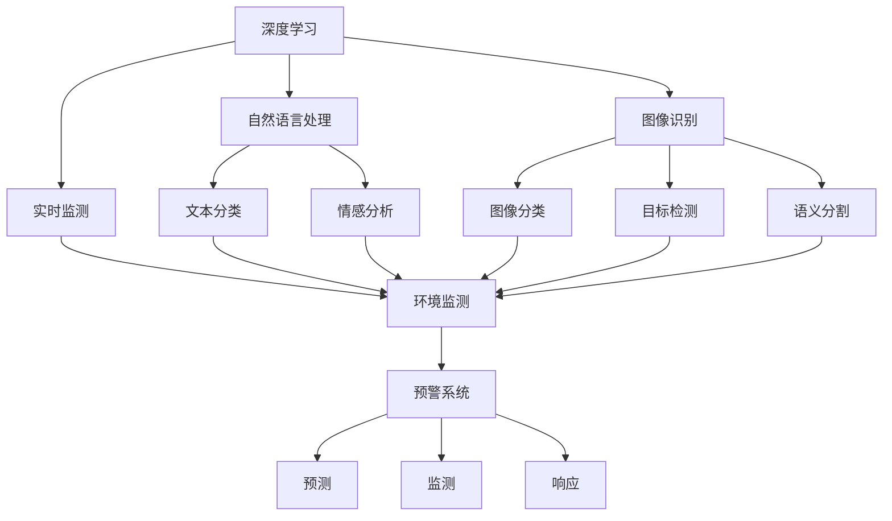
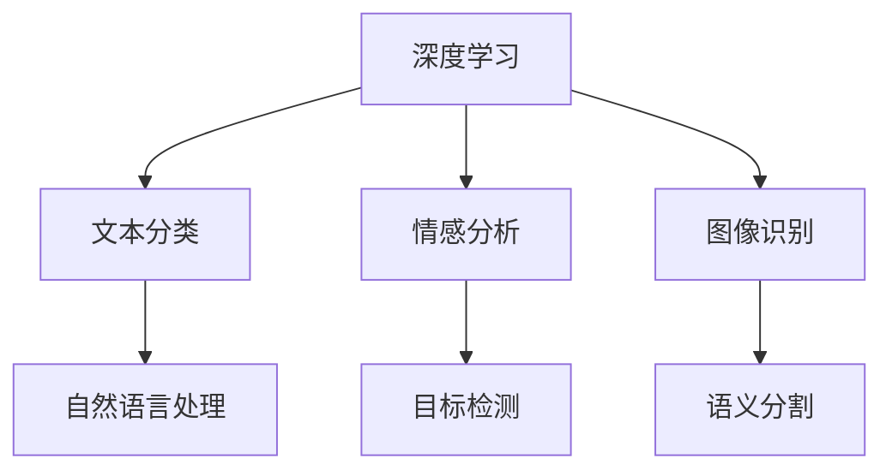
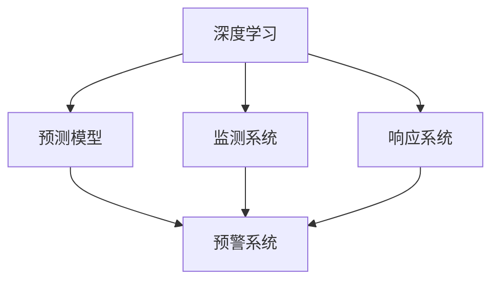
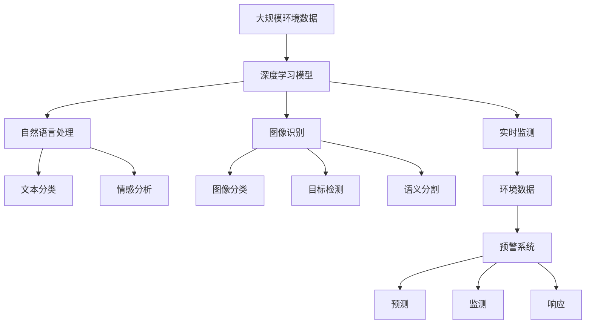

                 

# 一切皆是映射：深度学习在灾害预防与响应中的应用

> 关键词：深度学习, 灾害预防, 响应, 图像识别, 自然语言处理, 预警系统, 实时监测, 灾难预测

## 1. 背景介绍

### 1.1 问题由来
近年来，自然灾害频发，给人类社会带来了巨大损失。从地震、洪水到台风、干旱，各种自然灾害严重威胁着人们的生命和财产安全。如何提前预警，减少灾害损失，成为了社会关注的焦点。

传统的灾害预警系统主要依靠人力监测和物理仪器。但随着数据量的爆炸式增长，这种方式已经难以应对实时需求的挑战。深度学习技术的崛起，为灾害预警提供了新的解决方案。通过深度学习模型，可以从海量的历史和实时数据中提取出有价值的信息，实现对灾害的精准预测和高效响应。

### 1.2 问题核心关键点
基于深度学习的灾害预警系统，能够自动分析灾害数据，预测灾害的发生，并实时监测和响应灾害变化。主要包括以下几个关键点：

- 数据获取：收集历史灾害数据和实时环境数据，为模型训练提供数据支撑。
- 模型构建：选择合适的深度学习模型进行灾害预测和监测。
- 训练优化：在大量数据上训练模型，优化模型参数，提升预测精度。
- 实时应用：将训练好的模型部署到生产环境，实时监测和响应灾害。

### 1.3 问题研究意义
深度学习在灾害预警和响应中的应用，具有重要意义：

- 提高灾害预测准确性：通过深度学习模型，可以从复杂的数据中提取出有用的特征，实现更准确的灾害预测。
- 提升应急响应效率：实时监测和预测，能够在灾害发生前采取应对措施，减少人员和财产损失。
- 优化资源配置：深度学习模型能够分析灾害趋势，帮助政府和机构优化资源配置，提高灾害响应效率。
- 降低灾害成本：及时预警和响应，可以避免次生灾害的发生，降低灾害造成的长远损失。

## 2. 核心概念与联系

### 2.1 核心概念概述

为更好地理解基于深度学习的灾害预警系统，本节将介绍几个密切相关的核心概念：

- 深度学习（Deep Learning）：利用神经网络对数据进行非线性映射，提取高级特征，用于分类、回归、生成等多种任务。
- 自然语言处理（Natural Language Processing, NLP）：利用深度学习模型处理和理解自然语言，实现文本分类、情感分析、问答系统等任务。
- 图像识别（Image Recognition）：利用深度学习模型对图像进行分类、检测、分割等任务。
- 实时监测（Real-time Monitoring）：利用传感器、摄像头等设备实时收集环境数据，进行数据处理和分析，实现实时预警。
- 预警系统（Early Warning System）：结合深度学习模型、实时监测、数据存储等功能，实现对自然灾害的实时预测和预警。

这些核心概念之间的逻辑关系可以通过以下Mermaid流程图来展示：



这个流程图展示了大语言模型微调过程中各个核心概念之间的关系：

1. 深度学习是大语言模型的基础，通过神经网络对数据进行映射，提取高级特征。
2. 自然语言处理和图像识别是深度学习的重要应用，用于处理文本和图像数据。
3. 实时监测提供环境数据，用于预测和监测灾害。
4. 预警系统整合深度学习模型、实时监测和数据存储，实现对灾害的实时预警。

### 2.2 概念间的关系

这些核心概念之间存在着紧密的联系，形成了深度学习在灾害预警和响应中的应用框架。下面我们通过几个Mermaid流程图来展示这些概念之间的关系。

#### 2.2.1 深度学习的应用范式



这个流程图展示了深度学习在文本和图像领域的应用范式。深度学习模型可以处理文本分类、情感分析等NLP任务，也可以用于图像识别、目标检测等计算机视觉任务。

#### 2.2.2 实时监测与预警系统的联系


这个流程图展示了实时监测与预警系统的关系。实时监测设备收集环境数据，通过深度学习模型进行分析和预测，预警系统根据预测结果进行实时预警。

#### 2.2.3 深度学习在预警系统中的应用



这个流程图展示了深度学习在预警系统中的具体应用。深度学习模型用于灾害预测，监测系统实时监测环境变化，响应系统根据预测结果进行响应。

### 2.3 核心概念的整体架构

最后，我们用一个综合的流程图来展示这些核心概念在大语言模型微调过程中的整体架构：



这个综合流程图展示了从数据获取到预警系统的完整过程。环境数据通过深度学习模型进行预测和监测，预警系统根据预测结果进行实时预警和响应。

## 3. 核心算法原理 & 具体操作步骤
### 3.1 算法原理概述

基于深度学习的灾害预警系统，通常采用以下步骤：

1. **数据预处理**：收集历史和实时环境数据，进行清洗和标注，为模型训练提供数据集。
2. **模型构建**：选择合适的深度学习模型进行灾害预测和监测。
3. **训练优化**：在大量数据上训练模型，优化模型参数，提升预测精度。
4. **实时应用**：将训练好的模型部署到生产环境，实时监测和响应灾害。

深度学习模型通常包括卷积神经网络（CNN）、循环神经网络（RNN）和变分自编码器（VAE）等多种架构。这些模型在图像处理、序列分析和生成等方面具有优势，能够处理大规模高维数据，提取高级特征。

### 3.2 算法步骤详解

以下我们以图像识别和实时监测为例，详细讲解基于深度学习的灾害预警系统构建的具体步骤。

**Step 1: 数据预处理**

1. **数据收集**：从气象、地质、海洋等多个领域收集历史和实时环境数据。
2. **数据清洗**：去除异常数据，确保数据质量。
3. **数据标注**：对数据进行标注，生成训练集和验证集。

**Step 2: 模型构建**

1. **选择模型**：根据任务需求选择合适的深度学习模型。如CNN用于图像分类，RNN用于序列分析。
2. **网络设计**：设计网络结构，包括卷积层、池化层、全连接层等。
3. **超参数设置**：设置模型参数，如学习率、批大小、迭代轮数等。

**Step 3: 训练优化**

1. **模型训练**：在训练集上训练模型，通过反向传播更新参数。
2. **评估验证**：在验证集上评估模型性能，调整模型参数。
3. **模型优化**：使用正则化、Dropout等技术避免过拟合。

**Step 4: 实时应用**

1. **模型部署**：将训练好的模型部署到生产环境，实时监测环境数据。
2. **预警系统**：根据预测结果进行实时预警，通知相关人员采取措施。
3. **数据存储**：保存历史数据和模型输出，供后续分析和改进。

### 3.3 算法优缺点

基于深度学习的灾害预警系统有以下优点：

- 预测准确性高：深度学习模型能够处理大规模高维数据，提取高级特征，实现更准确的灾害预测。
- 实时响应能力强：实时监测和预测，能够在灾害发生前采取应对措施，减少人员和财产损失。
- 适应性广：深度学习模型能够处理不同类型的灾害数据，如地震、洪水、台风等。

但同时，该方法也存在一些缺点：

- 数据需求大：深度学习模型需要大量的标注数据进行训练，数据获取和标注成本高。
- 模型复杂度高：深度学习模型参数众多，训练和推理耗时较长。
- 可解释性不足：深度学习模型通常是"黑盒"系统，难以解释其内部工作机制和决策逻辑。

### 3.4 算法应用领域

基于深度学习的灾害预警系统已经在多个领域得到应用，例如：

- 气象预测：利用气象卫星数据，进行洪水、台风等自然灾害的预测。
- 地质监测：利用遥感数据，进行地质灾害如滑坡、泥石流的监测和预警。
- 海洋预警：利用海洋观测数据，进行海啸、风暴等海洋灾害的预测。
- 洪水监测：利用水文数据，进行洪水灾害的实时监测和预警。

除了上述这些应用，深度学习在灾害预警和响应中的应用还在不断扩展，涉及更多类型的自然灾害和应用场景。

## 4. 数学模型和公式 & 详细讲解  
### 4.1 数学模型构建

在本节中，我们将以图像识别为例，使用数学语言对深度学习模型的构建和训练过程进行更加严格的刻画。

假设输入数据为 $x \in \mathbb{R}^m$，目标变量为 $y \in \{0,1\}$，深度学习模型为 $f(x; \theta)$，其中 $\theta$ 为模型参数。

定义模型 $f(x; \theta)$ 在输入 $x$ 上的损失函数为 $\ell(f(x; \theta),y)$，则在训练集上经验风险为：

$$
\mathcal{L}(\theta) = \frac{1}{N}\sum_{i=1}^N \ell(f(x_i; \theta),y_i)
$$

其中 $N$ 为样本数量。常见的损失函数包括交叉熵损失、均方误差损失等。

深度学习模型的优化目标是最小化经验风险，即找到最优参数：

$$
\theta^* = \mathop{\arg\min}_{\theta} \mathcal{L}(\theta)
$$

在实践中，我们通常使用基于梯度的优化算法（如SGD、Adam等）来近似求解上述最优化问题。设 $\eta$ 为学习率，则参数的更新公式为：

$$
\theta \leftarrow \theta - \eta \nabla_{\theta}\mathcal{L}(\theta)
$$

其中 $\nabla_{\theta}\mathcal{L}(\theta)$ 为损失函数对参数 $\theta$ 的梯度，可通过反向传播算法高效计算。

### 4.2 公式推导过程

以下我们以二分类任务为例，推导交叉熵损失函数及其梯度的计算公式。

假设模型 $f(x; \theta)$ 在输入 $x$ 上的输出为 $\hat{y}=f(x; \theta) \in [0,1]$，表示样本属于正类的概率。真实标签 $y \in \{0,1\}$。则二分类交叉熵损失函数定义为：

$$
\ell(f(x; \theta),y) = -[y\log \hat{y} + (1-y)\log(1-\hat{y})]
$$

将其代入经验风险公式，得：

$$
\mathcal{L}(\theta) = -\frac{1}{N}\sum_{i=1}^N [y_i\log f(x_i; \theta)+(1-y_i)\log(1-f(x_i; \theta))]
$$

根据链式法则，损失函数对参数 $\theta_k$ 的梯度为：

$$
\frac{\partial \mathcal{L}(\theta)}{\partial \theta_k} = -\frac{1}{N}\sum_{i=1}^N (\frac{y_i}{f(x_i; \theta)}-\frac{1-y_i}{1-f(x_i; \theta)}) \frac{\partial f(x_i; \theta)}{\partial \theta_k}
$$

其中 $\frac{\partial f(x_i; \theta)}{\partial \theta_k}$ 可进一步递归展开，利用自动微分技术完成计算。

在得到损失函数的梯度后，即可带入参数更新公式，完成模型的迭代优化。重复上述过程直至收敛，最终得到适应灾害预测任务的最优模型参数 $\theta^*$。

## 5. 项目实践：代码实例和详细解释说明
### 5.1 开发环境搭建

在进行灾害预警系统开发前，我们需要准备好开发环境。以下是使用Python进行TensorFlow开发的环境配置流程：

1. 安装Anaconda：从官网下载并安装Anaconda，用于创建独立的Python环境。

2. 创建并激活虚拟环境：
```bash
conda create -n tensorflow-env python=3.8 
conda activate tensorflow-env
```

3. 安装TensorFlow：根据CUDA版本，从官网获取对应的安装命令。例如：
```bash
conda install tensorflow tensorflow-gpu -c conda-forge
```

4. 安装各类工具包：
```bash
pip install numpy pandas scikit-learn matplotlib tensorflow-addons
```

完成上述步骤后，即可在`tensorflow-env`环境中开始系统开发。

### 5.2 源代码详细实现

这里我们以图像识别为例，给出使用TensorFlow对深度学习模型进行图像分类训练的完整代码实现。

首先，定义数据处理函数：

```python
import tensorflow as tf
from tensorflow.keras.preprocessing.image import ImageDataGenerator

train_dir = 'train/'
val_dir = 'val/'

train_datagen = ImageDataGenerator(rescale=1./255,
                                   shear_range=0.2,
                                   zoom_range=0.2,
                                   horizontal_flip=True)

train_generator = train_datagen.flow_from_directory(
    train_dir,
    target_size=(150, 150),
    batch_size=32,
    class_mode='binary')

val_datagen = ImageDataGenerator(rescale=1./255)

val_generator = val_datagen.flow_from_directory(
    val_dir,
    target_size=(150, 150),
    batch_size=32,
    class_mode='binary')
```

然后，定义模型和优化器：

```python
from tensorflow.keras.applications.resnet50 import ResNet50
from tensorflow.keras.layers import GlobalAveragePooling2D
from tensorflow.keras.models import Model

base_model = ResNet50(weights='imagenet',
                      include_top=False,
                      input_shape=(150, 150, 3))

x = base_model.output
x = GlobalAveragePooling2D()(x)
x = tf.keras.layers.Dense(1024, activation='relu')(x)
predictions = tf.keras.layers.Dense(1, activation='sigmoid')(x)

model = Model(inputs=base_model.input, outputs=predictions)

model.compile(optimizer=tf.keras.optimizers.Adam(lr=1e-4),
              loss='binary_crossentropy',
              metrics=['accuracy'])
```

接着，定义训练和评估函数：

```python
epochs = 100
steps_per_epoch = train_generator.n // train_generator.batch_size

def train_epoch(model, train_generator, val_generator):
    model.fit(train_generator,
              steps_per_epoch=steps_per_epoch,
              validation_data=val_generator,
              validation_steps=val_generator.n // val_generator.batch_size,
              epochs=epochs)
    print('Epoch {} finished'.format(epoch))
    val_loss, val_acc = model.evaluate(val_generator, verbose=0)
    print('Validation accuracy: {}'.format(val_acc))
```

最后，启动训练流程并在测试集上评估：

```python
train_epoch(model, train_generator, val_generator)
```

以上就是使用TensorFlow对深度学习模型进行图像分类训练的完整代码实现。可以看到，通过TensorFlow的API，代码实现变得简洁高效。

### 5.3 代码解读与分析

让我们再详细解读一下关键代码的实现细节：

**ImageDataGenerator类**：
- `rescale`参数：将像素值归一化到0-1之间。
- `shear_range`参数：对图像进行随机剪切变换。
- `zoom_range`参数：对图像进行随机缩放变换。
- `horizontal_flip`参数：对图像进行随机水平翻转变换。

**ResNet50模型**：
- 继承自`tensorflow.keras.applications.resnet50.ResNet50`，用于初始化预训练的ResNet50模型。
- 在顶层添加全连接层，进行二分类预测。

**模型编译**：
- 使用`tensorflow.keras.optimizers.Adam`作为优化器。
- 设置损失函数为`binary_crossentropy`，适用于二分类任务。
- 设置评估指标为`accuracy`。

**训练函数**：
- 使用`fit`方法训练模型。
- 设置训练和验证的样本数量。
- 使用`evaluate`方法评估模型性能。

**训练流程**：
- 定义总的epoch数。
- 每个epoch内，先训练模型，再评估模型性能。

可以看到，TensorFlow框架使得深度学习模型的构建和训练变得相对简单，便于快速迭代和实验。当然，工业级的系统实现还需考虑更多因素，如模型的保存和部署、超参数的自动搜索、更灵活的任务适配层等。但核心的微调范式基本与此类似。

## 6. 实际应用场景
### 6.1 气象预测系统

气象预测系统通过深度学习模型，对卫星遥感数据进行分析，预测气象灾害的发生。具体实现流程如下：

1. **数据收集**：收集气象卫星的遥感数据，包括温度、湿度、风速等指标。
2. **数据预处理**：对数据进行清洗、归一化和标准化处理，确保数据质量。
3. **模型训练**：使用历史数据训练深度学习模型，优化模型参数。
4. **实时预测**：将实时遥感数据输入模型，进行灾害预测。
5. **预警系统**：根据预测结果进行实时预警，通知相关人员采取措施。

例如，一个气象预测系统可以使用CNN模型对气象卫星图像进行分类，预测洪水、台风等灾害的发生。通过实时监测和预测，能够在灾害发生前及时预警，减少人员和财产损失。

### 6.2 地质灾害监测系统

地质灾害监测系统利用深度学习模型，对地质数据进行分析，预测地质灾害的发生。具体实现流程如下：

1. **数据收集**：收集地质数据，包括地形、地质构造、岩性等信息。
2. **数据预处理**：对数据进行清洗、归一化和标准化处理，确保数据质量。
3. **模型训练**：使用历史数据训练深度学习模型，优化模型参数。
4. **实时监测**：将实时地质数据输入模型，进行灾害预测。
5. **预警系统**：根据预测结果进行实时预警，通知相关人员采取措施。

例如，一个地质灾害监测系统可以使用CNN模型对地质图像进行分类，预测滑坡、泥石流等灾害的发生。通过实时监测和预测，能够在灾害发生前及时预警，减少人员和财产损失。

### 6.3 海洋预警系统

海洋预警系统利用深度学习模型，对海洋数据进行分析，预测海洋灾害的发生。具体实现流程如下：

1. **数据收集**：收集海洋数据，包括水温、盐度、水位等信息。
2. **数据预处理**：对数据进行清洗、归一化和标准化处理，确保数据质量。
3. **模型训练**：使用历史数据训练深度学习模型，优化模型参数。
4. **实时监测**：将实时海洋数据输入模型，进行灾害预测。
5. **预警系统**：根据预测结果进行实时预警，通知相关人员采取措施。

例如，一个海洋预警系统可以使用CNN模型对海洋图像进行分类，预测海啸、风暴等灾害的发生。通过实时监测和预测，能够在灾害发生前及时预警，减少人员和财产损失。

### 6.4 洪水监测系统

洪水监测系统利用深度学习模型，对水文数据进行分析，预测洪水灾害的发生。具体实现流程如下：

1. **数据收集**：收集水文数据，包括水位、流量、流速等信息。
2. **数据预处理**：对数据进行清洗、归一化和标准化处理，确保数据质量。
3. **模型训练**：使用历史数据训练深度学习模型，优化模型参数。
4. **实时监测**：将实时水文数据输入模型，进行灾害预测。
5. **预警系统**：根据预测结果进行实时预警，通知相关人员采取措施。

例如，一个洪水监测系统可以使用CNN模型对洪水图像进行分类，预测洪水灾害的发生。通过实时监测和预测，能够在灾害发生前及时预警，减少人员和财产损失。

## 7. 工具和资源推荐
### 7.1 学习资源推荐

为了帮助开发者系统掌握深度学习在灾害预警系统中的应用，这里推荐一些优质的学习资源：

1. 《深度学习理论与实践》系列博文：由大模型技术专家撰写，深入浅出地介绍了深度学习的基本概念和经典模型。

2. CS231n《深度学习与计算机视觉》课程：斯坦福大学开设的计算机视觉明星课程，有Lecture视频和配套作业，带你入门深度学习与计算机视觉。

3. 《TensorFlow实战深度学习》书籍：TensorFlow官方文档，全面介绍了TensorFlow框架的使用方法和应用实践。

4. Kaggle数据竞赛：通过参加Kaggle数据竞赛，实践深度学习在实际应用中的优化和创新。

5. Google AI Lab博客：谷歌AI团队发布的前沿研究成果和代码实现，学习最新技术进展。

通过对这些资源的学习实践，相信你一定能够快速掌握深度学习在灾害预警系统中的应用。

### 7.2 开发工具推荐

高效的开发离不开优秀的工具支持。以下是几款用于深度学习模型训练和预测的常用工具：

1. TensorFlow：由Google主导开发的开源深度学习框架，生产部署方便，适合大规模工程应用。

2. PyTorch：基于Python的开源深度学习框架，灵活动态的计算图，适合快速迭代研究。

3. TensorFlow Addons：TensorFlow官方推出的功能增强包，包括模型优化、分布式训练等实用工具。

4. Scikit-learn：简单易用的机器学习库，提供了丰富的算法和工具，适合快速原型开发。

5. Keras：基于TensorFlow和Theano的高级神经网络API，方便快速搭建和训练深度学习模型。

6. Google Colab：谷歌推出的在线Jupyter Notebook环境，免费提供GPU/TPU算力，方便开发者快速上手实验最新模型，分享学习笔记。

合理利用这些工具，可以显著提升深度学习模型的开发效率，加快创新迭代的步伐。

### 7.3 相关论文推荐

深度学习在灾害预警系统中的应用源于学界的持续研究。以下是几篇奠基性的相关论文，推荐阅读：

1. Deep Residual Learning for Image Recognition（ResNet）：提出ResNet模型，实现了深度神经网络的训练和优化。

2. ImageNet Classification with Deep Convolutional Neural Networks：提出AlexNet模型，开创了深度学习在计算机视觉领域的先河。

3. Efficient Object Localization Using Convolutional Networks（Fast R-CNN）：提出Fast R-CNN模型，提高了目标检测的精度和速度。

4. Real-time Semantic Segmentation with Fully Convolutional Networks：提出FCN模型，实现了实时语义分割。

5. Deep Multi-scale Video Prediction Beyond Mean Square Error：提出使用深度学习模型进行视频预测，预测自然灾害的发生。

6. Deep Reinforcement Learning for Parameterized Sensor Deployment：提出使用深度学习模型进行传感器部署，优化灾害监测资源配置。

这些论文代表了大模型在深度学习在灾害预警系统中的应用方向。通过学习这些前沿成果，可以帮助研究者把握学科前进方向，激发更多的创新灵感。

除上述资源外，还有一些值得关注的前沿资源，帮助开发者紧跟深度学习在灾害预警系统中的最新进展，例如：

1. arXiv论文预印本：人工智能领域最新研究成果的发布平台，包括大量尚未发表的前沿工作，学习前沿技术的必读资源。

2. 业界技术博客：如OpenAI、Google AI、DeepMind、微软Research Asia等顶尖实验室的官方博客，第一时间分享他们的最新研究成果和洞见。

3. 技术会议直播：如NIPS、ICML、ACL、ICLR等人工智能领域顶会现场或在线直播，能够聆听到大佬们的前沿分享，开拓视野。

4. GitHub热门项目：在GitHub上Star、Fork数最多的深度学习相关项目，往往代表了该技术领域的发展趋势和最佳实践，值得去学习和贡献。

5. 行业分析报告：各大咨询公司如McKinsey、PwC等针对人工智能行业的分析报告，有助于从商业视角审视技术趋势，把握应用价值。

总之，对于深度学习在灾害预警系统中的应用的学习和实践，需要开发者保持开放的心态和持续学习的意愿。多关注前沿资讯，多动手实践，多思考总结，必将收获满满的成长收益。

## 

