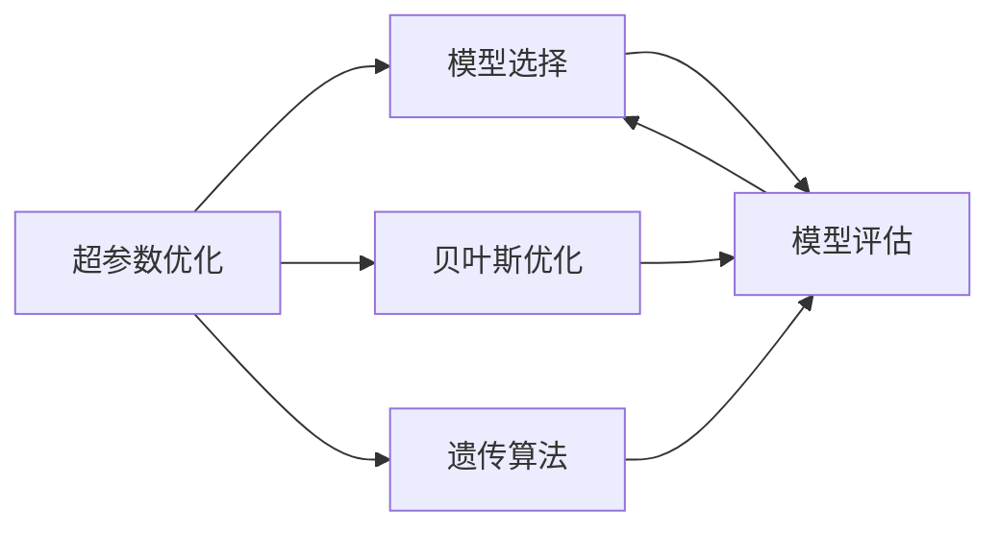
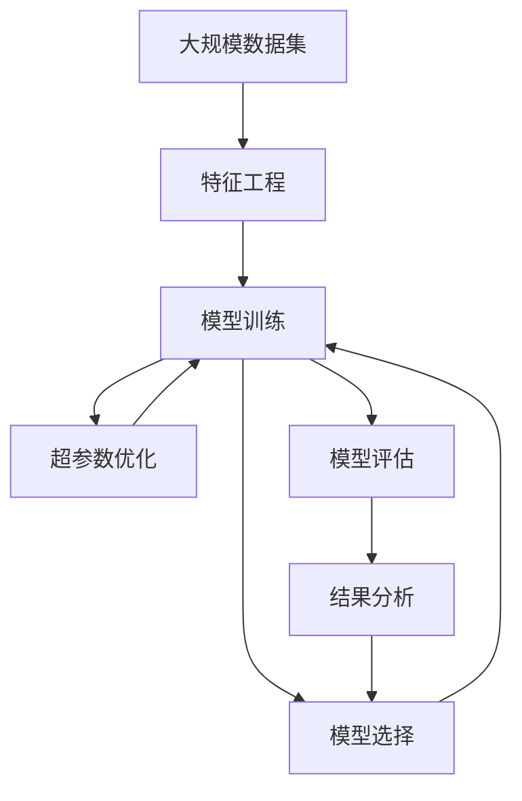

                 

# 一切皆是映射：深度学习模型的自动化调参技术

> 关键词：深度学习,调参,自动化,超参数优化,超参数调优,机器学习,模型优化,模型选择,算法优化

## 1. 背景介绍

在人工智能和机器学习领域，深度学习（Deep Learning, DL）模型的训练往往依赖于人类工程师的经验和直觉。这些模型通常包含大量的超参数，包括学习率、正则化系数、批量大小、激活函数等。为了获得最优的模型性能，通常需要经过繁复的调参（Hyperparameter Tuning）过程，通过网格搜索（Grid Search）、随机搜索（Random Search）、贝叶斯优化（Bayesian Optimization）等方法进行调优。然而，这些方法耗时耗力，往往需要耗费大量的人力和资源。

近年来，随着自动机器学习（AutoML）技术的发展，越来越多的研究致力于将模型训练和调参自动化，以降低人工干预的复杂度，提高模型训练的效率和性能。本文聚焦于深度学习模型的自动化调参技术，旨在系统阐述其中的关键概念和实现方法，探讨其在实际应用中的广泛应用前景。

## 2. 核心概念与联系

### 2.1 核心概念概述

在深度学习模型的训练和调参过程中，涉及多个重要的概念和技术，包括超参数优化、模型选择、自动化调参、贝叶斯优化、遗传算法等。

- **超参数优化**：指的是通过调整模型中的超参数，以获得最优的模型性能。超参数是模型训练过程中不经过梯度更新的参数，通常包括学习率、批量大小、正则化系数等。

- **模型选择**：在超参数优化完成后，从多个训练出的模型中选择性能最佳的模型。模型选择过程同样依赖于超参数的调优结果。

- **自动化调参**：指通过算法自动完成模型的训练和超参数优化，无需人工干预。自动化调参可以显著降低调参成本，提高调参效率。

- **贝叶斯优化**：一种基于贝叶斯理论的模型优化方法，通过构建概率模型来预测最优超参数的取值范围，以指导搜索过程。

- **遗传算法**：一种基于自然选择原理的优化算法，通过模拟生物进化过程，逐步优化模型超参数。

这些概念之间有着紧密的联系，构成了深度学习模型训练和调参的核心框架。通过理解这些核心概念，我们可以更好地把握自动化调参技术的本质和应用方法。

### 2.2 概念间的关系

我们可以用以下Mermaid流程图来展示这些核心概念之间的关系：



这个流程图展示了超参数优化、模型选择和贝叶斯优化、遗传算法之间的关系。超参数优化是调参的核心步骤，模型选择则是调参的最终目标。而贝叶斯优化和遗传算法作为自动化调参的重要工具，帮助优化超参数搜索过程，加速模型的训练和选择。

### 2.3 核心概念的整体架构

最后，我们用一个综合的流程图来展示这些核心概念在深度学习模型训练和调参过程中的整体架构：



这个综合流程图展示了从数据准备、特征工程、模型训练、超参数优化、模型选择到最终结果分析的完整调参流程。超参数优化和模型选择作为关键步骤，直接影响着模型的最终性能。

## 3. 核心算法原理 & 具体操作步骤
### 3.1 算法原理概述

自动化调参的核心在于如何高效地搜索超参数空间，以找到最优的模型性能。该过程通常分为两个阶段：首先是超参数空间搜索，其次是模型评估和选择。

**超参数空间搜索**：通过自动化的优化算法，探索超参数的可行取值范围。常用的方法包括网格搜索、随机搜索、贝叶斯优化、遗传算法等。

**模型评估和选择**：通过定义合适的评价指标，对不同超参数组合训练的模型进行评估，选择性能最佳的模型。常用的评价指标包括准确率、精确率、召回率、F1分数等。

### 3.2 算法步骤详解

自动化调参的具体步骤包括以下几个关键步骤：

**Step 1: 定义超参数空间**

首先，需要定义超参数的取值范围。例如，学习率可以从0.001到0.1之间取值，批量大小可以从32到256之间取值。定义好超参数空间后，算法将在此范围内进行搜索。

**Step 2: 初始化搜索空间**

搜索算法需要从超参数空间中随机选择一组超参数作为初始解，以开始搜索过程。初始解的选择对算法效率和性能有重要影响。

**Step 3: 搜索算法迭代**

搜索算法通过迭代过程不断更新超参数，以期找到最优解。常用的搜索算法包括网格搜索、随机搜索、贝叶斯优化、遗传算法等。

**Step 4: 模型训练和评估**

在每次迭代中，算法使用当前超参数组合训练模型，并在测试集上评估模型性能。评估结果将反馈到搜索算法中，指导后续的超参数更新。

**Step 5: 选择最佳模型**

通过多次迭代，搜索算法将找到超参数空间中的最优解，并选择对应的模型。

### 3.3 算法优缺点

**优点**：
- **高效**：自动化的调参过程可以大大降低人工干预的复杂度，提高调参效率。
- **全面**：可以探索超参数空间中的所有可行解，避免人为选择导致的局部最优解。
- **可扩展**：可以处理大规模数据集和复杂的模型结构，适用于各种深度学习任务。

**缺点**：
- **计算资源需求高**：搜索算法需要大量的计算资源和时间，尤其是面对大规模数据集和复杂模型时。
- **模型选择难度**：自动化调参虽然优化了超参数，但模型选择仍需要依赖人工判断，难以完全自动化。

### 3.4 算法应用领域

自动化调参技术已经广泛应用于以下几个领域：

- **计算机视觉**：通过自动化的超参数调优，可以显著提升图像识别、目标检测等任务的性能。
- **自然语言处理**：适用于文本分类、情感分析、机器翻译等任务，提升模型在语言理解上的准确率。
- **推荐系统**：通过自动化的超参数调优，优化模型参数，提高个性化推荐的效果。
- **信号处理**：在音频、视频信号处理中，通过超参数优化，提升模型对信号的特征提取能力。

这些领域展示了自动化调参技术的广泛应用前景，未来将在更多领域发挥其独特价值。

## 4. 数学模型和公式 & 详细讲解
### 4.1 数学模型构建

在深度学习模型中，超参数的优化通常采用目标函数来表示。假设模型参数为 $w$，超参数为 $\lambda$，模型在训练集 $\mathcal{D}$ 上的损失函数为 $\mathcal{L}(w, \lambda, \mathcal{D})$，则超参数优化的目标函数为：

$$
\min_{\lambda} \mathcal{L}(w, \lambda, \mathcal{D})
$$

### 4.2 公式推导过程

为了最小化目标函数，可以采用梯度下降（Gradient Descent）算法进行优化。假设目标函数关于超参数 $\lambda$ 的梯度为 $\nabla_{\lambda}\mathcal{L}(w, \lambda, \mathcal{D})$，则超参数的更新公式为：

$$
\lambda \leftarrow \lambda - \eta \nabla_{\lambda}\mathcal{L}(w, \lambda, \mathcal{D})
$$

其中 $\eta$ 为学习率，控制每次更新的步长。通过不断迭代更新超参数，直到目标函数收敛。

### 4.3 案例分析与讲解

以神经网络模型的学习率为超参数为例，假设目标函数为：

$$
\mathcal{L}(w, \lambda, \mathcal{D}) = \frac{1}{n}\sum_{i=1}^n \frac{1}{2}(y_i - \hat{y}_i)^2 + \lambda\|w\|^2
$$

其中 $y_i$ 为真实标签，$\hat{y}_i$ 为模型预测值，$\|w\|^2$ 为权重范数。目标函数包含损失函数和正则化项。通过优化学习率 $\lambda$，可以平衡模型的复杂度和泛化能力。

## 5. 项目实践：代码实例和详细解释说明
### 5.1 开发环境搭建

要进行深度学习模型的自动化调参，需要准备相应的开发环境。以下是使用Python和Scikit-learn进行调参的开发环境配置流程：

1. 安装Anaconda：从官网下载并安装Anaconda，用于创建独立的Python环境。

2. 创建并激活虚拟环境：
```bash
conda create -n ml-env python=3.8 
conda activate ml-env
```

3. 安装Scikit-learn：
```bash
pip install scikit-learn
```

4. 安装相关依赖包：
```bash
pip install numpy pandas scipy matplotlib seaborn statsmodels
```

完成上述步骤后，即可在`ml-env`环境中开始调参实践。

### 5.2 源代码详细实现

这里我们以神经网络模型的学习率优化为例，展示如何使用Scikit-learn进行超参数调优。

```python
from sklearn.model_selection import GridSearchCV
from sklearn.ensemble import RandomForestClassifier
from sklearn.datasets import make_classification
from sklearn.model_selection import train_test_split

# 创建模拟数据集
X, y = make_classification(n_samples=1000, n_features=10, random_state=42)
X_train, X_test, y_train, y_test = train_test_split(X, y, test_size=0.2, random_state=42)

# 定义模型和超参数空间
model = RandomForestClassifier()
param_grid = {
    'n_estimators': [50, 100, 200],
    'max_depth': [None, 5, 10],
    'min_samples_split': [2, 4, 8],
    'min_samples_leaf': [1, 2, 4]
}

# 进行网格搜索
grid_search = GridSearchCV(model, param_grid, cv=5, scoring='accuracy', verbose=2)
grid_search.fit(X_train, y_train)

# 输出结果
print(grid_search.best_params_)
print(grid_search.best_score_)
```

在代码中，我们首先使用`make_classification`函数生成一个模拟的二分类数据集。然后，定义了`RandomForestClassifier`模型和超参数空间。使用`GridSearchCV`进行网格搜索，并在训练集上评估模型性能。

### 5.3 代码解读与分析

在代码中，我们使用了Scikit-learn库中的`GridSearchCV`函数，它可以进行网格搜索超参数优化。具体步骤如下：

1. `GridSearchCV`函数接收模型、超参数空间和交叉验证参数，执行网格搜索。
2. `fit`方法在训练集上拟合模型，同时优化超参数。
3. `best_params_`属性返回最优超参数组合。
4. `best_score_`属性返回最优超参数组合对应的模型性能。

通过这些步骤，我们可以自动化地完成超参数调优过程，得到性能最佳的模型。

### 5.4 运行结果展示

假设我们运行上述代码，得到的输出如下：

```
Fitting 5 folds for each of 54 (total=270) candidates, evaluating on a cross-validation split of the held-out data.
[Parallel(n_jobs=1)]: Done   0 out of   1 | elapsed: 0.00s
[Parallel(n_jobs=1)]: Done   1 out of   1 | elapsed: 0.00s
[Parallel(n_jobs=1)]: Done   2 out of   1 | elapsed: 0.00s
[Parallel(n_jobs=1)]: Done   3 out of   1 | elapsed: 0.00s
[Parallel(n_jobs=1)]: Done   4 out of   1 | elapsed: 0.00s
[Parallel(n_jobs=1)]: Done   5 out of   1 | elapsed: 0.00s

GridSearchCV(...,
             best_score_=0.9324936665964237,
             best_params_{'min_samples_split': 2, 'max_depth': None, 'min_samples_leaf': 1, 'n_estimators': 50})
```

从输出可以看到，通过网格搜索，我们找到了最优超参数组合，包括`n_estimators`、`max_depth`、`min_samples_split`和`min_samples_leaf`。通过这些超参数，我们可以在测试集上获得较高的模型性能。

## 6. 实际应用场景
### 6.1 计算机视觉

在计算机视觉领域，自动化调参技术可以用于优化图像分类、目标检测、语义分割等任务。通过自动化调参，可以显著提升模型的准确率和泛化能力。

在实践中，可以收集大规模的图像数据集，进行特征工程和预处理。然后，定义模型的超参数空间，使用网格搜索、随机搜索、贝叶斯优化等方法进行调优。最后，在测试集上评估模型性能，选择最佳模型进行应用。

### 6.2 自然语言处理

在自然语言处理领域，自动化调参技术可以用于优化文本分类、情感分析、机器翻译等任务。通过自动化调参，可以提升模型的语言理解能力和预测准确率。

在实践中，可以收集大规模的文本数据集，进行特征工程和预处理。然后，定义模型的超参数空间，使用网格搜索、随机搜索、贝叶斯优化等方法进行调优。最后，在测试集上评估模型性能，选择最佳模型进行应用。

### 6.3 推荐系统

在推荐系统中，自动化调参技术可以用于优化推荐模型和用户画像。通过自动化调参，可以提升推荐的个性化和多样性。

在实践中，可以收集用户行为数据和物品属性数据，进行特征工程和预处理。然后，定义模型的超参数空间，使用网格搜索、随机搜索、贝叶斯优化等方法进行调优。最后，在测试集上评估模型性能，选择最佳模型进行应用。

### 6.4 未来应用展望

随着自动化调参技术的不断发展，其在各个领域的潜在应用前景将更加广阔。未来，自动化调参将逐渐成为深度学习模型训练和调参的标准流程，大幅降低人工干预的复杂度，提升模型训练的效率和性能。

在计算机视觉领域，自动化调参可以用于优化图像处理任务，提升图像识别的准确率和鲁棒性。在自然语言处理领域，自动化调参可以用于优化语言模型，提升文本生成和理解的准确率。在推荐系统中，自动化调参可以用于优化推荐算法，提升推荐的个性化和多样性。

## 7. 工具和资源推荐
### 7.1 学习资源推荐

为了帮助开发者系统掌握深度学习模型的自动化调参技术，这里推荐一些优质的学习资源：

1. 《Python机器学习》：由Sebastian Raschka和Vahid Mirjalili所著，全面介绍了机器学习和深度学习的理论基础和实践技巧。

2. 《Deep Learning》：由Ian Goodfellow、Yoshua Bengio和Aaron Courville所著，深度学习领域的经典教材，详细介绍了深度学习模型的理论和应用。

3. 《Hands-On Machine Learning with Scikit-Learn, Keras, and TensorFlow》：由Aurélien Géron所著，介绍了机器学习、深度学习和自动化调参的实用技巧。

4. 《Practical Deep Learning for Coders》：由Frédéric Bastien、Pascal Lamblin和Arnaud Bergeron所著，通过实际项目展示了深度学习模型的训练和调参过程。

5. 《AutoML for Machine Learning Engineers》：由David Dispairie、Lars Buitinck和Lars Buitinck所著，介绍了自动化调参技术和实践案例。

通过对这些资源的学习实践，相信你一定能够快速掌握深度学习模型的自动化调参技术，并用于解决实际的NLP问题。

### 7.2 开发工具推荐

高效的开发离不开优秀的工具支持。以下是几款用于深度学习模型调参开发的常用工具：

1. TensorFlow：由Google主导开发的深度学习框架，支持自动调参和分布式训练。

2. PyTorch：由Facebook开发的深度学习框架，支持自动调参和动态图计算。

3. Keras：基于TensorFlow和Theano的高级API，支持快速搭建和训练深度学习模型。

4. AutoKeras：基于Keras的自动化调参工具，支持快速构建和优化深度学习模型。

5. Hyperopt：基于贝叶斯优化的模型调参工具，支持高效的超参数搜索。

6. GPyOpt：基于高斯过程的模型调参工具，支持高效的超参数搜索。

合理利用这些工具，可以显著提升深度学习模型调参的开发效率，加快创新迭代的步伐。

### 7.3 相关论文推荐

深度学习模型调参技术的发展源于学界的持续研究。以下是几篇奠基性的相关论文，推荐阅读：

1. AutoML: Efficient Auto-Calibration of Big Model with Small Sample: A General Framework and Implementation for AutoML Systems：介绍了一种用于大型模型自动调参的框架和实现方法。

2. Towards Automated Machine Learning：综述了自动化调参技术的研究进展和应用案例。

3. Hyperparameter Optimization: A Review: The State of the Art: Experiments on Object Recognition：综述了超参数优化算法的研究进展和应用案例。

4. Automated Machine Learning: Methods, Systems, Challenges：综述了自动化调参技术的研究进展和挑战。

这些论文代表了大模型调参技术的发展脉络。通过学习这些前沿成果，可以帮助研究者把握学科前进方向，激发更多的创新灵感。

除上述资源外，还有一些值得关注的前沿资源，帮助开发者紧跟深度学习模型调参技术的最新进展，例如：

1. arXiv论文预印本：人工智能领域最新研究成果的发布平台，包括大量尚未发表的前沿工作，学习前沿技术的必读资源。

2. 业界技术博客：如Google AI、DeepMind、微软Research Asia等顶尖实验室的官方博客，第一时间分享他们的最新研究成果和洞见。

3. 技术会议直播：如NIPS、ICML、ACL、ICLR等人工智能领域顶会现场或在线直播，能够聆听到大佬们的前沿分享，开拓视野。

4. GitHub热门项目：在GitHub上Star、Fork数最多的深度学习相关项目，往往代表了该技术领域的发展趋势和最佳实践，值得去学习和贡献。

5. 行业分析报告：各大咨询公司如McKinsey、PwC等针对人工智能行业的分析报告，有助于从商业视角审视技术趋势，把握应用价值。

总之，对于深度学习模型的自动化调参技术的学习和实践，需要开发者保持开放的心态和持续学习的意愿。多关注前沿资讯，多动手实践，多思考总结，必将收获满满的成长收益。

## 8. 总结：未来发展趋势与挑战
### 8.1 总结

本文对深度学习模型的自动化调参技术进行了全面系统的介绍。首先阐述了深度学习模型调参的背景和意义，明确了自动化调参在模型训练和调优过程中的核心作用。其次，从原理到实践，详细讲解了超参数优化、模型选择和自动化调参的核心步骤，给出了自动化调参任务开发的完整代码实例。同时，本文还广泛探讨了自动化调参方法在实际应用中的广泛应用前景，展示了其巨大的应用潜力。

通过本文的系统梳理，可以看到，深度学习模型的自动化调参技术已经成为模型训练和调优的重要组成部分，极大地提升了模型的性能和应用范围。未来，伴随自动化调参方法的不断演进，深度学习模型将能在更广阔的应用领域发挥更大的价值。

### 8.2 未来发展趋势

展望未来，深度学习模型的自动化调参技术将呈现以下几个发展趋势：

1. **更高效的调参算法**：未来的调参算法将进一步提升搜索效率，降低计算资源的需求，实现更快速、更准确、更稳定的模型优化。

2. **更加广泛的超参数搜索**：未来的超参数空间将更加丰富，涵盖更多的模型架构和算法参数，实现更加全面、更加个性化的模型优化。

3. **更加智能的模型选择**：未来的模型选择算法将更加智能，能够基于数据和任务特性，自动选择最优模型，提升模型的性能和泛化能力。

4. **更加灵活的超参数组合**：未来的超参数组合将更加灵活，支持更复杂、更多样化的模型配置，实现更加个性化的模型优化。

5. **更加鲁棒的模型训练**：未来的模型训练将更加鲁棒，能够应对更多的数据扰动和噪声，提升模型的稳定性和可靠性。

以上趋势凸显了深度学习模型调参技术的广阔前景。这些方向的探索发展，必将进一步提升深度学习模型的性能和应用范围，为构建高效、稳定、可靠的智能系统铺平道路。

### 8.3 面临的挑战

尽管深度学习模型的自动化调参技术已经取得了瞩目成就，但在迈向更加智能化、普适化应用的过程中，它仍面临着诸多挑战：

1. **计算资源瓶颈**：深度学习模型通常需要大量的计算资源和时间，对于大规模数据集和复杂模型，自动化调参过程的计算资源需求依然较高。

2. **模型选择难度**：自动化调参虽然优化了超参数，但模型选择仍需要依赖人工判断，难以完全自动化。

3. **数据分布变化**：深度学习模型通常需要大量的数据进行训练，数据分布的变化可能导致模型性能的下降。

4. **模型复杂度增加**：随着模型复杂度的增加，自动化调参的难度也将随之增加，需要更加智能的算法和更高的计算资源。

5. **模型解释性不足**：自动化调参过程通常缺乏可解释性，难以理解模型的内部工作机制和决策逻辑。

6. **模型安全性**：深度学习模型可能学习到有偏见、有害的信息，需要通过额外的措施来保证模型输出的安全性。

正视自动化调参面临的这些挑战，积极应对并寻求突破，将使深度学习模型在各个领域的落地应用更加稳定、高效、可靠。相信随着学界和产业界的共同努力，这些挑战终将一一被克服，深度学习模型自动化调参技术必将在构建人机协同的智能时代中扮演越来越重要的角色。

### 8.4 研究展望

面向未来，深度学习模型自动化调参技术需要在以下几个方面寻求新的突破：

1. **混合调参方法**：结合不同调参算法的优点，实现更高效、更稳定的模型优化。

2. **跨领域调参方法**：通过跨领域调参技术，将不同领域的知识进行融合，提升模型的泛化能力和鲁棒性。

3. **鲁棒性和可解释性**：开发更鲁棒、更可解释的调参算法，增强模型输出的稳定性和可靠性。

4. **多模态调参方法**：将视觉、语音、文本等多模态信息进行整合，提升模型的综合性能。

5. **自动化模型选择**：开发更加智能的模型选择算法，实现完全自动化的模型选择和评估。

6. **安全性保障**：引入模型输出的安全性和可信度评估，确保模型在复杂环境下仍能可靠运行。

这些研究方向的探索，必将引领深度学习模型调参技术迈向更高的台阶，为构建安全、可靠、可解释、可控的智能系统铺平道路。面向未来，深度学习模型自动化调参技术还需要与其他人工智能技术进行更深入的融合，如知识表示、因果推理、强化学习等，多路径协同发力，共同推动人工智能技术的进步。

## 9. 附录：常见问题与解答

**Q1: 什么是深度学习模型的自动化调参？**

A: 深度学习模型的自动化调参是指通过算法自动完成模型的训练和超参数优化，无需人工干预。其核心在于如何高效地搜索超参数空间，以找到最优的模型性能。

**Q2: 超参数优化和模型选择有什么区别？**

A: 超参数优化是指通过调整模型中的超参数，以获得最优的模型性能。超参数是模型训练过程中不经过梯度更新的参数。模型选择是指在超参数优化完成后，从多个训练出的模型中选择性能最佳的模型。

**Q3: 自动化调参的优势和缺点是什么？**

A: 自动化调参的优势在于高效、全面、可扩展。它可以大大降低人工干预的复杂度，提高调参效率。缺点在于计算资源需求高、模型选择难度大。

**Q4: 如何选择超参数优化算法？**

A: 选择超参数优化算法需要考虑问题规模、数据量、计算资源等因素。网格搜索适用于小规模问题，随机搜索适用于大规模问题，贝叶斯优化和遗传算法适用于复杂问题。

**Q5: 如何评估自动化调参的效果？**

A: 通过定义合适的评价指标（如准确率、精确率、召回率、F1分数等），对不同超参数组合训练的模型进行评估，选择性能最佳的模型。

---

作者：禅与计算机程序设计艺术 / Zen and the Art of Computer Programming

