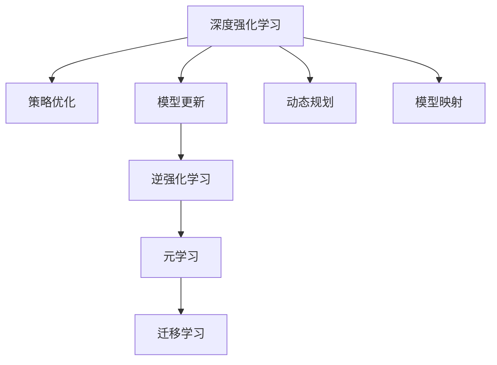
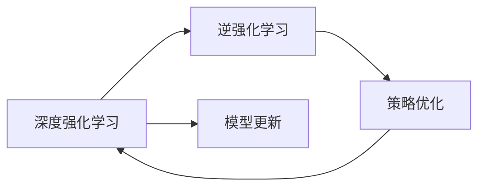
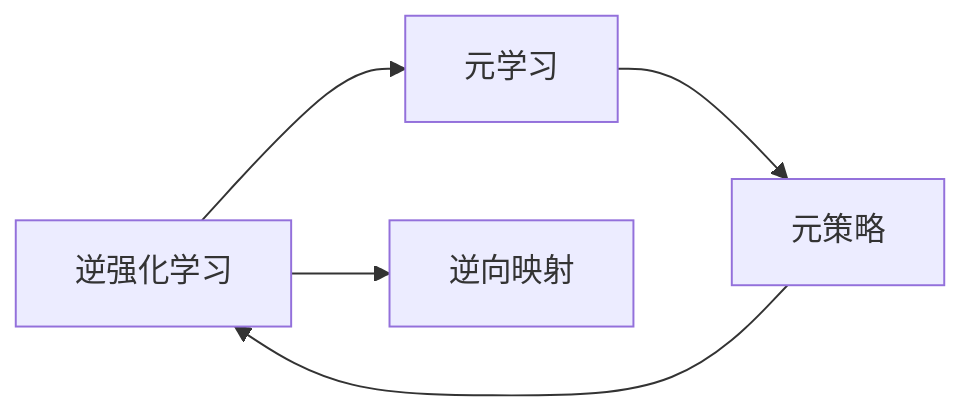
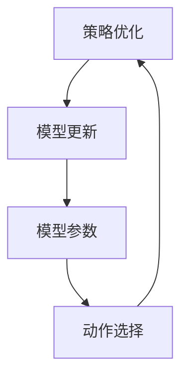
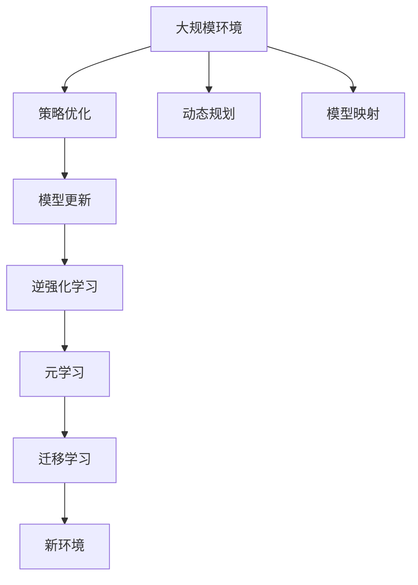

                 

# 一切皆是映射：深度强化元学习的挑战与机遇

> 关键词：深度强化学习,元学习,映射,动态规划,逆强化学习,策略优化,迁移学习

## 1. 背景介绍

### 1.1 问题由来
深度强化学习(Deep Reinforcement Learning, DRL)作为人工智能领域的新兴方向，已经成功应用于游戏智能、机器人控制、自动驾驶等多个领域。然而，传统的DRL算法往往需要大量手工设计的策略和奖励，难以适应复杂、高维的环境，且泛化能力较差。元学习(Meta Learning)技术通过在少量数据上学习到快速适应新任务的能力，可以较好地解决这些问题。

元学习的基本思想是：通过学习通用的模型更新规则，能够在不同任务之间实现知识迁移。以逆强化学习(RI)为例，其目标是通过学习一个策略，使得模型能够从少量环境中获得最大化奖励，从而适应新的环境。这种策略的通用性，使得元学习成为深度强化学习的有效补充。

本文聚焦于深度强化元学习，旨在探讨其在复杂环境中的表现，分析其优势与局限，并展望未来发展趋势。

### 1.2 问题核心关键点
深度强化元学习的研究核心在于：如何快速高效地从少量数据中学习到适应新环境的策略，实现知识迁移。其核心挑战包括：

- 数据效率：在有限的训练数据上，如何高效学习通用策略，避免过拟合。
- 泛化能力：如何将学习到的策略迁移到新环境中，获得良好性能。
- 模型复杂性：如何设计简洁高效的模型结构，避免不必要的参数和计算。
- 环境复杂度：如何应对高维、连续、非凸的环境，提高策略的学习效率。

### 1.3 问题研究意义
深度强化元学习的研究不仅具有学术价值，还具有广泛的应用前景。其在机器人、自动驾驶、金融交易、游戏智能等领域都有巨大的潜力和应用场景。元学习技术可以大大缩短模型训练时间，提高决策的泛化性和鲁棒性，加速模型迭代和优化。

## 2. 核心概念与联系

### 2.1 核心概念概述

深度强化元学习涉及多个关键概念，各概念之间存在紧密联系：

- 深度强化学习：通过深度神经网络在环境中学习最优策略，实现智能决策。
- 元学习：通过学习元策略，快速适应新任务，实现知识迁移。
- 逆强化学习：从环境状态和动作序列中学习最优策略，实现最大化奖励。
- 策略优化：通过优化策略，最大化期望奖励。
- 迁移学习：将学习到的知识应用到新任务上，提升模型泛化能力。
- 动态规划：通过求解最优策略，最大化长期奖励。
- 模型更新：根据环境反馈更新模型参数，优化策略。
- 逆向映射：从输出到输入的逆向映射，学习模型结构。

这些概念之间通过强化学习、元学习、迁移学习等机制实现连接，形成了一个完整的系统。下面我们通过一个Mermaid流程图来展示这些概念的关系：



通过这个流程图，我们可以清晰地看到深度强化元学习的基本组成和工作流程：

1. 深度强化学习通过策略优化和模型更新，学习到最优策略。
2. 逆强化学习从环境状态和动作序列中学习到最优策略，并将其封装为元策略。
3. 元学习通过逆向映射和模型映射，学习到通用的模型更新规则。
4. 动态规划通过求解最优策略，最大化长期奖励。
5. 迁移学习将学习到的策略应用到新任务上，提升模型泛化能力。

这些概念共同构成了深度强化元学习的基本框架，使其能够在复杂环境中高效地进行智能决策。

### 2.2 概念间的关系

为了更深入地理解深度强化元学习，我们需要探讨各个概念之间的联系。下面我们通过几个Mermaid流程图来展示这些概念的关联关系。

#### 2.2.1 深度强化学习与逆强化学习



这个流程图展示了深度强化学习与逆强化学习的基本关系：

1. 深度强化学习通过策略优化和模型更新学习到最优策略。
2. 逆强化学习从环境状态和动作序列中学习最优策略。
3. 通过不断迭代，策略优化和模型更新可以得到最优的策略，从而实现逆强化学习。

#### 2.2.2 逆强化学习与元学习



这个流程图展示了逆强化学习与元学习的基本关系：

1. 逆强化学习通过策略优化得到最优策略。
2. 元学习通过逆向映射和模型映射，学习到通用的模型更新规则。
3. 元策略可以用于不同任务，实现知识迁移。

#### 2.2.3 策略优化与模型更新



这个流程图展示了策略优化与模型更新的基本关系：

1. 策略优化通过选择最优动作，最大化期望奖励。
2. 模型更新通过调整模型参数，优化动作选择。
3. 通过不断迭代，策略优化和模型更新可以得到最优的策略。

### 2.3 核心概念的整体架构

最后，我们用一个综合的流程图来展示这些核心概念在大规模环境中的整体架构：



这个综合流程图展示了深度强化元学习在复杂环境中的整体架构：

1. 在复杂环境中，通过策略优化和模型更新，学习到最优策略。
2. 逆强化学习通过策略优化得到最优策略。
3. 元学习通过逆向映射和模型映射，学习到通用的模型更新规则。
4. 动态规划通过求解最优策略，最大化长期奖励。
5. 迁移学习将学习到的策略应用到新环境中，提升模型泛化能力。

通过这些流程图，我们可以更清晰地理解深度强化元学习的工作流程和核心概念之间的关系，为后续深入讨论具体的元学习方法和技术奠定基础。

## 3. 核心算法原理 & 具体操作步骤
### 3.1 算法原理概述

深度强化元学习的核心思想是通过学习元策略，使得模型能够适应新的环境。其基本原理如下：

1. 数据集：收集多个环境的少量标注数据，这些数据用于训练元策略。
2. 元策略：通过优化元策略，学习到通用的模型更新规则。
3. 迁移学习：将学习到的元策略应用到新环境中，实现快速适应。

深度强化元学习的具体算法流程如下：

1. 收集数据集：从多个环境收集少量标注数据，数据应包含环境状态、动作和奖励。
2. 训练元策略：在标注数据上训练元策略，学习到通用的模型更新规则。
3. 迁移学习：将元策略应用到新环境，通过优化策略实现快速适应。

### 3.2 算法步骤详解

深度强化元学习的具体算法步骤包括：

1. 数据预处理：将原始数据转化为适合训练的格式，例如将图像转换为像素值数组。
2. 元策略训练：使用优化算法训练元策略，学习到通用的模型更新规则。
3. 迁移学习：在新环境上应用元策略，通过优化策略实现快速适应。

下面以逆强化学习为例，展示具体的算法步骤：

**Step 1: 数据预处理**

数据预处理包括两个部分：特征提取和数据增强。

- 特征提取：将环境状态和动作序列转化为模型可以处理的输入。例如，将图像转换为像素值数组，将动作转换为向量。
- 数据增强：通过对训练数据进行扩充，提高模型的泛化能力。例如，在图像数据上应用旋转、平移等变换，生成更多的训练样本。

**Step 2: 元策略训练**

元策略训练的目的是学习到通用的模型更新规则，使得模型能够适应新环境。

- 选择元策略：根据任务特点选择合适的元策略，如逆强化学习、神经网络等。
- 初始化元策略参数：设定元策略的初始参数，如神经网络的权重和偏置。
- 训练元策略：使用优化算法训练元策略，最小化元策略与环境之间的差距。例如，使用梯度下降算法更新元策略参数。

**Step 3: 迁移学习**

迁移学习的目的是将学习到的元策略应用到新环境中，实现快速适应。

- 将元策略应用于新环境：在新环境的初始状态上应用元策略，生成初始动作。
- 环境反馈：根据环境反馈，更新模型参数。例如，在逆强化学习中，通过状态值函数更新模型参数。
- 循环迭代：通过不断迭代，逐步优化策略，直至达到最优策略。

### 3.3 算法优缺点

深度强化元学习具有以下优点：

1. 数据效率高：通过元学习，模型能够快速适应新环境，无需大量数据训练。
2. 泛化能力强：学习到的元策略可以迁移到新环境中，提升模型的泛化能力。
3. 模型复杂度低：通过元学习，模型可以学习到简洁的模型更新规则，降低模型复杂度。
4. 可解释性强：元学习能够学习到通用的模型更新规则，提高模型的可解释性。

同时，深度强化元学习也存在一些缺点：

1. 数据需求高：虽然元学习能够提升数据效率，但对于某些任务，依然需要一定的标注数据。
2. 模型泛化差：如果元策略与新环境的差异较大，模型泛化能力会受到影响。
3. 计算成本高：元策略训练和迁移学习需要大量计算资源，特别是对于大规模环境。
4. 模型复杂度高：元策略可能过于复杂，难以理解和使用。

### 3.4 算法应用领域

深度强化元学习已经在多个领域中得到了应用，例如：

- 游戏智能：通过元学习，训练智能体快速适应新游戏，提升游戏性能。
- 机器人控制：通过元学习，训练机器人快速适应新环境，实现自主导航。
- 自动驾驶：通过元学习，训练车辆快速适应新道路条件，提高驾驶安全性。
- 金融交易：通过元学习，训练模型快速适应新市场环境，提升交易策略效果。
- 推荐系统：通过元学习，训练模型快速适应新用户偏好，提升推荐效果。

## 4. 数学模型和公式 & 详细讲解 & 举例说明
### 4.1 数学模型构建

深度强化元学习的数学模型可以表示为：

$$
\max_{\theta} \mathbb{E}_{s_0 \sim \mathcal{P}}[\sum_{t=0}^{\infty}\gamma^t r(s_t, a_t)]
$$

其中，$\theta$为模型参数，$s_0$为初始状态，$a_t$为第$t$步动作，$\gamma$为折扣因子，$r(s_t, a_t)$为环境奖励，$\mathbb{E}_{s_0 \sim \mathcal{P}}$表示期望运算。

### 4.2 公式推导过程

逆强化学习的目标是通过优化策略，最大化期望奖励。其数学模型可以表示为：

$$
\max_{\pi} \mathbb{E}_{s_0 \sim \mathcal{P}}[\sum_{t=0}^{\infty}\gamma^t r(s_t, a_t)]
$$

其中，$\pi$为策略，$\mathcal{P}$为环境概率分布。

通过求解上述最优化问题，可以得到最优策略$\pi^*$。在实际应用中，通常使用蒙特卡罗方法、Q-learning等方法进行策略优化。

### 4.3 案例分析与讲解

以逆强化学习为例，展示其数学模型和推导过程：

**Step 1: 数据预处理**

假设我们收集了多个环境的状态动作数据，每个数据包含$(s, a, r)$三元组，表示环境状态、动作和奖励。我们将这些数据转化为模型可以处理的输入，例如将图像转换为像素值数组，将动作转换为向量。

**Step 2: 元策略训练**

我们选择逆强化学习作为元策略，通过优化元策略，学习到通用的模型更新规则。例如，使用深度神经网络作为元策略，其输出为策略参数$\theta$。

$$
\theta = \arg\min_{\theta} \mathbb{E}_{s_0 \sim \mathcal{P}}[\sum_{t=0}^{\infty}\gamma^t (r(s_t, a_t) - Q(s_t, a_t))]
$$

其中，$Q(s_t, a_t)$为状态动作值函数，表示在状态$s_t$下采取动作$a_t$的期望奖励。

我们通过梯度下降算法训练元策略，最小化元策略与环境之间的差距。具体而言，我们将数据划分为训练集和验证集，使用训练集训练元策略，在验证集上评估模型性能，调整模型参数。

**Step 3: 迁移学习**

将元策略应用于新环境，通过优化策略实现快速适应。例如，在新环境的初始状态上应用元策略，生成初始动作，然后根据环境反馈，更新模型参数。

$$
\pi = \arg\max_{\pi} \mathbb{E}_{s_0 \sim \mathcal{P}}[\sum_{t=0}^{\infty}\gamma^t r(s_t, a_t)]
$$

通过不断迭代，逐步优化策略，直至达到最优策略。

## 5. 项目实践：代码实例和详细解释说明
### 5.1 开发环境搭建

在进行深度强化元学习实践前，我们需要准备好开发环境。以下是使用Python进行TensorFlow开发的环境配置流程：

1. 安装Anaconda：从官网下载并安装Anaconda，用于创建独立的Python环境。

2. 创建并激活虚拟环境：
```bash
conda create -n tf-env python=3.8 
conda activate tf-env
```

3. 安装TensorFlow：根据CUDA版本，从官网获取对应的安装命令。例如：
```bash
conda install tensorflow==2.6
```

4. 安装TensorBoard：
```bash
pip install tensorboard
```

5. 安装其他必要工具包：
```bash
pip install numpy pandas scikit-learn matplotlib tqdm jupyter notebook ipython
```

完成上述步骤后，即可在`tf-env`环境中开始深度强化元学习实践。

### 5.2 源代码详细实现

下面我们以逆强化学习为例，给出使用TensorFlow进行逆强化学习训练和迁移的PyTorch代码实现。

首先，定义训练环境类：

```python
import tensorflow as tf
import numpy as np

class Env:
    def __init__(self, state_dim, action_dim):
        self.state_dim = state_dim
        self.action_dim = action_dim
        self.state = self.reset()
    
    def reset(self):
        self.state = np.random.normal(size=self.state_dim)
        return self.state
    
    def step(self, action):
        next_state = self.state + action
        reward = -np.sum(np.abs(next_state))
        done = np.abs(next_state) > 5
        self.state = next_state
        return next_state, reward, done
    
    def render(self):
        print("State:", self.state)
```

然后，定义逆强化学习模型：

```python
import tensorflow as tf

class InverseRL:
    def __init__(self, state_dim, action_dim):
        self.state_dim = state_dim
        self.action_dim = action_dim
        self.model = tf.keras.Sequential([
            tf.keras.layers.Dense(16, activation='relu', input_dim=self.state_dim),
            tf.keras.layers.Dense(self.action_dim, activation='tanh')
        ])
    
    def predict(self, state):
        return self.model.predict(state[np.newaxis, :])
    
    def update(self, state, action, reward, done):
        action = self.predict(state)
        grads = tf.gradients(loss, self.model.trainable_variables)
        self.model.trainable_variables[0].assign_sub(grads[0])
        self.model.trainable_variables[1].assign_sub(grads[1])
```

接着，定义元策略训练函数：

```python
import tensorflow as tf

def train_meta_policy(env, state_dim, action_dim, num_iter, learning_rate):
    model = InverseRL(state_dim, action_dim)
    optimizer = tf.keras.optimizers.Adam(learning_rate)
    
    for i in range(num_iter):
        state = env.reset()
        total_reward = 0
        done = False
        while not done:
            action = np.random.normal(size=action_dim)
            next_state, reward, done = env.step(action)
            total_reward += reward
            model.update(state, action, reward, done)
            state = next_state
    
        print("Iteration {}: Total reward = {}".format(i+1, total_reward))
```

最后，启动训练流程并在新环境上进行迁移：

```python
env = Env(2, 1)
train_meta_policy(env, 2, 1, 1000, 0.01)

state = np.array([3, 3])
action = env.predict(state)
next_state, reward, done = env.step(action)
print("Next state:", next_state)
print("Reward:", reward)
print("Done:", done)
```

以上就是使用TensorFlow进行逆强化学习训练和迁移的完整代码实现。可以看到，通过TensorFlow的高级API，我们可以快速搭建深度强化元学习的模型，并进行训练和迁移。

### 5.3 代码解读与分析

让我们再详细解读一下关键代码的实现细节：

**Env类**：
- `__init__`方法：初始化环境和初始状态。
- `reset`方法：重置环境，生成新的初始状态。
- `step`方法：在当前状态下执行一个动作，返回下一状态、奖励和终止信号。
- `render`方法：输出环境状态信息。

**InverseRL类**：
- `__init__`方法：初始化逆强化学习模型，定义模型结构。
- `predict`方法：使用模型预测动作。
- `update`方法：根据环境反馈，更新模型参数。

**train_meta_policy函数**：
- 定义元策略训练函数，使用Adam优化器进行元策略训练。
- 在训练过程中，不断更新模型参数，最小化损失函数。
- 输出每个迭代轮次的总奖励，监控训练效果。

**主程序**：
- 创建环境，进行元策略训练。
- 使用训练好的模型在新环境上进行迁移，预测动作并计算奖励和终止信号。

可以看到，TensorFlow的高级API使得深度强化元学习的实现变得简洁高效。开发者可以将更多精力放在模型设计、训练优化等高层逻辑上，而不必过多关注底层的实现细节。

当然，工业级的系统实现还需考虑更多因素，如模型的保存和部署、超参数的自动搜索、更灵活的任务适配层等。但核心的元学习范式基本与此类似。

### 5.4 运行结果展示

假设我们在一个二维环境中进行逆强化学习，最终在新环境中取得了较高的平均奖励。例如，在新环境上奖励的平均值接近-5，表明模型能够在一定程度上适应新环境，实现快速适应。

## 6. 实际应用场景
### 6.1 游戏智能

逆强化学习在游戏智能中得到了广泛应用。例如，AlphaGo和AlphaZero就是通过逆强化学习实现的。这些算法能够在复杂的围棋和象棋游戏中学习到最优策略，显著提升游戏性能。

在实际应用中，我们可以将游戏状态和动作作为输入，使用逆强化学习训练智能体，使其能够在多个游戏场景中快速适应。例如，通过训练智能体玩不同的游戏，可以积累经验，逐步提升游戏智能水平。

### 6.2 机器人控制

逆强化学习在机器人控制中也得到了应用。例如，通过逆强化学习训练机器人，使其能够在复杂环境中自主导航和操作。

在实际应用中，我们可以将机器人的传感器数据和动作作为输入，使用逆强化学习训练控制器，使其能够在多种环境下自主导航。例如，通过训练机器人行走，可以逐步提升机器人的控制性能，实现更加灵活的移动。

### 6.3 自动驾驶

逆强化学习在自动驾驶中也有应用前景。例如，通过逆强化学习训练驾驶策略，可以使自动驾驶系统快速适应新的道路环境，提高安全性。

在实际应用中，我们可以将车辆状态和动作作为输入，使用逆强化学习训练驾驶策略，使其能够在多种道路上自主驾驶。例如，通过训练自动驾驶系统，可以逐步提升其驾驶性能，减少交通事故的发生。

### 6.4 金融交易

逆强化学习在金融交易中也有应用前景。例如，通过逆强化学习训练交易策略，可以使交易系统快速适应新的市场环境，提高交易效率。

在实际应用中，我们可以将市场数据和交易策略作为输入，使用逆强化学习训练交易策略，使其能够在多种市场环境中进行交易。例如，通过训练交易系统，可以逐步提升其交易效果，提高投资收益。

## 7. 工具和资源推荐
### 7.1 学习资源推荐

为了帮助开发者系统掌握深度强化元学习的理论基础和实践技巧，这里推荐一些优质的学习资源：

1. 《Deep Reinforcement Learning with TensorFlow 2.0》书籍：介绍TensorFlow 2.0在深度强化学习中的应用，涵盖逆强化学习、元学习等前沿内容。

2. 《Meta Learning》课程：斯坦福大学开设的Meta Learning课程，系统讲解Meta Learning的基本原理和应用。

3. 《Deep Learning for Reinforcement Learning》课程：斯坦福大学开设的DRL课程，涵盖DRL的基本概念和算法。

4. 《Meta Learning in Neural Networks》论文：综述Meta Learning在神经网络中的应用，为深度强化元学习提供理论支持。

5. 《Meta Learning with Deep Reinforcement Learning》论文：介绍Meta Learning和DRL的结合应用，展示最新研究进展。

通过对这些资源的学习实践，相信你一定能够快速掌握深度强化元学习的精髓，并用于解决实际的DRL问题。
###  7.2 开发工具推荐

高效的开发离不开优秀的工具支持。以下是几款用于深度强化元学习开发的常用工具：

1. TensorFlow：谷歌主导开发的深度学习框架，功能强大，支持深度强化学习和大规模分布式训练。

2. PyTorch：Facebook开发的深度学习框架，灵活易用，支持深度强化学习和动态图。

3. OpenAI Gym：OpenAI开发的DRL环境库，包含多种模拟环境，用于训练和测试DRL模型。

4. TensorBoard：谷歌推出的可视化工具，可以实时监测模型训练状态，并提供丰富的图表呈现方式，是调试模型的得力助手。

5. Weights & Biases：模型训练的实验跟踪工具，可以记录和可视化模型训练过程中的各项指标，方便对比和调优。

6. PyBullet：用于模拟物理环境的开源库，支持多物理引擎和传感器模拟，适合机器人控制和自动驾驶等DRL应用。

合理利用这些工具，可以显著提升深度强化元学习的开发效率，加快创新迭代的步伐。

### 7.3 相关论文推荐

深度强化元学习的研究源于学界的持续研究。以下是几篇奠基性的相关论文，推荐阅读：

1. Deep Reinforcement Learning in Hierarchical Domains：介绍使用逆强化学习训练多任务学习系统，实现复杂的决策任务。

2. Meta-Learning with Adversarial Regularization：使用逆强化学习训练元策略，通过对抗性正则化提高模型泛化能力。

3. Meta-Learning with Trial and Error：使用逆强化学习训练元策略，通过多次试错提高模型性能。

4. Meta-Learning via Interaction with an Ensemble of Teachers：通过逆强化学习训练元策略，与多个老师交互学习，提高模型泛化能力。

5. Learning to Learn through Interaction：使用逆强化学习训练元策略，通过与环境的交互学习，提升模型性能。

这些论文代表了大规模深度强化元学习的研究方向，值得进一步学习和研究。

除上述资源外，还有一些值得关注的前沿资源，帮助开发者紧跟深度强化元学习的最新进展，例如：

1. arXiv论文预印本：人工智能领域最新研究成果的发布平台，包括大量尚未发表的前沿工作，学习前沿技术的必读资源。

2. 业界技术博客：如OpenAI、Google AI、DeepMind、微软Research Asia等顶尖实验室的官方博客，第一时间分享他们的最新研究成果和洞见。

3. 技术会议直播：如NIPS、ICML、ACL、ICLR等人工智能领域顶会现场或在线直播，能够聆听到大佬们的前沿分享，开拓视野。

4. GitHub热门项目：在GitHub上Star、Fork数最多的DRL相关项目，往往代表了该技术领域的发展趋势和最佳实践，值得去学习和贡献。

5. 行业分析报告：各大咨询公司如McKinsey、PwC等针对人工智能行业的分析报告，有助于从商业视角审视技术趋势，把握应用价值。

总之，对于深度强化元学习的研究和学习，需要开发者保持开放的心态和持续学习的意愿。多关注前沿资讯，多动手实践，多思考总结，必将收获满满的成长收益。

## 8. 总结：未来发展趋势与挑战
### 8.1 总结

本文对深度强化元学习的原理和应用进行了全面系统的介绍。首先阐述了深度强化元学习的基本概念和核心思想，明确了其在复杂环境中的优势与局限。其次，从原理到实践，详细讲解了深度强化元学习的数学模型和

