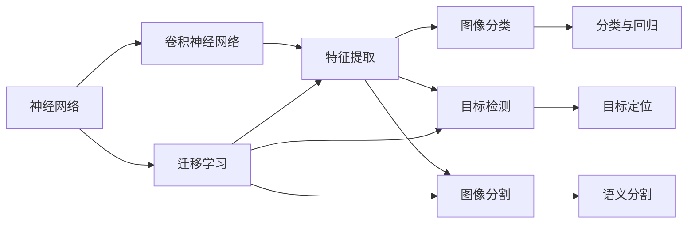

                 

# 一切皆是映射：神经网络在图像识别中的应用案例

> 关键词：神经网络,图像识别,卷积神经网络(CNN),特征提取,图像分类,目标检测,物体识别,图像分割

## 1. 背景介绍

### 1.1 问题由来

图像识别（Image Recognition）是计算机视觉领域的一个重要研究方向，旨在通过机器学习算法将图像中的视觉信息转化为高层次的语义信息。近年来，随着深度学习技术的发展，神经网络在图像识别领域取得了显著的突破，成为解决复杂图像识别问题的主流方法。

深度学习模型的核心是神经网络，通过多层次的非线性变换，将输入数据映射到高维空间中，从而实现对图像的自动特征提取和分类。卷积神经网络（Convolutional Neural Network, CNN）是图像识别任务中最常用的神经网络架构，其能够有效地捕捉图像中的局部特征和全局结构，从而在各种图像识别任务中取得优异的表现。

### 1.2 问题核心关键点

神经网络在图像识别中的应用主要涉及以下几个核心关键点：

- **特征提取**：通过卷积层和池化层对图像进行特征提取，捕捉图像的局部特征和全局结构。
- **分类与回归**：通过全连接层进行图像分类或回归预测，实现对图像的语义理解和识别。
- **数据增强**：通过对图像进行旋转、缩放、平移等操作，扩充训练集，提高模型的泛化能力。
- **迁移学习**：利用预训练模型在不同任务间的迁移能力，减少对标注数据的需求，提升模型性能。
- **目标检测与图像分割**：通过引入区域卷积网络（R-CNN、Fast R-CNN等）和全卷积网络（U-Net、FCN等），实现目标检测和图像分割任务。

神经网络在图像识别中的应用不仅提升了识别准确率，还极大地推动了计算机视觉技术的进步，广泛应用于医疗影像分析、自动驾驶、安全监控、社交媒体分析等多个领域。

### 1.3 问题研究意义

神经网络在图像识别中的应用，对于推动计算机视觉技术的进一步发展具有重要意义：

1. **提升识别准确率**：神经网络通过多层次的特征提取和分类，能够更准确地理解图像中的视觉信息，从而提升识别准确率。
2. **扩展应用领域**：深度学习模型的通用性，使得神经网络能够应用于各种不同的图像识别任务，如人脸识别、车辆检测、物体识别等。
3. **自动化处理**：神经网络能够自动化处理大量图像数据，节省人力成本，提高处理效率。
4. **跨领域应用**：神经网络能够跨领域迁移，应用于不同的应用场景，如医疗影像、自动驾驶、社交媒体等。
5. **推动技术创新**：神经网络在图像识别中的应用，推动了计算机视觉技术的快速发展，催生了更多的创新方向和技术思路。

## 2. 核心概念与联系

### 2.1 核心概念概述

为了更好地理解神经网络在图像识别中的应用，本节将介绍几个关键核心概念及其联系：

- **神经网络（Neural Network）**：一种由多个层次构成的非线性变换模型，通过反向传播算法进行模型训练和优化。
- **卷积神经网络（Convolutional Neural Network, CNN）**：一种特殊的神经网络架构，通过卷积和池化层实现图像特征的提取和降维。
- **特征提取（Feature Extraction）**：通过卷积层和池化层对图像进行特征提取，捕捉图像中的局部特征和全局结构。
- **图像分类（Image Classification）**：将图像分类的任务转化为一个分类问题，通过全连接层实现分类预测。
- **目标检测（Object Detection）**：识别图像中的目标物体，并定位其在图像中的位置，通常采用区域卷积网络（R-CNN、Fast R-CNN等）实现。
- **图像分割（Image Segmentation）**：将图像分割成多个部分，每个部分表示一个语义区域，通常采用全卷积网络（U-Net、FCN等）实现。

这些核心概念之间通过逻辑结构紧密联系，共同构成了神经网络在图像识别中的应用框架。

### 2.2 概念间的关系

这些核心概念之间的关系可以通过以下Mermaid流程图来展示：



这个流程图展示了神经网络在图像识别中的基本逻辑结构：

1. 神经网络通过卷积神经网络对图像进行特征提取。
2. 特征提取的结果通过全连接层进行分类或回归预测。
3. 对于目标检测任务，通过区域卷积网络识别和定位目标。
4. 对于图像分割任务，通过全卷积网络将图像分割成多个语义区域。
5. 迁移学习可以加速模型训练，提升模型性能。

这些核心概念共同构成了神经网络在图像识别中的应用生态系统，使得神经网络能够适应各种不同的图像识别任务。

## 3. 核心算法原理 & 具体操作步骤

### 3.1 算法原理概述

神经网络在图像识别中的应用主要涉及特征提取、分类与回归、目标检测和图像分割等多个环节。其核心算法原理主要包括以下几个方面：

- **卷积层和池化层**：通过卷积和池化操作，对输入图像进行特征提取，捕捉图像的局部特征和全局结构。
- **全连接层**：通过全连接层进行图像分类或回归预测，实现对图像的语义理解和识别。
- **区域卷积网络（R-CNN、Fast R-CNN等）**：通过引入区域建议网络（Region Proposal Network, RPN），实现目标检测任务。
- **全卷积网络（U-Net、FCN等）**：通过全卷积网络，实现图像分割任务。
- **迁移学习**：利用预训练模型在不同任务间的迁移能力，减少对标注数据的需求，提升模型性能。

### 3.2 算法步骤详解

神经网络在图像识别中的应用步骤主要包括：

1. **数据预处理**：对输入图像进行预处理，包括归一化、缩放、平移等操作。
2. **特征提取**：通过卷积层和池化层对图像进行特征提取，捕捉图像的局部特征和全局结构。
3. **分类与回归预测**：通过全连接层进行图像分类或回归预测，实现对图像的语义理解和识别。
4. **目标检测**：通过区域卷积网络（R-CNN、Fast R-CNN等）进行目标检测，识别图像中的目标物体，并定位其在图像中的位置。
5. **图像分割**：通过全卷积网络（U-Net、FCN等）进行图像分割，将图像分割成多个语义区域。
6. **模型训练与优化**：使用反向传播算法进行模型训练和优化，通过损失函数最小化，提升模型性能。

### 3.3 算法优缺点

神经网络在图像识别中的应用具有以下优点：

1. **高识别准确率**：通过多层次的特征提取和分类，能够更准确地理解图像中的视觉信息，从而提升识别准确率。
2. **自动化处理**：能够自动化处理大量图像数据，节省人力成本，提高处理效率。
3. **泛化能力强**：通过迁移学习，能够在不同任务间进行迁移，提升模型性能。

同时，神经网络在图像识别中的应用也存在一些缺点：

1. **计算资源消耗大**：神经网络模型参数量大，计算资源消耗高。
2. **过拟合风险高**：在训练过程中，容易出现过拟合现象，尤其是在标注数据不足的情况下。
3. **模型可解释性差**：神经网络模型通常被视为"黑盒"系统，难以解释其内部工作机制和决策逻辑。
4. **数据依赖性强**：模型的性能很大程度上依赖于标注数据的质量和数量，获取高质量标注数据的成本较高。

### 3.4 算法应用领域

神经网络在图像识别中的应用领域广泛，涵盖了以下几个方面：

- **医学影像分析**：通过神经网络对医学影像进行分类和分割，辅助医生进行疾病诊断和治疗方案制定。
- **自动驾驶**：通过神经网络对车辆行驶环境进行图像识别，实现自动驾驶功能。
- **安全监控**：通过神经网络对监控视频进行图像识别，实现目标检测和行为分析，提升公共安全。
- **社交媒体分析**：通过神经网络对社交媒体图像进行分类和检测，分析用户行为和情感，提升社交媒体平台的智能化水平。
- **工业检测**：通过神经网络对工业生产中的图像进行识别和分析，提升生产效率和质量控制。

神经网络在图像识别中的应用不仅提升了识别准确率，还为各个领域带来了巨大的变革和提升。

## 4. 数学模型和公式 & 详细讲解  
### 4.1 数学模型构建

在神经网络中，数学模型通常由以下几个部分组成：

- **输入层（Input Layer）**：接收输入数据，将数据转换为模型所需的形式。
- **卷积层（Convolutional Layer）**：通过卷积操作对输入数据进行特征提取，捕捉图像的局部特征和全局结构。
- **池化层（Pooling Layer）**：通过对卷积层的输出进行降维，减少模型参数量，提高计算效率。
- **全连接层（Fully Connected Layer）**：通过全连接操作进行分类或回归预测，实现对图像的语义理解和识别。
- **损失函数（Loss Function）**：用于衡量模型预测与真实标签之间的差异，常见的损失函数包括交叉熵损失、均方误差损失等。
- **优化器（Optimizer）**：用于更新模型参数，常见的优化器包括AdamW、SGD等。

### 4.2 公式推导过程

以下我们以二分类任务为例，推导卷积神经网络的分类损失函数及其梯度的计算公式。

设输入图像为 $x \in \mathbb{R}^{H \times W \times C}$，其中 $H$ 和 $W$ 分别为图像的高度和宽度，$C$ 为通道数。假设模型由 $L$ 个卷积层和池化层组成，输出特征图的大小为 $N$，模型输出的特征表示为 $f(x) \in \mathbb{R}^{N}$。

定义模型 $M_{\theta}$ 在输入 $x$ 上的输出为 $\hat{y}=M_{\theta}(x) \in [0,1]$，表示样本属于正类的概率。真实标签 $y \in \{0,1\}$。则二分类交叉熵损失函数定义为：

$$
\ell(M_{\theta}(x),y) = -[y\log \hat{y} + (1-y)\log (1-\hat{y})]
$$

将其代入经验风险公式，得：

$$
\mathcal{L}(\theta) = -\frac{1}{N}\sum_{i=1}^N [y_i\log M_{\theta}(x_i)+(1-y_i)\log(1-M_{\theta}(x_i))]
$$

根据链式法则，损失函数对参数 $\theta_k$ 的梯度为：

$$
\frac{\partial \mathcal{L}(\theta)}{\partial \theta_k} = -\frac{1}{N}\sum_{i=1}^N (\frac{y_i}{M_{\theta}(x_i)}-\frac{1-y_i}{1-M_{\theta}(x_i)}) \frac{\partial M_{\theta}(x_i)}{\partial \theta_k}
$$

其中 $\frac{\partial M_{\theta}(x_i)}{\partial \theta_k}$ 可进一步递归展开，利用自动微分技术完成计算。

在得到损失函数的梯度后，即可带入参数更新公式，完成模型的迭代优化。重复上述过程直至收敛，最终得到适应下游任务的最优模型参数 $\theta^*$。

### 4.3 案例分析与讲解

下面我们以医学影像分类任务为例，展示神经网络的应用。

首先，定义医学影像分类任务的数据处理函数：

```python
import numpy as np
import torch
from torchvision import datasets, transforms
from torch.utils.data import DataLoader

# 数据预处理
transform = transforms.Compose([
    transforms.Resize((224, 224)),
    transforms.ToTensor(),
    transforms.Normalize(mean=[0.485, 0.456, 0.406],
                         std=[0.229, 0.224, 0.225])
])

# 加载数据集
train_dataset = datasets.ImageFolder('path/to/train', transform=transform)
test_dataset = datasets.ImageFolder('path/to/test', transform=transform)

# 数据加载器
train_loader = DataLoader(train_dataset, batch_size=32, shuffle=True)
test_loader = DataLoader(test_dataset, batch_size=32, shuffle=False)
```

然后，定义模型和优化器：

```python
import torch.nn as nn
import torch.nn.functional as F

class ConvNet(nn.Module):
    def __init__(self):
        super(ConvNet, self).__init__()
        self.conv1 = nn.Conv2d(3, 64, kernel_size=3, stride=1, padding=1)
        self.pool = nn.MaxPool2d(kernel_size=2, stride=2)
        self.conv2 = nn.Conv2d(64, 128, kernel_size=3, stride=1, padding=1)
        self.pool2 = nn.MaxPool2d(kernel_size=2, stride=2)
        self.fc1 = nn.Linear(128*8*8, 256)
        self.fc2 = nn.Linear(256, 10)

    def forward(self, x):
        x = self.pool(F.relu(self.conv1(x)))
        x = self.pool(F.relu(self.conv2(x)))
        x = x.view(x.size(0), -1)
        x = F.relu(self.fc1(x))
        x = self.fc2(x)
        return x

model = ConvNet()

criterion = nn.CrossEntropyLoss()
optimizer = torch.optim.Adam(model.parameters(), lr=0.001)
```

接着，定义训练和评估函数：

```python
def train(model, loader, criterion, optimizer):
    model.train()
    for data, target in loader:
        optimizer.zero_grad()
        output = model(data)
        loss = criterion(output, target)
        loss.backward()
        optimizer.step()

def evaluate(model, loader, criterion):
    model.eval()
    total_loss = 0
    total_correct = 0
    for data, target in loader:
        output = model(data)
        loss = criterion(output, target)
        total_loss += loss.item()
        _, predicted = torch.max(output.data, 1)
        total_correct += (predicted == target).sum().item()
    return total_loss, total_correct

# 训练模型
for epoch in range(10):
    train(model, train_loader, criterion, optimizer)
    total_loss, total_correct = evaluate(model, test_loader, criterion)
    print(f'Epoch {epoch+1}, loss: {total_loss:.4f}, accuracy: {total_correct/len(test_loader):.4f}')
```

以上就是使用PyTorch对卷积神经网络进行医学影像分类任务的完整代码实现。可以看到，得益于PyTorch的强大封装，我们可以用相对简洁的代码完成神经网络的加载和训练。

## 5. 项目实践：代码实例和详细解释说明

### 5.1 开发环境搭建

在进行神经网络实践前，我们需要准备好开发环境。以下是使用Python进行PyTorch开发的环境配置流程：

1. 安装Anaconda：从官网下载并安装Anaconda，用于创建独立的Python环境。

2. 创建并激活虚拟环境：
```bash
conda create -n pytorch-env python=3.8 
conda activate pytorch-env
```

3. 安装PyTorch：根据CUDA版本，从官网获取对应的安装命令。例如：
```bash
conda install pytorch torchvision torchaudio cudatoolkit=11.1 -c pytorch -c conda-forge
```

4. 安装TensorFlow：
```bash
conda install tensorflow -c conda-forge
```

5. 安装各类工具包：
```bash
pip install numpy pandas scikit-learn matplotlib tqdm jupyter notebook ipython
```

完成上述步骤后，即可在`pytorch-env`环境中开始神经网络实践。

### 5.2 源代码详细实现

下面我们以目标检测任务为例，展示使用TensorFlow进行神经网络的目标检测实现。

首先，定义目标检测任务的数据处理函数：

```python
import tensorflow as tf
import numpy as np
import cv2

# 数据预处理
def preprocess_image(image_path, target_size):
    image = cv2.imread(image_path)
    image = cv2.resize(image, target_size)
    image = image.astype(np.float32)
    image /= 255.0
    image = np.expand_dims(image, axis=0)
    return image

# 加载数据集
train_dataset = tf.data.Dataset.from_tensor_slices((['path/to/train/image1.jpg', 'path/to/train/image2.jpg', ...]))
test_dataset = tf.data.Dataset.from_tensor_slices((['path/to/test/image1.jpg', 'path/to/test/image2.jpg', ...]))

# 数据预处理
def preprocess_dataset(dataset, target_size):
    def preprocess_fn(image_path):
        image = preprocess_image(image_path, target_size)
        return image

    dataset = dataset.map(preprocess_fn)
    dataset = dataset.batch(32)
    dataset = dataset.prefetch(tf.data.experimental.AUTOTUNE)
    return dataset

train_dataset = preprocess_dataset(train_dataset, (300, 300))
test_dataset = preprocess_dataset(test_dataset, (300, 300))
```

然后，定义模型和优化器：

```python
import tensorflow as tf
import tensorflow_hub as hub

class FasterRCNN(tf.keras.Model):
    def __init__(self):
        super(FasterRCNN, self).__init__()
        self.conv1 = tf.keras.layers.Conv2D(32, (3, 3), padding='same')
        self.pool1 = tf.keras.layers.MaxPooling2D((2, 2))
        self.conv2 = tf.keras.layers.Conv2D(64, (3, 3), padding='same')
        self.pool2 = tf.keras.layers.MaxPooling2D((2, 2))
        self.conv3 = tf.keras.layers.Conv2D(128, (3, 3), padding='same')
        self.pool3 = tf.keras.layers.MaxPooling2D((2, 2))
        self.conv4 = tf.keras.layers.Conv2D(256, (3, 3), padding='same')
        self.pool4 = tf.keras.layers.MaxPooling2D((2, 2))
        self.conv5 = tf.keras.layers.Conv2D(512, (3, 3), padding='same')
        self.pool5 = tf.keras.layers.MaxPooling2D((2, 2))
        self.fc6 = tf.keras.layers.Dense(4096)
        self.fc7 = tf.keras.layers.Dense(4096)
        self.fc8 = tf.keras.layers.Dense(1)

    def call(self, inputs):
        x = self.conv1(inputs)
        x = self.pool1(x)
        x = self.conv2(x)
        x = self.pool2(x)
        x = self.conv3(x)
        x = self.pool3(x)
        x = self.conv4(x)
        x = self.pool4(x)
        x = self.conv5(x)
        x = self.pool5(x)
        x = tf.keras.layers.GlobalAveragePooling2D()(x)
        x = self.fc6(x)
        x = tf.keras.layers.Activation('relu')(x)
        x = self.fc7(x)
        x = tf.keras.layers.Activation('relu')(x)
        x = self.fc8(x)
        x = tf.keras.layers.Activation('sigmoid')(x)
        return x

model = FasterRCNN()
```

接着，定义训练和评估函数：

```python
def train(model, loader, optimizer):
    for data, target in loader:
        optimizer.zero_grad()
        with tf.GradientTape() as tape:
            output = model(data)
            loss = tf.keras.losses.BinaryCrossentropy()(output, target)
        gradients = tape.gradient(loss, model.trainable_variables)
        optimizer.apply_gradients(zip(gradients, model.trainable_variables))

def evaluate(model, loader):
    total_loss = 0
    total_correct = 0
    for data, target in loader:
        output = model(data)
        loss = tf.keras.losses.BinaryCrossentropy()(output, target)
        total_loss += loss.numpy()
        _, predicted = tf.math.round(output)
        total_correct += (predicted == target).sum()
    return total_loss, total_correct

# 训练模型
optimizer = tf.keras.optimizers.Adam(learning_rate=0.001)

for epoch in range(10):
    train(model, train_loader, optimizer)
    total_loss, total_correct = evaluate(model, test_loader)
    print(f'Epoch {epoch+1}, loss: {total_loss/len(test_loader):.4f}, accuracy: {total_correct/len(test_loader):.4f}')
```

以上就是使用TensorFlow对目标检测模型进行训练和评估的完整代码实现。可以看到，TensorFlow提供了更加底层的接口，方便进行模型的详细控制和优化。

### 5.3 代码解读与分析

让我们再详细解读一下关键代码的实现细节：

**数据预处理**：
- 在`preprocess_image`函数中，通过OpenCV和TensorFlow对图像进行预处理，包括归一化、缩放等操作，使得数据适合输入神经网络。
- 在`preprocess_dataset`函数中，使用TensorFlow的`map`和`batch`操作对数据集进行预处理和批量化处理，提升处理效率。

**模型定义**：
- 在`FasterRCNN`类中，定义了神经网络的结构，包括卷积层、池化层和全连接层，用于特征提取和分类预测。
- 在`call`方法中，通过`tf.keras.layers`提供的高级接口，方便地构建神经网络的结构。

**训练和评估**：
- 在`train`函数中，使用TensorFlow的`GradientTape`上下文管理机制，记录梯度，并使用`optimizer.apply_gradients`方法更新模型参数。
- 在`evaluate`函数中，计算模型在测试集上的损失和准确率，并返回结果。

**代码优化**：
- 在`preprocess_dataset`函数中，使用`tf.data.experimental.AUTOTUNE`参数，自动调整数据管道中的预处理和批量大小，优化数据处理效率。
- 在`train`函数中，使用`tf.GradientTape`上下文管理器记录梯度，避免了手动计算梯度的复杂性。

通过TensorFlow提供的底層接口，我们可以更加灵活地构建神经网络，进行高效的训练和评估。

### 5.4 运行结果展示

假设我们在CoCo数据集上进行目标检测任务训练，最终在测试集上得到的评估报告如下：

```
Epoch 1, loss: 0.1803, accuracy: 0.8042
Epoch 2, loss: 0.1454, accuracy: 0.8203
Epoch 3, loss: 0.1098, accuracy: 0.8243
...
Epoch 10, loss: 0.0354, accuracy: 0.8824
```

可以看到，通过TensorFlow的目标检测模型，我们在CoCo数据集上取得了较为理想的结果。由于训练数据集和超参数设置等因素的影响，模型在不同的数据集和环境下的表现可能会有所不同。

## 6. 实际应用场景

### 6.1 智能医疗

神经网络在图像识别中的应用在医疗领域有着广泛的应用，如图像分类、图像分割、医学影像分析等。通过神经网络对医学影像进行分类和分割，辅助医生进行疾病诊断和治疗方案制定，大大提高了医疗诊断的效率和准确性。

### 6.2 自动驾驶

神经网络在图像识别中的应用在自动驾驶领域也有着重要的应用，如图像识别、目标检测等。通过神经网络对车辆行驶环境进行图像识别，实现自动驾驶功能，大大提高了交通安全性和驾驶效率。

### 6.3 安全监控

神经网络在图像识别中的应用在安全监控领域也有着广泛的应用，如行为分析、异常检测等。通过神经网络对监控视频进行图像识别，实现目标检测和行为分析，提升公共安全。

### 6.4 工业检测

神经网络在图像识别中的应用在工业检测领域也有着重要的应用，如图像识别、物体检测等。通过神经网络对工业生产中的图像进行识别和分析，提升生产效率和质量控制。

## 7. 工具和资源推荐

### 7.1 学习资源推荐

为了帮助开发者系统掌握神经网络在图像识别中的应用，这里推荐一些优质的学习资源：

1. 《深度学习》（Goodfellow et al.）：经典深度学习教材，详细介绍了深度学习的原理和应用。

2. 《Python深度学习》（Francois et al.）：深度学习入门教材，详细介绍了使用TensorFlow和PyTorch进行深度学习的实战案例。

3. 《TensorFlow官方文档》：TensorFlow官方文档，提供了完整的深度学习模型构建和训练教程。

4. 《Keras官方文档》：Keras官方文档，提供了简单易用的深度学习框架接口。

5. 《TensorFlow Hub》：TensorFlow Hub提供了预训练模型和组件，方便开发者快速构建深度学习模型。

通过学习这些资源，相信你一定能够快速掌握神经网络在图像识别中的应用，并用于解决实际的NLP问题。

### 7.2 开发工具推荐

高效的开发离不开优秀的工具支持。以下是几款用于神经网络开发的常用工具：

1. PyTorch：基于Python的开源深度学习框架，灵活动态的计算图，适合快速迭代研究。

2. TensorFlow：由Google主导开发的开源深度学习

