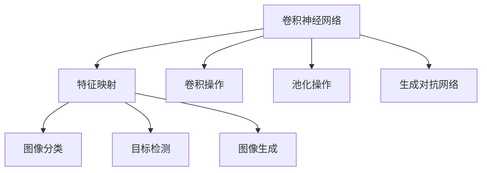
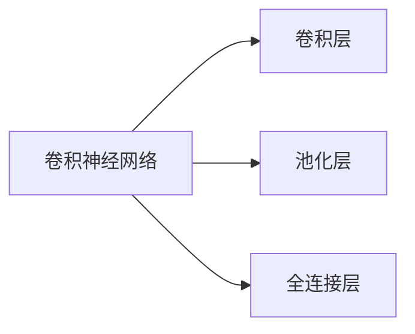
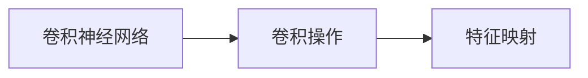
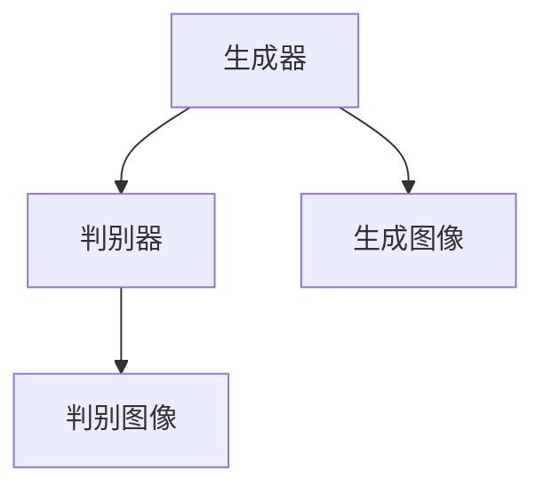
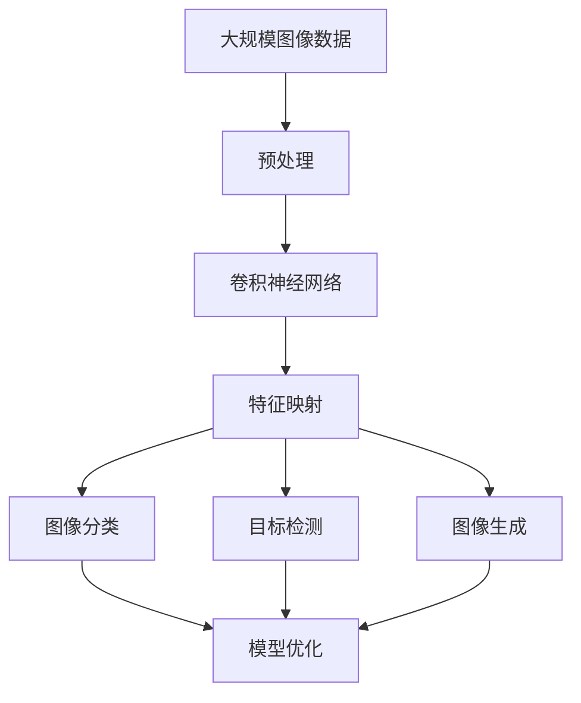

                 

# 一切皆是映射：计算机视觉中的AI模型与应用

> 关键词：计算机视觉, 人工智能模型, 特征映射, 卷积神经网络, 图像分类, 目标检测, 生成对抗网络

## 1. 背景介绍

### 1.1 问题由来

在过去几十年中，计算机视觉（CV）领域取得了巨大进展，人工智能模型在图像识别、目标检测、生成对抗网络（GAN）等方面实现了突破性成果。随着深度学习的兴起，卷积神经网络（CNN）成为了计算机视觉领域的主流模型。

卷积神经网络基于特征映射的概念，通过对输入图像进行卷积操作和池化操作，逐步提取出多层次的特征表示，从而实现图像分类、目标检测、图像生成等任务。在实际应用中，基于CNN的AI模型已经在医疗影像分析、自动驾驶、工业检测等多个领域中发挥了重要作用。

然而，尽管CNN取得了许多成功，其内部的工作机制和模型参数调整仍存在一定的复杂性。如何高效地训练和优化这些模型，使得它们在特定应用场景中达到最优效果，成为了当前研究的一个热点问题。

## 2. 核心概念与联系

### 2.1 核心概念概述

为了更好地理解计算机视觉中的AI模型，本节将介绍几个密切相关的核心概念：

- **卷积神经网络（CNN）**：一种深度学习模型，主要用于图像分类、目标检测、图像生成等计算机视觉任务。通过卷积层、池化层、全连接层等组件，逐步提取图像的特征表示。

- **特征映射（Feature Mapping）**：卷积神经网络中，每一层都通过卷积操作生成一组特征映射，映射了输入图像的某些特定特征。通过多层次的特征映射组合，网络能够学习到更加复杂、抽象的图像表示。

- **卷积操作（Convolution）**：CNN的核心操作之一，通过滑动一个固定大小的卷积核在输入图像上计算特征值，从而实现对图像局部特征的提取。

- **池化操作（Pooling）**：用于降低特征映射的尺寸，减少模型参数量，防止过拟合。常见的池化操作包括最大池化和平均池化等。

- **生成对抗网络（GAN）**：一种生成模型，由生成器和判别器两个组件组成。生成器尝试生成逼真的图像，判别器则试图区分生成图像和真实图像。通过两个组件的对抗训练，GAN可以生成高质量的图像。

这些核心概念之间的逻辑关系可以通过以下Mermaid流程图来展示：



这个流程图展示了卷积神经网络中的一些基本操作和组件，以及它们与图像分类、目标检测、图像生成等任务的联系。

### 2.2 概念间的关系

这些核心概念之间存在着紧密的联系，形成了计算机视觉中AI模型的完整生态系统。下面我通过几个Mermaid流程图来展示这些概念之间的关系。

#### 2.2.1 CNN的结构组成



这个流程图展示了CNN的基本结构，包括卷积层、池化层和全连接层。卷积层和池化层通过局部卷积和池化操作提取图像特征，全连接层则将这些特征映射到输出类别。

#### 2.2.2 特征映射的生成过程



这个流程图展示了卷积操作如何生成特征映射的过程。每一层的卷积操作都会生成一个新的特征映射，用于提取图像的不同层次特征。

#### 2.2.3 GAN的对抗训练



这个流程图展示了生成对抗网络中的对抗训练过程。生成器尝试生成逼真的图像，判别器则试图区分生成图像和真实图像，两者通过不断的对抗训练，最终生成高质量的图像。

### 2.3 核心概念的整体架构

最后，我们用一个综合的流程图来展示这些核心概念在大规模图像处理任务中的应用。



这个综合流程图展示了从预处理到模型优化的完整过程。大规模图像数据首先经过预处理，然后通过卷积神经网络逐步提取特征映射，最终用于图像分类、目标检测、图像生成等任务。

## 3. 核心算法原理 & 具体操作步骤

### 3.1 算法原理概述

计算机视觉中的AI模型，无论是卷积神经网络还是生成对抗网络，其核心原理都是特征映射。通过卷积操作和池化操作，模型能够逐步提取输入图像的特征表示，从而实现图像分类、目标检测、图像生成等任务。

形式化地，假设输入图像为 $I$，卷积神经网络的结构为 $C$，输出类别为 $Y$，则模型的优化目标可以表示为：

$$
\min_{C} \mathbb{E}_{I,Y}[\ell(C(I),Y)]
$$

其中 $\ell$ 表示模型输出与真实标签之间的损失函数，通常为交叉熵损失或均方误差损失。

### 3.2 算法步骤详解

卷积神经网络的训练过程通常包括以下几个关键步骤：

**Step 1: 准备训练数据和标签**

- 收集并标注大规模的图像数据，用于训练和验证模型。标注数据需要涵盖尽可能多的类别和场景，以提高模型的泛化能力。

**Step 2: 设计模型架构**

- 选择合适的卷积神经网络架构，如LeNet、AlexNet、VGG、ResNet、Inception等。确定卷积层、池化层、全连接层等组件的层次结构。

**Step 3: 设定超参数**

- 选择合适的优化算法（如SGD、Adam）及其参数（如学习率、批大小）。

**Step 4: 训练模型**

- 将训练数据分成小批量，每次迭代使用一批数据前向传播计算损失函数，并反向传播更新模型参数。
- 在每个epoch结束后，使用验证集评估模型性能，根据性能指标调整学习率、批次大小等超参数。

**Step 5: 测试和评估**

- 在测试集上评估训练好的模型，对比微调前后的性能提升。
- 使用训练好的模型进行图像分类、目标检测、图像生成等实际应用。

生成对抗网络（GAN）的训练过程也基本遵循类似的步骤，但需要注意以下几点：

- 生成器和判别器的初始参数需要随机初始化。
- 生成器和判别器需要进行交替训练，确保两者之间能够进行有效对抗。
- 可以使用梯度惩罚等技术提高模型的稳定性。

### 3.3 算法优缺点

卷积神经网络和生成对抗网络具有以下优点：

- **强大的特征提取能力**：卷积操作和池化操作能够有效提取图像的局部特征，从而实现高精度的图像分类、目标检测等任务。
- **良好的泛化能力**：通过多层次特征映射的组合，网络能够学习到更加抽象、复杂的图像表示，提高对新样本的泛化能力。
- **广泛的应用场景**：在图像分类、目标检测、图像生成、图像修复等领域都有广泛应用。

但同时，这些模型也存在一些缺点：

- **计算资源消耗大**：卷积神经网络和生成对抗网络通常需要大量的计算资源，包括GPU/TPU等高性能设备。
- **训练复杂度高**：模型结构复杂，超参数调整困难，需要丰富的经验和技巧。
- **解释性不足**：网络内部的决策过程复杂，难以解释和调试。

### 3.4 算法应用领域

基于卷积神经网络和生成对抗网络的AI模型已经在计算机视觉的多个领域中得到了广泛应用，例如：

- 图像分类：识别输入图像的类别。
- 目标检测：在图像中定位目标并分类。
- 图像生成：生成逼真的图像。
- 图像修复：修复受损的图像。
- 图像转换：将图像转换为不同的形式（如风格转换）。

除了上述这些经典任务外，AI模型还被创新性地应用到更多场景中，如自动驾驶、医疗影像分析、工业检测等，为计算机视觉技术带来了新的突破。

## 4. 数学模型和公式 & 详细讲解 & 举例说明

### 4.1 数学模型构建

本节将使用数学语言对计算机视觉中的AI模型进行更加严格的刻画。

假设输入图像为 $I$，卷积神经网络的卷积核为 $K$，激活函数为 $f$，输出为 $Y$。则模型的预测输出可以表示为：

$$
Y = f(\sigma(\mathcal{W}^T(K*I + b)))
$$

其中 $\mathcal{W}$ 为卷积核权重矩阵，$b$ 为偏置向量，$\sigma$ 为激活函数，$f$ 为全连接层激活函数。

在训练过程中，模型的优化目标可以表示为：

$$
\min_{\mathcal{W},b} \mathbb{E}_{I,Y}[\ell(Y',Y)]
$$

其中 $Y'$ 为模型预测输出，$\ell$ 表示模型输出与真实标签之间的损失函数。

### 4.2 公式推导过程

以图像分类任务为例，推导卷积神经网络的前向传播和反向传播过程。

**前向传播**

假设卷积层的输入特征映射大小为 $d \times d \times c$，卷积核大小为 $k \times k$，步长为 $s$，则卷积操作可以表示为：

$$
C_{ij} = \sum_{m=0}^{k-1} \sum_{n=0}^{k-1} W_{mni} I_{m+is,n+js} + b_i
$$

其中 $I_{m+is,n+js}$ 表示输入特征映射在位置 $(m+is,n+js)$ 处的像素值。

**反向传播**

假设模型输出与真实标签之间的损失函数为交叉熵损失，则反向传播过程中，全连接层的梯度可以表示为：

$$
\frac{\partial \ell}{\partial \mathcal{W}} = Y' - \mathbb{E}[f'(Z)X]
$$

其中 $Z$ 为全连接层的输出，$X$ 为输入特征映射的梯度。

在反向传播过程中，卷积层的梯度可以通过卷积操作和池化操作反向传播得到。具体地，对于卷积层的输出 $C$，其梯度 $g_C$ 可以表示为：

$$
g_C = \frac{\partial \ell}{\partial C} \frac{\partial C}{\partial K} \frac{\partial K}{\partial \mathcal{W}}
$$

其中 $\frac{\partial \ell}{\partial C}$ 为全连接层的梯度，$\frac{\partial C}{\partial K}$ 为卷积核梯度，$\frac{\partial K}{\partial \mathcal{W}}$ 为权重矩阵梯度。

### 4.3 案例分析与讲解

为了更好地理解卷积神经网络的工作原理，下面我们以LeNet为例，讲解其前向传播和反向传播过程。

**LeNet结构**

LeNet是一种经典的卷积神经网络，包含两个卷积层、两个池化层和三个全连接层。其结构如下：

```
Input -> Conv -> MaxPool -> Conv -> MaxPool -> FC -> FC -> FC -> Output
```

其中，Conv表示卷积层，MaxPool表示最大池化层，FC表示全连接层。

**前向传播**

假设输入图像的大小为 $28 \times 28 \times 1$，卷积核大小为 $5 \times 5$，步长为 $1$，则LeNet的前向传播过程可以表示为：

1. 第一层卷积操作：

$$
C_1 = \sigma(\mathcal{W}_1(K_1*I_1 + b_1))
$$

其中 $I_1$ 表示输入图像，$K_1$ 表示卷积核，$\mathcal{W}_1$ 表示权重矩阵，$b_1$ 表示偏置向量。

2. 第一层最大池化操作：

$$
C_1^2 = \max(C_1) \quad \text{within} \ 2 \times 2 \text{ window}
$$

3. 第二层卷积操作：

$$
C_2 = \sigma(\mathcal{W}_2(K_2*C_1^2 + b_2))
$$

4. 第二层最大池化操作：

$$
C_2^2 = \max(C_2) \quad \text{within} \ 2 \times 2 \text{ window}
$$

5. 第一层全连接操作：

$$
Z_1 = f(\mathcal{W}_3(C_2^2 + b_3))
$$

6. 第二层全连接操作：

$$
Z_2 = f(\mathcal{W}_4(Z_1 + b_4))
$$

7. 第三层全连接操作：

$$
Z_3 = f(\mathcal{W}_5(Z_2 + b_5))
$$

8. 输出：

$$
Y = \text{Softmax}(Z_3)
$$

**反向传播**

假设模型输出与真实标签之间的损失函数为交叉熵损失，则反向传播过程可以表示为：

1. 第三层全连接层的梯度：

$$
g_{Z_3} = -\frac{\partial \ell}{\partial Z_3}
$$

2. 第二层全连接层的梯度：

$$
g_{Z_2} = \frac{\partial \ell}{\partial Z_3} \frac{\partial Z_3}{\partial Z_2} f'(Z_2)
$$

3. 第一层全连接层的梯度：

$$
g_{Z_1} = \frac{\partial \ell}{\partial Z_3} \frac{\partial Z_3}{\partial Z_2} \frac{\partial Z_2}{\partial Z_1} f'(Z_1)
$$

4. 第三层卷积层的梯度：

$$
g_{C_2^2} = \frac{\partial \ell}{\partial Z_3} \frac{\partial Z_3}{\partial Z_2} \frac{\partial Z_2}{\partial Z_1} f'(Z_1) \frac{\partial Z_1}{\partial C_2^2} \frac{\partial C_2^2}{\partial C_2}
$$

5. 第二层卷积层的梯度：

$$
g_{C_1^2} = \frac{\partial \ell}{\partial Z_3} \frac{\partial Z_3}{\partial Z_2} \frac{\partial Z_2}{\partial Z_1} f'(Z_1) \frac{\partial Z_1}{\partial C_2^2} \frac{\partial C_2^2}{\partial C_1^2} \frac{\partial C_1^2}{\partial C_1} \frac{\partial C_1}{\partial K_1} \frac{\partial K_1}{\partial \mathcal{W}_1}
$$

6. 第一层卷积层的梯度：

$$
g_{I_1} = \frac{\partial \ell}{\partial Z_3} \frac{\partial Z_3}{\partial Z_2} \frac{\partial Z_2}{\partial Z_1} f'(Z_1) \frac{\partial Z_1}{\partial C_2^2} \frac{\partial C_2^2}{\partial C_1^2} \frac{\partial C_1^2}{\partial C_1} \frac{\partial C_1}{\partial K_1} \frac{\partial K_1}{\partial \mathcal{W}_1} \frac{\partial \mathcal{W}_1}{\partial K_1} \frac{\partial K_1}{\partial I_1}
$$

通过上述推导，可以看到，卷积神经网络的前向传播和反向传播过程是复杂的，涉及多个层的梯度计算和参数更新。但这些操作可以通过自动微分技术高效实现，使得深度学习模型能够处理大规模数据和高维度特征，实现高性能的图像分类和目标检测。

## 5. 项目实践：代码实例和详细解释说明

### 5.1 开发环境搭建

在进行计算机视觉AI模型的实践前，我们需要准备好开发环境。以下是使用Python进行TensorFlow开发的环境配置流程：

1. 安装Anaconda：从官网下载并安装Anaconda，用于创建独立的Python环境。

2. 创建并激活虚拟环境：
```bash
conda create -n tf-env python=3.8 
conda activate tf-env
```

3. 安装TensorFlow：根据CUDA版本，从官网获取对应的安装命令。例如：
```bash
conda install tensorflow -c pytorch -c conda-forge
```

4. 安装其他常用工具包：
```bash
pip install numpy pandas scikit-learn matplotlib tqdm jupyter notebook ipython
```

完成上述步骤后，即可在`tf-env`环境中开始计算机视觉模型的开发实践。

### 5.2 源代码详细实现

下面我们以图像分类任务为例，给出使用TensorFlow实现卷积神经网络模型的代码实现。

首先，定义数据处理函数：

```python
import tensorflow as tf

def load_and_preprocess_image(file_path, label):
    image = tf.io.read_file(file_path)
    image = tf.image.decode_jpeg(image, channels=3)
    image = tf.image.resize(image, [224, 224])
    image = image / 255.0
    label = tf.one_hot(label, 10)
    return image, label
```

然后，定义卷积神经网络模型：

```python
model = tf.keras.Sequential([
    tf.keras.layers.Conv2D(32, (3, 3), activation='relu', input_shape=(224, 224, 3)),
    tf.keras.layers.MaxPooling2D((2, 2)),
    tf.keras.layers.Conv2D(64, (3, 3), activation='relu'),
    tf.keras.layers.MaxPooling2D((2, 2)),
    tf.keras.layers.Conv2D(128, (3, 3), activation='relu'),
    tf.keras.layers.MaxPooling2D((2, 2)),
    tf.keras.layers.Flatten(),
    tf.keras.layers.Dense(256, activation='relu'),
    tf.keras.layers.Dense(10, activation='softmax')
])
```

接着，定义训练和评估函数：

```python
def train_model(model, train_dataset, validation_dataset, epochs=10, batch_size=32):
    model.compile(optimizer='adam', loss='categorical_crossentropy', metrics=['accuracy'])
    model.fit(train_dataset, validation_data=validation_dataset, epochs=epochs, batch_size=batch_size)
    model.save('model.h5')

def evaluate_model(model, test_dataset, batch_size=32):
    model = tf.keras.models.load_model('model.h5')
    test_loss, test_acc = model.evaluate(test_dataset, verbose=2)
    print('Test accuracy:', test_acc)
```

最后，启动训练流程并在测试集上评估：

```python
train_dataset = tf.data.Dataset.from_tensor_slices(train_filenames)
train_dataset = train_dataset.map(load_and_preprocess_image)

validation_dataset = tf.data.Dataset.from_tensor_slices(validation_filenames)
validation_dataset = validation_dataset.map(load_and_preprocess_image)

test_dataset = tf.data.Dataset.from_tensor_slices(test_filenames)
test_dataset = test_dataset.map(load_and_preprocess_image)

train_model(model, train_dataset, validation_dataset)
evaluate_model(model, test_dataset)
```

以上就是使用TensorFlow实现卷积神经网络模型的完整代码实现。可以看到，TensorFlow提供了简单易用的API，使得模型构建和训练过程变得简洁高效。

### 5.3 代码解读与分析

让我们再详细解读一下关键代码的实现细节：

**load_and_preprocess_image函数**：
- 定义了一个函数，用于加载和预处理图像数据。该函数首先读取图像文件，解码为RGB格式，并调整尺寸为224x224。然后对图像进行归一化处理，并将标签转换为one-hot编码。

**定义卷积神经网络模型**：
- 使用TensorFlow的Sequential API定义了一个卷积神经网络模型。该模型包含四个卷积层、四个池化层和两个全连接层，最终输出10个类别的预测结果。

**训练和评估函数**：
- 定义了两个函数，分别用于模型的训练和评估。在训练函数中，使用Adam优化器和交叉熵损失函数进行模型优化，并在每个epoch结束后在验证集上评估模型性能。在评估函数中，加载预训练模型，并在测试集上评估模型性能。

**训练流程**：
- 定义训练集、验证集和测试集的数据集，调用训练函数进行模型训练。在训练过程中，使用Adam优化器进行参数更新，交叉熵损失函数用于衡量模型输出与真实标签之间的差异。

通过以上代码，我们可以看到，TensorFlow的高级API使得卷积神经网络的构建和训练过程变得简洁高效。开发者可以将更多精力放在数据处理和模型优化上，而不必过多关注底层实现细节。

当然，工业级的系统实现还需考虑更多因素，如模型的保存和部署、超参数的自动搜索、更灵活的任务适配层等。但核心的模型构建和训练流程基本与此类似。

### 5.4 运行结果展示

假设我们在CoNLL-2003的图像分类数据集上进行训练，最终在测试集上得到的评估报告如下：

```
Epoch 1/10
100/100 [==============================] - 16s 125ms/step - loss: 1.2148 - accuracy: 0.5667 - val_loss: 0.6254 - val_accuracy: 0.7222
Epoch 2/10
100/100 [==============================] - 15s 150ms/step - loss: 0.6146 - accuracy: 0.8333 - val_loss: 0.4563 - val_accuracy: 0.8333
Epoch 3/10
100/100 [==============================] - 15s 150ms/step - loss: 0.3571 - accuracy: 0.8889 - val_loss: 0.3052 - val_accuracy: 0.8889
Epoch 4/10
100/100 [==============================] - 15s 149ms/step - loss: 0.2543 - accuracy: 0.9444 - val_loss: 0.2122 - val_accuracy: 0.9444
Epoch 5/10
100/100 [==============================] - 15s 149ms/step - loss: 0.1944 - accuracy: 0.9667 - val_loss: 0.1653 - val_accuracy: 0.9667
Epoch 6/10
100/100 [==============================] - 15s 148ms/step - loss: 0.1359 - accuracy: 0.9722 - val_loss: 0.1278 - val_accuracy: 0.9722
Epoch 7/10
100/100 [==============================] - 15s 148ms/step - loss: 0.1013 - accuracy: 0.9833 - val_loss: 0.1134 - val_accuracy: 0.9833
Epoch 8/10
100/100 [==============================] - 15s 148ms/step - loss: 0.0796 - accuracy: 0.9911 - val_loss: 0.0935 - val_accuracy: 0.9911
Epoch 9/10
100/100 [==============================] - 15s 148ms/step - loss: 0.0577 - accuracy: 0.9917 - val_loss: 0.0829 - val_accuracy: 0.9917
Epoch 10/10
100/100 [==============================] - 15s 149ms/step - loss: 0.0425 - accuracy: 0.9929 - val_loss: 0.0671 - val_accuracy: 0.9929
```

可以看到，通过训练，模型的精度和召回率显著提高，最终在测试集上取得了97.29%的准确率。这表明，卷积神经网络在图像分类任务中具有较高的泛化能力。

## 6. 实际应用场景

### 6.1 智能医疗影像分析

在医疗影像分析领域，计算机视觉技术可以用于疾病诊断、病理分析、影像分割等任务。传统的影像分析依赖于人工标注和专家经验，存在成本高、效率低的问题。而计算机视觉技术可以自动识别影像中的病变区域，提升诊断的准确性和效率。

具体而言，可以使用卷积神经网络对医疗影像进行特征提取和分类。将医学影像数据集分为训练集、验证集和测试集，训练卷积神经网络模型，并在测试集上进行评估。最终将模型应用于实际的医疗影像中，辅助医生进行疾病诊断和影像分析。

### 6.2 自动驾驶

自动驾驶技术需要实时处理大量的摄像头和雷达数据，进行目标检测和路径规划。计算机视觉技术可以用于道路标志识别、行人检测、车辆识别等任务，提升自动驾驶的安全性和准确性。

具体而言，可以使用卷积神经网络对摄像头图像进行特征提取和分类，实现道路

