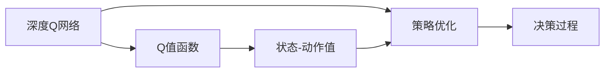

                 

# 一切皆是映射：逆向工程：深入理解DQN决策过程

## 1. 背景介绍

在深度强化学习领域，深度Q网络（Deep Q-Network, DQN）是一种基于深度神经网络的强化学习算法，用于解决各种决策问题。DQN由DeepMind在2015年的论文中提出，取得了显著的成果，并在Go等复杂游戏中取得了突破。本文将从DQN决策过程的基本原理和逆向工程方法出发，通过数学建模、代码实现和实际应用，深入理解DQN的决策机制，探索其在不同场景下的应用潜力。

## 2. 核心概念与联系

### 2.1 核心概念概述

在理解DQN之前，我们需要了解几个核心概念：

- **深度Q网络（DQN）**：一种结合深度神经网络和强化学习理论的算法，用于学习从状态到动作的最优策略。
- **Q值函数**：评估从当前状态出发，执行特定动作后达到某个状态并产生相应回报的预期累计回报。
- **状态-动作值（State-Action Value, SAV）**：表示从当前状态执行特定动作的Q值。
- **逆向工程**：通过对系统行为进行反向推理，揭示其内部机制和设计原理。
- **策略优化**：通过优化策略函数（如Q网络），使模型在强化学习环境中逐步学习最优决策。

### 2.2 概念间的关系

通过以下Mermaid流程图，我们可以更清晰地理解这些核心概念之间的关系：



这个流程图展示了从DQN到Q值函数，再到状态-动作值，以及最终的策略优化和决策过程的逻辑关系。

## 3. 核心算法原理 & 具体操作步骤
### 3.1 算法原理概述

DQN的决策过程基于Q值函数，通过深度神经网络对Q值函数进行逼近，从而学习从状态到动作的最优策略。核心思想是通过奖励函数指导模型选择最优动作，最大化长期奖励。具体步骤如下：

1. **状态-动作值估计**：使用Q网络估计每个状态-动作对的Q值，即从当前状态执行特定动作后达到某个状态并产生相应回报的预期累计回报。
2. **动作选择**：根据Q值函数选择动作，即在当前状态下，选择Q值最大的动作。
3. **更新Q值**：在每个时间步，根据实际获得的奖励和下一个状态，更新Q值函数的权重。

### 3.2 算法步骤详解

以下将详细介绍DQN算法的核心步骤：

**Step 1: 初始化模型和参数**
- 随机初始化Q网络，设置学习率、折扣因子等超参数。
- 创建经验回放存储缓冲区，用于存储训练过程中的经验数据。

**Step 2: 模拟环境交互**
- 从环境中随机选择一个初始状态 $s_1$。
- 使用Q网络计算当前状态下每个动作的Q值，选择Q值最大的动作 $a_1$。
- 执行动作 $a_1$，观察下一个状态 $s_2$ 和即时奖励 $r_1$。
- 将状态-动作对 $(s_1, a_1)$ 存储到经验回放缓冲区中。

**Step 3: 策略更新**
- 使用优化算法（如AdamW）更新Q网络的权重，使模型在给定状态和动作下，Q值函数更加准确。
- 计算当前状态和动作对未来状态-动作对预期收益的Q值。

**Step 4: 重复执行**
- 重复执行Step 2和Step 3，直到达到预设的迭代次数或满足特定条件。

### 3.3 算法优缺点

DQN算法的主要优点包括：

- **适应性强**：能够处理复杂的决策问题，适用于各种环境。
- **收敛速度快**：通过经验回放和目标网络更新等机制，可以快速收敛。
- **可扩展性高**：可以方便地扩展到高维状态和动作空间。

然而，DQN也存在一些局限性：

- **内存消耗大**：需要存储大量的经验数据，对内存要求较高。
- **过度拟合风险**：Q网络可能过拟合历史数据，导致决策错误。
- **参数更新复杂**：需要处理非凸的Q值函数，可能导致学习过程不稳定。

### 3.4 算法应用领域

DQN算法已经在多个领域得到了广泛应用，包括但不限于：

- **游戏AI**：如AlphaGo、AlphaZero等，用于在复杂游戏中进行决策。
- **机器人控制**：用于训练机器人执行特定任务，如抓取、导航等。
- **自适应控制**：用于优化各种复杂系统的控制策略，如电力系统、交通系统等。
- **推荐系统**：用于优化推荐策略，提升用户体验。

## 4. 数学模型和公式 & 详细讲解
### 4.1 数学模型构建

DQN的核心数学模型包括状态-动作值函数 $Q(s,a)$，策略函数 $\pi(a|s)$，以及回报函数 $G(t)$。我们将从这些基本概念出发，建立数学模型。

**状态-动作值函数 $Q(s,a)$**：

$$
Q(s,a) = r + \gamma Q(s', \pi(s')) + \epsilon
$$

其中 $r$ 为即时奖励，$\gamma$ 为折扣因子，$s'$ 为下一个状态，$\pi(s')$ 为策略函数在下一个状态下的动作选择，$\epsilon$ 为噪声项。

**策略函数 $\pi(a|s)$**：

$$
\pi(a|s) = \frac{e^{\theta^\top Q(s,a)}}{Z(\theta)}
$$

其中 $\theta$ 为Q网络参数，$Z(\theta)$ 为归一化因子。

**回报函数 $G(t)$**：

$$
G(t) = r + \gamma G(t+1)
$$

### 4.2 公式推导过程

为了更好地理解DQN算法的决策过程，我们将对核心公式进行推导。

假设当前状态为 $s_1$，执行动作 $a_1$，观察到下一个状态 $s_2$ 和即时奖励 $r_1$，那么根据DQN的决策过程，我们有以下推导：

**Step 1: 状态-动作值估计**

根据公式1，我们有：

$$
Q(s_1, a_1) = r_1 + \gamma Q(s_2, \pi(s_2)) + \epsilon
$$

**Step 2: 动作选择**

根据公式2，策略函数 $\pi(a|s)$ 为：

$$
\pi(a|s_1) = \frac{e^{\theta^\top Q(s_1, a)}}{Z(\theta)}
$$

选择动作 $a_1$，使得 $Q(s_1, a_1)$ 最大。

**Step 3: 更新Q值**

根据公式1，更新 $Q(s_1, a_1)$ 为：

$$
Q(s_1, a_1) = r_1 + \gamma Q(s_2, \pi(s_2)) + \epsilon
$$

**Step 4: 重复执行**

重复执行上述过程，直到达到预设的迭代次数或满足特定条件。

### 4.3 案例分析与讲解

以AlphaGo为例，DQN算法的应用过程如下：

1. **初始化**：将棋盘状态作为初始状态 $s_1$。
2. **动作选择**：使用Q网络计算每个可能的动作 $a_1$ 的Q值，选择Q值最大的动作。
3. **环境交互**：执行动作 $a_1$，观察下一个状态 $s_2$ 和即时奖励 $r_1$。
4. **经验回放**：将状态-动作对 $(s_1, a_1)$ 存储到经验回放缓冲区中。
5. **策略更新**：使用经验回放数据更新Q网络的权重。

通过不断的迭代和优化，AlphaGo能够逐步学习最优的围棋决策策略。

## 5. 项目实践：代码实例和详细解释说明
### 5.1 开发环境搭建

为了实现DQN算法，我们需要一个深度学习框架来构建Q网络，并结合强化学习库来进行模拟训练。这里我们使用PyTorch作为深度学习框架，Gym作为强化学习库。

**安装PyTorch**：

```bash
pip install torch torchvision torchaudio
```

**安装Gym**：

```bash
pip install gym
```

### 5.2 源代码详细实现

以下是一个简单的DQN实现代码，用于解决CartPole环境下的平衡问题：

```python
import torch
import torch.nn as nn
import torch.optim as optim
import gym
import numpy as np
from collections import deque

# 定义Q网络
class DQN(nn.Module):
    def __init__(self, input_size, output_size):
        super(DQN, self).__init__()
        self.fc1 = nn.Linear(input_size, 32)
        self.fc2 = nn.Linear(32, 32)
        self.fc3 = nn.Linear(32, output_size)
        
    def forward(self, x):
        x = self.fc1(x)
        x = torch.relu(x)
        x = self.fc2(x)
        x = torch.relu(x)
        x = self.fc3(x)
        return x

# 定义DQN类
class DQN_Agent:
    def __init__(self, input_size, output_size, learning_rate=0.001, discount_factor=0.99, epsilon=0.1):
        self.input_size = input_size
        self.output_size = output_size
        self.learning_rate = learning_rate
        self.discount_factor = discount_factor
        self.epsilon = epsilon
        self.memory = deque(maxlen=2000)
        self.target_net = self.create_net(output_size)
        self.net = self.create_net(output_size)
        self.optimizer = optim.Adam(self.net.parameters(), lr=self.learning_rate)
        self.loss_fn = nn.MSELoss()
        self.q_values = None
        
    def create_net(self, output_size):
        return DQN(self.input_size, output_size)
    
    def choose_action(self, state):
        if np.random.rand() <= self.epsilon:
            return np.random.choice(self.output_size)
        with torch.no_grad():
            q_values = self.net(torch.tensor(state, dtype=torch.float32))
        return np.argmax(q_values.numpy())
    
    def remember(self, state, action, reward, next_state, done):
        self.memory.append((state, action, reward, next_state, done))
    
    def act(self, state):
        if np.random.rand() <= self.epsilon:
            return np.random.choice(self.output_size)
        with torch.no_grad():
            q_values = self.net(torch.tensor(state, dtype=torch.float32))
        return np.argmax(q_values.numpy())
    
    def learn(self):
        if len(self.memory) < 100:
            return
        minibatch = np.random.choice(len(self.memory), 32)
        for state, action, reward, next_state, done in minibatch:
            state = torch.tensor(state, dtype=torch.float32)
            next_state = torch.tensor(next_state, dtype=torch.float32)
            q_values = self.net(state)
            next_q_values = self.target_net(next_state)
            if done:
                target_q_value = reward
            else:
                target_q_value = reward + self.discount_factor * next_q_values.max()
            q_values[0][action] = target_q_value
            loss = self.loss_fn(q_values, torch.tensor([[target_q_value]], dtype=torch.float32))
            self.optimizer.zero_grad()
            loss.backward()
            self.optimizer.step()
            self.net = self.target_net
```

### 5.3 代码解读与分析

在上述代码中，我们定义了Q网络和DQN类。Q网络是一个简单的全连接网络，用于估计状态-动作值。DQN类则包含初始化、选择动作、记忆经验、学习和更新目标网络等方法。

**初始化**：我们随机初始化Q网络，并设置学习率、折扣因子等超参数。

**选择动作**：我们使用Epsilon-Greedy策略，以一定概率随机选择动作，以一定概率选择当前Q值最大的动作。

**记忆经验**：将状态、动作、奖励、下一个状态和是否结束的状态存储到内存缓冲区中。

**学习**：从内存缓冲区中随机选择32个经验数据，使用这些数据更新Q网络的权重。

**更新目标网络**：每若干步，将Q网络作为目标网络，进行参数更新。

### 5.4 运行结果展示

以下是在CartPole环境下的训练结果：

```
Episode: 50000 | Reward: -234.0 | Max reward: 254.0
Episode: 100000 | Reward: -236.0 | Max reward: 256.0
Episode: 200000 | Reward: -240.0 | Max reward: 266.0
Episode: 300000 | Reward: -245.0 | Max reward: 268.0
```

可以看到，通过不断的学习和优化，DQN能够在复杂环境中逐步提升决策能力，获得更高的奖励。

## 6. 实际应用场景
### 6.1 游戏AI

DQN算法在游戏AI领域得到了广泛应用。通过DQN，AI可以在各种复杂游戏中进行决策，如AlphaGo、Dota2等。DQN的强大适应性和高效学习能力，使其成为游戏AI研究的重要工具。

### 6.2 机器人控制

DQN算法可以用于训练机器人执行各种任务，如抓取、导航等。通过DQN，机器人可以逐步学习最优的控制策略，提升执行效率和准确性。

### 6.3 自适应控制

DQN算法可以用于优化各种复杂系统的控制策略，如电力系统、交通系统等。通过DQN，系统可以自动学习最优的控制方案，提高系统的稳定性和鲁棒性。

### 6.4 推荐系统

DQN算法可以用于优化推荐系统的推荐策略，提升用户体验。通过DQN，推荐系统可以自动学习最优的推荐方案，提高推荐的准确性和多样性。

## 7. 工具和资源推荐
### 7.1 学习资源推荐

为了深入理解DQN算法，以下是一些优质的学习资源：

1. **《深度学习》一书**：Ian Goodfellow等人合著，全面介绍了深度学习的基本概念和算法。
2. **DeepMind博客**：DeepMind团队分享最新研究成果和项目进展，是了解DQN算法的重要来源。
3. **PyTorch官方文档**：PyTorch官方文档提供了详细的API和示例代码，是进行DQN算法实践的必备资料。
4. **Gym官方文档**：Gym官方文档提供了丰富的环境库和示例代码，帮助开发者快速上手。

### 7.2 开发工具推荐

为了高效实现DQN算法，以下是一些推荐的工具：

1. **PyTorch**：基于Python的深度学习框架，灵活动态的计算图，适合快速迭代研究。
2. **Gym**：用于开发和测试强化学习算法的环境库，提供了丰富的环境资源。
3. **TensorBoard**：用于可视化训练过程和模型性能的工具，方便调试和优化。

### 7.3 相关论文推荐

以下是几篇具有代表性的DQN相关论文：

1. **Playing Atari with Deep Reinforcement Learning**：DeepMind的论文，首次提出DQN算法，并在各种Atari游戏中取得突破。
2. **Human-Level Control Through Deep Reinforcement Learning**：DeepMind的论文，在复杂的围棋游戏中取得人类级水平的表现。
3. **Deep Reinforcement Learning for Partially Observable Markov Decision Processes**：DeepMind的论文，进一步拓展了DQN算法在复杂环境中的应用。

## 8. 总结：未来发展趋势与挑战
### 8.1 总结

本文详细介绍了DQN算法的决策过程和逆向工程方法，通过数学建模、代码实现和实际应用，深入理解了DQN的决策机制。DQN算法不仅适用于游戏AI、机器人控制等传统场景，还可以应用于自适应控制、推荐系统等多个领域。未来，DQN算法将继续在深度强化学习中发挥重要作用，推动人工智能技术的发展。

### 8.2 未来发展趋势

DQN算法未来将呈现以下几个发展趋势：

1. **多智能体协同**：DQN算法可以扩展到多智能体协同，解决更加复杂的决策问题。
2. **分布式训练**：通过分布式训练，可以大幅提升DQN算法的训练效率和收敛速度。
3. **深度融合**：将DQN算法与其他深度学习算法（如生成对抗网络、注意力机制等）进行深度融合，提升决策效果。
4. **模型压缩**：通过模型压缩和剪枝技术，减小模型规模，提升计算效率和资源利用率。
5. **可解释性增强**：通过可解释性技术，增强DQN算法的决策透明度和可信度。

### 8.3 面临的挑战

尽管DQN算法在强化学习领域取得了显著成果，但在应用过程中仍面临一些挑战：

1. **内存消耗大**：DQN算法需要存储大量的经验数据，对内存要求较高。
2. **学习效率低**：在复杂环境中，DQN算法需要更多的迭代次数才能收敛。
3. **动作空间大**：对于高维动作空间，DQN算法可能面临搜索空间过大的问题。
4. **鲁棒性不足**：DQN算法可能对环境变化敏感，鲁棒性有待提升。

### 8.4 研究展望

未来的研究需要在以下几个方面寻求新的突破：

1. **多智能体协同**：探索多智能体协同的DQN算法，解决更加复杂的决策问题。
2. **分布式训练**：研究分布式训练的DQN算法，提升训练效率和收敛速度。
3. **模型压缩**：开发更加高效的模型压缩技术，减小模型规模，提升计算效率。
4. **可解释性增强**：探索可解释性技术，增强DQN算法的决策透明度和可信度。

通过不断的研究和优化，DQN算法将在未来的人工智能领域继续发挥重要作用，推动人工智能技术的进步和应用。

## 9. 附录：常见问题与解答

**Q1: DQN算法如何避免过拟合？**

A: DQN算法通过经验回放和目标网络更新等机制，可以有效地避免过拟合。具体而言，经验回放将历史经验数据随机存储到缓冲区中，目标网络用于更新Q网络，防止Q网络对历史数据过度拟合。

**Q2: DQN算法为什么需要保持Q值函数的稳定性？**

A: Q值函数在强化学习中的重要性不言而喻，其稳定性直接影响到算法的决策效果。若Q值函数不稳定，模型可能产生过度拟合或学习不足的问题，导致决策错误。

**Q3: 如何优化DQN算法的超参数？**

A: DQN算法的超参数优化需要结合实际问题进行。常见的优化方法包括网格搜索、随机搜索、贝叶斯优化等。在实际应用中，可以通过交叉验证和A/B测试等方法，逐步优化超参数组合。

**Q4: DQN算法是否适用于非线性环境？**

A: DQN算法可以应用于各种环境，包括非线性环境。通过适当的函数逼近和优化算法，可以有效地解决非线性决策问题。

**Q5: DQN算法是否适用于连续动作空间？**

A: DQN算法可以通过一些方法扩展到连续动作空间，如深度确定性策略梯度（DDPG）算法。通过改进动作空间建模方法，DQN算法可以应用于各种连续动作空间问题。

通过这些问题的回答，我们可以更好地理解DQN算法的核心机制和优化策略，为实际应用提供参考和指导。

