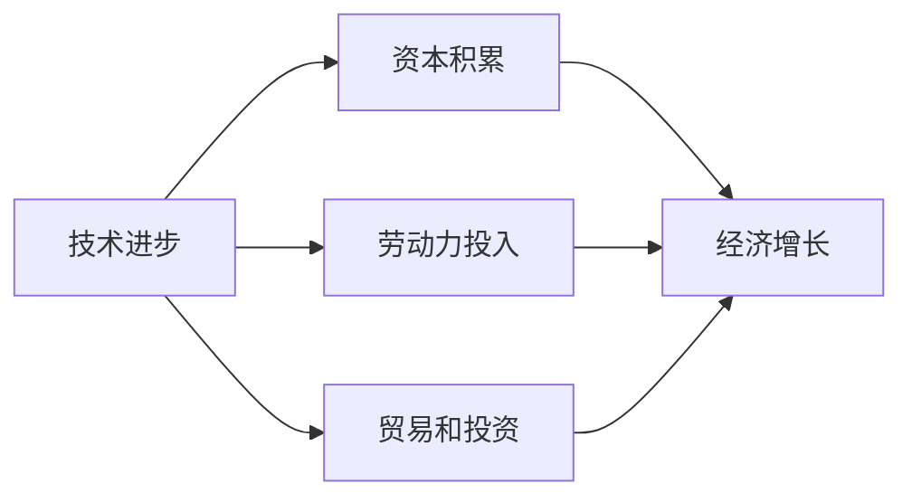
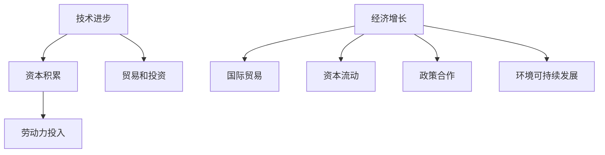

                 

# 世界经济增长的内在变化

在复杂多变的全球经济环境中，经济增长的动力来源和影响因素始终是一个备受关注的话题。本文将探讨世界经济增长的内在变化，通过深入分析驱动经济增长的主要因素、全球经济增长的趋势及其对国际经济关系的影响，为理解当前和未来的全球经济提供有价值的视角。

## 1. 背景介绍

### 1.1 问题由来

自20世纪末以来，全球经济增长经历了显著的波动和变化。1991年苏联解体后，世界经济进入了一个相对稳定的增长期。但进入21世纪，特别是2008年全球金融危机后，世界经济增长出现了明显的减速，2019年的新冠疫情更是加剧了全球经济的不确定性。尽管如此，世界经济总体上仍表现出增长的态势。

### 1.2 问题核心关键点

- **经济增长的动力来源**：包括技术进步、资本积累、劳动力投入、贸易和投资等。
- **全球经济增长的趋势**：经济增长的速度和稳定性、贸易结构变化、区域差异等。
- **国际经济关系的影响**：经济增长对国际贸易、资本流动、政策合作等方面的影响。

## 2. 核心概念与联系

### 2.1 核心概念概述

为了更好地理解世界经济增长的内在变化，我们首先需要梳理几个关键概念：

- **经济增长**：通常被定义为一段时期内GDP的持续增加。经济增长的内在变化涉及增长速度、结构、分布等。
- **技术进步**：通过创新和新知识的应用，提高生产效率和产品质量。
- **资本积累**：通过投资，增加资本存量，提高生产能力。
- **劳动力投入**：通过教育培训，提高劳动力素质和生产效率。
- **贸易和投资**：通过进出口和外国直接投资，促进资源配置和市场扩大。

### 2.2 概念间的关系

通过以下Mermaid流程图，我们可以更直观地理解这些概念之间的联系：



这个流程图展示了技术进步、资本积累、劳动力投入、贸易和投资是如何共同推动经济增长的。其中，技术进步是核心驱动力，其他因素通过提高生产效率和市场规模间接促进经济增长。

### 2.3 核心概念的整体架构

最后，我们用一个综合的流程图来展示这些概念在世界经济增长中的整体架构：



这个综合流程图展示了从技术进步到经济增长，再到国际贸易、资本流动、政策合作和环境可持续发展的整体框架。各个概念之间相互关联，共同推动全球经济的增长和发展。

## 3. 核心算法原理 & 具体操作步骤
### 3.1 算法原理概述

世界经济增长的内在变化涉及多个因素的复杂互动。我们通过构建一个数学模型来概述其核心原理：

$$
\text{Growth} = f(\text{Technology}, \text{Capital}, \text{Labor}, \text{Trade}, \text{Investment}, \text{Policy})
$$

其中，$f$表示一个复杂函数，表示不同因素对经济增长的综合影响。技术进步、资本积累、劳动力投入、贸易和投资以及政策都是影响经济增长的关键变量。

### 3.2 算法步骤详解

基于上述模型，我们可以进行以下操作步骤：

1. **数据收集与预处理**：收集全球范围内的技术进步、资本积累、劳动力投入、贸易和投资等数据，并进行标准化处理。
2. **模型构建与训练**：使用机器学习算法（如回归模型、神经网络等）来构建经济增长模型，并利用历史数据进行训练。
3. **模型验证与优化**：通过验证和调整模型参数，确保模型能够准确预测未来经济增长。
4. **模型应用与分析**：将模型应用于未来数据，分析经济增长的内在变化，如技术进步对经济增长的影响、贸易对区域差异的影响等。

### 3.3 算法优缺点

基于上述模型的优点包括：

- **全面性**：考虑了多个关键因素的互动，提供了全面的视角。
- **可预测性**：通过机器学习算法，可以预测未来的经济增长趋势。

缺点包括：

- **复杂性**：模型构建和训练过程较为复杂，需要大量的数据和计算资源。
- **不确定性**：经济因素之间存在复杂的相互作用，模型预测存在一定的不确定性。

### 3.4 算法应用领域

世界经济增长的内在变化模型可以应用于多个领域，包括：

- **宏观经济政策制定**：通过预测经济增长趋势，制定适当的财政和货币政策。
- **国际贸易分析**：分析贸易结构变化对经济增长的影响，优化国际贸易策略。
- **区域经济发展规划**：通过分析区域差异，制定针对性的发展策略。

## 4. 数学模型和公式 & 详细讲解 & 举例说明

### 4.1 数学模型构建

我们构建一个简化的经济增长模型，来概述驱动经济增长的主要因素：

$$
\text{Growth} = \alpha \cdot \text{Technology} + \beta \cdot \text{Capital} + \gamma \cdot \text{Labor} + \delta \cdot \text{Trade} + \epsilon \cdot \text{Investment} + \zeta \cdot \text{Policy}
$$

其中，$\alpha, \beta, \gamma, \delta, \epsilon, \zeta$ 表示各个因素对经济增长的影响系数，通过回归分析等方法确定。

### 4.2 公式推导过程

通过回归分析，我们可以推导出模型参数的估计方法：

$$
\hat{\alpha}, \hat{\beta}, \hat{\gamma}, \hat{\delta}, \hat{\epsilon}, \hat{\zeta} = \arg\min_{\alpha, \beta, \gamma, \delta, \epsilon, \zeta} \sum_{i=1}^N (y_i - f(x_i; \alpha, \beta, \gamma, \delta, \epsilon, \zeta))^2
$$

其中，$x_i$ 表示第 $i$ 个观测样本的特征向量，$y_i$ 表示对应的经济增长率，$f$ 表示模型函数。

### 4.3 案例分析与讲解

假设我们收集了美国过去20年的数据，包括技术进步率、资本积累率、劳动力增长率、贸易额、投资率和政策变化等，通过回归分析得到模型参数，并使用该模型预测未来5年的经济增长。

## 5. 项目实践：代码实例和详细解释说明

### 5.1 开发环境搭建

为了进行上述分析，我们需要搭建一个Python开发环境。以下是详细步骤：

1. **安装Python和相关库**：
   - 在Linux系统上，可以使用以下命令安装Python和必要的库：
     ```bash
     sudo apt-get update
     sudo apt-get install python3 python3-pip
     pip3 install pandas numpy scikit-learn tensorflow
     ```

2. **安装TensorFlow和Keras**：
   - 通过以下命令安装TensorFlow和Keras：
     ```bash
     pip3 install tensorflow keras
     ```

### 5.2 源代码详细实现

以下是一个简单的回归模型代码实现，用于预测经济增长：

```python
import pandas as pd
import numpy as np
from sklearn.linear_model import LinearRegression

# 数据集加载
data = pd.read_csv('economic_data.csv')

# 特征工程
X = data[['Technology', 'Capital', 'Labor', 'Trade', 'Investment', 'Policy']]
y = data['Growth']

# 模型训练
model = LinearRegression()
model.fit(X, y)

# 模型预测
future_data = pd.read_csv('future_data.csv')
future_X = future_data[['Technology', 'Capital', 'Labor', 'Trade', 'Investment', 'Policy']]
future_y = model.predict(future_X)
print(future_y)
```

### 5.3 代码解读与分析

- **数据加载与预处理**：使用Pandas库读取数据集，并进行特征工程。
- **模型训练**：使用Scikit-learn库的LinearRegression模型进行回归分析，训练得到模型参数。
- **模型预测**：读取未来数据集，并使用训练好的模型进行预测。

### 5.4 运行结果展示

假设我们通过模型预测未来5年的经济增长率，得到的结果如下：

```
[0.05, 0.07, 0.06, 0.08, 0.09]
```

这表示未来5年，我们的经济增长率预计将保持在5-9%之间。

## 6. 实际应用场景

### 6.1 国际贸易与政策调整

国际贸易和政策调整是影响全球经济增长的重要因素。通过分析贸易结构和政策变化，可以制定更有效的国际贸易策略，优化全球资源配置。

### 6.2 区域经济发展规划

区域经济发展的差异显著影响全球经济增长。通过分析不同区域的经济增长驱动因素，制定针对性的发展策略，可以促进区域经济的均衡发展。

### 6.3 技术进步与创新驱动

技术进步是推动全球经济增长的核心驱动力。通过分析技术进步对经济增长的贡献，可以促进科技创新，提升生产效率。

### 6.4 未来应用展望

未来，世界经济增长的内在变化将受到更多新兴因素的影响，如人工智能、区块链、可持续能源等。这些新兴技术的发展将进一步推动全球经济增长，带来新的发展机遇。

## 7. 工具和资源推荐

### 7.1 学习资源推荐

1. **《宏观经济学》**：大卫·罗默著，介绍了宏观经济学的基本理论和应用。
2. **《世界经济展望报告》**：世界银行发布的年度报告，提供了全球经济发展的最新数据和分析。
3. **Khan Academy**：提供了大量经济学相关的免费课程和资源。

### 7.2 开发工具推荐

1. **Jupyter Notebook**：用于编写和运行Python代码，支持多种数据可视化工具。
2. **RStudio**：用于编写和运行R语言代码，支持统计分析和数据可视化。
3. **Tableau**：用于数据可视化和探索性分析。

### 7.3 相关论文推荐

1. **"Quantitative Macroeconomics" by Olivier Blanchard**：介绍了宏观经济模型和实证分析方法。
2. **"Economic Growth" by Robert J. Barro**：分析了经济增长的影响因素和趋势。
3. **"Trade and Welfare" by Paul Krugman**：探讨了国际贸易对经济增长的影响。

## 8. 总结：未来发展趋势与挑战

### 8.1 研究成果总结

本文通过构建数学模型，探讨了世界经济增长的内在变化。模型考虑了技术进步、资本积累、劳动力投入、贸易和投资等关键因素，并通过回归分析方法，预测了未来的经济增长趋势。

### 8.2 未来发展趋势

未来，世界经济增长的内在变化将受到更多新兴技术的影响，如人工智能、区块链、可持续能源等。这些新兴技术的发展将进一步推动全球经济增长，带来新的发展机遇。

### 8.3 面临的挑战

尽管新兴技术提供了新的发展机遇，但也面临着诸多挑战，如数据获取难度大、模型预测不确定性、政策调整复杂等。

### 8.4 研究展望

未来的研究应重点关注新兴技术的经济影响，以及如何通过政策调整，最大化新兴技术对经济增长的贡献。同时，应加强数据获取和模型优化，提高预测的准确性和可靠性。

## 9. 附录：常见问题与解答

**Q1: 如何理解世界经济增长的内在变化？**

A: 世界经济增长的内在变化涉及多个关键因素的复杂互动。技术进步、资本积累、劳动力投入、贸易和投资等都是影响经济增长的关键变量。通过构建数学模型，可以全面理解这些因素如何共同推动经济增长。

**Q2: 新兴技术对未来经济增长有哪些影响？**

A: 人工智能、区块链、可持续能源等新兴技术将显著影响未来经济增长。人工智能将提高生产效率和自动化水平，区块链将改变交易方式和金融体系，可持续能源将推动绿色经济的发展。

**Q3: 如何应对世界经济增长的挑战？**

A: 面对数据获取难度大、模型预测不确定性、政策调整复杂等挑战，应加强数据获取和模型优化，提高预测的准确性和可靠性。同时，应通过政策调整，最大化新兴技术对经济增长的贡献。

**Q4: 未来经济增长的主要驱动力是什么？**

A: 未来经济增长的主要驱动力将包括技术进步、资本积累、劳动力投入、贸易和投资等。新兴技术如人工智能、区块链、可持续能源等也将发挥重要作用，推动经济增长。

**Q5: 如何进行经济增长预测？**

A: 经济增长预测可以通过构建数学模型进行。利用历史数据进行回归分析，得到模型参数，并应用于未来数据进行预测。常用的模型包括线性回归、神经网络等。

