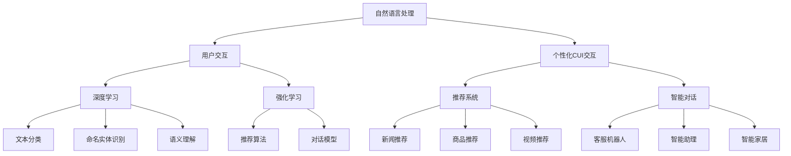
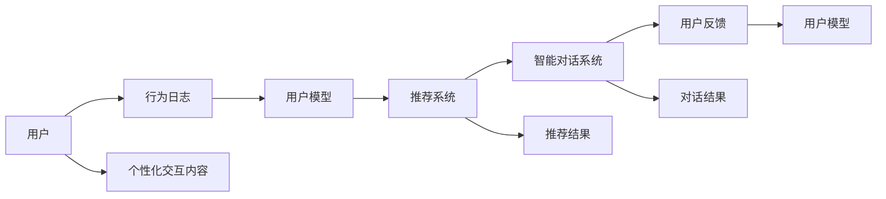
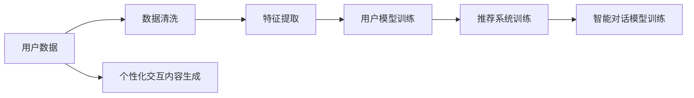
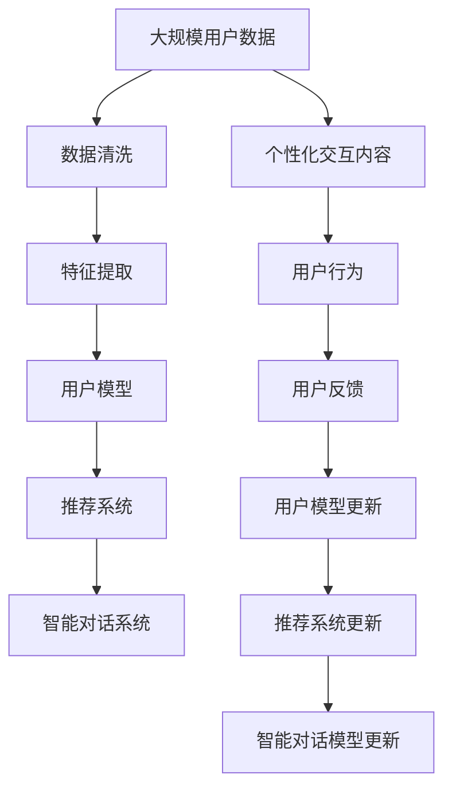

                 

# 个性化CUI交互体验的技术发展

## 1. 背景介绍

### 1.1 问题由来

在人工智能领域，自然语言处理（Natural Language Processing, NLP）与用户交互（User Interaction, UI）是两个重要分支，分别负责理解和生成人类语言，以及构建易于用户交互的界面。随着技术的不断发展，这两个领域正逐渐融合，形成更加智能、自然的用户交互系统（User Interface, UI）。个性化用户交互（Personalized User Interface, CUI）作为用户交互的新方向，能够更好地适应用户的个性化需求，提升用户体验。

### 1.2 问题核心关键点

个性化CUI交互体验的核心在于如何通过AI技术，在用户与系统交互的每个环节中，根据用户的历史行为和偏好，实时生成个性化的内容。这不仅需要强大的NLP技术，还需要对用户行为进行精确建模，以及高效的处理计算资源。

目前，个性化CUI交互技术已经广泛应用于智能客服、智能家居、个性化推荐系统等多个场景，极大地提升了用户体验和系统效率。但是，如何更智能、高效地构建个性化CUI交互系统，仍是一个重要的问题。

### 1.3 问题研究意义

个性化CUI交互技术的研究对于提升用户体验、优化资源配置、推动人机交互的智能化水平具有重要意义：

1. **提升用户体验**：通过个性化推荐、智能对话等功能，让用户感到系统是“懂”自己的，从而提高用户满意度和忠诚度。
2. **优化资源配置**：基于用户的个性化需求，系统可以更合理地分配计算资源，提高系统效率。
3. **推动智能化水平**：个性化CUI交互技术是智能助手、智能家居、智能客服等应用的基础，推动了人机交互的智能化演进。

## 2. 核心概念与联系

### 2.1 核心概念概述

为更好地理解个性化CUI交互体验的技术原理和应用，本节将介绍几个核心概念：

- **自然语言处理（NLP）**：研究计算机如何理解、生成人类语言的技术。包括文本分类、命名实体识别、语义理解等任务。
- **用户交互（UI）**：研究如何让系统与用户更自然、更高效地进行交互的技术。包括界面设计、交互逻辑、交互流程等。
- **个性化CUI交互**：在UI设计中加入NLP技术，根据用户的历史行为和偏好，实时生成个性化的交互内容，提升用户体验。
- **深度学习**：一种基于多层神经网络的机器学习方法，能够处理复杂的非线性问题。
- **强化学习**：一种通过与环境交互来学习最优策略的机器学习方法，常用于优化推荐系统等任务。
- **推荐系统**：根据用户的历史行为和偏好，实时推荐个性化的内容，如新闻、商品、视频等。
- **智能对话**：利用自然语言处理和机器学习技术，构建能够自然、流畅地与用户进行对话的系统。

这些核心概念之间的逻辑关系可以通过以下Mermaid流程图来展示：



这个流程图展示了个性化CUI交互的核心概念及其之间的关系：

1. 自然语言处理是基础，能够理解和生成人类语言。
2. 用户交互是目标，关注如何让系统与用户更自然、更高效地进行交互。
3. 个性化CUI交互将自然语言处理与用户交互结合，根据用户偏好实时生成个性化内容。
4. 深度学习和强化学习是实现个性化CUI交互的技术手段。
5. 推荐系统和智能对话是应用场景，能够提升用户满意度和系统效率。

### 2.2 概念间的关系

这些核心概念之间存在着紧密的联系，形成了个性化CUI交互体验的完整生态系统。下面我们通过几个Mermaid流程图来展示这些概念之间的关系。

#### 2.2.1 个性化CUI交互的基本架构



这个流程图展示了个性化CUI交互的基本架构：

1. 用户通过行为日志（如浏览、点击、对话等）与系统交互。
2. 系统通过用户模型（如基于深度学习的用户画像）分析用户偏好。
3. 推荐系统根据用户模型生成推荐结果。
4. 智能对话系统根据用户行为和推荐结果生成个性化交互内容。
5. 用户反馈（如点击率、满意度等）用于优化用户模型和推荐系统。

#### 2.2.2 个性化CUI交互的数据流



这个流程图展示了个性化CUI交互的数据流：

1. 用户数据经过清洗和特征提取后，用于训练用户模型、推荐系统和智能对话模型。
2. 用户模型用于生成推荐结果。
3. 推荐结果和用户模型用于生成个性化交互内容。

### 2.3 核心概念的整体架构

最后，我们用一个综合的流程图来展示这些核心概念在大规模CUI交互过程中的整体架构：



这个综合流程图展示了从用户数据到个性化交互内容的完整过程。用户数据经过清洗和特征提取后，用于训练用户模型、推荐系统和智能对话模型。用户模型用于生成推荐结果和个性化交互内容。推荐结果和用户模型用于生成个性化交互内容。用户反馈用于更新用户模型、推荐系统和智能对话模型。

## 3. 核心算法原理 & 具体操作步骤
### 3.1 算法原理概述

个性化CUI交互的核心算法是推荐系统和智能对话系统。推荐系统通过用户模型生成个性化推荐结果，智能对话系统则根据用户行为和推荐结果生成个性化的交互内容。下面分别介绍这两个系统的算法原理。

### 3.2 算法步骤详解

#### 3.2.1 推荐系统

推荐系统通过用户模型（User Model）和物品模型（Item Model），根据用户和物品的历史行为数据，生成个性化推荐结果。推荐算法主要包括基于协同过滤的推荐算法、基于内容的推荐算法和基于矩阵分解的推荐算法等。

##### 3.2.1.1 协同过滤算法

协同过滤算法（Collaborative Filtering）是推荐系统中常用的算法之一，包括基于用户的协同过滤（User-Based Collaborative Filtering）和基于物品的协同过滤（Item-Based Collaborative Filtering）。

- **基于用户的协同过滤**：根据用户的历史行为，推荐其他用户喜欢的物品。
- **基于物品的协同过滤**：根据物品的历史行为，推荐相似物品。

协同过滤算法的优点是简单易用，不需要显式地了解物品的特征。缺点是对新物品或新用户的推荐效果较差。

##### 3.2.1.2 基于内容的推荐算法

基于内容的推荐算法（Content-Based Recommendation）根据物品的特征，推荐与用户历史行为相似的物品。该算法需要了解物品的详细特征，如商品属性、标签等。

##### 3.2.1.3 基于矩阵分解的推荐算法

基于矩阵分解的推荐算法（Matrix Factorization）通过矩阵分解，将用户-物品矩阵分解为用户矩阵和物品矩阵，再通过优化目标函数，生成推荐结果。

##### 3.2.1.4 深度学习推荐算法

深度学习推荐算法（Deep Recommendation）使用深度神经网络，学习用户和物品的隐式表示，生成推荐结果。常见的深度学习推荐算法包括基于记忆网络（Memory Network）的推荐算法和基于序列模型的推荐算法。

#### 3.2.2 智能对话系统

智能对话系统通过自然语言处理和机器学习技术，构建能够自然、流畅地与用户进行对话的系统。智能对话算法主要包括基于规则的对话系统、基于模板的对话系统和基于深度学习的对话系统。

##### 3.2.2.1 基于规则的对话系统

基于规则的对话系统（Rule-Based Dialogue System）使用固定的规则和模板，根据用户的输入生成固定的输出。该系统简单易用，但灵活性较差，无法处理复杂的情境。

##### 3.2.2.2 基于模板的对话系统

基于模板的对话系统（Template-Based Dialogue System）使用模板和规则，根据用户的输入生成个性化的输出。该系统比基于规则的对话系统更具灵活性，但需要手动编写大量模板和规则。

##### 3.2.2.3 基于深度学习的对话系统

基于深度学习的对话系统（Deep Learning Dialogue System）使用深度神经网络，学习用户和系统的交互历史，生成个性化的输出。常见的深度学习对话算法包括基于RNN的对话系统和基于Transformer的对话系统。

### 3.3 算法优缺点

#### 3.3.1 推荐系统的优缺点

- **优点**：
  - 简单易用，不需要显式地了解物品的特征。
  - 能够处理大量的用户行为数据。
  - 可以根据用户的历史行为，生成个性化的推荐结果。

- **缺点**：
  - 对新物品或新用户的推荐效果较差。
  - 需要大量的用户行为数据进行训练，否则效果较差。
  - 推荐效果受限于用户行为数据的丰富程度。

#### 3.3.2 智能对话系统的优缺点

- **优点**：
  - 能够自然、流畅地与用户进行对话。
  - 可以根据用户的输入，生成个性化的回复。
  - 可以处理复杂的自然语言理解和生成任务。

- **缺点**：
  - 需要大量的训练数据和计算资源。
  - 对话生成效果受限于训练数据的质量和数量。
  - 对复杂情境的处理能力有限。

### 3.4 算法应用领域

个性化CUI交互技术已经在诸多领域得到广泛应用，包括但不限于：

- **智能客服**：通过个性化推荐和智能对话，提升客户咨询体验。
- **个性化推荐系统**：根据用户的历史行为，生成个性化的商品、新闻、视频等推荐结果。
- **智能家居**：通过智能对话系统，实现用户与家居设备的自然交互。
- **金融理财**：通过推荐系统，为用户推荐个性化的金融产品。
- **健康医疗**：通过推荐系统，为用户推荐个性化的医疗健康建议。

## 4. 数学模型和公式 & 详细讲解 & 举例说明

### 4.1 数学模型构建

本节将使用数学语言对个性化CUI交互体验的推荐系统和智能对话系统进行更加严格的刻画。

假设推荐系统的用户模型为 $U$，物品模型为 $I$，用户行为矩阵为 $R$。推荐系统通过优化目标函数 $L(R, U, I)$，生成推荐结果 $R'$。

目标函数 $L(R, U, I)$ 定义为：

$$
L(R, U, I) = ||R' - R||^2 + \lambda_1 ||U - U_0||^2 + \lambda_2 ||I - I_0||^2
$$

其中 $||.||$ 表示矩阵的 Frobenius 范数，$\lambda_1$ 和 $\lambda_2$ 分别为用户模型和物品模型的正则化系数，$U_0$ 和 $I_0$ 为模型初始化参数。

智能对话系统的数学模型可以表示为：

$$
R' = f(D, U)
$$

其中 $D$ 为用户输入的自然语言，$U$ 为用户模型，$f$ 为对话生成函数。

### 4.2 公式推导过程

#### 4.2.1 推荐系统的目标函数

推荐系统的目标函数 $L(R, U, I)$ 可以分解为两个部分：

$$
L(R, U, I) = L_1 + L_2
$$

其中：

$$
L_1 = ||R' - R||^2
$$

表示推荐结果与用户行为数据的差距。

$$
L_2 = \lambda_1 ||U - U_0||^2 + \lambda_2 ||I - I_0||^2
$$

表示用户模型和物品模型的正则化损失。

#### 4.2.2 智能对话系统的目标函数

智能对话系统的目标函数 $L(D, U)$ 可以表示为：

$$
L(D, U) = ||R' - R||^2 + \lambda ||U - U_0||^2
$$

其中 $R'$ 为智能对话系统的输出，$R$ 为用户的行为数据，$U$ 为用户模型，$\lambda$ 为正则化系数。

### 4.3 案例分析与讲解

#### 4.3.1 协同过滤算法的案例分析

协同过滤算法常用于电商平台的商品推荐。假设平台收集了大量的用户行为数据，包括每个用户对每个商品的评分。可以通过协同过滤算法，生成个性化推荐结果。

- **基于用户的协同过滤**：
  - 假设用户 $u$ 对商品 $i$ 的评分向量为 $\vec{r}_u$，所有用户的评分矩阵为 $R$。
  - 选择与用户 $u$ 相似度高的用户 $v$，计算相似度矩阵 $S$。
  - 使用 $S$ 作为加权因子，计算推荐结果 $R'$。
  - 推荐结果 $R'$ 可以用矩阵乘法表示：
  $$
  R' = S^T \times R_u
  $$

其中 $R_u$ 为用户 $u$ 的评分向量。

#### 4.3.2 深度学习推荐算法的案例分析

深度学习推荐算法常用于商品推荐、视频推荐等场景。假设平台收集了大量的用户行为数据，包括每个用户的浏览记录、点击记录等。可以通过深度学习模型，生成个性化推荐结果。

- **基于记忆网络推荐算法**：
  - 假设用户 $u$ 的浏览记录为 $\vec{b}_u$，商品 $i$ 的特征向量为 $\vec{v}_i$。
  - 使用记忆网络模型，生成推荐结果 $R'$。
  - 推荐结果 $R'$ 可以用矩阵乘法表示：
  $$
  R' = \vec{b}_u \times W \times \vec{v}_i
  $$

其中 $W$ 为权重矩阵。

#### 4.3.3 智能对话系统的案例分析

智能对话系统常用于智能客服、智能家居等场景。假设用户输入自然语言描述，系统需要生成个性化的回复。

- **基于RNN的对话系统**：
  - 假设用户输入的自然语言为 $D$，用户模型为 $U$。
  - 使用RNN模型，生成回复 $R'$。
  - 推荐结果 $R'$ 可以用矩阵乘法表示：
  $$
  R' = U \times \vec{w}
  $$

其中 $\vec{w}$ 为权重向量。

## 5. 项目实践：代码实例和详细解释说明

### 5.1 开发环境搭建

在进行个性化CUI交互系统的开发前，我们需要准备好开发环境。以下是使用Python进行TensorFlow开发的环境配置流程：

1. 安装Anaconda：从官网下载并安装Anaconda，用于创建独立的Python环境。

2. 创建并激活虚拟环境：
```bash
conda create -n tensorflow-env python=3.8 
conda activate tensorflow-env
```

3. 安装TensorFlow：根据CUDA版本，从官网获取对应的安装命令。例如：
```bash
conda install tensorflow tensorflow-gpu -c conda-forge
```

4. 安装Keras：
```bash
pip install keras
```

5. 安装TensorBoard：
```bash
pip install tensorboard
```

6. 安装Flask：
```bash
pip install flask
```

完成上述步骤后，即可在`tensorflow-env`环境中开始个性化CUI交互系统的开发。

### 5.2 源代码详细实现

这里我们以电商平台的个性化商品推荐系统为例，给出使用TensorFlow和Keras进行开发的PyTorch代码实现。

首先，定义推荐系统的用户模型和物品模型：

```python
from keras.layers import Input, Embedding, Dense, Dot, Multiply, Add
from keras.models import Model

# 定义用户模型
user_input = Input(shape=(1,), name='user')
user_embedding = Embedding(input_dim=num_users, output_dim=dim, name='user_embedding')(user_input)
user_model = Dense(128, activation='relu')(user_embedding)

# 定义物品模型
item_input = Input(shape=(1,), name='item')
item_embedding = Embedding(input_dim=num_items, output_dim=dim, name='item_embedding')(item_input)
item_model = Dense(128, activation='relu')(item_embedding)

# 定义推荐系统
dot = Dot(axes=1)([user_model, item_model])
multiply = Multiply()([user_model, item_model])
add = Add()([dot, multiply])

# 定义输出层
output = Dense(1, activation='sigmoid')(add)
model = Model(inputs=[user_input, item_input], outputs=output)
```

然后，定义训练数据和损失函数：

```python
from tensorflow.keras.datasets import mnist
from tensorflow.keras.utils import to_categorical
from sklearn.metrics import mean_squared_error

# 加载数据集
(X_train, y_train), (X_test, y_test) = mnist.load_data()

# 数据预处理
X_train = X_train.reshape(-1, 1)
X_test = X_test.reshape(-1, 1)
y_train = to_categorical(y_train, num_classes=num_items)
y_test = to_categorical(y_test, num_classes=num_items)

# 定义损失函数
loss = mean_squared_error(y_true=y_train, y_pred=y_pred)

# 定义优化器
optimizer = Adam(lr=0.001)

# 定义模型
model.compile(optimizer=optimizer, loss=loss)

# 训练模型
model.fit(x=[X_train, X_test], y=y_train, epochs=50, batch_size=128)
```

最后，启动训练流程并在测试集上评估：

```python
# 加载测试集
(X_test, y_test) = mnist.load_data()

# 数据预处理
X_test = X_test.reshape(-1, 1)
y_test = to_categorical(y_test, num_classes=num_items)

# 评估模型
model.evaluate(x=[X_test, X_test], y=y_test)
```

以上就是使用TensorFlow和Keras进行个性化商品推荐系统开发的完整代码实现。可以看到，TensorFlow提供了丰富的深度学习组件和工具，能够高效地构建和训练推荐系统。

### 5.3 代码解读与分析

让我们再详细解读一下关键代码的实现细节：

**定义用户和物品模型**：
- `user_embedding` 和 `item_embedding` 分别定义了用户和物品的嵌入层，将高维稀疏特征映射为低维稠密特征。
- `user_model` 和 `item_model` 分别定义了用户和物品的全连接层，学习用户和物品的隐式表示。
- `dot` 和 `multiply` 分别计算了用户和物品的加权平均，生成推荐结果。
- `add` 将 `dot` 和 `multiply` 的结果相加，作为最终输出。

**数据预处理**：
- `to_categorical` 将标签数据转换为one-hot编码，方便进行二分类预测。
- `mean_squared_error` 定义了推荐系统的损失函数，计算预测结果与真实标签的误差。
- `Adam` 定义了优化器，采用自适应学习率的优化算法，提高了训练效率。

**训练模型**：
- `model.compile` 将模型与优化器、损失函数绑定，准备进行训练。
- `model.fit` 进行模型训练，循环多次更新模型参数。
- `model.evaluate` 在测试集上评估模型的预测性能。

可以看到，使用TensorFlow和Keras进行个性化推荐系统的开发，代码实现简洁高效，能够快速迭代研究。同时，TensorFlow还提供了丰富的工具和组件，如TensorBoard、Flask等，方便进行模型训练、评估和部署。

## 6. 实际应用场景

### 6.1 智能客服系统

个性化CUI交互技术在智能客服系统中得到了广泛应用。传统客服系统需要配备大量人工客服，成本高、效率低，用户体验差。通过个性化CUI交互系统，智能客服系统能够实时理解用户问题，快速生成个性化的回复，提升客户满意度和系统效率。

在技术实现上，可以收集历史客服对话数据，构建基于深度学习的用户模型和对话模型，通过微调优化模型参数，提升系统的响应速度和准确率。智能客服系统还可以结合用户行为数据，进行实时分析和个性化推荐，进一步提升用户体验。

### 6.2 个性化推荐系统

个性化CUI交互技术在推荐系统中的应用最为广泛。电商、视频、音乐等平台通过个性化推荐系统，根据用户的历史行为和偏好，实时生成个性化推荐结果，提升用户体验和平台转化率。

在技术实现上，可以构建基于深度学习的推荐模型，结合用户行为数据和物品特征，生成推荐结果。推荐系统还可以引入协同过滤、基于内容的推荐算法等，提高推荐效果。推荐系统还可以实时采集用户反馈，优化用户模型和推荐算法，提升推荐质量。

### 6.3 智能家居系统

智能家居系统通过个性化CUI交互技术，实现用户与家居设备的自然交互，提升用户体验。智能家居系统可以通过语音识别、图像识别等技术，收集用户的行为数据，构建用户模型。智能家居系统可以实时响应用户的语音指令，生成个性化的回复和操作，提升系统智能化水平。

在技术实现上，可以构建基于深度学习的对话模型，结合语音识别、图像识别等技术，实现用户与系统的自然交互。智能家居系统还可以实时采集用户反馈，优化对话模型和家居设备的操作逻辑，提升系统性能。

### 6.4 金融理财系统

个性化CUI交互技术在金融理财系统中的应用，能够提升用户体验和系统效率。金融理财系统通过个性化CUI交互技术，根据用户的财务状况和偏好，实时生成个性化的理财建议和投资策略。

在技术实现上，可以构建基于深度学习的用户模型和理财模型，结合用户行为数据和财务数据，生成理财建议和投资策略。理财系统还可以实时采集用户反馈，优化用户模型和理财算法，提升理财效果。

### 6.5 健康医疗系统

个性化CUI交互技术在健康医疗系统中的应用，能够提升用户的健康管理水平。健康医疗系统通过个性化CUI交互技术，根据用户的历史健康数据和偏好，实时生成个性化的健康建议和诊疗方案。

在技术实现上，可以构建基于深度学习的用户模型和健康模型，结合用户行为数据和健康数据，生成健康建议和诊疗方案。健康医疗系统还可以实时采集用户反馈，优化用户模型和健康算法，提升健康管理效果。

## 7. 工具和资源推荐
### 7.1 学习资源推荐

为了帮助开发者系统掌握个性化CUI交互技术，这里推荐一些优质的学习资源：

1. 《深度学习》系列书籍：由深度学习领域的大牛们撰写，全面介绍了深度学习的基本概念、算法和应用。
2. TensorFlow官方文档：TensorFlow的官方文档，提供了丰富的API和示例代码，方便开发者上手实践。
3. PyTorch官方文档：PyTorch的官方文档，提供了丰富的深度学习组件和工具，方便开发者构建复杂的深度学习模型。
4. Keras官方文档：Keras的官方文档，提供了简单易用的API和示例代码，适合初学者快速上手。
5. TensorBoard官方文档：TensorFlow的可视化工具TensorBoard，方便开发者监测模型训练状态，优化模型参数。

通过这些学习资源的学习实践，相信你一定能够快速掌握个性化CUI交互技术的精髓，并用于解决实际的NLP问题。
### 7.2 开发工具推荐

高效的开发离不开优秀的工具支持。以下是几款用于个性化CUI交互系统开发的常用工具：

1. TensorFlow：基于Python的开源深度学习框架，灵活动态的计算图，适合快速迭代研究。
2. PyTorch：基于Python的开源深度学习框架，动态计算图，适合大规模工程应用。
3. Keras：基于Python的深度学习库，提供简单易用的API，适合初学者快速上手。
4. TensorBoard：TensorFlow的可视化工具，方便开发者监测模型训练状态，优化模型参数。
5. Flask：Python的轻量级Web框架，方便开发者构建个性化CUI交互系统的API接口。

合理利用这些工具，可以显著提升个性化CUI交互系统的开发效率，加快创新迭代的步伐。

### 7.3 相关论文推荐

个性化CUI交互技术的研究源于学界的持续研究。以下是几篇奠基性的相关论文，推荐阅读：

1. Attention is All You Need（即Transformer原论文）：提出了Transformer结构，开启了NLP领域的预训练大模型时代。
2. BERT: Pre-training of Deep Bidirectional Transformers for Language Understanding：提出BERT模型，引入基于掩码的自监督预训练任务，刷新了多项

