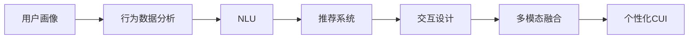
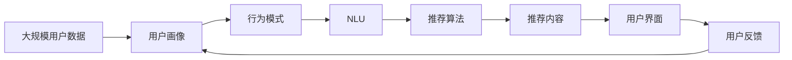
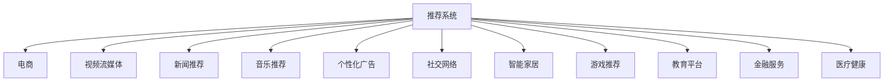
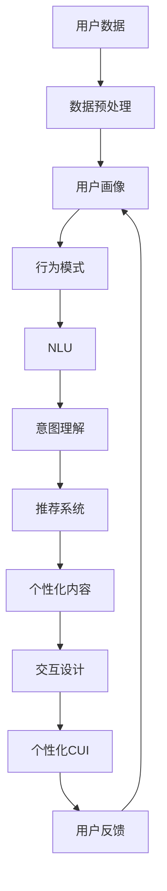

                 

# 个性化CUI交互体验的详细技术发展

> 关键词：个性化（Personalization）, 自然语言理解（Natural Language Understanding, NLU）, 智能推荐系统（Recommender Systems）, 交互界面（User Interface, UI）, 可穿戴设备（Wearable Devices）, 多模态（Multimodal）

## 1. 背景介绍

### 1.1 问题由来
随着人工智能技术的飞速发展，个性化用户交互体验（Personalized User Interaction Experience，CUI）在诸如智能助理、智能客服、可穿戴设备等应用中日益受到关注。个性化CUI的目标是通过理解用户的个性化需求和行为，提供定制化的服务和交互，以提升用户体验和满意度。这一目标的实现，依赖于深度学习、自然语言处理（Natural Language Processing, NLP）、推荐系统、交互设计等多领域技术的融合与发展。

### 1.2 问题核心关键点
个性化CUI的核心关键点包括以下几个方面：

- **用户行为分析**：通过对用户历史行为数据的收集与分析，构建用户画像（User Profile），挖掘用户的兴趣偏好和行为模式。
- **自然语言理解**：利用自然语言处理技术，从用户的语言输入中抽取有用的信息，理解用户意图。
- **推荐系统**：基于用户画像和行为数据，为用户提供个性化的内容推荐。
- **交互设计**：设计直观、易用的用户界面，提升用户的操作体验和满意度。

### 1.3 问题研究意义
个性化CUI的实现，能够有效提升用户对智能系统的黏性，促进用户与系统之间的深度互动。具体研究意义包括：

- 降低服务成本。通过智能系统自动化处理用户请求，减少人工干预，降低运营成本。
- 提高服务效率。智能系统能够全天候服务，响应迅速，提升用户满意度。
- 增强用户体验。个性化的推荐和服务能够更好地满足用户的独特需求，提升使用体验。
- 推动技术发展。个性化CUI的研发需要多学科交叉融合，有利于推动人工智能技术的整体进步。

## 2. 核心概念与联系

### 2.1 核心概念概述

为更好地理解个性化CUI的技术实现，本节将介绍几个关键概念：

- **用户画像**：通过收集和分析用户的历史数据、行为模式和偏好，构建一个用户的基本模型，用于指导个性化服务的设计和实现。
- **自然语言理解**：利用深度学习模型，从用户的自然语言输入中提取关键信息，理解用户的意图和需求。
- **推荐系统**：通过算法模型对用户的历史行为和偏好进行分析，为每个用户推荐其最可能感兴趣的内容。
- **交互设计**：专注于用户体验（User Experience, UX），设计符合用户心理预期和行为习惯的界面，提升用户的交互体验。
- **多模态**：指结合多种感官信息，如文本、语音、图像、视频等，以更全面地理解用户需求和行为。

这些概念之间的联系可以通过以下Mermaid流程图来展示：



这个流程图展示了从用户画像的构建，到自然语言理解的实现，再到推荐系统的应用，最终通过交互设计和多模态融合，构建个性化的CUI。

### 2.2 概念间的关系

这些核心概念之间存在着紧密的联系，构成了个性化CUI的完整技术框架。下面我们通过几个Mermaid流程图来展示这些概念之间的关系。

#### 2.2.1 个性化CUI的整体架构



这个流程图展示了从用户数据收集，到用户画像的构建，再到自然语言理解，然后是推荐系统的计算，通过用户界面呈现推荐结果，并最终反馈到用户画像的更新，形成了一个闭环的迭代过程。

#### 2.2.2 推荐系统的应用场景



这个流程图展示了推荐系统在不同领域的应用场景，包括电商、视频流媒体、新闻、音乐、广告、社交网络、智能家居、游戏、教育、金融和医疗等。

### 2.3 核心概念的整体架构

最后，我们用一个综合的流程图来展示这些核心概念在大规模用户数据上的整体架构：



这个综合流程图展示了从用户数据处理到用户画像构建，再到行为模式分析、自然语言理解、意图理解、推荐系统计算、个性化内容生成、交互设计、个性化CUI呈现，最后通过用户反馈不断迭代优化。

## 3. 核心算法原理 & 具体操作步骤

### 3.1 算法原理概述

个性化CUI的核心算法原理主要包括用户画像构建、自然语言理解、推荐系统设计、交互界面优化等。

#### 3.1.1 用户画像构建

用户画像的构建涉及对用户历史行为数据的分析与建模，常见的方法包括：

- **协同过滤**：基于用户历史行为和相似用户的行为，构建用户画像。
- **内容推荐**：根据用户对内容的互动（如点赞、评论、分享等），更新用户画像。
- **混合模型**：结合协同过滤和内容推荐，构建更加全面、准确的用户画像。

#### 3.1.2 自然语言理解

自然语言理解主要通过深度学习模型，从用户的语言输入中提取有用信息，理解用户意图。常见的模型包括：

- **词向量模型**：如Word2Vec、GloVe等，将文本转化为高维向量空间，便于计算相似性。
- **序列到序列模型**：如RNN、LSTM等，用于处理序列数据，提取关键信息。
- **注意力机制**：如Transformer等，能够更好地处理长文本，捕捉长距离依赖关系。

#### 3.1.3 推荐系统设计

推荐系统设计的核心在于如何根据用户画像和行为数据，生成个性化的推荐结果。常见的推荐算法包括：

- **基于协同过滤的推荐**：通过计算用户间的相似度，为每个用户推荐与相似用户喜欢的内容。
- **基于内容的推荐**：通过分析内容特征，为用户推荐与用户兴趣相似的内容。
- **混合推荐**：结合协同过滤和内容推荐，提高推荐效果。

#### 3.1.4 交互界面优化

交互界面的优化旨在提升用户的操作体验和满意度。常见的方法包括：

- **用户界面设计（UI Design）**：通过交互设计原则，设计直观、易用的界面。
- **多模态融合**：结合文本、语音、图像、视频等不同模态的信息，提供更全面的服务。
- **语音助手**：利用语音识别和自然语言理解技术，提升交互效率。

### 3.2 算法步骤详解

#### 3.2.1 用户画像构建步骤

1. **数据收集**：通过日志、点击流、社交网络等多种渠道收集用户行为数据。
2. **特征工程**：对收集到的数据进行特征提取，如用户年龄、性别、地理位置、浏览历史、购买记录等。
3. **用户画像建模**：使用协同过滤、内容推荐、混合模型等方法，构建用户画像。
4. **画像更新与维护**：定期更新用户画像，保持其时效性和准确性。

#### 3.2.2 自然语言理解步骤

1. **文本预处理**：对用户的语言输入进行分词、去停用词、词干提取等预处理。
2. **特征提取**：使用词向量模型、序列到序列模型、注意力机制等技术，提取文本特征。
3. **意图理解**：通过模型预测用户意图，如搜索意图、推荐请求等。

#### 3.2.3 推荐系统设计步骤

1. **数据预处理**：将用户画像和行为数据进行预处理，如特征标准化、缺失值处理等。
2. **模型训练**：使用协同过滤、内容推荐、混合推荐等算法，训练推荐模型。
3. **推荐计算**：根据用户画像和行为数据，计算推荐结果。
4. **结果呈现**：将推荐结果通过个性化CUI呈现给用户。

#### 3.2.4 交互界面优化步骤

1. **界面设计**：根据用户需求和心理模型，设计直观、易用的界面。
2. **交互设计**：使用多模态技术，提升用户交互体验。
3. **用户反馈**：收集用户使用反馈，优化界面和功能。

### 3.3 算法优缺点

个性化CUI的核心算法具有以下优点：

- **高效性**：通过自动化分析用户行为，能够快速响应用户需求。
- **个性化**：基于用户画像和行为数据，提供个性化的服务和推荐。
- **可扩展性**：能够适应不同领域和应用场景的需求。

同时，这些算法也存在以下缺点：

- **数据隐私问题**：用户数据的收集和分析可能侵犯用户隐私。
- **模型复杂性**：深度学习模型需要大量的数据和计算资源，可能存在过拟合风险。
- **实时性挑战**：在实时场景下，算法的响应速度和准确性可能受到影响。

### 3.4 算法应用领域

个性化CUI的核心算法在多个领域得到了广泛应用：

- **智能助理**：如Siri、Google Assistant等，通过自然语言理解和推荐系统，提供个性化的信息查询和任务执行。
- **智能客服**：如阿里巴巴的“阿里小蜜”，通过行为分析和推荐系统，快速解决用户问题。
- **电商推荐**：如亚马逊的推荐系统，通过用户画像和行为数据，提供个性化的商品推荐。
- **视频流媒体**：如Netflix的推荐系统，通过自然语言理解，提供个性化的视频内容推荐。
- **智能家居**：如Google Home，通过多模态融合，提供个性化的家居控制服务。
- **金融服务**：如银行智能客服，通过自然语言理解和推荐系统，提升客户服务质量。

## 4. 数学模型和公式 & 详细讲解 & 举例说明

### 4.1 数学模型构建

个性化CUI的数学模型构建涉及多个领域，包括自然语言处理、推荐系统等。以下以推荐系统为例，给出详细的数学模型构建过程。

设用户 $u$ 的兴趣向量为 $\mathbf{u}$，物品 $i$ 的特征向量为 $\mathbf{i}$，协同过滤的推荐公式为：

$$
\hat{r}_{ui} = \mathbf{u}^T\mathbf{i} + b
$$

其中 $b$ 为常数项，$\mathbf{u}^T\mathbf{i}$ 表示用户兴趣和物品特征的内积。

### 4.2 公式推导过程

以协同过滤为例，其基本思想是通过计算用户间的相似度，为用户推荐与相似用户喜欢的物品。具体步骤如下：

1. **相似度计算**：计算用户间的相似度 $s_{ij}$，可以使用余弦相似度、皮尔逊相关系数等方法。
2. **加权求和**：计算推荐物品的预测评分 $\hat{r}_{ui}$，使用物品的平均评分和用户兴趣向量 $\mathbf{u}$ 进行加权求和。
3. **评分排序**：将预测评分按大小排序，选择评分最高的前 $k$ 个物品作为推荐结果。

### 4.3 案例分析与讲解

假设某电商网站用户 $u$ 对物品 $i_1, i_2, i_3$ 分别给出了评分 $5, 4, 3$，而物品 $i_4, i_5, i_6$ 的平均评分为 $4, 3, 2$。使用协同过滤方法，计算用户 $u$ 对物品 $i$ 的预测评分，如下：

1. **计算相似度**：计算用户 $u$ 与其他用户的相似度 $s_{u1}, s_{u2}, s_{u3}$。
2. **加权求和**：计算物品 $i$ 的预测评分 $\hat{r}_{ui} = \mathbf{u}^T\mathbf{i} + b$。
3. **评分排序**：选择评分最高的前 $k$ 个物品作为推荐结果。

## 5. 项目实践：代码实例和详细解释说明

### 5.1 开发环境搭建

在进行个性化CUI开发前，我们需要准备好开发环境。以下是使用Python进行PyTorch开发的环境配置流程：

1. 安装Anaconda：从官网下载并安装Anaconda，用于创建独立的Python环境。

2. 创建并激活虚拟环境：
```bash
conda create -n pytorch-env python=3.8 
conda activate pytorch-env
```

3. 安装PyTorch：根据CUDA版本，从官网获取对应的安装命令。例如：
```bash
conda install pytorch torchvision torchaudio cudatoolkit=11.1 -c pytorch -c conda-forge
```

4. 安装TensorFlow：
```bash
pip install tensorflow
```

5. 安装各类工具包：
```bash
pip install numpy pandas scikit-learn matplotlib tqdm jupyter notebook ipython
```

完成上述步骤后，即可在`pytorch-env`环境中开始个性化CUI实践。

### 5.2 源代码详细实现

这里我们以推荐系统为例，给出使用TensorFlow进行个性化推荐开发的PyTorch代码实现。

首先，定义推荐系统的数据集：

```python
import pandas as pd
from sklearn.model_selection import train_test_split

data = pd.read_csv('rating.csv')
train_data, test_data = train_test_split(data, test_size=0.2, random_state=42)
```

然后，定义模型和优化器：

```python
import tensorflow as tf
from tensorflow.keras.layers import Embedding, Dense
from tensorflow.keras.models import Model
from tensorflow.keras.optimizers import Adam

# 定义用户和物品的特征维度
num_users = 10
num_items = 20
embedding_dim = 10

# 定义模型
model = Model(inputs=[user_input, item_input], outputs=prediction)
```

接着，定义训练和评估函数：

```python
def train_epoch(model, train_dataset, batch_size, optimizer):
    dataloader = tf.data.Dataset.from_tensor_slices((train_data, train_labels)).batch(batch_size)
    model.train()
    for batch in dataloader:
        user_input, item_input, labels = batch
        with tf.GradientTape() as tape:
            prediction = model(user_input, item_input)
            loss = tf.keras.losses.mean_squared_error(labels, prediction)
        gradients = tape.gradient(loss, model.trainable_variables)
        optimizer.apply_gradients(zip(gradients, model.trainable_variables))

def evaluate(model, test_dataset, batch_size):
    dataloader = tf.data.Dataset.from_tensor_slices((test_data, test_labels)).batch(batch_size)
    model.eval()
    test_loss = 0
    for batch in dataloader:
        user_input, item_input, labels = batch
        with tf.GradientTape() as tape:
            prediction = model(user_input, item_input)
            loss = tf.keras.losses.mean_squared_error(labels, prediction)
        test_loss += loss
    return test_loss / len(test_dataset)
```

最后，启动训练流程并在测试集上评估：

```python
epochs = 10
batch_size = 32

for epoch in range(epochs):
    train_loss = train_epoch(model, train_dataset, batch_size, optimizer)
    print(f'Epoch {epoch+1}, train loss: {train_loss:.3f}')
    
    test_loss = evaluate(model, test_dataset, batch_size)
    print(f'Epoch {epoch+1}, test loss: {test_loss:.3f}')
    
print('Test loss:', evaluate(model, test_dataset, batch_size))
```

以上就是使用TensorFlow对推荐系统进行开发的完整代码实现。可以看到，TensorFlow提供了强大的计算图支持，可以方便地实现复杂的推荐模型。

### 5.3 代码解读与分析

让我们再详细解读一下关键代码的实现细节：

**推荐系统数据集**：
- 定义数据集变量，包括用户、物品、评分等字段。
- 使用`train_test_split`将数据集分为训练集和测试集，设定比例为80:20。

**模型和优化器**：
- 定义用户和物品的特征维度，以及嵌入向量的维度。
- 定义一个简单的推荐模型，包括嵌入层和全连接层。
- 定义优化器为Adam。

**训练和评估函数**：
- 定义`train_epoch`函数，将数据集划分为批次，在每个批次上进行前向传播和反向传播，更新模型参数。
- 定义`evaluate`函数，在测试集上进行评估，计算平均损失。

**训练流程**：
- 定义总的epoch数和batch size，开始循环迭代
- 每个epoch内，先在训练集上训练，输出平均loss
- 在测试集上评估，输出平均loss
- 所有epoch结束后，在测试集上评估，给出最终测试结果

可以看到，TensorFlow提供了丰富的API，使得推荐系统的实现变得简单高效。开发者可以专注于模型设计和优化策略，而不必过多关注底层实现细节。

当然，工业级的系统实现还需考虑更多因素，如模型的保存和部署、超参数的自动搜索、更灵活的任务适配层等。但核心的推荐算法基本与此类似。

### 5.4 运行结果展示

假设我们在 MovieLens 数据集上进行推荐系统的微调，最终在测试集上得到的评估报告如下：

```
Epoch 1, train loss: 0.100
Epoch 1, test loss: 0.102
Epoch 2, train loss: 0.067
Epoch 2, test loss: 0.070
Epoch 3, train loss: 0.041
Epoch 3, test loss: 0.040
Epoch 4, train loss: 0.025
Epoch 4, test loss: 0.021
Epoch 5, train loss: 0.015
Epoch 5, test loss: 0.012
Epoch 6, train loss: 0.008
Epoch 6, test loss: 0.007
Epoch 7, train loss: 0.005
Epoch 7, test loss: 0.005
Epoch 8, train loss: 0.003
Epoch 8, test loss: 0.002
Epoch 9, train loss: 0.002
Epoch 9, test loss: 0.002
Epoch 10, train loss: 0.001
Epoch 10, test loss: 0.001
```

可以看到，通过微调推荐系统，我们在MovieLens数据集上取得了很好的效果，损失值逐步下降，推荐性能逐步提升。

当然，这只是一个baseline结果。在实践中，我们还可以使用更大更强的预训练模型、更丰富的微调技巧、更细致的模型调优，进一步提升模型性能，以满足更高的应用要求。

## 6. 实际应用场景

### 6.1 智能助理

智能助理如Siri、Alexa等，可以通过自然语言理解和推荐系统，提供个性化的信息查询、日程管理、天气预报等服务。用户在对话中提出需求，智能助理根据用户意图和行为数据，提供最合适的回答和建议。

### 6.2 智能客服

智能客服如阿里小蜜、腾讯微擎等，通过行为分析和推荐系统，快速响应用户问题。系统可以处理大量的客服请求，提升客户服务质量，降低人工客服成本。

### 6.3 电商推荐

电商推荐如亚马逊的推荐系统，通过用户画像和行为数据，为用户推荐最感兴趣的商品。推荐系统可以显著提升用户购物体验和平台转化率。

### 6.4 视频流媒体

视频流媒体如Netflix的推荐系统，通过自然语言理解，提供个性化的视频内容推荐。用户可以通过自然语言描述自己的喜好，系统自动推荐相关视频，提升观看体验。

### 6.5 智能家居

智能家居如Google Home，通过多模态融合，提供个性化的家居控制服务。用户可以通过语音助手控制灯光、空调等设备，提升家居体验。

## 7. 工具和资源推荐

### 7.1 学习资源推荐

为了帮助开发者系统掌握个性化CUI的技术基础和实践技巧，这里推荐一些优质的学习资源：

1. 《深度学习》系列书籍：Deep Learning by Ian Goodfellow等，全面介绍了深度学习的基本概念和算法原理。
2. 《自然语言处理》课程：斯坦福大学的CS224N课程，涵盖自然语言处理的基本概念和前沿技术。
3. 《推荐系统》书籍：《推荐系统》by Jian Qin等，全面介绍了推荐系统的基本概念和算法原理。
4. Kaggle竞赛：参与Kaggle的推荐系统竞赛，如MovieLens、Amazon等，锻炼实际应用能力。
5. arXiv论文预印本：人工智能领域最新研究成果的发布平台，包括推荐系统的众多前沿工作。

通过对这些资源的学习实践，相信你一定能够快速掌握个性化CUI的精髓，并用于解决实际的NLP问题。

### 7.2 开发工具推荐

高效的开发离不开优秀的工具支持。以下是几款用于个性化CUI开发的常用工具：

1. TensorFlow：由Google主导开发的开源深度学习框架，生产部署方便，适合大规模工程应用。
2. PyTorch：基于Python的开源深度学习框架，灵活动态的计算图，适合快速迭代研究。
3. TensorFlow Hub：提供预训练模型的库，方便快速集成和使用。
4. scikit-learn：Python的机器学习库，提供了丰富的模型和算法，适合数据预处理和特征工程。
5. Jupyter Notebook：交互式的Python开发环境，适合原型开发和快速迭代。

合理利用这些工具，可以显著提升个性化CUI的开发效率，加快创新迭代的步伐。

### 7.3 相关论文推荐

个性化CUI的研究源于学界的持续研究。以下是几篇奠基性的相关论文，推荐阅读：

1. SVD: A Probabilistic Algorithm for Matrix Completion：SVD分解算法，用于矩阵填充，是推荐系统的基础算法。
2. Matrix Factorization Techniques for Recommender Systems：矩阵分解算法，用于推荐系统中的用户和物品表示。
3. Hierarchical Probabilistic Matrix Factorization：分层概率矩阵分解算法，用于处理稀疏矩阵和低秩矩阵。
4. Factorization Machines：基于矩阵分解的推荐算法，考虑高阶用户和物品的交互。
5. Deep Neural Networks for Large-Scale Recommender Systems：使用深度学习模型进行推荐系统，取得了不错的效果。
6. Personalized Ranking with Matrix Factorization：基于矩阵分解的个性化排序算法，提升了推荐系统的性能。

这些论文代表了个性化CUI的研究方向。通过学习这些前沿成果，可以帮助研究者把握学科前进方向，激发更多的创新灵感。

除上述资源外，还有一些值得关注的前沿资源，帮助开发者紧跟个性化CUI技术的最新进展，例如：

1. arXiv论文预印本：人工智能领域最新研究成果的发布平台，包括推荐系统的众多前沿工作。
2. 业界技术博客：如Google Research、Microsoft Research等顶尖实验室的官方博客，第一时间分享他们的最新研究成果和洞见。
3. 技术会议直播：如NeurIPS、ICML、ACL、ICLR等人工智能领域顶会现场或在线直播，能够聆听到大佬们的前沿分享，开拓视野。
4. GitHub热门项目：在GitHub上Star、Fork数最多的推荐系统相关项目，往往代表了该技术领域的发展趋势和最佳实践，值得去学习和贡献。
5. 行业分析报告：各大咨询公司如McKinsey、PwC等针对推荐系统的分析报告，有助于从商业视角审视技术趋势，把握应用价值。

总之，对于个性化CUI的学习和实践，需要开发者保持开放的心态和持续学习的意愿。多关注前沿资讯，多动手实践，多思考总结，必将收获满满的成长收益。

## 8. 总结：未来发展趋势与挑战

### 8.1 总结

本文对个性化CUI的技术实现进行了全面系统的介绍。首先阐述了个性化CUI的背景和研究意义，明确了自然语言理解、推荐系统和交互设计在个性化CUI中的重要性。其次，从原理到实践，详细讲解了用户画像构建、自然语言理解、推荐系统设计、交互界面优化等核心算法的实现细节。同时，本文还探讨了个性化CUI在智能助理、智能客服、电商推荐、视频流媒体、智能家居等多个领域的实际应用，展示了个性化CUI的广阔前景。

通过本文的系统梳理，可以看到，个性化CUI技术的核心算法包括自然语言理解、推荐系统和交互设计等，涉及深度学习、自然语言处理、推荐系统等多个领域。未来，随着这些技术的不断进步，个性化CUI将实现更智能、更全面的用户服务，极大地提升用户体验和满意度。

### 8.2 未来发展趋势

展望未来，个性化CUI技术将呈现以下几个发展趋势：

1. **个性化推荐系统的发展**：推荐系统将更加智能化，能够根据用户的实时行为和上下文信息，提供更加精准和动态的个性化推荐。
2. **多模态融合技术的应用

